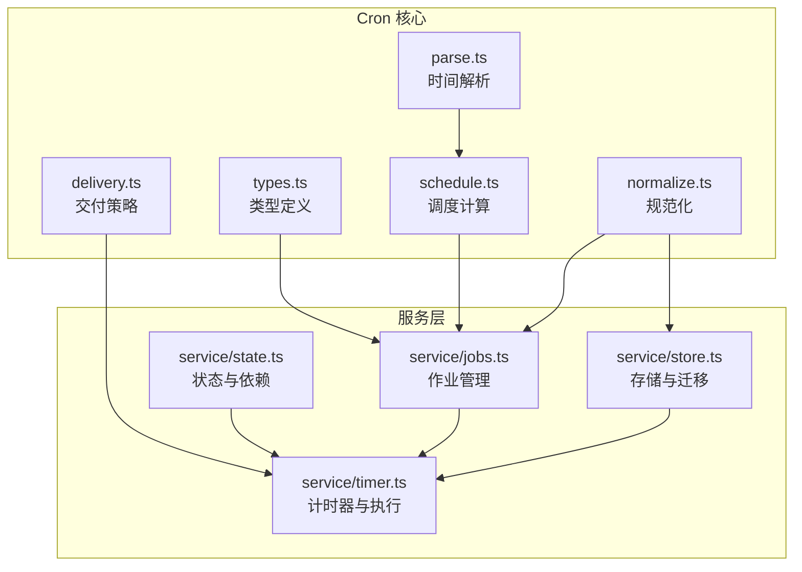
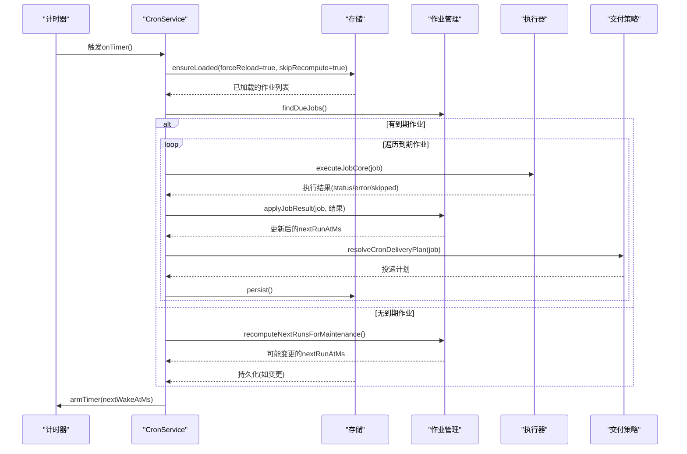
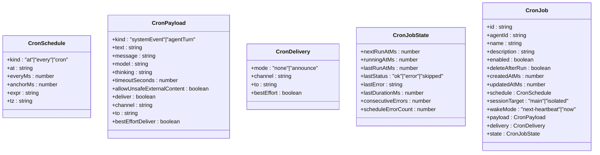
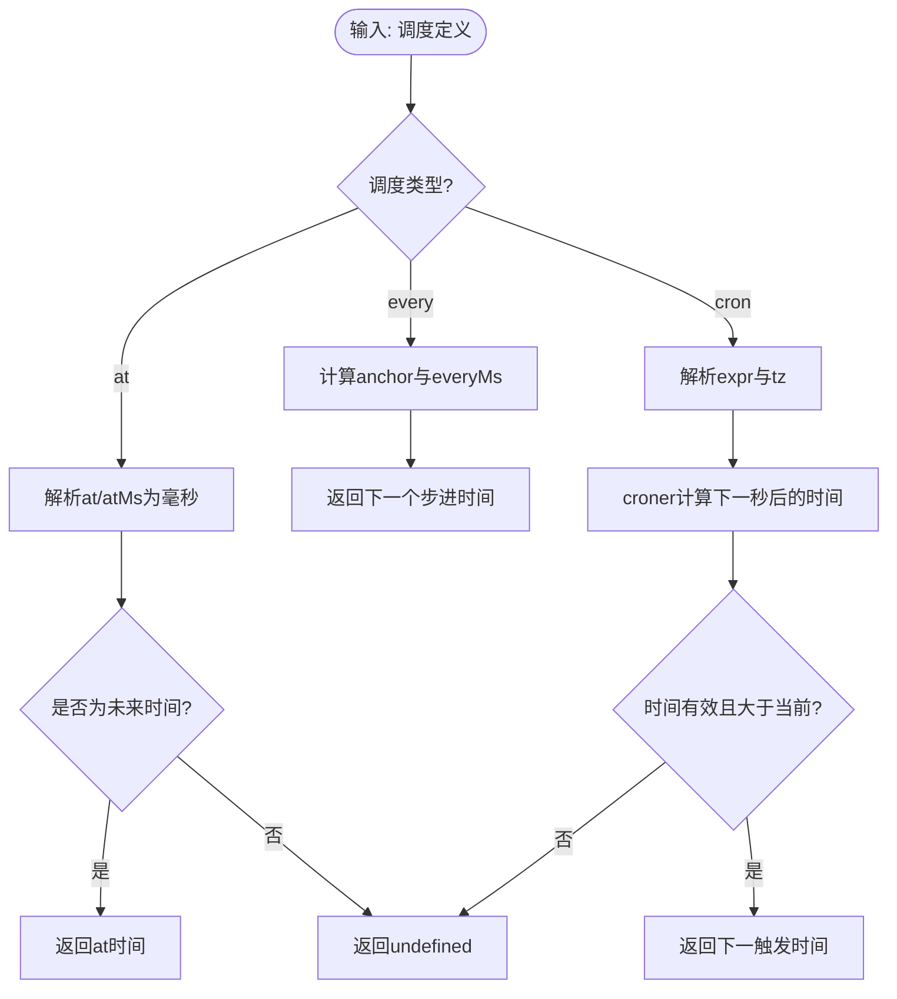
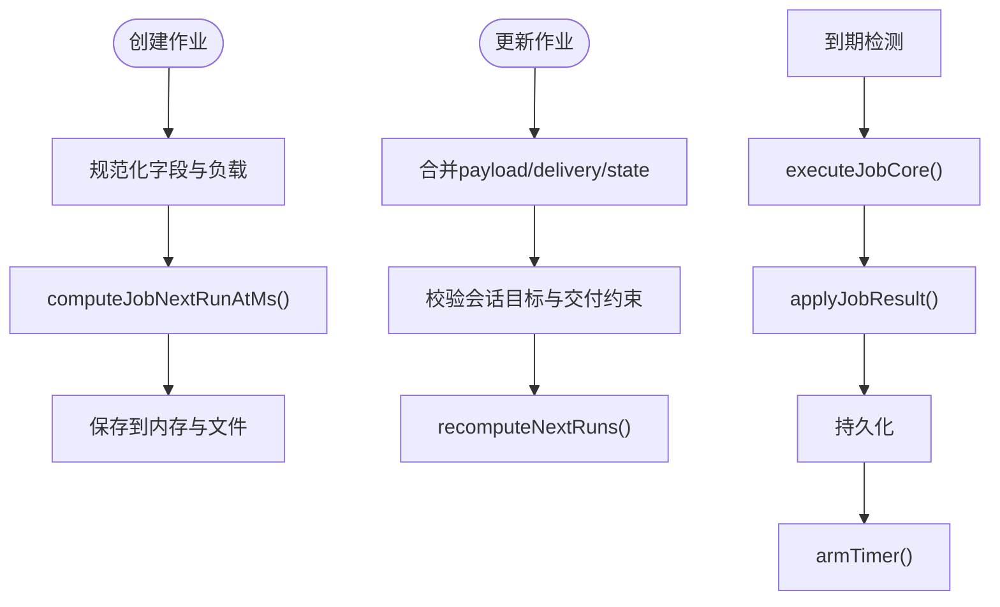
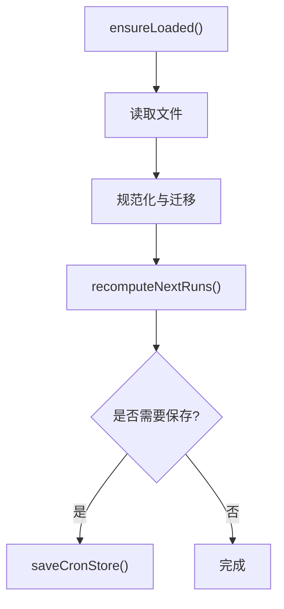
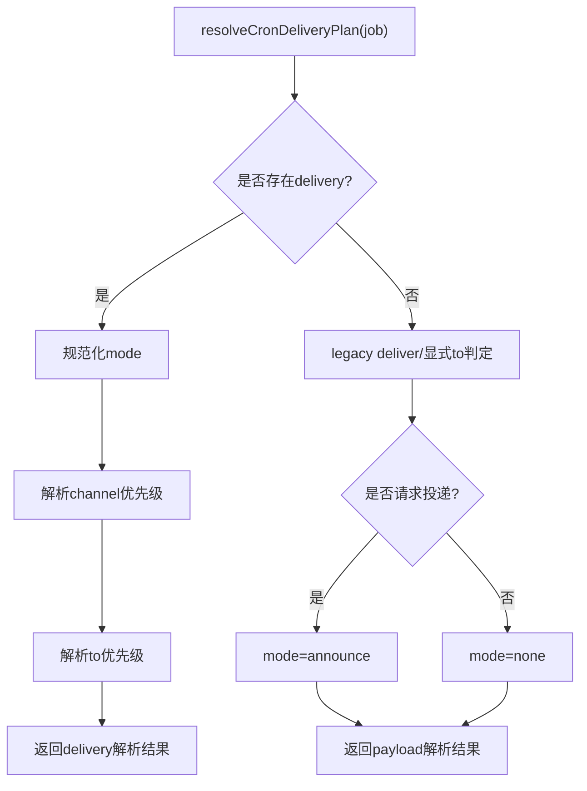
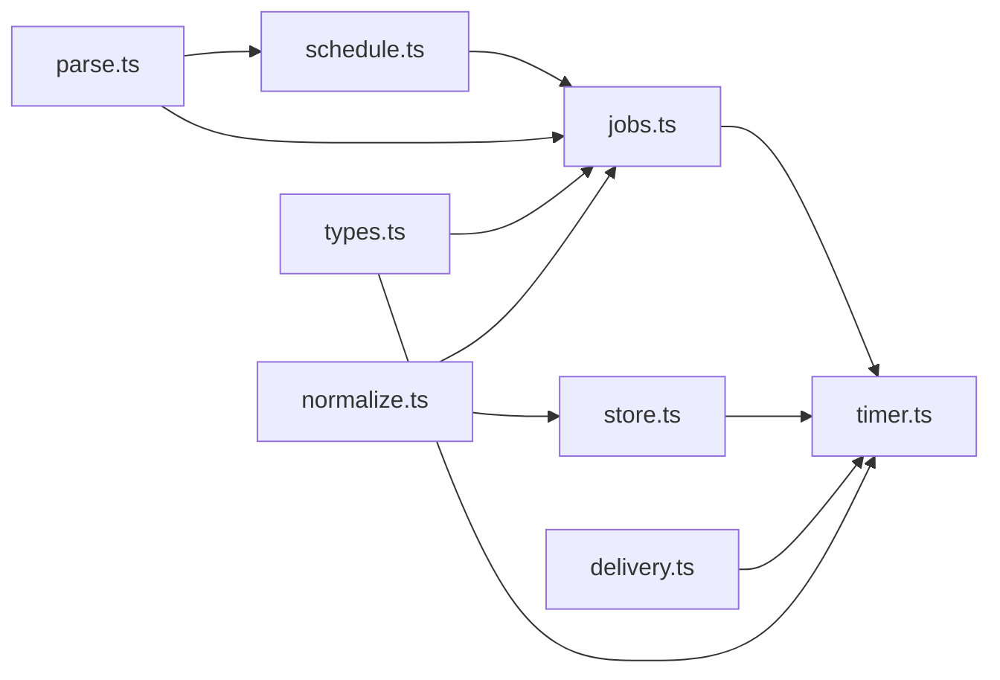

# 定时任务系统

<cite>
**本文引用的文件**
- [src/cron/service/state.ts](file://src/cron/service/state.ts)
- [src/cron/service/timer.ts](file://src/cron/service/timer.ts)
- [src/cron/service/jobs.ts](file://src/cron/service/jobs.ts)
- [src/cron/service/store.ts](file://src/cron/service/store.ts)
- [src/cron/types.ts](file://src/cron/types.ts)
- [src/cron/schedule.ts](file://src/cron/schedule.ts)
- [src/cron/parse.ts](file://src/cron/parse.ts)
- [src/cron/delivery.ts](file://src/cron/delivery.ts)
- [src/cron/service/normalize.ts](file://src/cron/service/normalize.ts)
</cite>

## 目录

1. [简介](#简介)
2. [项目结构](#项目结构)
3. [核心组件](#核心组件)
4. [架构总览](#架构总览)
5. [详细组件分析](#详细组件分析)
6. [依赖关系分析](#依赖关系分析)
7. [性能考量](#性能考量)
8. [故障排除指南](#故障排除指南)
9. [结论](#结论)
10. [附录](#附录)

## 简介

本文件面向OpenClaw定时任务（Cron）子系统，提供从架构设计到运行机制的完整技术文档。内容涵盖任务调度算法、执行流程、并发控制、事件与状态管理、错误处理与重试策略、配置语法与表达式格式、以及运维与排障建议。目标读者既包括需要快速上手的使用者，也包括希望深入理解实现细节的工程师。

## 项目结构

Cron子系统位于src/cron目录下，采用“按职责分层”的组织方式：

- 类型定义：统一的任务、计划、交付等数据模型
- 解析与调度：时间解析、Cron表达式计算、下一触发时刻推导
- 存储与加载：本地存储文件的读写、迁移与规范化
- 作业管理：作业创建、更新、删除、到期检测与执行
- 计时器与并发：基于setTimeout的定时器、锁与并发控制
- 交付策略：隔离会话下的消息投递策略解析



**图表来源**

- [src/cron/types.ts](file://src/cron/types.ts#L1-L99)
- [src/cron/parse.ts](file://src/cron/parse.ts#L1-L32)
- [src/cron/schedule.ts](file://src/cron/schedule.ts#L1-L68)
- [src/cron/delivery.ts](file://src/cron/delivery.ts#L1-L78)
- [src/cron/service/state.ts](file://src/cron/service/state.ts#L1-L105)
- [src/cron/service/jobs.ts](file://src/cron/service/jobs.ts#L1-L490)
- [src/cron/service/store.ts](file://src/cron/service/store.ts#L1-L509)
- [src/cron/service/timer.ts](file://src/cron/service/timer.ts#L1-L595)

**章节来源**

- [src/cron/types.ts](file://src/cron/types.ts#L1-L99)
- [src/cron/service/state.ts](file://src/cron/service/state.ts#L1-L105)

## 核心组件

- 服务状态与依赖：封装日志、存储路径、会话存储路径解析、心跳触发、系统事件入队、事件回调等
- 作业生命周期：创建、校验、到期检测、执行、结果应用（含退避与自动禁用）、持久化
- 调度器：基于定时器的周期性扫描，维护最小唤醒时间，避免漂移
- 存储与迁移：文件读写、字段规范化、遗留字段迁移、名称推断
- 时间解析与调度：绝对时间解析、Cron表达式解析、固定间隔与一次性调度
- 交付策略：隔离会话下的消息投递模式、通道与收件人解析

**章节来源**

- [src/cron/service/state.ts](file://src/cron/service/state.ts#L25-L66)
- [src/cron/service/jobs.ts](file://src/cron/service/jobs.ts#L230-L272)
- [src/cron/service/store.ts](file://src/cron/service/store.ts#L264-L485)
- [src/cron/schedule.ts](file://src/cron/schedule.ts#L13-L67)
- [src/cron/delivery.ts](file://src/cron/delivery.ts#L30-L77)

## 架构总览

Cron服务以“状态机+定时器”为核心，通过锁保证并发安全，结合存储文件实现跨进程一致性。执行路径围绕“到期检测—执行—结果应用—持久化—重新计算唤醒时间”展开。



**图表来源**

- [src/cron/service/timer.ts](file://src/cron/service/timer.ts#L160-L338)
- [src/cron/service/store.ts](file://src/cron/service/store.ts#L264-L485)
- [src/cron/service/jobs.ts](file://src/cron/service/jobs.ts#L340-L358)
- [src/cron/delivery.ts](file://src/cron/delivery.ts#L30-L77)

## 详细组件分析

### 数据模型与配置

- 调度类型：一次性(at)、固定间隔(every)、Cron表达式(cron)，支持时区
- 作业负载：系统事件(systemEvent)或代理对话(agentTurn)，后者可带模型、思考文本、超时、投递参数等
- 交付模式：无/公告两种模式，支持指定通道与收件人
- 作业状态：下次运行时间、运行中标记、最近运行时间与状态、连续错误数、计划计算错误计数等



**图表来源**

- [src/cron/types.ts](file://src/cron/types.ts#L3-L99)

**章节来源**

- [src/cron/types.ts](file://src/cron/types.ts#L3-L99)

### 时间解析与调度算法

- 绝对时间解析：支持纯数字毫秒、ISO日期、ISO日期时间（自动补全时区）
- Cron表达式：基于croner库，按指定时区计算下一触发时间；为避免重复触发，使用“当前秒起点之后”的策略
- 固定间隔：以锚点时间与步长计算下一次触发
- 一次性：at/atMs字段解析为未来时间点



**图表来源**

- [src/cron/parse.ts](file://src/cron/parse.ts#L18-L31)
- [src/cron/schedule.ts](file://src/cron/schedule.ts#L13-L67)

**章节来源**

- [src/cron/parse.ts](file://src/cron/parse.ts#L1-L32)
- [src/cron/schedule.ts](file://src/cron/schedule.ts#L1-L68)

### 作业管理与执行

- 创建：生成唯一ID、规范化名称与描述、默认启用、计算首次nextRunAtMs、校验会话目标与负载匹配
- 更新：合并负载与交付配置，兼容遗留字段，确保会话目标与交付约束一致
- 到期检测：过滤已启用、未在运行、nextRunAtMs已到达或缺失的作业
- 执行：根据会话目标选择系统事件或隔离代理执行；对隔离执行生成摘要并按需投递
- 结果应用：更新最近运行信息、连续错误计数、根据状态决定是否删除、计算退避延迟或自然下次时间



**图表来源**

- [src/cron/service/jobs.ts](file://src/cron/service/jobs.ts#L230-L272)
- [src/cron/service/jobs.ts](file://src/cron/service/jobs.ts#L274-L324)
- [src/cron/service/jobs.ts](file://src/cron/service/jobs.ts#L340-L358)
- [src/cron/service/timer.ts](file://src/cron/service/timer.ts#L419-L506)
- [src/cron/service/jobs.ts](file://src/cron/service/jobs.ts#L48-L118)

**章节来源**

- [src/cron/service/jobs.ts](file://src/cron/service/jobs.ts#L230-L324)
- [src/cron/service/jobs.ts](file://src/cron/service/jobs.ts#L340-L358)
- [src/cron/service/timer.ts](file://src/cron/service/timer.ts#L419-L506)

### 存储与迁移

- 加载：按需读取文件，规范化字段、迁移遗留字段、推断名称、标准化交付模式
- 迁移：atMs→at、legacy delivery hints→delivery、大小写与空值清理、锚点时间归一化
- 持久化：保存后更新文件mtime，避免立即重载



**图表来源**

- [src/cron/service/store.ts](file://src/cron/service/store.ts#L264-L485)

**章节来源**

- [src/cron/service/store.ts](file://src/cron/service/store.ts#L264-L509)

### 计时器与并发控制

- 最大定时器间隔：每分钟强制唤醒一次，避免时钟跳跃导致的调度漂移
- 并发保护：onTimer期间设置running标志，若再次触发则以固定间隔重入，防止死循环
- 唤醒策略：根据最近的nextRunAtMs计算延迟，必要时裁剪至最大间隔
- 会话清理：定时器tick时对会话存储进行清理（去重与过期回收）

```mermaid
flowchart TD
Tick["onTimer()"] --> Running{"是否正在运行?"}
Running --> |是| ReArm["重设定时器(最大间隔)"] --> End
Running --> |否| SetRunning["设置running=true"]
SetRunning --> Load["ensureLoaded()"]
Load --> Due["findDueJobs()"]
Due --> AnyDue{"是否有到期?"}
AnyDue --> |否| Maintenance["maintenance recompute"] --> Arm["armTimer()"] --> SetRunning=false
AnyDue --> |是| ExecLoop["逐个执行作业"]
ExecLoop --> Apply["applyJobResult()"]
Apply --> Persist["persist()"]
Persist --> Arm
Arm --> SetRunning=false
```

**图表来源**

- [src/cron/service/timer.ts](file://src/cron/service/timer.ts#L160-L338)

**章节来源**

- [src/cron/service/timer.ts](file://src/cron/service/timer.ts#L17-L158)

### 交付策略

- 模式解析：delivery.mode优先于payload.deliver；legacy deliver=true→announce，false→none
- 通道与收件人：delivery优先，否则回退到payload；默认通道为last
- 请求判定：显式请求或存在收件人时视为请求投递



**图表来源**

- [src/cron/delivery.ts](file://src/cron/delivery.ts#L30-L77)

**章节来源**

- [src/cron/delivery.ts](file://src/cron/delivery.ts#L1-L78)

## 依赖关系分析

- 低耦合：各模块职责清晰，通过类型接口交互
- 关键依赖链：
  - schedule.ts依赖parse.ts进行时间解析
  - jobs.ts依赖schedule.ts与parse.ts进行下一运行时间计算
  - timer.ts依赖jobs.ts进行到期检测与执行，依赖store.ts进行加载与持久化
  - delivery.ts被timer.ts用于投递摘要
  - store.ts依赖jobs.ts进行迁移与规范化



**图表来源**

- [src/cron/parse.ts](file://src/cron/parse.ts#L1-L32)
- [src/cron/schedule.ts](file://src/cron/schedule.ts#L1-L68)
- [src/cron/service/jobs.ts](file://src/cron/service/jobs.ts#L1-L490)
- [src/cron/service/store.ts](file://src/cron/service/store.ts#L1-L509)
- [src/cron/service/timer.ts](file://src/cron/service/timer.ts#L1-L595)
- [src/cron/delivery.ts](file://src/cron/delivery.ts#L1-L78)
- [src/cron/types.ts](file://src/cron/types.ts#L1-L99)
- [src/cron/service/normalize.ts](file://src/cron/service/normalize.ts#L1-L80)

**章节来源**

- [src/cron/service/jobs.ts](file://src/cron/service/jobs.ts#L1-L490)
- [src/cron/service/store.ts](file://src/cron/service/store.ts#L1-L509)
- [src/cron/service/timer.ts](file://src/cron/service/timer.ts#L1-L595)

## 性能考量

- 定时器节流：最大唤醒间隔限制为1分钟，降低CPU占用并避免调度漂移
- 并发安全：onTimer期间running标志与重入定时器避免阻塞
- 文件I/O优化：仅在必要时重载与保存，保存后更新mtime避免立即重载
- 计划重算策略：到期时重算，无到期时仅维护性重算，避免推进past-due时间
- 超时保护：单作业默认超时上限，避免卡死影响整体调度

[本节为通用性能建议，不直接分析具体文件]

## 故障排除指南

- 作业未触发
  - 检查enabled与nextRunAtMs；确认是否处于running中
  - 使用maintenance重算验证计划是否正确
  - 查看日志中的“no jobs with nextRunAtMs”提示
- 作业执行失败
  - 查看连续错误计数与退避延迟；超过阈值会自动禁用
  - 检查负载与会话目标匹配（main需systemEvent，isolated需agentTurn）
- 交付未生效
  - 确认delivery.mode与payload.deliver/收件人设置
  - 验证通道与收件人解析结果
- 调度漂移或静默停止
  - 确认定时器是否被重入；检查日志中的“timer tick failed”
  - 检查系统时钟跳变与MAX_TIMER_DELAY_MS裁剪

**章节来源**

- [src/cron/service/jobs.ts](file://src/cron/service/jobs.ts#L93-L164)
- [src/cron/service/jobs.ts](file://src/cron/service/jobs.ts#L48-L118)
- [src/cron/delivery.ts](file://src/cron/delivery.ts#L30-L77)
- [src/cron/service/timer.ts](file://src/cron/service/timer.ts#L160-L183)

## 结论

OpenClaw的Cron子系统以清晰的数据模型、稳健的调度算法与严格的并发控制为基础，提供了高可用的定时任务能力。通过绝对时间解析、Cron表达式与固定间隔三种调度方式，满足多样化的业务需求；通过交付策略与会话清理，保障执行结果的可见性与资源健康。建议在生产环境中关注超时与退避策略、定期审查计划计算错误与自动禁用情况，并结合日志进行持续监控。

[本节为总结性内容，不直接分析具体文件]

## 附录

### 配置语法与表达式格式

- 调度类型
  - at：一次性，支持字符串或毫秒数
  - every：固定间隔，支持everyMs与可选anchorMs
  - cron：Cron表达式，支持tz时区
- 负载类型
  - systemEvent：text必填
  - agentTurn：message必填，可选model/thinking/timeoutSeconds/allowUnsafeExternalContent/deliver/channel/to/bestEffortDeliver
- 交付模式
  - none：不投递
  - announce：投递摘要（默认）
- 会话目标
  - main：系统事件，需systemEvent
  - isolated：隔离代理，需agentTurn

**章节来源**

- [src/cron/types.ts](file://src/cron/types.ts#L3-L99)

### 典型使用场景

- 周期性健康检查：使用every或cron，输出摘要到main会话
- 一次性任务：at，完成后自动禁用或删除
- 隔离代理任务：agentTurn，按需投递到指定通道与收件人

[本节为概念性说明，不直接分析具体文件]
