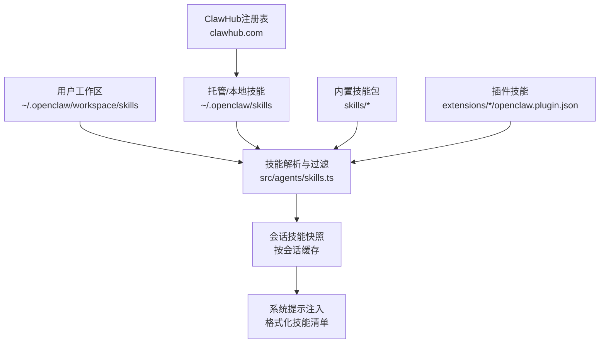
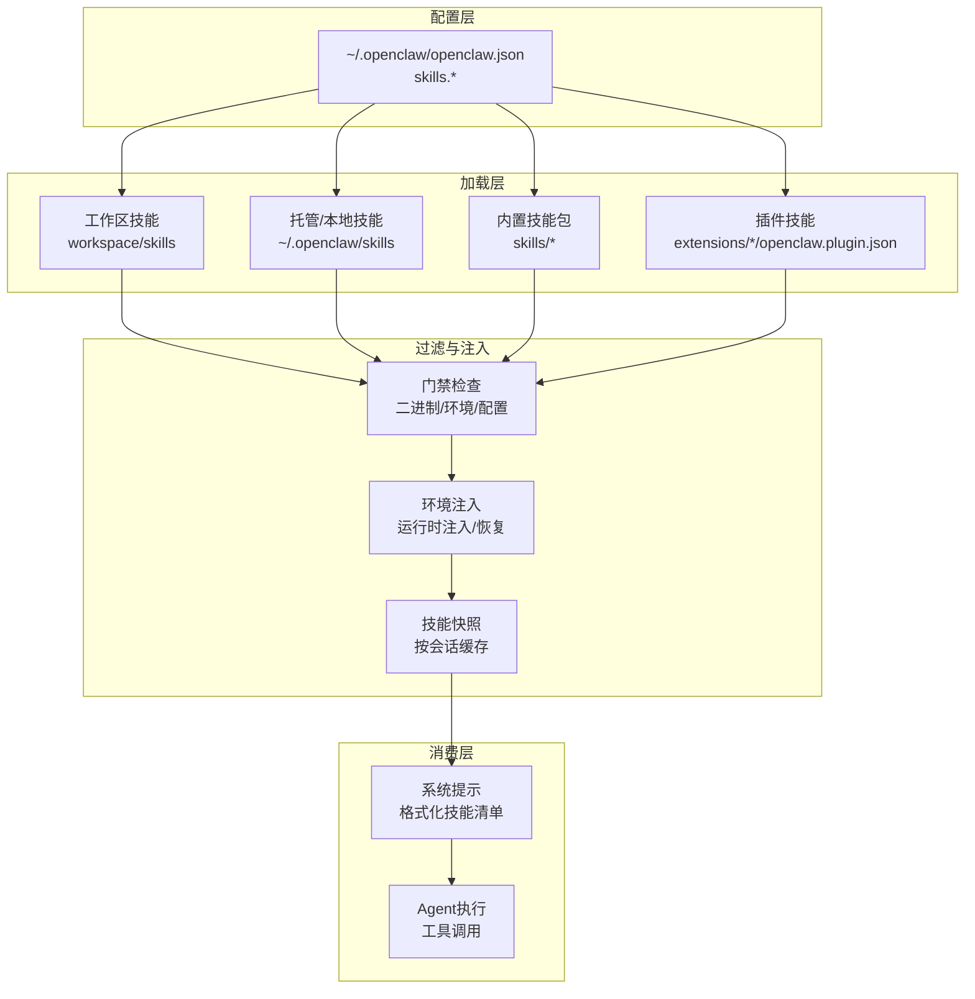
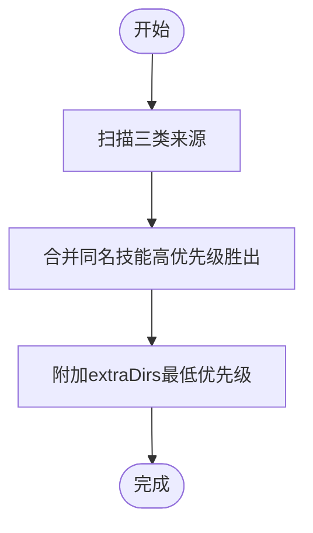
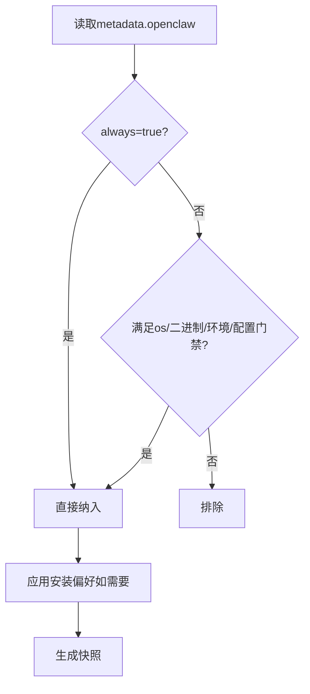
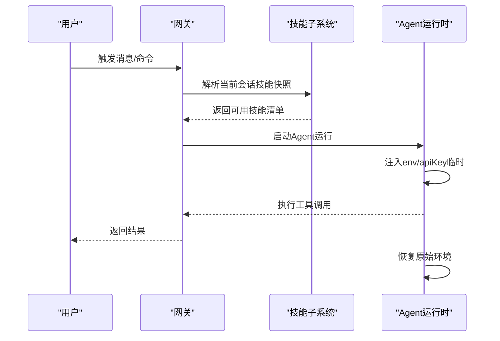
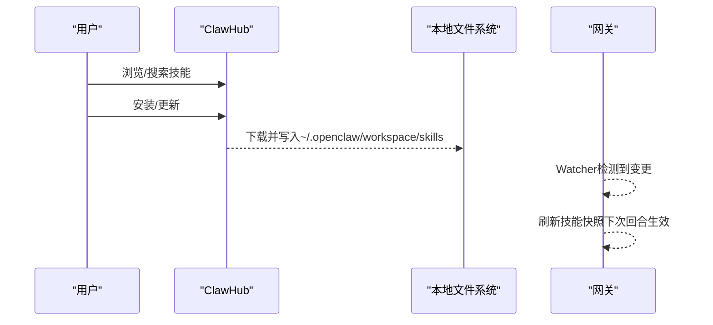
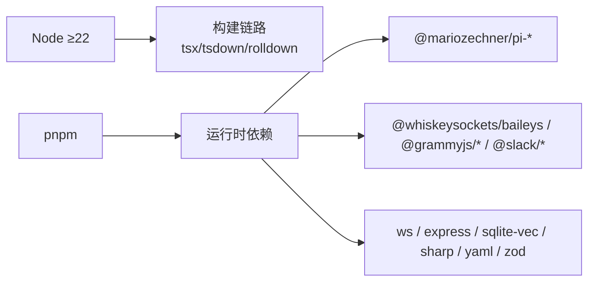

# 技能平台系统

<cite>
**本文档引用的文件**
- [README.md](file://README.md)
- [package.json](file://package.json)
- [docs/tools/skills.md](file://docs/tools/skills.md)
- [docs/tools/skills-config.md](file://docs/tools/skills-config.md)
- [docs/tools/creating-skills.md](file://docs/tools/creating-skills.md)
- [docs/reference/AGENTS.default.md](file://docs/reference/AGENTS.default.md)
- [src/agents/skills.ts](file://src/agents/skills.ts)
- [skills/](file://skills/)
</cite>

## 目录

1. [简介](#简介)
2. [项目结构](#项目结构)
3. [核心组件](#核心组件)
4. [架构总览](#架构总览)
5. [详细组件分析](#详细组件分析)
6. [依赖关系分析](#依赖关系分析)
7. [性能考量](#性能考量)
8. [故障排查指南](#故障排查指南)
9. [结论](#结论)
10. [附录](#附录)

## 简介

本文件面向OpenClaw技能平台系统，围绕技能的架构设计、开发框架与部署机制展开，重点覆盖以下主题：

- 技能生命周期管理：加载、过滤、环境注入、快照与热更新
- 版本控制与依赖处理：安装偏好、二进制/环境/配置门禁
- 开发标准流程：模板使用、元数据规范、测试与验证
- 配置管理：多级优先级、运行时注入、沙箱隔离
- 权限控制与安全策略：第三方技能信任模型、沙箱与最小权限
- 市场化运营：ClawHub注册表、安装同步与推广
- 调试工具与性能优化：Watcher、会话快照、令牌开销估算
- 扩展性与兼容性：跨平台、远程节点、插件技能集成

## 项目结构

OpenClaw采用多语言混合工程（Node/TypeScript为主，Swift用于macOS/iOS应用），技能体系位于skills目录，并通过文档与源码共同定义规范。

图示来源

- [src/agents/skills.ts](file://src/agents/skills.ts#L1-L47)
- [docs/tools/skills.md](file://docs/tools/skills.md#L13-L48)

章节来源

- [README.md](file://README.md#L1-L550)
- [package.json](file://package.json#L1-L219)

## 核心组件

- 技能解析与过滤器：负责从三处来源加载技能，按优先级合并，并在运行前进行门禁检查（二进制、环境变量、配置项）。
- 会话技能快照：在会话开始时生成并复用，减少重复构建成本；支持Watcher触发的热更新。
- 环境注入：在单次运行中临时注入技能所需的环境变量与密钥，结束后恢复原环境。
- 安装偏好：根据配置选择包管理器与安装渠道（Homebrew优先等）。
- 插件技能：插件可声明自带技能目录，随插件启用参与优先级规则。
- ClawHub：公共技能注册表，支持安装、更新与备份。

章节来源

- [src/agents/skills.ts](file://src/agents/skills.ts#L1-L47)
- [docs/tools/skills.md](file://docs/tools/skills.md#L105-L187)
- [docs/tools/skills-config.md](file://docs/tools/skills-config.md#L13-L77)

## 架构总览

技能平台由“配置驱动 + 多源加载 + 运行时注入”的架构组成，确保灵活性与安全性并重。

图示来源

- [docs/tools/skills.md](file://docs/tools/skills.md#L13-L48)
- [docs/tools/skills.md](file://docs/tools/skills.md#L105-L187)
- [docs/tools/skills.md](file://docs/tools/skills.md#L228-L244)

## 详细组件分析

### 组件A：技能加载与优先级

- 加载来源与优先级：工作区技能 > 托管/本地技能 > 内置技能；可通过extraDirs追加低优先级目录。
- 多代理共享：每代理独立工作区，共享技能位于托管目录，可被同一主机所有代理可见。
- 插件技能：插件启用时加载其skills目录，遵循相同优先级规则。

图示来源

- [docs/tools/skills.md](file://docs/tools/skills.md#L13-L48)

章节来源

- [docs/tools/skills.md](file://docs/tools/skills.md#L13-L48)

### 组件B：技能门禁与安装偏好

- 门禁字段：always、os、requires.bins、requires.anyBins、requires.env、requires.config、primaryEnv、install。
- 安装偏好：preferBrew、nodeManager（npm/pnpm/yarn/bun），仅影响技能安装阶段。
- 沙箱注意事项：二进制需同时存在于宿主与容器；可通过setupCommand预装。

图示来源

- [docs/tools/skills.md](file://docs/tools/skills.md#L105-L187)
- [docs/tools/skills-config.md](file://docs/tools/skills-config.md#L13-L77)

章节来源

- [docs/tools/skills.md](file://docs/tools/skills.md#L105-L187)
- [docs/tools/skills-config.md](file://docs/tools/skills-config.md#L13-L77)

### 组件C：环境注入与会话快照

- 注入时机：每次Agent运行开始时，按配置注入env与apiKey，结束后恢复。
- 快照策略：会话启动时生成技能快照，后续回合复用；支持Watcher热更新。
- 远程节点：当macOS节点允许system.run且具备所需二进制时，可将macOS专属技能视为可用。

图示来源

- [docs/tools/skills.md](file://docs/tools/skills.md#L228-L244)

章节来源

- [docs/tools/skills.md](file://docs/tools/skills.md#L228-L244)

### 组件D：ClawHub注册表与市场运营

- 功能：浏览、安装、更新、备份技能；默认安装到当前工作区或已配置工作区。
- 推广策略：通过ClawHub页面展示热门技能、评分与下载量，鼓励贡献者发布高质量技能包。

图示来源

- [docs/tools/skills.md](file://docs/tools/skills.md#L50-L67)

章节来源

- [docs/tools/skills.md](file://docs/tools/skills.md#L50-L67)

### 组件E：开发模板与最佳实践

- 模板位置：AGENTS.default.md提供默认个人助理指令与技能清单。
- 创建流程：创建工作区目录 → 新建技能目录 → 编写SKILL.md → 刷新/重启网关 → 本地测试。
- 最佳实践：简洁描述、安全优先（避免任意命令注入）、先本地验证再上线。

章节来源

- [docs/reference/AGENTS.default.md](file://docs/reference/AGENTS.default.md#L1-L125)
- [docs/tools/creating-skills.md](file://docs/tools/creating-skills.md#L1-L55)

## 依赖关系分析

- Node运行时要求：Node ≥22；包管理器推荐pnpm，支持bun直跑TypeScript。
- 关键依赖：@mariozechner/pi-_系列（Pi Agent核心/编码/TTY）、@whiskeysockets/baileys（WhatsApp Baileys）、@grammyjs/_（Telegram grammY）、@slack/\*（Slack Bolt）、ws、express、sqlite-vec、sharp、markdown-it、ws、yaml、zod等。
- 仅构建依赖：typescript、vitest、tsx、oxlint、rolldown、tsdown等。

图示来源

- [package.json](file://package.json#L192-L219)
- [package.json](file://package.json#L111-L164)

章节来源

- [package.json](file://package.json#L111-L164)
- [package.json](file://package.json#L192-L219)

## 性能考量

- 技能列表对令牌的影响：基础开销约195字符，每技能约+97字符（含XML转义），按模型分词估算约每技能24令牌左右。
- 会话快照：首次构建后复用，避免重复格式化与解析；适合长对话与多轮推理。
- Watcher热更新：默认开启，debounce毫秒数可调，平衡实时性与I/O压力。
- 沙箱内二进制：需在容器内预装，避免运行期拉取导致延迟。

章节来源

- [docs/tools/skills.md](file://docs/tools/skills.md#L267-L284)
- [docs/tools/skills.md](file://docs/tools/skills.md#L252-L266)
- [docs/tools/skills.md](file://docs/tools/skills.md#L137-L146)

## 故障排查指南

- 安全与信任：第三方技能视为不受信代码，建议先审阅再启用；优先沙箱运行。
- 环境变量泄漏：避免将密钥写入提示或日志；仅在运行时注入。
- 门禁失败：检查PATH中的二进制、配置路径是否为真值、环境变量是否就位。
- 沙箱问题：确认容器内存在所需二进制，必要时通过agents.defaults.sandbox.docker.setupCommand预装。
- 远程节点：若macOS节点离线，相关技能仍可见但可能无法执行，待节点重连后恢复。

章节来源

- [docs/tools/skills.md](file://docs/tools/skills.md#L69-L76)
- [docs/tools/skills.md](file://docs/tools/skills.md#L137-L146)

## 结论

OpenClaw技能平台以“配置驱动 + 多源加载 + 门禁过滤 + 运行时注入”为核心，兼顾易用性与安全性。通过ClawHub实现技能生态的开放与共享，结合会话快照与Watcher提升性能与体验。建议在生产环境中严格遵循安全与沙箱策略，配合CI/CD与本地测试流程，保障技能质量与稳定性。

## 附录

- 开发与测试
  - 使用openclaw agent --message "use my new skill"进行本地验证
  - 参考AGENTS.default.md模板初始化工作区
  - 通过ClawHub安装/更新技能，或在workspace/skills中自建
- 部署与运维
  - 使用pnpm脚本进行构建与打包，参考package.json中的scripts
  - 在多代理场景下，利用workspace/skills实现每代理独享技能，~/.openclaw/skills实现共享技能

章节来源

- [docs/tools/creating-skills.md](file://docs/tools/creating-skills.md#L42-L54)
- [docs/reference/AGENTS.default.md](file://docs/reference/AGENTS.default.md#L13-L41)
- [package.json](file://package.json#L33-L110)
