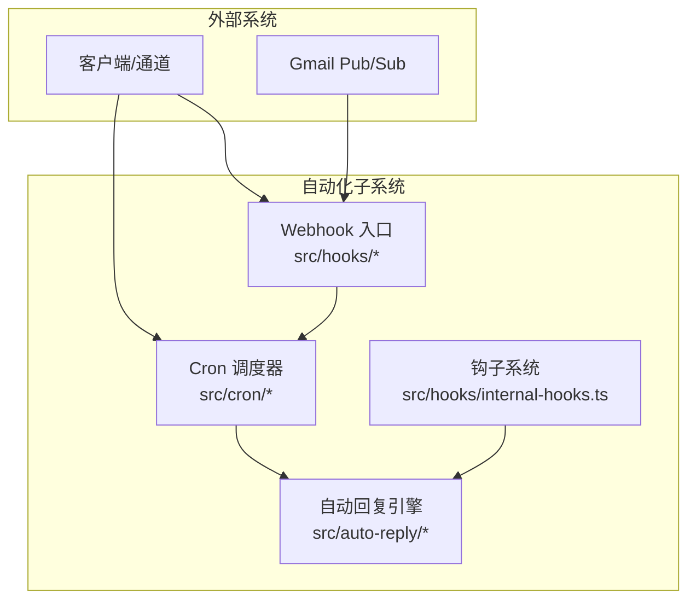
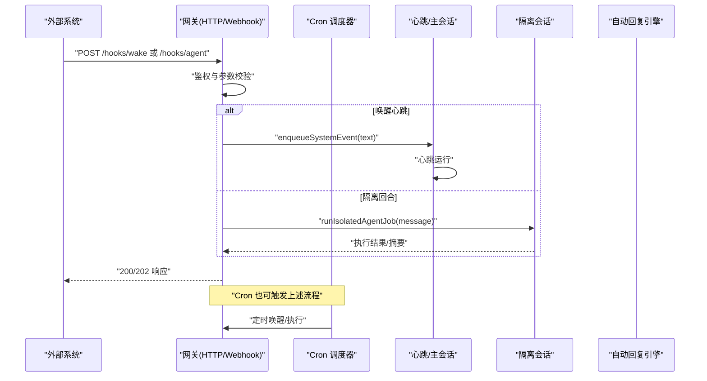
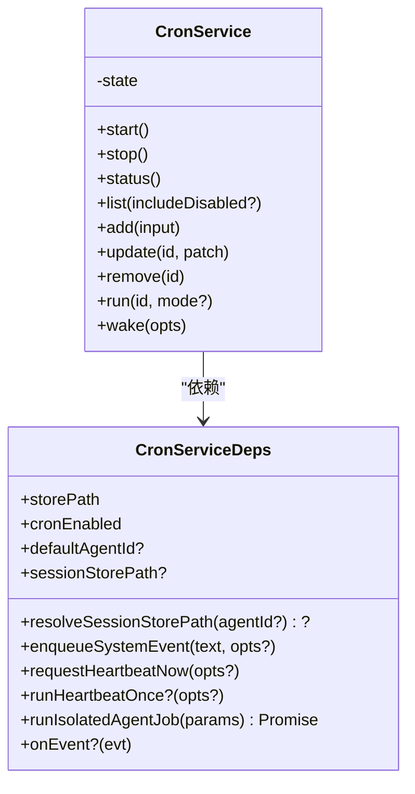
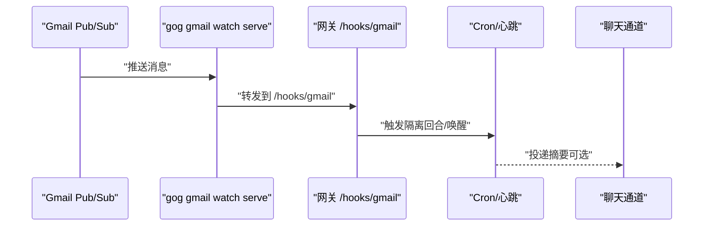
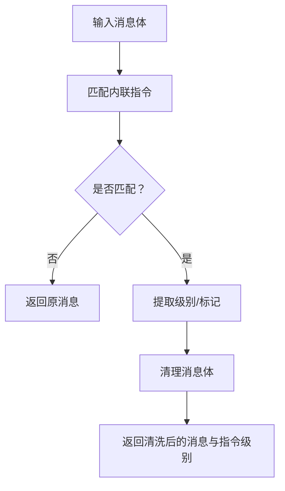
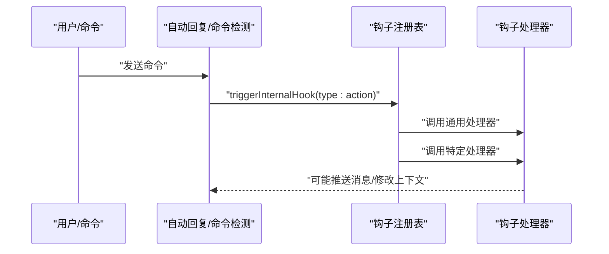
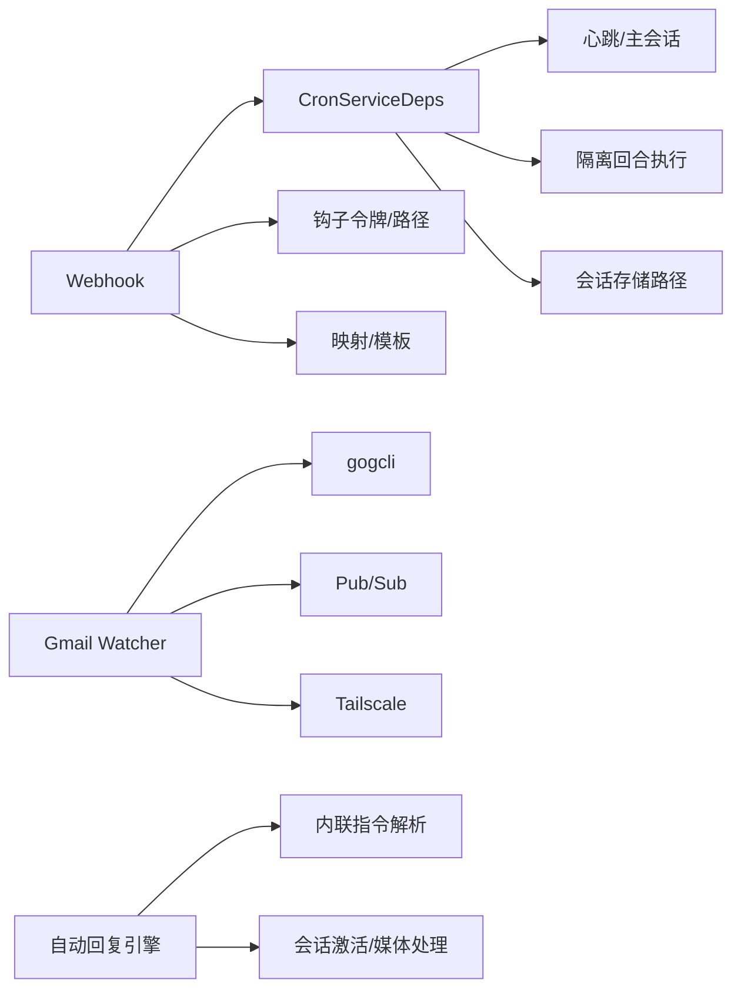

# 自动化工具系统

<cite>
**本文档引用的文件**
- [README.md](file://README.md)
- [docs/index.md](file://docs/index.md)
- [docs/automation/cron-jobs.md](file://docs/automation/cron-jobs.md)
- [docs/automation/webhook.md](file://docs/automation/webhook.md)
- [docs/automation/gmail-pubsub.md](file://docs/automation/gmail-pubsub.md)
- [docs/automation/hooks.md](file://docs/automation/hooks.md)
- [src/cron/service.ts](file://src/cron/service.ts)
- [src/cron/service/state.ts](file://src/cron/service/state.ts)
- [src/auto-reply/reply.ts](file://src/auto-reply/reply.ts)
- [src/auto-reply/reply/directives.ts](file://src/auto-reply/reply/directives.ts)
- [src/hooks/hooks.ts](file://src/hooks/hooks.ts)
- [src/hooks/internal-hooks.ts](file://src/hooks/internal-hooks.ts)
- [src/hooks/gmail.ts](file://src/hooks/gmail.ts)
- [src/hooks/gmail-setup-utils.ts](file://src/hooks/gmail-setup-utils.ts)
- [src/hooks/gmail-watcher.ts](file://src/hooks/gmail-watcher.ts)
</cite>

## 目录

1. [简介](#简介)
2. [项目结构](#项目结构)
3. [核心组件](#核心组件)
4. [架构总览](#架构总览)
5. [详细组件分析](#详细组件分析)
6. [依赖关系分析](#依赖关系分析)
7. [性能考虑](#性能考虑)
8. [故障排除指南](#故障排除指南)
9. [结论](#结论)
10. [附录](#附录)

## 简介

本文件面向OpenClaw自动化工具系统的使用者与开发者，系统性阐述以下能力与实现：

- 定时任务（Cron）：在网关内部持久化调度、唤醒心跳、主会话或隔离会话执行、可选投递到聊天通道。
- Webhook触发：HTTP入口接收外部事件，支持立即唤醒心跳或运行隔离代理回合，并可选择投递结果。
- Gmail Pub/Sub监听：通过gogcli与Gmail Watch/Pub/Sub集成，将邮件事件转换为OpenClaw钩子动作，支持自动重注册与远程暴露。
- 自动回复机制：解析内联指令（思考级别、冗余度、提升权限、推理等），并结合会话激活与媒体处理逻辑，驱动自动化响应。
- 技能平台：插件化的钩子系统，支持事件驱动自动化、命令审计、内存快照等扩展。

本指南兼顾非技术读者与工程师，既提供高层概览，也给出代码级关系图与实现要点。

## 项目结构

OpenClaw围绕“网关（Gateway）+ 通道（Channels）+ 工具（Tools）+ 钩子（Hooks）”构建自动化闭环。自动化相关的关键目录与文件如下：

- 定时任务：src/cron/\* 提供服务类、状态管理、作业存储与执行计划；docs/automation/cron-jobs.md提供使用说明。
- Webhook：src/hooks/\* 提供钩子框架与Gmail集成；docs/automation/webhook.md与docs/automation/gmail-pubsub.md提供配置与流程。
- 自动回复：src/auto-reply/\* 解析内联指令、触发器与回复生成。
- 文档：docs/automation/\* 提供用户手册与运维指南。

**图表来源**

- [src/cron/service.ts](file://src/cron/service.ts#L1-L49)
- [src/cron/service/state.ts](file://src/cron/service/state.ts#L1-L105)
- [src/hooks/internal-hooks.ts](file://src/hooks/internal-hooks.ts#L1-L182)
- [src/auto-reply/reply.ts](file://src/auto-reply/reply.ts#L1-L12)

**章节来源**

- [README.md](file://README.md#L1-L550)
- [docs/index.md](file://docs/index.md#L1-L193)

## 核心组件

- Cron调度器：提供作业增删改查、状态查询、手动运行、心跳唤醒等功能，支持主会话系统事件与隔离会话代理回合两种执行模式。
- Webhook入口：提供HTTP端点，支持鉴权、映射与模板化路由，将外部事件转化为心跳唤醒或隔离回合执行，并可投递摘要。
- Gmail Pub/Sub监听：封装gogcli与Gmail Watch/Pub/Sub交互，自动启动/重注册监听进程，支持Tailscale暴露与令牌保护。
- 自动回复引擎：解析内联指令（思考/冗余/推理/提升/状态），并结合会话激活、媒体处理与去抖策略，生成一致的回复行为。
- 钩子系统：事件驱动的扩展框架，支持命令、会话、代理引导与网关启动等事件，便于审计、快照与自定义自动化。

**章节来源**

- [docs/automation/cron-jobs.md](file://docs/automation/cron-jobs.md#L1-L479)
- [docs/automation/webhook.md](file://docs/automation/webhook.md#L1-L214)
- [docs/automation/gmail-pubsub.md](file://docs/automation/gmail-pubsub.md#L1-L257)
- [src/cron/service.ts](file://src/cron/service.ts#L1-L49)
- [src/hooks/internal-hooks.ts](file://src/hooks/internal-hooks.ts#L1-L182)

## 架构总览

下图展示从外部事件到网关内部执行的端到端路径，以及与自动回复引擎的交互。

**图表来源**

- [docs/automation/webhook.md](file://docs/automation/webhook.md#L44-L96)
- [src/cron/service.ts](file://src/cron/service.ts#L1-L49)
- [src/cron/service/state.ts](file://src/cron/service/state.ts#L25-L51)

## 详细组件分析

### Cron 调度器

- 角色与职责
  - 维护作业持久化存储，支持增删改查、状态查询与手动运行。
  - 控制“何时运行”（at/every/cron）与“如何运行”（主会话系统事件或隔离会话代理回合）。
  - 支持投递摘要至聊天通道，避免重复发送与心跳空响应投递。
- 关键接口
  - start/stop/status/list/add/update/remove/run/wake
  - 依赖注入包括：日志、存储路径、默认代理ID、会话存储路径、心跳唤醒回调、隔离回合执行回调等。
- 执行模式
  - 主会话：enqueueSystemEvent + 可选立即心跳。
  - 隔离会话：独立会话键，前缀trace信息，可配置投递模式（announce/none）。
- 存储与历史
  - 作业存储于~/.openclaw/cron/jobs.json，运行历史按作业分文件记录（JSONL）。

**图表来源**

- [src/cron/service.ts](file://src/cron/service.ts#L1-L49)
- [src/cron/service/state.ts](file://src/cron/service/state.ts#L25-L51)

**章节来源**

- [docs/automation/cron-jobs.md](file://docs/automation/cron-jobs.md#L1-L479)
- [src/cron/service.ts](file://src/cron/service.ts#L1-L49)
- [src/cron/service/state.ts](file://src/cron/service/state.ts#L1-L105)

### Webhook 入口与Gmail集成

- Webhook端点
  - /hooks/wake：将文本描述作为系统事件入队，支持立即或下次心跳触发。
  - /hooks/agent：运行隔离代理回合，可设置模型/思考级别/超时，支持投递摘要到聊天。
  - /hooks/<name>：基于映射（presets/mappings/transforms）将任意负载转换为wake或agent动作。
- 安全与鉴权
  - 必须携带钩子令牌（Bearer或x-openclaw-token），拒绝查询串令牌。
  - 支持限制显式agentId路由与请求sessionKey前缀白名单。
- Gmail Pub/Sub
  - 通过gogcli启动watch与serve，自动重注册（renew），支持Tailscale Funnel/Serve暴露。
  - 支持将邮件主题/片段/正文（可选）转换为隔离回合执行，并投递摘要到聊天。

**图表来源**

- [docs/automation/webhook.md](file://docs/automation/webhook.md#L132-L156)
- [docs/automation/gmail-pubsub.md](file://docs/automation/gmail-pubsub.md#L93-L200)
- [src/hooks/gmail.ts](file://src/hooks/gmail.ts#L1-L272)
- [src/hooks/gmail-setup-utils.ts](file://src/hooks/gmail-setup-utils.ts#L264-L316)
- [src/hooks/gmail-watcher.ts](file://src/hooks/gmail-watcher.ts#L132-L202)

**章节来源**

- [docs/automation/webhook.md](file://docs/automation/webhook.md#L1-L214)
- [docs/automation/gmail-pubsub.md](file://docs/automation/gmail-pubsub.md#L1-L257)
- [src/hooks/gmail.ts](file://src/hooks/gmail.ts#L1-L272)
- [src/hooks/gmail-setup-utils.ts](file://src/hooks/gmail-setup-utils.ts#L1-L384)
- [src/hooks/gmail-watcher.ts](file://src/hooks/gmail-watcher.ts#L1-L247)

### 自动回复引擎与内联指令

- 指令解析
  - 支持思考级别（thinking/think/t）、冗余度（verbose/v）、通知级别（notice/notices）、提升权限（elevated/elev）、推理（reasoning/reason）、状态（status）等内联指令。
  - 解析后清理原始消息，保留未匹配指令部分。
- 与会话/媒体/激活
  - 结合会话激活策略、媒体注记、去抖动与心跳行为，决定是否生成回复与如何格式化输出。
- 类型与导出
  - 导出提取函数与类型，便于在自动回复流程中复用。

**图表来源**

- [src/auto-reply/reply/directives.ts](file://src/auto-reply/reply/directives.ts#L1-L193)
- [src/auto-reply/reply.ts](file://src/auto-reply/reply.ts#L1-L12)

**章节来源**

- [src/auto-reply/reply/directives.ts](file://src/auto-reply/reply/directives.ts#L1-L193)
- [src/auto-reply/reply.ts](file://src/auto-reply/reply.ts#L1-L12)

### 钩子系统（事件驱动自动化）

- 事件类型
  - 命令事件：command/new、command/reset、command/stop等。
  - 代理事件：agent/bootstrap。
  - 网关事件：gateway/startup。
- 注册与触发
  - 支持通用事件类型与具体事件:action组合注册。
  - 触发时先调用通用处理器，再调用特定处理器；异常被捕获并记录，不影响其他处理器。
- 生命周期与发现
  - 支持工作区钩子、托管钩子与内置钩子三类目录扫描与加载。
  - 支持钩子包（npm）安装与元数据（HOOK.md）声明。

**图表来源**

- [src/hooks/internal-hooks.ts](file://src/hooks/internal-hooks.ts#L111-L143)
- [src/hooks/hooks.ts](file://src/hooks/hooks.ts#L1-L15)

**章节来源**

- [docs/automation/hooks.md](file://docs/automation/hooks.md#L1-L800)
- [src/hooks/internal-hooks.ts](file://src/hooks/internal-hooks.ts#L1-L182)
- [src/hooks/hooks.ts](file://src/hooks/hooks.ts#L1-L15)

## 依赖关系分析

- Cron 依赖
  - 依赖心跳运行器（enqueueSystemEvent/requestHeartbeatNow/runHeartbeatOnce）与隔离回合执行器（runIsolatedAgentJob）。
  - 依赖会话存储路径以进行会话清理与跟踪。
- Webhook 依赖
  - 依赖钩子令牌与路径配置，支持映射与模板化路由。
  - Gmail集成依赖gogcli、GCP Pub/Sub、Tailscale。
- 自动回复依赖
  - 依赖思考/冗余/推理/提升等规范化模块，以及会话激活与媒体处理模块。

**图表来源**

- [src/cron/service/state.ts](file://src/cron/service/state.ts#L25-L51)
- [docs/automation/webhook.md](file://docs/automation/webhook.md#L132-L156)
- [src/hooks/gmail-watcher.ts](file://src/hooks/gmail-watcher.ts#L132-L202)
- [src/auto-reply/reply/directives.ts](file://src/auto-reply/reply/directives.ts#L1-L193)

**章节来源**

- [src/cron/service/state.ts](file://src/cron/service/state.ts#L1-L105)
- [docs/automation/webhook.md](file://docs/automation/webhook.md#L1-L214)
- [src/hooks/gmail-watcher.ts](file://src/hooks/gmail-watcher.ts#L1-L247)
- [src/auto-reply/reply/directives.ts](file://src/auto-reply/reply/directives.ts#L1-L193)

## 性能考虑

- Cron并发与重试
  - 并发运行数受配置限制，默认1次；对周期性作业采用指数回退（30s、1m、5m、15m、60m）。
  - 单次作业在成功/错误/跳过后禁用并停止重试。
- Webhook吞吐与安全
  - 使用令牌鉴权与速率限制，避免暴力破解；建议仅在受信网络暴露端点。
  - 对超大载荷进行限制（如413），避免资源耗尽。
- Gmail监听稳定性
  - 监听进程异常退出自动重启；定期重注册Watch；端口占用冲突时停止重启以避免循环。
- 自动回复指令解析
  - 指令匹配与清理为线性扫描，复杂度与消息长度线性相关；建议保持消息简洁以降低开销。

[本节为通用指导，不直接分析具体文件]

## 故障排除指南

- Cron无作业运行
  - 检查cron.enabled与环境变量OPENCLAW_SKIP_CRON；确认网关持续运行；核对时区与主机时区。
  - 周期性作业失败会指数回退，成功后自动重置。
- Webhook鉴权失败/限流
  - 确认Authorization头或x-openclaw-token；检查重复鉴权失败的Retry-After提示。
  - 限制请求sessionKey前缀与agentId路由白名单，避免滥用。
- Gmail Pub/Sub无法接收
  - 校验gog可用性、GCP项目与OAuth客户端一致性、Pub/Sub订阅IAM角色、推送端点URL与令牌。
  - 若端口被占用，停止其他监听实例或设置OPENCLAW_SKIP_GMAIL_WATCHER=1。
- 自动回复未生效
  - 检查内联指令拼写与顺序；确认会话激活策略与媒体处理逻辑未抑制回复。

**章节来源**

- [docs/automation/cron-jobs.md](file://docs/automation/cron-jobs.md#L459-L479)
- [docs/automation/webhook.md](file://docs/automation/webhook.md#L202-L214)
- [docs/automation/gmail-pubsub.md](file://docs/automation/gmail-pubsub.md#L244-L257)
- [src/hooks/gmail-watcher.ts](file://src/hooks/gmail-watcher.ts#L23-L27)

## 结论

OpenClaw的自动化体系以“网关为中心”，通过Cron、Webhook与Gmail Pub/Sub形成多源触发，结合自动回复引擎与钩子系统，实现从外部事件到智能回复的完整链路。其设计强调：

- 内部持久化与可恢复：Cron作业与运行历史本地化，便于运维与审计。
- 外部集成与安全：Webhook与Gmail监听均提供鉴权、速率限制与暴露策略。
- 可扩展与可观察：钩子系统事件驱动，便于审计、快照与自定义扩展。
- 易用与稳健：CLI与文档完善，提供常见问题排查与最佳实践。

[本节为总结，不直接分析具体文件]

## 附录

- 配置参考
  - Cron：启用、存储路径、最大并发数。
  - Webhook：启用、令牌、路径、映射与模板、会话键策略。
  - Gmail：账户、标签、主题、订阅、推送令牌、钩子URL、Tailscale模式与路径。
- 示例与最佳实践
  - 使用Cron创建一次性提醒与周期性摘要；通过Webhook将外部系统事件转换为代理回合；利用Gmail监听自动处理新邮件并投递摘要。
  - 在生产环境使用专用钩子令牌、限制agentId与sessionKey前缀、开启Tailscale Funnel并配置OIDC验证。

[本节为补充说明，不直接分析具体文件]
