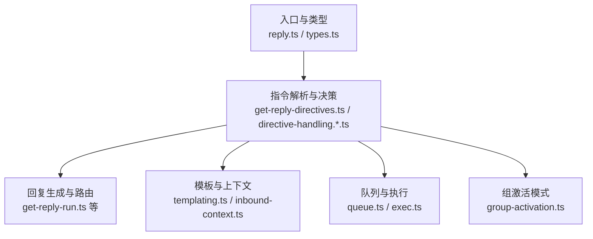
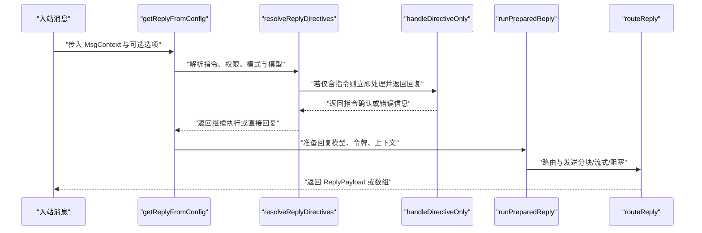
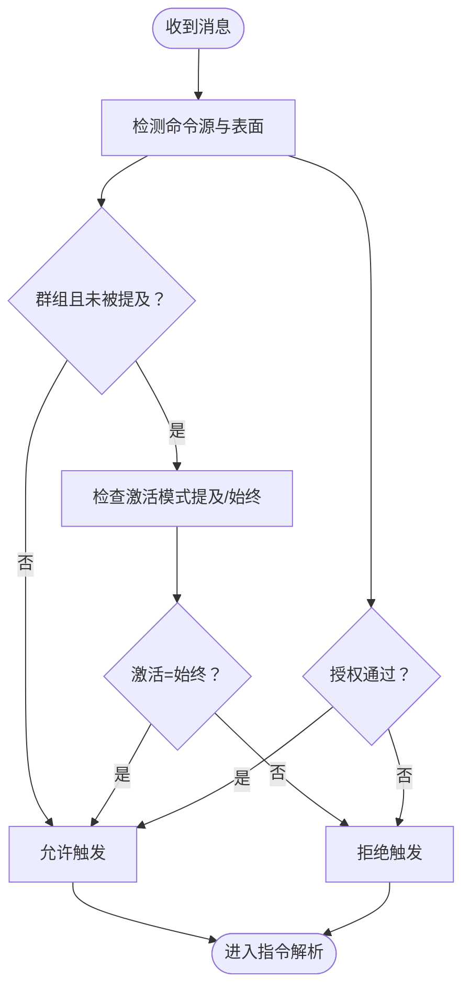
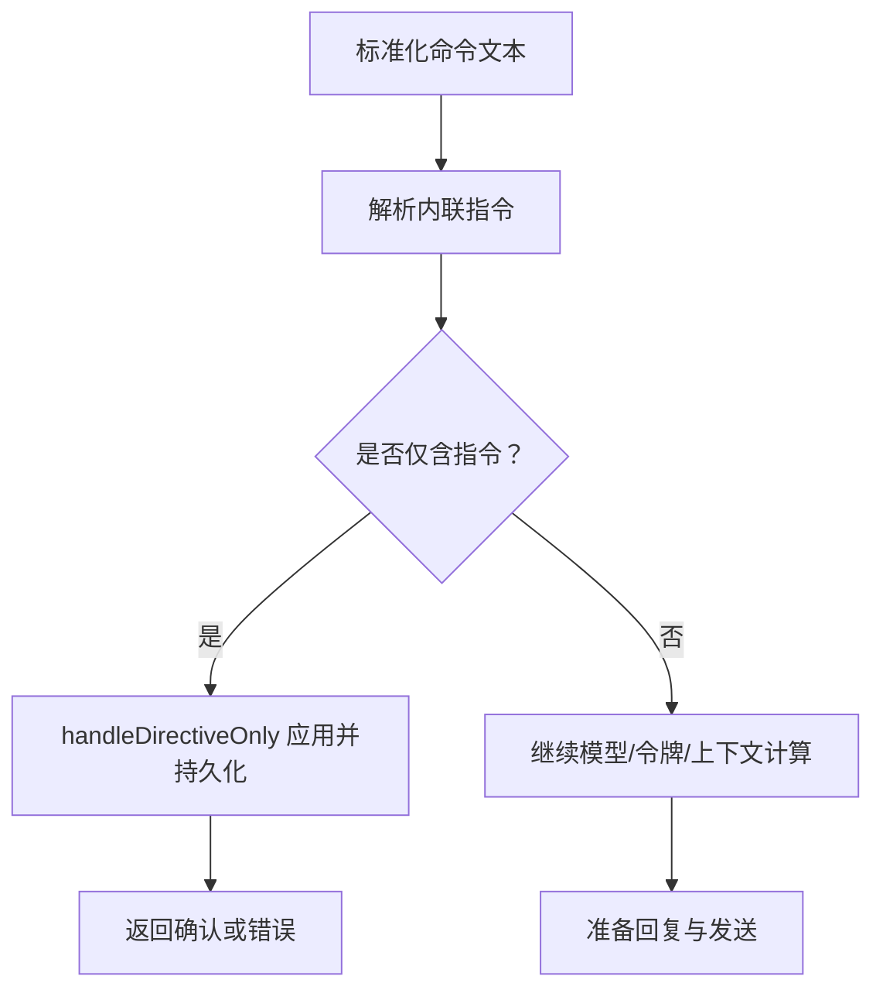
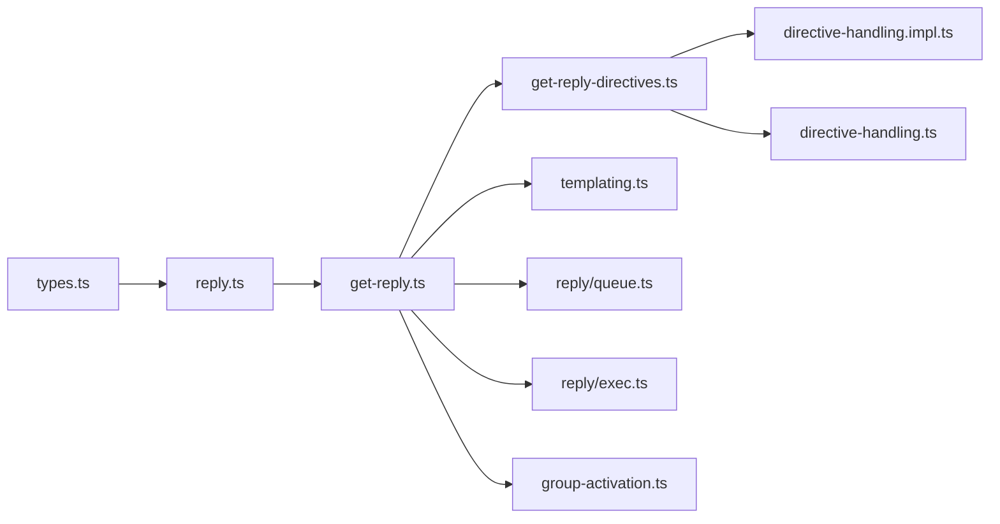

# 自动回复机制

<cite>
**本文引用的文件**
- [src/auto-reply/reply.ts](file://src/auto-reply/reply.ts)
- [src/auto-reply/types.ts](file://src/auto-reply/types.ts)
- [src/auto-reply/reply/get-reply.ts](file://src/auto-reply/reply/get-reply.ts)
- [src/auto-reply/reply/get-reply-directives.ts](file://src/auto-reply/reply/get-reply-directives.ts)
- [src/auto-reply/reply/directive-handling.ts](file://src/auto-reply/reply/directive-handling.ts)
- [src/auto-reply/reply/directive-handling.impl.ts](file://src/auto-reply/reply/directive-handling.impl.ts)
- [src/auto-reply/group-activation.ts](file://src/auto-reply/group-activation.ts)
- [src/auto-reply/templating.ts](file://src/auto-reply/templating.ts)
- [src/auto-reply/reply/queue.ts](file://src/auto-reply/reply/queue.ts)
- [src/auto-reply/reply/exec.ts](file://src/auto-reply/reply/exec.ts)
</cite>

## 目录

1. [简介](#简介)
2. [项目结构](#项目结构)
3. [核心组件](#核心组件)
4. [架构总览](#架构总览)
5. [详细组件分析](#详细组件分析)
6. [依赖关系分析](#依赖关系分析)
7. [性能考量](#性能考量)
8. [故障排查指南](#故障排查指南)
9. [结论](#结论)
10. [附录](#附录)

## 简介

本技术文档围绕 OpenClaw 的自动回复机制展开，系统性阐述消息触发条件、意图识别与指令解析、智能决策流程、回复生成与路由、以及配置项、优先级与条件判断逻辑。文档同时覆盖个性化定制、模板管理、上下文保持、性能优化、并发处理与错误恢复策略，并提供可复用的场景示例、配置模板与调试技巧。

## 项目结构

自动回复相关代码集中在 src/auto-reply 目录，按职责划分为：

- 入口与类型：导出对外 API 与核心类型定义
- 指令解析与决策：解析内联指令、权限与模式切换、模型选择、队列与执行参数
- 回复生成与路由：构建回复负载、分块流式发送、线程与引用处理
- 上下文与模板：消息上下文标准化、模板插值
- 队列与执行：会话级队列、后续运行调度、执行安全与主机选择
- 组激活模式：群组触发策略（提及/始终）

**图表来源**

- [src/auto-reply/reply.ts](file://src/auto-reply/reply.ts#L1-L12)
- [src/auto-reply/types.ts](file://src/auto-reply/types.ts#L1-L62)
- [src/auto-reply/reply/get-reply-directives.ts](file://src/auto-reply/reply/get-reply-directives.ts#L1-L492)
- [src/auto-reply/reply/directive-handling.impl.ts](file://src/auto-reply/reply/directive-handling.impl.ts#L1-L501)
- [src/auto-reply/templating.ts](file://src/auto-reply/templating.ts#L1-L205)
- [src/auto-reply/reply/queue.ts](file://src/auto-reply/reply/queue.ts#L1-L15)
- [src/auto-reply/reply/exec.ts](file://src/auto-reply/reply/exec.ts#L1-L2)
- [src/auto-reply/group-activation.ts](file://src/auto-reply/group-activation.ts#L1-L35)

**章节来源**

- [src/auto-reply/reply.ts](file://src/auto-reply/reply.ts#L1-L12)
- [src/auto-reply/types.ts](file://src/auto-reply/types.ts#L1-L62)

## 核心组件

- 外部 API 导出：统一导出指令提取、回复获取、执行与队列等能力，供上层调用。
- 类型系统：定义回复选项、回复载荷、阻塞回复上下文等，支撑回调钩子、超时、技能过滤、打字模拟等。
- 指令解析：从消息中抽取并规范化内联指令（思考/详细/推理/提升权限/模型/队列/执行），结合会话状态与配置进行优先级判定与覆盖。
- 决策与持久化：在授权与权限范围内应用指令，更新会话状态、事件系统与系统事件队列。
- 回复生成：根据最终指令集与模型选择，准备回复内容、媒体、线程与引用；支持分块流式与阻塞回复。
- 模板与上下文：标准化消息上下文，提供占位符插值，确保提示词与回复的一致性。
- 队列与执行：会话级队列、去重、丢弃策略、节流与容量限制；执行主机、安全策略与审批开关。

**章节来源**

- [src/auto-reply/reply.ts](file://src/auto-reply/reply.ts#L1-L12)
- [src/auto-reply/types.ts](file://src/auto-reply/types.ts#L16-L61)
- [src/auto-reply/reply/get-reply-directives.ts](file://src/auto-reply/reply/get-reply-directives.ts#L87-L491)
- [src/auto-reply/reply/directive-handling.impl.ts](file://src/auto-reply/reply/directive-handling.impl.ts#L61-L500)
- [src/auto-reply/templating.ts](file://src/auto-reply/templating.ts#L13-L158)

## 架构总览

自动回复从“消息进入”到“回复发出”的端到端流程如下：

**图表来源**

- [src/auto-reply/reply/get-reply.ts](file://src/auto-reply/reply/get-reply.ts#L53-L341)
- [src/auto-reply/reply/get-reply-directives.ts](file://src/auto-reply/reply/get-reply-directives.ts#L87-L491)
- [src/auto-reply/reply/directive-handling.impl.ts](file://src/auto-reply/reply/directive-handling.impl.ts#L61-L500)

## 详细组件分析

### 触发条件与激活策略

- 触发来源：文本命令、原生命令、心跳（可覆盖模型）、媒体/链接理解后的上下文增强。
- 群组激活模式：支持“提及才触发”或“始终触发”，由配置与指令共同决定。
- 授权与权限：基于发送者白名单、网关客户端作用域、通道表面等判定是否允许文本命令与内联指令生效。
- 心跳模型覆盖：心跳场景可使用独立模型引用，兼容全局默认与代理配置。

**图表来源**

- [src/auto-reply/reply/get-reply-directives.ts](file://src/auto-reply/reply/get-reply-directives.ts#L143-L171)
- [src/auto-reply/group-activation.ts](file://src/auto-reply/group-activation.ts#L5-L34)

**章节来源**

- [src/auto-reply/reply/get-reply-directives.ts](file://src/auto-reply/reply/get-reply-directives.ts#L143-L171)
- [src/auto-reply/group-activation.ts](file://src/auto-reply/group-activation.ts#L1-L35)

### 消息解析、意图识别与指令处理

- 指令来源优先级：BodyForCommands > CommandBody > RawBody > Transcript > BodyStripped > Body。
- 指令解析：支持 think/verbose/reasoning/elevated/model/queue/exec 等内联指令，解析后清理结构化前缀与提及标记。
- 权限与模式：在非授权情况下禁用除状态外的指令；群组中未被提及的提升权限与执行指令会被屏蔽。
- 模型选择：支持别名、状态查询、列表展示、重置默认；结合 X-High 思考级别与模型能力进行降级。
- 执行参数：主机、安全策略、询问策略、节点标识，支持会话级默认与指令级覆盖。
- 队列参数：模式、去重、丢弃策略、节流与容量，支持重置与持久化。

**图表来源**

- [src/auto-reply/reply/get-reply-directives.ts](file://src/auto-reply/reply/get-reply-directives.ts#L194-L263)
- [src/auto-reply/reply/directive-handling.impl.ts](file://src/auto-reply/reply/directive-handling.impl.ts#L61-L500)

**章节来源**

- [src/auto-reply/reply/get-reply-directives.ts](file://src/auto-reply/reply/get-reply-directives.ts#L194-L307)
- [src/auto-reply/reply/directive-handling.impl.ts](file://src/auto-reply/reply/directive-handling.impl.ts#L61-L383)

### 智能决策流程与优先级

- 优先级顺序（示例）：心跳模型覆盖 > 指令覆盖 > 会话状态 > 代理默认 > 全局默认。
- 思维/详细/推理/提升权限/模型/队列/执行指令的解析与应用遵循“最小变更原则”，仅在显式提供时更新。
- X-High 思考级别的降级：当模型不支持时自动降级至 High 并提示。
- 提升权限与执行指令的生效需满足“启用且允许”，并在沙箱运行时给出运行时提示。

**章节来源**

- [src/auto-reply/reply/get-reply-directives.ts](file://src/auto-reply/reply/get-reply-directives.ts#L348-L378)
- [src/auto-reply/reply/directive-handling.impl.ts](file://src/auto-reply/reply/directive-handling.impl.ts#L280-L328)

### 回复生成与发送策略

- 分块流式：根据配置与通道能力决定是否开启，支持段落/换行/句子级断点与消息结束断点。
- 阻塞回复：支持超时控制与回调钩子（部分回复、工具结果、模型选择等）。
- 媒体与引用：支持单/多媒体 URL、回复引用、语音气泡等。
- 线程与引用：根据通道特性与配置维护线程与引用关系，避免错配。

**章节来源**

- [src/auto-reply/types.ts](file://src/auto-reply/types.ts#L48-L61)
- [src/auto-reply/reply/get-reply.ts](file://src/auto-reply/reply/get-reply.ts#L317-L340)

### 个性化定制、模板管理与上下文保持

- 模板插值：基于消息上下文进行占位符替换，支持字符串、数字、布尔、数组等类型格式化。
- 上下文保持：BodyForAgent/BodyStripped/Body 等字段用于不同阶段的提示词与回复一致性。
- 会话状态：思维/详细/推理/提升权限/模型/队列等状态持久化于会话条目，支持跨消息保持。
- 响应前缀模板：在模型选择回调中注入 provider/model/thinkLevel 等变量，便于动态前缀生成。

**章节来源**

- [src/auto-reply/templating.ts](file://src/auto-reply/templating.ts#L195-L204)
- [src/auto-reply/types.ts](file://src/auto-reply/types.ts#L36-L38)

### 配置选项、优先级与条件判断逻辑

- 模型选择：别名索引、状态/列表指令、重置默认、认证配置覆盖。
- 打字模拟：可配置间隔与静默令牌，支持回调钩子。
- 技能过滤：通道与代理层面的技能过滤合并，空集合表示无技能。
- 心跳模型覆盖：心跳场景优先使用代理心跳模型，回退至全局默认。
- 执行默认：主机/安全/询问/节点的会话/代理/全局三级默认。

**章节来源**

- [src/auto-reply/reply/get-reply.ts](file://src/auto-reply/reply/get-reply.ts#L28-L51)
- [src/auto-reply/reply/get-reply.ts](file://src/auto-reply/reply/get-reply.ts#L82-L99)
- [src/auto-reply/reply/directive-handling.impl.ts](file://src/auto-reply/reply/directive-handling.impl.ts#L32-L59)

### 队列与执行管理

- 队列模式：per-message 模式与去重、丢弃策略、节流与容量控制。
- 后续运行：入队后续运行、深度查询、定时冲刷。
- 清理与状态：会话队列清理、队列状态维护。
- 执行指令：主机、安全策略、询问策略、节点标识的解析与覆盖。

**章节来源**

- [src/auto-reply/reply/queue.ts](file://src/auto-reply/reply/queue.ts#L1-L15)
- [src/auto-reply/reply/exec.ts](file://src/auto-reply/reply/exec.ts#L1-L2)

## 依赖关系分析

自动回复模块内部依赖关系如下：

**图表来源**

- [src/auto-reply/types.ts](file://src/auto-reply/types.ts#L1-L62)
- [src/auto-reply/reply.ts](file://src/auto-reply/reply.ts#L1-L12)
- [src/auto-reply/reply/get-reply.ts](file://src/auto-reply/reply/get-reply.ts#L1-L341)
- [src/auto-reply/reply/get-reply-directives.ts](file://src/auto-reply/reply/get-reply-directives.ts#L1-L492)
- [src/auto-reply/reply/directive-handling.impl.ts](file://src/auto-reply/reply/directive-handling.impl.ts#L1-L501)
- [src/auto-reply/templating.ts](file://src/auto-reply/templating.ts#L1-L205)
- [src/auto-reply/reply/queue.ts](file://src/auto-reply/reply/queue.ts#L1-L15)
- [src/auto-reply/reply/exec.ts](file://src/auto-reply/reply/exec.ts#L1-L2)
- [src/auto-reply/group-activation.ts](file://src/auto-reply/group-activation.ts#L1-L35)

**章节来源**

- [src/auto-reply/reply.ts](file://src/auto-reply/reply.ts#L1-L12)
- [src/auto-reply/reply/get-reply.ts](file://src/auto-reply/reply/get-reply.ts#L1-L341)

## 性能考量

- 指令解析短路：仅含指令时立即处理并返回，减少不必要的模型调用。
- 分块流式与阻塞回复：根据通道能力与配置选择最优策略，降低首字节延迟。
- 技能过滤合并：在进入会话初始化前合并过滤器，避免重复加载与无效计算。
- 超时与中断：AbortSignal 与超时控制，防止长时间占用资源。
- 缓存与去重：队列去重与会话状态缓存，避免重复工作。

[本节为通用性能建议，无需特定文件引用]

## 故障排查指南

- 指令无效或被忽略
  - 检查授权状态与群组激活模式；非授权或未被提及的提升权限与执行指令会被屏蔽。
  - 确认指令别名与模型列表可用；模型状态/列表指令仅在授权发送者处生效。
- 思维级别异常
  - X-High 思考级别仅对支持的模型生效，不支持时自动降级并提示。
- 执行指令失败
  - 校验主机/安全/询问/节点参数合法性；检查会话/代理/全局默认配置。
- 队列行为异常
  - 检查队列模式、去重、丢弃策略与节流设置；必要时重置队列。
- 回复未发送或错发
  - 核对路由目标与线程/引用设置；检查阻塞回复超时与回调钩子。

**章节来源**

- [src/auto-reply/reply/directive-handling.impl.ts](file://src/auto-reply/reply/directive-handling.impl.ts#L162-L288)
- [src/auto-reply/reply/directive-handling.impl.ts](file://src/auto-reply/reply/directive-handling.impl.ts#L233-L268)
- [src/auto-reply/reply/get-reply-directives.ts](file://src/auto-reply/reply/get-reply-directives.ts#L206-L236)

## 结论

OpenClaw 的自动回复机制通过“指令即服务”的设计，将触发、解析、决策、生成与发送解耦为清晰的流水线。其核心优势在于：

- 强大的内联指令体系与细粒度权限控制
- 可配置的心跳模型覆盖与会话状态持久化
- 支持分块流式与阻塞回复的灵活发送策略
- 丰富的模板与上下文管理，保障一致性与可扩展性
- 队列与执行的安全与可控，默认与覆盖的优先级明确

## 附录

### 场景示例

- 群组“始终触发”场景：在群组中无需提及即可执行指令，适合公开频道或机器人助手。
- 心跳模型覆盖：在心跳任务中使用专用模型，保证低延迟与稳定性。
- X-High 思考降级：在不支持的模型上自动降级，避免报错并提示用户。
- 执行指令安全：通过主机/安全/询问策略与节点标识，实现最小权限与可审计的执行。

**章节来源**

- [src/auto-reply/group-activation.ts](file://src/auto-reply/group-activation.ts#L5-L14)
- [src/auto-reply/reply/get-reply.ts](file://src/auto-reply/reply/get-reply.ts#L82-L99)
- [src/auto-reply/reply/directive-handling.impl.ts](file://src/auto-reply/reply/directive-handling.impl.ts#L280-L297)

### 配置模板（要点）

- 模型别名与状态/列表指令
- 思维/详细/推理/提升权限默认值
- 分块流式开关与断点策略
- 队列模式、去重、丢弃、节流与容量
- 执行主机/安全/询问/节点默认
- 心跳模型覆盖与静默令牌

**章节来源**

- [src/auto-reply/reply/get-reply-directives.ts](file://src/auto-reply/reply/get-reply-directives.ts#L348-L381)
- [src/auto-reply/reply/directive-handling.impl.ts](file://src/auto-reply/reply/directive-handling.impl.ts#L32-L59)

### 调试技巧

- 使用 onPartialReply/onReasoningStream/onToolResult/onModelSelected 等回调观察中间态。
- 在测试环境设置快速路径，减少引导文件准备时间。
- 利用状态指令与队列指令进行即时反馈与验证。
- 关注系统事件队列中的模型切换、推理可见性与提升权限变更记录。

**章节来源**

- [src/auto-reply/types.ts](file://src/auto-reply/types.ts#L25-L39)
- [src/auto-reply/reply/get-reply.ts](file://src/auto-reply/reply/get-reply.ts#L58-L104)
