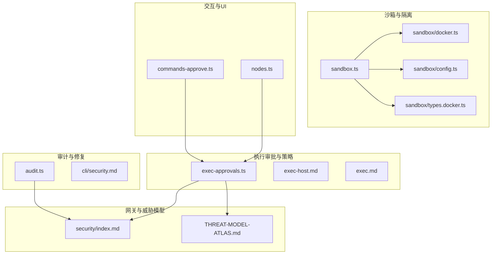
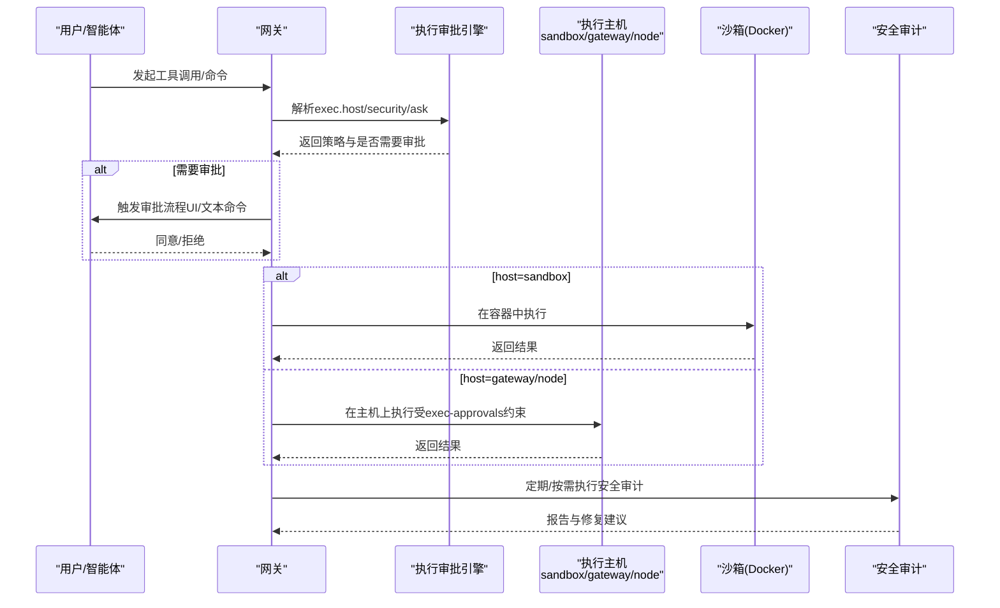
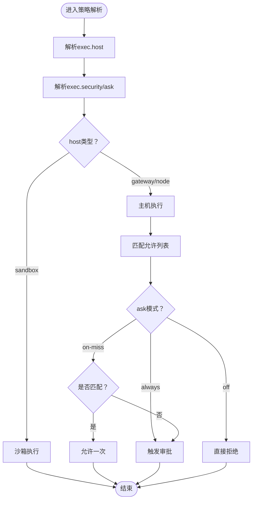
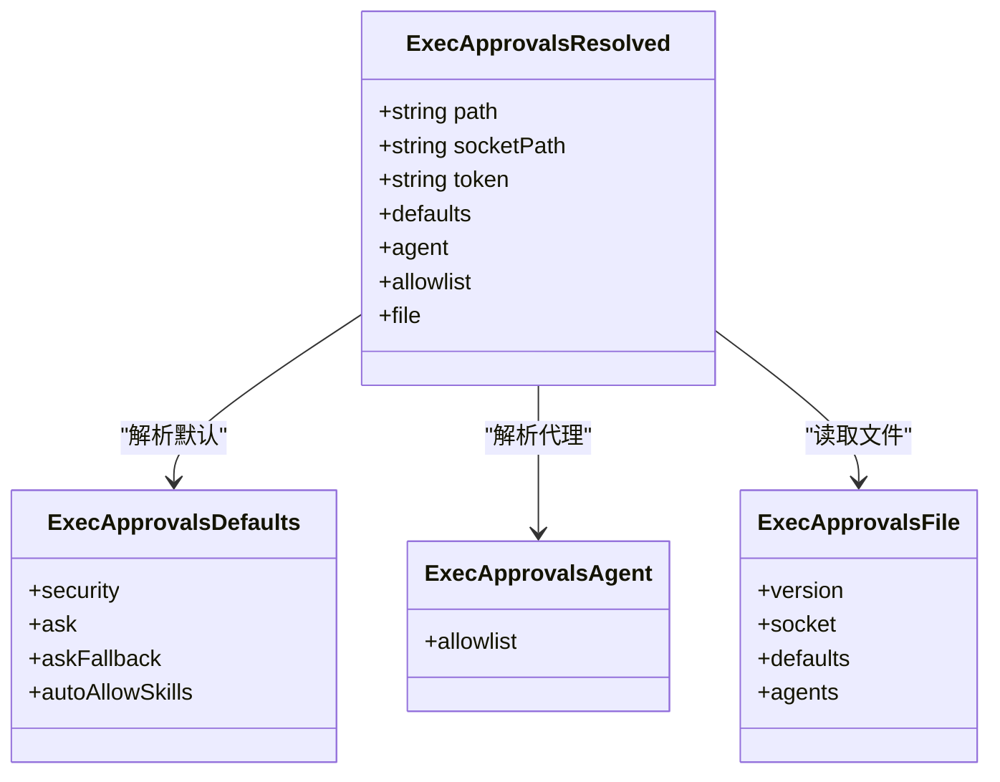
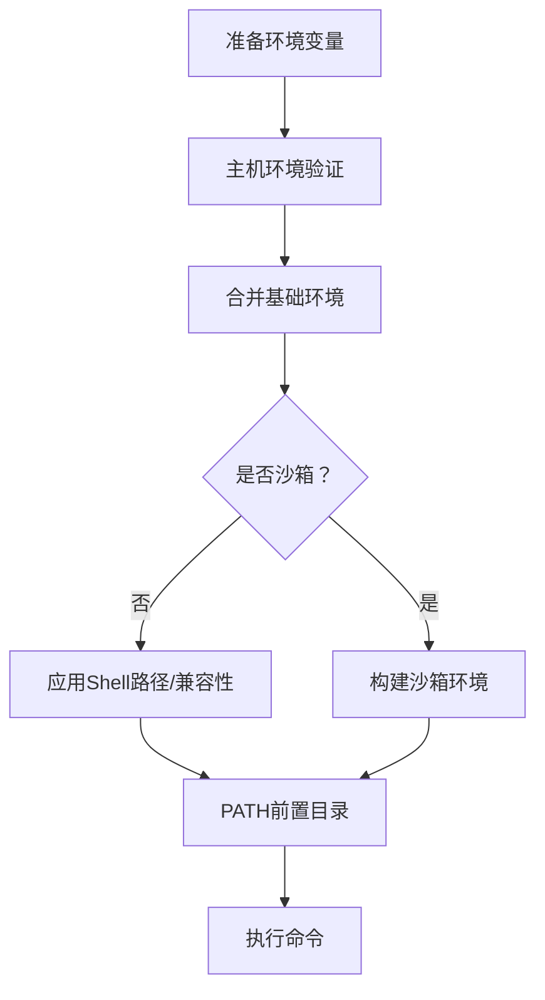
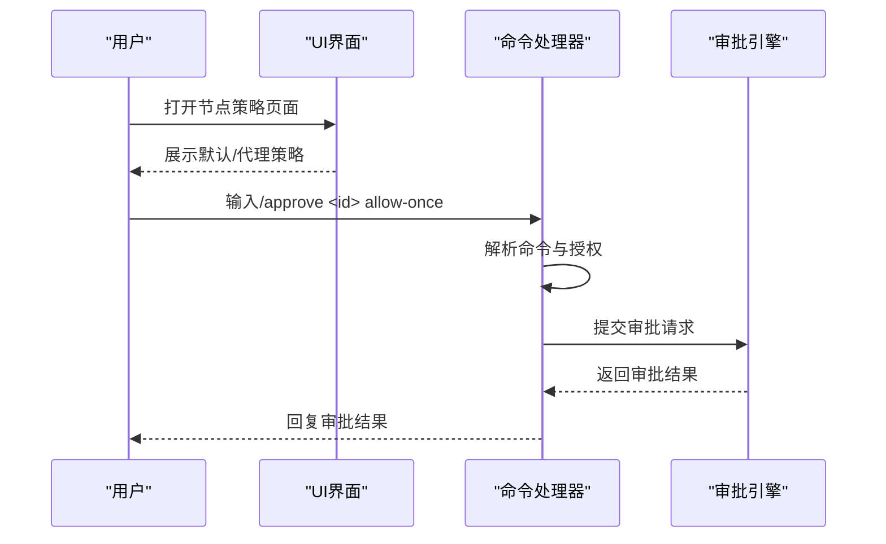
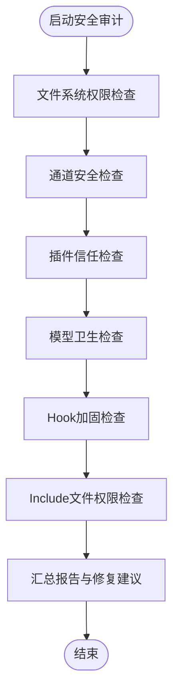
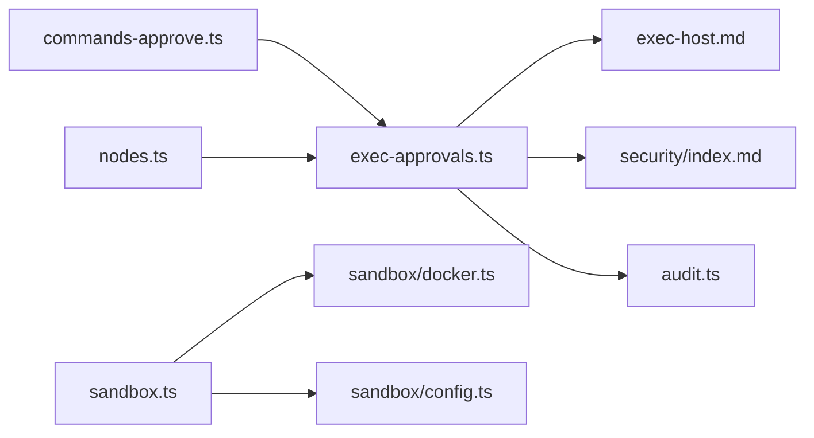

# 安全与权限

<cite>
**本文引用的文件**
- [exec-approvals.ts](file://src/infra/exec-approvals.ts)
- [exec.md](file://docs/zh-CN/tools/exec.md)
- [exec-host.md](file://docs/zh-CN/refactor/exec-host.md)
- [security.md](file://docs/gateway/security/index.md)
- [security.md](file://docs/cli/security.md)
- [audit.ts](file://src/security/audit.ts)
- [audit.md](file://docs/security/README.md)
- [threat-model.md](file://docs/security/THREAT-MODEL-ATLAS.md)
- [commands-approve.ts](file://src/auto-reply/reply/commands-approve.ts)
- [directive.ts](file://src/auto-reply/reply/exec/directive.ts)
- [bash-tools.exec.ts](file://src/agents/bash-tools.exec.ts)
- [sandbox.ts](file://src/agents/sandbox.ts)
- [docker.ts](file://src/agents/sandbox/docker.ts)
- [config.ts](file://src/agents/sandbox/config.ts)
- [types.docker.ts](file://src/agents/sandbox/types.docker.ts)
- [sandbox-merge.test.ts](file://src/agents/sandbox-merge.test.ts)
- [sandbox-create-args.test.ts](file://src/agents/sandbox-create-args.test.ts)
- [monitor/exec-approvals.test.ts](file://src/discord/monitor/exec-approvals.test.ts)
- [nodes.ts](file://ui/src/ui/views/nodes.ts)
- [exec-approvals.test.ts](file://src/infra/exec-approvals.test.ts)
- [path-env.test.ts](file://src/infra/path-env.test.ts)
- [RuntimeLocator.swift](file://apps/macos/Sources/OpenClaw/RuntimeLocator.swift)
</cite>

## 目录

1. [简介](#简介)
2. [项目结构](#项目结构)
3. [核心组件](#核心组件)
4. [架构总览](#架构总览)
5. [详细组件分析](#详细组件分析)
6. [依赖关系分析](#依赖关系分析)
7. [性能考量](#性能考量)
8. [故障排查指南](#故障排查指南)
9. [结论](#结论)
10. [附录](#附录)

## 简介

本文件面向OpenClaw设备节点的安全与权限体系，聚焦执行审批（exec approvals）机制、权限验证流程与安全策略实现，系统阐述执行主机的安全隔离、环境变量过滤与进程沙箱机制，并给出权限白名单、命令审批与安全审计的具体实现要点。同时提供安全配置选项、权限管理策略与威胁防护建议，以及合规性与最佳实践指导。

## 项目结构

围绕安全与权限的关键模块分布如下：

- 执行审批与策略解析：src/infra/exec-approvals.ts
- 执行主机与策略文档：docs/zh-CN/refactor/exec-host.md、docs/zh-CN/tools/exec.md
- 网关侧安全基线与威胁模型：docs/gateway/security/index.md、docs/security/THREAT-MODEL-ATLAS.md
- 审计与修复工具：src/security/audit.ts、docs/cli/security.md
- 沙箱与容器隔离：src/agents/sandbox.\*、src/agents/sandbox/docker.ts、src/agents/sandbox/config.ts
- 审批交互与UI：src/auto-reply/reply/commands-approve.ts、ui/src/ui/views/nodes.ts
- 平台与环境变量处理：apps/macos/Sources/OpenClaw/RuntimeLocator.swift、src/infra/path-env.test.ts

**图表来源**

- [exec-approvals.ts](file://src/infra/exec-approvals.ts#L1-L1633)
- [exec-host.md](file://docs/zh-CN/refactor/exec-host.md#L34-L287)
- [exec.md](file://docs/zh-CN/tools/exec.md#L37-L57)
- [security/index.md](file://docs/gateway/security/index.md#L1-L829)
- [THREAT-MODEL-ATLAS.md](file://docs/security/THREAT-MODEL-ATLAS.md#L1-L604)
- [audit.ts](file://src/security/audit.ts#L1-L1032)
- [cli/security.md](file://docs/cli/security.md#L1-L28)
- [sandbox.ts](file://src/agents/sandbox.ts#L1-L45)
- [sandbox/docker.ts](file://src/agents/sandbox/docker.ts#L36-L251)
- [sandbox/config.ts](file://src/agents/sandbox/config.ts#L55-L82)
- [sandbox/types.docker.ts](file://src/agents/sandbox/types.docker.ts#L1-L22)
- [commands-approve.ts](file://src/auto-reply/reply/commands-approve.ts#L43-L87)
- [nodes.ts](file://ui/src/ui/views/nodes.ts#L705-L719)

**章节来源**

- [exec-approvals.ts](file://src/infra/exec-approvals.ts#L1-L1633)
- [exec-host.md](file://docs/zh-CN/refactor/exec-host.md#L34-L287)
- [exec.md](file://docs/zh-CN/tools/exec.md#L37-L57)
- [security/index.md](file://docs/gateway/security/index.md#L1-L829)
- [THREAT-MODEL-ATLAS.md](file://docs/security/THREAT-MODEL-ATLAS.md#L1-L604)
- [audit.ts](file://src/security/audit.ts#L1-L1032)
- [cli/security.md](file://docs/cli/security.md#L1-L28)
- [sandbox.ts](file://src/agents/sandbox.ts#L1-L45)
- [sandbox/docker.ts](file://src/agents/sandbox/docker.ts#L36-L251)
- [sandbox/config.ts](file://src/agents/sandbox/config.ts#L55-L82)
- [sandbox/types.docker.ts](file://src/agents/sandbox/types.docker.ts#L1-L22)
- [commands-approve.ts](file://src/auto-reply/reply/commands-approve.ts#L43-L87)
- [nodes.ts](file://ui/src/ui/views/nodes.ts#L705-L719)

## 核心组件

- 执行审批与策略解析：负责加载、合并与规范化执行审批配置，解析主机、安全与询问策略，匹配允许列表，生成决策。
- 执行主机与策略文档：定义host（sandbox/gateway/node）、security（deny/allowlist/full）、ask（off/on-miss/always）三要素及默认安全策略。
- 网关安全基线与威胁模型：提供最小可行安全配置、风险矩阵与攻击链，强调“先身份、再范围、最后模型”的设计原则。
- 审计与修复工具：扫描文件系统权限、通道安全、插件信任、模型卫生等，提供修复建议。
- 沙箱与容器隔离：提供Docker沙箱参数、资源限制、网络隔离、只读根文件系统、seccomp/apparmor等强化配置。
- 审批交互与UI：文本命令审批与UI界面展示，结合Unix Socket进行授权交互。

**章节来源**

- [exec-approvals.ts](file://src/infra/exec-approvals.ts#L1-L1633)
- [exec-host.md](file://docs/zh-CN/refactor/exec-host.md#L34-L287)
- [security/index.md](file://docs/gateway/security/index.md#L1-L829)
- [audit.ts](file://src/security/audit.ts#L1-L1032)
- [sandbox/docker.ts](file://src/agents/sandbox/docker.ts#L36-L251)
- [sandbox/config.ts](file://src/agents/sandbox/config.ts#L55-L82)
- [commands-approve.ts](file://src/auto-reply/reply/commands-approve.ts#L43-L87)
- [nodes.ts](file://ui/src/ui/views/nodes.ts#L705-L719)

## 架构总览

OpenClaw的安全与权限体系以“策略解析—执行审批—隔离执行—审计修复”为主线，贯穿网关、节点与沙箱三层边界。

**图表来源**

- [exec-host.md](file://docs/zh-CN/refactor/exec-host.md#L69-L110)
- [exec-approvals.ts](file://src/infra/exec-approvals.ts#L318-L388)
- [sandbox/docker.ts](file://src/agents/sandbox/docker.ts#L125-L251)
- [audit.ts](file://src/security/audit.ts#L1-L200)

## 详细组件分析

### 执行审批与策略解析（exec-approvals）

- 配置结构与默认值：支持默认策略、代理策略、通配策略合并；默认security=deny、ask=on-miss；socket路径与令牌自动生成与持久化。
- 策略解析：按工具参数→智能体覆盖→全局默认顺序解析host/security/ask；支持ask与allowlist独立控制。
- 允许列表匹配：支持通配符与大小写归一化；针对Windows路径进行规范化与realpath解析；支持多源合并（通配+代理）。
- 审批决策：根据ask模式与allowlist匹配情况决定是否需要审批；支持socket请求审批（超时与连接保护）。
- 文件安全：exec-approvals.json以严格权限写入；socket令牌随机生成；路径展开与存在性校验。

**图表来源**

- [exec-approvals.ts](file://src/infra/exec-approvals.ts#L318-L388)
- [exec-approvals.ts](file://src/infra/exec-approvals.ts#L582-L604)
- [exec-approvals.ts](file://src/infra/exec-approvals.ts#L1569-L1603)

**章节来源**

- [exec-approvals.ts](file://src/infra/exec-approvals.ts#L1-L1633)
- [exec-host.md](file://docs/zh-CN/refactor/exec-host.md#L69-L110)
- [exec.md](file://docs/zh-CN/tools/exec.md#L37-L57)

### 执行主机与安全隔离

- 主机类型：sandbox（Docker容器）、gateway（网关主机）、node（节点运行器）。
- 安全模式：deny（总是拒绝）、allowlist（仅允许匹配）、full（放行，等同提升）。
- 询问模式：off（从不）、on-miss（未命中允许列表时）、always（每次都问）。
- 默认安全：host默认sandbox；gateway/node默认security=deny；ask默认on-miss；未绑定节点时可定向任意节点但需策略允许。
- 网络与环境：主机执行拒绝PATH与loader覆盖（LD*\*、DYLD*\*），防止劫持；非Windows主机自动选择兼容shell。

**图表来源**

- [exec-approvals.ts](file://src/infra/exec-approvals.ts#L318-L388)

**章节来源**

- [exec-host.md](file://docs/zh-CN/refactor/exec-host.md#L40-L110)
- [exec.md](file://docs/zh-CN/tools/exec.md#L37-L57)

### 环境变量过滤与进程隔离

- 环境变量过滤：主机执行前对环境进行验证，拒绝危险变量；沙箱模式下使用构建后的环境变量集。
- Shell路径与兼容性：非Windows主机优先使用兼容shell（如bash），避免fish不兼容脚本；必要时回退到SHELL。
- PATH预处理：支持在PATH前追加目录，确保安全二进制优先可见。
- 进程隔离：沙箱容器采用只读根文件系统、无网络、seccomp/apparmor、资源限制（CPU/内存/PIDs/ulimits）等强化。

**图表来源**

- [bash-tools.exec.ts](file://src/agents/bash-tools.exec.ts#L996-L1022)
- [sandbox/docker.ts](file://src/agents/sandbox/docker.ts#L125-L167)
- [sandbox/config.ts](file://src/agents/sandbox/config.ts#L55-L82)
- [sandbox-create-args.test.ts](file://src/agents/sandbox-create-args.test.ts#L1-L147)

**章节来源**

- [bash-tools.exec.ts](file://src/agents/bash-tools.exec.ts#L996-L1022)
- [sandbox/docker.ts](file://src/agents/sandbox/docker.ts#L125-L167)
- [sandbox/config.ts](file://src/agents/sandbox/config.ts#L55-L82)
- [sandbox-create-args.test.ts](file://src/agents/sandbox-create-args.test.ts#L1-L147)

### 审批交互与UI

- 文本命令审批：/approve命令解析与授权校验，支持别名与错误提示。
- UI策略展示：节点视图中展示默认与代理策略、询问回退、自动允许技能等。
- 平台差异：macOS运行时定位可执行文件，确保安全路径解析。

**图表来源**

- [commands-approve.ts](file://src/auto-reply/reply/commands-approve.ts#L43-L87)
- [nodes.ts](file://ui/src/ui/views/nodes.ts#L705-L719)
- [RuntimeLocator.swift](file://apps/macos/Sources/OpenClaw/RuntimeLocator.swift#L111-L133)

**章节来源**

- [commands-approve.ts](file://src/auto-reply/reply/commands-approve.ts#L43-L87)
- [nodes.ts](file://ui/src/ui/views/nodes.ts#L705-L719)
- [RuntimeLocator.swift](file://apps/macos/Sources/OpenClaw/RuntimeLocator.swift#L111-L133)

### 安全审计与修复

- 审计范围：文件系统权限、通道安全、插件信任、模型卫生、Hook加固、Include文件权限、同步目录等。
- 报告结构：包含严重级别统计与逐条发现，支持深度探测（如网关连通性）。
- 修复建议：针对权限问题提供chmod建议；针对配置问题提供默认收紧策略。

**图表来源**

- [audit.ts](file://src/security/audit.ts#L1-L200)
- [security/index.md](file://docs/gateway/security/index.md#L10-L800)

**章节来源**

- [audit.ts](file://src/security/audit.ts#L1-L1032)
- [security/index.md](file://docs/gateway/security/index.md#L10-L800)
- [cli/security.md](file://docs/cli/security.md#L1-L28)

### 威胁模型与防护

- MITRE ATLAS框架下的威胁识别：包括执行（EXEC）、持久化（PERSIST）、防御规避（EVADE）、发现（DISC）、数据窃取（EXFIL）、影响（IMPACT）等。
- 关键威胁与缓解：执行审批绕过、供应链攻击、凭据泄露、资源耗尽等；推荐实施VirusTotal集成、技能沙箱、输出验证、速率限制、凭据加密等。
- 攻击链：提示注入→审批绕过→远程命令执行；供应链→规避→数据窃取；间接注入→外泄。

**章节来源**

- [THREAT-MODEL-ATLAS.md](file://docs/security/THREAT-MODEL-ATLAS.md#L1-L604)
- [security/index.md](file://docs/gateway/security/index.md#L130-L829)

## 依赖关系分析

- 组件耦合：执行审批引擎与策略文档强耦合，与UI/命令处理器弱耦合；沙箱模块与容器运行时强耦合。
- 外部依赖：Docker运行时、平台权限模型（POSIX/ACL）、通道与网关认证。
- 潜在环路：策略解析与UI交互之间无直接循环；审计与策略解析相互独立。

**图表来源**

- [exec-approvals.ts](file://src/infra/exec-approvals.ts#L1-L1633)
- [exec-host.md](file://docs/zh-CN/refactor/exec-host.md#L34-L287)
- [security/index.md](file://docs/gateway/security/index.md#L1-L829)
- [audit.ts](file://src/security/audit.ts#L1-L1032)
- [sandbox.ts](file://src/agents/sandbox.ts#L1-L45)
- [sandbox/docker.ts](file://src/agents/sandbox/docker.ts#L36-L251)
- [sandbox/config.ts](file://src/agents/sandbox/config.ts#L55-L82)
- [commands-approve.ts](file://src/auto-reply/reply/commands-approve.ts#L43-L87)
- [nodes.ts](file://ui/src/ui/views/nodes.ts#L705-L719)

**章节来源**

- [exec-approvals.ts](file://src/infra/exec-approvals.ts#L1-L1633)
- [sandbox.ts](file://src/agents/sandbox.ts#L1-L45)

## 性能考量

- 策略解析与匹配：允许列表匹配采用通配符正则，建议合理规划条目数量与粒度，避免过多复杂模式导致匹配开销。
- 沙箱启动与资源：容器创建参数包含资源限制与安全选项，建议按场景调整CPU/内存/PIDs/ulimits，平衡性能与安全。
- 审计扫描：深度探测可能带来网络延迟，建议在维护窗口执行深度审计。

[本节为通用指导，不涉及具体文件分析]

## 故障排查指南

- 审批失败或超时：检查exec-approvals.json是否存在、socket路径与令牌是否正确；确认UI/命令处理器是否具备授权。
- 允许列表不生效：核对模式大小写、Windows路径规范化与realpath解析；确认条目是否被合并或去重。
- 环境变量异常：主机执行前会进行验证，检查是否包含被拒绝的变量；沙箱模式下确认构建的环境变量集合。
- 权限问题：使用安全审计工具检查状态目录与配置文件权限，按建议收紧权限。

**章节来源**

- [exec-approvals.ts](file://src/infra/exec-approvals.ts#L221-L295)
- [exec-approvals.test.ts](file://src/infra/exec-approvals.test.ts#L469-L516)
- [monitor/exec-approvals.test.ts](file://src/discord/monitor/exec-approvals.test.ts#L41-L79)
- [audit.ts](file://src/security/audit.ts#L197-L231)

## 结论

OpenClaw通过“策略解析—执行审批—隔离执行—审计修复”的闭环，实现了对设备节点执行权限的精细化控制。执行审批机制、沙箱隔离与环境变量过滤共同构成安全基线；结合威胁模型与审计工具，形成持续改进的安全体系。建议默认启用沙箱、严格allowlist、最小权限原则与定期审计，以满足高安全要求场景。

[本节为总结性内容，不涉及具体文件分析]

## 附录

- 安全配置清单
  - 执行主机：tools.exec.host（默认sandbox）、tools.exec.security（默认deny）、tools.exec.ask（默认on-miss）
  - 节点绑定：tools.exec.node（默认未设置）
  - PATH与安全二进制：tools.exec.pathPrepend、tools.exec.safeBins
  - 审批存储：~/.openclaw/exec-approvals.json（严格权限）
- 最佳实践
  - 默认沙箱执行，避免host=gateway/node直连
  - 严格allowlist与on-miss询问模式
  - 定期运行安全审计，收紧权限与策略
  - 供应链安全：VirusTotal集成、技能沙箱、社区举报与审计日志
- 合规性与报告
  - 漏洞披露遵循信任页指引
  - 威胁模型与风险矩阵用于评估与记录

**章节来源**

- [exec.md](file://docs/zh-CN/tools/exec.md#L37-L57)
- [exec-host.md](file://docs/zh-CN/refactor/exec-host.md#L83-L110)
- [security.md](file://docs/security/README.md#L1-L18)
- [THREAT-MODEL-ATLAS.md](file://docs/security/THREAT-MODEL-ATLAS.md#L530-L588)
