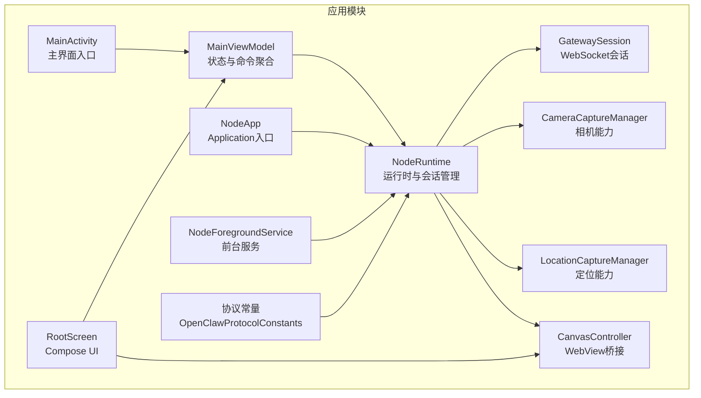
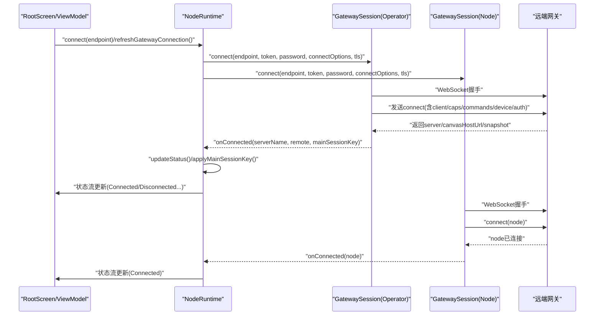
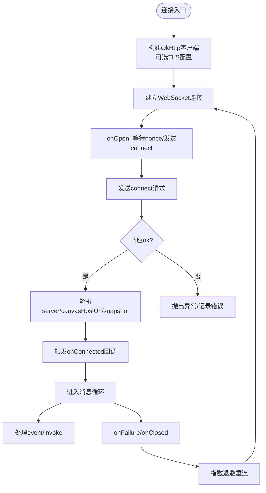
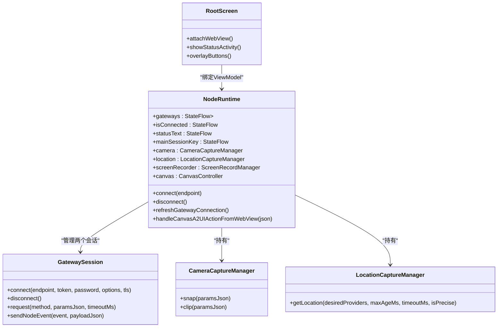
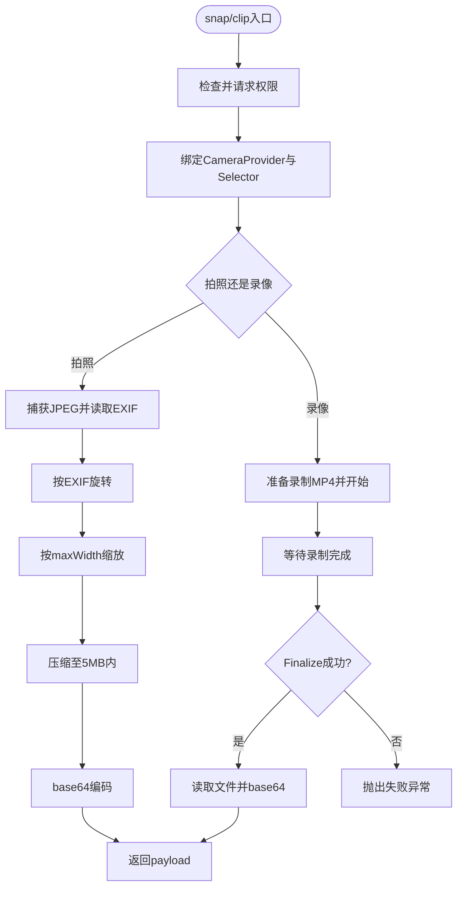
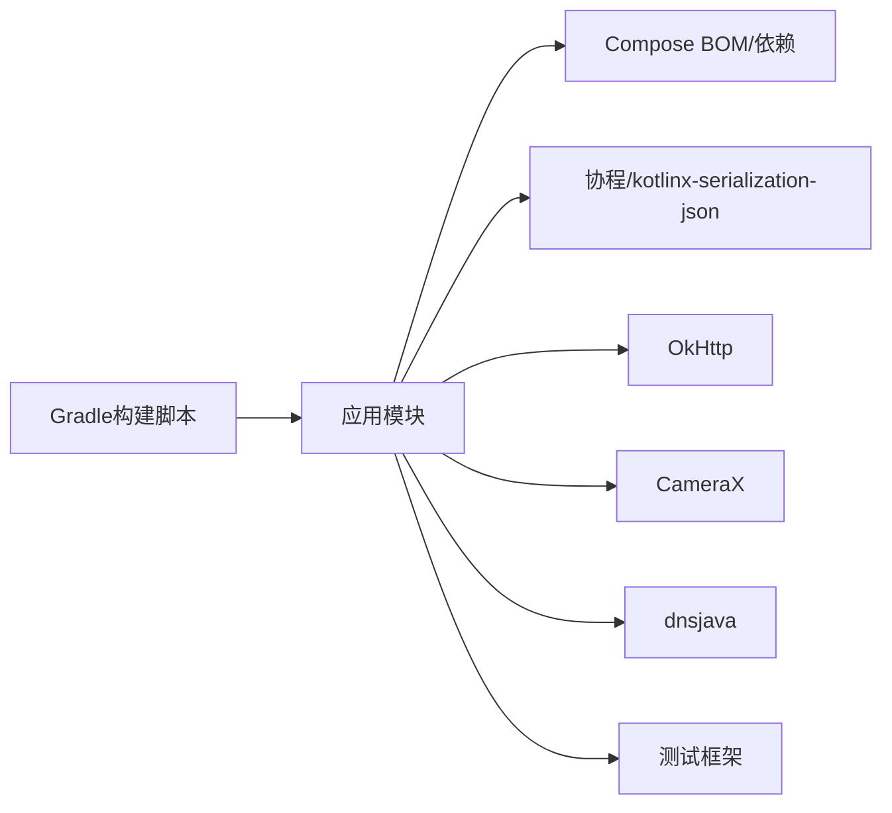

# Android 应用实现

<cite>
**本文引用的文件**
- [apps/android/app/src/main/java/ai/openclaw/android/MainActivity.kt](file://apps/android/app/src/main/java/ai/openclaw/android/MainActivity.kt)
- [apps/android/app/src/main/java/ai/openclaw/android/NodeApp.kt](file://apps/android/app/src/main/java/ai/openclaw/android/NodeApp.kt)
- [apps/android/app/src/main/java/ai/openclaw/android/NodeRuntime.kt](file://apps/android/app/src/main/java/ai/openclaw/android/NodeRuntime.kt)
- [apps/android/app/src/main/java/ai/openclaw/android/NodeForegroundService.kt](file://apps/android/app/src/main/java/ai/openclaw/android/NodeForegroundService.kt)
- [apps/android/app/src/main/java/ai/openclaw/android/MainViewModel.kt](file://apps/android/app/src/main/java/ai/openclaw/android/MainViewModel.kt)
- [apps/android/app/src/main/java/ai/openclaw/android/gateway/GatewaySession.kt](file://apps/android/app/src/main/java/ai/openclaw/android/gateway/GatewaySession.kt)
- [apps/android/app/src/main/java/ai/openclaw/android/node/CameraCaptureManager.kt](file://apps/android/app/src/main/java/ai/openclaw/android/node/CameraCaptureManager.kt)
- [apps/android/app/src/main/java/ai/openclaw/android/node/LocationCaptureManager.kt](file://apps/android/app/src/main/java/ai/openclaw/android/node/LocationCaptureManager.kt)
- [apps/android/app/src/main/java/ai/openclaw/android/protocol/OpenClawProtocolConstants.kt](file://apps/android/app/src/main/java/ai/openclaw/android/protocol/OpenClawProtocolConstants.kt)
- [apps/android/app/src/main/java/ai/openclaw/android/ui/RootScreen.kt](file://apps/android/app/src/main/java/ai/openclaw/android/ui/RootScreen.kt)
- [apps/android/app/src/main/AndroidManifest.xml](file://apps/android/app/src/main/AndroidManifest.xml)
- [apps/android/app/build.gradle.kts](file://apps/android/app/build.gradle.kts)
- [apps/android/build.gradle.kts](file://apps/android/build.gradle.kts)
- [apps/android/app/src/test/java/ai/openclaw/android/gateway/BonjourEscapesTest.kt](file://apps/android/app/src/test/java/ai/openclaw/android/gateway/BonjourEscapesTest.kt)
</cite>

## 目录
1. [引言](#引言)
2. [项目结构](#项目结构)
3. [核心组件](#核心组件)
4. [架构总览](#架构总览)
5. [详细组件分析](#详细组件分析)
6. [依赖关系分析](#依赖关系分析)
7. [性能与兼容性](#性能与兼容性)
8. [权限与安全](#权限与安全)
9. [测试与调试](#测试与调试)
10. [故障排查指南](#故障排查指南)
11. [结论](#结论)

## 引言
本文件面向OpenClaw Android节点应用，系统化梳理其架构设计、权限管理与系统集成方案，深入解析WebSocket连接建立、设备发现与配对、以及相机、位置、联系人与媒体处理等Android特有能力的实现方式。同时覆盖Gradle多模块构建、Compose UI、测试框架与调试工具，并提供性能优化与用户体验优化建议。

## 项目结构
Android应用位于apps/android目录，采用单模块应用（app）组织，核心源码集中在app/src/main/java/ai/openclaw/android下，资源位于app/src/main/res与AndroidManifest.xml中。构建脚本位于app/build.gradle.kts与根级settings与build脚本中。

图表来源
- [apps/android/app/src/main/java/ai/openclaw/android/MainActivity.kt](file://apps/android/app/src/main/java/ai/openclaw/android/MainActivity.kt#L25-L65)
- [apps/android/app/src/main/java/ai/openclaw/android/MainViewModel.kt](file://apps/android/app/src/main/java/ai/openclaw/android/MainViewModel.kt#L13-L66)
- [apps/android/app/src/main/java/ai/openclaw/android/NodeApp.kt](file://apps/android/app/src/main/java/ai/openclaw/android/NodeApp.kt#L6-L26)
- [apps/android/app/src/main/java/ai/openclaw/android/NodeForegroundService.kt](file://apps/android/app/src/main/java/ai/openclaw/android/NodeForegroundService.kt#L23-L64)
- [apps/android/app/src/main/java/ai/openclaw/android/NodeRuntime.kt](file://apps/android/app/src/main/java/ai/openclaw/android/NodeRuntime.kt#L61-L110)
- [apps/android/app/src/main/java/ai/openclaw/android/gateway/GatewaySession.kt](file://apps/android/app/src/main/java/ai/openclaw/android/gateway/GatewaySession.kt#L55-L64)
- [apps/android/app/src/main/java/ai/openclaw/android/node/CameraCaptureManager.kt](file://apps/android/app/src/main/java/ai/openclaw/android/node/CameraCaptureManager.kt#L37-L49)
- [apps/android/app/src/main/java/ai/openclaw/android/node/LocationCaptureManager.kt](file://apps/android/app/src/main/java/ai/openclaw/android/node/LocationCaptureManager.kt#L19-L27)
- [apps/android/app/src/main/java/ai/openclaw/android/ui/RootScreen.kt](file://apps/android/app/src/main/java/ai/openclaw/android/ui/RootScreen.kt#L72-L90)
- [apps/android/app/src/main/java/ai/openclaw/android/protocol/OpenClawProtocolConstants.kt](file://apps/android/app/src/main/java/ai/openclaw/android/protocol/OpenClawProtocolConstants.kt#L3-L71)

章节来源
- [apps/android/app/build.gradle.kts](file://apps/android/app/build.gradle.kts#L10-L58)
- [apps/android/build.gradle.kts](file://apps/android/build.gradle.kts#L1-L7)

## 核心组件
- NodeApp：应用生命周期入口，启用严格模式（仅Debug）。
- NodeRuntime：运行时核心，负责网关发现与连接、会话管理、能力与命令构建、设备认证存储、Canvas桥接、语音唤醒与通话模式、相机/定位/屏幕录制/SMS等节点能力。
- GatewaySession：基于OkHttp的WebSocket客户端，封装connect、请求/响应、事件分发、invoke调用与TLS指纹校验。
- NodeForegroundService：前台服务，持续显示连接状态通知并按需声明麦克风前台类型。
- MainViewModel：将NodeRuntime状态与命令暴露给UI层，统一管理连接、聊天、能力开关等。
- RootScreen：Compose UI根界面，承载WebView画布、状态指示、悬浮操作按钮与底部面板。
- 协议常量：定义OpenClaw能力与命令命名空间，用于动态构建连接参数与命令列表。

章节来源
- [apps/android/app/src/main/java/ai/openclaw/android/NodeApp.kt](file://apps/android/app/src/main/java/ai/openclaw/android/NodeApp.kt#L6-L26)
- [apps/android/app/src/main/java/ai/openclaw/android/NodeRuntime.kt](file://apps/android/app/src/main/java/ai/openclaw/android/NodeRuntime.kt#L61-L110)
- [apps/android/app/src/main/java/ai/openclaw/android/gateway/GatewaySession.kt](file://apps/android/app/src/main/java/ai/openclaw/android/gateway/GatewaySession.kt#L55-L64)
- [apps/android/app/src/main/java/ai/openclaw/android/NodeForegroundService.kt](file://apps/android/app/src/main/java/ai/openclaw/android/NodeForegroundService.kt#L23-L64)
- [apps/android/app/src/main/java/ai/openclaw/android/MainViewModel.kt](file://apps/android/app/src/main/java/ai/openclaw/android/MainViewModel.kt#L13-L66)
- [apps/android/app/src/main/java/ai/openclaw/android/ui/RootScreen.kt](file://apps/android/app/src/main/java/ai/openclaw/android/ui/RootScreen.kt#L72-L90)
- [apps/android/app/src/main/java/ai/openclaw/android/protocol/OpenClawProtocolConstants.kt](file://apps/android/app/src/main/java/ai/openclaw/android/protocol/OpenClawProtocolConstants.kt#L3-L71)

## 架构总览
应用采用“运行时-会话-能力”三层架构：
- 运行时（NodeRuntime）：聚合所有节点能力与网关会话，维护状态流，构建连接选项与能力/命令清单。
- 会话（GatewaySession）：封装WebSocket连接、鉴权、事件与invoke处理，支持自动重连与TLS指纹持久化。
- 能力（Camera/Location/Screen/SMS）：通过Manager类在需要时请求权限并执行采集或操作。
- UI（RootScreen + ViewModel）：以Compose呈现，承载WebView画布与交互控件，驱动运行时状态与命令。

图表来源
- [apps/android/app/src/main/java/ai/openclaw/android/NodeRuntime.kt](file://apps/android/app/src/main/java/ai/openclaw/android/NodeRuntime.kt#L549-L570)
- [apps/android/app/src/main/java/ai/openclaw/android/gateway/GatewaySession.kt](file://apps/android/app/src/main/java/ai/openclaw/android/gateway/GatewaySession.kt#L102-L133)
- [apps/android/app/src/main/java/ai/openclaw/android/gateway/GatewaySession.kt](file://apps/android/app/src/main/java/ai/openclaw/android/gateway/GatewaySession.kt#L294-L326)

## 详细组件分析

### 网络与会话：GatewaySession
- WebSocket连接：根据端点与TLS参数选择ws/wss，使用OkHttp创建WebSocket；连接成功后发送connect请求，解析返回的canvasHostUrl与mainSessionKey。
- 请求/响应：基于JSON-RPC风格，请求携带id并在超时时间内等待响应；失败时抛出异常。
- 事件与invoke：接收"event"帧分发到上层；接收"node.invoke.request"时调用回调生成结果并回传。
- 自动重连：runLoop循环尝试连接，指数退避；断开时清理状态并触发UI断开提示。
- TLS指纹：支持从网关返回或本地存储的指纹进行校验，必要时允许TOFU。

图表来源
- [apps/android/app/src/main/java/ai/openclaw/android/gateway/GatewaySession.kt](file://apps/android/app/src/main/java/ai/openclaw/android/gateway/GatewaySession.kt#L171-L292)
- [apps/android/app/src/main/java/ai/openclaw/android/gateway/GatewaySession.kt](file://apps/android/app/src/main/java/ai/openclaw/android/gateway/GatewaySession.kt#L548-L583)

章节来源
- [apps/android/app/src/main/java/ai/openclaw/android/gateway/GatewaySession.kt](file://apps/android/app/src/main/java/ai/openclaw/android/gateway/GatewaySession.kt#L55-L64)
- [apps/android/app/src/main/java/ai/openclaw/android/gateway/GatewaySession.kt](file://apps/android/app/src/main/java/ai/openclaw/android/gateway/GatewaySession.kt#L102-L133)
- [apps/android/app/src/main/java/ai/openclaw/android/gateway/GatewaySession.kt](file://apps/android/app/src/main/java/ai/openclaw/android/gateway/GatewaySession.kt#L294-L326)
- [apps/android/app/src/main/java/ai/openclaw/android/gateway/GatewaySession.kt](file://apps/android/app/src/main/java/ai/openclaw/android/gateway/GatewaySession.kt#L418-L455)
- [apps/android/app/src/main/java/ai/openclaw/android/gateway/GatewaySession.kt](file://apps/android/app/src/main/java/ai/openclaw/android/gateway/GatewaySession.kt#L548-L583)

### 运行时与UI：NodeRuntime 与 RootScreen
- NodeRuntime职责：
  - 维护状态流：连接状态、服务器名、远端地址、主会话键、前景态、相机HUD、录屏状态等。
  - 构建连接选项：根据能力与命令动态生成caps/commands/client信息，拼装User-Agent。
  - 管理会话：同时维护operator与node两个会话，分别上报状态与处理invoke。
  - 能力开关：依据偏好设置决定是否暴露camera/location/screen/sms/voiceWake等能力。
  - Canvas桥接：接收WebView侧A2UI动作，格式化消息并通过node会话发送agent.request。
  - 自动连接：监听网关发现列表，支持手动主机/端口与上次发现稳定ID的自动连接。
- RootScreen职责：
  - 承载WebView画布，注入JS桥接接口，转发A2UI动作到运行时。
  - 呈现状态指示、悬浮操作按钮（聊天、Talk模式、设置）、底部面板。
  - 处理权限请求（如录音），根据状态动态展示活动提示（拍照/录音/修复/待审批等）。

图表来源
- [apps/android/app/src/main/java/ai/openclaw/android/NodeRuntime.kt](file://apps/android/app/src/main/java/ai/openclaw/android/NodeRuntime.kt#L61-L110)
- [apps/android/app/src/main/java/ai/openclaw/android/gateway/GatewaySession.kt](file://apps/android/app/src/main/java/ai/openclaw/android/gateway/GatewaySession.kt#L55-L64)
- [apps/android/app/src/main/java/ai/openclaw/android/node/CameraCaptureManager.kt](file://apps/android/app/src/main/java/ai/openclaw/android/node/CameraCaptureManager.kt#L37-L49)
- [apps/android/app/src/main/java/ai/openclaw/android/node/LocationCaptureManager.kt](file://apps/android/app/src/main/java/ai/openclaw/android/node/LocationCaptureManager.kt#L19-L27)
- [apps/android/app/src/main/java/ai/openclaw/android/ui/RootScreen.kt](file://apps/android/app/src/main/java/ai/openclaw/android/ui/RootScreen.kt#L72-L90)

章节来源
- [apps/android/app/src/main/java/ai/openclaw/android/NodeRuntime.kt](file://apps/android/app/src/main/java/ai/openclaw/android/NodeRuntime.kt#L305-L390)
- [apps/android/app/src/main/java/ai/openclaw/android/NodeRuntime.kt](file://apps/android/app/src/main/java/ai/openclaw/android/NodeRuntime.kt#L452-L487)
- [apps/android/app/src/main/java/ai/openclaw/android/NodeRuntime.kt](file://apps/android/app/src/main/java/ai/openclaw/android/NodeRuntime.kt#L652-L722)
- [apps/android/app/src/main/java/ai/openclaw/android/ui/RootScreen.kt](file://apps/android/app/src/main/java/ai/openclaw/android/ui/RootScreen.kt#L317-L410)

### 相机与视频：CameraCaptureManager
- 权限管理：拍照与录像前检查并请求CAMERA与RECORD_AUDIO权限。
- 拍照流程：选择前后摄像头，捕获JPEG，读取EXIF旋转角度，按最大宽度缩放，压缩至5MB以内，返回base64与尺寸。
- 录像流程：绑定VideoCapture，准备输出MP4，启动录制指定时长，等待Finalize事件，读取文件并base64编码返回。
- 参数解析：支持facing/quality/maxWidth/durationMs/includeAudio等参数解析。

图表来源
- [apps/android/app/src/main/java/ai/openclaw/android/node/CameraCaptureManager.kt](file://apps/android/app/src/main/java/ai/openclaw/android/node/CameraCaptureManager.kt#L75-L137)
- [apps/android/app/src/main/java/ai/openclaw/android/node/CameraCaptureManager.kt](file://apps/android/app/src/main/java/ai/openclaw/android/node/CameraCaptureManager.kt#L140-L198)

章节来源
- [apps/android/app/src/main/java/ai/openclaw/android/node/CameraCaptureManager.kt](file://apps/android/app/src/main/java/ai/openclaw/android/node/CameraCaptureManager.kt#L51-L73)
- [apps/android/app/src/main/java/ai/openclaw/android/node/CameraCaptureManager.kt](file://apps/android/app/src/main/java/ai/openclaw/android/node/CameraCaptureManager.kt#L225-L265)

### 定位：LocationCaptureManager
- 权限与可用性：检查ACCESS_FINE_LOCATION与ACCESS_COARSE_LOCATION，若均未授权则抛出权限不足异常；若无任一provider启用则报不可用。
- 缓存优先：优先返回满足maxAge的最近已知位置；否则发起getCurrentLocation请求，带超时与取消信号。
- 输出格式：返回包含经纬度、精度、海拔、速度、航向、时间戳、来源与精度模式的JSON字符串。

章节来源
- [apps/android/app/src/main/java/ai/openclaw/android/node/LocationCaptureManager.kt](file://apps/android/app/src/main/java/ai/openclaw/android/node/LocationCaptureManager.kt#L22-L62)
- [apps/android/app/src/main/java/ai/openclaw/android/node/LocationCaptureManager.kt](file://apps/android/app/src/main/java/ai/openclaw/android/node/LocationCaptureManager.kt#L64-L84)
- [apps/android/app/src/main/java/ai/openclaw/android/node/LocationCaptureManager.kt](file://apps/android/app/src/main/java/ai/openclaw/android/node/LocationCaptureManager.kt#L86-L116)

### 前台服务与通知：NodeForegroundService
- 生命周期：在NodeApp初始化后启动，订阅NodeRuntime状态流，动态更新通知标题与文本。
- 类型切换：当处于Always模式且具备录音权限时，前台类型包含MICROPHONE，确保后台持续监听。
- 行为：支持停止动作，触发断开并停止自身。

章节来源
- [apps/android/app/src/main/java/ai/openclaw/android/NodeForegroundService.kt](file://apps/android/app/src/main/java/ai/openclaw/android/NodeForegroundService.kt#L35-L63)
- [apps/android/app/src/main/java/ai/openclaw/android/NodeForegroundService.kt](file://apps/android/app/src/main/java/ai/openclaw/android/NodeForegroundService.kt#L138-L153)

### 主界面与状态：MainActivity 与 MainViewModel
- MainActivity：启用WebView调试、沉浸式窗口、请求必要权限（WiFi发现、通知）、启动前台服务、绑定相机/短信/录屏权限请求器与生命周期。
- MainViewModel：将NodeRuntime的所有状态与命令映射为可观察的StateFlow，供UI消费与调用。

章节来源
- [apps/android/app/src/main/java/ai/openclaw/android/MainActivity.kt](file://apps/android/app/src/main/java/ai/openclaw/android/MainActivity.kt#L30-L65)
- [apps/android/app/src/main/java/ai/openclaw/android/MainActivity.kt](file://apps/android/app/src/main/java/ai/openclaw/android/MainActivity.kt#L97-L129)
- [apps/android/app/src/main/java/ai/openclaw/android/MainViewModel.kt](file://apps/android/app/src/main/java/ai/openclaw/android/MainViewModel.kt#L13-L66)

## 依赖关系分析
- 构建插件与版本：应用插件、Kotlin Android/Compose/Serialization插件；compileSdk/targetSdk/minSdk；Java 17；Compose BOM；OkHttp；CameraX；dnsjava；测试框架。
- 运行时依赖：NodeRuntime依赖GatewaySession、Camera/Location/Screen/Sms管理器、Canvas控制器、设备身份与认证存储、偏好设置。
- UI依赖：RootScreen依赖NodeRuntime状态流、WebView、Compose Material3与Navigation。

图表来源
- [apps/android/app/build.gradle.kts](file://apps/android/app/build.gradle.kts#L80-L124)

章节来源
- [apps/android/app/build.gradle.kts](file://apps/android/app/build.gradle.kts#L10-L58)
- [apps/android/app/build.gradle.kts](file://apps/android/app/build.gradle.kts#L80-L124)

## 性能与兼容性
- 性能优化
  - 相机拍照：先按最大宽度缩放再压缩，避免超大负载；JPEG压缩采用二分/试错策略限制5MB上限。
  - 录音/录屏：在主线程绑定相机/视频捕获，完成后回收中间Bitmap，减少内存峰值。
  - WebSocket：请求超时与失败快速反馈，指数退避重连降低网络抖动影响。
- 兼容性
  - Android 12+权限模型：NEARBY_WIFI_DEVICES（33+）与POST_NOTIFICATIONS（33+）；位置权限区分精细/粗略/后台。
  - WebView：开启DOM存储与混合内容兼容，按需关闭算法暗化；调试模式下记录错误与控制台日志。
  - CameraX：使用camera-core/camera-camera2/lifecycle/video/view适配现代相机栈。

章节来源
- [apps/android/app/src/main/java/ai/openclaw/android/node/CameraCaptureManager.kt](file://apps/android/app/src/main/java/ai/openclaw/android/node/CameraCaptureManager.kt#L106-L137)
- [apps/android/app/src/main/java/ai/openclaw/android/MainActivity.kt](file://apps/android/app/src/main/java/ai/openclaw/android/MainActivity.kt#L32-L33)
- [apps/android/app/src/main/java/ai/openclaw/android/ui/RootScreen.kt](file://apps/android/app/src/main/java/ai/openclaw/android/ui/RootScreen.kt#L324-L400)
- [apps/android/app/src/main/AndroidManifest.xml](file://apps/android/app/src/main/AndroidManifest.xml#L9-L17)

## 权限与安全
- 权限声明
  - 网络：INTERNET、ACCESS_NETWORK_STATE
  - 前台服务：FOREGROUND_SERVICE、FOREGROUND_SERVICE_DATA_SYNC、FOREGROUND_SERVICE_MICROPHONE、FOREGROUND_SERVICE_MEDIA_PROJECTION
  - 发现与通知：NEARBY_WIFI_DEVICES（33+）、POST_NOTIFICATIONS（33+）
  - 位置：ACCESS_FINE_LOCATION、ACCESS_COARSE_LOCATION、ACCESS_BACKGROUND_LOCATION
  - 设备能力：CAMERA、RECORD_AUDIO、SEND_SMS
- 动态请求
  - MainActivity在33+系统请求NEARBY_WIFI_DEVICES与POST_NOTIFICATIONS；在低版本请求ACCESS_FINE_LOCATION。
  - 各能力在使用前通过PermissionRequester请求必要权限。
- 安全
  - NodeRuntime启用StrictMode（Debug）辅助开发期问题定位。
  - GatewaySession支持TLS指纹持久化与TOFU策略，提升连接安全性。

章节来源
- [apps/android/app/src/main/AndroidManifest.xml](file://apps/android/app/src/main/AndroidManifest.xml#L1-L50)
- [apps/android/app/src/main/java/ai/openclaw/android/MainActivity.kt](file://apps/android/app/src/main/java/ai/openclaw/android/MainActivity.kt#L97-L129)
- [apps/android/app/src/main/java/ai/openclaw/android/NodeApp.kt](file://apps/android/app/src/main/java/ai/openclaw/android/NodeApp.kt#L11-L24)
- [apps/android/app/src/main/java/ai/openclaw/android/gateway/GatewaySession.kt](file://apps/android/app/src/main/java/ai/openclaw/android/gateway/GatewaySession.kt#L242-L252)

## 测试与调试
- 测试框架
  - 单元测试：JUnit 4、Kotest断言与Runner、Robolectric；测试编译目标JVM 17，启用allWarningsAsErrors。
  - 示例测试：BonjourEscapes解码测试验证字符串转义。
- 调试工具
  - WebView调试：Debuggable时启用WebContents调试；记录页面加载、HTTP错误与控制台日志。
  - NodeApp严格模式：Debug构建启用线程与VM策略，打印违规。
  - 前台服务通知：实时反映连接状态与语音唤醒监听状态。

章节来源
- [apps/android/app/build.gradle.kts](file://apps/android/app/build.gradle.kts#L55-L58)
- [apps/android/app/build.gradle.kts](file://apps/android/app/build.gradle.kts#L118-L128)
- [apps/android/app/src/test/java/ai/openclaw/android/gateway/BonjourEscapesTest.kt](file://apps/android/app/src/test/java/ai/openclaw/android/gateway/BonjourEscapesTest.kt#L6-L19)
- [apps/android/app/src/main/java/ai/openclaw/android/MainActivity.kt](file://apps/android/app/src/main/java/ai/openclaw/android/MainActivity.kt#L32-L33)
- [apps/android/app/src/main/java/ai/openclaw/android/ui/RootScreen.kt](file://apps/android/app/src/main/java/ai/openclaw/android/ui/RootScreen.kt#L343-L398)
- [apps/android/app/src/main/java/ai/openclaw/android/NodeApp.kt](file://apps/android/app/src/main/java/ai/openclaw/android/NodeApp.kt#L11-L24)

## 故障排查指南
- 连接失败
  - 检查网关端点与TLS指纹：确认端点稳定ID、是否强制TLS、指纹是否匹配或允许TOFU。
  - 查看GatewaySession错误日志与断开原因，关注超时与nonce缺失。
- 权限问题
  - 相机/录音/SMS/位置：确认已在使用前请求并授予权限；UI侧会根据权限状态调整可用性。
  - 通知权限（Android 13+）：首次使用前请求POST_NOTIFICATIONS。
- WebView异常
  - Debuggable时查看错误回调与控制台日志；确认DOM存储与混合内容策略。
- 前台服务
  - 若监听不到语音唤醒，确认服务类型包含MICROPHONE且具备RECORD_AUDIO权限。

章节来源
- [apps/android/app/src/main/java/ai/openclaw/android/gateway/GatewaySession.kt](file://apps/android/app/src/main/java/ai/openclaw/android/gateway/GatewaySession.kt#L271-L291)
- [apps/android/app/src/main/java/ai/openclaw/android/MainActivity.kt](file://apps/android/app/src/main/java/ai/openclaw/android/MainActivity.kt#L97-L129)
- [apps/android/app/src/main/java/ai/openclaw/android/ui/RootScreen.kt](file://apps/android/app/src/main/java/ai/openclaw/android/ui/RootScreen.kt#L343-L398)
- [apps/android/app/src/main/java/ai/openclaw/android/NodeForegroundService.kt](file://apps/android/app/src/main/java/ai/openclaw/android/NodeForegroundService.kt#L138-L153)

## 结论
该Android节点应用以NodeRuntime为核心，结合GatewaySession实现可靠的WebSocket连接与会话管理；通过Camera/Location/Screen/Sms等Manager实现丰富的设备能力；UI层以Compose与WebView桥接提供直观的操作体验。配合严格的权限管理、前台服务与调试工具，整体在性能、兼容性与可维护性方面达到较高水准。