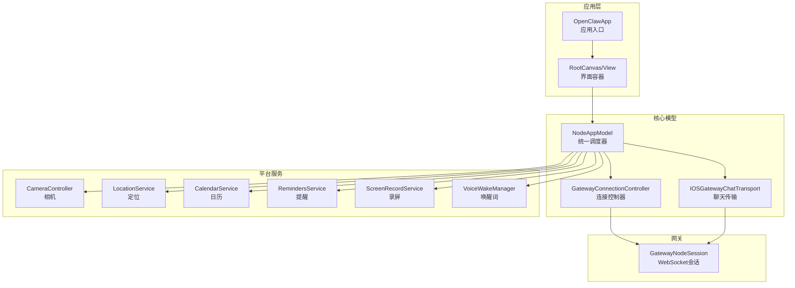
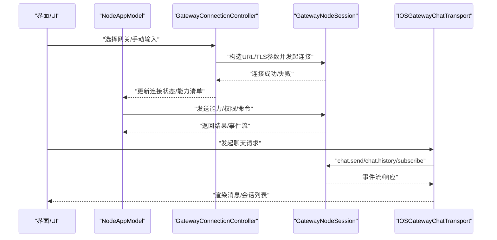
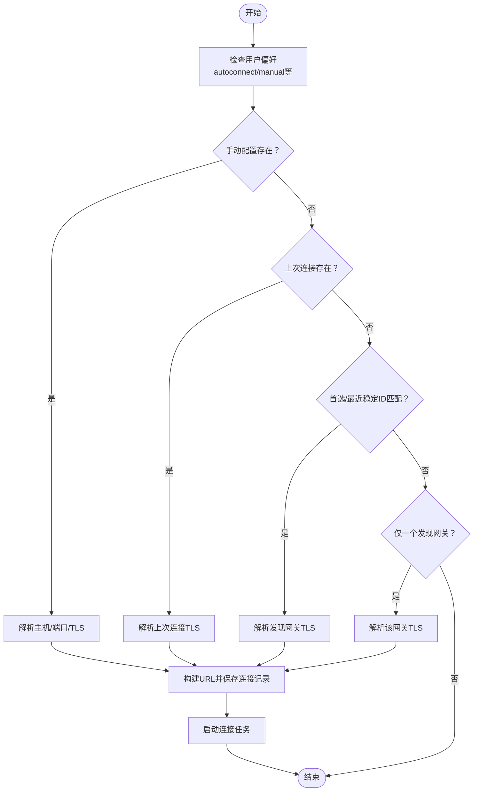
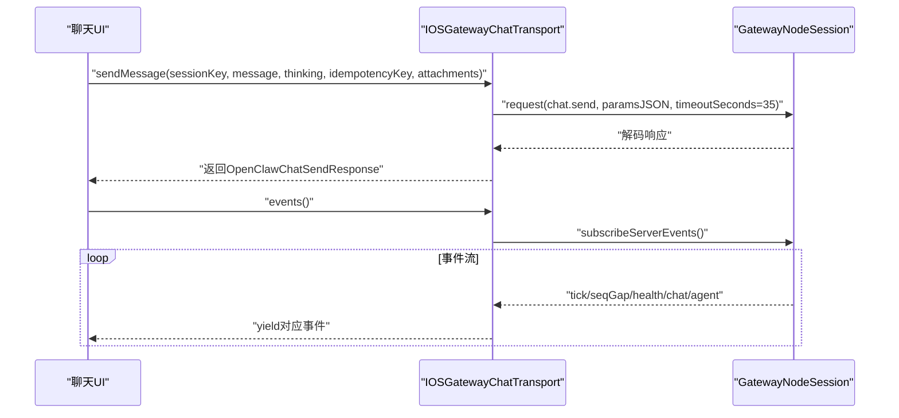
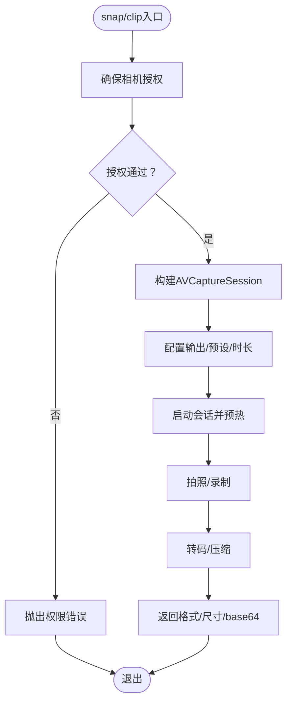
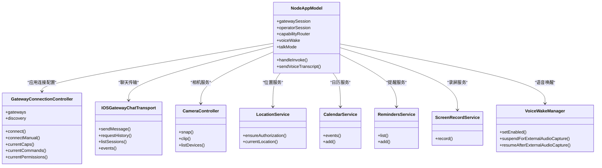

# iOS 应用实现

<cite>
**本文档引用的文件**
- [OpenClawApp.swift](file://apps/ios/Sources/OpenClawApp.swift)
- [NodeAppModel.swift](file://apps/ios/Sources/Model/NodeAppModel.swift)
- [GatewayConnectionController.swift](file://apps/ios/Sources/Gateway/GatewayConnectionController.swift)
- [CameraController.swift](file://apps/ios/Sources/Camera/CameraController.swift)
- [LocationService.swift](file://apps/ios/Sources/Location/LocationService.swift)
- [CalendarService.swift](file://apps/ios/Sources/Calendar/CalendarService.swift)
- [RemindersService.swift](file://apps/ios/Sources/Reminders/RemindersService.swift)
- [IOSGatewayChatTransport.swift](file://apps/ios/Sources/Chat/IOSGatewayChatTransport.swift)
- [ScreenRecordService.swift](file://apps/ios/Sources/Screen/ScreenRecordService.swift)
- [VoiceWakeManager.swift](file://apps/ios/Sources/Voice/VoiceWakeManager.swift)
- [NodeServiceProtocols.swift](file://apps/ios/Sources/Services/NodeServiceProtocols.swift)
- [project.yml](file://apps/ios/project.yml)
- [README.md](file://apps/ios/README.md)
- [GatewayConnectionControllerTests.swift](file://apps/ios/Tests/GatewayConnectionControllerTests.swift)
</cite>

## 目录
1. [简介](#简介)
2. [项目结构](#项目结构)
3. [核心组件](#核心组件)
4. [架构总览](#架构总览)
5. [详细组件分析](#详细组件分析)
6. [依赖关系分析](#依赖关系分析)
7. [性能考量](#性能考量)
8. [故障排除指南](#故障排除指南)
9. [结论](#结论)
10. [附录](#附录)

## 简介
本文件面向OpenClaw iOS节点应用，系统性阐述其架构设计、核心功能实现与iOS平台特性优化。重点覆盖以下方面：
- 通过WebSocket连接网关（支持ws/wss）的发现、连接与健康监测
- 设备配对流程与权限管理机制
- iOS特有能力：相机访问、位置服务、日历与提醒事项集成
- 构建流程、Xcode配置、测试策略与调试方法
- 平台限制、性能优化与用户体验设计要点

## 项目结构
iOS应用位于apps/ios目录，采用SwiftUI + Swift并发模型，核心模块包括：
- 应用入口与场景生命周期：OpenClawApp、RootCanvas、RootView
- 核心业务模型：NodeAppModel（统一调度网关会话、能力路由、权限与状态）
- 网关连接控制：GatewayConnectionController（自动发现、TLS参数解析、自动重连）
- 平台服务封装：Camera、Location、Calendar、Reminders、ScreenRecord、VoiceWake等
- 聊天传输层：IOSGatewayChatTransport（基于GatewayNodeSession的聊天请求/订阅）
- 测试与配置：XcodeGen配置、单元测试、Info.plist权限声明

图表来源
- [OpenClawApp.swift](file://apps/ios/Sources/OpenClawApp.swift#L1-L32)
- [NodeAppModel.swift](file://apps/ios/Sources/Model/NodeAppModel.swift#L42-L186)
- [GatewayConnectionController.swift](file://apps/ios/Sources/Gateway/GatewayConnectionController.swift#L16-L622)
- [IOSGatewayChatTransport.swift](file://apps/ios/Sources/Chat/IOSGatewayChatTransport.swift#L6-L129)

章节来源
- [README.md](file://apps/ios/README.md#L1-L67)
- [project.yml](file://apps/ios/project.yml#L1-L135)

## 核心组件
- 应用入口与环境注入：OpenClawApp在初始化时创建NodeAppModel与GatewayConnectionController，并将二者注入到视图环境，同时处理深链入与场景生命周期事件。
- 统一调度器：NodeAppModel负责：
  - 维护两个GatewayNodeSession（node与operator），分别用于设备能力与聊天/配置等操作
  - 能力路由：根据命令分派至具体服务（相机、位置、日历、提醒、运动、设备等）
  - 权限与状态：位置授权、后台行为、健康监测、唤醒词同步
  - Canvas/A2UI交互：处理Canvas展示、导航、快照与A2UI动作转发
- 连接控制器：GatewayConnectionController负责：
  - 自动发现、TLS指纹校验、端口解析、自动连接与重连
  - 动态生成capabilities/commands/permissions清单并上报
  - 场景生命周期感知（后台停止扫描、前台恢复）

章节来源
- [OpenClawApp.swift](file://apps/ios/Sources/OpenClawApp.swift#L3-L31)
- [NodeAppModel.swift](file://apps/ios/Sources/Model/NodeAppModel.swift#L42-L186)
- [GatewayConnectionController.swift](file://apps/ios/Sources/Gateway/GatewayConnectionController.swift#L16-L622)

## 架构总览
下图展示了从应用到网关的关键数据流与控制流：

图表来源
- [GatewayConnectionController.swift](file://apps/ios/Sources/Gateway/GatewayConnectionController.swift#L59-L148)
- [NodeAppModel.swift](file://apps/ios/Sources/Model/NodeAppModel.swift#L87-L118)
- [IOSGatewayChatTransport.swift](file://apps/ios/Sources/Chat/IOSGatewayChatTransport.swift#L50-L83)

## 详细组件分析

### 网关连接与自动发现
- 发现与自动连接：GatewayConnectionController监听发现模型变化，按优先级尝试自动连接（手动配置、上次连接、稳定ID、首次发现）。
- TLS参数：根据网关返回或本地存储的指纹决定是否强制TLS；对特定域名可强制443端口。
- 能力/命令/权限：动态生成capabilities/commands/permissions，确保仅上报已授权能力。

图表来源
- [GatewayConnectionController.swift](file://apps/ios/Sources/Gateway/GatewayConnectionController.swift#L173-L289)

章节来源
- [GatewayConnectionController.swift](file://apps/ios/Sources/Gateway/GatewayConnectionController.swift#L16-L622)

### WebSocket聊天传输层
- 支持会话管理：设置活动会话、列出会话、请求历史
- 消息发送：带幂等键、思考模式、附件上传
- 健康检查：周期性健康查询
- 事件流：订阅服务器事件（心跳、聊天、代理事件）

图表来源
- [IOSGatewayChatTransport.swift](file://apps/ios/Sources/Chat/IOSGatewayChatTransport.swift#L50-L129)

章节来源
- [IOSGatewayChatTransport.swift](file://apps/ios/Sources/Chat/IOSGatewayChatTransport.swift#L6-L129)

### 相机能力与安全裁剪
- 访问控制：在调用前确保相机/麦克风授权，未授权抛出明确错误
- 参数裁剪：默认最大宽度与质量范围限制，避免超大载荷；导出为MP4并进行转码
- 快门预热：启动后短延迟减少首帧空白
- 错误处理：捕获捕获/导出失败并转换为可读错误

图表来源
- [CameraController.swift](file://apps/ios/Sources/Camera/CameraController.swift#L39-L110)
- [CameraController.swift](file://apps/ios/Sources/Camera/CameraController.swift#L112-L190)

章节来源
- [CameraController.swift](file://apps/ios/Sources/Camera/CameraController.swift#L5-L407)

### 位置服务与后台策略
- 授权策略：按需请求WhenInUse/Always授权；后台需Always
- 缓存与超时：支持maxAge缓存与timeout控制
- 精度授权：区分fullAccuracy与best精度
- 后台限制：非Always授权时禁止后台位置获取

章节来源
- [LocationService.swift](file://apps/ios/Sources/Location/LocationService.swift#L5-L139)
- [NodeAppModel.swift](file://apps/ios/Sources/Model/NodeAppModel.swift#L680-L737)

### 日历与提醒事项
- 日历：支持查询事件与添加事件，自动解析日历/标题/时间范围，写入时需具备写权限
- 提醒：支持列出与添加提醒，支持完成状态过滤与截止日期
- 权限策略：读取/写入均需授权，未授权时不触发系统提示，直接返回错误

章节来源
- [CalendarService.swift](file://apps/ios/Sources/Calendar/CalendarService.swift#L5-L168)
- [RemindersService.swift](file://apps/ios/Sources/Reminders/RemindersService.swift#L5-L166)

### 录屏与屏幕录制
- 基于ReplayKit采集视频/音频，使用AVAssetWriter写入MP4
- FPS与时长裁剪，避免过高的资源消耗
- 多队列保护：捕获回调与写入序列化，防止并发冲突

章节来源
- [ScreenRecordService.swift](file://apps/ios/Sources/Screen/ScreenRecordService.swift#L4-L361)

### 语音唤醒与音频会话
- 麦克风与语音识别授权：启动前请求并处理超时
- 音频会话配置：测量模式、混音、蓝牙支持
- 实时音频缓冲：安装tap将PCM缓冲复制到队列，异步注入识别请求
- 抢占与恢复：当外部音频（如相机）需要时暂停识别，结束后自动恢复

章节来源
- [VoiceWakeManager.swift](file://apps/ios/Sources/Voice/VoiceWakeManager.swift#L83-L496)

### Canvas与A2UI集成
- Canvas命令：present/hide/navigate/evalJS/snapshot
- A2UI动作：从Canvas点击触发，封装为代理消息并通过网关下发
- 安全与限制：后台场景下限制canvas/camera/screen/talk类命令

章节来源
- [NodeAppModel.swift](file://apps/ios/Sources/Model/NodeAppModel.swift#L739-L800)
- [NodeAppModel.swift](file://apps/ios/Sources/Model/NodeAppModel.swift#L188-L263)

## 依赖关系分析
- 模块耦合
  - NodeAppModel聚合多个服务协议（Camera/Location/Calendar/Reminders/Screen/Motion），通过NodeCapabilityRouter分发命令
  - GatewayConnectionController与NodeAppModel双向协作：前者提供连接配置，后者消费连接状态与能力清单
  - IOSGatewayChatTransport依赖GatewayNodeSession，提供聊天API
- 外部依赖
  - iOS系统框架：AVFoundation、CoreLocation、EventKit、ReplayKit、Speech等
  - OpenClawKit/OpenClawProtocol/OpenClawChatUI（共享包）

图表来源
- [NodeAppModel.swift](file://apps/ios/Sources/Model/NodeAppModel.swift#L42-L186)
- [GatewayConnectionController.swift](file://apps/ios/Sources/Gateway/GatewayConnectionController.swift#L16-L622)
- [IOSGatewayChatTransport.swift](file://apps/ios/Sources/Chat/IOSGatewayChatTransport.swift#L6-L129)
- [NodeServiceProtocols.swift](file://apps/ios/Sources/Services/NodeServiceProtocols.swift#L6-L65)

章节来源
- [NodeServiceProtocols.swift](file://apps/ios/Sources/Services/NodeServiceProtocols.swift#L1-L65)

## 性能考量
- 负载控制
  - 相机快照与录屏默认裁剪分辨率与时长，避免超大payload
  - Canvas快照按格式选择合理maxWidth，PNG/JPEG分别限制
- 并发与线程
  - 语音唤醒使用实时音频回调，缓冲队列与异步识别分离，降低阻塞
  - 录屏写入使用串行队列，避免AVAssetWriter并发问题
- 生命周期与后台
  - 场景进入后台时释放麦克风、停止发现与健康监测，前台恢复时按需重建
  - 前台回切检测“长时后台”后主动断开并重新握手，避免“连接但死”的状态

章节来源
- [CameraController.swift](file://apps/ios/Sources/Camera/CameraController.swift#L48-L110)
- [ScreenRecordService.swift](file://apps/ios/Sources/Screen/ScreenRecordService.swift#L322-L331)
- [NodeAppModel.swift](file://apps/ios/Sources/Model/NodeAppModel.swift#L266-L326)
- [VoiceWakeManager.swift](file://apps/ios/Sources/Voice/VoiceWakeManager.swift#L270-L313)

## 故障排除指南
- 连接问题
  - 检查TLS指纹与端口解析逻辑；必要时允许TOFU重置
  - 使用调试日志开关查看发现过程与连接状态
- 权限问题
  - 相机/麦克风/语音识别/日历/提醒等权限未授予会导致相应命令失败
  - 语音唤醒在模拟器不支持，需真机验证
- 后台行为
  - 后台场景下canvas/camera/screen/talk受限；位置后台需Always授权
- 测试与验证
  - 使用XcodeGen生成工程，执行单元测试套件验证连接、命令与权限
  - 通过测试夹具快速切换UserDefaults键值，验证能力/命令集合变化

章节来源
- [GatewayConnectionController.swift](file://apps/ios/Sources/Gateway/GatewayConnectionController.swift#L42-L57)
- [GatewayConnectionControllerTests.swift](file://apps/ios/Tests/GatewayConnectionControllerTests.swift#L32-L79)
- [README.md](file://apps/ios/README.md#L56-L67)

## 结论
OpenClaw iOS节点应用以NodeAppModel为核心，结合GatewayConnectionController与平台服务，实现了对网关的稳定连接、能力上报与命令分发。通过严格的权限管理、后台策略与负载控制，兼顾了安全性与性能。未来可在后台稳定性、A2UI交互体验与更多平台能力上持续演进。

## 附录

### 构建与运行
- 依赖工具：Xcode（当前稳定版）、pnpm、xcodegen
- 工作流：根目录安装依赖后，使用脚本打开/构建；或在Xcode中选择OpenClaw方案运行
- CLI构建：执行iOS构建脚本
- 测试：生成工程后使用xcodebuild在指定模拟器上运行测试

章节来源
- [README.md](file://apps/ios/README.md#L27-L67)

### Xcode配置要点
- 最低系统版本：iOS 18.0
- Swift版本：6.0，严格并发
- 权限描述：网络、相机、位置、麦克风、语音识别、Bonjour服务
- 应用图标与显示名称：Info.plist中配置
- 开发团队与签名：项目配置中指定

章节来源
- [project.yml](file://apps/ios/project.yml#L1-L135)