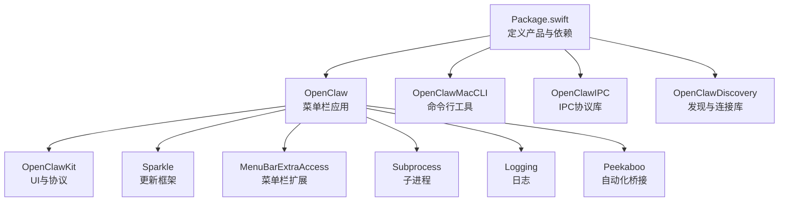
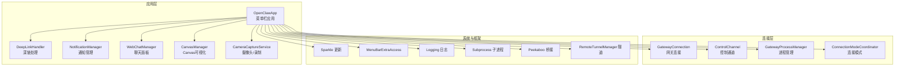
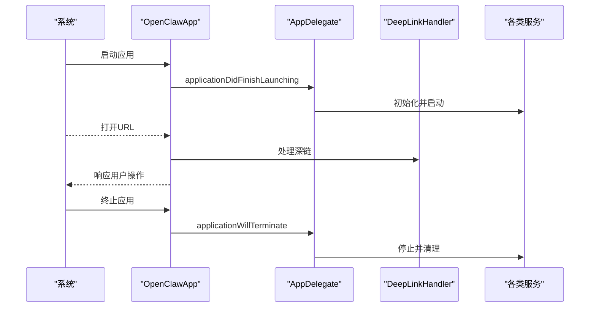
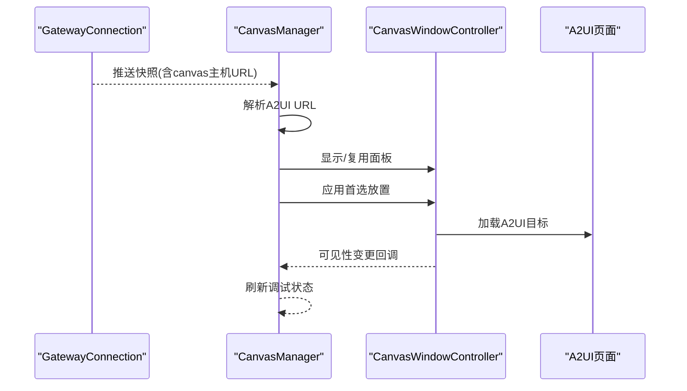
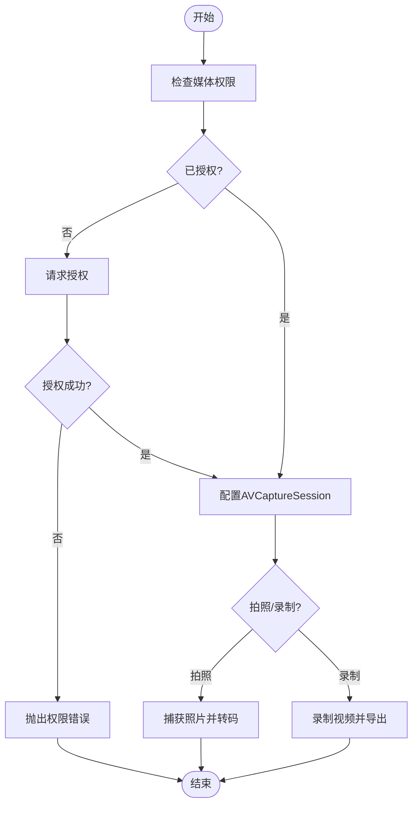
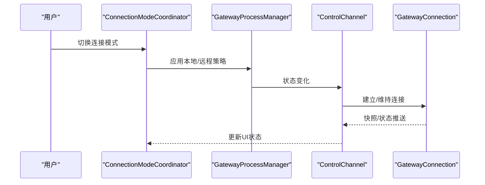
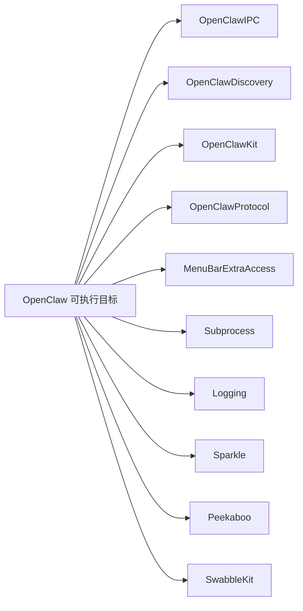

# macOS 应用实现

<cite>
**本文引用的文件**
- [apps/macos/Package.swift](file://apps/macos/Package.swift)
- [apps/macos/Sources/OpenClaw/Resources/Info.plist](file://apps/macos/Sources/OpenClaw/Resources/Info.plist)
- [apps/macos/Sources/OpenClaw/MenuBar.swift](file://apps/macos/Sources/OpenClaw/MenuBar.swift)
- [apps/macos/Sources/OpenClaw/CanvasManager.swift](file://apps/macos/Sources/OpenClaw/CanvasManager.swift)
- [apps/macos/Sources/OpenClaw/CameraCaptureService.swift](file://apps/macos/Sources/OpenClaw/CameraCaptureService.swift)
- [apps/macos/Sources/OpenClaw/NotificationManager.swift](file://apps/macos/Sources/OpenClaw/NotificationManager.swift)
- [apps/macos/Sources/OpenClaw/WebChatManager.swift](file://apps/macos/Sources/OpenClaw/WebChatManager.swift)
- [apps/macos/Sources/OpenClaw/DeepLinkHandler.swift](file://apps/macos/Sources/OpenClaw/DeepLinkHandler.swift)
- [apps/macos/Sources/OpenClaw/ConnectionModeCoordinator.swift](file://apps/macos/Sources/OpenClaw/ConnectionModeCoordinator.swift)
- [apps/macos/Sources/OpenClaw/GatewayConnection.swift](file://apps/macos/Sources/OpenClaw/GatewayConnection.swift)
- [apps/macos/Sources/OpenClaw/GatewayProcessManager.swift](file://apps/macos/Sources/OpenClaw/GatewayProcessManager.swift)
- [apps/macos/Sources/OpenClaw/ControlChannel.swift](file://apps/macos/Sources/OpenClaw/ControlChannel.swift)
- [apps/macos/Sources/OpenClaw/PeekabooBridgeHostCoordinator.swift](file://apps/macOS/Sources/OpenClaw/PeekabooBridgeHostCoordinator.swift)
- [apps/macos/Sources/OpenClaw/RemoteTunnelManager.swift](file://apps/macos/Sources/OpenClaw/RemoteTunnelManager.swift)
- [apps/macos/Sources/OpenClaw/TerminationSignalWatcher.swift](file://apps/macos/Sources/OpenClaw/TerminationSignalWatcher.swift)
- [apps/macos/Sources/OpenClaw/PresenceReporter.swift](file://apps/macos/Sources/OpenClaw/PresenceReporter.swift)
- [apps/macos/Sources/OpenClaw/VoiceWakeGlobalSettingsSync.swift](file://apps/macos/Sources/OpenClaw/VoiceWakeGlobalSettingsSync.swift)
- [apps/macos/Sources/OpenClaw/MacNodeModeCoordinator.swift](file://apps/macos/Sources/OpenClaw/MacNodeModeCoordinator.swift)
- [apps/macos/Sources/OpenClaw/ExecApprovalsPromptServer.swift](file://apps/macos/Sources/OpenClaw/ExecApprovalsPromptServer.swift)
- [apps/macos/Sources/OpenClaw/DevicePairingApprovalPrompter.swift](file://apps/macos/Sources/OpenClaw/DevicePairingApprovalPrompter.swift)
- [apps/macos/Sources/OpenClaw/NodePairingApprovalPrompter.swift](file://apps/macos/Sources/OpenClaw/NodePairingApprovalPrompter.swift)
- [apps/macos/Sources/OpenClaw/OnboardingController.swift](file://apps/macos/Sources/OpenClaw/OnboardingController.swift)
- [apps/macos/Sources/OpenClaw/HoverHUDController.swift](file://apps/macos/Sources/OpenClaw/HoverHUDController.swift)
- [apps/macos/Sources/OpenClaw/CanvasWindowController.swift](file://apps/macos/Sources/OpenClaw/CanvasWindowController.swift)
- [apps/macos/Sources/OpenClaw/CanvasScheme.swift](file://apps/macos/Sources/OpenClaw/CanvasScheme.swift)
- [apps/macos/Sources/OpenClaw/CanvasSchemeHandler.swift](file://apps/macos/Sources/OpenClaw/CanvasSchemeHandler.swift)
- [apps/macos/Sources/OpenClaw/CanvasFileWatcher.swift](file://apps/macos/Sources/OpenClaw/CanvasFileWatcher.swift)
- [apps/macos/Sources/OpenClaw/CanvasA2UIActionMessageHandler.swift](file://apps/macos/Sources/OpenClaw/CanvasA2UIActionMessageHandler.swift)
- [apps/macos/Sources/OpenClaw/CanvasChromeContainerView.swift](file://apps/macos/Sources/OpenClaw/CanvasChromeContainerView.swift)
- [apps/macos/Sources/OpenClaw/CanvasIPCTests.swift](file://apps/macos/Sources/OpenClaw/CanvasIPCTests.swift)
- [apps/macos/Sources/OpenClaw/CameraIPCTests.swift](file://apps/macos/Sources/OpenClaw/CameraIPCTests.swift)
- [apps/macos/Sources/OpenClaw/CLIInstaller.swift](file://apps/macos/Sources/OpenClaw/CLIInstaller.swift)
- [apps/macos/Sources/OpenClaw/CLIInstallPrompter.swift](file://apps/macos/Sources/OpenClaw/CLIInstallPrompter.swift)
- [apps/macos/Sources/OpenClaw/SettingsRootView.swift](file://apps/macos/Sources/OpenClaw/SettingsRootView.swift)
- [apps/macos/Sources/OpenClaw/SettingsTab.swift](file://apps/macos/Sources/OpenClaw/SettingsTab.swift)
- [apps/macos/Sources/OpenClaw/MenuContentView.swift](file://apps/macos/Sources/OpenClaw/MenuContentView.swift)
- [apps/macos/Sources/OpenClaw/MenuSessionsInjector.swift](file://apps/macos/Sources/OpenClaw/MenuSessionsInjector.swift)
- [apps/macos/Sources/OpenClaw/GatewayDiscoveryMenu.swift](file://apps/macos/Sources/OpenClaw/GatewayDiscoveryMenu.swift)
- [apps/macos/Sources/OpenClaw/NodesMenu.swift](file://apps/macos/Sources/OpenClaw/NodesMenu.swift)
- [apps/macos/Sources/OpenClaw/MenuContextCardInjector.swift](file://apps/macos/Sources/OpenClaw/MenuContextCardInjector.swift)
- [apps/macos/Sources/OpenClaw/MenuHighlightedHostView.swift](file://apps/macos/Sources/OpenClaw/MenuHighlightedHostView.swift)
- [apps/macos/Sources/OpenClaw/MenuHostedItem.swift](file://apps/macos/Sources/OpenClaw/MenuHostedItem.swift)
- [apps/macos/Sources/OpenClaw/MenuSessionsHeaderView.swift](file://apps/macos/Sources/OpenClaw/MenuSessionsHeaderView.swift)
- [apps/macos/Sources/OpenClaw/MenuUsageHeaderView.swift](file://apps/macos/Sources/OpenClaw/MenuUsageHeaderView.swift)
- [apps/macos/Sources/OpenClaw/UsageMenuLabelView.swift](file://apps/macos/Sources/OpenClaw/UsageMenuLabelView.swift)
- [apps/macos/Sources/OpenClaw/SessionMenuLabelView.swift](file://apps/macos/Sources/OpenClaw/SessionMenuLabelView.swift)
- [apps/macos/Sources/OpenClaw/SessionMenuPreviewView.swift](file://apps/macos/Sources/OpenClaw/SessionMenuPreviewView.swift)
- [apps/macos/Sources/OpenClaw/CostUsageMenuView.swift](file://apps/macos/Sources/OpenClaw/CostUsageMenuView.swift)
- [apps/macos/Sources/OpenClaw/ContextMenuCardView.swift](file://apps/macos/Sources/OpenClaw/ContextMenuCardView.swift)
- [apps/macos/Sources/OpenClaw/AgentWorkspace.swift](file://apps/macos/Sources/OpenClaw/AgentWorkspace.swift)
- [apps/macos/Sources/OpenClaw/AgentEventStore.swift](file://apps/macos/Sources/OpenClaw/AgentEventStore.swift)
- [apps/macos/Sources/OpenClaw/AgentEventsWindow.swift](file://apps/macos/Sources/OpenClaw/AgentEventsWindow.swift)
- [apps/macos/Sources/OpenClaw/WorkActivityStore.swift](file://apps/macos/Sources/OpenClaw/WorkActivityStore.swift)
- [apps/macos/Sources/OpenClaw/AppStateStore.swift](file://apps/macos/Sources/OpenClaw/AppStateStore.swift)
- [apps/macos/Sources/OpenClaw/HealthStore.swift](file://apps/macos/Sources/OpenClaw/HealthStore.swift)
- [apps/macos/Sources/OpenClaw/PortGuardian.swift](file://apps/macos/Sources/OpenClaw/PortGuardian.swift)
- [apps/macos/Sources/OpenClaw/TailscaleService.swift](file://apps/macos/Sources/OpenClaw/TailscaleService.swift)
- [apps/macos/Sources/OpenClaw/TailscaleIntegrationSection.swift](file://apps/macos/Sources/OpenClaw/TailscaleIntegrationSection.swift)
- [apps/macos/Sources/OpenClaw/PermissionManager.swift](file://apps/macos/Sources/OpenClaw/PermissionManager.swift)
- [apps/macos/Sources/OpenClaw/PermissionManagerLocation.swift](file://apps/macos/Sources/OpenClaw/PermissionManagerLocation.swift)
- [apps/macos/Sources/OpenClaw/AnthropicAuthControls.swift](file://apps/macos/Sources/OpenClaw/AnthropicAuthControls.swift)
- [apps/macos/Sources/OpenClaw/AnthropicOAuth.swift](file://apps/macos/Sources/OpenClaw/AnthropicOAuth.swift)
- [apps/macos/Sources/OpenClaw/AnthropicOAuthCodeState.swift](file://apps/macos/Sources/OpenClaw/AnthropicOAuthCodeState.swift)
- [apps/macos/Sources/OpenClaw/AnthropicAuthResolver.swift](file://apps/macos/Sources/OpenClaw/AnthropicAuthResolver.swift)
- [apps/macos/Sources/OpenClaw/AnthropicAuthControlsSmokeTests.swift](file://apps/macos/Sources/OpenClaw/AnthropicAuthControlsSmokeTests.swift)
- [apps/macos/Sources/OpenClaw/AnthropicAuthResolverTests.swift](file://apps/macos/Sources/OpenClaw/AnthropicAuthResolverTests.swift)
- [apps/macos/Sources/OpenClaw/AnthropicOAuthCodeStateTests.swift](file://apps/macos/Sources/OpenClaw/AnthropicOAuthCodeStateTests.swift)
- [apps/macos/Sources/OpenClaw/CanvasWindowSmokeTests.swift](file://apps/macos/Sources/OpenClaw/CanvasWindowSmokeTests.swift)
- [apps/macos/Sources/OpenClaw/WebChatSwiftUISmokeTests.swift](file://apps/macos/Sources/OpenClaw/WebChatSwiftUISmokeTests.swift)
- [apps/macos/Sources/OpenClaw/MasterDiscoveryMenuSmokeTests.swift](file://apps/macos/Sources/OpenClaw/MasterDiscoveryMenuSmokeTests.swift)
- [apps/macos/Sources/OpenClaw/OnboardingViewSmokeTests.swift](file://apps/macos/Sources/OpenClaw/OnboardingViewSmokeTests.swift)
- [apps/macos/Sources/OpenClaw/SettingsViewSmokeTests.swift](file://apps/macos/Sources/OpenClaw/SettingsViewSmokeTests.swift)
- [apps/macos/Sources/OpenClaw/MenuContentSmokeTests.swift](file://apps/macos/Sources/OpenClaw/MenuContentSmokeTests.swift)
- [apps/macos/Sources/OpenClaw/InstancesSettingsSmokeTests.swift](file://apps/macos/Sources/OpenClaw/InstancesSettingsSmokeTests.swift)
- [apps/macos/Sources/OpenClaw/ChannelsSettingsSmokeTests.swift](file://apps/macos/Sources/OpenClaw/ChannelsSettingsSmokeTests.swift)
- [apps/macos/Sources/OpenClaw/LowCoverageViewSmokeTests.swift](file://apps/macos/Sources/OpenClaw/LowCoverageViewSmokeTests.swift)
- [apps/macos/Sources/OpenClaw/VoiceWakeOverlayViewSmokeTests.swift](file://apps/macos/Sources/OpenClaw/VoiceWakeOverlayViewSmokeTests.swift)
- [apps/macos/Sources/OpenClaw/VoiceWakeRuntimeTests.swift](file://apps/macos/Sources/OpenClaw/VoiceWakeRuntimeTests.swift)
- [apps/macos/Sources/OpenClaw/VoiceWakeForwarderTests.swift](file://apps/macos/Sources/OpenClaw/VoiceWakeForwarderTests.swift)
- [apps/macos/Sources/OpenClaw/VoiceWakeOverlayControllerTests.swift](file://apps/macos/Sources/OpenClaw/VoiceWakeOverlayControllerTests.swift)
- [apps/macos/Sources/OpenClaw/VoiceWakeOverlayTests.swift](file://apps/macos/Sources/OpenClaw/VoiceWakeOverlayTests.swift)
- [apps/macos/Sources/OpenClaw/VoiceWakeGlobalSettingsSyncTests.swift](file://apps/macos/Sources/OpenClaw/VoiceWakeGlobalSettingsSyncTests.swift)
- [apps/macos/Sources/OpenClaw/VoiceWakeHelpersTests.swift](file://apps/macos/Sources/OpenClaw/VoiceWakeHelpersTests.swift)
- [apps/macos/Sources/OpenClaw/VoicePushToTalkTests.swift](file://apps/macos/Sources/OpenClaw/VoicePushToTalkTests.swift)
- [apps/macos/Sources/OpenClaw/VoicePushToTalkHotkeyTests.swift](file://apps/macos/Sources/OpenClaw/VoicePushToTalkHotkeyTests.swift)
- [apps/macos/Sources/OpenClaw/CameraCaptureServiceTests.swift](file://apps/macos/Sources/OpenClaw/CameraCaptureServiceTests.swift)
- [apps/macos/Sources/OpenClaw/CameraIPCTests.swift](file://apps/macos/Sources/OpenClaw/CameraIPCTests.swift)
- [apps/macos/Sources/OpenClaw/CanvasFileWatcherTests.swift](file://apps/macos/Sources/OpenClaw/CanvasFileWatcherTests.swift)
- [apps/macos/Sources/OpenClaw/CanvasA2UIActionMessageHandlerTests.swift](file://apps/macos/Sources/OpenClaw/CanvasA2UIActionMessageHandlerTests.swift)
- [apps/macos/Sources/OpenClaw/CanvasChromeContainerViewTests.swift](file://apps/macos/Sources/OpenClaw/CanvasChromeContainerViewTests.swift)
- [apps/macos/Sources/OpenClaw/CanvasSchemeTests.swift](file://apps/macos/Sources/OpenClaw/CanvasSchemeTests.swift)
- [apps/macos/Sources/OpenClaw/CanvasSchemeHandlerTests.swift](file://apps/macos/Sources/OpenClaw/CanvasSchemeHandlerTests.swift)
- [apps/macos/Sources/OpenClaw/CanvasManagerTests.swift](file://apps/macos/Sources/OpenClaw/CanvasManagerTests.swift)
- [apps/macos/Sources/OpenClaw/WebChatManagerTests.swift](file://apps/macos/Sources/OpenClaw/WebChatManagerTests.swift)
- [apps/macos/Sources/OpenClaw/DeepLinkHandlerTests.swift](file://apps/macos/Sources/OpenClaw/DeepLinkHandlerTests.swift)
- [apps/macos/Sources/OpenClaw/ConnectionModeCoordinatorTests.swift](file://apps/macos/Sources/OpenClaw/ConnectionModeCoordinatorTests.swift)
- [apps/macos/Sources/OpenClaw/GatewayConnectionTests.swift](file://apps/macos/Sources/OpenClaw/GatewayConnectionTests.swift)
- [apps/macos/Sources/OpenClaw/GatewayProcessManagerTests.swift](file://apps/macos/Sources/OpenClaw/GatewayProcessManagerTests.swift)
- [apps/macos/Sources/OpenClaw/ControlChannelTests.swift](file://apps/macos/Sources/OpenClaw/ControlChannelTests.swift)
- [apps/macos/Sources/OpenClaw/PeekabooBridgeHostCoordinatorTests.swift](file://apps/macos/Sources/OpenClaw/PeekabooBridgeHostCoordinatorTests.swift)
- [apps/macos/Sources/OpenClaw/RemoteTunnelManagerTests.swift](file://apps/macos/Sources/OpenClaw/RemoteTunnelManagerTests.swift)
- [apps/macos/Sources/OpenClaw/TerminationSignalWatcherTests.swift](file://apps/macos/Sources/OpenClaw/TerminationSignalWatcherTests.swift)
- [apps/macos/Sources/OpenClaw/PresenceReporterTests.swift](file://apps/macos/Sources/OpenClaw/PresenceReporterTests.swift)
- [apps/macos/Sources/OpenClaw/VoiceWakeGlobalSettingsSyncTests.swift](file://apps/macos/Sources/OpenClaw/VoiceWakeGlobalSettingsSyncTests.swift)
- [apps/macos/Sources/OpenClaw/MacNodeModeCoordinatorTests.swift](file://apps/macos/Sources/OpenClaw/MacNodeModeCoordinatorTests.swift)
- [apps/macos/Sources/OpenClaw/ExecApprovalsPromptServerTests.swift](file://apps/macos/Sources/OpenClaw/ExecApprovalsPromptServerTests.swift)
- [apps/macos/Sources/OpenClaw/DevicePairingApprovalPrompterTests.swift](file://apps/macos/Sources/OpenClaw/DevicePairingApprovalPrompterTests.swift)
- [apps/macos/Sources/OpenClaw/NodePairingApprovalPrompterTests.swift](file://apps/macos/Sources/OpenClaw/NodePairingApprovalPrompterTests.swift)
- [apps/macos/Sources/OpenClaw/OnboardingControllerTests.swift](file://apps/macos/Sources/OpenClaw/OnboardingControllerTests.swift)
- [apps/macos/Sources/OpenClaw/HoverHUDControllerTests.swift](file://apps/macos/Sources/OpenClaw/HoverHUDControllerTests.swift)
- [apps/macos/Sources/OpenClaw/CanvasWindowControllerTests.swift](file://apps/macos/Sources/OpenClaw/CanvasWindowControllerTests.swift)
- [apps/macos/Sources/OpenClaw/CanvasSchemeTests.swift](file://apps/macos/Sources/OpenClaw/CanvasSchemeTests.swift)
- [apps/macos/Sources/OpenClaw/CanvasSchemeHandlerTests.swift](file://apps/macos/Sources/OpenClaw/CanvasSchemeHandlerTests.swift)
- [apps/macos/Sources/OpenClaw/CanvasFileWatcherTests.swift](file://apps/macos/Sources/OpenClaw/CanvasFileWatcherTests.swift)
- [apps/macos/Sources/OpenClaw/CanvasA2UIActionMessageHandlerTests.swift](file://apps/macos/Sources/OpenClaw/CanvasA2UIActionMessageHandlerTests.swift)
- [apps/macos/Sources/OpenClaw/CanvasChromeContainerViewTests.swift](file://apps/macos/Sources/OpenClaw/CanvasChromeContainerViewTests.swift)
- [apps/macos/Sources/OpenClaw/CanvasIPCTests.swift](file://apps/macos/Sources/OpenClaw/CanvasIPCTests.swift)
- [apps/macos/Sources/OpenClaw/CameraCaptureServiceTests.swift](file://apps/macos/Sources/OpenClaw/CameraCaptureServiceTests.swift)
- [apps/macos/Sources/OpenClaw/CameraIPCTests.swift](file://apps/macos/Sources/OpenClaw/CameraIPCTests.swift)
- [apps/macos/Sources/OpenClaw/CLIInstallerTests.swift](file://apps/macos/Sources/OpenClaw/CLIInstallerTests.swift)
- [apps/macos/Sources/OpenClaw/CLIInstallPrompterTests.swift](file://apps/macos/Sources/OpenClaw/CLIInstallPrompterTests.swift)
- [apps/macos/Sources/OpenClaw/SettingsRootViewTests.swift](file://apps/macos/Sources/OpenClaw/SettingsRootViewTests.swift)
- [apps/macos/Sources/OpenClaw/SettingsTabTests.swift](file://apps/macos/Sources/OpenClaw/SettingsTabTests.swift)
- [apps/macos/Sources/OpenClaw/MenuContentViewTests.swift](file://apps/macos/Sources/OpenClaw/MenuContentViewTests.swift)
- [apps/macos/Sources/OpenClaw/MenuSessionsInjectorTests.swift](file://apps/macos/Sources/OpenClaw/MenuSessionsInjectorTests.swift)
- [apps/macos/Sources/OpenClaw/GatewayDiscoveryMenuTests.swift](file://apps/macos/Sources/OpenClaw/GatewayDiscoveryMenuTests.swift)
- [apps/macos/Sources/OpenClaw/NodesMenuTests.swift](file://apps/macos/Sources/OpenClaw/NodesMenuTests.swift)
- [apps/macos/Sources/OpenClaw/MenuContextCardInjectorTests.swift](file://apps/macos/Sources/OpenClaw/MenuContextCardInjectorTests.swift)
- [apps/macos/Sources/OpenClaw/MenuHighlightedHostViewTests.swift](file://apps/macos/Sources/OpenClaw/MenuHighlightedHostViewTests.swift)
- [apps/macos/Sources/OpenClaw/MenuHostedItemTests.swift](file://apps/macos/Sources/OpenClaw/MenuHostedItemTests.swift)
- [apps/macos/Sources/OpenClaw/MenuSessionsHeaderViewTests.swift](file://apps/macos/Sources/OpenClaw/MenuSessionsHeaderViewTests.swift)
- [apps/macos/Sources/OpenClaw/MenuUsageHeaderViewTests.swift](file://apps/macos/Sources/OpenClaw/MenuUsageHeaderViewTests.swift)
- [apps/macos/Sources/OpenClaw/UsageMenuLabelViewTests.swift](file://apps/macos/Sources/OpenClaw/UsageMenuLabelViewTests.swift)
- [apps/macos/Sources/OpenClaw/SessionMenuLabelViewTests.swift](file://apps/macos/Sources/OpenClaw/SessionMenuLabelViewTests.swift)
- [apps/macos/Sources/OpenClaw/SessionMenuPreviewViewTests.swift](file://apps/macos/Sources/OpenClaw/SessionMenuPreviewViewTests.swift)
- [apps/macos/Sources/OpenClaw/CostUsageMenuViewTests.swift](file://apps/macos/Sources/OpenClaw/CostUsageMenuViewTests.swift)
- [apps/macos/Sources/OpenClaw/ContextMenuCardViewTests.swift](file://apps/macos/Sources/OpenClaw/ContextMenuCardViewTests.swift)
- [apps/macos/Sources/OpenClaw/AgentWorkspaceTests.swift](file://apps/macos/Sources/OpenClaw/AgentWorkspaceTests.swift)
- [apps/macos/Sources/OpenClaw/AgentEventStoreTests.swift](file://apps/macos/Sources/OpenClaw/AgentEventStoreTests.swift)
- [apps/macos/Sources/OpenClaw/AgentEventsWindowTests.swift](file://apps/macos/Sources/OpenClaw/AgentEventsWindowTests.swift)
- [apps/macos/Sources/OpenClaw/WorkActivityStoreTests.swift](file://apps/macos/Sources/OpenClaw/WorkActivityStoreTests.swift)
- [apps/macos/Sources/OpenClaw/AppStateStoreTests.swift](file://apps/macos/Sources/OpenClaw/AppStateStoreTests.swift)
- [apps/macos/Sources/OpenClaw/HealthStoreTests.swift](file://apps/macos/Sources/OpenClaw/HealthStoreTests.swift)
- [apps/macos/Sources/OpenClaw/PortGuardianTests.swift](file://apps/macos/Sources/OpenClaw/PortGuardianTests.swift)
- [apps/macos/Sources/OpenClaw/TailscaleServiceTests.swift](file://apps/macos/Sources/OpenClaw/TailscaleServiceTests.swift)
- [apps/macos/Sources/OpenClaw/TailscaleIntegrationSectionTests.swift](file://apps/macos/Sources/OpenClaw/TailscaleIntegrationSectionTests.swift)
- [apps/macos/Sources/OpenClaw/PermissionManagerTests.swift](file://apps/macos/Sources/OpenClaw/PermissionManagerTests.swift)
- [apps/macos/Sources/OpenClaw/PermissionManagerLocationTests.swift](file://apps/macos/Sources/OpenClaw/PermissionManagerLocationTests.swift)
- [apps/macos/Sources/OpenClaw/AnthropicAuthControlsTests.swift](file://apps/macos/Sources/OpenClaw/AnthropicAuthControlsTests.swift)
- [apps/macos/Sources/OpenClaw/AnthropicOAuthTests.swift](file://apps/macos/Sources/OpenClaw/AnthropicOAuthTests.swift)
- [apps/macos/Sources/OpenClaw/AnthropicOAuthCodeStateTests.swift](file://apps/macos/Sources/OpenClaw/AnthropicOAuthCodeStateTests.swift)
- [apps/macos/Sources/OpenClaw/AnthropicAuthResolverTests.swift](file://apps/macos/Sources/OpenClaw/AnthropicAuthResolverTests.swift)
</cite>

## 目录
1. [简介](#简介)
2. [项目结构](#项目结构)
3. [核心组件](#核心组件)
4. [架构总览](#架构总览)
5. [详细组件分析](#详细组件分析)
6. [依赖关系分析](#依赖关系分析)
7. [性能考虑](#性能考虑)
8. [故障排除指南](#故障排除指南)
9. [结论](#结论)
10. [附录](#附录)

## 简介
本文件面向OpenClaw macOS应用的技术实现，聚焦于菜单栏常驻应用的架构设计、系统集成与用户体验优化。文档覆盖以下主题：
- 与OpenClaw网关的通信机制与连接模式切换
- 设备配对与权限管理（摄像头、麦克风、屏幕录制、位置、自动化等）
- macOS特有能力：菜单栏控制、通知系统、屏幕录制、Canvas可视化与A2UI自动导航
- Xcode项目配置、Info.plist设置、代码签名与公证流程
- 系统集成最佳实践、性能监控与故障排除方法

## 项目结构
OpenClaw macOS应用位于apps/macos目录，采用Swift Package Manager组织多目标产物：
- 可执行目标：OpenClaw（菜单栏应用）、OpenClawMacCLI（命令行工具）
- 库目标：OpenClawIPC（进程间通信协议）、OpenClawDiscovery（发现与连接库）

图表来源
- [apps/macos/Package.swift](file://apps/macos/Package.swift#L6-L92)

章节来源
- [apps/macos/Package.swift](file://apps/macos/Package.swift#L1-L93)

## 核心组件
- 菜单栏应用与生命周期：通过MenuBar.swift中的OpenClawApp与AppDelegate协调启动、深链处理、更新器、权限提示与服务启动。
- Canvas可视化：CanvasManager负责面板展示、A2UI自动导航、调试状态刷新与窗口放置策略。
- 屏幕录制与摄像头：CameraCaptureService提供拍照、短视频录制、权限检查与转码导出。
- 通知系统：NotificationManager负责用户通知与权限描述。
- 网关通信：GatewayConnection、ControlChannel、GatewayProcessManager与ConnectionModeCoordinator协同完成本地/远程连接模式。
- 自动化与桥接：PeekabooBridgeHostCoordinator提供自动化桥接能力；RemoteTunnelManager管理隧道。
- 首次引导与设置：OnboardingController与SettingsRootView提供首次使用体验与设置界面。

章节来源
- [apps/macos/Sources/OpenClaw/MenuBar.swift](file://apps/macos/Sources/OpenClaw/MenuBar.swift#L10-L207)
- [apps/macos/Sources/OpenClaw/CanvasManager.swift](file://apps/macos/Sources/OpenClaw/CanvasManager.swift#L1-L343)
- [apps/macos/Sources/OpenClaw/CameraCaptureService.swift](file://apps/macos/Sources/OpenClaw/CameraCaptureService.swift#L1-L426)
- [apps/macos/Sources/OpenClaw/NotificationManager.swift](file://apps/macos/Sources/OpenClaw/NotificationManager.swift)
- [apps/macos/Sources/OpenClaw/GatewayConnection.swift](file://apps/macos/Sources/OpenClaw/GatewayConnection.swift)
- [apps/macos/Sources/OpenClaw/ControlChannel.swift](file://apps/macos/Sources/OpenClaw/ControlChannel.swift)
- [apps/macos/Sources/OpenClaw/GatewayProcessManager.swift](file://apps/macos/Sources/OpenClaw/GatewayProcessManager.swift)
- [apps/macos/Sources/OpenClaw/ConnectionModeCoordinator.swift](file://apps/macos/Sources/OpenClaw/ConnectionModeCoordinator.swift)
- [apps/macos/Sources/OpenClaw/PeekabooBridgeHostCoordinator.swift](file://apps/macos/Sources/OpenClaw/PeekabooBridgeHostCoordinator.swift)
- [apps/macos/Sources/OpenClaw/RemoteTunnelManager.swift](file://apps/macos/Sources/OpenClaw/RemoteTunnelManager.swift)
- [apps/macos/Sources/OpenClaw/OnboardingController.swift](file://apps/macos/Sources/OpenClaw/OnboardingController.swift)
- [apps/macos/Sources/OpenClaw/SettingsRootView.swift](file://apps/macos/Sources/OpenClaw/SettingsRootView.swift)

## 架构总览
OpenClaw macOS应用以菜单栏应用为核心，围绕“连接—可视化—交互—权限”的主线展开。应用通过Sparkle进行更新，通过MenuBarExtraAccess提供菜单栏入口，通过OpenClawKit与OpenClawProtocol实现UI与协议层，通过OpenClawIPC与OpenClawDiscovery实现跨进程通信与网关发现。

图表来源
- [apps/macos/Sources/OpenClaw/MenuBar.swift](file://apps/macos/Sources/OpenClaw/MenuBar.swift#L10-L207)
- [apps/macos/Sources/OpenClaw/CanvasManager.swift](file://apps/macos/Sources/OpenClaw/CanvasManager.swift#L1-L343)
- [apps/macos/Sources/OpenClaw/CameraCaptureService.swift](file://apps/macos/Sources/OpenClaw/CameraCaptureService.swift#L1-L426)
- [apps/macos/Sources/OpenClaw/GatewayConnection.swift](file://apps/macos/Sources/OpenClaw/GatewayConnection.swift)
- [apps/macos/Sources/OpenClaw/ControlChannel.swift](file://apps/macos/Sources/OpenClaw/ControlChannel.swift)
- [apps/macos/Sources/OpenClaw/GatewayProcessManager.swift](file://apps/macos/Sources/OpenClaw/GatewayProcessManager.swift)
- [apps/macos/Sources/OpenClaw/ConnectionModeCoordinator.swift](file://apps/macos/Sources/OpenClaw/ConnectionModeCoordinator.swift)
- [apps/macos/Sources/OpenClaw/PeekabooBridgeHostCoordinator.swift](file://apps/macos/Sources/OpenClaw/PeekabooBridgeHostCoordinator.swift)
- [apps/macos/Sources/OpenClaw/RemoteTunnelManager.swift](file://apps/macos/Sources/OpenClaw/RemoteTunnelManager.swift)

## 详细组件分析

### 菜单栏应用与生命周期
- 启动阶段：AppDelegate在applicationDidFinishLaunching中初始化状态、应用激活策略、启动各类审批与同步服务，并根据连接模式应用初始策略。
- 深链处理：application(open urls:)将外部URL交由DeepLinkHandler处理，支持从浏览器或系统调用打开应用并触发相应动作。
- 生命周期：applicationWillTerminate中有序停止各类服务，确保资源释放与网关断开。
- 更新器：makeUpdaterController根据是否为已签名的开发者ID包决定启用Sparkle或禁用更新器，避免未签名开发版本弹窗干扰。

图表来源
- [apps/macos/Sources/OpenClaw/MenuBar.swift](file://apps/macos/Sources/OpenClaw/MenuBar.swift#L254-L335)
- [apps/macos/Sources/OpenClaw/DeepLinkHandler.swift](file://apps/macos/Sources/OpenClaw/DeepLinkHandler.swift)

章节来源
- [apps/macos/Sources/OpenClaw/MenuBar.swift](file://apps/macos/Sources/OpenClaw/MenuBar.swift#L254-L335)

### Canvas可视化与A2UI自动导航
- 面板展示：CanvasManager统一管理CanvasWindowController，支持按会话键展示、隐藏、JavaScript执行与截图。
- 自动导航：通过GatewayConnection订阅快照推送，解析canvas主机URL并自动导航至A2UI路径，支持去重与调试状态显示。
- 放置策略：支持默认锚定到菜单栏按钮或鼠标位置，结合首选放置参数调整面板位置。

图表来源
- [apps/macos/Sources/OpenClaw/CanvasManager.swift](file://apps/macos/Sources/OpenClaw/CanvasManager.swift#L142-L229)
- [apps/macos/Sources/OpenClaw/CanvasWindowController.swift](file://apps/macos/Sources/OpenClaw/CanvasWindowController.swift)
- [apps/macos/Sources/OpenClaw/CanvasScheme.swift](file://apps/macos/Sources/OpenClaw/CanvasScheme.swift)
- [apps/macos/Sources/OpenClaw/CanvasSchemeHandler.swift](file://apps/macos/Sources/OpenClaw/CanvasSchemeHandler.swift)

章节来源
- [apps/macos/Sources/OpenClaw/CanvasManager.swift](file://apps/macos/Sources/OpenClaw/CanvasManager.swift#L1-L343)

### 屏幕录制与摄像头
- 权限与设备：CameraCaptureService封装AVFoundation，提供设备列表查询、权限检查与授权请求。
- 拍照：支持指定前置/后置、最大宽度、质量与延时，自动转码为JPEG并限制负载大小。
- 录制：支持带/不带音频的短视频录制，导出为MP4，兼容不同macOS版本的导出API。
- 异常处理：针对权限拒绝、设备不可用、导出失败等情况抛出自定义错误类型。

图表来源
- [apps/macos/Sources/OpenClaw/CameraCaptureService.swift](file://apps/macos/Sources/OpenClaw/CameraCaptureService.swift#L198-L314)

章节来源
- [apps/macos/Sources/OpenClaw/CameraCaptureService.swift](file://apps/macos/Sources/OpenClaw/CameraCaptureService.swift#L1-L426)

### 通知系统
- 权限描述：Info.plist中配置了通知使用描述，用于在首次请求权限时向用户说明用途。
- 管理器职责：NotificationManager负责发送与管理通知，结合应用状态与事件触发。

章节来源
- [apps/macos/Sources/OpenClaw/Resources/Info.plist](file://apps/macos/Sources/OpenClaw/Resources/Info.plist#L44-L45)
- [apps/macos/Sources/OpenClaw/NotificationManager.swift](file://apps/macos/Sources/OpenClaw/NotificationManager.swift)

### 网关通信与连接模式
- 连接模式：ConnectionModeCoordinator根据用户选择的本地/远程模式应用不同的连接策略。
- 控制通道：ControlChannel维护与网关的控制连接状态，影响菜单栏图标状态与功能可用性。
- 进程管理：GatewayProcessManager负责本地网关进程的启动、停止与附加，支持“仅附加”模式。
- 网关连接：GatewayConnection提供与网关的通信接口，支持订阅快照与查询主机URL。

图表来源
- [apps/macos/Sources/OpenClaw/ConnectionModeCoordinator.swift](file://apps/macos/Sources/OpenClaw/ConnectionModeCoordinator.swift)
- [apps/macos/Sources/OpenClaw/GatewayProcessManager.swift](file://apps/macos/Sources/OpenClaw/GatewayProcessManager.swift)
- [apps/macos/Sources/OpenClaw/ControlChannel.swift](file://apps/macos/Sources/OpenClaw/ControlChannel.swift)
- [apps/macos/Sources/OpenClaw/GatewayConnection.swift](file://apps/macos/Sources/OpenClaw/GatewayConnection.swift)

章节来源
- [apps/macos/Sources/OpenClaw/ConnectionModeCoordinator.swift](file://apps/macos/Sources/OpenClaw/ConnectionModeCoordinator.swift)
- [apps/macos/Sources/OpenClaw/GatewayProcessManager.swift](file://apps/macos/Sources/OpenClaw/GatewayProcessManager.swift)
- [apps/macos/Sources/OpenClaw/ControlChannel.swift](file://apps/macos/Sources/OpenClaw/ControlChannel.swift)
- [apps/macos/Sources/OpenClaw/GatewayConnection.swift](file://apps/macos/Sources/OpenClaw/GatewayConnection.swift)

### 权限管理与系统集成
- 权限清单：Info.plist声明了通知、屏幕录制、摄像头、麦克风、位置、语音识别与Apple Events等权限用途。
- 位置权限：PermissionManager与PermissionManagerLocation分别处理通用权限与位置权限的检查与提示。
- 自动化桥接：PeekabooBridgeHostCoordinator提供自动化桥接能力，受应用设置控制开关。

章节来源
- [apps/macos/Sources/OpenClaw/Resources/Info.plist](file://apps/macos/Sources/OpenClaw/Resources/Info.plist#L44-L61)
- [apps/macos/Sources/OpenClaw/PermissionManager.swift](file://apps/macos/Sources/OpenClaw/PermissionManager.swift)
- [apps/macos/Sources/OpenClaw/PermissionManagerLocation.swift](file://apps/macos/Sources/OpenClaw/PermissionManagerLocation.swift)
- [apps/macos/Sources/OpenClaw/PeekabooBridgeHostCoordinator.swift](file://apps/macos/Sources/OpenClaw/PeekabooBridgeHostCoordinator.swift)

### 设置与菜单内容
- 设置界面：SettingsRootView与SettingsTab提供窗口尺寸与标签页布局，集成Tailscale服务。
- 菜单内容：MenuContentView与MenuSessionsInjector注入会话与使用情况视图，支持悬浮预览与高亮宿主视图。
- 发现与节点：GatewayDiscoveryMenu与NodesMenu提供网关发现与节点管理入口。

章节来源
- [apps/macos/Sources/OpenClaw/SettingsRootView.swift](file://apps/macos/Sources/OpenClaw/SettingsRootView.swift)
- [apps/macos/Sources/OpenClaw/SettingsTab.swift](file://apps/macos/Sources/OpenClaw/SettingsTab.swift)
- [apps/macos/Sources/OpenClaw/MenuContentView.swift](file://apps/macos/Sources/OpenClaw/MenuContentView.swift)
- [apps/macos/Sources/OpenClaw/MenuSessionsInjector.swift](file://apps/macos/Sources/OpenClaw/MenuSessionsInjector.swift)
- [apps/macos/Sources/OpenClaw/GatewayDiscoveryMenu.swift](file://apps/macos/Sources/OpenClaw/GatewayDiscoveryMenu.swift)
- [apps/macos/Sources/OpenClaw/NodesMenu.swift](file://apps/macos/Sources/OpenClaw/NodesMenu.swift)

### 首次引导与工作活动
- 首次引导：OnboardingController根据版本与用户偏好决定是否展示引导流程。
- 工作活动：WorkActivityStore与状态联动，影响菜单栏图标状态与动画。

章节来源
- [apps/macos/Sources/OpenClaw/OnboardingController.swift](file://apps/macos/Sources/OpenClaw/OnboardingController.swift)
- [apps/macos/Sources/OpenClaw/WorkActivityStore.swift](file://apps/macos/Sources/OpenClaw/WorkActivityStore.swift)

## 依赖关系分析
- 包依赖：OpenClaw应用依赖MenuBarExtraAccess、Subprocess、Logging、Sparkle、Peekaboo等第三方库。
- 产品与目标：OpenClaw作为可执行目标，依赖OpenClawIPC、OpenClawDiscovery以及OpenClawKit与OpenClawProtocol。
- 测试目标：OpenClawIPCTests覆盖IPC相关模块，确保Canvas、Camera、DeepLink等模块行为正确。

图表来源
- [apps/macos/Package.swift](file://apps/macos/Package.swift#L42-L57)

章节来源
- [apps/macos/Package.swift](file://apps/macos/Package.swift#L1-L93)

## 性能考虑
- Canvas渲染与导航：CanvasManager对A2UI自动导航进行去重判断，避免重复加载；调试状态刷新仅在面板可见时进行。
- 摄像头拍摄：通过预热会话与曝光/白平衡等待减少首帧空白；转码时限制最大宽度与编码质量，控制payload大小。
- 连接与隧道：ConnectionModeCoordinator与GatewayProcessManager在本地模式下优先保持连接稳定，在远程模式下根据控制通道状态动态调整。
- 日志与可观测：Logging框架记录关键路径日志，便于定位问题与性能瓶颈。

## 故障排除指南
- 深链无法打开：检查Info.plist中的CFBundleURLTypes与CFBundleURLName配置，确认AppDelegate的application(open urls:)是否被调用。
- Canvas不显示或A2UI不跳转：确认GatewayConnection是否返回有效canvas主机URL，检查CanvasManager的自动导航逻辑与面板可见性回调。
- 摄像头/麦克风无响应：确认权限状态，调用ensureAccess并处理权限拒绝错误；检查设备选择与会话配置。
- 更新器异常：未签名开发包将禁用更新器，确认makeUpdaterController逻辑与证书签名状态。
- 首次引导未出现：检查OnboardingController的版本与偏好标记，确保scheduleFirstRunOnboarding逻辑执行。
- 权限弹窗过多：合理使用PermissionManager与PermissionManagerLocation，避免频繁请求同一权限。

章节来源
- [apps/macos/Sources/OpenClaw/MenuBar.swift](file://apps/macos/Sources/OpenClaw/MenuBar.swift#L259-L301)
- [apps/macos/Sources/OpenClaw/CanvasManager.swift](file://apps/macos/Sources/OpenClaw/CanvasManager.swift#L153-L172)
- [apps/macos/Sources/OpenClaw/CameraCaptureService.swift](file://apps/macos/Sources/OpenClaw/CameraCaptureService.swift#L198-L217)
- [apps/macos/Sources/OpenClaw/OnboardingController.swift](file://apps/macos/Sources/OpenClaw/OnboardingController.swift#L321-L328)
- [apps/macos/Sources/OpenClaw/PermissionManager.swift](file://apps/macos/Sources/OpenClaw/PermissionManager.swift)
- [apps/macos/Sources/OpenClaw/PermissionManagerLocation.swift](file://apps/macos/Sources/OpenClaw/PermissionManagerLocation.swift)

## 结论
OpenClaw macOS应用以菜单栏为核心，围绕连接、可视化与交互构建完整体验。通过严格的权限管理、完善的IPC与网关通信、以及对Canvas与屏幕录制等macOS特有能力的深度集成，实现了安全、高效且易用的桌面代理体验。建议在发布前完善代码签名与公证流程，并持续优化Canvas与摄像头的性能与稳定性。

## 附录

### Xcode项目配置与Info.plist要点
- 最低系统版本：LSMinimumSystemVersion设置为15.0。
- 菜单栏应用：LSUIElement设为true，使应用以菜单栏图标形式运行。
- 权限描述：在Info.plist中为通知、屏幕录制、摄像头、麦克风、位置、语音识别与Apple Events提供清晰用途说明。
- URL Scheme：CFBundleURLTypes配置openclaw，支持深链唤起。
- 网络安全：NSAppTransportSecurity允许特定域的非加密加载，满足开发与测试需求。

章节来源
- [apps/macos/Sources/OpenClaw/Resources/Info.plist](file://apps/macos/Sources/OpenClaw/Resources/Info.plist#L34-L77)

### 代码签名与公证流程
- 开发者ID签名：Sparkle更新器控制器在检测到开发者ID签名时启用，否则禁用更新器以避免弹窗干扰。
- 公证与分发：建议在发布包时使用Apple公证服务，确保应用可被系统信任并在Gatekeeper下正常运行。

章节来源
- [apps/macos/Sources/OpenClaw/MenuBar.swift](file://apps/macos/Sources/OpenClaw/MenuBar.swift#L434-L466)

### 系统集成最佳实践
- 菜单栏交互：使用MenuBarExtraAccess提供一致的菜单栏体验；通过透明覆盖视图拦截点击而不影响菜单栏所有权。
- 通知与权限：在Info.plist中明确权限用途，遵循最小权限原则；在首次使用时进行权限请求。
- 自动化与桥接：启用PeekabooBridgeHostCoordinator需谨慎，确保用户知情并同意自动化操作。
- 隧道与网络：RemoteTunnelManager负责远程隧道管理，注意在不同网络环境下进行健康检查与重连策略。

章节来源
- [apps/macos/Sources/OpenClaw/MenuBar.swift](file://apps/macos/Sources/OpenClaw/MenuBar.swift#L209-L251)
- [apps/macos/Sources/OpenClaw/PeekabooBridgeHostCoordinator.swift](file://apps/macos/Sources/OpenClaw/PeekabooBridgeHostCoordinator.swift)
- [apps/macos/Sources/OpenClaw/RemoteTunnelManager.swift](file://apps/macos/Sources/OpenClaw/RemoteTunnelManager.swift)