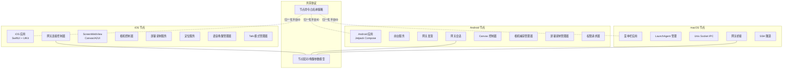
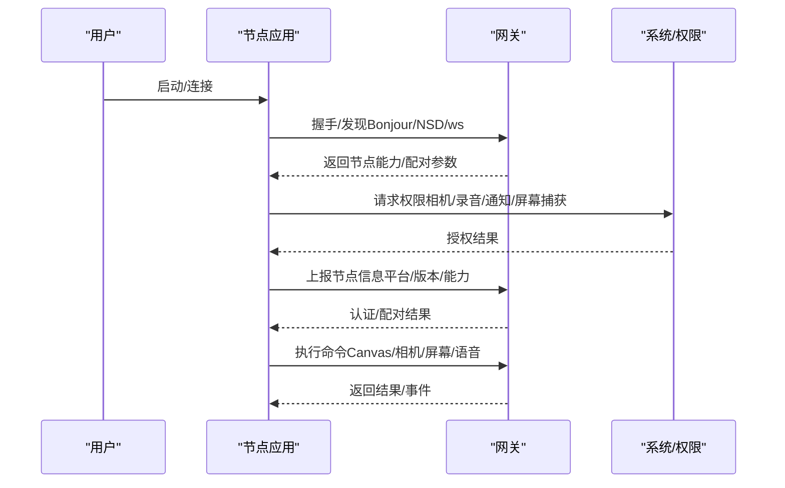
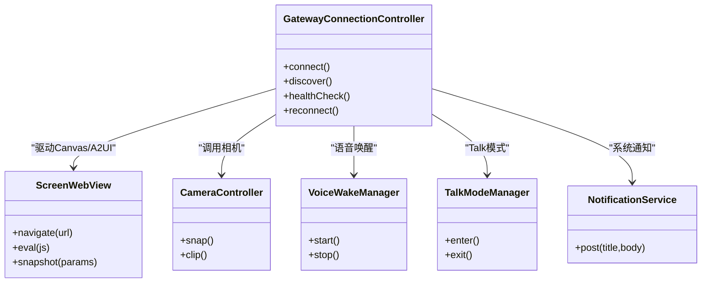
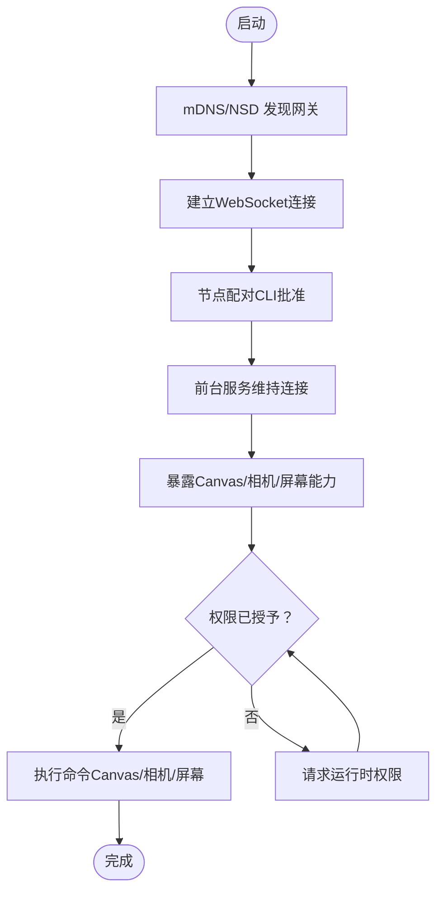
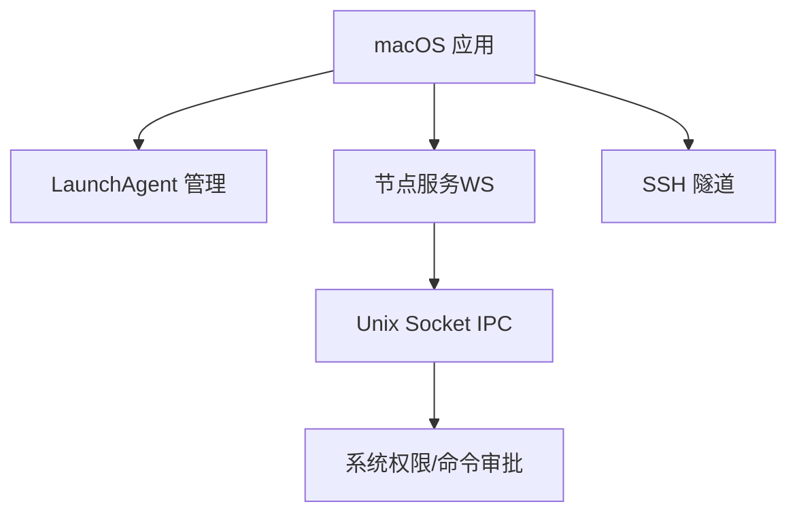
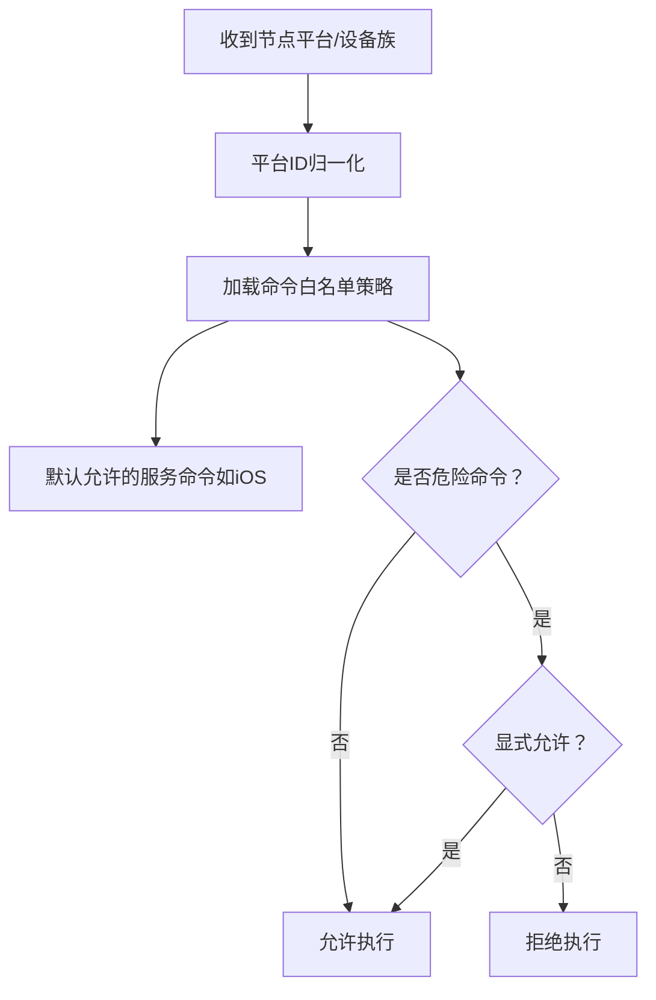
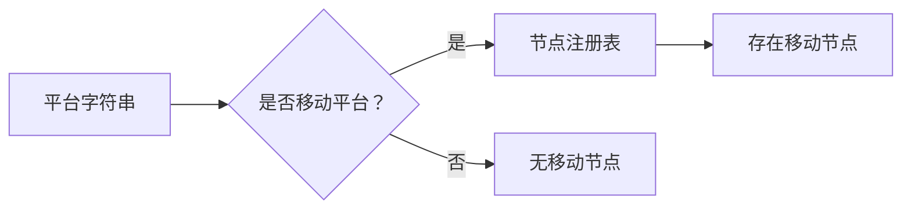

# 平台实现

<cite>
**本文引用的文件**
- [apps/ios/README.md](file://apps/ios/README.md)
- [apps/android/README.md](file://apps/android/README.md)
- [docs/platforms/ios.md](file://docs/platforms/ios.md)
- [docs/platforms/android.md](file://docs/platforms/android.md)
- [docs/platforms/macos.md](file://docs/platforms/macos.md)
- [apps/ios/Sources/Info.plist](file://apps/ios/Sources/Info.plist)
- [apps/ios/Sources/Gateway/GatewayConnectionController.swift](file://apps/ios/Sources/Gateway/GatewayConnectionController.swift)
- [apps/ios/Sources/Services/NotificationService.swift](file://apps/ios/Sources/Services/NotificationService.swift)
- [apps/ios/Sources/Screen/ScreenWebView.swift](file://apps/ios/Sources/Screen/ScreenWebView.swift)
- [apps/ios/Sources/Camera/CameraController.swift](file://apps/ios/Sources/Camera/CameraController.swift)
- [apps/ios/Sources/Location/LocationService.swift](file://apps/ios/Sources/Location/LocationService.swift)
- [apps/ios/Sources/Model/NodeAppModel+Canvas.swift](file://apps/ios/Sources/Model/NodeAppModel+Canvas.swift)
- [apps/ios/Sources/Voice/VoiceWakeManager.swift](file://apps/ios/Sources/Voice/VoiceWakeManager.swift)
- [apps/ios/Sources/Voice/TalkModeManager.swift](file://apps/ios/Sources/Voice/TalkModeManager.swift)
- [apps/android/app/src/main/java/ai/openclaw/android/NodeApp.kt](file://apps/android/app/src/main/java/ai/openclaw/android/NodeApp.kt)
- [apps/android/app/src/main/java/ai/openclaw/android/NodeForegroundService.kt](file://apps/android/app/src/main/java/ai/openclaw/android/NodeForegroundService.kt)
- [apps/android/app/src/main/java/ai/openclaw/android/gateway/GatewayDiscovery.kt](file://apps/android/app/src/main/java/ai/openclaw/android/gateway/GatewayDiscovery.kt)
- [apps/android/app/src/main/java/ai/openclaw/android/gateway/GatewaySession.kt](file://apps/android/app/src/main/java/ai/openclaw/android/gateway/GatewaySession.kt)
- [apps/android/app/src/main/java/ai/openclaw/android/gateway/DeviceIdentityStore.kt](file://apps/android/app/src/main/java/ai/openclaw/android/gateway/DeviceIdentityStore.kt)
- [apps/android/app/src/main/java/ai/openclaw/android/gateway/DeviceAuthStore.kt](file://apps/android/app/src/main/java/ai/openclaw/android/gateway/DeviceAuthStore.kt)
- [apps/android/app/src/main/java/ai/openclaw/android/node/CanvasController.kt](file://apps/android/app/src/main/java/ai/openclaw/android/node/CanvasController.kt)
- [apps/android/app/src/main/java/ai/openclaw/android/node/CameraCaptureManager.kt](file://apps/android/app/src/main/java/ai/openclaw/android/node/CameraCaptureManager.kt)
- [apps/android/app/src/main/java/ai/openclaw/android/node/ScreenRecordManager.kt](file://apps/android/app/src/main/java/ai/openclaw/android/node/ScreenRecordManager.kt)
- [apps/android/app/src/main/java/ai/openclaw/android/PermissionRequester.kt](file://apps/android/app/src/main/java/ai/openclaw/android/PermissionRequester.kt)
- [apps/android/app/src/main/java/ai/openclaw/android/ScreenCaptureRequester.kt](file://apps/android/app/src/main/java/ai/openclaw/android/ScreenCaptureRequester.kt)
- [apps/android/app/src/main/AndroidManifest.xml](file://apps/android/app/src/main/AndroidManifest.xml)
- [apps/macos/Sources/OpenClaw/NodesMenu.swift](file://apps/macos/Sources/OpenClaw/NodesMenu.swift)
- [apps/macos/Sources/OpenClawProtocol/GatewayModels.swift](file://apps/macos/Sources/OpenClawProtocol/GatewayModels.swift)
- [src/gateway/server-mobile-nodes.ts](file://src/gateway/server-mobile-nodes.ts)
- [src/gateway/node-command-policy.ts](file://src/gateway/node-command-policy.ts)
- [src/gateway/node-command-policy.test.ts](file://src/gateway/node-command-policy.test.ts)
- [apps/shared/OpenClawKit/Sources/OpenClawProtocol/GatewayModels.swift](file://apps/shared/OpenClawKit/Sources/OpenClawProtocol/GatewayModels.swift)
</cite>

## 目录

1. [引言](#引言)
2. [项目结构](#项目结构)
3. [核心组件](#核心组件)
4. [架构总览](#架构总览)
5. [详细组件分析](#详细组件分析)
6. [依赖关系分析](#依赖关系分析)
7. [性能考虑](#性能考虑)
8. [故障排查指南](#故障排查指南)
9. [结论](#结论)
10. [附录](#附录)

## 引言

本文件面向OpenClaw多平台节点实现，系统化梳理iOS、Android与macOS三端节点的架构差异、平台特性、权限与系统集成、设备控制能力、本地执行与安全机制，并给出兼容性要求、部署方式与性能优化策略。文档同时提供开发指南、调试方法与常见问题解决方案，帮助开发者在不同平台上高效落地与维护节点。

## 项目结构

OpenClaw在移动端（iOS/Android）与桌面端（macOS）分别提供独立应用，通过共享协议与网关进行通信；同时提供跨平台共享库以复用传输与类型定义。整体组织如下：

- iOS：应用层（SwiftUI）、服务层（相机/屏幕/位置/通知等）、网关连接与发现、Canvas/A2UI渲染与交互。
- Android：应用层（Jetpack Compose）、前台服务维持连接、网关发现与会话、Canvas/相机/屏幕录制、权限请求与安全存储。
- macOS：菜单栏应用、LaunchAgent生命周期管理、网关桥接、系统级权限与命令审批、远程模式下的SSH隧道、Unix Socket IPC。
- 共享协议：统一的节点配对参数、唤醒参数、命令白名单解析与平台归一化逻辑。

图表来源

- [apps/ios/Sources/Gateway/GatewayConnectionController.swift](file://apps/ios/Sources/Gateway/GatewayConnectionController.swift#L1-L200)
- [apps/ios/Sources/Screen/ScreenWebView.swift](file://apps/ios/Sources/Screen/ScreenWebView.swift#L1-L200)
- [apps/ios/Sources/Camera/CameraController.swift](file://apps/ios/Sources/Camera/CameraController.swift#L1-L200)
- [apps/ios/Sources/Voice/VoiceWakeManager.swift](file://apps/ios/Sources/Voice/VoiceWakeManager.swift#L1-L200)
- [apps/ios/Sources/Voice/TalkModeManager.swift](file://apps/ios/Sources/Voice/TalkModeManager.swift#L1-L200)
- [apps/android/app/src/main/java/ai/openclaw/android/NodeApp.kt](file://apps/android/app/src/main/java/ai/openclaw/android/NodeApp.kt#L1-L200)
- [apps/android/app/src/main/java/ai/openclaw/android/NodeForegroundService.kt](file://apps/android/app/src/main/java/ai/openclaw/android/NodeForegroundService.kt#L1-L200)
- [apps/android/app/src/main/java/ai/openclaw/android/gateway/GatewayDiscovery.kt](file://apps/android/app/src/main/java/ai/openclaw/android/gateway/GatewayDiscovery.kt#L1-L200)
- [apps/android/app/src/main/java/ai/openclaw/android/gateway/GatewaySession.kt](file://apps/android/app/src/main/java/ai/openclaw/android/gateway/GatewaySession.kt#L1-L200)
- [apps/android/app/src/main/java/ai/openclaw/android/node/CanvasController.kt](file://apps/android/app/src/main/java/ai/openclaw/android/node/CanvasController.kt#L1-L200)
- [apps/android/app/src/main/java/ai/openclaw/android/node/CameraCaptureManager.kt](file://apps/android/app/src/main/java/ai/openclaw/android/node/CameraCaptureManager.kt#L1-L200)
- [apps/android/app/src/main/java/ai/openclaw/android/node/ScreenRecordManager.kt](file://apps/android/app/src/main/java/ai/openclaw/android/node/ScreenRecordManager.kt#L1-L200)
- [apps/macos/Sources/OpenClaw/NodesMenu.swift](file://apps/macos/Sources/OpenClaw/NodesMenu.swift#L140-L163)
- [apps/macos/Sources/OpenClawProtocol/GatewayModels.swift](file://apps/macos/Sources/OpenClawProtocol/GatewayModels.swift#L635-L713)
- [src/gateway/node-command-policy.ts](file://src/gateway/node-command-policy.ts#L103-L140)

章节来源

- [apps/ios/README.md](file://apps/ios/README.md#L1-L67)
- [apps/android/README.md](file://apps/android/README.md#L1-L52)
- [docs/platforms/ios.md](file://docs/platforms/ios.md#L1-L108)
- [docs/platforms/android.md](file://docs/platforms/android.md#L1-L152)
- [docs/platforms/macos.md](file://docs/platforms/macos.md#L1-L204)

## 核心组件

- iOS节点核心模块
  - 网关连接与发现：负责WebSocket连接、Bonjour/LAN/Tailscale发现、健康检查与重连。
  - Canvas/A2UI：WKWebView承载Canvas与A2UI，支持导航、脚本注入、快照。
  - 设备能力：相机、屏幕录制、定位、通讯录/日历/提醒事项、运动活动。
  - 语音：语音唤醒、Talk模式、Keychain配对令牌存储。
  - 通知：系统通知服务，配合后台限制场景提示。
- Android节点核心模块
  - 前台服务：持久通知与断开操作，维持长连接。
  - 发现与会话：mDNS/NSD发现、手动主机端口、TLS配置、鉴权存储。
  - Canvas/相机/屏幕：Canvas控制器、相机捕获、屏幕录制管理器。
  - 权限：运行时权限请求（相机、录音、通知、位置），屏幕捕获授权。
- macOS节点核心模块
  - LaunchAgent生命周期：安装、启动、停止网关进程。
  - 系统权限与命令审批：通知、无障碍、屏幕录制、麦克风、自动化/AppleScript；system.run执行审批。
  - 远程模式：SSH隧道控制通道；Unix Socket IPC用于UI/TCC上下文执行。
  - 菜单栏与深链：状态展示、openclaw://深链触发Agent请求。

章节来源

- [apps/ios/Sources/Gateway/GatewayConnectionController.swift](file://apps/ios/Sources/Gateway/GatewayConnectionController.swift#L1-L200)
- [apps/ios/Sources/Screen/ScreenWebView.swift](file://apps/ios/Sources/Screen/ScreenWebView.swift#L1-L200)
- [apps/ios/Sources/Camera/CameraController.swift](file://apps/ios/Sources/Camera/CameraController.swift#L1-L200)
- [apps/ios/Sources/Voice/VoiceWakeManager.swift](file://apps/ios/Sources/Voice/VoiceWakeManager.swift#L1-L200)
- [apps/ios/Sources/Voice/TalkModeManager.swift](file://apps/ios/Sources/Voice/TalkModeManager.swift#L1-L200)
- [apps/android/app/src/main/java/ai/openclaw/android/NodeApp.kt](file://apps/android/app/src/main/java/ai/openclaw/android/NodeApp.kt#L1-L200)
- [apps/android/app/src/main/java/ai/openclaw/android/NodeForegroundService.kt](file://apps/android/app/src/main/java/ai/openclaw/android/NodeForegroundService.kt#L1-L200)
- [apps/android/app/src/main/java/ai/openclaw/android/gateway/GatewayDiscovery.kt](file://apps/android/app/src/main/java/ai/openclaw/android/gateway/GatewayDiscovery.kt#L1-L200)
- [apps/android/app/src/main/java/ai/openclaw/android/gateway/GatewaySession.kt](file://apps/android/app/src/main/java/ai/openclaw/android/gateway/GatewaySession.kt#L1-L200)
- [apps/android/app/src/main/java/ai/openclaw/android/node/CanvasController.kt](file://apps/android/app/src/main/java/ai/openclaw/android/node/CanvasController.kt#L1-L200)
- [apps/android/app/src/main/java/ai/openclaw/android/node/CameraCaptureManager.kt](file://apps/android/app/src/main/java/ai/openclaw/android/node/CameraCaptureManager.kt#L1-L200)
- [apps/android/app/src/main/java/ai/openclaw/android/node/ScreenRecordManager.kt](file://apps/android/app/src/main/java/ai/openclaw/android/node/ScreenRecordManager.kt#L1-L200)
- [apps/macos/Sources/OpenClaw/NodesMenu.swift](file://apps/macos/Sources/OpenClaw/NodesMenu.swift#L140-L163)
- [apps/macos/Sources/OpenClawProtocol/GatewayModels.swift](file://apps/macos/Sources/OpenClawProtocol/GatewayModels.swift#L635-L713)

## 架构总览

三端节点均通过WebSocket与网关通信，遵循统一的节点配对与命令协议。iOS与Android侧重前台交互与设备能力调用，macOS侧重系统权限与本地/远程网关桥接。

图表来源

- [apps/ios/Sources/Gateway/GatewayConnectionController.swift](file://apps/ios/Sources/Gateway/GatewayConnectionController.swift#L1-L200)
- [apps/android/app/src/main/java/ai/openclaw/android/gateway/GatewayDiscovery.kt](file://apps/android/app/src/main/java/ai/openclaw/android/gateway/GatewayDiscovery.kt#L1-L200)
- [apps/macos/Sources/OpenClawProtocol/GatewayModels.swift](file://apps/macos/Sources/OpenClawProtocol/GatewayModels.swift#L635-L713)

## 详细组件分析

### iOS 节点

- 连接与发现
  - 支持Bonjour/LAN、Tailnet（DNS-SD）与手动主机端口；前台模式下稳定运行。
  - Keychain存储配对令牌，避免重装后重复配对。
- Canvas/A2UI
  - WKWebView承载Canvas与A2UI；支持导航、脚本注入、截图；默认返回到内置模板。
- 设备能力
  - 相机：拍照/视频（受权限控制）。
  - 屏幕：屏幕录制（前台）。
  - 定位：位置服务。
  - 通讯录/日历/提醒：联系人搜索、日历事件、提醒列表。
  - 运动：活动追踪。
- 语音
  - 语音唤醒与Talk模式；后台音频可能被挂起，建议前台使用。
- 权限与体验
  - 权限为可选且敏感，需谨慎加固；UI与引导快速迭代中。

图表来源

- [apps/ios/Sources/Gateway/GatewayConnectionController.swift](file://apps/ios/Sources/Gateway/GatewayConnectionController.swift#L1-L200)
- [apps/ios/Sources/Screen/ScreenWebView.swift](file://apps/ios/Sources/Screen/ScreenWebView.swift#L1-L200)
- [apps/ios/Sources/Camera/CameraController.swift](file://apps/ios/Sources/Camera/CameraController.swift#L1-L200)
- [apps/ios/Sources/Voice/VoiceWakeManager.swift](file://apps/ios/Sources/Voice/VoiceWakeManager.swift#L1-L200)
- [apps/ios/Sources/Voice/TalkModeManager.swift](file://apps/ios/Sources/Voice/TalkModeManager.swift#L1-L200)
- [apps/ios/Sources/Services/NotificationService.swift](file://apps/ios/Sources/Services/NotificationService.swift#L1-L200)

章节来源

- [apps/ios/README.md](file://apps/ios/README.md#L1-L67)
- [docs/platforms/ios.md](file://docs/platforms/ios.md#L1-L108)
- [apps/ios/Sources/Info.plist](file://apps/ios/Sources/Info.plist#L1-L200)

### Android 节点

- 连接与发现
  - mDNS/NSD发现；前台服务维持连接；支持Tailnet（Wide-Area Bonjour/DNS-SD）与手动主机端口。
  - 首次配对后自动重连；聊天使用主会话键“main”，历史跨客户端一致。
- Canvas/相机/屏幕
  - Canvas控制器：导航、脚本注入、截图；A2UI推送/重置。
  - 相机：拍照/视频（含音频开关）。
  - 屏幕录制：前台仅可用。
- 权限与安全
  - 运行时权限：相机、录音、通知（Android 13+）、位置（<=12）。
  - 安全存储：设备身份与鉴权信息本地存储。
- 构建与测试
  - Gradle构建与单元测试；SDK路径自动检测。

图表来源

- [apps/android/app/src/main/java/ai/openclaw/android/gateway/GatewayDiscovery.kt](file://apps/android/app/src/main/java/ai/openclaw/android/gateway/GatewayDiscovery.kt#L1-L200)
- [apps/android/app/src/main/java/ai/openclaw/android/gateway/GatewaySession.kt](file://apps/android/app/src/main/java/ai/openclaw/android/gateway/GatewaySession.kt#L1-L200)
- [apps/android/app/src/main/java/ai/openclaw/android/node/CanvasController.kt](file://apps/android/app/src/main/java/ai/openclaw/android/node/CanvasController.kt#L1-L200)
- [apps/android/app/src/main/java/ai/openclaw/android/node/CameraCaptureManager.kt](file://apps/android/app/src/main/java/ai/openclaw/android/node/CameraCaptureManager.kt#L1-L200)
- [apps/android/app/src/main/java/ai/openclaw/android/node/ScreenRecordManager.kt](file://apps/android/app/src/main/java/ai/openclaw/android/node/ScreenRecordManager.kt#L1-L200)
- [apps/android/app/src/main/java/ai/openclaw/android/PermissionRequester.kt](file://apps/android/app/src/main/java/ai/openclaw/android/PermissionRequester.kt#L1-L200)
- [apps/android/app/src/main/AndroidManifest.xml](file://apps/android/app/src/main/AndroidManifest.xml#L1-L200)

章节来源

- [apps/android/README.md](file://apps/android/README.md#L1-L52)
- [docs/platforms/android.md](file://docs/platforms/android.md#L1-L152)

### macOS 节点

- 生命周期与网关桥接
  - 本地/远程两种模式：本地模式附加现有网关或通过LaunchAgent启动；远程模式通过SSH隧道连接并启动本地节点服务。
- 权限与命令审批
  - 系统权限：通知、无障碍、屏幕录制、麦克风、自动化/AppleScript。
  - system.run执行审批：本地JSON配置，支持默认策略、按代理分组、通配符允许清单。
- IPC与深链
  - Unix Socket IPC用于UI/TCC上下文执行；openclaw://深链触发Agent请求。
- 调试与诊断
  - 提供macOS CLI工具验证连接与发现逻辑；对比Node CLI与应用发现差异。

图表来源

- [apps/macos/Sources/OpenClaw/NodesMenu.swift](file://apps/macos/Sources/OpenClaw/NodesMenu.swift#L140-L163)
- [apps/macos/Sources/OpenClawProtocol/GatewayModels.swift](file://apps/macos/Sources/OpenClawProtocol/GatewayModels.swift#L635-L713)
- [docs/platforms/macos.md](file://docs/platforms/macos.md#L1-L204)

章节来源

- [docs/platforms/macos.md](file://docs/platforms/macos.md#L1-L204)

### 跨平台协议与命令策略

- 节点配对参数模型
  - 统一的节点配对请求/列表/批准参数结构，包含节点ID、显示名、平台、版本、设备型号、能力与命令集合、远端IP与静默标志等。
- 命令白名单与平台归一化
  - 将iOS/iPadOS/Android等平台标识归一化为“ios/android/mac/windows/linux”；默认对iOS节点开放部分服务命令，危险命令默认拒绝，可通过配置显式放行。

图表来源

- [src/gateway/node-command-policy.ts](file://src/gateway/node-command-policy.ts#L103-L140)
- [apps/shared/OpenClawKit/Sources/OpenClawProtocol/GatewayModels.swift](file://apps/shared/OpenClawKit/Sources/OpenClawProtocol/GatewayModels.swift#L635-L713)
- [apps/macos/Sources/OpenClawProtocol/GatewayModels.swift](file://apps/macos/Sources/OpenClawProtocol/GatewayModels.swift#L635-L713)

章节来源

- [src/gateway/node-command-policy.ts](file://src/gateway/node-command-policy.ts#L103-L140)
- [src/gateway/node-command-policy.test.ts](file://src/gateway/node-command-policy.test.ts#L1-L46)
- [apps/shared/OpenClawKit/Sources/OpenClawProtocol/GatewayModels.swift](file://apps/shared/OpenClawKit/Sources/OpenClawProtocol/GatewayModels.swift#L635-L713)
- [apps/macos/Sources/OpenClawProtocol/GatewayModels.swift](file://apps/macos/Sources/OpenClawProtocol/GatewayModels.swift#L635-L713)

## 依赖关系分析

- 平台识别与移动节点判定
  - 网关侧通过平台字符串前缀判断是否为移动平台（iOS/iPadOS/Android），用于统计与策略分支。
- 移动节点检测
  - 在节点注册表中扫描已连接节点，若平台属于移动平台则视为存在移动节点。

图表来源

- [src/gateway/server-mobile-nodes.ts](file://src/gateway/server-mobile-nodes.ts#L1-L14)

章节来源

- [src/gateway/server-mobile-nodes.ts](file://src/gateway/server-mobile-nodes.ts#L1-L14)

## 性能考虑

- iOS
  - Canvas/A2UI与相机/屏幕操作需前台运行；后台音频可能受限，语音功能建议前台使用。
  - 使用Keychain存储配对令牌，减少重复配对开销。
- Android
  - 前台服务维持连接，避免系统回收；权限请求集中在首次使用，减少后续阻塞。
  - Canvas截图与相机视频编码应根据设备能力动态调整分辨率与格式。
- macOS
  - 本地模式优先利用现有网关，减少进程启动延迟；远程模式通过SSH隧道复用已有健康隧道。
  - system.run环境变量过滤与合并，避免污染执行环境。

## 故障排查指南

- iOS
  - 常见错误：后台不可用、A2UI主机未配置、配对提示不出现、重装后重连失败。
  - 处理：确保前台运行Canvas/相机/屏幕命令；确认网关已发布Canvas主机URL；查看待配对列表并手动批准；重新配对节点。
- Android
  - 连接失败：检查mDNS/NSD可达性；Tailnet使用Wide-Area Bonjour；必要时使用手动主机端口。
  - 权限不足：确认相机/录音/通知/位置权限已授予；屏幕捕获需额外授权。
- macOS
  - LaunchAgent未安装：在应用内启用或执行安装命令；检查标签与用户ID。
  - 远程模式隧道异常：确认SSH隧道参数与keepalive设置；必要时重启隧道。
  - system.run被拒绝：检查exec-approvals配置与通配符匹配。

章节来源

- [docs/platforms/ios.md](file://docs/platforms/ios.md#L96-L102)
- [docs/platforms/android.md](file://docs/platforms/android.md#L64-L72)
- [docs/platforms/macos.md](file://docs/platforms/macos.md#L148-L176)

## 结论

OpenClaw多平台节点在统一协议与策略基础上，针对iOS的前台交互与设备能力、Android的前台服务与权限体系、macOS的系统权限与远程桥接实现了差异化实现。通过严格的权限管理、命令白名单与平台归一化策略，以及完善的调试与诊断工具，三端节点能够稳定地与网关协作，满足跨平台自动化与人机交互需求。

## 附录

- 开发与构建
  - iOS：Xcode工程生成与打开、模拟器/真机运行、测试命令。
  - Android：Gradle构建与安装、单元测试、SDK路径配置。
  - macOS：Swift构建与运行、打包脚本、CLI调试工具。
- 部署与运维
  - iOS：Keychain配对令牌、前台模式稳定性。
  - Android：前台服务通知、权限与安全存储。
  - macOS：LaunchAgent生命周期、SSH隧道与IPC。

章节来源

- [apps/ios/README.md](file://apps/ios/README.md#L27-L67)
- [apps/android/README.md](file://apps/android/README.md#L10-L52)
- [docs/platforms/macos.md](file://docs/platforms/macos.md#L142-L176)
