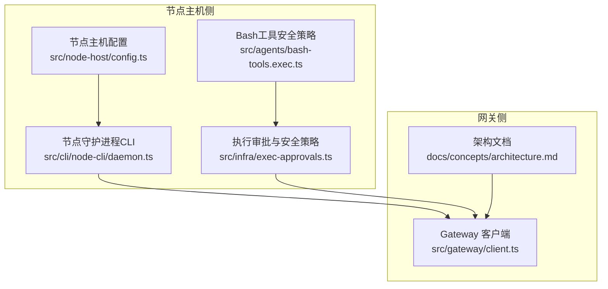
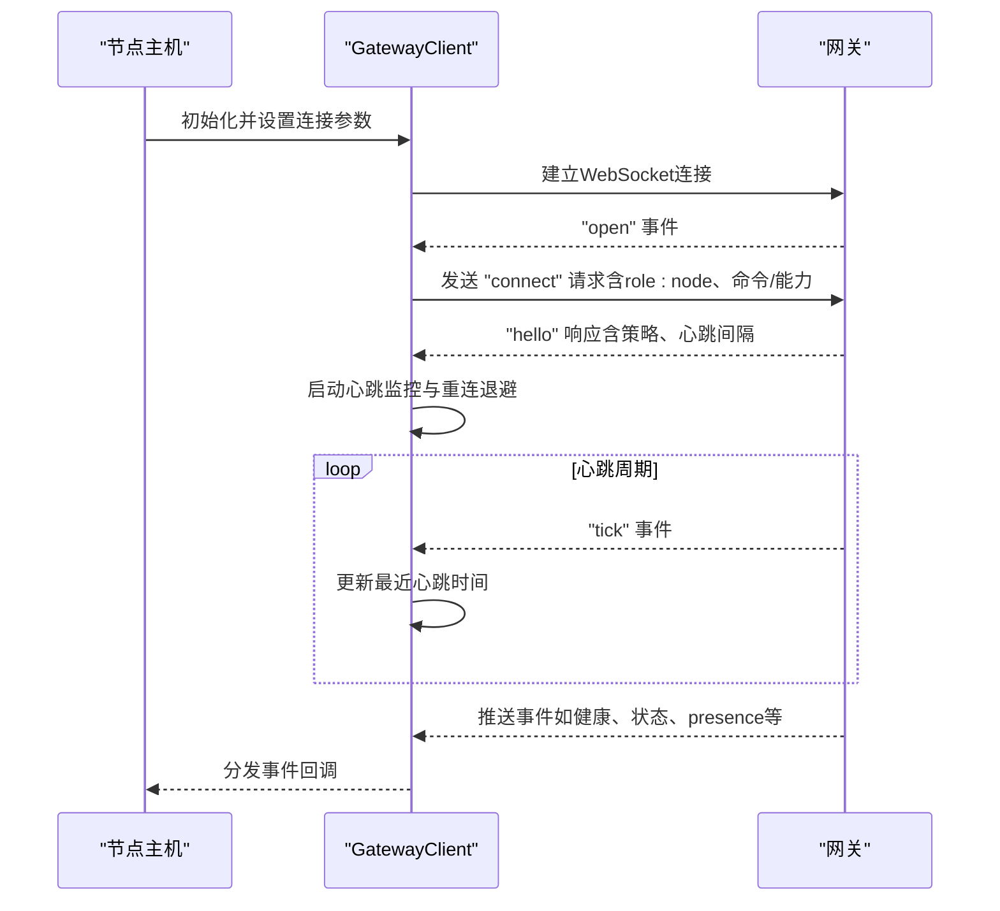
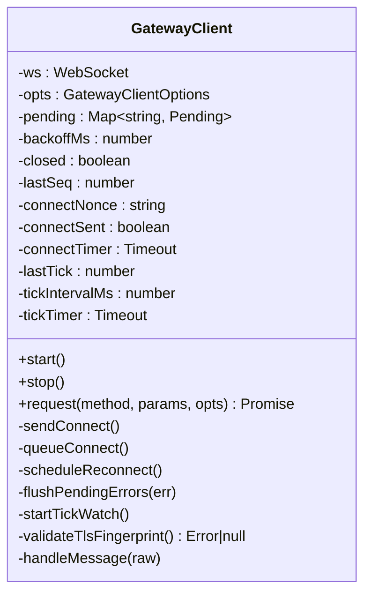
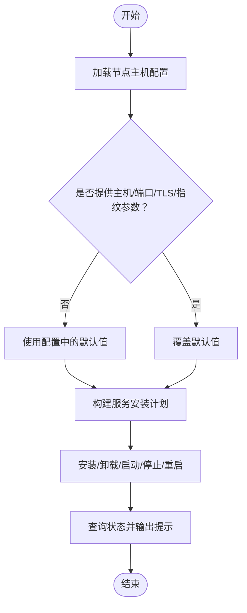
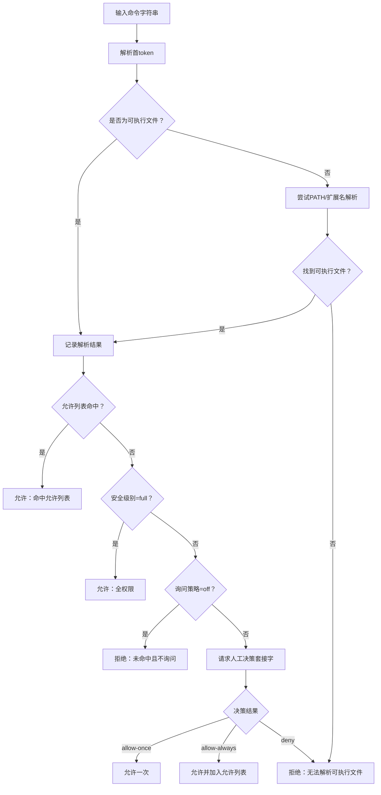
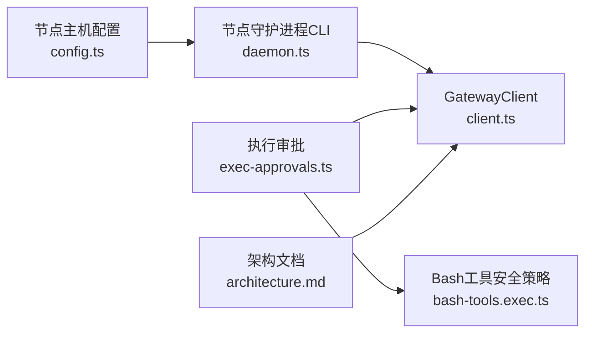

# 节点主机核心

<cite>
**本文引用的文件**
- [src/gateway/client.ts](file://src/gateway/client.ts)
- [src/gateway/server.health.e2e.test.ts](file://src/gateway/server.health.e2e.test.ts)
- [src/gateway/server.roles-allowlist-update.e2e.test.ts](file://src/gateway/server.roles-allowlist-update.e2e.test.ts)
- [docs/concepts/architecture.md](file://docs/concepts/architecture.md)
- [docs/zh-CN/concepts/architecture.md](file://docs/zh-CN/concepts/architecture.md)
- [src/infra/exec-approvals.ts](file://src/infra/exec-approvals.ts)
- [src/agents/bash-tools.exec.ts](file://src/agents/bash-tools.exec.ts)
- [src/node-host/config.ts](file://src/node-host/config.ts)
- [src/cli/node-cli/daemon.ts](file://src/cli/node-cli/daemon.ts)
- [src/cli/nodes-cli/register.invoke.ts](file://src/cli/nodes-cli/register.invoke.ts)
</cite>

## 目录

1. [引言](#引言)
2. [项目结构](#项目结构)
3. [核心组件](#核心组件)
4. [架构总览](#架构总览)
5. [详细组件分析](#详细组件分析)
6. [依赖关系分析](#依赖关系分析)
7. [性能考量](#性能考量)
8. [故障排除指南](#故障排除指南)
9. [结论](#结论)
10. [附录](#附录)

## 引言

本文件面向OpenClaw节点主机核心系统，聚焦以下目标：

- 解释节点主机的架构设计、启动流程与核心功能实现
- 详解GatewayClient的连接管理、WebSocket通信协议与事件处理机制
- 说明系统命令执行、权限管理与安全策略（含exec approvals机制）、环境变量处理与进程管理
- 提供节点主机配置选项、运行参数与故障排除的实际示例

## 项目结构

节点主机相关的关键模块分布于以下位置：

- 网关客户端与协议：src/gateway/client.ts
- 节点主机配置：src/node-host/config.ts
- 执行审批与安全策略：src/infra/exec-approvals.ts
- Bash工具安全策略：src/agents/bash-tools.exec.ts
- 节点守护进程与CLI：src/cli/node-cli/daemon.ts
- 节点注册与执行默认项：src/cli/nodes-cli/register.invoke.ts
- 端到端测试（健康检查、角色/命令白名单）：src/gateway/server.health.e2e.test.ts、src/gateway/server.roles-allowlist-update.e2e.test.ts
- 架构文档：docs/concepts/architecture.md、docs/zh-CN/concepts/architecture.md

**图表来源**

- [src/node-host/config.ts](file://src/node-host/config.ts#L1-L73)
- [src/cli/node-cli/daemon.ts](file://src/cli/node-cli/daemon.ts#L1-L609)
- [src/infra/exec-approvals.ts](file://src/infra/exec-approvals.ts#L1-L1633)
- [src/agents/bash-tools.exec.ts](file://src/agents/bash-tools.exec.ts#L60-L98)
- [src/gateway/client.ts](file://src/gateway/client.ts#L1-L442)
- [docs/concepts/architecture.md](file://docs/concepts/architecture.md#L1-L48)

**章节来源**

- [src/gateway/client.ts](file://src/gateway/client.ts#L1-L442)
- [src/node-host/config.ts](file://src/node-host/config.ts#L1-L73)
- [src/infra/exec-approvals.ts](file://src/infra/exec-approvals.ts#L1-L1633)
- [src/agents/bash-tools.exec.ts](file://src/agents/bash-tools.exec.ts#L60-L98)
- [src/cli/node-cli/daemon.ts](file://src/cli/node-cli/daemon.ts#L1-L609)
- [src/cli/nodes-cli/register.invoke.ts](file://src/cli/nodes-cli/register.invoke.ts#L36-L78)
- [docs/concepts/architecture.md](file://docs/concepts/architecture.md#L1-L48)
- [docs/zh-CN/concepts/architecture.md](file://docs/zh-CN/concepts/architecture.md#L1-L40)

## 核心组件

- GatewayClient：负责与网关建立并维护WebSocket连接，发送请求、接收事件、处理重连与心跳检测，并支持TLS指纹校验与设备签名认证。
- 节点主机配置：持久化节点标识、显示名、网关地址与TLS指纹等信息。
- 执行审批与安全策略：集中化管理执行安全级别、询问策略、允许列表、套接字令牌与路径解析，提供命令解析、模式匹配与安全决策接口。
- Bash工具安全策略：对宿主环境变量进行严格拦截与校验，防止注入与劫持。
- 节点守护进程CLI：封装安装、启动、停止、重启、状态查询等生命周期操作，适配不同平台的服务管理器。

**章节来源**

- [src/gateway/client.ts](file://src/gateway/client.ts#L79-L442)
- [src/node-host/config.ts](file://src/node-host/config.ts#L13-L73)
- [src/infra/exec-approvals.ts](file://src/infra/exec-approvals.ts#L1-L1633)
- [src/agents/bash-tools.exec.ts](file://src/agents/bash-tools.exec.ts#L60-L98)
- [src/cli/node-cli/daemon.ts](file://src/cli/node-cli/daemon.ts#L285-L609)

## 架构总览

节点主机通过GatewayClient以WebSocket连接到网关，使用“role: node”声明身份并携带能力/命令白名单。网关作为单一WhatsApp会话持有者，向控制面与节点广播事件与请求。节点主机负责本地命令执行的安全策略与审批流程，并通过CLI进行服务生命周期管理。

**图表来源**

- [src/gateway/client.ts](file://src/gateway/client.ts#L101-L165)
- [src/gateway/client.ts](file://src/gateway/client.ts#L178-L286)
- [src/gateway/client.ts](file://src/gateway/client.ts#L288-L386)
- [docs/concepts/architecture.md](file://docs/concepts/architecture.md#L12-L48)

**章节来源**

- [docs/concepts/architecture.md](file://docs/concepts/architecture.md#L12-L48)
- [docs/zh-CN/concepts/architecture.md](file://docs/zh-CN/concepts/architecture.md#L19-L40)
- [src/gateway/client.ts](file://src/gateway/client.ts#L101-L386)

## 详细组件分析

### GatewayClient：连接管理、协议与事件处理

- 连接与握手
  - 支持ws/wss，当使用wss时可启用TLS指纹校验，避免中间人攻击。
  - 连接成功后延迟发送“connect”请求，等待网关返回“hello”，并根据策略调整心跳间隔。
  - 若网关返回“connect.challenge”，客户端记录nonce并重新发送“connect”。

- 请求/响应与事件
  - 使用UUID生成请求ID，维护挂起请求映射，区分最终结果与中间ack。
  - 事件帧按序号跟踪断流检测，支持gap回调。
  - 心跳监控：若超过两倍心跳间隔未收到“tick”，主动关闭连接。

- 错误与重连
  - 连接错误与关闭时清理挂起请求，按指数退避重连。
  - 关闭码语义提示便于诊断。

**图表来源**

- [src/gateway/client.ts](file://src/gateway/client.ts#L79-L442)

**章节来源**

- [src/gateway/client.ts](file://src/gateway/client.ts#L101-L165)
- [src/gateway/client.ts](file://src/gateway/client.ts#L178-L286)
- [src/gateway/client.ts](file://src/gateway/client.ts#L288-L386)
- [src/gateway/client.ts](file://src/gateway/client.ts#L415-L442)

### 节点主机配置与启动流程

- 配置文件
  - 节点主机配置包含版本、节点ID、显示名、网关地址与TLS指纹等字段，采用严格读写与权限保护。
  - 首次缺失时自动生成随机节点ID并落盘。

- CLI守护进程
  - 封装安装、卸载、启动、停止、重启、状态查询等子命令。
  - 自动推导默认主机/端口/TLS/指纹，适配Darwin/Linux/Windows平台的服务管理器。
  - 提供日志定位提示与启动建议。

**图表来源**

- [src/cli/node-cli/daemon.ts](file://src/cli/node-cli/daemon.ts#L85-L228)
- [src/cli/node-cli/daemon.ts](file://src/cli/node-cli/daemon.ts#L285-L609)
- [src/node-host/config.ts](file://src/node-host/config.ts#L27-L73)

**章节来源**

- [src/node-host/config.ts](file://src/node-host/config.ts#L13-L73)
- [src/cli/node-cli/daemon.ts](file://src/cli/node-cli/daemon.ts#L85-L228)
- [src/cli/node-cli/daemon.ts](file://src/cli/node-cli/daemon.ts#L285-L609)

### 执行审批与安全策略（exec approvals）

- 数据模型
  - 支持三种安全级别：deny、allowlist、full；三种询问策略：off、on-miss、always。
  - 默认项与代理级配置合并，支持通配符代理(\*)与安全降级。
  - 允许列表条目包含模式、使用统计与规范化ID。

- 文件与套接字
  - 默认配置文件与套接字路径位于用户家目录下，文件权限严格限制为仅所有者可读写。
  - 套接字令牌用于与审批服务通信，超时控制与错误兜底。

- 命令解析与匹配
  - 解析首token、扩展波浪号、解析绝对/相对路径、结合PATH与扩展名查找可执行文件。
  - 支持glob模式匹配（含Windows realpath归一），大小写不敏感，支持双星与问号通配。

- 决策流程
  - 依据安全级别与询问策略决定是否放行；必要时通过本地套接字请求人工决策。
  - 对危险环境变量与前缀进行拦截，防止宿主注入。

**图表来源**

- [src/infra/exec-approvals.ts](file://src/infra/exec-approvals.ts#L428-L492)
- [src/infra/exec-approvals.ts](file://src/infra/exec-approvals.ts#L582-L604)
- [src/infra/exec-approvals.ts](file://src/infra/exec-approvals.ts#L1569-L1633)

**章节来源**

- [src/infra/exec-approvals.ts](file://src/infra/exec-approvals.ts#L1-L1633)
- [src/agents/bash-tools.exec.ts](file://src/agents/bash-tools.exec.ts#L60-L98)

### Bash工具安全策略

- 环境变量拦截
  - 明确禁止与注入相关的环境变量与前缀（如LD*\*、DYLD*\*、NODE_OPTIONS等），失败即刻拒绝。
- 宿主执行安全
  - 在非沙箱主机上，严格校验环境变量，避免影响执行流程或注入代码。

**章节来源**

- [src/agents/bash-tools.exec.ts](file://src/agents/bash-tools.exec.ts#L60-L98)

### 节点注册与执行默认项

- 执行安全/询问策略的CLI归一化与合并逻辑，确保跨平台一致性。
- 支持为节点注册时指定安全级别、询问策略、PATH前置与安全二进制集合。

**章节来源**

- [src/cli/nodes-cli/register.invoke.ts](file://src/cli/nodes-cli/register.invoke.ts#L36-L78)

## 依赖关系分析

- 节点主机配置依赖状态目录与文件权限管理。
- GatewayClient依赖WebSocket库、设备身份与TLS指纹校验、协议验证器。
- 执行审批模块依赖网络套接字、文件系统、路径解析与正则匹配。
- CLI守护进程依赖平台服务管理器（launchd/systemd/schtasks）与日志路径解析。

**图表来源**

- [src/node-host/config.ts](file://src/node-host/config.ts#L1-L73)
- [src/cli/node-cli/daemon.ts](file://src/cli/node-cli/daemon.ts#L1-L609)
- [src/gateway/client.ts](file://src/gateway/client.ts#L1-L442)
- [src/infra/exec-approvals.ts](file://src/infra/exec-approvals.ts#L1-L1633)
- [src/agents/bash-tools.exec.ts](file://src/agents/bash-tools.exec.ts#L60-L98)
- [docs/concepts/architecture.md](file://docs/concepts/architecture.md#L1-L48)

**章节来源**

- [src/node-host/config.ts](file://src/node-host/config.ts#L1-L73)
- [src/cli/node-cli/daemon.ts](file://src/cli/node-cli/daemon.ts#L1-L609)
- [src/gateway/client.ts](file://src/gateway/client.ts#L1-L442)
- [src/infra/exec-approvals.ts](file://src/infra/exec-approvals.ts#L1-L1633)
- [src/agents/bash-tools.exec.ts](file://src/agents/bash-tools.exec.ts#L60-L98)
- [docs/concepts/architecture.md](file://docs/concepts/architecture.md#L1-L48)

## 性能考量

- 心跳与断线检测：通过“tick”事件与定时器检测静默断开，避免资源泄漏。
- 指数退避重连：降低瞬时网络抖动对系统的影响。
- 大消息支持：WebSocket最大载荷调优以支持屏幕截图等大响应。
- 命令解析与匹配：允许列表命中优先，避免昂贵的路径扫描；glob匹配预编译正则提升命中效率。

[本节为通用指导，无需特定文件引用]

## 故障排除指南

- 连接失败
  - TLS指纹不匹配或缺失：确认wss URL与指纹一致，或移除强制指纹要求。
  - 设备签名/令牌问题：检查设备身份与存储的令牌，必要时清除后重试。
  - 参考关闭码语义提示，定位策略违规或服务重启。

- 心跳超时
  - 若长时间无“tick”，客户端会主动关闭连接，检查网关健康与网络稳定性。

- 执行被拒绝
  - 安全级别为deny或allowlist且未命中：调整安全级别或添加允许列表条目。
  - 询问策略为off：开启询问或调整策略。
  - 危险环境变量：移除或规避相关变量。

- CLI状态异常
  - Darwin/Linux/Windows平台分别查看对应服务管理器状态与日志路径，按提示启动服务。

**章节来源**

- [src/gateway/client.ts](file://src/gateway/client.ts#L68-L77)
- [src/gateway/client.ts](file://src/gateway/client.ts#L106-L137)
- [src/gateway/client.ts](file://src/gateway/client.ts#L369-L386)
- [src/infra/exec-approvals.ts](file://src/infra/exec-approvals.ts#L1569-L1633)
- [src/cli/node-cli/daemon.ts](file://src/cli/node-cli/daemon.ts#L66-L83)
- [src/cli/node-cli/daemon.ts](file://src/cli/node-cli/daemon.ts#L594-L608)

## 结论

节点主机核心围绕“安全、稳定、可观测”的原则设计：通过GatewayClient实现可靠的WebSocket连接与事件驱动；通过exec approvals与Bash工具安全策略保障命令执行安全；通过CLI守护进程实现跨平台的服务生命周期管理。配合严格的配置与权限控制，形成从连接、执行到运维的完整闭环。

[本节为总结性内容，无需特定文件引用]

## 附录

### 节点主机配置选项与运行参数

- 配置文件字段
  - 版本、节点ID、显示名、网关主机/端口/TLS/指纹
- CLI安装/启动/停止/重启/状态参数
  - 主机、端口、TLS、TLS指纹、节点ID、显示名、运行时（node/bun）、强制覆盖、JSON输出等

**章节来源**

- [src/node-host/config.ts](file://src/node-host/config.ts#L13-L73)
- [src/cli/node-cli/daemon.ts](file://src/cli/node-cli/daemon.ts#L29-L47)
- [src/cli/node-cli/daemon.ts](file://src/cli/node-cli/daemon.ts#L85-L96)

### 网关协议与事件处理要点

- 请求/响应/事件帧的JSON Schema校验
- 事件序列号与gap检测
- 心跳“tick”与超时关闭
- 健康检查与状态查询端到端验证

**章节来源**

- [src/gateway/client.ts](file://src/gateway/client.ts#L288-L336)
- [src/gateway/server.health.e2e.test.ts](file://src/gateway/server.health.e2e.test.ts#L54-L80)
- [src/gateway/server.roles-allowlist-update.e2e.test.ts](file://src/gateway/server.roles-allowlist-update.e2e.test.ts#L49-L105)
