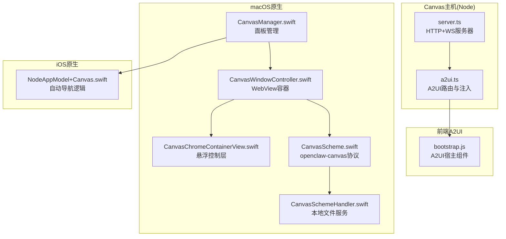
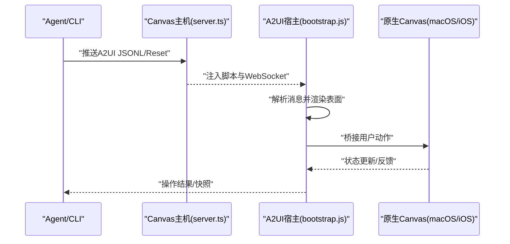
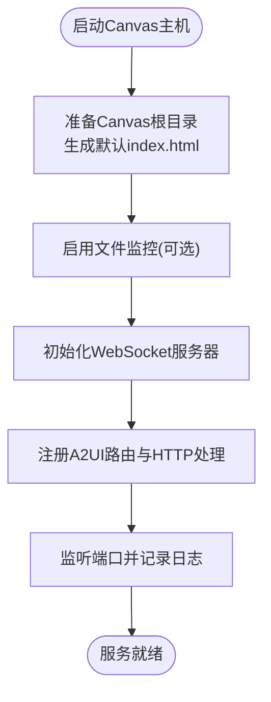
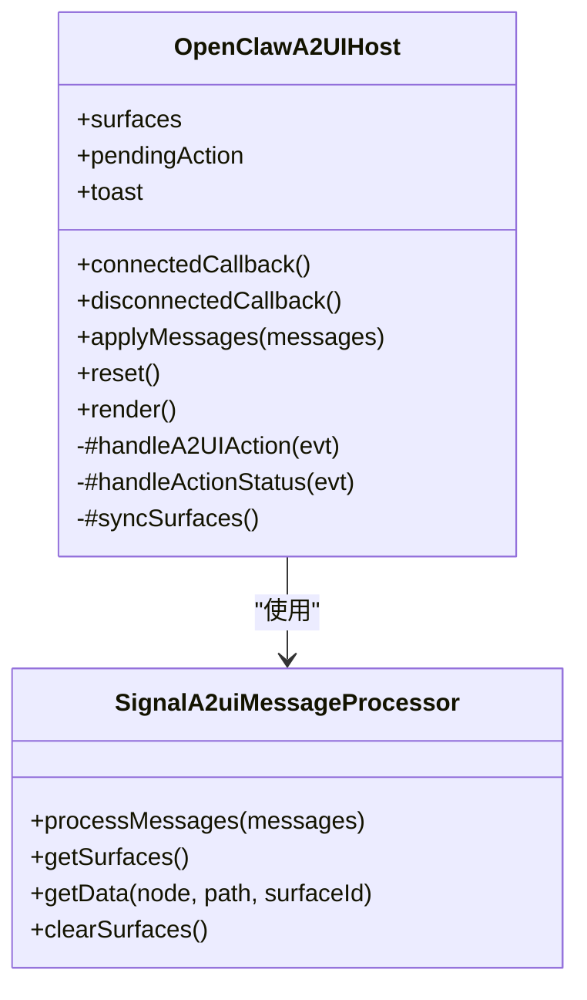
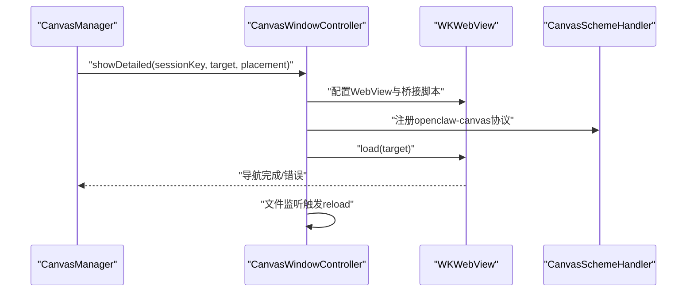
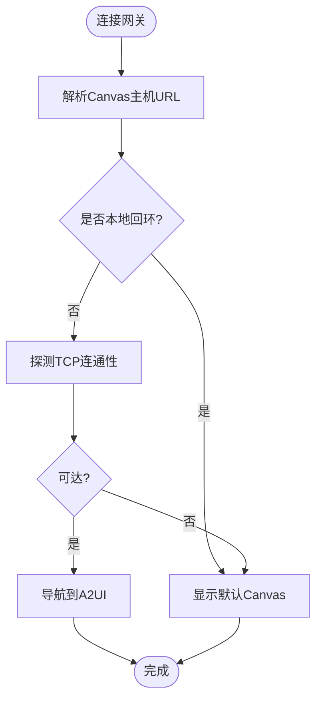
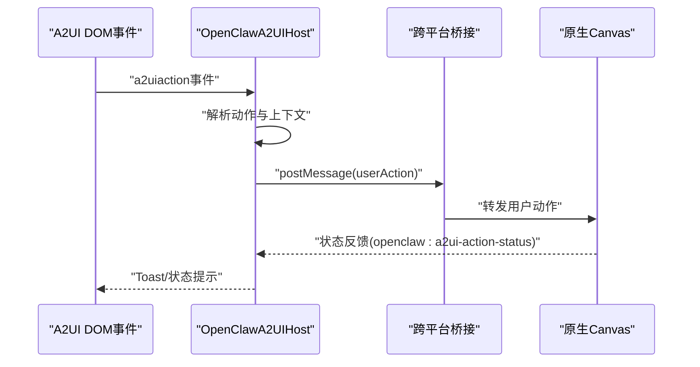
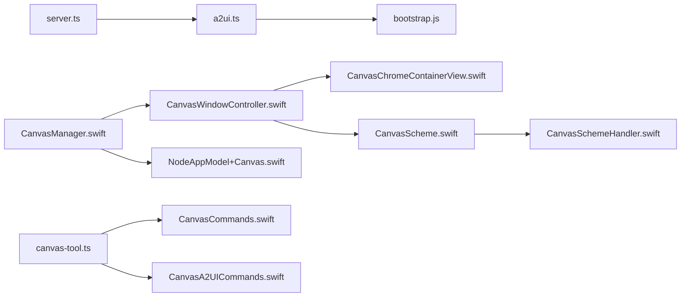

# Canvas可视化工作区

<cite>
**本文档引用的文件**
- [server.ts](file://src/canvas-host/server.ts)
- [a2ui.ts](file://src/canvas-host/a2ui.ts)
- [bootstrap.js](file://apps/shared/OpenClawKit/Tools/CanvasA2UI/bootstrap.js)
- [CanvasManager.swift](file://apps/macos/Sources/OpenClaw/CanvasManager.swift)
- [CanvasWindowController.swift](file://apps/macos/Sources/OpenClaw/CanvasWindowController.swift)
- [CanvasChromeContainerView.swift](file://apps/macos/Sources/OpenClaw/CanvasChromeContainerView.swift)
- [CanvasScheme.swift](file://apps/macos/Sources/OpenClaw/CanvasScheme.swift)
- [CanvasSchemeHandler.swift](file://apps/macos/Sources/OpenClaw/CanvasSchemeHandler.swift)
- [NodeAppModel+Canvas.swift](file://apps/ios/Sources/Model/NodeAppModel+Canvas.swift)
- [CanvasA2UICommands.swift](file://apps/shared/OpenClawKit/Sources/OpenClawKit/CanvasA2UICommands.swift)
- [CanvasCommands.swift](file://apps/shared/OpenClawKit/Sources/OpenClawKit/CanvasCommands.swift)
- [canvas-tool.ts](file://src/agents/tools/canvas-tool.ts)
- [register.canvas.ts](file://src/cli/nodes-cli/register.canvas.ts)
- [canvas-a2ui-copy.ts](file://scripts/canvas-a2ui-copy.ts)
</cite>

## 目录

1. [引言](#引言)
2. [项目结构](#项目结构)
3. [核心组件](#核心组件)
4. [架构总览](#架构总览)
5. [详细组件分析](#详细组件分析)
6. [依赖关系分析](#依赖关系分析)
7. [性能考虑](#性能考虑)
8. [故障排除指南](#故障排除指南)
9. [结论](#结论)
10. [附录](#附录)

## 引言

本文件面向OpenClaw Canvas可视化工作区的技术文档，系统性阐述Canvas系统的架构设计、A2UI渲染机制与可视化组件实现原理。文档覆盖Canvas主机服务的启动流程、A2UI桥接机制与实时渲染管道，解释Canvas工作区的交互模式、事件处理与状态同步机制，并提供Canvas组件的生命周期管理、性能优化策略与内存管理建议，最后给出Canvas扩展开发指南与自定义组件实现的最佳实践。

## 项目结构

OpenClaw的Canvas子系统由多平台协同组成：Node.js实现的Canvas主机服务负责静态资源托管与WebSocket热重载；前端A2UI运行时在浏览器或WebView中渲染消息驱动的界面；原生平台（macOS、iOS）通过WebView与A2UI桥接，实现跨平台的用户交互与状态同步。

**图表来源**

- [server.ts](file://src/canvas-host/server.ts#L436-L515)
- [a2ui.ts](file://src/canvas-host/a2ui.ts#L161-L218)
- [bootstrap.js](file://apps/shared/OpenClawKit/Tools/CanvasA2UI/bootstrap.js#L154-L490)
- [CanvasManager.swift](file://apps/macos/Sources/OpenClaw/CanvasManager.swift#L32-L114)
- [CanvasWindowController.swift](file://apps/macos/Sources/OpenClaw/CanvasWindowController.swift#L26-L183)
- [CanvasChromeContainerView.swift](file://apps/macos/Sources/OpenClaw/CanvasChromeContainerView.swift#L1-L226)
- [CanvasScheme.swift](file://apps/macos/Sources/OpenClaw/CanvasScheme.swift#L1-L43)
- [CanvasSchemeHandler.swift](file://apps/macos/Sources/OpenClaw/CanvasSchemeHandler.swift#L1-L260)
- [NodeAppModel+Canvas.swift](file://apps/ios/Sources/Model/NodeAppModel+Canvas.swift#L10-L54)

**章节来源**

- [server.ts](file://src/canvas-host/server.ts#L1-L516)
- [a2ui.ts](file://src/canvas-host/a2ui.ts#L1-L219)
- [bootstrap.js](file://apps/shared/OpenClawKit/Tools/CanvasA2UI/bootstrap.js#L1-L491)
- [CanvasManager.swift](file://apps/macos/Sources/OpenClaw/CanvasManager.swift#L1-L343)
- [CanvasWindowController.swift](file://apps/macos/Sources/OpenClaw/CanvasWindowController.swift#L1-L372)
- [CanvasChromeContainerView.swift](file://apps/macos/Sources/OpenClaw/CanvasChromeContainerView.swift#L1-L226)
- [CanvasScheme.swift](file://apps/macos/Sources/OpenClaw/CanvasScheme.swift#L1-L43)
- [CanvasSchemeHandler.swift](file://apps/macos/Sources/OpenClaw/CanvasSchemeHandler.swift#L1-L260)
- [NodeAppModel+Canvas.swift](file://apps/ios/Sources/Model/NodeAppModel+Canvas.swift#L1-L98)

## 核心组件

- Canvas主机服务：提供HTTP静态资源服务、WebSocket热重载、A2UI路由与脚本注入。
- A2UI宿主组件：基于Lit的Web组件，负责解析A2UI消息、管理表面与组件、桥接到原生平台。
- 原生Canvas管理器：macOS/iOS侧的面板控制器，负责WebView生命周期、文件监听、自动导航到A2UI。
- 协议与方案：openclaw-canvas协议与本地文件服务，确保安全的本地内容访问。
- 工具与CLI：Canvas工具与CLI命令，支持远程节点的Canvas操作与A2UI推送。

**章节来源**

- [server.ts](file://src/canvas-host/server.ts#L249-L434)
- [a2ui.ts](file://src/canvas-host/a2ui.ts#L161-L218)
- [bootstrap.js](file://apps/shared/OpenClawKit/Tools/CanvasA2UI/bootstrap.js#L154-L490)
- [CanvasManager.swift](file://apps/macos/Sources/OpenClaw/CanvasManager.swift#L32-L114)
- [CanvasWindowController.swift](file://apps/macos/Sources/OpenClaw/CanvasWindowController.swift#L26-L183)
- [CanvasSchemeHandler.swift](file://apps/macos/Sources/OpenClaw/CanvasSchemeHandler.swift#L47-L106)
- [canvas-tool.ts](file://src/agents/tools/canvas-tool.ts#L51-L180)
- [register.canvas.ts](file://src/cli/nodes-cli/register.canvas.ts#L205-L221)

## 架构总览

Canvas系统采用“主机-前端-原生”三层协作架构：

- 主机层：Node.js HTTP服务器托管Canvas根目录，动态注入WebSocket热重载脚本，提供A2UI静态资源路由。
- 前端层：A2UI宿主组件解析消息流，构建表面与组件树，响应用户动作并通过桥接发送到原生平台。
- 原生层：macOS/iOS通过WebView加载Canvas内容，安装A2UI桥接脚本，接收并转发用户动作，支持自动导航与调试状态显示。

**图表来源**

- [server.ts](file://src/canvas-host/server.ts#L453-L479)
- [a2ui.ts](file://src/canvas-host/a2ui.ts#L102-L159)
- [bootstrap.js](file://apps/shared/OpenClawKit/Tools/CanvasA2UI/bootstrap.js#L333-L422)
- [CanvasWindowController.swift](file://apps/macos/Sources/OpenClaw/CanvasWindowController.swift#L58-L129)

## 详细组件分析

### Canvas主机服务

- 职责：启动HTTP服务器，托管Canvas根目录，提供A2UI路由，注入热重载脚本，建立WebSocket用于文件变更广播。
- 关键点：
  - 自动准备Canvas根目录，缺失时生成默认欢迎页。
  - 支持可选的文件监控与热重载，通过WebSocket向客户端广播“reload”事件。
  - 提供A2UI静态资源路由，自动检测并注入热重载脚本。
  - 环境变量控制禁用主机服务，便于测试场景。

**图表来源**

- [server.ts](file://src/canvas-host/server.ts#L221-L235)
- [server.ts](file://src/canvas-host/server.ts#L300-L322)
- [server.ts](file://src/canvas-host/server.ts#L338-L416)
- [server.ts](file://src/canvas-host/server.ts#L436-L515)

**章节来源**

- [server.ts](file://src/canvas-host/server.ts#L221-L515)

### A2UI宿主组件

- 职责：作为Web组件承载A2UI消息处理器，维护表面集合，响应用户动作并通过桥接发送到原生平台。
- 关键点：
  - 消息处理器负责解析消息、构建表面与组件树，支持上下文数据解析。
  - 用户动作事件转换为统一的用户动作对象，通过WebKit或Android桥接发送。
  - 内置状态提示与Toast反馈，支持重置与表面同步。
  - 注入全局API以供外部调用（如applyMessages/reset）。

**图表来源**

- [bootstrap.js](file://apps/shared/OpenClawKit/Tools/CanvasA2UI/bootstrap.js#L154-L490)

**章节来源**

- [bootstrap.js](file://apps/shared/OpenClawKit/Tools/CanvasA2UI/bootstrap.js#L154-L490)

### macOS原生Canvas管理与窗口

- CanvasManager：会话级面板管理，支持展示/隐藏、自动导航到A2UI、调试状态更新与锚定位置。
- CanvasWindowController：WebView容器，安装A2UI桥接脚本，处理导航、快照、调试状态注入与文件监听。
- CanvasChromeContainerView：悬浮控制层，提供拖拽、调整大小与关闭按钮。
- CanvasScheme/CanvasSchemeHandler：openclaw-canvas协议与本地文件服务，确保安全的本地内容访问与索引页回退。

**图表来源**

- [CanvasManager.swift](file://apps/macos/Sources/OpenClaw/CanvasManager.swift#L32-L114)
- [CanvasWindowController.swift](file://apps/macos/Sources/OpenClaw/CanvasWindowController.swift#L26-L183)
- [CanvasChromeContainerView.swift](file://apps/macos/Sources/OpenClaw/CanvasChromeContainerView.swift#L1-L226)
- [CanvasScheme.swift](file://apps/macos/Sources/OpenClaw/CanvasScheme.swift#L1-L43)
- [CanvasSchemeHandler.swift](file://apps/macos/Sources/OpenClaw/CanvasSchemeHandler.swift#L1-L260)

**章节来源**

- [CanvasManager.swift](file://apps/macos/Sources/OpenClaw/CanvasManager.swift#L1-L343)
- [CanvasWindowController.swift](file://apps/macos/Sources/OpenClaw/CanvasWindowController.swift#L1-L372)
- [CanvasChromeContainerView.swift](file://apps/macos/Sources/OpenClaw/CanvasChromeContainerView.swift#L1-L226)
- [CanvasScheme.swift](file://apps/macos/Sources/OpenClaw/CanvasScheme.swift#L1-L43)
- [CanvasSchemeHandler.swift](file://apps/macos/Sources/OpenClaw/CanvasSchemeHandler.swift#L1-L260)

### iOS自动导航与连接状态

- NodeAppModel+Canvas：根据网关提供的Canvas主机URL，判断是否为本地回环地址，必要时探测TCP连通性后自动导航到A2UI，断开时回到默认Canvas。

**图表来源**

- [NodeAppModel+Canvas.swift](file://apps/ios/Sources/Model/NodeAppModel+Canvas.swift#L10-L54)

**章节来源**

- [NodeAppModel+Canvas.swift](file://apps/ios/Sources/Model/NodeAppModel+Canvas.swift#L1-L98)

### A2UI桥接机制与实时渲染管道

- 跨平台桥接：注入脚本提供统一的openclawSendUserAction接口，兼容iOS WebKit消息处理器与Android JS接口。
- 实时渲染：A2UI消息经宿主组件解析后渲染表面，WebSocket热重载触发页面刷新，确保开发体验流畅。
- 原生转发：当存在内置A2UI宿主时，优先由其处理动作；否则直接通过桥接转发至原生平台。

**图表来源**

- [bootstrap.js](file://apps/shared/OpenClawKit/Tools/CanvasA2UI/bootstrap.js#L333-L422)
- [a2ui.ts](file://src/canvas-host/a2ui.ts#L102-L159)
- [CanvasWindowController.swift](file://apps/macos/Sources/OpenClaw/CanvasWindowController.swift#L58-L129)

**章节来源**

- [a2ui.ts](file://src/canvas-host/a2ui.ts#L102-L159)
- [bootstrap.js](file://apps/shared/OpenClawKit/Tools/CanvasA2UI/bootstrap.js#L102-L159)
- [CanvasWindowController.swift](file://apps/macos/Sources/OpenClaw/CanvasWindowController.swift#L58-L129)

### Canvas工作区交互模式与状态同步

- 交互模式：用户在A2UI界面上触发动作，宿主组件收集上下文并发送到原生Canvas；原生Canvas根据会话键与表面ID定位目标组件，执行相应逻辑。
- 状态同步：通过WebSocket广播文件变更，宿主组件在收到“reload”后重新渲染；同时通过全局事件反馈动作状态，提供Toast提示。

**章节来源**

- [bootstrap.js](file://apps/shared/OpenClawKit/Tools/CanvasA2UI/bootstrap.js#L318-L331)
- [server.ts](file://src/canvas-host/server.ts#L276-L298)

### Canvas组件生命周期管理

- 初始化：宿主组件在connectedCallback中注册API、事件监听与桥接脚本；原生Canvas在WebView初始化时注入桥接脚本并注册消息处理器。
- 运行期：文件监控触发热重载；动作事件触发状态更新与Toast反馈。
- 销毁：组件与WebView在disconnectedCallback/deinit中清理消息处理器与文件监听。

**章节来源**

- [bootstrap.js](file://apps/shared/OpenClawKit/Tools/CanvasA2UI/bootstrap.js#L276-L300)
- [CanvasWindowController.swift](file://apps/macos/Sources/OpenClaw/CanvasWindowController.swift#L188-L193)

### 性能优化策略与内存管理

- 文件监控与热重载：采用防抖机制减少频繁刷新；仅在本地Canvas内容时触发自动重载，避免对远程页面产生不必要影响。
- WebView优化：设置drawsBackground为true避免透明底层，提升绘制性能；合理释放图片与快照资源。
- 桥接脚本：最小化注入脚本体积，避免重复安装桥接逻辑；在无内置A2UI宿主时才进行深链回退。

**章节来源**

- [server.ts](file://src/canvas-host/server.ts#L289-L298)
- [CanvasWindowController.swift](file://apps/macos/Sources/OpenClaw/CanvasWindowController.swift#L135-L137)
- [CanvasWindowController.swift](file://apps/macos/Sources/OpenClaw/CanvasWindowController.swift#L141-L162)

### 扩展开发指南与最佳实践

- A2UI消息格式：遵循A2UI消息规范，确保动作名称、上下文与表面ID正确传递。
- 自定义组件：在A2UI宿主中通过消息处理器注册自定义组件，利用getData解析数据上下文，确保路径安全。
- 资产打包：使用canvas-a2ui-copy脚本复制A2UI资产到分发目录，确保生产环境可用。
- CLI集成：通过canvas-tool与CLI命令推送A2UI JSONL或重置渲染状态，便于自动化与调试。

**章节来源**

- [canvas-tool.ts](file://src/agents/tools/canvas-tool.ts#L159-L174)
- [register.canvas.ts](file://src/cli/nodes-cli/register.canvas.ts#L205-L221)
- [canvas-a2ui-copy.ts](file://scripts/canvas-a2ui-copy.ts#L1-L40)

## 依赖关系分析

**图表来源**

- [server.ts](file://src/canvas-host/server.ts#L1-L20)
- [a2ui.ts](file://src/canvas-host/a2ui.ts#L1-L219)
- [bootstrap.js](file://apps/shared/OpenClawKit/Tools/CanvasA2UI/bootstrap.js#L1-L8)
- [CanvasManager.swift](file://apps/macos/Sources/OpenClaw/CanvasManager.swift#L1-L6)
- [CanvasWindowController.swift](file://apps/macos/Sources/OpenClaw/CanvasWindowController.swift#L1-L6)
- [CanvasChromeContainerView.swift](file://apps/macos/Sources/OpenClaw/CanvasChromeContainerView.swift#L1-L4)
- [CanvasScheme.swift](file://apps/macos/Sources/OpenClaw/CanvasScheme.swift#L1-L5)
- [CanvasSchemeHandler.swift](file://apps/macos/Sources/OpenClaw/CanvasSchemeHandler.swift#L1-L5)
- [NodeAppModel+Canvas.swift](file://apps/ios/Sources/Model/NodeAppModel+Canvas.swift#L1-L4)
- [canvas-tool.ts](file://src/agents/tools/canvas-tool.ts#L1-L10)
- [CanvasCommands.swift](file://apps/shared/OpenClawKit/Sources/OpenClawKit/CanvasCommands.swift#L1-L9)
- [CanvasA2UICommands.swift](file://apps/shared/OpenClawKit/Sources/OpenClawKit/CanvasA2UICommands.swift#L1-L26)

**章节来源**

- [server.ts](file://src/canvas-host/server.ts#L1-L20)
- [a2ui.ts](file://src/canvas-host/a2ui.ts#L1-L219)
- [bootstrap.js](file://apps/shared/OpenClawKit/Tools/CanvasA2UI/bootstrap.js#L1-L8)
- [CanvasManager.swift](file://apps/macos/Sources/OpenClaw/CanvasManager.swift#L1-L6)
- [CanvasWindowController.swift](file://apps/macos/Sources/OpenClaw/CanvasWindowController.swift#L1-L6)
- [CanvasChromeContainerView.swift](file://apps/macos/Sources/OpenClaw/CanvasChromeContainerView.swift#L1-L4)
- [CanvasScheme.swift](file://apps/macos/Sources/OpenClaw/CanvasScheme.swift#L1-L5)
- [CanvasSchemeHandler.swift](file://apps/macos/Sources/OpenClaw/CanvasSchemeHandler.swift#L1-L5)
- [NodeAppModel+Canvas.swift](file://apps/ios/Sources/Model/NodeAppModel+Canvas.swift#L1-L4)
- [canvas-tool.ts](file://src/agents/tools/canvas-tool.ts#L1-L10)
- [CanvasCommands.swift](file://apps/shared/OpenClawKit/Sources/OpenClawKit/CanvasCommands.swift#L1-L9)
- [CanvasA2UICommands.swift](file://apps/shared/OpenClawKit/Sources/OpenClawKit/CanvasA2UICommands.swift#L1-L26)

## 性能考虑

- 热重载防抖：在文件监控触发后延迟75ms批量广播，避免频繁刷新。
- 本地内容优先：仅在本地Canvas内容时触发自动重载，避免对远程页面造成干扰。
- WebView绘制优化：启用背景绘制，减少透明层带来的额外开销。
- 资源类型检测：根据扩展名选择合适的MIME类型，避免不必要的编码转换。

[本节为通用指导，无需特定文件引用]

## 故障排除指南

- A2UI资产缺失：检查A2UI资产是否存在且可读，确保已执行打包步骤。
- WebSocket连接失败：确认Canvas主机已启动并监听端口，检查路径与协议。
- 动作桥接失败：验证跨平台桥接脚本是否成功注入，检查原生平台的消息处理器是否可用。
- 文件监控异常：查看日志中的watcher错误信息，适当减小监控范围或禁用热重载。

**章节来源**

- [a2ui.ts](file://src/canvas-host/a2ui.ts#L184-L189)
- [server.ts](file://src/canvas-host/server.ts#L313-L322)
- [bootstrap.js](file://apps/shared/OpenClawKit/Tools/CanvasA2UI/bootstrap.js#L402-L421)

## 结论

OpenClaw Canvas可视化工作区通过主机-前端-原生三层协作，实现了跨平台的A2UI渲染与交互。Canvas主机服务提供稳定的静态资源与热重载能力，A2UI宿主组件负责消息解析与桥接，原生Canvas管理器确保一致的用户体验与自动导航。结合性能优化与扩展开发指南，开发者可以高效构建与维护Canvas工作区。

[本节为总结，无需特定文件引用]

## 附录

- A2UI命令枚举：提供canvas.a2ui.push与canvas.a2ui.reset等命令，便于工具与CLI集成。
- Canvas命令枚举：提供canvas.present、canvas.hide、canvas.navigate、canvas.eval、canvas.snapshot等命令，支持远程节点Canvas控制。

**章节来源**

- [CanvasA2UICommands.swift](file://apps/shared/OpenClawKit/Sources/OpenClawKit/CanvasA2UICommands.swift#L1-L26)
- [CanvasCommands.swift](file://apps/shared/OpenClawKit/Sources/OpenClawKit/CanvasCommands.swift#L1-L9)
