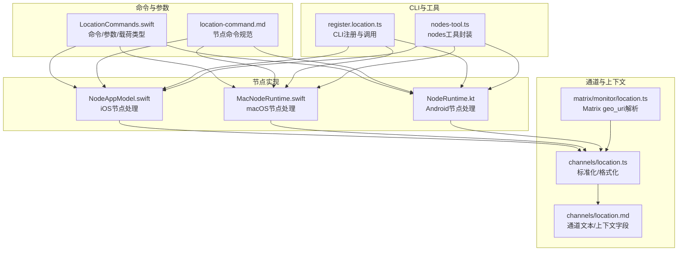
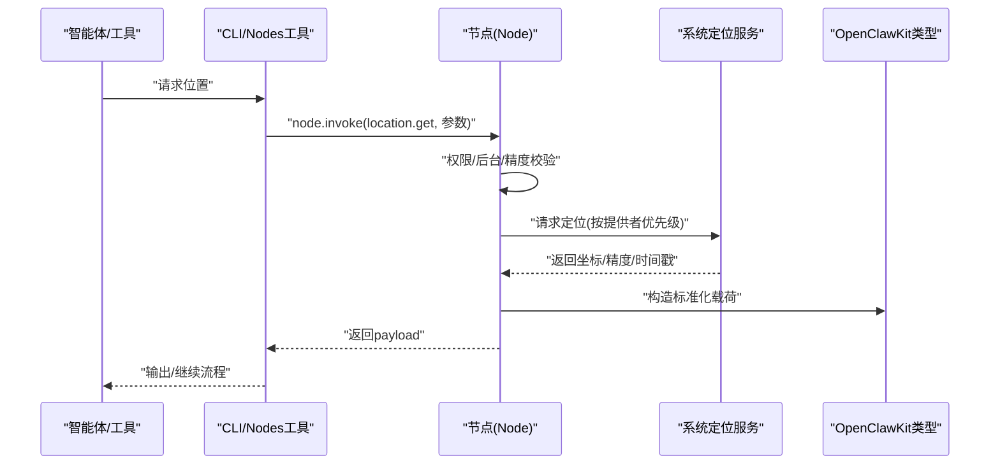
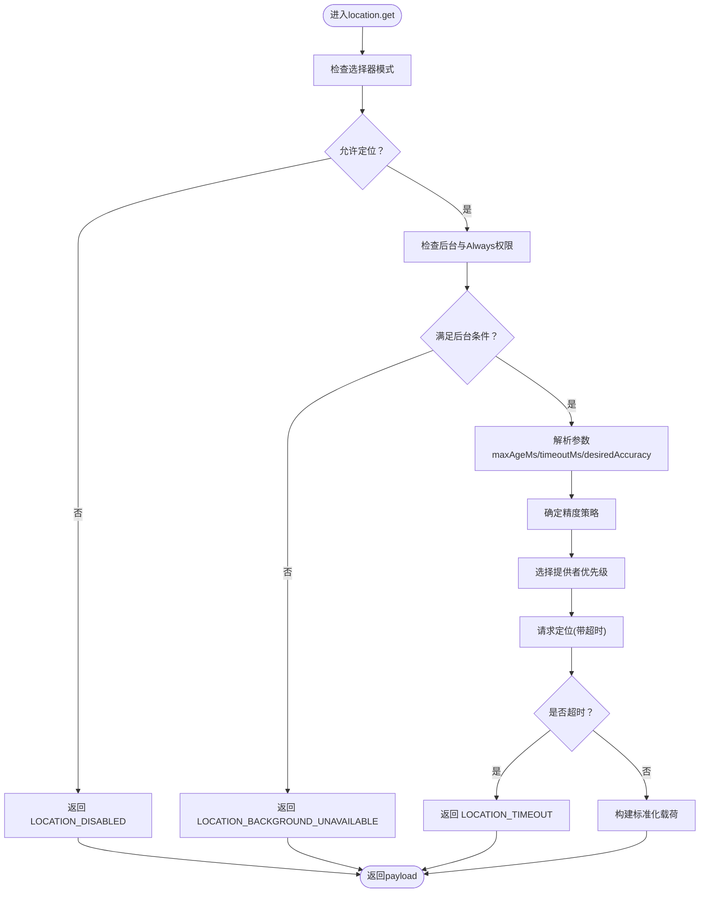
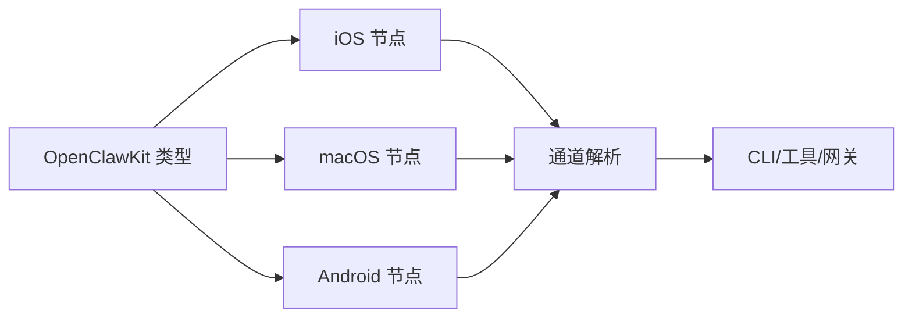
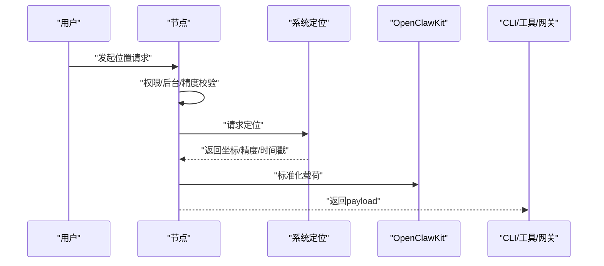

# 位置服务

<cite>
**本文引用的文件**
- [src/channels/location.ts](file://src/channels/location.ts)
- [docs/nodes/location-command.md](file://docs/nodes/location-command.md)
- [docs/zh-CN/nodes/location-command.md](file://docs/zh-CN/nodes/location-command.md)
- [docs/channels/location.md](file://docs/channels/location.md)
- [apps/android/app/src/main/java/ai/openclaw/android/NodeRuntime.kt](file://apps/android/app/src/main/java/ai/openclaw/android/NodeRuntime.kt)
- [apps/android/app/src/main/java/ai/openclaw/android/LocationMode.kt](file://apps/android/app/src/main/java/ai/openclaw/android/LocationMode.kt)
- [apps/android/app/src/main/java/ai/openclaw/android/node/LocationCaptureManager.kt](file://apps/android/app/src/main/java/ai/openclaw/android/node/LocationCaptureManager.kt)
- [apps/ios/Sources/Model/NodeAppModel.swift](file://apps/ios/Sources/Model/NodeAppModel.swift)
- [apps/macos/Sources/OpenClaw/NodeMode/MacNodeRuntime.swift](file://apps/macos/Sources/OpenClaw/NodeMode/MacNodeRuntime.swift)
- [apps/shared/OpenClawKit/Sources/OpenClawKit/LocationCommands.swift](file://apps/shared/OpenClawKit/Sources/OpenClawKit/LocationCommands.swift)
- [src/cli/nodes-cli/register.location.ts](file://src/cli/nodes-cli/register.location.ts)
- [src/agents/tools/nodes-tool.ts](file://src/agents/tools/nodes-tool.ts)
- [extensions/matrix/src/matrix/monitor/location.ts](file://extensions/matrix/src/matrix/monitor/location.ts)
</cite>

## 目录

1. [简介](#简介)
2. [项目结构](#项目结构)
3. [核心组件](#核心组件)
4. [架构总览](#架构总览)
5. [组件详解](#组件详解)
6. [依赖关系分析](#依赖关系分析)
7. [性能考量](#性能考量)
8. [故障排查指南](#故障排查指南)
9. [结论](#结论)
10. [附录](#附录)

## 简介

本文件面向OpenClaw位置服务功能，系统化阐述地理位置获取的实现机制、精度控制与隐私保护策略，以及位置数据的采集流程、缓存与更新频率控制。文档同时覆盖位置权限申请流程、用户授权管理与数据访问控制，并对地理围栏、位置历史记录与位置分享等扩展能力进行设计说明，最后提供位置服务扩展开发指南与自定义位置提供者集成方案。

## 项目结构

位置服务涉及跨平台节点实现（iOS、macOS、Android）、通用SDK类型定义、通道解析与CLI/工具集成。下图展示与位置服务相关的关键模块及其交互：

**图表来源**

- [apps/shared/OpenClawKit/Sources/OpenClawKit/LocationCommands.swift](file://apps/shared/OpenClawKit/Sources/OpenClawKit/LocationCommands.swift#L1-L57)
- [docs/nodes/location-command.md](file://docs/nodes/location-command.md#L1-L114)
- [apps/ios/Sources/Model/NodeAppModel.swift](file://apps/ios/Sources/Model/NodeAppModel.swift#L680-L737)
- [apps/macos/Sources/OpenClaw/NodeMode/MacNodeRuntime.swift](file://apps/macos/Sources/OpenClaw/NodeMode/MacNodeRuntime.swift#L232-L264)
- [apps/android/app/src/main/java/ai/openclaw/android/NodeRuntime.kt](file://apps/android/app/src/main/java/ai/openclaw/android/NodeRuntime.kt#L976-L1028)
- [src/channels/location.ts](file://src/channels/location.ts#L1-L77)
- [docs/channels/location.md](file://docs/channels/location.md#L1-L57)
- [extensions/matrix/src/matrix/monitor/location.ts](file://extensions/matrix/src/matrix/monitor/location.ts#L1-L65)
- [src/cli/nodes-cli/register.location.ts](file://src/cli/nodes-cli/register.location.ts#L1-L82)
- [src/agents/tools/nodes-tool.ts](file://src/agents/tools/nodes-tool.ts#L366-L398)

**章节来源**

- [src/channels/location.ts](file://src/channels/location.ts#L1-L77)
- [docs/channels/location.md](file://docs/channels/location.md#L1-L57)
- [apps/shared/OpenClawKit/Sources/OpenClawKit/LocationCommands.swift](file://apps/shared/OpenClawKit/Sources/OpenClawKit/LocationCommands.swift#L1-L57)
- [docs/nodes/location-command.md](file://docs/nodes/location-command.md#L1-L114)
- [src/cli/nodes-cli/register.location.ts](file://src/cli/nodes-cli/register.location.ts#L1-L82)
- [src/agents/tools/nodes-tool.ts](file://src/agents/tools/nodes-tool.ts#L366-L398)

## 核心组件

- 位置命令与参数：统一的命令枚举、精度等级与请求/响应载荷定义，确保跨平台一致性。
- 节点侧处理：iOS、macOS、Android三端分别实现权限校验、后台限制、精度选择与提供者调度。
- 通道解析与上下文：将各渠道位置消息标准化为统一文本与上下文字段，便于提示词与工具使用。
- CLI与工具：提供命令行与智能体工具入口，支持指定精度、超时与缓存年龄。
- 扩展与插件：如Matrix geo_uri解析，支持位置消息的自动识别与格式化。

**章节来源**

- [apps/shared/OpenClawKit/Sources/OpenClawKit/LocationCommands.swift](file://apps/shared/OpenClawKit/Sources/OpenClawKit/LocationCommands.swift#L1-L57)
- [apps/ios/Sources/Model/NodeAppModel.swift](file://apps/ios/Sources/Model/NodeAppModel.swift#L680-L737)
- [apps/macos/Sources/OpenClaw/NodeMode/MacNodeRuntime.swift](file://apps/macos/Sources/OpenClaw/NodeMode/MacNodeRuntime.swift#L232-L264)
- [apps/android/app/src/main/java/ai/openclaw/android/NodeRuntime.kt](file://apps/android/app/src/main/java/ai/openclaw/android/NodeRuntime.kt#L976-L1028)
- [src/channels/location.ts](file://src/channels/location.ts#L1-L77)
- [docs/channels/location.md](file://docs/channels/location.md#L1-L57)
- [src/cli/nodes-cli/register.location.ts](file://src/cli/nodes-cli/register.location.ts#L1-L82)
- [src/agents/tools/nodes-tool.ts](file://src/agents/tools/nodes-tool.ts#L366-L398)
- [extensions/matrix/src/matrix/monitor/location.ts](file://extensions/matrix/src/matrix/monitor/location.ts#L1-L65)

## 架构总览

位置服务采用“命令驱动 + 平台适配 + 通道标准化”的分层架构。上层通过统一命令发起定位请求，节点侧根据系统权限与后台状态进行前置校验，随后按精度策略选择提供者并执行定位，最终将标准化结果返回给调用方（CLI/工具/网关）。

**图表来源**

- [src/agents/tools/nodes-tool.ts](file://src/agents/tools/nodes-tool.ts#L366-L398)
- [src/cli/nodes-cli/register.location.ts](file://src/cli/nodes-cli/register.location.ts#L1-L82)
- [apps/ios/Sources/Model/NodeAppModel.swift](file://apps/ios/Sources/Model/NodeAppModel.swift#L680-L737)
- [apps/macos/Sources/OpenClaw/NodeMode/MacNodeRuntime.swift](file://apps/macos/Sources/OpenClaw/NodeMode/MacNodeRuntime.swift#L232-L264)
- [apps/android/app/src/main/java/ai/openclaw/android/NodeRuntime.kt](file://apps/android/app/src/main/java/ai/openclaw/android/NodeRuntime.kt#L976-L1028)
- [apps/shared/OpenClawKit/Sources/OpenClawKit/LocationCommands.swift](file://apps/shared/OpenClawKit/Sources/OpenClawKit/LocationCommands.swift#L1-L57)

## 组件详解

### 命令与参数规范

- 命令名称：location.get
- 请求参数（建议）：timeoutMs、maxAgeMs、desiredAccuracy（coarse/balanced/precise）
- 响应载荷：lat、lon、accuracyMeters、altitudeMeters、speedMps、headingDeg、timestamp、isPrecise、source
- 错误码（稳定）：LOCATION_DISABLED、LOCATION_PERMISSION_REQUIRED、LOCATION_BACKGROUND_UNAVAILABLE、LOCATION_TIMEOUT、LOCATION_UNAVAILABLE

**章节来源**

- [docs/nodes/location-command.md](file://docs/nodes/location-command.md#L45-L81)
- [docs/zh-CN/nodes/location-command.md](file://docs/zh-CN/nodes/location-command.md#L52-L88)
- [apps/shared/OpenClawKit/Sources/OpenClawKit/LocationCommands.swift](file://apps/shared/OpenClawKit/Sources/OpenClawKit/LocationCommands.swift#L13-L57)

### 权限与后台行为

- 选择器：Off/While Using/Always；单独开关“精确位置”
- iOS/macOS：While Using/Always由系统授权；后台需Always授权
- Android：后台位置为独立权限；可能需要前台服务
- 后台触发：未来支持推送触发短时唤醒定位并回传

**章节来源**

- [docs/nodes/location-command.md](file://docs/nodes/location-command.md#L18-L40)
- [docs/nodes/location-command.md](file://docs/nodes/location-command.md#L83-L107)
- [apps/ios/Sources/Model/NodeAppModel.swift](file://apps/ios/Sources/Model/NodeAppModel.swift#L680-L718)
- [apps/macos/Sources/OpenClaw/NodeMode/MacNodeRuntime.swift](file://apps/macos/Sources/OpenClaw/NodeMode/MacNodeRuntime.swift#L232-L264)
- [apps/android/app/src/main/java/ai/openclaw/android/NodeRuntime.kt](file://apps/android/app/src/main/java/ai/openclaw/android/NodeRuntime.kt#L976-L995)

### 精度控制与提供者调度

- desiredAccuracy优先级：precise → coarse → balanced
- 精确度开关与权限联动：仅在允许且具备细粒度权限时启用precise
- 提供者优先级：precise优先GPS+网络，coarse优先网络+GPS
- 缓存与超时：maxAgeMs用于复用旧数据；timeoutMs限制定位等待时间

**图表来源**

- [apps/android/app/src/main/java/ai/openclaw/android/NodeRuntime.kt](file://apps/android/app/src/main/java/ai/openclaw/android/NodeRuntime.kt#L976-L1028)
- [apps/android/app/src/main/java/ai/openclaw/android/node/LocationCaptureManager.kt](file://apps/android/app/src/main/java/ai/openclaw/android/node/LocationCaptureManager.kt#L86-L117)
- [apps/ios/Sources/Model/NodeAppModel.swift](file://apps/ios/Sources/Model/NodeAppModel.swift#L680-L737)
- [apps/macos/Sources/OpenClaw/NodeMode/MacNodeRuntime.swift](file://apps/macos/Sources/OpenClaw/NodeMode/MacNodeRuntime.swift#L232-L264)

**章节来源**

- [apps/android/app/src/main/java/ai/openclaw/android/NodeRuntime.kt](file://apps/android/app/src/main/java/ai/openclaw/android/NodeRuntime.kt#L996-L1009)
- [apps/android/app/src/main/java/ai/openclaw/android/node/LocationCaptureManager.kt](file://apps/android/app/src/main/java/ai/openclaw/android/node/LocationCaptureManager.kt#L86-L117)
- [apps/ios/Sources/Model/NodeAppModel.swift](file://apps/ios/Sources/Model/NodeAppModel.swift#L698-L734)
- [apps/macos/Sources/OpenClaw/NodeMode/MacNodeRuntime.swift](file://apps/macos/Sources/OpenClaw/NodeMode/MacNodeRuntime.swift#L242-L264)

### 通道位置解析与上下文

- 归一化：将不同渠道的位置消息统一为人类可读文本与结构化上下文字段
- 文本格式：Pin/Named Place/Live Share三类友好呈现
- 上下文字段：LocationLat/Lon/Accuracy/Name/Address/Source/IsLive
- 渠道差异：Telegram/WhatsApp/MatriXM不同字段映射与caption处理

**章节来源**

- [src/channels/location.ts](file://src/channels/location.ts#L1-L77)
- [docs/channels/location.md](file://docs/channels/location.md#L16-L57)
- [extensions/matrix/src/matrix/monitor/location.ts](file://extensions/matrix/src/matrix/monitor/location.ts#L1-L65)

### CLI与工具集成

- CLI：openclaw nodes location get 支持指定node、maxAge、accuracy、location-timeout、invoke-timeout
- 工具：nodes工具封装node.invoke(location.get)，支持参数透传与幂等键
- 输出：默认输出经纬度与精度，也可输出JSON

**章节来源**

- [src/cli/nodes-cli/register.location.ts](file://src/cli/nodes-cli/register.location.ts#L8-L82)
- [src/agents/tools/nodes-tool.ts](file://src/agents/tools/nodes-tool.ts#L366-L398)

### 隐私保护与数据访问控制

- 选择器与权限：Off/While Using/Always三级选择；后台需Always；精确位置需额外授权
- 最小暴露：仅在用户授权范围内返回定位数据；后台场景严格限制
- 缓存与时效：maxAgeMs避免频繁定位；timeoutMs防止长时间占用资源
- 通道隐私：通道侧解析不修改原始消息，仅追加文本与上下文字段

**章节来源**

- [docs/nodes/location-command.md](file://docs/nodes/location-command.md#L18-L40)
- [apps/ios/Sources/Model/NodeAppModel.swift](file://apps/ios/Sources/Model/NodeAppModel.swift#L680-L718)
- [apps/macos/Sources/OpenClaw/NodeMode/MacNodeRuntime.swift](file://apps/macos/Sources/OpenClaw/NodeMode/MacNodeRuntime.swift#L232-L264)
- [apps/android/app/src/main/java/ai/openclaw/android/NodeRuntime.kt](file://apps/android/app/src/main/java/ai/openclaw/android/NodeRuntime.kt#L976-L995)

### 地理围栏、位置历史与位置分享（设计说明）

- 地理围栏：基于当前位置与预设区域边界判断触发事件；建议结合缓存与阈值避免抖动
- 位置历史：在本地维护有限条目，结合maxAge策略与去重逻辑；注意存储与删除策略
- 位置分享：遵循最小授权原则，仅共享必要字段；支持临时分享与永久授权两种模式
- 以上为概念性设计，具体实现需结合业务需求与平台能力扩展

[本节为概念性内容，无需“章节来源”]

## 依赖关系分析

位置服务的依赖关系围绕“命令类型定义 → 节点实现 → 通道解析 → CLI/工具 → 系统定位服务”展开，耦合度低、职责清晰。

**图表来源**

- [apps/shared/OpenClawKit/Sources/OpenClawKit/LocationCommands.swift](file://apps/shared/OpenClawKit/Sources/OpenClawKit/LocationCommands.swift#L1-L57)
- [apps/ios/Sources/Model/NodeAppModel.swift](file://apps/ios/Sources/Model/NodeAppModel.swift#L680-L737)
- [apps/macos/Sources/OpenClaw/NodeMode/MacNodeRuntime.swift](file://apps/macos/Sources/OpenClaw/NodeMode/MacNodeRuntime.swift#L232-L264)
- [apps/android/app/src/main/java/ai/openclaw/android/NodeRuntime.kt](file://apps/android/app/src/main/java/ai/openclaw/android/NodeRuntime.kt#L976-L1028)
- [src/channels/location.ts](file://src/channels/location.ts#L1-L77)

**章节来源**

- [apps/shared/OpenClawKit/Sources/OpenClawKit/LocationCommands.swift](file://apps/shared/OpenClawKit/Sources/OpenClawKit/LocationCommands.swift#L1-L57)
- [apps/ios/Sources/Model/NodeAppModel.swift](file://apps/ios/Sources/Model/NodeAppModel.swift#L680-L737)
- [apps/macos/Sources/OpenClaw/NodeMode/MacNodeRuntime.swift](file://apps/macos/Sources/OpenClaw/NodeMode/MacNodeRuntime.swift#L232-L264)
- [apps/android/app/src/main/java/ai/openclaw/android/NodeRuntime.kt](file://apps/android/app/src/main/java/ai/openclaw/android/NodeRuntime.kt#L976-L1028)
- [src/channels/location.ts](file://src/channels/location.ts#L1-L77)

## 性能考量

- 定位超时与缓存：合理设置timeoutMs与maxAgeMs，减少无效定位与系统压力
- 提供者优先级：在保证精度前提下优先网络定位，必要时再启用GPS
- 后台唤醒：iOS/Android后台定位需谨慎，避免频繁唤醒导致耗电
- 通道解析：仅做必要转换，避免重复计算与内存占用

[本节为一般性指导，无需“章节来源”]

## 故障排查指南

常见错误与定位要点：

- LOCATION_DISABLED：确认节点设置为While Using/Always
- LOCATION_PERMISSION_REQUIRED：检查系统设置与权限弹窗
- LOCATION_BACKGROUND_UNAVAILABLE：后台仅WhenInUse时无法获取
- LOCATION_TIMEOUT：缩短timeout或提高desiredAccuracy策略
- LOCATION_UNAVAILABLE：系统无可用提供者或定位失败

**章节来源**

- [docs/nodes/location-command.md](file://docs/nodes/location-command.md#L75-L88)
- [apps/ios/Sources/Model/NodeAppModel.swift](file://apps/ios/Sources/Model/NodeAppModel.swift#L680-L718)
- [apps/macos/Sources/OpenClaw/NodeMode/MacNodeRuntime.swift](file://apps/macos/Sources/OpenClaw/NodeMode/MacNodeRuntime.swift#L232-L264)
- [apps/android/app/src/main/java/ai/openclaw/android/NodeRuntime.kt](file://apps/android/app/src/main/java/ai/openclaw/android/NodeRuntime.kt#L976-L1028)
- [apps/android/app/src/main/java/ai/openclaw/android/node/LocationCaptureManager.kt](file://apps/android/app/src/main/java/ai/openclaw/android/node/LocationCaptureManager.kt#L86-L117)

## 结论

OpenClaw位置服务通过统一命令与跨平台实现，结合严格的权限与后台策略、灵活的精度控制与提供者调度，实现了在隐私与性能之间的平衡。通道解析与CLI/工具集成进一步提升了位置能力在多场景下的可用性。未来可在此基础上扩展地理围栏、历史记录与分享等高级能力。

[本节为总结性内容，无需“章节来源”]

## 附录

### 位置数据采集流程（端到端）

**图表来源**

- [apps/ios/Sources/Model/NodeAppModel.swift](file://apps/ios/Sources/Model/NodeAppModel.swift#L680-L737)
- [apps/macos/Sources/OpenClaw/NodeMode/MacNodeRuntime.swift](file://apps/macos/Sources/OpenClaw/NodeMode/MacNodeRuntime.swift#L232-L264)
- [apps/android/app/src/main/java/ai/openclaw/android/NodeRuntime.kt](file://apps/android/app/src/main/java/ai/openclaw/android/NodeRuntime.kt#L976-L1028)
- [apps/shared/OpenClawKit/Sources/OpenClawKit/LocationCommands.swift](file://apps/shared/OpenClawKit/Sources/OpenClawKit/LocationCommands.swift#L13-L57)

### 自定义位置提供者集成指南

- 在节点侧新增提供者：实现与系统定位服务对接的适配层，支持超时与错误处理
- 更新精度策略：在现有策略基础上增加新精度档位与提供者组合
- 通道适配：如需支持新渠道位置消息，参照通道解析模式扩展geo_uri/消息体解析
- 测试与验证：覆盖权限、后台、超时、精度等关键路径

[本节为扩展开发指导，无需“章节来源”]
