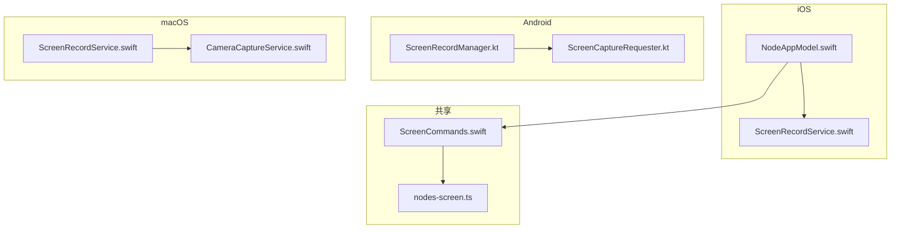
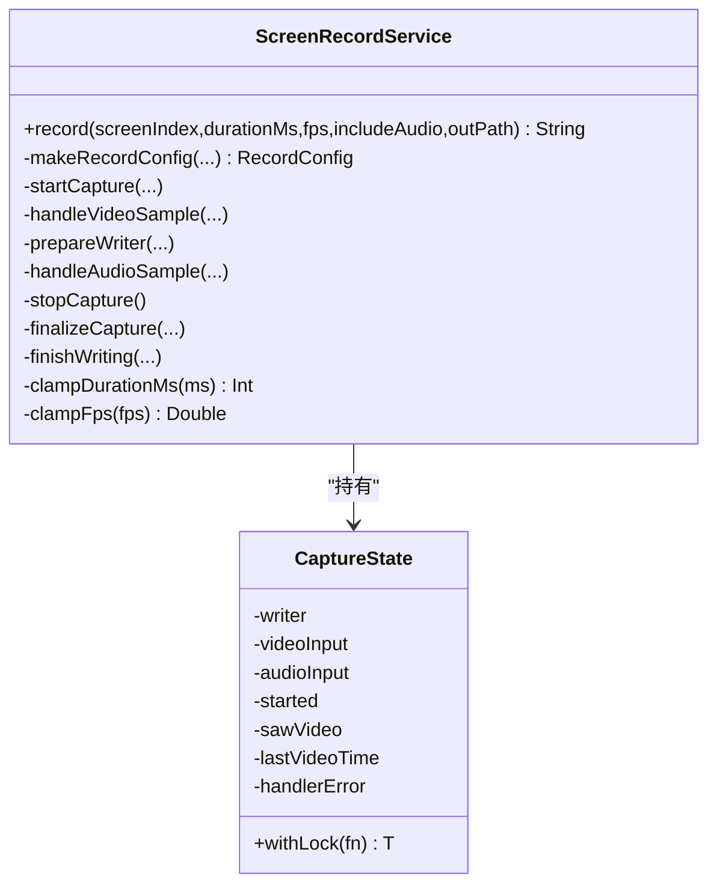
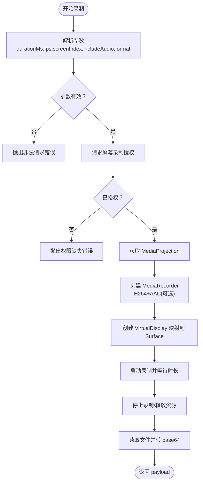
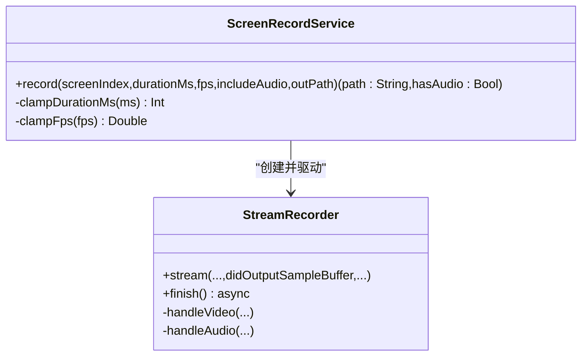
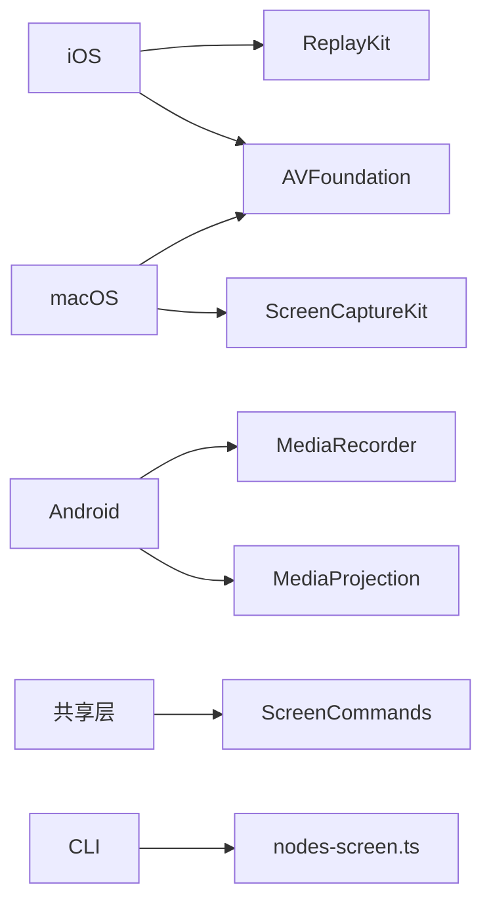

# 屏幕录制

<cite>
**本文引用的文件**
- [apps/ios/Sources/Screen/ScreenRecordService.swift](file://apps/ios/Sources/Screen/ScreenRecordService.swift)
- [apps/android/app/src/main/java/ai/openclaw/android/node/ScreenRecordManager.kt](file://apps/android/app/src/main/java/ai/openclaw/android/node/ScreenRecordManager.kt)
- [apps/macos/Sources/OpenClaw/ScreenRecordService.swift](file://apps/macos/Sources/OpenClaw/ScreenRecordService.swift)
- [apps/ios/Sources/Model/NodeAppModel.swift](file://apps/ios/Sources/Model/NodeAppModel.swift)
- [apps/shared/OpenClawKit/Sources/OpenClawKit/ScreenCommands.swift](file://apps/shared/OpenClawKit/Sources/OpenClawKit/ScreenCommands.swift)
- [src/cli/nodes-screen.ts](file://src/cli/nodes-screen.ts)
- [apps/android/app/src/main/java/ai/openclaw/android/ScreenCaptureRequester.kt](file://apps/android/app/src/main/java/ai/openclaw/android/ScreenCaptureRequester.kt)
- [apps/ios/Sources/Camera/CameraController.swift](file://apps/ios/Sources/Camera/CameraController.swift)
- [apps/macos/Sources/OpenClaw/CameraCaptureService.swift](file://apps/macos/Sources/OpenClaw/CameraCaptureService.swift)
- [README.md](file://README.md)
</cite>

## 目录

1. [简介](#简介)
2. [项目结构](#项目结构)
3. [核心组件](#核心组件)
4. [架构总览](#架构总览)
5. [详细组件分析](#详细组件分析)
6. [依赖关系分析](#依赖关系分析)
7. [性能考虑](#性能考虑)
8. [故障排查指南](#故障排查指南)
9. [结论](#结论)
10. [附录](#附录)

## 简介

本技术文档围绕 OpenClaw 的屏幕录制能力展开，系统性阐述跨平台（iOS、Android、macOS）的屏幕捕获实现、录制参数配置、媒体编码流程、权限与隐私保护、以及扩展开发与自定义录制格式支持方案。文档同时给出关键流程的时序图与类图，帮助读者快速理解从调用到输出的完整链路。

## 项目结构

OpenClaw 的屏幕录制由“节点层”在各平台本地执行，并通过统一的命令模型与网关协议进行编排。核心文件分布如下：

- iOS：ScreenRecordService 负责调用 ReplayKit 捕获屏幕与音频，写入 MP4。
- Android：ScreenRecordManager 使用 MediaProjection 与 MediaRecorder 实现屏幕录制与可选音频采集。
- macOS：ScreenRecordService 使用 ScreenCaptureKit 捕获屏幕与音频，写入 MP4。
- 共享层：OpenClawScreenCommand 定义 screen.record 命令与参数结构。
- CLI：nodes-screen.ts 提供解析与临时文件路径工具，用于将 base64 录制结果落盘。
- 权限与提示：Android 通过 ScreenCaptureRequester 引导用户授权；iOS/macOS 在调用前检查权限状态。



图表来源

- [apps/ios/Sources/Screen/ScreenRecordService.swift](file://apps/ios/Sources/Screen/ScreenRecordService.swift#L1-L361)
- [apps/ios/Sources/Model/NodeAppModel.swift](file://apps/ios/Sources/Model/NodeAppModel.swift#L940-L969)
- [apps/android/app/src/main/java/ai/openclaw/android/node/ScreenRecordManager.kt](file://apps/android/app/src/main/java/ai/openclaw/android/node/ScreenRecordManager.kt#L1-L200)
- [apps/android/app/src/main/java/ai/openclaw/android/ScreenCaptureRequester.kt](file://apps/android/app/src/main/java/ai/openclaw/android/ScreenCaptureRequester.kt#L38-L65)
- [apps/macos/Sources/OpenClaw/ScreenRecordService.swift](file://apps/macos/Sources/OpenClaw/ScreenRecordService.swift#L1-L267)
- [apps/macos/Sources/OpenClaw/CameraCaptureService.swift](file://apps/macos/Sources/OpenClaw/CameraCaptureService.swift#L194-L217)
- [apps/shared/OpenClawKit/Sources/OpenClawKit/ScreenCommands.swift](file://apps/shared/OpenClawKit/Sources/OpenClawKit/ScreenCommands.swift#L1-L27)
- [src/cli/nodes-screen.ts](file://src/cli/nodes-screen.ts#L1-L49)

章节来源

- [apps/ios/Sources/Screen/ScreenRecordService.swift](file://apps/ios/Sources/Screen/ScreenRecordService.swift#L1-L361)
- [apps/android/app/src/main/java/ai/openclaw/android/node/ScreenRecordManager.kt](file://apps/android/app/src/main/java/ai/openclaw/android/node/ScreenRecordManager.kt#L1-L200)
- [apps/macos/Sources/OpenClaw/ScreenRecordService.swift](file://apps/macos/Sources/OpenClaw/ScreenRecordService.swift#L1-L267)
- [apps/shared/OpenClawKit/Sources/OpenClawKit/ScreenCommands.swift](file://apps/shared/OpenClawKit/Sources/OpenClawKit/ScreenCommands.swift#L1-L27)
- [src/cli/nodes-screen.ts](file://src/cli/nodes-screen.ts#L1-L49)

## 核心组件

- iOS 屏幕录制服务：基于 ReplayKit 捕获视频与音频，使用 AVAssetWriter 写入 MP4，支持帧率限制与实时写入。
- Android 屏幕录制服务：通过 MediaProjection 获取屏幕镜像，MediaRecorder 写入 MP4，支持可选麦克风音频。
- macOS 屏幕录制服务：基于 ScreenCaptureKit 捕获屏幕与音频，使用 AVAssetWriter 写入 MP4。
- 命令与参数：统一的 screen.record 命令与参数结构，便于跨平台一致调用。
- CLI 工具：解析录制负载、生成临时文件路径、将 base64 写回磁盘。

章节来源

- [apps/ios/Sources/Screen/ScreenRecordService.swift](file://apps/ios/Sources/Screen/ScreenRecordService.swift#L43-L101)
- [apps/android/app/src/main/java/ai/openclaw/android/node/ScreenRecordManager.kt](file://apps/android/app/src/main/java/ai/openclaw/android/node/ScreenRecordManager.kt#L30-L123)
- [apps/macos/Sources/OpenClaw/ScreenRecordService.swift](file://apps/macos/Sources/OpenClaw/ScreenRecordService.swift#L30-L98)
- [apps/shared/OpenClawKit/Sources/OpenClawKit/ScreenCommands.swift](file://apps/shared/OpenClawKit/Sources/OpenClawKit/ScreenCommands.swift#L3-L27)
- [src/cli/nodes-screen.ts](file://src/cli/nodes-screen.ts#L6-L49)

## 架构总览

下图展示了从应用层发起录制请求到最终产出 MP4 的整体流程，包括参数校验、权限检查、捕获与编码、以及输出处理。

```mermaid
sequenceDiagram
participant APP as "应用层<br/>NodeAppModel"
participant CMD as "命令模型<br/>ScreenCommands"
participant IOS as "iOS 录制服务<br/>ScreenRecordService"
participant AND as "Android 录制服务<br/>ScreenRecordManager"
participant MAC as "macOS 录制服务<br/>ScreenRecordService"
participant WR as "AVAssetWriter/Recorder"
APP->>CMD : 解析 screen.record 参数
APP->>IOS : 调用 record(screenIndex,duration,fps,includeAudio,outPath?)
IOS->>WR : 初始化 AVAssetWriter(H264+MP4)
IOS->>WR : 写入视频帧与可选音频
IOS-->>APP : 返回 MP4 文件路径
APP->>AND : 调用 record(paramsJson)
AND->>AND : 请求屏幕录制授权
AND->>WR : MediaProjection + MediaRecorder
AND-->>APP : 返回 base64 + 元数据
APP->>MAC : 调用 record(screenIndex,duration,fps,includeAudio,outPath?)
MAC->>WR : ScreenCaptureKit + AVAssetWriter
MAC-->>APP : 返回 MP4 文件路径
```

图表来源

- [apps/ios/Sources/Model/NodeAppModel.swift](file://apps/ios/Sources/Model/NodeAppModel.swift#L940-L969)
- [apps/ios/Sources/Screen/ScreenRecordService.swift](file://apps/ios/Sources/Screen/ScreenRecordService.swift#L43-L101)
- [apps/android/app/src/main/java/ai/openclaw/android/node/ScreenRecordManager.kt](file://apps/android/app/src/main/java/ai/openclaw/android/node/ScreenRecordManager.kt#L30-L123)
- [apps/macos/Sources/OpenClaw/ScreenRecordService.swift](file://apps/macos/Sources/OpenClaw/ScreenRecordService.swift#L30-L98)

## 详细组件分析

### iOS 屏幕录制服务（ScreenRecordService）

- 参数与约束
  - durationMs 默认 10 秒，范围 250–60000ms；fps 默认 10，范围 1–30。
  - 仅支持 screenIndex=0；输出为 MP4。
- 捕获与写入
  - 使用 ReplayKit 捕获视频与音频样本，CMSampleBuffer 处理。
  - 首帧触发 AVAssetWriter 初始化，设置 H264 编码器与分辨率。
  - 写入队列串行化，避免并发冲突；实时写入 expectsMediaDataInRealTime=true。
- 帧率控制
  - 依据目标 fps 计算 PTS 最小间隔，低于阈值的帧会被丢弃以控制速率。
- 结束与收尾
  - stopReplayKitCapture 后 finalizeCapture 标记输入结束，finishWriting 完成文件落盘。



图表来源

- [apps/ios/Sources/Screen/ScreenRecordService.swift](file://apps/ios/Sources/Screen/ScreenRecordService.swift#L4-L24)
- [apps/ios/Sources/Screen/ScreenRecordService.swift](file://apps/ios/Sources/Screen/ScreenRecordService.swift#L43-L101)
- [apps/ios/Sources/Screen/ScreenRecordService.swift](file://apps/ios/Sources/Screen/ScreenRecordService.swift#L165-L204)
- [apps/ios/Sources/Screen/ScreenRecordService.swift](file://apps/ios/Sources/Screen/ScreenRecordService.swift#L206-L262)
- [apps/ios/Sources/Screen/ScreenRecordService.swift](file://apps/ios/Sources/Screen/ScreenRecordService.swift#L277-L320)

章节来源

- [apps/ios/Sources/Screen/ScreenRecordService.swift](file://apps/ios/Sources/Screen/ScreenRecordService.swift#L43-L101)
- [apps/ios/Sources/Screen/ScreenRecordService.swift](file://apps/ios/Sources/Screen/ScreenRecordService.swift#L165-L204)
- [apps/ios/Sources/Screen/ScreenRecordService.swift](file://apps/ios/Sources/Screen/ScreenRecordService.swift#L206-L262)
- [apps/ios/Sources/Screen/ScreenRecordService.swift](file://apps/ios/Sources/Screen/ScreenRecordService.swift#L277-L320)

### Android 屏幕录制服务（ScreenRecordManager）

- 参数与约束
  - durationMs 默认 10 秒，范围 250–60000ms；fps 默认 10，范围 1–60。
  - 仅支持 screenIndex=0；输出为 MP4。
  - 可选 includeAudio=true 时需麦克风权限。
- 捕获与编码
  - 通过 MediaProjection 创建投影，VirtualDisplay 将屏幕镜像到 Surface。
  - MediaRecorder 设置 H.264 视频编码与 AAC 音频编码（可选），写入 MP4。
  - 自动估算比特率，范围 1–12 Mbps。
- 权限与授权
  - 通过 ScreenCaptureRequester 引导用户授予“屏幕录制”权限。
  - 如启用音频，需检查并请求 RECORD_AUDIO 权限。



图表来源

- [apps/android/app/src/main/java/ai/openclaw/android/node/ScreenRecordManager.kt](file://apps/android/app/src/main/java/ai/openclaw/android/node/ScreenRecordManager.kt#L30-L123)
- [apps/android/app/src/main/java/ai/openclaw/android/ScreenCaptureRequester.kt](file://apps/android/app/src/main/java/ai/openclaw/android/ScreenCaptureRequester.kt#L38-L65)

章节来源

- [apps/android/app/src/main/java/ai/openclaw/android/node/ScreenRecordManager.kt](file://apps/android/app/src/main/java/ai/openclaw/android/node/ScreenRecordManager.kt#L30-L123)
- [apps/android/app/src/main/java/ai/openclaw/android/ScreenCaptureRequester.kt](file://apps/android/app/src/main/java/ai/openclaw/android/ScreenCaptureRequester.kt#L38-L65)

### macOS 屏幕录制服务（ScreenRecordService）

- 参数与约束
  - durationMs 默认 10 秒，范围 250–60000ms；fps 默认 10，范围 1–60。
  - 支持多显示器，按索引选择显示内容。
- 捕获与写入
  - 使用 ScreenCaptureKit 获取可分享内容，SCContentFilter 指定目标显示器。
  - SCStreamConfiguration 配置分辨率、帧间隔、光标显示与可选音频。
  - StreamRecorder 作为 SCStreamOutput，将 CMSampleBuffer 写入 AVAssetWriter。
- 结束与收尾
  - stopCapture 后调用 recorder.finish()，标记输入完成并完成写入。



图表来源

- [apps/macos/Sources/OpenClaw/ScreenRecordService.swift](file://apps/macos/Sources/OpenClaw/ScreenRecordService.swift#L30-L98)
- [apps/macos/Sources/OpenClaw/ScreenRecordService.swift](file://apps/macos/Sources/OpenClaw/ScreenRecordService.swift#L112-L165)
- [apps/macos/Sources/OpenClaw/ScreenRecordService.swift](file://apps/macos/Sources/OpenClaw/ScreenRecordService.swift#L167-L265)

章节来源

- [apps/macos/Sources/OpenClaw/ScreenRecordService.swift](file://apps/macos/Sources/OpenClaw/ScreenRecordService.swift#L30-L98)
- [apps/macos/Sources/OpenClaw/ScreenRecordService.swift](file://apps/macos/Sources/OpenClaw/ScreenRecordService.swift#L112-L165)
- [apps/macos/Sources/OpenClaw/ScreenRecordService.swift](file://apps/macos/Sources/OpenClaw/ScreenRecordService.swift#L167-L265)

### 命令模型与参数（OpenClawScreenCommand）

- 命令：screen.record
- 参数：screenIndex、durationMs、fps、format、includeAudio
- iOS 调用入口：NodeAppModel.handleScreenRecordInvoke 解析参数后调用 screenRecorder.record 并返回 base64 payload。

章节来源

- [apps/shared/OpenClawKit/Sources/OpenClawKit/ScreenCommands.swift](file://apps/shared/OpenClawKit/Sources/OpenClawKit/ScreenCommands.swift#L3-L27)
- [apps/ios/Sources/Model/NodeAppModel.swift](file://apps/ios/Sources/Model/NodeAppModel.swift#L940-L969)

### CLI 工具（nodes-screen.ts）

- 解析 screen.record 输出负载，提取 format/base64/durationMs/fps/screenIndex/hasAudio。
- 生成临时文件路径，将 base64 写回磁盘。

章节来源

- [src/cli/nodes-screen.ts](file://src/cli/nodes-screen.ts#L6-L49)

## 依赖关系分析

- iOS
  - 依赖 AVFoundation（AVAssetWriter）、ReplayKit（RPScreenRecorder）。
  - 通过 MainActor 与 DispatchQueue 序列化回调与写入。
- Android
  - 依赖 MediaProjection、MediaRecorder、VirtualDisplay。
  - 依赖权限框架（RECORD_AUDIO）与 Activity 结果回调。
- macOS
  - 依赖 ScreenCaptureKit（SCShareableContent/SCStream）与 AVFoundation。
- 共享
  - 统一命令模型与参数结构，便于跨平台一致调用。
  - CLI 工具负责将 base64 录制结果持久化。



图表来源

- [apps/ios/Sources/Screen/ScreenRecordService.swift](file://apps/ios/Sources/Screen/ScreenRecordService.swift#L1-L4)
- [apps/android/app/src/main/java/ai/openclaw/android/node/ScreenRecordManager.kt](file://apps/android/app/src/main/java/ai/openclaw/android/node/ScreenRecordManager.kt#L3-L14)
- [apps/macos/Sources/OpenClaw/ScreenRecordService.swift](file://apps/macos/Sources/OpenClaw/ScreenRecordService.swift#L1-L4)
- [apps/shared/OpenClawKit/Sources/OpenClawKit/ScreenCommands.swift](file://apps/shared/OpenClawKit/Sources/OpenClawKit/ScreenCommands.swift#L1-L27)
- [src/cli/nodes-screen.ts](file://src/cli/nodes-screen.ts#L1-L49)

章节来源

- [apps/ios/Sources/Screen/ScreenRecordService.swift](file://apps/ios/Sources/Screen/ScreenRecordService.swift#L1-L4)
- [apps/android/app/src/main/java/ai/openclaw/android/node/ScreenRecordManager.kt](file://apps/android/app/src/main/java/ai/openclaw/android/node/ScreenRecordManager.kt#L3-L14)
- [apps/macos/Sources/OpenClaw/ScreenRecordService.swift](file://apps/macos/Sources/OpenClaw/ScreenRecordService.swift#L1-L4)
- [apps/shared/OpenClawKit/Sources/OpenClawKit/ScreenCommands.swift](file://apps/shared/OpenClawKit/Sources/OpenClawKit/ScreenCommands.swift#L1-L27)
- [src/cli/nodes-screen.ts](file://src/cli/nodes-screen.ts#L1-L49)

## 性能考虑

- 帧率与时间戳控制
  - iOS 通过计算 PTS 最小间隔丢弃过密帧，避免超采样导致的 CPU 占用过高。
- 编码参数
  - Android 对比特率进行范围限制与估算，避免过高码率造成编码压力与存储占用。
- 实时写入
  - iOS/macOS 均设置 expectsMediaDataInRealTime=true，确保写入管线与采集节奏匹配。
- 多显示器支持
  - macOS 通过 SCContentFilter 指定显示器索引，实现多屏选择。
- I/O 与内存
  - CLI 工具将 base64 写回磁盘，避免长时间驻留内存；临时文件路径可配置。

章节来源

- [apps/ios/Sources/Screen/ScreenRecordService.swift](file://apps/ios/Sources/Screen/ScreenRecordService.swift#L170-L177)
- [apps/android/app/src/main/java/ai/openclaw/android/node/ScreenRecordManager.kt](file://apps/android/app/src/main/java/ai/openclaw/android/node/ScreenRecordManager.kt#L194-L198)
- [apps/macos/Sources/OpenClaw/ScreenRecordService.swift](file://apps/macos/Sources/OpenClaw/ScreenRecordService.swift#L58-L67)
- [src/cli/nodes-screen.ts](file://src/cli/nodes-screen.ts#L40-L49)

## 故障排查指南

- iOS
  - 无效屏幕索引：抛出 invalidScreenIndex 错误。
  - 无帧捕获：抛出 noFramesCaptured 或 writeFailed。
  - 写入失败：检查 writer.error 与状态。
- Android
  - 屏幕录制未授权：抛出 SCREEN_PERMISSION_REQUIRED。
  - 麦克风权限缺失：抛出 MIC_PERMISSION_REQUIRED。
  - 非法格式或索引：抛出 INVALID_REQUEST。
- macOS
  - 无可用显示器：抛出 noDisplays。
  - 无效屏幕索引：抛出 invalidScreenIndex。
  - 写入失败：抛出 writeFailed。
- 权限与隐私
  - iOS/macOS：调用前检查 TCC 授权状态；必要时引导用户在系统设置中开启。
  - Android：通过 ScreenCaptureRequester 引导授权对话框。

章节来源

- [apps/ios/Sources/Screen/ScreenRecordService.swift](file://apps/ios/Sources/Screen/ScreenRecordService.swift#L26-L41)
- [apps/ios/Sources/Model/NodeAppModel.swift](file://apps/ios/Sources/Model/NodeAppModel.swift#L943-L947)
- [apps/android/app/src/main/java/ai/openclaw/android/node/ScreenRecordManager.kt](file://apps/android/app/src/main/java/ai/openclaw/android/node/ScreenRecordManager.kt#L32-L49)
- [apps/macos/Sources/OpenClaw/ScreenRecordService.swift](file://apps/macos/Sources/OpenClaw/ScreenRecordService.swift#L8-L26)
- [apps/ios/Sources/Camera/CameraController.swift](file://apps/ios/Sources/Camera/CameraController.swift#L202-L221)
- [apps/macos/Sources/OpenClaw/CameraCaptureService.swift](file://apps/macos/Sources/OpenClaw/CameraCaptureService.swift#L198-L217)

## 结论

OpenClaw 的屏幕录制在三大平台上采用原生框架实现，统一通过 screen.record 命令与参数模型进行编排。iOS 与 macOS 使用 AVFoundation + ScreenCaptureKit/ReplayKit，Android 使用 MediaProjection + MediaRecorder。系统内置参数校验、权限检查与错误处理，CLI 工具提供便捷的输出落盘能力。未来可在保持现有命令语义的前提下，扩展更多编码器与容器格式支持，或引入硬件加速与更精细的码率控制策略。

## 附录

### 录制参数与默认值

- durationMs：iOS/macOS 默认 10000ms；Android 默认 10000ms。
- fps：iOS 默认 10；Android 默认 10；macOS 默认 10。
- includeAudio：iOS 默认 true；Android 需显式 true；macOS 默认 false。
- format：当前仅支持 mp4。

章节来源

- [apps/ios/Sources/Screen/ScreenRecordService.swift](file://apps/ios/Sources/Screen/ScreenRecordService.swift#L87-L91)
- [apps/android/app/src/main/java/ai/openclaw/android/node/ScreenRecordManager.kt](file://apps/android/app/src/main/java/ai/openclaw/android/node/ScreenRecordManager.kt#L38-L42)
- [apps/macos/Sources/OpenClaw/ScreenRecordService.swift](file://apps/macos/Sources/OpenClaw/ScreenRecordService.swift#L37-L39)

### 多显示器与窗口捕获

- macOS：通过 SCContentFilter 指定显示器索引，支持多显示器选择。
- iOS/Android：当前实现仅支持 screenIndex=0（主屏）。

章节来源

- [apps/macos/Sources/OpenClaw/ScreenRecordService.swift](file://apps/macos/Sources/OpenClaw/ScreenRecordService.swift#L50-L56)
- [apps/ios/Sources/Screen/ScreenRecordService.swift](file://apps/ios/Sources/Screen/ScreenRecordService.swift#L83-L85)
- [apps/android/app/src/main/java/ai/openclaw/android/node/ScreenRecordManager.kt](file://apps/android/app/src/main/java/ai/openclaw/android/node/ScreenRecordManager.kt#L41-L49)

### 音频同步与质量控制

- iOS/macOS：音频与视频在同一 AVAssetWriter 中写入，PTS 对齐由底层框架保证。
- Android：AAC 编码参数固定（声道数、采样率、码率），可结合分辨率与帧率估算比特率。
- 质量控制：通过 fps、分辨率与比特率估算实现动态平衡。

章节来源

- [apps/ios/Sources/Screen/ScreenRecordService.swift](file://apps/ios/Sources/Screen/ScreenRecordService.swift#L223-L251)
- [apps/macos/Sources/OpenClaw/ScreenRecordService.swift](file://apps/macos/Sources/OpenClaw/ScreenRecordService.swift#L126-L165)
- [apps/android/app/src/main/java/ai/openclaw/android/node/ScreenRecordManager.kt](file://apps/android/app/src/main/java/ai/openclaw/android/node/ScreenRecordManager.kt#L72-L87)
- [apps/android/app/src/main/java/ai/openclaw/android/node/ScreenRecordManager.kt](file://apps/android/app/src/main/java/ai/openclaw/android/node/ScreenRecordManager.kt#L194-L198)

### 权限管理与隐私保护

- iOS：ReplayKit 需要屏幕录制权限；麦克风权限用于音频采集。
- macOS：ScreenCaptureKit 需要屏幕录制权限；通知与系统权限遵循 TCC。
- Android：MediaProjection 需要屏幕录制授权；RECORD_AUDIO 需要麦克风授权。
- README 提示：运行设备节点（macOS/iOS/Android）时，可通过 node.invoke 执行本地动作并受 TCC 权限约束。

章节来源

- [apps/ios/Sources/Camera/CameraController.swift](file://apps/ios/Sources/Camera/CameraController.swift#L202-L221)
- [apps/macos/Sources/OpenClaw/CameraCaptureService.swift](file://apps/macos/Sources/OpenClaw/CameraCaptureService.swift#L198-L217)
- [apps/android/app/src/main/java/ai/openclaw/android/ScreenCaptureRequester.kt](file://apps/android/app/src/main/java/ai/openclaw/android/ScreenCaptureRequester.kt#L38-L65)
- [README.md](file://README.md#L235-L248)

### 扩展开发与自定义录制格式支持

- 命令扩展：保持 screen.record 命令语义不变，新增 format 字段与解析逻辑。
- 编码器适配：在各平台增加对新编码器（如 HEVC、VP8/9）与容器（如 MKV、MOV）的支持。
- 硬件加速：利用平台硬件编码器（VideoToolbox、MediaCodec、VideoToolbox）提升性能。
- 码率控制：引入 CBR/VBR、动态码率调整与分辨率自适应策略。
- 数据安全：录制完成后及时清理临时文件，支持端到端加密与访问控制。

章节来源

- [apps/shared/OpenClawKit/Sources/OpenClawKit/ScreenCommands.swift](file://apps/shared/OpenClawKit/Sources/OpenClawKit/ScreenCommands.swift#L7-L27)
- [src/cli/nodes-screen.ts](file://src/cli/nodes-screen.ts#L40-L49)
