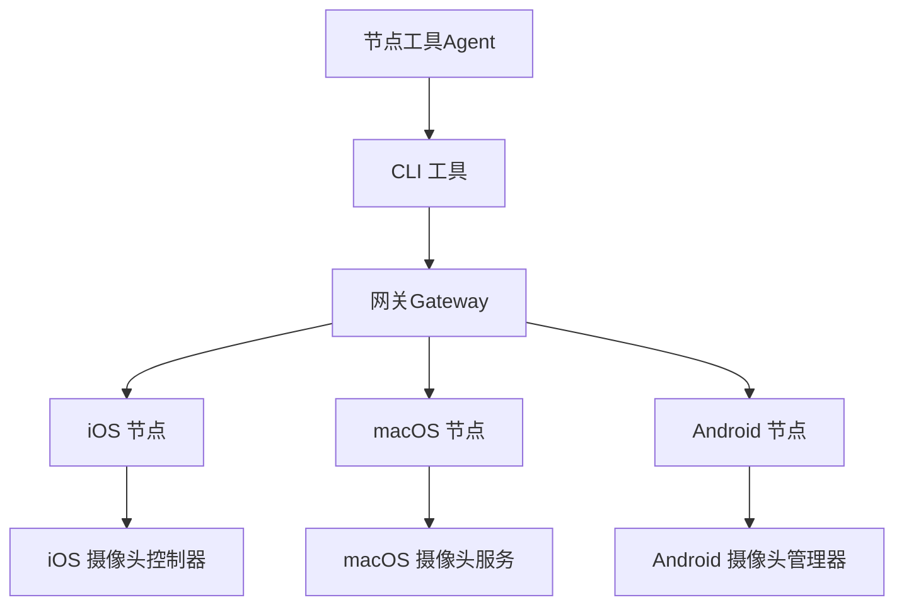
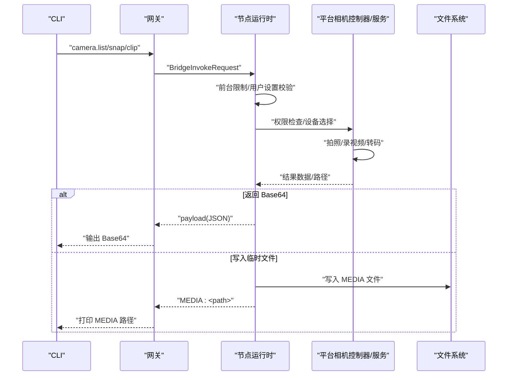
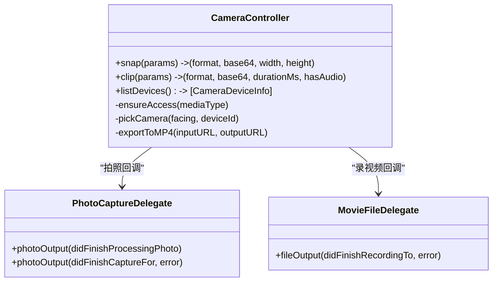
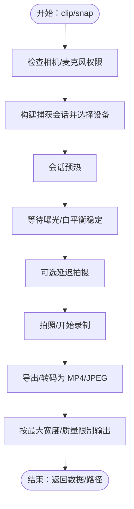
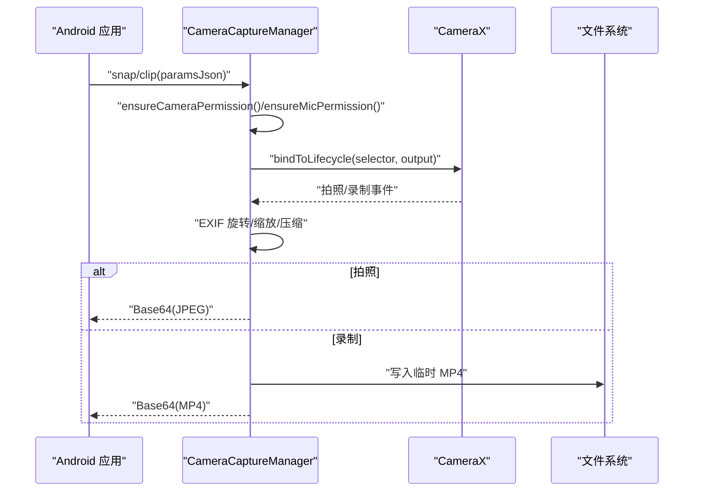
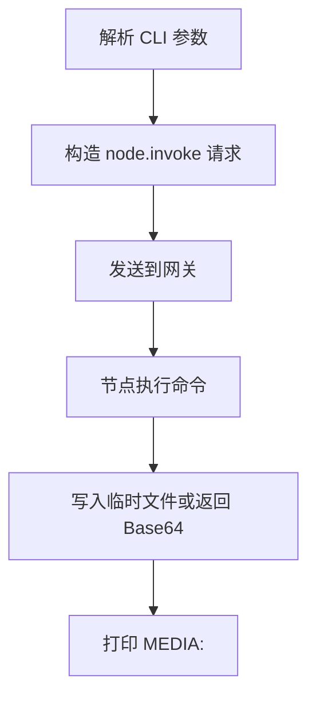
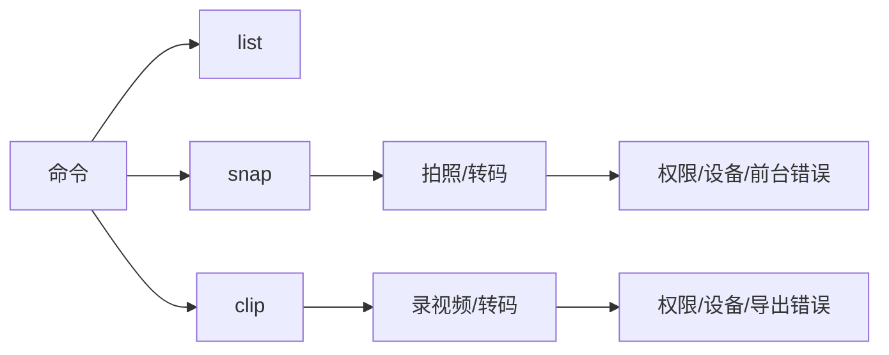

# 相机控制

<cite>
**本文引用的文件**
- [相机节点文档](file://docs/nodes/camera.md)
- [iOS 摄像头控制器](file://apps/ios/Sources/Camera/CameraController.swift)
- [iOS 节点模型](file://apps/ios/Sources/Model/NodeAppModel.swift)
- [macOS 摄像头服务](file://apps/macos/Sources/OpenClaw/CameraCaptureService.swift)
- [macOS 节点运行时](file://apps/macos/Sources/OpenClaw/NodeMode/MacNodeRuntime.swift)
- [Android 摄像头管理器](file://apps/android/app/src/main/java/ai/openclaw/android/node/CameraCaptureManager.kt)
- [Android 节点运行时](file://apps/android/app/src/main/java/ai/openclaw/android/NodeRuntime.kt)
- [CLI 相机工具](file://src/cli/nodes-camera.ts)
- [CLI 相机注册](file://src/cli/nodes-cli/register.camera.ts)
- [节点工具（Agent）](file://src/agents/tools/nodes-tool.ts)
</cite>

## 目录

1. [简介](#简介)
2. [项目结构](#项目结构)
3. [核心组件](#核心组件)
4. [架构总览](#架构总览)
5. [详细组件分析](#详细组件分析)
6. [依赖关系分析](#依赖关系分析)
7. [性能考量](#性能考量)
8. [故障排查指南](#故障排查指南)
9. [结论](#结论)
10. [附录：扩展与最佳实践](#附录扩展与最佳实践)

## 简介

本技术文档面向 OpenClaw 相机控制系统，系统性阐述以下内容：

- 相机设备的发现与枚举机制
- 设备权限管理与访问控制策略
- 相机捕获流程、图像处理管道与媒体格式转换
- 相机控制命令的实现、参数校验与错误处理
- 动态检测、热插拔支持与兼容性处理
- 相机功能扩展指南与自定义处理算法开发最佳实践

目标读者包括平台开发者、集成工程师与希望扩展相机能力的第三方开发者。

## 项目结构

OpenClaw 的相机控制由“网关层（Gateway）+ 节点侧（Node）+ CLI/工具链”三层组成：

- 网关层负责命令路由与会话管理
- 节点侧在各平台（iOS/macOS/Android）执行实际的摄像头采集与处理
- CLI/工具链提供命令行调用、参数解析与媒体落盘辅助

图表来源

- [iOS 节点模型](file://apps/ios/Sources/Model/NodeAppModel.swift#L627-L673)
- [macOS 节点运行时](file://apps/macos/Sources/OpenClaw/NodeMode/MacNodeRuntime.swift#L221-L229)
- [Android 节点运行时](file://apps/android/app/src/main/java/ai/openclaw/android/NodeRuntime.kt#L1064-L1091)

章节来源

- [相机节点文档](file://docs/nodes/camera.md#L1-L157)

## 核心组件

- iOS 摄像头控制器：负责设备选择、权限检查、拍照与录视频、EXIF 旋转、质量压缩与 MP4 转码。
- macOS 摄像头服务：负责设备发现、权限请求、拍照/录视频、曝光稳定、延迟拍摄、MP4 导出与转码。
- Android 摄像头管理器：负责权限请求、相机绑定生命周期、拍照/录视频、EXIF 旋转、尺寸缩放与 JPEG 压缩。
- CLI 相机工具：提供参数解析、临时文件路径生成与 Base64 写盘。
- 节点工具（Agent）：将相机结果写入临时文件并注入消息内容，便于后续媒体理解与工作流处理。
- 节点运行时（三端）：统一的命令入口、前台限制、用户设置开关与错误映射。

章节来源

- [iOS 摄像头控制器](file://apps/ios/Sources/Camera/CameraController.swift#L39-L110)
- [macOS 摄像头服务](file://apps/macos/Sources/OpenClaw/CameraCaptureService.swift#L51-L118)
- [Android 摄像头管理器](file://apps/android/app/src/main/java/ai/openclaw/android/node/CameraCaptureManager.kt#L75-L137)
- [CLI 相机工具](file://src/cli/nodes-camera.ts#L39-L82)
- [节点工具（Agent）](file://src/agents/tools/nodes-tool.ts#L227-L247)

## 架构总览

相机控制的端到端流程如下：

- CLI 发起 camera.list/camera.snap/camera.clip
- 网关将命令转发至对应节点
- 节点侧根据用户设置与前台状态进行前置校验
- 执行权限检查与设备选择
- 进行拍照或录视频，并按策略进行尺寸/质量控制与格式转换
- 将结果通过网关返回 CLI 或写入临时文件供 Agent 使用

图表来源

- [iOS 节点模型](file://apps/ios/Sources/Model/NodeAppModel.swift#L627-L673)
- [macOS 节点运行时](file://apps/macos/Sources/OpenClaw/NodeMode/MacNodeRuntime.swift#L221-L229)
- [Android 节点运行时](file://apps/android/app/src/main/java/ai/openclaw/android/NodeRuntime.kt#L1064-L1091)
- [CLI 相机注册](file://src/cli/nodes-cli/register.camera.ts#L116-L147)
- [节点工具（Agent）](file://src/agents/tools/nodes-tool.ts#L227-L247)

## 详细组件分析

### iOS 摄像头控制器

- 设备发现与选择：基于设备类型集合与位置筛选，默认优先内置广角相机，回退到任意默认设备。
- 权限管理：通过系统授权接口检查/请求相机与麦克风权限；拒绝或受限时抛出权限错误。
- 捕获流程：启动会话、短暂预热、等待曝光与白平衡稳定、可选延迟拍摄后触发拍照。
- 图像处理：JPEG 转码以满足最大宽度与质量约束，确保 Base64 负载不超过 5MB。
- 视频处理：录制 MOV 后转码为 MP4，控制最大时长与音频开关。
- 错误处理：统一映射为本地化错误描述，便于前端 HUD 展示与日志记录。

图表来源

- [iOS 摄像头控制器](file://apps/ios/Sources/Camera/CameraController.swift#L39-L110)
- [iOS 摄像头控制器](file://apps/ios/Sources/Camera/CameraController.swift#L223-L246)
- [iOS 摄像头控制器](file://apps/ios/Sources/Camera/CameraController.swift#L277-L312)

章节来源

- [iOS 摄像头控制器](file://apps/ios/Sources/Camera/CameraController.swift#L39-L110)
- [iOS 摄像头控制器](file://apps/ios/Sources/Camera/CameraController.swift#L202-L221)
- [iOS 摄像头控制器](file://apps/ios/Sources/Camera/CameraController.swift#L248-L264)

### macOS 摄像头服务

- 设备发现：支持内置广角、连续相机与外部设备（按系统版本），并兼容不同设备类型标识。
- 权限管理：统一检查/请求相机与麦克风授权，失败则抛出权限错误。
- 捕获流程：启动会话、短暂预热、等待曝光/白平衡稳定、可选延迟拍摄。
- 图像处理：JPEG 转码以控制最大宽度与质量，确保 Base64 不超 5MB。
- 视频处理：录制 MOV 后导出为 MP4，跨系统版本采用异步导出与状态判断。
- 错误处理：定义专用错误类型，便于上层统一映射与日志记录。

图表来源

- [macOS 摄像头服务](file://apps/macos/Sources/OpenClaw/CameraCaptureService.swift#L51-L118)
- [macOS 摄像头服务](file://apps/macos/Sources/OpenClaw/CameraCaptureService.swift#L120-L196)
- [macOS 摄像头服务](file://apps/macos/Sources/OpenClaw/CameraCaptureService.swift#L279-L314)

章节来源

- [macOS 摄像头服务](file://apps/macos/Sources/OpenClaw/CameraCaptureService.swift#L41-L49)
- [macOS 摄像头服务](file://apps/macos/Sources/OpenClaw/CameraCaptureService.swift#L198-L217)
- [macOS 摄像头服务](file://apps/macos/Sources/OpenClaw/CameraCaptureService.swift#L219-L259)

### Android 摄像头管理器

- 权限管理：运行时请求 CAMERA 与 RECORD_AUDIO 权限，缺失或被拒时抛出相应错误。
- 生命周期绑定：使用 CameraX 绑定生命周期，确保在前台可用。
- 捕获流程：拍照时读取 EXIF 方向并旋转，按最大宽度缩放，使用自研压缩器控制 Base64 不超 5MB；录视频时按配置录制并最终编码为 MP4。
- 参数解析：从 JSON 中解析 facing/quality/maxWidth/durationMs/includeAudio 等参数。
- 错误处理：对超时、失败等场景进行统一异常抛出，便于节点运行时映射。

图表来源

- [Android 摄像头管理器](file://apps/android/app/src/main/java/ai/openclaw/android/node/CameraCaptureManager.kt#L51-L73)
- [Android 摄像头管理器](file://apps/android/app/src/main/java/ai/openclaw/android/node/CameraCaptureManager.kt#L75-L137)
- [Android 摄像头管理器](file://apps/android/app/src/main/java/ai/openclaw/android/node/CameraCaptureManager.kt#L139-L198)

章节来源

- [Android 摄像头管理器](file://apps/android/app/src/main/java/ai/openclaw/android/node/CameraCaptureManager.kt#L51-L73)
- [Android 摄像头管理器](file://apps/android/app/src/main/java/ai/openclaw/android/node/CameraCaptureManager.kt#L225-L265)

### CLI 与节点工具

- CLI 注册：解析 camera.list/snap/clip 子命令，构造 invoke 请求并设置超时与幂等键。
- 参数解析：对 facing/quality/maxWidth/delayMs/deviceId/durationMs/includeAudio 等进行类型与范围校验。
- 临时文件：生成唯一文件名，将 Base64 写入临时目录，输出 MEDIA:<path> 供 Agent 使用。
- Agent 工具：将相机结果写入临时文件并注入消息内容，便于下游媒体理解与工作流处理。

图表来源

- [CLI 相机注册](file://src/cli/nodes-cli/register.camera.ts#L116-L147)
- [CLI 相机注册](file://src/cli/nodes-cli/register.camera.ts#L64-L86)
- [CLI 相机工具](file://src/cli/nodes-camera.ts#L39-L82)
- [节点工具（Agent）](file://src/agents/tools/nodes-tool.ts#L227-L247)

章节来源

- [CLI 相机注册](file://src/cli/nodes-cli/register.camera.ts#L116-L147)
- [CLI 相机工具](file://src/cli/nodes-camera.ts#L39-L82)
- [节点工具（Agent）](file://src/agents/tools/nodes-tool.ts#L227-L247)

## 依赖关系分析

- 平台依赖
  - iOS/macOS：AVFoundation 捕获与导出、AVAssetExportSession 转码
  - Android：CameraX 框架（ImageCapture/VideoCapture）、ExifInterface
- 命令与参数
  - camera.list：返回设备列表（id/name/position/deviceType）
  - camera.snap：支持 facing/quality/maxWidth/delayMs/deviceId/format
  - camera.clip：支持 facing/durationMs/includeAudio/deviceId/format
- 错误映射
  - 前台限制：NODE_BACKGROUND_UNAVAILABLE
  - 用户关闭：CAMERA_DISABLED
  - 权限缺失：CAMERA_PERMISSION_REQUIRED / MIC_PERMISSION_REQUIRED
  - 设备不可用：CAMERA_UNAVAILABLE / MICROPHONE_UNAVAILABLE
  - 导出失败：EXPORT_FAILED / CAPTURE_FAILED

图表来源

- [相机节点文档](file://docs/nodes/camera.md#L27-L59)
- [iOS 节点模型](file://apps/ios/Sources/Model/NodeAppModel.swift#L630-L646)
- [Android 节点运行时](file://apps/android/app/src/main/java/ai/openclaw/android/NodeRuntime.kt#L1081-L1091)

章节来源

- [相机节点文档](file://docs/nodes/camera.md#L27-L59)
- [iOS 节点模型](file://apps/ios/Sources/Model/NodeAppModel.swift#L630-L646)
- [Android 节点运行时](file://apps/android/app/src/main/java/ai/openclaw/android/NodeRuntime.kt#L1081-L1091)

## 性能考量

- Base64 负载控制：三端均对输出进行 5MB 上限控制，避免网关传输压力。
- 拍照质量与尺寸：默认最大宽度与质量在保证体验的同时兼顾负载；可通过参数显式调整。
- 曝光与白平衡稳定：iOS/macOS 在会话启动后等待稳定，减少首帧异常。
- 转码策略：iOS/macOS 使用中等质量预设，Android 使用自研压缩器，兼顾体积与速度。
- 生命周期与资源释放：Android 使用 CameraX 生命周期绑定，录制完成后及时删除临时文件。

章节来源

- [iOS 摄像头控制器](file://apps/ios/Sources/Camera/CameraController.swift#L96-L110)
- [macOS 摄像头服务](file://apps/macos/Sources/OpenClaw/CameraCaptureService.swift#L109-L117)
- [Android 摄像头管理器](file://apps/android/app/src/main/java/ai/openclaw/android/node/CameraCaptureManager.kt#L106-L136)

## 故障排查指南

- 前台限制
  - 现象：调用返回 NODE_BACKGROUND_UNAVAILABLE
  - 处理：确保应用处于前台再发起 camera.\* 命令
- 用户设置关闭
  - 现象：返回 CAMERA_DISABLED
  - 处理：在系统设置中开启相机权限
- 权限缺失（Android）
  - 现象：返回 CAMERA_PERMISSION_REQUIRED 或 MIC_PERMISSION_REQUIRED
  - 处理：在运行时请求 CAMERA/RECORD_AUDIO 权限
- 设备不可用
  - 现象：返回 CAMERA_UNAVAILABLE 或 MICROPHONE_UNAVAILABLE
  - 处理：检查设备是否被占用或物理禁用
- 导出/捕获失败
  - 现象：返回 EXPORT_FAILED 或 CAPTURE_FAILED
  - 处理：重试、检查存储空间、确认转码器可用
- 参数非法（CLI）
  - 现象：CLI 报错 invalid facing 等
  - 处理：修正参数值（facing 仅允许 front/back）

章节来源

- [相机节点文档](file://docs/nodes/camera.md#L60-L101)
- [iOS 节点模型](file://apps/ios/Sources/Model/NodeAppModel.swift#L630-L646)
- [Android 节点运行时](file://apps/android/app/src/main/java/ai/openclaw/android/NodeRuntime.kt#L1081-L1091)
- [CLI 相机注册](file://src/cli/nodes-cli/register.camera.ts#L64-L86)

## 结论

OpenClaw 的相机控制系统在多平台上实现了统一的命令语义与一致的用户体验：通过严格的权限与前台限制保障安全，通过设备发现与参数控制提升灵活性，并通过负载控制与转码策略确保传输效率。CLI 与 Agent 工具进一步降低了集成门槛，便于在自动化与智能体场景中快速落地。

## 附录：扩展与最佳实践

- 设备发现与热插拔
  - iOS/macOS：通过设备类型集合与默认设备回退策略适配多种设备形态；建议在 camera.list 中缓存设备信息并在设备变更时重新枚举。
  - Android：CameraX 提供生命周期绑定，建议在设备切换时解绑旧会话并重新绑定新设备。
- 参数验证与健壮性
  - 对于 CLI 与节点侧参数，建议增加边界检查（如 maxWidth/durationMs/quality）与默认值策略，避免异常输入导致失败。
- 媒体格式与转码
  - 默认使用 JPEG/MP4；如需其他格式，可在节点侧扩展转码器并注意负载上限。
- 自定义处理算法
  - 可在节点侧引入图像增强、裁剪、水印等算法，但需控制输出尺寸与质量，确保不突破 5MB 限制。
- 安全与合规
  - 严格遵循平台权限模型，明确提示用户授权；在日志中避免泄露敏感元数据。

章节来源

- [iOS 摄像头控制器](file://apps/ios/Sources/Camera/CameraController.swift#L248-L264)
- [macOS 摄像头服务](file://apps/macos/Sources/OpenClaw/CameraCaptureService.swift#L219-L232)
- [Android 摄像头管理器](file://apps/android/app/src/main/java/ai/openclaw/android/node/CameraCaptureManager.kt#L83-L89)
