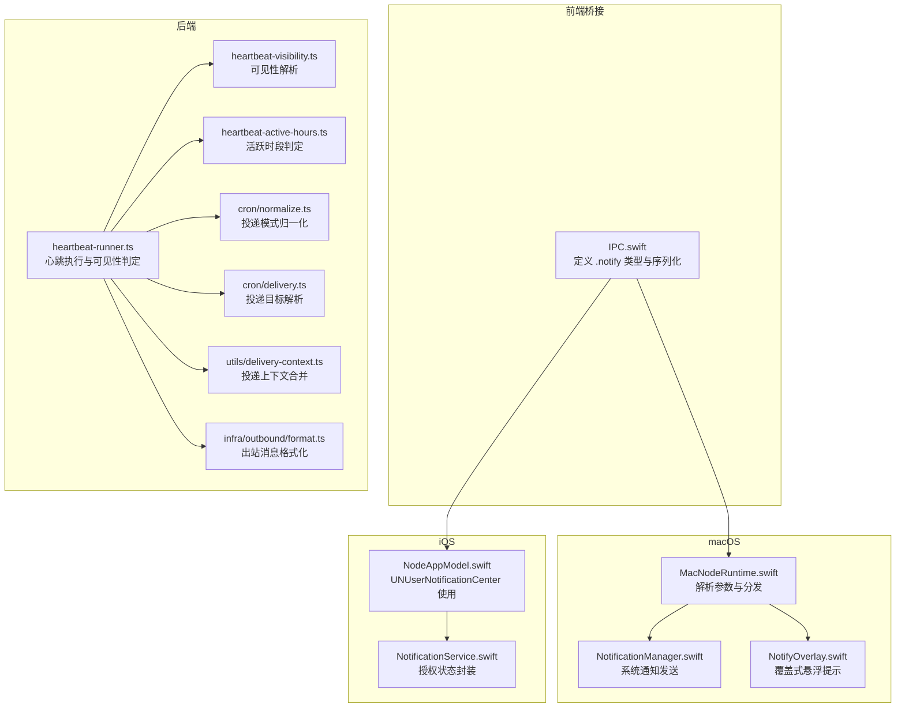
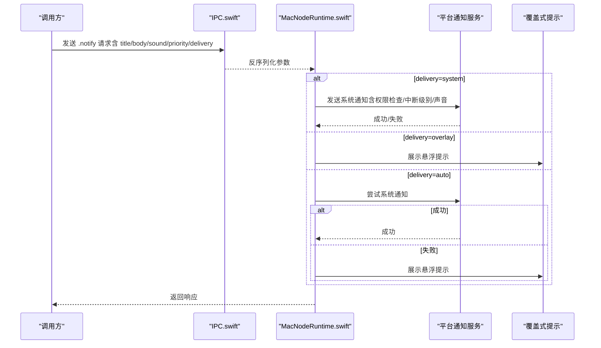
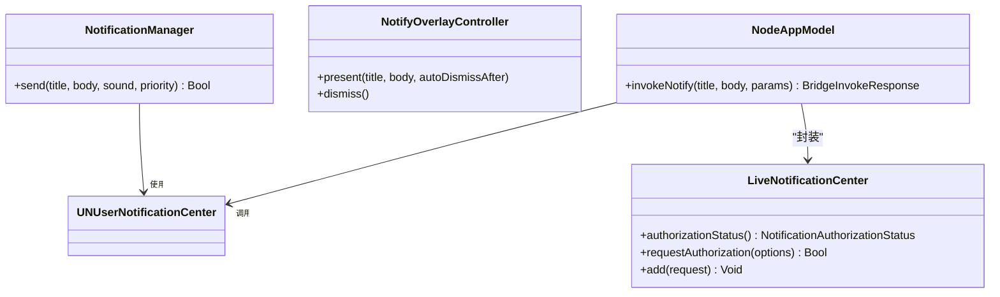
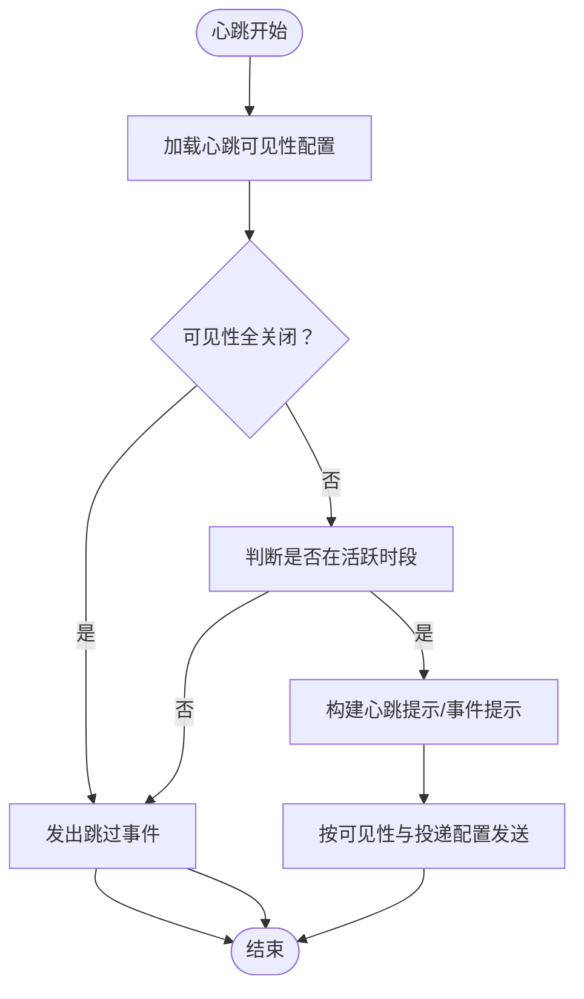
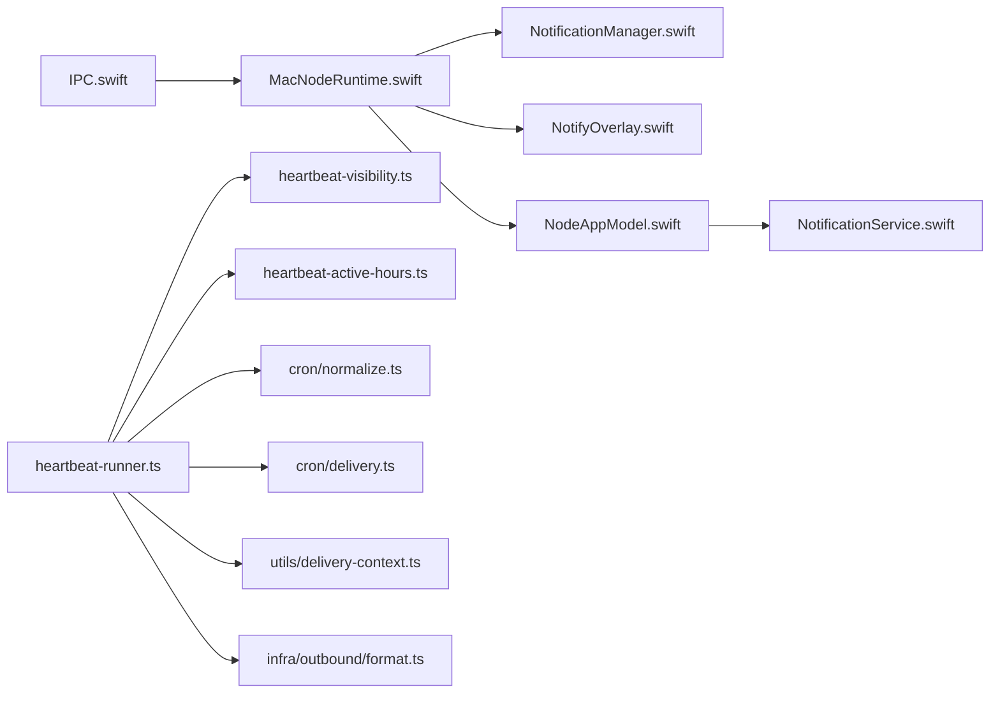

# 系统通知

<cite>
**本文引用的文件**
- [apps/macos/Sources/OpenClaw/NotificationManager.swift](file://apps/macos/Sources/OpenClaw/NotificationManager.swift)
- [apps/macos/Sources/OpenClaw/NotifyOverlay.swift](file://apps/macos/Sources/OpenClaw/NotifyOverlay.swift)
- [apps/macos/Sources/OpenClaw/NodeMode/MacNodeRuntime.swift](file://apps/macos/Sources/OpenClaw/NodeMode/MacNodeRuntime.swift)
- [apps/macos/Sources/OpenClawIPC/IPC.swift](file://apps/macos/Sources/OpenClawIPC/IPC.swift)
- [apps/ios/Sources/Services/NotificationService.swift](file://apps/ios/Sources/Services/NotificationService.swift)
- [apps/ios/Sources/Model/NodeAppModel.swift](file://apps/ios/Sources/Model/NodeAppModel.swift)
- [src/infra/heartbeat-visibility.ts](file://src/infra/heartbeat-visibility.ts)
- [src/infra/heartbeat-visibility.test.ts](file://src/infra/heartbeat-visibility.test.ts)
- [src/infra/heartbeat-runner.ts](file://src/infra/heartbeat-runner.ts)
- [src/infra/heartbeat-active-hours.ts](file://src/infra/heartbeat-active-hours.ts)
- [src/cron/delivery.ts](file://src/cron/delivery.ts)
- [src/cron/normalize.ts](file://src/cron/normalize.ts)
- [src/utils/delivery-context.ts](file://src/utils/delivery-context.ts)
- [src/infra/outbound/format.ts](file://src/infra/outbound/format.ts)
</cite>

## 目录

1. [简介](#简介)
2. [项目结构](#项目结构)
3. [核心组件](#核心组件)
4. [架构总览](#架构总览)
5. [组件详解](#组件详解)
6. [依赖关系分析](#依赖关系分析)
7. [性能考量](#性能考量)
8. [故障排查指南](#故障排查指南)
9. [结论](#结论)
10. [附录](#附录)

## 简介

本技术文档围绕 OpenClaw 系统的通知功能展开，系统性阐述通知的发送机制、通知类型与显示策略、内容构建流程、权限与偏好、渠道配置、事件监听与心跳可见性控制、以及扩展与自定义通知类型的开发方案。文档同时提供可视化图示帮助理解跨平台（macOS/iOS）与后端（Node/Gateway）之间的交互。

## 项目结构

通知能力在多平台与多层之间协作：

- 前端桥接层：通过 IPC 定义统一的“通知”调用类型，并在不同平台解析参数。
- 平台适配层：macOS 使用系统通知中心与覆盖式悬浮提示；iOS 使用 UNUserNotificationCenter。
- 后端运行时：Node 模式下由运行时负责解析参数并调用平台通知服务。
- 心跳与可见性：心跳运行器根据可见性配置决定是否展示通知或仅发出指示事件。

**图表来源**

- [apps/macos/Sources/OpenClawIPC/IPC.swift](file://apps/macos/Sources/OpenClawIPC/IPC.swift#L180-L379)
- [apps/macos/Sources/OpenClaw/NodeMode/MacNodeRuntime.swift](file://apps/macos/Sources/OpenClaw/NodeMode/MacNodeRuntime.swift#L809-L845)
- [apps/macos/Sources/OpenClaw/NotificationManager.swift](file://apps/macos/Sources/OpenClaw/NotificationManager.swift#L1-L67)
- [apps/macos/Sources/OpenClaw/NotifyOverlay.swift](file://apps/macos/Sources/OpenClaw/NotifyOverlay.swift#L1-L191)
- [apps/ios/Sources/Model/NodeAppModel.swift](file://apps/ios/Sources/Model/NodeAppModel.swift#L996-L1098)
- [apps/ios/Sources/Services/NotificationService.swift](file://apps/ios/Sources/Services/NotificationService.swift#L1-L59)
- [src/infra/heartbeat-visibility.ts](file://src/infra/heartbeat-visibility.ts#L1-L73)
- [src/infra/heartbeat-runner.ts](file://src/infra/heartbeat-runner.ts#L539-L569)
- [src/infra/heartbeat-active-hours.ts](file://src/infra/heartbeat-active-hours.ts#L45-L99)
- [src/cron/normalize.ts](file://src/cron/normalize.ts#L135-L179)
- [src/cron/delivery.ts](file://src/cron/delivery.ts#L45-L77)
- [src/utils/delivery-context.ts](file://src/utils/delivery-context.ts#L98-L140)
- [src/infra/outbound/format.ts](file://src/infra/outbound/format.ts#L52-L85)

**章节来源**

- [apps/macos/Sources/OpenClawIPC/IPC.swift](file://apps/macos/Sources/OpenClawIPC/IPC.swift#L180-L379)
- [apps/macos/Sources/OpenClaw/NodeMode/MacNodeRuntime.swift](file://apps/macos/Sources/OpenClaw/NodeMode/MacNodeRuntime.swift#L809-L845)
- [apps/macos/Sources/OpenClaw/NotificationManager.swift](file://apps/macos/Sources/OpenClaw/NotificationManager.swift#L1-L67)
- [apps/macos/Sources/OpenClaw/NotifyOverlay.swift](file://apps/macos/Sources/OpenClaw/NotifyOverlay.swift#L1-L191)
- [apps/ios/Sources/Services/NotificationService.swift](file://apps/ios/Sources/Services/NotificationService.swift#L1-L59)
- [apps/ios/Sources/Model/NodeAppModel.swift](file://apps/ios/Sources/Model/NodeAppModel.swift#L996-L1098)
- [src/infra/heartbeat-visibility.ts](file://src/infra/heartbeat-visibility.ts#L1-L73)
- [src/infra/heartbeat-runner.ts](file://src/infra/heartbeat-runner.ts#L539-L569)
- [src/infra/heartbeat-active-hours.ts](file://src/infra/heartbeat-active-hours.ts#L45-L99)
- [src/cron/delivery.ts](file://src/cron/delivery.ts#L45-L77)
- [src/cron/normalize.ts](file://src/cron/normalize.ts#L135-L179)
- [src/utils/delivery-context.ts](file://src/utils/delivery-context.ts#L98-L140)
- [src/infra/outbound/format.ts](file://src/infra/outbound/format.ts#L52-L85)

## 核心组件

- IPC 通知类型与参数
  - 统一的 .notify 类型，包含标题、正文、声音、优先级与投递方式等字段。
  - 在 macOS/iOS 两端均以该类型进行序列化/反序列化。
- macOS 通知管理
  - 系统通知：使用 UNUserNotificationCenter，自动处理授权状态、请求授权、设置中断级别与声音。
  - 覆盖式悬浮提示：无须系统授权，直接在应用窗口层展示，适合静默提醒或无系统通知权限场景。
- iOS 通知管理
  - 封装 UNUserNotificationCenter 的授权状态查询、授权请求与消息添加。
  - 支持基于优先级设置中断级别（passive/timeSensitive/active），并按配置禁音。
- 心跳可见性与投递
  - 可见性解析：支持全局默认、通道级、账户级三层配置，决定是否显示“OK”、是否显示内容、是否发出指示事件。
  - 心跳执行：根据可见性与活跃时段判定，决定是否跳过或生成通知。
  - 投递目标解析：兼容新旧模式，归一化投递模式、通道与接收人。

**章节来源**

- [apps/macos/Sources/OpenClawIPC/IPC.swift](file://apps/macos/Sources/OpenClawIPC/IPC.swift#L180-L379)
- [apps/macos/Sources/OpenClaw/NotificationManager.swift](file://apps/macos/Sources/OpenClaw/NotificationManager.swift#L1-L67)
- [apps/macos/Sources/OpenClaw/NotifyOverlay.swift](file://apps/macos/Sources/OpenClaw/NotifyOverlay.swift#L1-L191)
- [apps/ios/Sources/Services/NotificationService.swift](file://apps/ios/Sources/Services/NotificationService.swift#L1-L59)
- [apps/ios/Sources/Model/NodeAppModel.swift](file://apps/ios/Sources/Model/NodeAppModel.swift#L996-L1098)
- [src/infra/heartbeat-visibility.ts](file://src/infra/heartbeat-visibility.ts#L1-L73)
- [src/infra/heartbeat-runner.ts](file://src/infra/heartbeat-runner.ts#L539-L569)
- [src/infra/heartbeat-active-hours.ts](file://src/infra/heartbeat-active-hours.ts#L45-L99)
- [src/cron/delivery.ts](file://src/cron/delivery.ts#L45-L77)
- [src/cron/normalize.ts](file://src/cron/normalize.ts#L135-L179)
- [src/utils/delivery-context.ts](file://src/utils/delivery-context.ts#L98-L140)
- [src/infra/outbound/format.ts](file://src/infra/outbound/format.ts#L52-L85)

## 架构总览

通知从 IPC 层进入，经 Node 运行时解析，再路由到平台通知服务或覆盖式提示；心跳运行器根据可见性与活跃时段控制是否触发通知。

**图表来源**

- [apps/macos/Sources/OpenClawIPC/IPC.swift](file://apps/macos/Sources/OpenClawIPC/IPC.swift#L180-L379)
- [apps/macos/Sources/OpenClaw/NodeMode/MacNodeRuntime.swift](file://apps/macos/Sources/OpenClaw/NodeMode/MacNodeRuntime.swift#L809-L845)
- [apps/macos/Sources/OpenClaw/NotificationManager.swift](file://apps/macos/Sources/OpenClaw/NotificationManager.swift#L1-L67)
- [apps/macos/Sources/OpenClaw/NotifyOverlay.swift](file://apps/macos/Sources/OpenClaw/NotifyOverlay.swift#L1-L191)

## 组件详解

### 通知发送与显示策略

- macOS
  - 系统通知：自动检测授权状态，必要时请求授权；根据优先级设置中断级别；可指定系统声音或静音。
  - 覆盖式提示：无需系统授权，直接在屏幕右上角展示，支持自动消失与点击关闭。
- iOS
  - 使用 UNUserNotificationCenter，支持 passiveness、timeSensitive、active 中断级别；支持禁音配置。
  - 首次调用前会请求授权，授权状态通过封装接口返回。

**图表来源**

- [apps/macos/Sources/OpenClaw/NotificationManager.swift](file://apps/macos/Sources/OpenClaw/NotificationManager.swift#L1-L67)
- [apps/macos/Sources/OpenClaw/NotifyOverlay.swift](file://apps/macos/Sources/OpenClaw/NotifyOverlay.swift#L1-L191)
- [apps/ios/Sources/Services/NotificationService.swift](file://apps/ios/Sources/Services/NotificationService.swift#L1-L59)
- [apps/ios/Sources/Model/NodeAppModel.swift](file://apps/ios/Sources/Model/NodeAppModel.swift#L996-L1098)

**章节来源**

- [apps/macos/Sources/OpenClaw/NotificationManager.swift](file://apps/macos/Sources/OpenClaw/NotificationManager.swift#L1-L67)
- [apps/macos/Sources/OpenClaw/NotifyOverlay.swift](file://apps/macos/Sources/OpenClaw/NotifyOverlay.swift#L1-L191)
- [apps/ios/Sources/Services/NotificationService.swift](file://apps/ios/Sources/Services/NotificationService.swift#L1-L59)
- [apps/ios/Sources/Model/NodeAppModel.swift](file://apps/ios/Sources/Model/NodeAppModel.swift#L996-L1098)

### 通知内容构建与样式定制

- 内容构建
  - 标题与正文来自调用参数；声音名称可选；优先级可选（passive/active/timeSensitive）。
  - iOS 支持将“禁音”字符串映射为空声音；macOS 支持传入系统声音名。
- 样式定制
  - macOS：覆盖式提示采用圆角背景、半透明材质与阴影，标题与正文字体大小与行数限制可控。
  - iOS：中断级别影响通知打断行为；声音默认使用系统默认音效。

**章节来源**

- [apps/macos/Sources/OpenClawIPC/IPC.swift](file://apps/macos/Sources/OpenClawIPC/IPC.swift#L180-L379)
- [apps/macos/Sources/OpenClaw/NotifyOverlay.swift](file://apps/macos/Sources/OpenClaw/NotifyOverlay.swift#L163-L190)
- [apps/ios/Sources/Model/NodeAppModel.swift](file://apps/ios/Sources/Model/NodeAppModel.swift#L996-L1029)

### 权限管理与用户偏好

- 授权流程
  - macOS：若未授权则请求授权；若拒绝则返回失败。
  - iOS：封装授权状态查询与请求授权；首次调用会触发系统授权弹窗。
- 用户偏好
  - iOS：支持禁音（空声音）、时间敏感通知（需 entitlement）。
  - macOS：支持禁音与时间敏感通知（需 entitlement）；无 entitlement 时降级为 active。

**章节来源**

- [apps/macos/Sources/OpenClaw/NotificationManager.swift](file://apps/macos/Sources/OpenClaw/NotificationManager.swift#L17-L67)
- [apps/ios/Sources/Services/NotificationService.swift](file://apps/ios/Sources/Services/NotificationService.swift#L18-L58)
- [apps/ios/Sources/Model/NodeAppModel.swift](file://apps/ios/Sources/Model/NodeAppModel.swift#L1076-L1098)

### 心跳事件监听与可见性控制

- 可见性解析
  - 支持三层次配置：通道默认、通道级、账户级；默认值为“静默心跳、显示内容、发出指示事件”。
- 心跳执行
  - 若可见性全部关闭，则发出“跳过”事件并终止通知发送。
  - 支持活跃时段控制，不在活跃时段的心跳会被跳过。
- 投递目标与模式
  - 归一化投递模式（announce/off/auto），解析通道与接收人，兼容历史 deliver 字段。

**图表来源**

- [src/infra/heartbeat-visibility.ts](file://src/infra/heartbeat-visibility.ts#L1-L73)
- [src/infra/heartbeat-runner.ts](file://src/infra/heartbeat-runner.ts#L539-L569)
- [src/infra/heartbeat-active-hours.ts](file://src/infra/heartbeat-active-hours.ts#L45-L99)
- [src/cron/normalize.ts](file://src/cron/normalize.ts#L135-L179)
- [src/cron/delivery.ts](file://src/cron/delivery.ts#L45-L77)

**章节来源**

- [src/infra/heartbeat-visibility.ts](file://src/infra/heartbeat-visibility.ts#L1-L73)
- [src/infra/heartbeat-runner.ts](file://src/infra/heartbeat-runner.ts#L539-L569)
- [src/infra/heartbeat-active-hours.ts](file://src/infra/heartbeat-active-hours.ts#L45-L99)
- [src/cron/normalize.ts](file://src/cron/normalize.ts#L135-L179)
- [src/cron/delivery.ts](file://src/cron/delivery.ts#L45-L77)

### 出站消息与通知关联

- 出站消息格式化包含通道、接收人、消息 ID、媒体 URL 等信息，便于在通知中回溯消息来源。
- 通知与心跳/投递目标解析配合，确保通知与实际发送结果一致。

**章节来源**

- [src/infra/outbound/format.ts](file://src/infra/outbound/format.ts#L52-L85)
- [src/utils/delivery-context.ts](file://src/utils/delivery-context.ts#L98-L140)

## 依赖关系分析

- IPC 与 Node 运行时
  - IPC 定义统一的 .notify 类型，Node 运行时负责解码参数并分发到系统通知或覆盖式提示。
- 平台通知服务
  - macOS：NotificationManager 直接使用 UNUserNotificationCenter；NotifyOverlayController 提供覆盖式提示。
  - iOS：LiveNotificationCenter 封装授权与添加通知；NodeAppModel 调用并处理错误。
- 心跳与投递
  - heartbeat-visibility.ts 与 heartbeat-runner.ts 协作，依据可见性与活跃时段控制通知行为。
  - cron/normalize.ts 与 cron/delivery.ts 解析投递模式与目标，保证一致性。

**图表来源**

- [apps/macos/Sources/OpenClawIPC/IPC.swift](file://apps/macos/Sources/OpenClawIPC/IPC.swift#L180-L379)
- [apps/macos/Sources/OpenClaw/NodeMode/MacNodeRuntime.swift](file://apps/macos/Sources/OpenClaw/NodeMode/MacNodeRuntime.swift#L809-L845)
- [apps/macos/Sources/OpenClaw/NotificationManager.swift](file://apps/macos/Sources/OpenClaw/NotificationManager.swift#L1-L67)
- [apps/macos/Sources/OpenClaw/NotifyOverlay.swift](file://apps/macos/Sources/OpenClaw/NotifyOverlay.swift#L1-L191)
- [apps/ios/Sources/Model/NodeAppModel.swift](file://apps/ios/Sources/Model/NodeAppModel.swift#L996-L1098)
- [apps/ios/Sources/Services/NotificationService.swift](file://apps/ios/Sources/Services/NotificationService.swift#L1-L59)
- [src/infra/heartbeat-visibility.ts](file://src/infra/heartbeat-visibility.ts#L1-L73)
- [src/infra/heartbeat-runner.ts](file://src/infra/heartbeat-runner.ts#L539-L569)
- [src/infra/heartbeat-active-hours.ts](file://src/infra/heartbeat-active-hours.ts#L45-L99)
- [src/cron/normalize.ts](file://src/cron/normalize.ts#L135-L179)
- [src/cron/delivery.ts](file://src/cron/delivery.ts#L45-L77)
- [src/utils/delivery-context.ts](file://src/utils/delivery-context.ts#L98-L140)
- [src/infra/outbound/format.ts](file://src/infra/outbound/format.ts#L52-L85)

**章节来源**

- 同上

## 性能考量

- 缓冲与丢弃
  - WebSocket 广播层对慢消费者进行缓冲区阈值检查，必要时关闭连接或丢弃事件帧，避免阻塞。
- 通知发送
  - macOS/iOS 在授权状态异常或系统繁忙时可能失败，应做好重试与降级策略（如 overlay 提示）。
- 心跳节流
  - 可见性与活跃时段控制可减少无效通知与 API 调用，提升整体效率。

**章节来源**

- [src/gateway/server-broadcast.ts](file://src/gateway/server-broadcast.ts#L37-L93)
- [apps/macos/Sources/OpenClaw/NotificationManager.swift](file://apps/macos/Sources/OpenClaw/NotificationManager.swift#L17-L67)
- [apps/ios/Sources/Model/NodeAppModel.swift](file://apps/ios/Sources/Model/NodeAppModel.swift#L996-L1098)

## 故障排查指南

- 授权失败
  - macOS：若授权被拒，系统通知发送会失败；检查系统设置中的通知权限。
  - iOS：首次调用会触发授权弹窗；若用户拒绝，后续发送会失败。
- 时间敏感通知不可用
  - macOS：需要特定 entitlement 才能使用 timeSensitive；否则自动降级为 active。
- 通知未显示
  - 检查心跳可见性配置是否全部关闭；确认活跃时段是否允许。
  - 检查投递目标解析是否正确（通道、接收人、模式）。
- 出站消息无法关联
  - 对照出站消息格式化输出，核对通道、接收人与消息 ID 是否匹配。

**章节来源**

- [apps/macos/Sources/OpenClaw/NotificationManager.swift](file://apps/macos/Sources/OpenClaw/NotificationManager.swift#L17-L67)
- [apps/ios/Sources/Services/NotificationService.swift](file://apps/ios/Sources/Services/NotificationService.swift#L18-L58)
- [src/infra/heartbeat-visibility.ts](file://src/infra/heartbeat-visibility.ts#L1-L73)
- [src/infra/heartbeat-active-hours.ts](file://src/infra/heartbeat-active-hours.ts#L45-L99)
- [src/cron/delivery.ts](file://src/cron/delivery.ts#L45-L77)
- [src/infra/outbound/format.ts](file://src/infra/outbound/format.ts#L52-L85)

## 结论

OpenClaw 的通知体系在多平台间保持一致的 IPC 接口与参数模型，同时针对平台特性提供系统通知与覆盖式提示两种显示策略。心跳可见性与活跃时段控制有效避免了噪声与资源浪费。通过清晰的投递目标解析与出站消息格式化，通知与实际发送结果形成闭环。建议在生产环境中结合可见性配置与活跃时段策略，合理选择投递方式与声音策略，以获得最佳用户体验。

## 附录

### 通知类型与参数定义（摘要）

- 类型：.notify
- 参数：title、body、sound（可选）、priority（可选，passive/active/timeSensitive）、delivery（可选，system/overlay/auto）

**章节来源**

- [apps/macos/Sources/OpenClawIPC/IPC.swift](file://apps/macos/Sources/OpenClawIPC/IPC.swift#L180-L379)

### 可见性配置层级（摘要）

- 默认值：静默心跳、显示内容、发出指示事件
- 层级：通道默认 → 通道级 → 账户级（账户级优先）

**章节来源**

- [src/infra/heartbeat-visibility.ts](file://src/infra/heartbeat-visibility.ts#L1-L73)
- [src/infra/heartbeat-visibility.test.ts](file://src/infra/heartbeat-visibility.test.ts#L1-L304)

### 投递模式与目标解析（摘要）

- 模式：announce/off/auto
- 目标：通道与接收人，兼容历史 deliver 字段

**章节来源**

- [src/cron/normalize.ts](file://src/cron/normalize.ts#L135-L179)
- [src/cron/delivery.ts](file://src/cron/delivery.ts#L45-L77)
