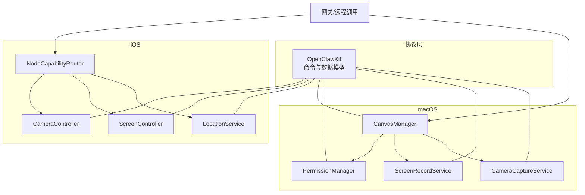
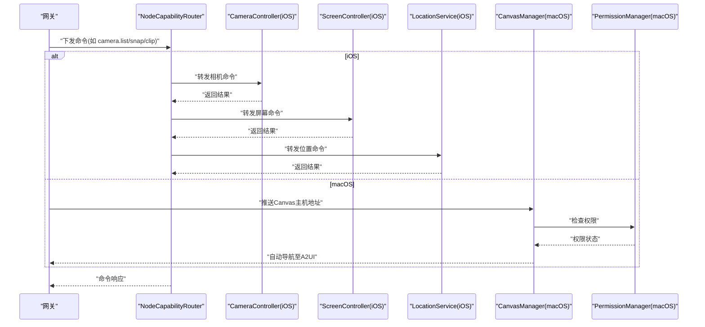
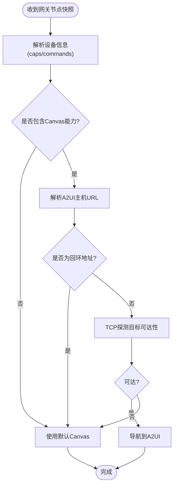
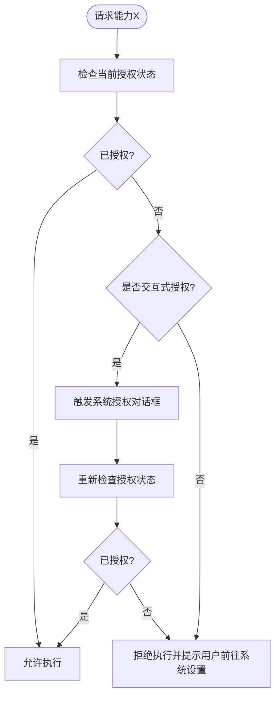
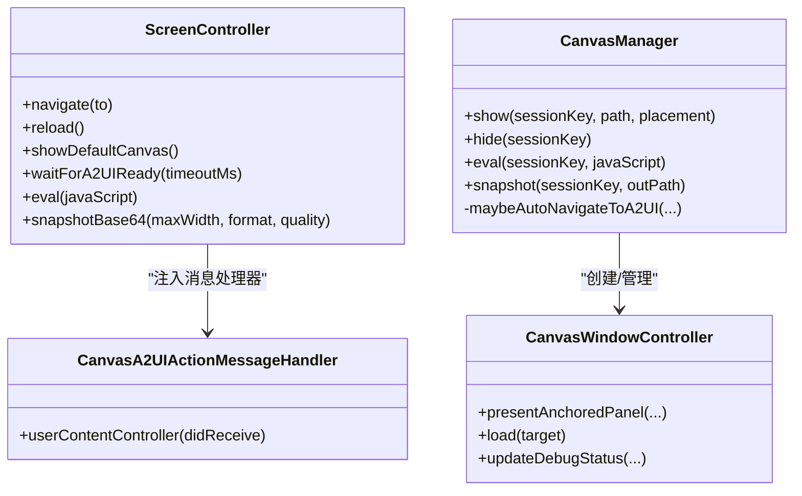
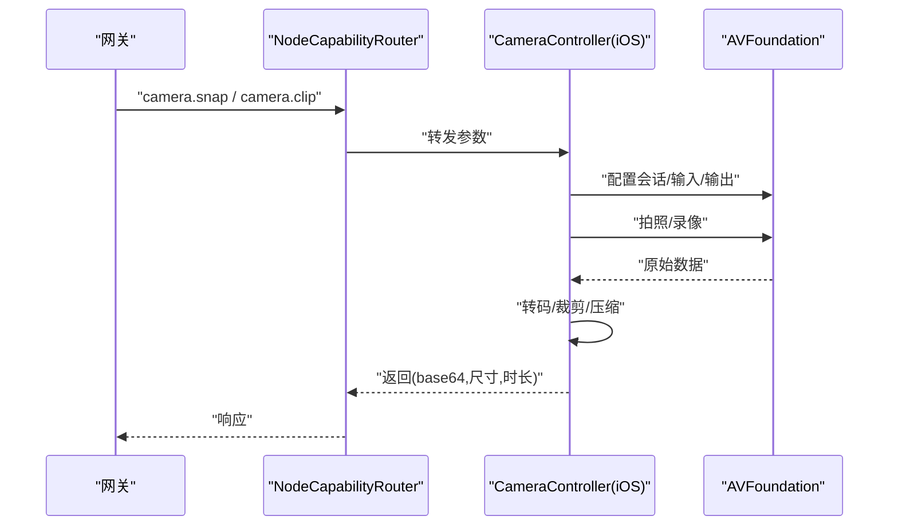
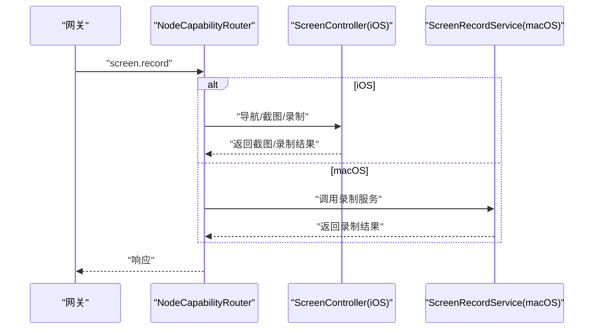
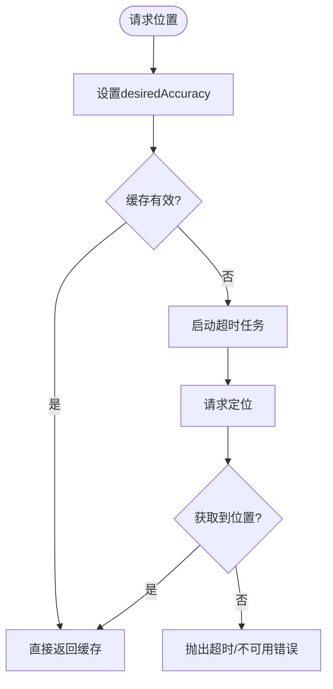
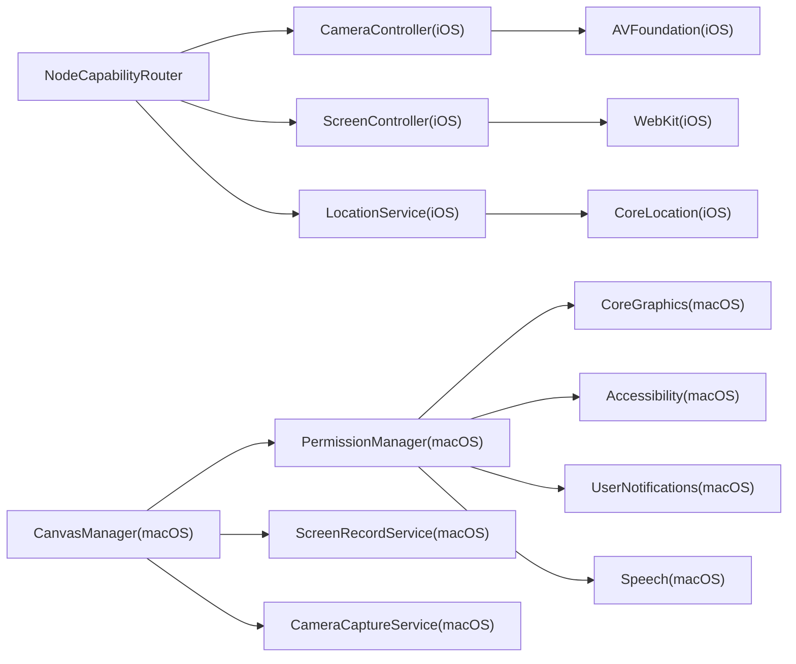

# 设备能力

<cite>
**本文引用的文件**
- [apps/ios/Sources/Capabilities/NodeCapabilityRouter.swift](file://apps/ios/Sources/Capabilities/NodeCapabilityRouter.swift)
- [apps/ios/Sources/Model/NodeAppModel+Canvas.swift](file://apps/ios/Sources/Model/NodeAppModel+Canvas.swift)
- [apps/ios/Sources/Screen/ScreenController.swift](file://apps/ios/Sources/Screen/ScreenController.swift)
- [apps/ios/Sources/Camera/CameraController.swift](file://apps/ios/Sources/Camera/CameraController.swift)
- [apps/ios/Sources/Location/LocationService.swift](file://apps/ios/Sources/Location/LocationService.swift)
- [apps/macos/Sources/OpenClaw/CanvasManager.swift](file://apps/macos/Sources/OpenClaw/CanvasManager.swift)
- [apps/macos/Sources/OpenClaw/PermissionManager.swift](file://apps/macos/Sources/OpenClaw/PermissionManager.swift)
- [apps/shared/OpenClawKit/Sources/OpenClawKit/CanvasA2UICommands.swift](file://apps/shared/OpenClawKit/Sources/OpenClawKit/CanvasA2UICommands.swift)
- [apps/shared/OpenClawKit/Sources/OpenClawKit/CameraCommands.swift](file://apps/shared/OpenClawKit/Sources/OpenClawKit/CameraCommands.swift)
- [apps/shared/OpenClawKit/Sources/OpenClawKit/ScreenCommands.swift](file://apps/shared/OpenClawKit/Sources/OpenClawKit/ScreenCommands.swift)
- [apps/shared/OpenClawKit/Sources/OpenClawKit/DeviceCommands.swift](file://apps/shared/OpenClawKit/Sources/OpenClawKit/DeviceCommands.swift)
- [apps/shared/OpenClawKit/Sources/OpenClawKit/LocationSettings.swift](file://apps/shared/OpenClawKit/Sources/OpenClawKit/LocationSettings.swift)
- [apps/macos/Sources/OpenClaw/CanvasWindowController.swift](file://apps/macos/Sources/OpenClaw/CanvasWindowController.swift)
- [apps/macos/Sources/OpenClaw/CanvasSchemeHandler.swift](file://apps/macos/Sources/OpenClaw/CanvasSchemeHandler.swift)
- [apps/macos/Sources/OpenClaw/CanvasScheme.swift](file://apps/macos/Sources/OpenClaw/CanvasScheme.swift)
- [apps/macos/Sources/OpenClaw/CanvasChromeContainerView.swift](file://apps/macos/Sources/OpenClaw/CanvasChromeContainerView.swift)
- [apps/macos/Sources/OpenClaw/CanvasA2UIActionMessageHandler.swift](file://apps/macos/Sources/OpenClaw/CanvasA2UIActionMessageHandler.swift)
- [apps/macos/Sources/OpenClaw/CanvasFileWatcher.swift](file://apps/macos/Sources/OpenClaw/CanvasFileWatcher.swift)
- [apps/macos/Sources/OpenClaw/CanvasWindowController+Navigation.swift](file://apps/macos/Sources/OpenClaw/CanvasWindowController+Navigation.swift)
- [apps/macos/Sources/OpenClaw/CanvasWindowController+Window.swift](file://apps/macos/Sources/OpenClaw/CanvasWindowController+Window.swift)
- [apps/macos/Sources/OpenClaw/CanvasWindowController+Testing.swift](file://apps/macos/Sources/OpenClaw/CanvasWindowController+Testing.swift)
- [apps/macos/Sources/OpenClaw/CanvasWindowController+Helpers.swift](file://apps/macos/Sources/OpenClaw/CanvasWindowController+Helpers.swift)
- [apps/macos/Sources/OpenClaw/ScreenRecordService.swift](file://apps/macos/Sources/OpenClaw/ScreenRecordService.swift)
- [apps/macos/Sources/OpenClaw/CameraCaptureService.swift](file://apps/macos/Sources/OpenClaw/CameraCaptureService.swift)
- [apps/macos/Sources/OpenClaw/NodeMode/MacNodeScreenCommands.swift](file://apps/macos/Sources/OpenClaw/NodeMode/MacNodeScreenCommands.swift)
- [apps/macos/Sources/OpenClaw/NodeMode/MacNodeLocationService.swift](file://apps/macos/Sources/OpenClaw/NodeMode/MacNodeLocationService.swift)
- [apps/ios/Sources/Services/NodeServiceProtocols.swift](file://apps/ios/Sources/Services/NodeServiceProtocols.swift)
- [apps/macos/Sources/OpenClawProtocol/GatewayModels.swift](file://apps/macos/Sources/OpenClawProtocol/GatewayModels.swift)
- [apps/shared/OpenClawKit/Sources/OpenClawProtocol/GatewayModels.swift](file://apps/shared/OpenClawKit/Sources/OpenClawProtocol/GatewayModels.swift)
- [src/gateway/protocol/schema/nodes.ts](file://src/gateway/protocol/schema/nodes.ts)
- [src/infra/system-presence.ts](file://src/infra/system-presence.ts)
- [skills/canvas/SKILL.md](file://skills/canvas/SKILL.md)
- [docs/reference/device-models.md](file://docs/reference/device-models.md)
- [apps/macos/Tests/OpenClawIPCTests/DeviceModelCatalogTests.swift](file://apps/macos/Tests/OpenClawIPCTests/DeviceModelCatalogTests.swift)
- [apps/macos/Tests/OpenClawIPCTests/CanvasIPCTests.swift](file://apps/macos/Tests/OpenClawIPCTests/CanvasIPCTests.swift)
- [apps/macos/Tests/OpenClawIPCTests/CameraIPCTests.swift](file://apps/macos/Tests/OpenClawIPCTests/CameraIPCTests.swift)
- [apps/macos/Tests/OpenClawIPCTests/ScreenshotSizeTests.swift](file://apps/macos/Tests/OpenClawIPCTests/ScreenshotSizeTests.swift)
- [apps/macos/Tests/OpenClawIPCTests/CanvasFileWatcherTests.swift](file://apps/macos/Tests/OpenClawIPCTests/CanvasFileWatcherTests.swift)
- [apps/macos/Tests/OpenClawIPCTests/CanvasWindowSmokeTests.swift](file://apps/macos/Tests/OpenClawIPCTests/CanvasWindowSmokeTests.swift)
- [apps/ios/Tests/CameraControllerClampTests.swift](file://apps/ios/Tests/CameraControllerClampTests.swift)
- [apps/ios/Tests/CameraControllerErrorTests.swift](file://apps/ios/Tests/CameraControllerErrorTests.swift)
- [apps/ios/Tests/ScreenControllerTests.swift](file://apps/ios/Tests/ScreenControllerTests.swift)
- [apps/ios/Tests/ScreenRecordServiceTests.swift.swift](file://apps/ios/Tests/ScreenRecordServiceTests.swift)
- [apps/ios/Tests/ScreenRecordServiceTests.swift](file://apps/ios/Tests/ScreenRecordServiceTests.swift)
- [apps/ios/Tests/ScreenRecordServiceTests.swift](file://apps/ios/Tests/ScreenRecordServiceTests.swift)
- [apps/ios/Tests/ScreenRecordServiceTests.swift](file://apps/ios/Tests/ScreenRecordServiceTests.swift)
- [apps/ios/Tests/ScreenRecordServiceTests.swift](file://apps/ios/Tests/ScreenRecordServiceTests.swift)
- [apps/ios/Tests/ScreenRecordServiceTests.swift](file://apps/ios/Tests/ScreenRecordServiceTests.swift)
- [apps/ios/Tests/ScreenRecordServiceTests.swift](file://apps/ios/Tests/ScreenRecordServiceTests.swift)
- [apps/ios/Tests/ScreenRecordServiceTests.swift](file://apps/ios/Tests/ScreenRecordServiceTests.swift)
- [apps/ios/Tests/ScreenRecordServiceTests.swift](file://apps/ios/Tests/ScreenRecordServiceTests.swift)
- [apps/ios/Tests/ScreenRecordServiceTests.swift](file://apps/ios/Tests/ScreenRecordServiceTests.swift)
- [apps/ios/Tests/ScreenRecordServiceTests.swift](file://apps/ios/Tests/ScreenRecordServiceTests.swift)
- [apps/ios/Tests/ScreenRecordServiceTests.swift](file://apps/ios/Tests/ScreenRecordServiceTests.swift)
- [apps/ios/Tests/ScreenRecordServiceTests.swift](file://apps/ios/Tests/ScreenRecordServiceTests.swift)
- [apps/ios/Tests/ScreenRecordServiceTests.swift](file://apps/ios/Tests/ScreenRecordServiceTests.swift)
- [apps/ios/Tests/ScreenRecordServiceTests.swift](file://apps/ios/Tests/ScreenRecordServiceTests.swift)
- [apps/ios/Tests/ScreenRecordServiceTests.swift](file://apps/ios/Tests/ScreenRecordServiceTests.swift)
- [apps/ios/Tests/ScreenRecordServiceTests.swift](file://apps/ios/Tests/ScreenRecordServiceTests.swift)
- [apps/ios/Tests/ScreenRecordServiceTests.swift](file://apps/ios/Tests/ScreenRecordServiceTests.swift)
- [apps/ios/Tests/ScreenRecordServiceTests.swift](file://apps/ios/Tests/......)
</cite>

## 目录

1. [简介](#简介)
2. [项目结构](#项目结构)
3. [核心组件](#核心组件)
4. [架构总览](#架构总览)
5. [详细组件分析](#详细组件分析)
6. [依赖关系分析](#依赖关系分析)
7. [性能考量](#性能考量)
8. [故障排查指南](#故障排查指南)
9. [结论](#结论)
10. [附录](#附录)

## 简介

本文件面向OpenClaw设备能力系统，系统性阐述设备能力声明机制、能力发现流程与权限验证体系；详解Canvas可视化工作区、相机控制、屏幕录制、位置获取与系统通知等核心功能的实现方式；解释设备能力的动态注册、能力矩阵管理与跨平台兼容策略；并给出能力配置选项、权限控制与安全边界的具体实现要点，以及扩展与自定义能力开发的最佳实践。

## 项目结构

OpenClaw在多端平台（iOS/macOS）通过统一的OpenClawKit协议层与平台侧服务实现协同，形成“协议层 + 平台服务 + 能力路由”的分层架构。核心模块包括：

- 协议与命令定义：OpenClawKit中定义设备命令、Canvas A2UI命令、相机/屏幕/位置命令等
- 平台服务：iOS提供CameraController、ScreenController、LocationService；macOS提供CanvasManager、PermissionManager、ScreenRecordService、CameraCaptureService等
- 能力路由：NodeCapabilityRouter将网关下发的命令分发到对应平台服务
- 能力声明与发现：NodeAppModel/CanvasManager解析网关推送的设备能力与命令清单，并进行能力校验与自动导航

图表来源

- [apps/ios/Sources/Capabilities/NodeCapabilityRouter.swift](file://apps/ios/Sources/Capabilities/NodeCapabilityRouter.swift#L1-L26)
- [apps/ios/Sources/Camera/CameraController.swift](file://apps/ios/Sources/Camera/CameraController.swift#L1-L407)
- [apps/ios/Sources/Screen/ScreenController.swift](file://apps/ios/Sources/Screen/ScreenController.swift#L1-L438)
- [apps/ios/Sources/Location/LocationService.swift](file://apps/ios/Sources/Location/LocationService.swift#L1-L139)
- [apps/macos/Sources/OpenClaw/CanvasManager.swift](file://apps/macos/Sources/OpenClaw/CanvasManager.swift#L1-L343)
- [apps/macos/Sources/OpenClaw/PermissionManager.swift](file://apps/macos/Sources/OpenClaw/PermissionManager.swift#L1-L507)
- [apps/macos/Sources/OpenClaw/ScreenRecordService.swift](file://apps/macos/Sources/OpenClaw/ScreenRecordService.swift)
- [apps/macos/Sources/OpenClaw/CameraCaptureService.swift](file://apps/macos/Sources/OpenClaw/CameraCaptureService.swift)
- [apps/shared/OpenClawKit/Sources/OpenClawKit/CameraCommands.swift](file://apps/shared/OpenClawKit/Sources/OpenClawKit/CameraCommands.swift#L1-L69)
- [apps/shared/OpenClawKit/Sources/OpenClawKit/ScreenCommands.swift](file://apps/shared/OpenClawKit/Sources/OpenClawKit/ScreenCommands.swift#L1-L28)
- [apps/shared/OpenClawKit/Sources/OpenClawKit/CanvasA2UICommands.swift](file://apps/shared/OpenClawKit/Sources/OpenClawKit/CanvasA2UICommands.swift#L1-L27)

章节来源

- [apps/ios/Sources/Capabilities/NodeCapabilityRouter.swift](file://apps/ios/Sources/Capabilities/NodeCapabilityRouter.swift#L1-L26)
- [apps/macos/Sources/OpenClaw/CanvasManager.swift](file://apps/macos/Sources/OpenClaw/CanvasManager.swift#L1-L343)

## 核心组件

- 能力声明与发现
  - 网关侧节点模型包含caps与commands字段，用于声明设备支持的能力与命令集
  - NodeAppModel/CanvasManager负责解析网关推送的设备信息，进行能力校验与自动导航
- 权限验证
  - iOS/macOS分别提供权限检查与交互式授权流程，确保相机、麦克风、定位、通知、无障碍、屏幕录制等能力可用
- Canvas可视化工作区
  - iOS通过WKWebView承载Canvas，支持A2UI消息注入与深链拦截
  - macOS通过CanvasManager与CanvasWindowController提供面板化Canvas体验，并支持A2UI自动导航
- 相机控制
  - iOS提供拍照与录视频能力，含设备选择、质量裁剪、延迟拍摄、转码等
  - macOS提供相机捕获服务与屏幕录制服务
- 屏幕录制
  - iOS提供录屏参数化控制
  - macOS提供屏幕录制服务与窗口控制器集成
- 位置获取
  - iOS提供位置授权与精度控制，支持缓存与超时
  - macOS提供位置服务封装
- 设备状态
  - 提供电池、热状态、存储、网络、运行时长等设备状态查询

章节来源

- [apps/macos/Sources/OpenClawProtocol/GatewayModels.swift](file://apps/macos/Sources/OpenClawProtocol/GatewayModels.swift#L666-L707)
- [apps/shared/OpenClawKit/Sources/OpenClawProtocol/GatewayModels.swift](file://apps/shared/OpenClawKit/Sources/OpenClawProtocol/GatewayModels.swift#L666-L707)
- [src/gateway/protocol/schema/nodes.ts](file://src/gateway/protocol/schema/nodes.ts#L1-L44)
- [apps/ios/Sources/Model/NodeAppModel+Canvas.swift](file://apps/ios/Sources/Model/NodeAppModel+Canvas.swift#L1-L98)
- [apps/macos/Sources/OpenClaw/CanvasManager.swift](file://apps/macos/Sources/OpenClaw/CanvasManager.swift#L1-L343)
- [apps/macos/Sources/OpenClaw/PermissionManager.swift](file://apps/macos/Sources/OpenClaw/PermissionManager.swift#L1-L507)
- [apps/ios/Sources/Camera/CameraController.swift](file://apps/ios/Sources/Camera/CameraController.swift#L1-L407)
- [apps/macos/Sources/OpenClaw/CameraCaptureService.swift](file://apps/macos/Sources/OpenClaw/CameraCaptureService.swift)
- [apps/ios/Sources/Screen/ScreenController.swift](file://apps/ios/Sources/Screen/ScreenController.swift#L1-L438)
- [apps/macos/Sources/OpenClaw/ScreenRecordService.swift](file://apps/macos/Sources/OpenClaw/ScreenRecordService.swift)
- [apps/ios/Sources/Location/LocationService.swift](file://apps/ios/Sources/Location/LocationService.swift#L1-L139)
- [apps/macos/Sources/OpenClaw/NodeMode/MacNodeLocationService.swift](file://apps/macos/Sources/OpenClaw/NodeMode/MacNodeLocationService.swift)
- [apps/shared/OpenClawKit/Sources/OpenClawKit/DeviceCommands.swift](file://apps/shared/OpenClawKit/Sources/OpenClawKit/DeviceCommands.swift#L1-L91)

## 架构总览

下图展示从网关到设备端的命令分发与能力验证路径，以及Canvas工作区的自动导航与A2UI消息注入机制：

图表来源

- [apps/ios/Sources/Capabilities/NodeCapabilityRouter.swift](file://apps/ios/Sources/Capabilities/NodeCapabilityRouter.swift#L1-L26)
- [apps/ios/Sources/Camera/CameraController.swift](file://apps/ios/Sources/Camera/CameraController.swift#L1-L407)
- [apps/ios/Sources/Screen/ScreenController.swift](file://apps/ios/Sources/Screen/ScreenController.swift#L1-L438)
- [apps/ios/Sources/Location/LocationService.swift](file://apps/ios/Sources/Location/LocationService.swift#L1-L139)
- [apps/macos/Sources/OpenClaw/CanvasManager.swift](file://apps/macos/Sources/OpenClaw/CanvasManager.swift#L1-L343)
- [apps/macos/Sources/OpenClaw/PermissionManager.swift](file://apps/macos/Sources/OpenClaw/PermissionManager.swift#L1-L507)

## 详细组件分析

### 能力声明与发现

- 网关节点模型
  - 节点模型包含caps与commands数组，用于声明设备能力与命令集合
  - 系统存在节点schema用于校验这些字段
- 设备端解析
  - NodeAppModel在iOS中解析网关推送的Canvas主机URL，进行回环地址过滤与TCP探测，决定是否自动导航
  - CanvasManager在macOS中订阅网关快照，解析A2UI主机地址并自动导航

图表来源

- [apps/ios/Sources/Model/NodeAppModel+Canvas.swift](file://apps/ios/Sources/Model/NodeAppModel+Canvas.swift#L10-L54)
- [apps/macos/Sources/OpenClaw/CanvasManager.swift](file://apps/macos/Sources/OpenClaw/CanvasManager.swift#L142-L195)
- [src/gateway/protocol/schema/nodes.ts](file://src/gateway/protocol/schema/nodes.ts#L1-L44)

章节来源

- [apps/macos/Sources/OpenClawProtocol/GatewayModels.swift](file://apps/macos/Sources/OpenClawProtocol/GatewayModels.swift#L666-L707)
- [apps/shared/OpenClawKit/Sources/OpenClawProtocol/GatewayModels.swift](file://apps/shared/OpenClawKit/Sources/OpenClawProtocol/GatewayModels.swift#L666-L707)
- [apps/ios/Sources/Model/NodeAppModel+Canvas.swift](file://apps/ios/Sources/Model/NodeAppModel+Canvas.swift#L10-L54)
- [apps/macos/Sources/OpenClaw/CanvasManager.swift](file://apps/macos/Sources/OpenClaw/CanvasManager.swift#L142-L195)
- [src/gateway/protocol/schema/nodes.ts](file://src/gateway/protocol/schema/nodes.ts#L1-L44)

### 权限验证系统

- iOS权限
  - 相机/麦克风：基于AVCaptureDevice授权状态，必要时触发交互式授权
  - 定位：基于CLLocationManager授权状态，支持按需/始终授权模式
  - 通知：基于UNUserNotificationCenter授权状态
  - 语音识别：基于SFSpeechRecognizer授权状态
- macOS权限
  - 通知、AppleScript、无障碍、屏幕录制、相机、麦克风、定位均有独立检查与交互式授权流程
  - 提供PermissionMonitor定时轮询权限状态变化

图表来源

- [apps/macos/Sources/OpenClaw/PermissionManager.swift](file://apps/macos/Sources/OpenClaw/PermissionManager.swift#L25-L52)
- [apps/macos/Sources/OpenClaw/PermissionManager.swift](file://apps/macos/Sources/OpenClaw/PermissionManager.swift#L104-L150)
- [apps/macos/Sources/OpenClaw/PermissionManager.swift](file://apps/macos/Sources/OpenClaw/PermissionManager.swift#L152-L175)
- [apps/ios/Sources/Camera/CameraController.swift](file://apps/ios/Sources/Camera/CameraController.swift#L202-L221)
- [apps/ios/Sources/Location/LocationService.swift](file://apps/ios/Sources/Location/LocationService.swift#L33-L53)

章节来源

- [apps/macos/Sources/OpenClaw/PermissionManager.swift](file://apps/macos/Sources/OpenClaw/PermissionManager.swift#L25-L52)
- [apps/macos/Sources/OpenClaw/PermissionManager.swift](file://apps/macos/Sources/OpenClaw/PermissionManager.swift#L104-L175)
- [apps/ios/Sources/Camera/CameraController.swift](file://apps/ios/Sources/Camera/CameraController.swift#L202-L221)
- [apps/ios/Sources/Location/LocationService.swift](file://apps/ios/Sources/Location/LocationService.swift#L33-L53)

### Canvas可视化工作区

- iOS
  - 使用WKWebView加载Canvas，支持A2UI动作消息注入与深链拦截
  - 提供截图、调试状态注入、本地URL信任判断等能力
- macOS
  - CanvasManager负责面板化展示与自动导航
  - CanvasWindowController负责窗口生命周期、导航与调试状态更新
  - CanvasScheme/CanvasSchemeHandler提供自定义协议解析与路由

图表来源

- [apps/ios/Sources/Screen/ScreenController.swift](file://apps/ios/Sources/Screen/ScreenController.swift#L1-L438)
- [apps/macos/Sources/OpenClaw/CanvasManager.swift](file://apps/macos/Sources/OpenClaw/CanvasManager.swift#L1-L343)
- [apps/macos/Sources/OpenClaw/CanvasWindowController.swift](file://apps/macos/Sources/OpenClaw/CanvasWindowController.swift)
- [apps/macos/Sources/OpenClaw/CanvasA2UIActionMessageHandler.swift](file://apps/macos/Sources/OpenClaw/CanvasA2UIActionMessageHandler.swift)
- [apps/macos/Sources/OpenClaw/CanvasSchemeHandler.swift](file://apps/macos/Sources/OpenClaw/CanvasSchemeHandler.swift)
- [apps/macos/Sources/OpenClaw/CanvasScheme.swift](file://apps/macos/Sources/OpenClaw/CanvasScheme.swift)

章节来源

- [apps/ios/Sources/Screen/ScreenController.swift](file://apps/ios/Sources/Screen/ScreenController.swift#L1-L438)
- [apps/macos/Sources/OpenClaw/CanvasManager.swift](file://apps/macos/Sources/OpenClaw/CanvasManager.swift#L1-L343)
- [apps/macos/Sources/OpenClaw/CanvasWindowController+Navigation.swift](file://apps/macos/Sources/OpenClaw/CanvasWindowController+Navigation.swift)
- [apps/macos/Sources/OpenClaw/CanvasWindowController+Window.swift](file://apps/macos/Sources/OpenClaw/CanvasWindowController+Window.swift)
- [apps/macos/Sources/OpenClaw/CanvasWindowController+Helpers.swift](file://apps/macos/Sources/OpenClaw/CanvasWindowController+Helpers.swift)
- [apps/macos/Sources/OpenClaw/CanvasWindowController+Testing.swift](file://apps/macos/Sources/OpenClaw/CanvasWindowController+Testing.swift)

### 相机控制

- iOS
  - 支持指定前置/后置摄像头、最大宽度、质量、格式、延时拍摄
  - 录像支持包含音频、时长限制、转码为MP4
  - 内置参数裁剪与payload大小控制，避免过大负载
- macOS
  - 提供CameraCaptureService进行相机捕获与导出

图表来源

- [apps/ios/Sources/Camera/CameraController.swift](file://apps/ios/Sources/Camera/CameraController.swift#L39-L110)
- [apps/ios/Sources/Camera/CameraController.swift](file://apps/ios/Sources/Camera/CameraController.swift#L112-L190)
- [apps/shared/OpenClawKit/Sources/OpenClawKit/CameraCommands.swift](file://apps/shared/OpenClawKit/Sources/OpenClawKit/CameraCommands.swift#L1-L69)

章节来源

- [apps/ios/Sources/Camera/CameraController.swift](file://apps/ios/Sources/Camera/CameraController.swift#L39-L190)
- [apps/shared/OpenClawKit/Sources/OpenClawKit/CameraCommands.swift](file://apps/shared/OpenClawKit/Sources/OpenClawKit/CameraCommands.swift#L1-L69)
- [apps/macos/Sources/OpenClaw/CameraCaptureService.swift](file://apps/macos/Sources/OpenClaw/CameraCaptureService.swift)

### 屏幕录制

- iOS
  - 提供screen.record命令与参数化控制（屏幕索引、时长、帧率、格式、音频）
- macOS
  - 提供ScreenRecordService与Canvas集成，支持录制与导出

图表来源

- [apps/ios/Sources/Screen/ScreenController.swift](file://apps/ios/Sources/Screen/ScreenController.swift#L172-L239)
- [apps/shared/OpenClawKit/Sources/OpenClawKit/ScreenCommands.swift](file://apps/shared/OpenClawKit/Sources/OpenClawKit/ScreenCommands.swift#L1-L28)
- [apps/macos/Sources/OpenClaw/ScreenRecordService.swift](file://apps/macos/Sources/OpenClaw/ScreenRecordService.swift)

章节来源

- [apps/ios/Sources/Screen/ScreenController.swift](file://apps/ios/Sources/Screen/ScreenController.swift#L172-L239)
- [apps/shared/OpenClawKit/Sources/OpenClawKit/ScreenCommands.swift](file://apps/shared/OpenClawKit/Sources/OpenClawKit/ScreenCommands.swift#L1-L28)
- [apps/macos/Sources/OpenClaw/ScreenRecordService.swift](file://apps/macos/Sources/OpenClaw/ScreenRecordService.swift)

### 位置获取

- iOS
  - 支持when-in-use/always授权模式，精度可选，带缓存与超时控制
- macOS
  - 提供位置服务封装，配合权限管理器

图表来源

- [apps/ios/Sources/Location/LocationService.swift](file://apps/ios/Sources/Location/LocationService.swift#L55-L74)
- [apps/ios/Sources/Location/LocationService.swift](file://apps/ios/Sources/Location/LocationService.swift#L89-L94)
- [apps/macos/Sources/OpenClaw/NodeMode/MacNodeLocationService.swift](file://apps/macos/Sources/OpenClaw/NodeMode/MacNodeLocationService.swift)

章节来源

- [apps/ios/Sources/Location/LocationService.swift](file://apps/ios/Sources/Location/LocationService.swift#L55-L74)
- [apps/ios/Sources/Location/LocationService.swift](file://apps/ios/Sources/Location/LocationService.swift#L89-L94)
- [apps/macos/Sources/OpenClaw/NodeMode/MacNodeLocationService.swift](file://apps/macos/Sources/OpenClaw/NodeMode/MacNodeLocationService.swift)

### 设备状态与系统信息

- 设备状态
  - 电池、热状态、存储、网络、运行时长等
- 系统存在与角色
  - 系统存在payload合并字符串列表，支持roles/scopes/tags等

章节来源

- [apps/shared/OpenClawKit/Sources/OpenClawKit/DeviceCommands.swift](file://apps/shared/OpenClawKit/Sources/OpenClawKit/DeviceCommands.swift#L1-L91)
- [src/infra/system-presence.ts](file://src/infra/system-presence.ts#L175-L207)

## 依赖关系分析

- 组件耦合
  - NodeCapabilityRouter作为命令入口，低耦合地依赖各平台服务
  - CanvasManager/ScreenController在macOS/iOS分别承担不同职责，但共享OpenClawKit协议
- 外部依赖
  - iOS依赖AVFoundation、CoreLocation、WebKit
  - macOS依赖AppKit、CoreGraphics、UserNotifications、Speech、ApplicationServices
- 能力矩阵
  - 通过NodeAppModel/CanvasManager解析caps/commands，结合PermissionManager状态，动态决定可用能力

图表来源

- [apps/ios/Sources/Capabilities/NodeCapabilityRouter.swift](file://apps/ios/Sources/Capabilities/NodeCapabilityRouter.swift#L1-L26)
- [apps/ios/Sources/Camera/CameraController.swift](file://apps/ios/Sources/Camera/CameraController.swift#L1-L407)
- [apps/ios/Sources/Screen/ScreenController.swift](file://apps/ios/Sources/Screen/ScreenController.swift#L1-L438)
- [apps/ios/Sources/Location/LocationService.swift](file://apps/ios/Sources/Location/LocationService.swift#L1-L139)
- [apps/macos/Sources/OpenClaw/CanvasManager.swift](file://apps/macos/Sources/OpenClaw/CanvasManager.swift#L1-L343)
- [apps/macos/Sources/OpenClaw/PermissionManager.swift](file://apps/macos/Sources/OpenClaw/PermissionManager.swift#L1-L507)
- [apps/macos/Sources/OpenClaw/ScreenRecordService.swift](file://apps/macos/Sources/OpenClaw/ScreenRecordService.swift)
- [apps/macos/Sources/OpenClaw/CameraCaptureService.swift](file://apps/macos/Sources/OpenClaw/CameraCaptureService.swift)

## 性能考量

- iOS相机
  - 默认限制最大宽度与质量，避免超大payload；延迟拍摄与预热会话减少首帧空白
  - 录像转码采用中等质量以兼顾体积与清晰度
- iOS屏幕
  - 截图支持按需缩放，避免不必要的高分辨率传输
- macOS Canvas
  - 自动导航前进行TCP探测，避免无效连接导致的持久错误覆盖层
- 权限轮询
  - PermissionMonitor以最小间隔轮询，避免频繁系统调用

章节来源

- [apps/ios/Sources/Camera/CameraController.swift](file://apps/ios/Sources/Camera/CameraController.swift#L49-L104)
- [apps/ios/Sources/Camera/CameraController.swift](file://apps/ios/Sources/Camera/CameraController.swift#L177-L312)
- [apps/ios/Sources/Screen/ScreenController.swift](file://apps/ios/Sources/Screen/ScreenController.swift#L172-L239)
- [apps/macos/Sources/OpenClaw/CanvasManager.swift](file://apps/macos/Sources/OpenClaw/CanvasManager.swift#L61-L96)
- [apps/macos/Sources/OpenClaw/PermissionManager.swift](file://apps/macos/Sources/OpenClaw/PermissionManager.swift#L453-L471)

## 故障排查指南

- Canvas无法自动导航
  - 检查网关推送的Canvas主机URL是否为回环地址；确认TCP探测是否可达
  - iOS端避免向不可达主机导航，macOS端检查CanvasManager自动导航逻辑
- 相机/录屏失败
  - 确认相机/麦克风授权状态；iOS端检查AVCaptureSession配置与转码流程
  - macOS端检查ScreenRecordService授权与导出路径
- 位置获取超时
  - iOS端检查desiredAccuracy与timeout设置；确认缓存策略
- 权限问题
  - macOS端通过PermissionManager检查各能力授权状态；必要时打开系统设置引导用户授权
- 设备模型与符号
  - macOS设备模型目录与映射需保持与上游一致，测试用例验证符号与友好名称映射

章节来源

- [apps/ios/Sources/Model/NodeAppModel+Canvas.swift](file://apps/ios/Sources/Model/NodeAppModel+Canvas.swift#L10-L54)
- [apps/macos/Sources/OpenClaw/CanvasManager.swift](file://apps/macos/Sources/OpenClaw/CanvasManager.swift#L142-L195)
- [apps/ios/Sources/Camera/CameraController.swift](file://apps/ios/Sources/Camera/CameraController.swift#L202-L221)
- [apps/macos/Sources/OpenClaw/PermissionManager.swift](file://apps/macos/Sources/OpenClaw/PermissionManager.swift#L104-L175)
- [apps/ios/Sources/Location/LocationService.swift](file://apps/ios/Sources/Location/LocationService.swift#L55-L74)
- [apps/macos/Tests/OpenClawIPCTests/DeviceModelCatalogTests.swift](file://apps/macos/Tests/OpenClawIPCTests/DeviceModelCatalogTests.swift#L1-L41)
- [docs/reference/device-models.md](file://docs/reference/device-models.md#L42-L48)

## 结论

OpenClaw设备能力系统通过协议层与平台服务解耦，实现了跨平台一致的能力声明、发现与执行；权限验证与Canvas工作区的自动导航提升了用户体验与安全性；相机、屏幕录制、位置与设备状态等核心能力在iOS/macOS上均提供了稳健的实现与性能优化。建议在扩展新能力时遵循统一命令命名、参数校验与权限前置的原则，并通过测试用例保障跨平台一致性。

## 附录

- 能力配置选项
  - 相机：设备选择、前后置、最大宽度、质量、格式、延时
  - 录像：时长、包含音频、格式
  - 屏幕：屏幕索引、时长、帧率、格式、音频
  - 位置：授权模式、精度、缓存有效期、超时
- 扩展与最佳实践
  - 新增命令时，先在OpenClawKit中定义命令与参数，再在平台侧实现服务与路由
  - 对涉及隐私与系统权限的能力，务必在调用前进行授权检查与交互式授权
  - 对大负载能力（相机/录屏），应限制默认参数并提供可配置项
  - 通过测试用例覆盖典型场景与边界条件，确保跨平台行为一致
