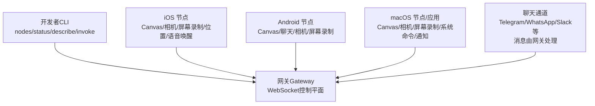
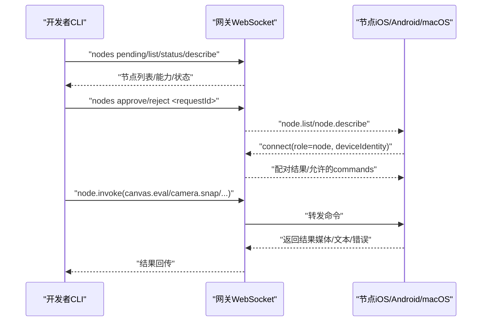
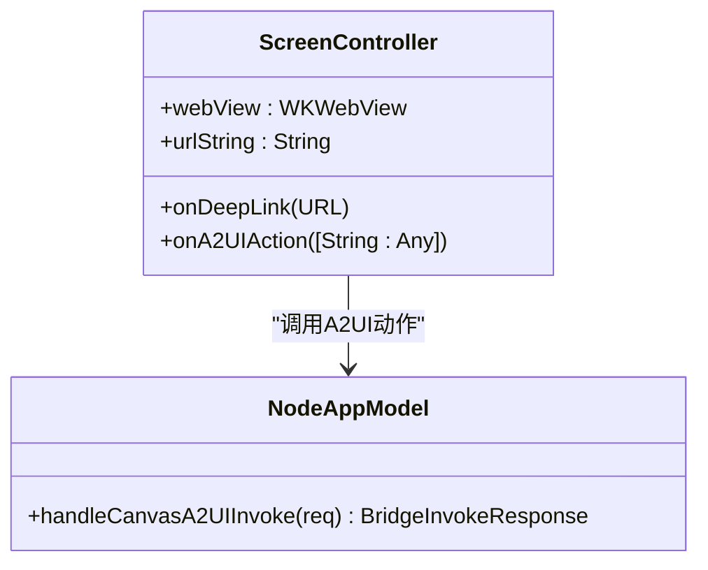
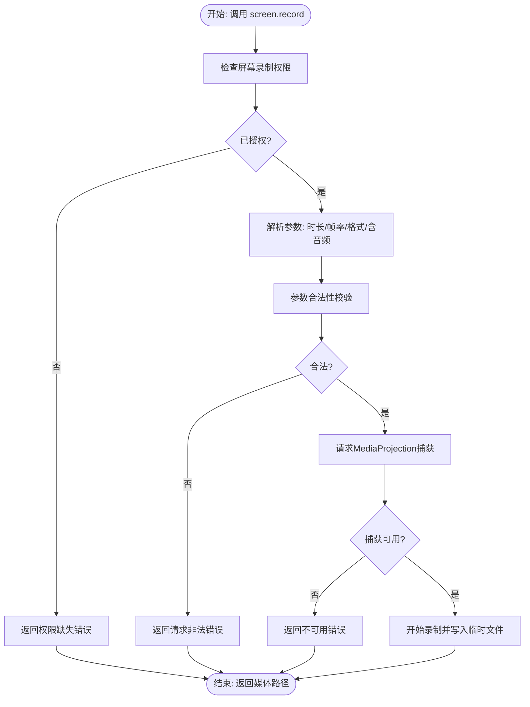
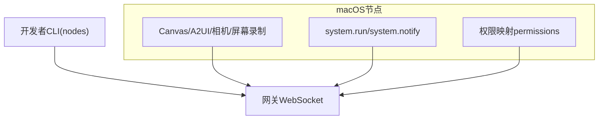
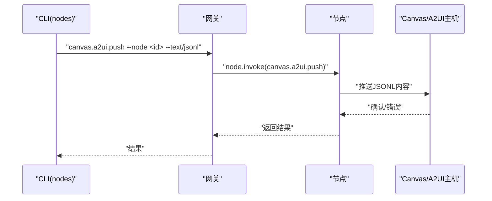
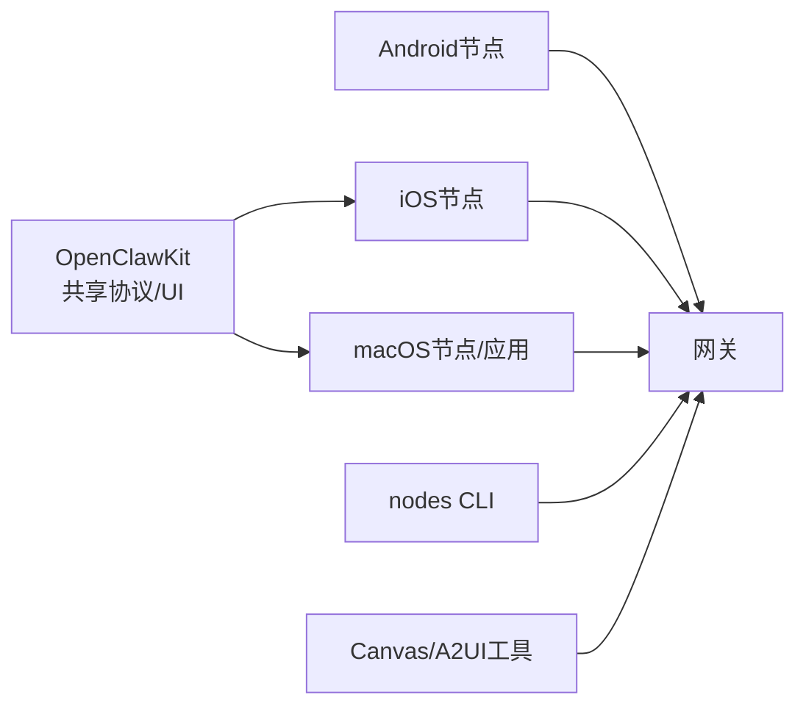

# 设备节点系统

<cite>
**本文引用的文件**
- [README.md](file://README.md)
- [docs/nodes/index.md](file://docs/nodes/index.md)
- [docs/platforms/ios.md](file://docs/platforms/ios.md)
- [docs/platforms/android.md](file://docs/platforms/android.md)
- [docs/platforms/macos.md](file://docs/platforms/macos.md)
- [docs/concepts/architecture.md](file://docs/concepts/architecture.md)
- [apps/ios/README.md](file://apps/ios/README.md)
- [apps/android/README.md](file://apps/android/README.md)
- [apps/macos/README.md](file://apps/macos/README.md)
- [apps/shared/OpenClawKit/Package.swift](file://apps/shared/OpenClawKit/Package.swift)
- [src/cli/nodes-cli/register.canvas.ts](file://src/cli/nodes-cli/register.canvas.ts)
- [src/agents/tools/canvas-tool.ts](file://src/agents/tools/canvas-tool.ts)
- [apps/ios/Sources/Screen/ScreenController.swift](file://apps/ios/Sources/Screen/ScreenController.swift)
- [apps/ios/Sources/Model/NodeAppModel.swift](file://apps/ios/Sources/Model/NodeAppModel.swift)
- [apps/android/app/src/main/java/ai/openclaw/android/node/ScreenRecordManager.kt](file://apps/android/app/src/main/java/ai/openclaw/android/node/ScreenRecordManager.kt)
- [apps/android/app/src/main/java/ai/openclaw/android/MainActivity.kt](file://apps/android/app/src/main/java/ai/openclaw/android/MainActivity.kt)
- [apps/android/app/src/main/java/ai/openclaw/android/NodeForegroundService.kt](file://apps/android/app/src/main/java/ai/openclaw/android/NodeForegroundService.kt)
- [apps/android/app/src/main/java/ai/openclaw/android/gateway/GatewayDiscovery.kt](file://apps/android/app/src/main/java/ai/openclaw/android/gateway/GatewayDiscovery.kt)
- [Swabble/README.md](file://Swabble/README.md)
</cite>

## 目录

1. [简介](#简介)
2. [项目结构](#项目结构)
3. [核心组件](#核心组件)
4. [架构总览](#架构总览)
5. [详细组件分析](#详细组件分析)
6. [依赖关系分析](#依赖关系分析)
7. [性能考量](#性能考量)
8. [故障排除指南](#故障排除指南)
9. [结论](#结论)
10. [附录](#附录)

## 简介

本技术文档面向OpenClaw设备节点系统，聚焦iOS、Android与macOS节点的架构设计、配对流程与权限管理，解释节点如何通过网关协议进行通信、设备能力声明与权限验证机制，并深入说明Canvas可视化工作区、相机控制、屏幕录制、位置获取与系统通知等能力的实现方式。同时提供节点开发指南、安全策略与性能优化建议，涵盖节点注册流程、能力发现机制与远程控制功能，并给出实际配置示例与故障排除方法。

## 项目结构

OpenClaw采用“网关控制平面 + 多客户端/节点”的架构。节点以role为node的身份连接到同一WebSocket服务端，向网关暴露命令集合（如canvas._、camera._、screen.record、location.get、system.run等），并通过node.invoke进行调用。macOS应用既可作为网关本地运行，也可作为远程模式下的节点宿主，提供macOS专属能力并管理TCC权限。

图示来源

- [docs/concepts/architecture.md](file://docs/concepts/architecture.md#L12-L48)
- [docs/platforms/ios.md](file://docs/platforms/ios.md#L14-L18)
- [docs/platforms/android.md](file://docs/platforms/android.md#L10-L18)
- [docs/platforms/macos.md](file://docs/platforms/macos.md#L9-L24)

章节来源

- [README.md](file://README.md#L180-L233)
- [docs/concepts/architecture.md](file://docs/concepts/architecture.md#L12-L48)

## 核心组件

- 网关（Gateway）：维护各消息通道连接，暴露WebSocket API，校验入站帧，发布agent、presence、heartbeat等事件。
- 节点（Node）：以role: node连接，声明能力与命令，通过node.invoke执行Canvas、相机、屏幕录制、位置、系统命令等。
- macOS应用：菜单栏应用，负责权限管理（TCC）、本地/远程模式切换、作为macOS节点暴露能力。
- CLI工具：nodes子命令用于节点状态查询、描述、调用与配对管理；支持Canvas/A2UI/相机/屏幕录制/位置/系统命令等高级别助手。

章节来源

- [docs/nodes/index.md](file://docs/nodes/index.md#L10-L23)
- [docs/platforms/macos.md](file://docs/platforms/macos.md#L50-L65)
- [src/cli/nodes-cli/register.canvas.ts](file://src/cli/nodes-cli/register.canvas.ts#L170-L221)

## 架构总览

节点与网关通过WebSocket长连接通信，握手阶段要求严格的JSON帧与强制握手；节点在connect时携带设备身份，网关创建设备配对请求，批准后节点进入已配对状态并可执行node.invoke命令。Canvas/A2UI由独立canvasHost提供，节点通过node.invoke驱动Canvas渲染与交互。

图示来源

- [docs/concepts/architecture.md](file://docs/concepts/architecture.md#L12-L48)
- [docs/nodes/index.md](file://docs/nodes/index.md#L24-L44)

章节来源

- [docs/concepts/architecture.md](file://docs/concepts/architecture.md#L12-L48)
- [docs/nodes/index.md](file://docs/nodes/index.md#L24-L44)

## 详细组件分析

### iOS节点

- 连接与配对：通过Bonjour或Tailnet或手动Host/Port发现网关，批准配对后建立WebSocket连接。
- 能力与命令：Canvas（WKWebView）、屏幕截图、相机拍摄/录制、位置获取、语音唤醒与Talk模式。
- 权限管理：依赖iOS权限（相机、麦克风、屏幕录制、定位等），未授权时命令失败并返回相应错误码。
- A2UI集成：节点自动导航至A2UI主机（若网关宣告），支持reset与pushJSONL。

图示来源

- [apps/ios/Sources/Screen/ScreenController.swift](file://apps/ios/Sources/Screen/ScreenController.swift#L1-L24)
- [apps/ios/Sources/Model/NodeAppModel.swift](file://apps/ios/Sources/Model/NodeAppModel.swift#L793-L813)

章节来源

- [docs/platforms/ios.md](file://docs/platforms/ios.md#L14-L18)
- [apps/ios/README.md](file://apps/ios/README.md#L11-L16)

### Android节点

- 连接与配对：mDNS/NSD发现网关，前台服务维持连接，首次配对后自动重连。
- 能力与命令：Canvas（LAN/Tailnet访问canvasHost）、聊天（共享main会话）、相机拍照/录制、屏幕录制。
- 权限与限制：现代Android（minSdk 31）仅支持必要权限；屏幕录制需MediaProjection授权；相机/录音权限按需申请。
- 屏幕录制：参数校验（格式、帧率、时长、是否含音频），生成临时MP4文件并返回。

图示来源

- [apps/android/app/src/main/java/ai/openclaw/android/node/ScreenRecordManager.kt](file://apps/android/app/src/main/java/ai/openclaw/android/node/ScreenRecordManager.kt#L30-L67)

章节来源

- [docs/platforms/android.md](file://docs/platforms/android.md#L10-L18)
- [apps/android/README.md](file://apps/android/README.md#L1-L9)

### macOS节点/应用

- 节点模式：macOS应用可作为节点连接网关，暴露Canvas、相机、屏幕录制、system.run/system.notify等能力。
- 权限管理：通过TCC权限（通知、辅助功能、屏幕录制、麦克风、语音识别、自动化等）统一管理；system.run受exec approvals控制。
- 远程模式：通过SSH隧道将本地端口转发到远程网关，节点以本地127.0.0.1呈现给网关，保持UI/TCC上下文。

图示来源

- [docs/platforms/macos.md](file://docs/platforms/macos.md#L50-L65)
- [docs/platforms/macos.md](file://docs/platforms/macos.md#L75-L107)

章节来源

- [docs/platforms/macos.md](file://docs/platforms/macos.md#L50-L65)
- [docs/platforms/macos.md](file://docs/platforms/macos.md#L75-L107)

### Canvas与A2UI

- Canvas：节点可navigate、eval、snapshot，支持JPEG/PNG格式与最大宽度质量参数；CLI提供高级助手（nodes canvas snapshot/eval/navigate）。
- A2UI：节点支持pushJSONL与reset；仅支持特定版本（v0.8），不支持v0.9的createSurface。
- 工具侧：canvas-tool根据action分派到具体实现，如a2ui_push/a2ui_reset，或生成canvas快照。

图示来源

- [src/cli/nodes-cli/register.canvas.ts](file://src/cli/nodes-cli/register.canvas.ts#L205-L221)
- [src/agents/tools/canvas-tool.ts](file://src/agents/tools/canvas-tool.ts#L159-L174)

章节来源

- [docs/nodes/index.md](file://docs/nodes/index.md#L166-L191)
- [src/cli/nodes-cli/register.canvas.ts](file://src/cli/nodes-cli/register.canvas.ts#L170-L221)
- [src/agents/tools/canvas-tool.ts](file://src/agents/tools/canvas-tool.ts#L145-L180)

### 相机与屏幕录制

- iOS：Canvas与相机命令需前台运行；相机支持snap/clip；屏幕录制需前台且权限授权。
- Android：相机snap/clip；screen.record需MediaProjection授权与必要权限；参数严格校验。
- macOS：system.run可执行本地命令（受exec approvals约束）；system.notify触发系统通知。

章节来源

- [docs/platforms/ios.md](file://docs/platforms/ios.md#L81-L90)
- [docs/nodes/index.md](file://docs/nodes/index.md#L192-L231)
- [apps/android/app/src/main/java/ai/openclaw/android/node/ScreenRecordManager.kt](file://apps/android/app/src/main/java/ai/openclaw/android/node/ScreenRecordManager.kt#L30-L67)

### 位置获取

- iOS/Android/macOS节点均支持location.get；响应包含经纬度、精度（米）与时间戳；默认关闭，开启需系统权限；后台获取为尽力而为。

章节来源

- [docs/nodes/index.md](file://docs/nodes/index.md#L232-L248)

### 系统命令与通知

- macOS节点：system.run/system.notify；system.run支持cwd/env/超时/needs-screen-recording等参数；system.notify支持优先级与投递方式。
- exec approvals：macOS应用内设置（Ask/Allowlist/Deny），headless节点主机本地存储exec-approvals.json。

章节来源

- [docs/nodes/index.md](file://docs/nodes/index.md#L264-L286)
- [docs/platforms/macos.md](file://docs/platforms/macos.md#L75-L107)

### 语音唤醒（Swabble）

- Swabble为基于Speech.framework的本地唤醒词守护进程，支持macOS与iOS多平台；提供wake-word检测、Hook执行、转录输出等能力。
- 适合在节点侧启用语音唤醒与Talk模式，结合网关的Canvas/A2UI进行人机交互。

章节来源

- [Swabble/README.md](file://Swabble/README.md#L1-L112)

## 依赖关系分析

- 共享协议库：OpenClawKit（iOS/macOS）提供跨平台协议与UI组件，支撑节点与网关之间的类型化通信。
- 平台差异：iOS/Android节点通过各自平台的权限体系与系统服务（相机、屏幕录制、定位）提供能力；macOS节点通过TCC与系统命令执行能力。
- CLI与工具链：nodes子命令提供节点状态、描述、调用与配对管理；canvas-tool与register.canvas.ts提供Canvas/A2UI工具实现。

图示来源

- [apps/shared/OpenClawKit/Package.swift](file://apps/shared/OpenClawKit/Package.swift#L11-L15)
- [src/cli/nodes-cli/register.canvas.ts](file://src/cli/nodes-cli/register.canvas.ts#L170-L221)
- [src/agents/tools/canvas-tool.ts](file://src/agents/tools/canvas-tool.ts#L145-L180)

章节来源

- [apps/shared/OpenClawKit/Package.swift](file://apps/shared/OpenClawKit/Package.swift#L11-L15)
- [src/cli/nodes-cli/register.canvas.ts](file://src/cli/nodes-cli/register.canvas.ts#L170-L221)
- [src/agents/tools/canvas-tool.ts](file://src/agents/tools/canvas-tool.ts#L145-L180)

## 性能考量

- Canvas/A2UI：避免过大的图片/JSONL负载，合理设置快照格式与质量；对频繁更新的内容采用增量推送与缓存策略。
- 屏幕录制：限制时长与帧率，避免生成过大的媒体文件；在Android侧确保MediaProjection授权一次性完成，减少反复弹窗带来的延迟。
- 相机拍摄：控制分辨率与格式，避免超大Base64负载；在iOS/Android侧确保前台运行以降低权限失败概率。
- 网络与连接：节点使用前台服务/守护进程维持连接，减少断连与重连开销；在远程模式下通过SSH隧道稳定连接。
- 权限与安全：严格遵循平台权限模型，避免不必要的权限请求；system.run通过exec approvals白名单控制，降低风险。

## 故障排除指南

- iOS常见问题
  - NODE_BACKGROUND_UNAVAILABLE：将节点应用置于前台（Canvas/Camera/Screen命令需前台）。
  - A2UI_HOST_NOT_CONFIGURED：检查网关配置中的canvasHost；确认节点已收到canvasHost地址并成功导航。
  - 配对提示未出现：在网关侧执行nodes pending并手动批准。
  - 重装后无法重连：钥匙串配对令牌被清除，需重新配对。
- Android常见问题
  - 屏幕录制权限缺失：授予“屏幕录制”与“通知”权限；确保MediaProjection授权成功。
  - 相机/录音权限缺失：授予CAMERA/RECORD_AUDIO权限；Wi-Fi设备可能不支持telephony，不会暴露sms.send。
  - 连接失败：检查mDNS/NSD是否可用；若跨网络，使用Wide-Area Bonjour/unicast DNS-SD；或使用手动Host/Port。
- macOS常见问题
  - system.run被拒绝：检查exec approvals设置（Ask/Allowlist/Deny）；确认命令在允许列表中。
  - 远程模式IP显示为127.0.0.1：SSH隧道使用本地回环，如需真实IP请使用Direct传输。
- 通用排查
  - 使用nodes status/describe查看节点状态与能力；通过gateway call node.list验证节点可见性。
  - 通过dns-sd或Bonjour工具验证服务发现；检查网关日志与节点日志定位问题。

章节来源

- [docs/platforms/ios.md](file://docs/platforms/ios.md#L96-L101)
- [docs/platforms/android.md](file://docs/platforms/android.md#L73-L86)
- [docs/platforms/macos.md](file://docs/platforms/macos.md#L177-L196)
- [docs/nodes/index.md](file://docs/nodes/index.md#L24-L44)

## 结论

OpenClaw设备节点系统通过统一的WebSocket协议与role: node的设计，实现了iOS、Android与macOS节点与网关的无缝协作。节点在各自平台的权限体系下提供Canvas、相机、屏幕录制、位置与系统命令等能力，并通过网关进行统一调度与安全管控。借助CLI工具与Canvas/A2UI生态，用户可在多端协同构建强大的代理工作空间。建议在开发与部署过程中严格遵循权限与安全策略，优化媒体与网络性能，并结合本文提供的排障指南快速定位与解决问题。

## 附录

- 节点注册与配对流程（概要）
  - 网关侧：openclaw nodes pending → approve/reject
  - 节点侧：发现网关（Bonjour/Tailnet/Manual）→ 连接并批准配对
  - 验证：openclaw nodes status / gateway call node.list
- 能力发现与调用
  - openclaw nodes describe --node <id>
  - openclaw nodes invoke --node <id> --command canvas.eval --params '{...}'
- Canvas/A2UI使用
  - nodes canvas a2ui push --node <id> --text "..."
  - nodes canvas snapshot --node <id> --format png --max-width 1200
- 远程控制与节点宿主
  - openclaw node run --host <gateway-host> --port 18789 --display-name "Build Node"
  - openclaw approvals allowlist add --node <id> "/usr/bin/命令"

章节来源

- [docs/nodes/index.md](file://docs/nodes/index.md#L24-L44)
- [docs/nodes/index.md](file://docs/nodes/index.md#L145-L191)
- [docs/nodes/index.md](file://docs/nodes/index.md#L45-L108)
