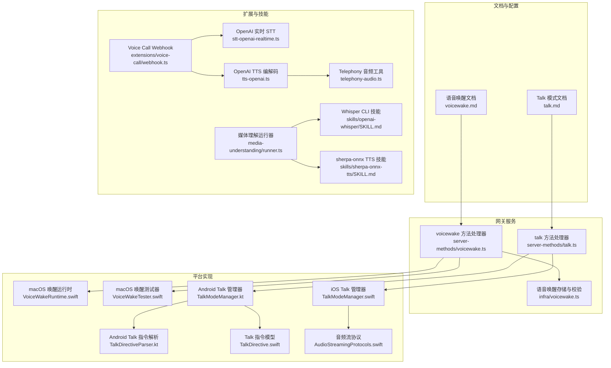
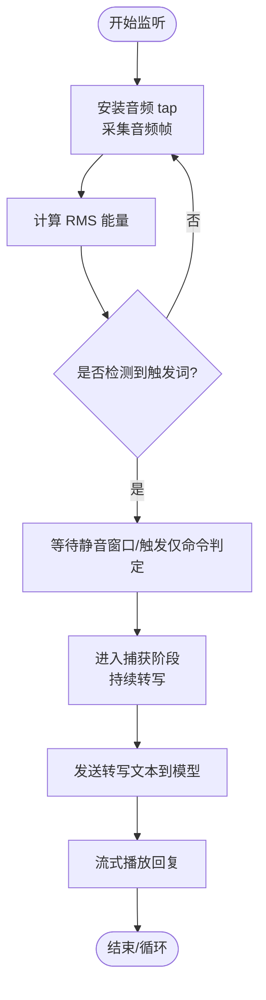
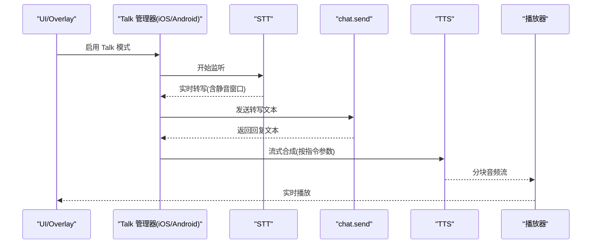
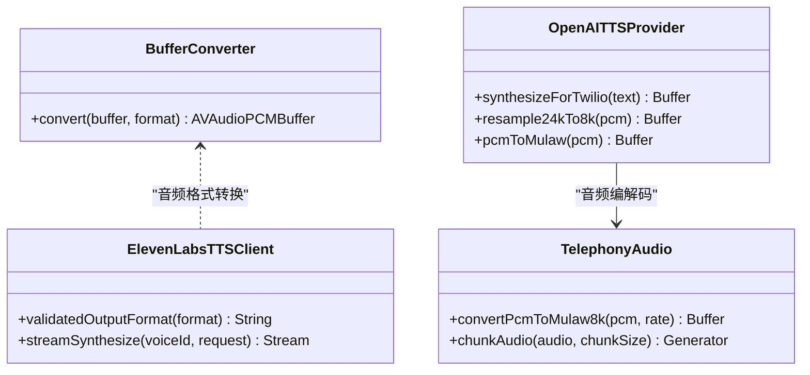
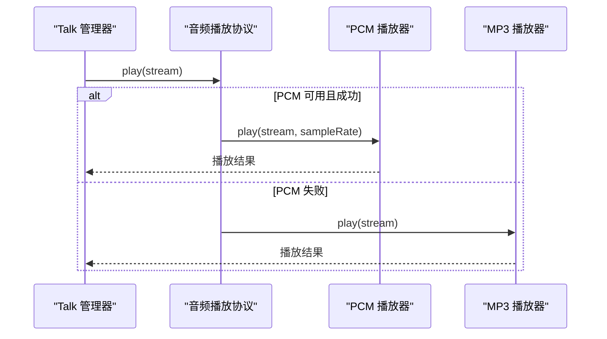
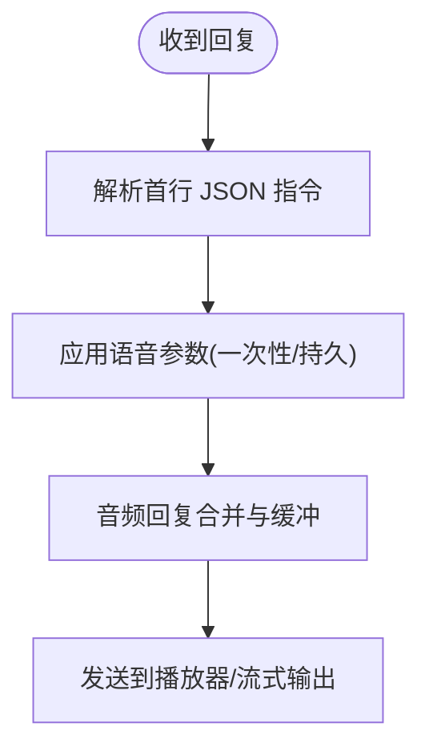
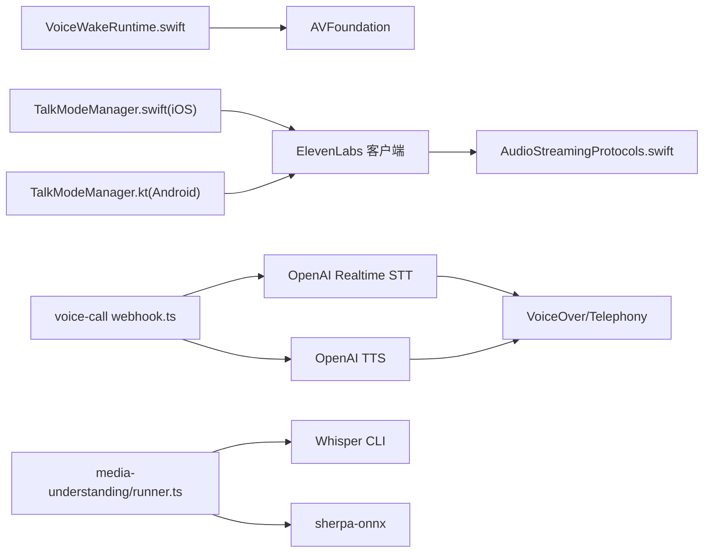

# 语音唤醒与对话

<cite>
**本文引用的文件**   
- [docs/nodes/voicewake.md](file://docs/nodes/voicewake.md)
- [docs/nodes/talk.md](file://docs/nodes/talk.md)
- [src/gateway/server-methods/voicewake.ts](file://src/gateway/server-methods/voicewake.ts)
- [src/gateway/server-methods/talk.ts](file://src/gateway/server-methods/talk.ts)
- [src/infra/voicewake.ts](file://src/infra/voicewake.ts)
- [apps/macos/Sources/OpenClaw/VoiceWakeRuntime.swift](file://apps/macos/Sources/OpenClaw/VoiceWakeRuntime.swift)
- [apps/macos/Sources/OpenClaw/VoiceWakeTester.swift](file://apps/macos/Sources/OpenClaw/VoiceWakeTester.swift)
- [apps/macos/Sources/OpenClaw/TalkModeTypes.swift](file://apps/macos/Sources/OpenClaw/TalkModeTypes.swift)
- [apps/ios/Sources/Voice/TalkModeManager.swift](file://apps/ios/Sources/Voice/TalkModeManager.swift)
- [apps/android/app/src/main/java/ai/openclaw/android/voice/TalkModeManager.kt](file://apps/android/app/src/main/java/ai/openclaw/android/voice/TalkModeManager.kt)
- [apps/android/app/src/main/java/ai/openclaw/android/voice/TalkDirectiveParser.kt](file://apps/android/app/src/main/java/ai/openclaw/android/voice/TalkDirectiveParser.kt)
- [apps/shared/OpenClawKit/Sources/OpenClawKit/TalkDirective.swift](file://apps/shared/OpenClawKit/Sources/OpenClawKit/TalkDirective.swift)
- [apps/shared/OpenClawKit/Sources/OpenClawKit/AudioStreamingProtocols.swift](file://apps/shared/OpenClawKit/Sources/OpenClawKit/AudioStreamingProtocols.swift)
- [extensions/voice-call/src/webhook.ts](file://extensions/voice-call/src/webhook.ts)
- [extensions/voice-call/src/providers/stt-openai-realtime.ts](file://extensions/voice-call/src/providers/stt-openai-realtime.ts)
- [extensions/voice-call/src/providers/tts-openai.ts](file://extensions/voice-call/src/providers/tts-openai.ts)
- [extensions/voice-call/src/telephony-audio.ts](file://extensions/voice-call/src/telephony-audio.ts)
- [Swabble/Sources/SwabbleCore/Speech/BufferConverter.swift](file://Swabble/Sources/SwabbleCore/Speech/BufferConverter.swift)
- [skills/openai-whisper/SKILL.md](file://skills/openai-whisper/SKILL.md)
- [skills/sherpa-onnx-tts/SKILL.md](file://skills/sherpa-onnx-tts/SKILL.md)
- [src/media-understanding/runner.ts](file://src/media-understanding/runner.ts)
- [src/auto-reply/reply/block-reply-pipeline.ts](file://src/auto-reply/reply/block-reply-pipeline.ts)
</cite>

## 目录

1. [简介](#简介)
2. [项目结构](#项目结构)
3. [核心组件](#核心组件)
4. [架构总览](#架构总览)
5. [详细组件分析](#详细组件分析)
6. [依赖关系分析](#依赖关系分析)
7. [性能考量](#性能考量)
8. [故障排查指南](#故障排查指南)
9. [结论](#结论)
10. [附录](#附录)

## 简介

本技术文档聚焦于 OpenClaw 的语音唤醒与对话系统，覆盖以下主题：

- 语音唤醒：全局触发词策略、跨节点同步、平台端实现要点
- Talk 模式：连续对话循环、指令解析、实时语音处理与播放
- 语音识别（STT）与语音合成（TTS）：本地与云端方案、音频格式与编解码
- 音频处理：采样率转换、μ-law 编码、流式分片
- 多轮对话管理：中断控制、上下文构建、回复聚合
- 配置与优化：模型参数、输出格式、延迟控制
- 权限与隐私：麦克风与语音权限、数据最小化
- 最佳实践与常见问题

## 项目结构

OpenClaw 将“语音唤醒”和“Talk 对话”能力分布在多个层次：

- 文档层：定义行为规范与配置参考
- 网关层：提供统一方法与事件广播
- 平台层：macOS/iOS/Android 的具体实现
- 扩展层：Voice Call 插件与 OpenAI 实时 STT/TTS 集成
- 技能层：本地 Whisper/ sherpa-onnx 等离线能力
- 媒体理解与自动回复：音频转写与回复聚合



**图表来源**

- [docs/nodes/voicewake.md](file://docs/nodes/voicewake.md#L1-L66)
- [docs/nodes/talk.md](file://docs/nodes/talk.md#L1-L91)
- [src/gateway/server-methods/voicewake.ts](file://src/gateway/server-methods/voicewake.ts#L1-L35)
- [src/gateway/server-methods/talk.ts](file://src/gateway/server-methods/talk.ts#L1-L39)
- [src/infra/voicewake.ts](file://src/infra/voicewake.ts#L1-L91)
- [apps/macos/Sources/OpenClaw/VoiceWakeRuntime.swift](file://apps/macos/Sources/OpenClaw/VoiceWakeRuntime.swift#L51-L534)
- [apps/macos/Sources/OpenClaw/VoiceWakeTester.swift](file://apps/macos/Sources/OpenClaw/VoiceWakeTester.swift#L357-L424)
- [apps/ios/Sources/Voice/TalkModeManager.swift](file://apps/ios/Sources/Voice/TalkModeManager.swift#L842-L877)
- [apps/android/app/src/main/java/ai/openclaw/android/voice/TalkModeManager.kt](file://apps/android/app/src/main/java/ai/openclaw/android/voice/TalkModeManager.kt#L424-L457)
- [apps/android/app/src/main/java/ai/openclaw/android/voice/TalkDirectiveParser.kt](file://apps/android/app/src/main/java/ai/openclaw/android/voice/TalkDirectiveParser.kt#L47-L68)
- [apps/shared/OpenClawKit/Sources/OpenClawKit/TalkDirective.swift](file://apps/shared/OpenClawKit/Sources/OpenClawKit/TalkDirective.swift#L1-L50)
- [apps/shared/OpenClawKit/Sources/OpenClawKit/AudioStreamingProtocols.swift](file://apps/shared/OpenClawKit/Sources/OpenClawKit/AudioStreamingProtocols.swift#L1-L16)
- [extensions/voice-call/src/webhook.ts](file://extensions/voice-call/src/webhook.ts#L41-L70)
- [extensions/voice-call/src/providers/stt-openai-realtime.ts](file://extensions/voice-call/src/providers/stt-openai-realtime.ts#L1-L25)
- [extensions/voice-call/src/providers/tts-openai.ts](file://extensions/voice-call/src/providers/tts-openai.ts#L125-L173)
- [extensions/voice-call/src/telephony-audio.ts](file://extensions/voice-call/src/telephony-audio.ts#L46-L90)
- [skills/openai-whisper/SKILL.md](file://skills/openai-whisper/SKILL.md#L1-L39)
- [skills/sherpa-onnx-tts/SKILL.md](file://skills/sherpa-onnx-tts/SKILL.md#L1-L104)
- [src/media-understanding/runner.ts](file://src/media-understanding/runner.ts#L300-L368)

**章节来源**

- [docs/nodes/voicewake.md](file://docs/nodes/voicewake.md#L1-L66)
- [docs/nodes/talk.md](file://docs/nodes/talk.md#L1-L91)
- [src/gateway/server-methods/voicewake.ts](file://src/gateway/server-methods/voicewake.ts#L1-L35)
- [src/gateway/server-methods/talk.ts](file://src/gateway/server-methods/talk.ts#L1-L39)
- [src/infra/voicewake.ts](file://src/infra/voicewake.ts#L1-L91)

## 核心组件

- 语音唤醒（Gateway）
  - 全局触发词列表由网关持有并广播；各节点本地启用/禁用状态独立
  - 提供获取与设置方法，并在变更时广播事件
- Talk 模式（网关与平台）
  - 连续对话循环：监听 → 转写 → 发送到模型 → 流式播放
  - 支持通过首行 JSON 控制语音参数（一次性或持久生效）
- 平台实现（macOS/iOS/Android）
  - macOS：基于 AVAudioEngine 的实时音频采集、RMS 能量检测、静音窗口判定、流式播放
  - iOS/Android：封装 ElevenLabs 流式 TTS、音频源分块、指令解析与应用
- 扩展与技能
  - Voice Call 插件集成 OpenAI 实时 STT/TTS，支持 μ-law 编码与 8kHz 采样
  - 本地 Whisper/ sherpa-onnx 提供离线语音识别与 TTS 能力
- 媒体理解与回复聚合
  - 自动选择本地/在线模型进行音频转写
  - 回复缓冲与合并，确保语音作为回复时的正确性

**章节来源**

- [docs/nodes/voicewake.md](file://docs/nodes/voicewake.md#L9-L66)
- [docs/nodes/talk.md](file://docs/nodes/talk.md#L9-L91)
- [apps/macos/Sources/OpenClaw/VoiceWakeRuntime.swift](file://apps/macos/Sources/OpenClaw/VoiceWakeRuntime.swift#L51-L534)
- [apps/ios/Sources/Voice/TalkModeManager.swift](file://apps/ios/Sources/Voice/TalkModeManager.swift#L842-L877)
- [apps/android/app/src/main/java/ai/openclaw/android/voice/TalkModeManager.kt](file://apps/android/app/src/main/java/ai/openclaw/android/voice/TalkModeManager.kt#L424-L457)
- [extensions/voice-call/src/webhook.ts](file://extensions/voice-call/src/webhook.ts#L41-L70)
- [skills/openai-whisper/SKILL.md](file://skills/openai-whisper/SKILL.md#L1-L39)
- [skills/sherpa-onnx-tts/SKILL.md](file://skills/sherpa-onnx-tts/SKILL.md#L1-L104)
- [src/media-understanding/runner.ts](file://src/media-understanding/runner.ts#L300-L368)

## 架构总览

下图展示从“语音唤醒”到“Talk 模式”的端到端交互：

```mermaid
sequenceDiagram
participant User as "用户"
participant Mac as "macOS 唤醒运行时"
participant GW as "网关"
participant iOS as "iOS Talk 管理器"
participant And as "Android Talk 管理器"
participant STT as "语音识别(STT)"
participant LLM as "大模型"
participant TTS as "语音合成(TTS)"
User->>Mac : 触发词 + 语音输入
Mac->>GW : 广播唤醒事件/状态
GW-->>iOS : 推送 talk.mode 事件
GW-->>And : 推送 talk.mode 事件
iOS->>STT : 开始转写(可选本地/云端)
And->>STT : 开始转写(可选本地/云端)
STT-->>LLM : 上行转写文本
LLM-->>STT : 下行回复文本
STT->>TTS : 流式合成(PCM/MP3)
TTS-->>iOS : 播放流
TTS-->>And : 播放流
```

**图表来源**

- [src/gateway/server-methods/voicewake.ts](file://src/gateway/server-methods/voicewake.ts#L7-L34)
- [src/gateway/server-methods/talk.ts](file://src/gateway/server-methods/talk.ts#L9-L37)
- [apps/macos/Sources/OpenClaw/VoiceWakeRuntime.swift](file://apps/macos/Sources/OpenClaw/VoiceWakeRuntime.swift#L51-L534)
- [apps/ios/Sources/Voice/TalkModeManager.swift](file://apps/ios/Sources/Voice/TalkModeManager.swift#L842-L877)
- [apps/android/app/src/main/java/ai/openclaw/android/voice/TalkModeManager.kt](file://apps/android/app/src/main/java/ai/openclaw/android/voice/TalkModeManager.kt#L424-L457)

## 详细组件分析

### 语音唤醒（Gateway 与平台）

- 网关职责
  - 提供获取/设置触发词方法，参数规范化与安全限制
  - 变更后广播事件，确保所有客户端与节点同步
- 存储与一致性
  - 以 JSON 文件持久化，原子写入，带时间戳
  - 默认触发词集合与空列表回退逻辑
- 平台实现要点（macOS）
  - 基于 AVAudioEngine 的 tap 采集与 RMS 能量检测
  - 静音窗口、触发前静默、触发仅命令等策略
  - 失败重试与 PCM/MP3 回退播放



**图表来源**

- [src/gateway/server-methods/voicewake.ts](file://src/gateway/server-methods/voicewake.ts#L7-L34)
- [src/infra/voicewake.ts](file://src/infra/voicewake.ts#L61-L91)
- [apps/macos/Sources/OpenClaw/VoiceWakeRuntime.swift](file://apps/macos/Sources/OpenClaw/VoiceWakeRuntime.swift#L51-L534)
- [apps/macos/Sources/OpenClaw/VoiceWakeTester.swift](file://apps/macos/Sources/OpenClaw/VoiceWakeTester.swift#L357-L424)

**章节来源**

- [docs/nodes/voicewake.md](file://docs/nodes/voicewake.md#L9-L66)
- [src/gateway/server-methods/voicewake.ts](file://src/gateway/server-methods/voicewake.ts#L7-L34)
- [src/infra/voicewake.ts](file://src/infra/voicewake.ts#L61-L91)
- [apps/macos/Sources/OpenClaw/VoiceWakeRuntime.swift](file://apps/macos/Sources/OpenClaw/VoiceWakeRuntime.swift#L51-L534)
- [apps/macos/Sources/OpenClaw/VoiceWakeTester.swift](file://apps/macos/Sources/OpenClaw/VoiceWakeTester.swift#L357-L424)

### Talk 模式工作机制

- 连续对话循环
  - 监听 → 思考 → 说话；短暂停顿即发送当前转写
  - 支持“说话时打断”，记录打断时间用于提示
- 语音指令解析
  - 助手回复首行可包含 JSON 控制语音参数（一次性或持久）
  - 解析器兼容多种键名别名，未知键忽略
- 平台差异
  - iOS/Android：封装 ElevenLabs 流式 TTS，支持 PCM/MP3 输出
  - macOS：Overlay 状态指示，点击可停止/退出
- 配置参考
  - voiceId、modelId、outputFormat、apiKey、interruptOnSpeech 等



**图表来源**

- [docs/nodes/talk.md](file://docs/nodes/talk.md#L11-L91)
- [apps/ios/Sources/Voice/TalkModeManager.swift](file://apps/ios/Sources/Voice/TalkModeManager.swift#L842-L877)
- [apps/android/app/src/main/java/ai/openclaw/android/voice/TalkModeManager.kt](file://apps/android/app/src/main/java/ai/openclaw/android/voice/TalkModeManager.kt#L424-L457)
- [apps/android/app/src/main/java/ai/openclaw/android/voice/TalkDirectiveParser.kt](file://apps/android/app/src/main/java/ai/openclaw/android/voice/TalkDirectiveParser.kt#L47-L68)
- [apps/shared/OpenClawKit/Sources/OpenClawKit/TalkDirective.swift](file://apps/shared/OpenClawKit/Sources/OpenClawKit/TalkDirective.swift#L1-L50)

**章节来源**

- [docs/nodes/talk.md](file://docs/nodes/talk.md#L11-L91)
- [apps/ios/Sources/Voice/TalkModeManager.swift](file://apps/ios/Sources/Voice/TalkModeManager.swift#L842-L877)
- [apps/android/app/src/main/java/ai/openclaw/android/voice/TalkModeManager.kt](file://apps/android/app/src/main/java/ai/openclaw/android/voice/TalkModeManager.kt#L424-L457)
- [apps/android/app/src/main/java/ai/openclaw/android/voice/TalkDirectiveParser.kt](file://apps/android/app/src/main/java/ai/openclaw/android/voice/TalkDirectiveParser.kt#L47-L68)
- [apps/shared/OpenClawKit/Sources/OpenClawKit/TalkDirective.swift](file://apps/shared/OpenClawKit/Sources/OpenClawKit/TalkDirective.swift#L1-L50)

### 语音识别（STT）与语音合成（TTS）

- 本地 STT
  - Whisper CLI：本地转写，支持模型选择与输出格式
  - sherpa-onnx：本地 TTS（离线），需配置运行时与模型目录
- 云端 STT/TTS
  - Voice Call 插件：OpenAI Realtime STT（流式、VAD、低延迟）
  - ElevenLabs：流式 TTS，支持 PCM/MP3 输出与参数校验
- 音频处理
  - μ-law 编码与 8kHz 采样（Telephony 场景）
  - 采样率转换与线性插值（24kHz → 8kHz）
  - 20ms 帧分片（160 字节/帧）



**图表来源**

- [Swabble/Sources/SwabbleCore/Speech/BufferConverter.swift](file://Swabble/Sources/SwabbleCore/Speech/BufferConverter.swift#L1-L31)
- [extensions/voice-call/src/providers/tts-openai.ts](file://extensions/voice-call/src/providers/tts-openai.ts#L125-L173)
- [extensions/voice-call/src/telephony-audio.ts](file://extensions/voice-call/src/telephony-audio.ts#L46-L90)

**章节来源**

- [skills/openai-whisper/SKILL.md](file://skills/openai-whisper/SKILL.md#L1-L39)
- [skills/sherpa-onnx-tts/SKILL.md](file://skills/sherpa-onnx-tts/SKILL.md#L1-L104)
- [extensions/voice-call/src/providers/stt-openai-realtime.ts](file://extensions/voice-call/src/providers/stt-openai-realtime.ts#L1-L25)
- [extensions/voice-call/src/providers/tts-openai.ts](file://extensions/voice-call/src/providers/tts-openai.ts#L125-L173)
- [extensions/voice-call/src/telephony-audio.ts](file://extensions/voice-call/src/telephony-audio.ts#L46-L90)
- [Swabble/Sources/SwabbleCore/Speech/BufferConverter.swift](file://Swabble/Sources/SwabbleCore/Speech/BufferConverter.swift#L1-L31)

### 音频处理与播放

- 流式播放接口
  - 统一协议抽象：AsyncThrowingStream 数据流、停止与结果查询
  - PCM 与非 PCM 的差异化播放路径
- 平台播放器
  - iOS：PCM 播放器优先，失败则回退 MP3
  - Android：AudioTrack 流式写入，支持多种 PCM 采样率
- 音频格式与延迟
  - outputFormat 决定流式播放质量与延迟
  - 采样率转换与 μ-law 编码降低传输与播放开销



**图表来源**

- [apps/shared/OpenClawKit/Sources/OpenClawKit/AudioStreamingProtocols.swift](file://apps/shared/OpenClawKit/Sources/OpenClawKit/AudioStreamingProtocols.swift#L1-L16)
- [apps/ios/Sources/Voice/TalkModeManager.swift](file://apps/ios/Sources/Voice/TalkModeManager.swift#L1029-L1048)

**章节来源**

- [apps/shared/OpenClawKit/Sources/OpenClawKit/AudioStreamingProtocols.swift](file://apps/shared/OpenClawKit/Sources/OpenClawKit/AudioStreamingProtocols.swift#L1-L16)
- [apps/ios/Sources/Voice/TalkModeManager.swift](file://apps/ios/Sources/Voice/TalkModeManager.swift#L1029-L1048)
- [apps/android/app/src/main/java/ai/openclaw/android/voice/TalkModeManager.kt](file://apps/android/app/src/main/java/ai/openclaw/android/voice/TalkModeManager.kt#L860-L904)

### 多轮对话管理与回复聚合

- 中断控制
  - Talk 模式默认“说话时打断”，记录打断时间用于提示
- 上下文构建
  - Prompt Builder 在回复中注入“被中断时间”等上下文
- 回复聚合
  - 自动回复管道对音频类回复进行缓冲与合并，保证语音作为回复时的正确性



**图表来源**

- [apps/shared/OpenClawKit/Sources/OpenClawKit/TalkDirective.swift](file://apps/shared/OpenClawKit/Sources/OpenClawKit/TalkDirective.swift#L1-L50)
- [src/auto-reply/reply/block-reply-pipeline.ts](file://src/auto-reply/reply/block-reply-pipeline.ts#L22-L35)
- [apps/macos/Sources/OpenClaw/TalkModeTypes.swift](file://apps/macos/Sources/OpenClaw/TalkModeTypes.swift#L1-L8)

**章节来源**

- [apps/shared/OpenClawKit/Sources/OpenClawKit/TalkDirective.swift](file://apps/shared/OpenClawKit/Sources/OpenClawKit/TalkDirective.swift#L1-L50)
- [src/auto-reply/reply/block-reply-pipeline.ts](file://src/auto-reply/reply/block-reply-pipeline.ts#L22-L35)
- [apps/macos/Sources/OpenClaw/TalkModeTypes.swift](file://apps/macos/Sources/OpenClaw/TalkModeTypes.swift#L1-L8)

## 依赖关系分析

- 网关层依赖
  - 语音唤醒方法处理器依赖存储模块与协议错误封装
  - Talk 方法处理器依赖参数校验与广播上下文
- 平台层依赖
  - macOS 唤醒运行时依赖 AVFoundation 与音频引擎
  - iOS/Android Talk 管理器依赖 ElevenLabs 客户端与播放协议
- 扩展与技能依赖
  - Voice Call 插件依赖 OpenAI 实时 STT/TTS 提供者
  - 本地技能依赖外部二进制与环境变量



**图表来源**

- [apps/macos/Sources/OpenClaw/VoiceWakeRuntime.swift](file://apps/macos/Sources/OpenClaw/VoiceWakeRuntime.swift#L51-L534)
- [apps/ios/Sources/Voice/TalkModeManager.swift](file://apps/ios/Sources/Voice/TalkModeManager.swift#L842-L877)
- [apps/android/app/src/main/java/ai/openclaw/android/voice/TalkModeManager.kt](file://apps/android/app/src/main/java/ai/openclaw/android/voice/TalkModeManager.kt#L424-L457)
- [apps/shared/OpenClawKit/Sources/OpenClawKit/AudioStreamingProtocols.swift](file://apps/shared/OpenClawKit/Sources/OpenClawKit/AudioStreamingProtocols.swift#L1-L16)
- [extensions/voice-call/src/webhook.ts](file://extensions/voice-call/src/webhook.ts#L41-L70)
- [src/media-understanding/runner.ts](file://src/media-understanding/runner.ts#L300-L368)

**章节来源**

- [src/gateway/server-methods/voicewake.ts](file://src/gateway/server-methods/voicewake.ts#L1-L35)
- [src/gateway/server-methods/talk.ts](file://src/gateway/server-methods/talk.ts#L1-L39)
- [src/media-understanding/runner.ts](file://src/media-understanding/runner.ts#L300-L368)

## 性能考量

- 延迟控制
  - 选择合适的 outputFormat（PCM/MP3）与 latency_tier
  - 使用流式播放与 20ms 帧分片，减少端到端延迟
- 音频质量
  - 采样率转换与 μ-law 编码在 Telephony 场景下提升传输效率
  - ElevenLabs 参数校验（stability、latency_tier）避免无效请求
- 资源占用
  - macOS 唤醒运行时在空闲时释放音频引擎，避免后台资源占用
  - Android 使用 AudioTrack 流式写入，降低内存峰值

[本节为通用指导，无需特定文件来源]

## 故障排查指南

- 无法启动语音唤醒
  - 检查麦克风权限与音频输入可用性
  - 确认网关已广播最新触发词，节点本地启用状态正常
- Talk 模式无声音或卡顿
  - 检查 outputFormat 与设备播放能力匹配
  - 若 PCM 播放失败，确认回退到 MP3 的路径是否生效
- STT 结果不准确
  - 切换本地 Whisper 或 sherpa-onnx 模型
  - 调整音频输入增益与静音窗口参数
- 通话场景音频异常
  - 确认 μ-law 编码与 8kHz 采样一致
  - 检查分片大小（20ms/160 字节）与网络稳定性

**章节来源**

- [apps/macos/Sources/OpenClaw/VoiceWakeRuntime.swift](file://apps/macos/Sources/OpenClaw/VoiceWakeRuntime.swift#L163-L188)
- [apps/ios/Sources/Voice/TalkModeManager.swift](file://apps/ios/Sources/Voice/TalkModeManager.swift#L1029-L1048)
- [extensions/voice-call/src/providers/tts-openai.ts](file://extensions/voice-call/src/providers/tts-openai.ts#L125-L173)
- [extensions/voice-call/src/telephony-audio.ts](file://extensions/voice-call/src/telephony-audio.ts#L46-L90)

## 结论

OpenClaw 的语音唤醒与对话系统通过“网关统一管理 + 平台端深度集成 + 扩展与技能互补”的方式，实现了跨平台的一致体验。语音唤醒采用全局触发词与事件广播，Talk 模式提供连续对话与流式播放，结合本地与云端 STT/TTS 能力，满足不同场景下的延迟与质量需求。建议在生产环境中优先使用流式播放与合理的音频格式，并配合严格的权限与隐私策略。

[本节为总结，无需特定文件来源]

## 附录

- 语音模型配置示例（来自文档）
  - 触发词列表与更新时间戳
  - Talk 模式配置项（voiceId、modelId、outputFormat、apiKey、interruptOnSpeech）
- 语音权限与隐私
  - macOS/iOS/Android 需要麦克风与语音权限
  - 本地 Whisper/ sherpa-onnx 减少云端传输，增强隐私
- 常见问题
  - 触发词不生效：检查网关广播与节点本地开关
  - 播放失败：确认 PCM 回退到 MP3 的路径
  - STT 不稳定：切换本地模型或调整音频参数

**章节来源**

- [docs/nodes/voicewake.md](file://docs/nodes/voicewake.md#L17-L66)
- [docs/nodes/talk.md](file://docs/nodes/talk.md#L50-L91)
- [skills/openai-whisper/SKILL.md](file://skills/openai-whisper/SKILL.md#L1-L39)
- [skills/sherpa-onnx-tts/SKILL.md](file://skills/sherpa-onnx-tts/SKILL.md#L69-L84)
