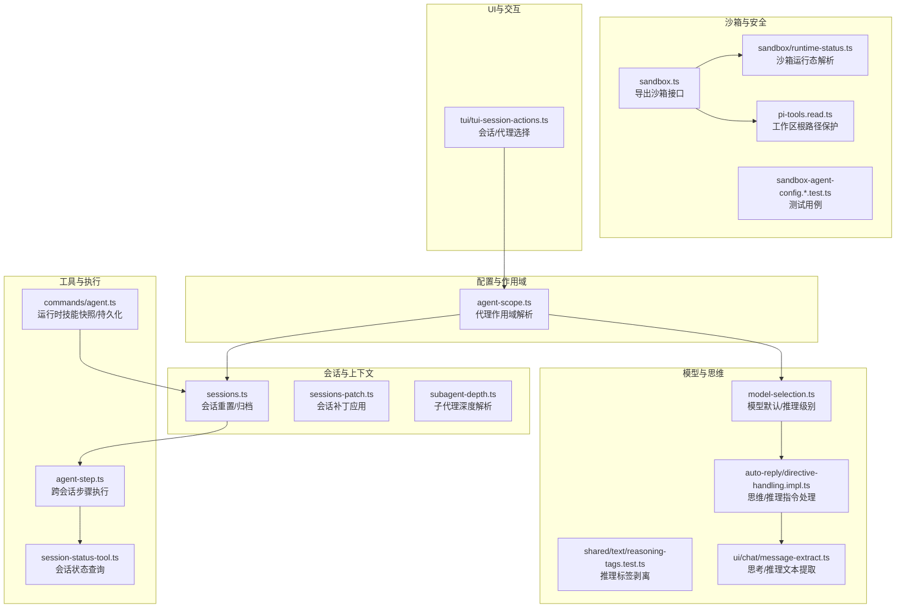
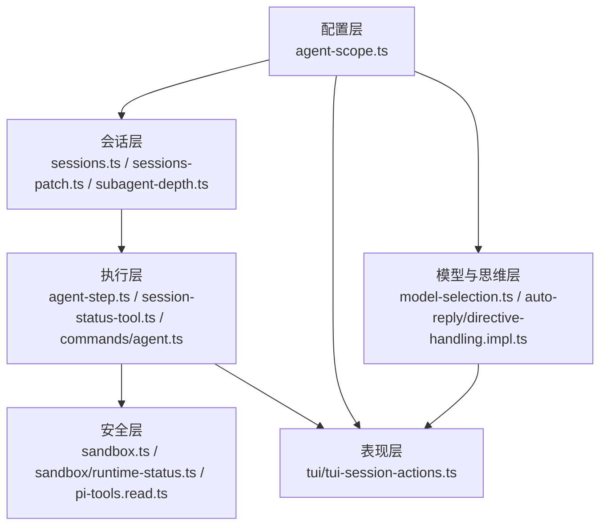
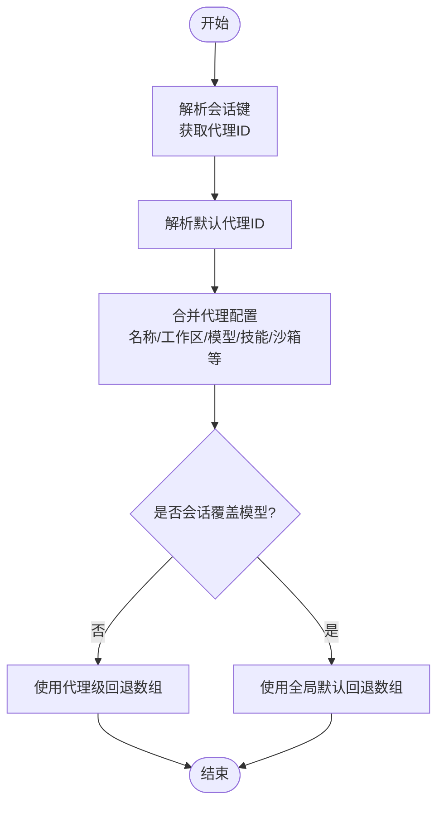
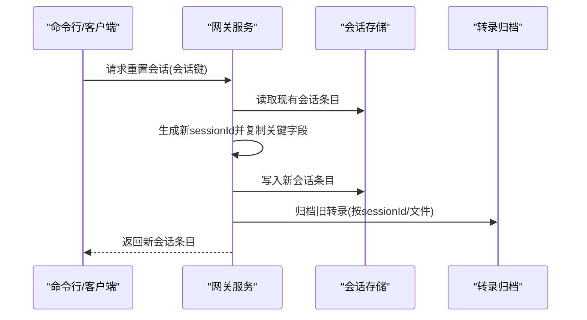
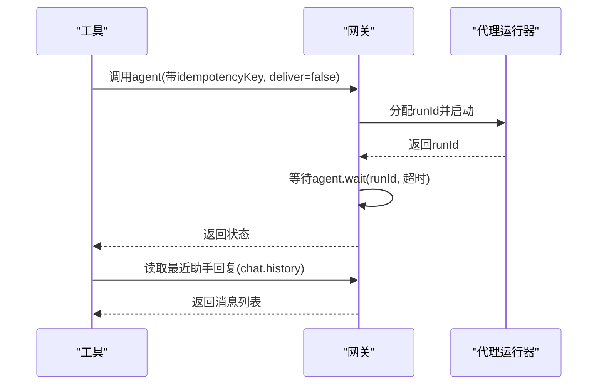
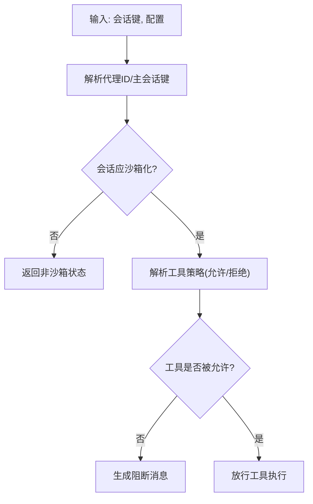
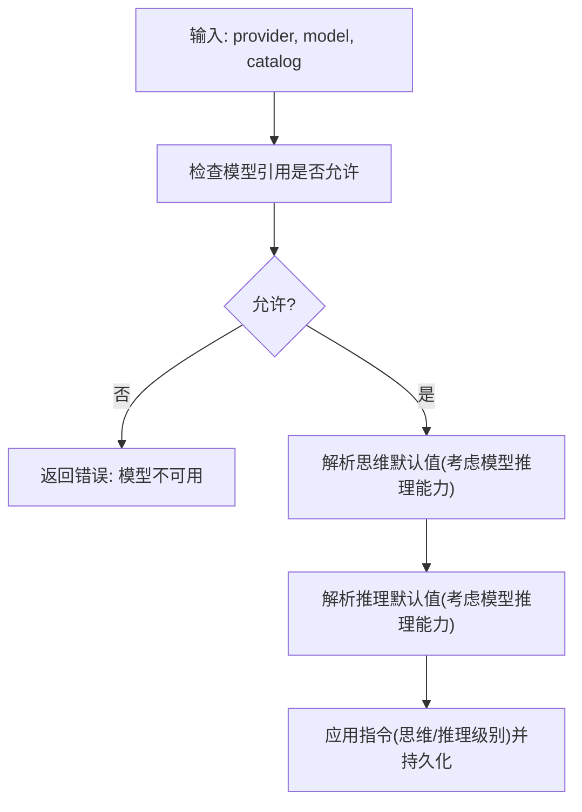
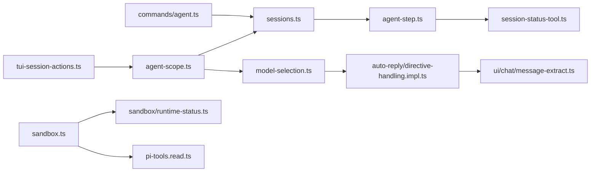

# AI代理系统

<cite>
**本文引用的文件**
- [src/agents/agent-scope.ts](file://src/agents/agent-scope.ts)
- [src/agents/tools/agent-step.ts](file://src/agents/tools/agent-step.ts)
- [src/agents/sandbox.ts](file://src/agents/sandbox.ts)
- [src/agents/sandbox/runtime-status.ts](file://src/agents/sandbox/runtime-status.ts)
- [src/agents/sandbox-agent-config.agent-specific-sandbox-config.test.ts](file://src/agents/sandbox-agent-config.agent-specific-sandbox-config.test.ts)
- [src/agents/pi-tools.read.ts](file://src/agents/pi-tools.read.ts)
- [src/agents/model-selection.ts](file://src/agents/model-selection.ts)
- [src/gateway/server-methods/sessions.ts](file://src/gateway/server-methods/sessions.ts)
- [src/gateway/sessions-patch.ts](file://src/gateway/sessions-patch.ts)
- [src/agents/subagent-depth.ts](file://src/agents/subagent-depth.ts)
- [src/commands/agent.ts](file://src/commands/agent.ts)
- [src/agents/tools/session-status-tool.ts](file://src/agents/tools/session-status-tool.ts)
- [src/auto-reply/reply/directive-handling.impl.ts](file://src/auto-reply/reply/directive-handling.impl.ts)
- [extensions/open-prose/skills/prose/examples/39-architect-by-simulation.prose](file://extensions/open-prose/skills/prose/examples/39-architect-by-simulation.prose)
- [src/tui/tui-session-actions.ts](file://src/tui/tui-session-actions.ts)
- [src/shared/text/reasoning-tags.test.ts](file://src/shared/text/reasoning-tags.test.ts)
- [ui/src/ui/chat/message-extract.ts](file://ui/src/ui/chat/message-extract.ts)
</cite>

## 目录

1. [引言](#引言)
2. [项目结构](#项目结构)
3. [核心组件](#核心组件)
4. [架构总览](#架构总览)
5. [详细组件分析](#详细组件分析)
6. [依赖关系分析](#依赖关系分析)
7. [性能考量](#性能考量)
8. [故障排查指南](#故障排查指南)
9. [结论](#结论)
10. [附录](#附录)

## 引言

本文件面向OpenClaw的AI代理系统，系统性阐述代理的核心架构、智能对话机制、工具调用体系、代理生命周期管理、上下文与会话状态保持、多轮对话处理、工具策略与沙箱安全、模型选择与切换策略、配置与思维模式控制、推理链路与结果缓存优化，并提供代理开发指南、自定义工具创建方法与性能调优建议，以及代理间协作与资源共享策略。

## 项目结构

OpenClaw的AI代理系统由“配置与作用域”“会话与上下文”“工具与执行”“沙箱与安全”“模型选择与切换”“UI与交互”等模块协同组成。下图给出概念性结构示意（非代码映射）：

## 核心组件

- 代理作用域与配置解析：负责代理ID解析、默认代理选择、代理配置合并、工作区与代理目录解析、模型主备选择与回退策略。
- 会话与上下文：负责会话键解析、会话重置与转录归档、会话补丁应用、会话存储读写、子代理深度计算。
- 工具与执行：提供跨会话步骤执行能力、会话状态查询工具、运行时技能快照构建与持久化。
- 沙箱与安全：统一暴露沙箱配置解析、运行态判断、工具策略解析、容器与浏览器沙箱管理；对工具参数进行工作区根路径校验。
- 模型与思维：提供模型默认值与推理级别默认值解析、思维/推理指令处理、UI侧推理标签剥离与文本提取。
- UI与交互：在TUI中应用代理列表、默认代理、会话键与当前代理的联动更新。

章节来源

- file://src/agents/agent-scope.ts#L45-L144
- file://src/gateway/server-methods/sessions.ts#L470-L510
- file://src/gateway/sessions-patch.ts#L65-L87
- file://src/agents/subagent-depth.ts#L50-L155
- file://src/agents/tools/agent-step.ts#L33-L81
- file://src/agents/tools/session-status-tool.ts#L45-L88
- file://src/commands/agent.ts#L485-L522
- file://src/agents/sandbox.ts#L1-L45
- file://src/agents/sandbox/runtime-status.ts#L45-L97
- file://src/agents/pi-tools.read.ts#L611-L654
- file://src/agents/model-selection.ts#L541-L587
- file://src/auto-reply/reply/directive-handling.impl.ts#L243-L302
- file://src/shared/text/reasoning-tags.test.ts#L1-L39
- file://ui/src/ui/chat/message-extract.ts#L99-L149
- file://src/tui/tui-session-actions.ts#L61-L95

## 架构总览

OpenClaw的AI代理系统采用“配置驱动+会话为中心”的分层架构：

- 配置层：代理作用域解析与模型回退策略在此层完成。
- 会话层：会话键标准化、会话重置/归档、会话补丁应用、子代理深度解析在此层完成。
- 执行层：工具调用、跨会话步骤执行、会话状态查询在此层完成。
- 安全层：沙箱配置与运行态解析、工具策略、工作区路径保护在此层完成。
- 表现层：UI中的代理选择、会话键解析与当前代理联动更新在此层完成。

图表来源

- [src/agents/agent-scope.ts](file://src/agents/agent-scope.ts#L45-L144)
- [src/gateway/server-methods/sessions.ts](file://src/gateway/server-methods/sessions.ts#L470-L510)
- [src/gateway/sessions-patch.ts](file://src/gateway/sessions-patch.ts#L65-L87)
- [src/agents/subagent-depth.ts](file://src/agents/subagent-depth.ts#L50-L155)
- [src/agents/tools/agent-step.ts](file://src/agents/tools/agent-step.ts#L33-L81)
- [src/agents/tools/session-status-tool.ts](file://src/agents/tools/session-status-tool.ts#L45-L88)
- [src/commands/agent.ts](file://src/commands/agent.ts#L485-L522)
- [src/agents/sandbox.ts](file://src/agents/sandbox.ts#L1-L45)
- [src/agents/sandbox/runtime-status.ts](file://src/agents/sandbox/runtime-status.ts#L45-L97)
- [src/agents/pi-tools.read.ts](file://src/agents/pi-tools.read.ts#L611-L654)
- [src/agents/model-selection.ts](file://src/agents/model-selection.ts#L541-L587)
- [src/auto-reply/reply/directive-handling.impl.ts](file://src/auto-reply/reply/directive-handling.impl.ts#L243-L302)
- [src/tui/tui-session-actions.ts](file://src/tui/tui-session-actions.ts#L61-L95)

## 详细组件分析

### 代理作用域与配置解析

- 代理ID解析与默认代理选择：支持从会话键解析代理ID，若未显式指定则使用默认代理；当存在多个默认标记时记录警告并使用首个。
- 代理配置合并：解析代理名称、工作区、代理目录、模型主备、技能过滤、心跳、身份、群聊、子代理、沙箱、工具等配置项。
- 模型主备与回退：支持代理级显式模型主备与回退数组覆盖；若会话无模型覆盖，则优先使用代理级覆盖，否则回退到全局默认。
- 工作区与代理目录：支持用户路径解析与默认状态目录拼接；默认代理可使用全局默认工作区或系统默认工作区目录；非默认代理使用状态目录下的独立工作区。

图表来源

- [src/agents/agent-scope.ts](file://src/agents/agent-scope.ts#L71-L144)
- [src/agents/agent-scope.ts](file://src/agents/agent-scope.ts#L187-L253)

章节来源

- file://src/agents/agent-scope.ts#L45-L144
- file://src/agents/agent-scope.ts#L187-L253

### 会话与上下文管理

- 会话键候选与规范化：支持多种会话键格式，包括“agent:...”前缀、主键别名、内部键等；通过候选集匹配定位会话条目。
- 会话重置与转录归档：重置会话时生成新sessionId，保留部分历史字段，同时归档旧转录以避免磁盘占用增长。
- 会话补丁应用：根据会话键解析代理ID与子代理模型提示，合并现有会话条目并更新时间戳。
- 子代理深度解析：支持从会话键推断子代理层级，必要时从会话存储中查找对应条目。

图表来源

- [src/gateway/server-methods/sessions.ts](file://src/gateway/server-methods/sessions.ts#L470-L510)

章节来源

- file://src/gateway/server-methods/sessions.ts#L470-L510
- file://src/gateway/sessions-patch.ts#L65-L87
- file://src/agents/subagent-depth.ts#L50-L155

### 工具与跨会话执行

- 跨会话步骤执行：通过网关调用agent方法发起一次无交付的代理运行，等待运行完成后再读取最新助手回复，实现“步骤化”的多轮对话推进。
- 会话状态查询工具：支持通过会话键解析内部键、主键别名、默认代理前缀等候选，定位会话条目并返回其状态。
- 运行时技能快照：在新建会话或缺失技能快照时，构建工作区技能快照并持久化至会话条目，确保工具可用性与一致性。

图表来源

- [src/agents/tools/agent-step.ts](file://src/agents/tools/agent-step.ts#L33-L81)

章节来源

- file://src/agents/tools/agent-step.ts#L33-L81
- file://src/agents/tools/session-status-tool.ts#L45-L88
- file://src/commands/agent.ts#L485-L522

### 沙箱与安全机制

- 沙箱运行态解析：根据会话键解析代理ID、主会话键、沙箱模式与工具策略，判断会话是否应被沙箱化。
- 工具策略与阻断消息：在沙箱启用时，针对被拒绝的工具调用生成明确的阻断消息，便于用户理解。
- 工作区根路径保护：对工具参数中的路径进行规范化与容器工作目录映射，再进行沙箱路径断言，防止越权访问。
- 测试验证：通过测试用例验证代理特定沙箱配置优先于全局配置、以及不同代理的沙箱模式差异。

图表来源

- [src/agents/sandbox/runtime-status.ts](file://src/agents/sandbox/runtime-status.ts#L45-L97)
- [src/agents/pi-tools.read.ts](file://src/agents/pi-tools.read.ts#L611-L654)
- [src/agents/sandbox-agent-config.agent-specific-sandbox-config.test.ts](file://src/agents/sandbox-agent-config.agent-specific-sandbox-config.test.ts#L196-L254)

章节来源

- file://src/agents/sandbox.ts#L1-L45
- file://src/agents/sandbox/runtime-status.ts#L45-L97
- file://src/agents/pi-tools.read.ts#L611-L654
- file://src/agents/sandbox-agent-config.agent-specific-sandbox-config.test.ts#L196-L254

### 模型选择与切换策略

- 模型引用合法性检查：在解析模型引用时检查是否被允许，若不允许则返回错误。
- 思维/推理默认值：根据代理默认配置与模型目录中的推理能力，决定思维级别与推理级别的默认值。
- 思维/推理指令处理：在自动回复流程中处理思维/推理指令，支持降级（如xhigh不被模型支持时降为high），并持久化会话状态。

图表来源

- [src/agents/model-selection.ts](file://src/agents/model-selection.ts#L541-L587)
- [src/auto-reply/reply/directive-handling.impl.ts](file://src/auto-reply/reply/directive-handling.impl.ts#L243-L302)

章节来源

- file://src/agents/model-selection.ts#L541-L587
- file://src/auto-reply/reply/directive-handling.impl.ts#L243-L302

### 上下文管理、会话状态保持与多轮对话

- 多轮对话推进：通过“跨会话步骤执行”在不同工具之间推进对话，每次执行后读取最新助手回复，形成连续的多轮交互。
- 会话状态保持：在会话条目中保留思维/推理级别、令牌用量、模型与提供方、发送策略、标签、最后通道与接收者、技能快照等，确保状态一致。
- UI侧推理展示：在UI中剥离推理标签并格式化显示，提升阅读体验。

章节来源

- file://src/agents/tools/agent-step.ts#L33-L81
- file://src/gateway/server-methods/sessions.ts#L470-L510
- file://ui/src/ui/chat/message-extract.ts#L99-L149
- file://src/shared/text/reasoning-tags.test.ts#L1-L39

### 代理生命周期管理

- 生命周期事件：会话重置时触发解绑生命周期事件，便于外部监听与清理。
- 代理选择与会话联动：TUI中根据网关返回的代理列表与默认代理设置，初始化当前会话的代理与会话键，并在后续更新头部与底部信息。

章节来源

- file://src/gateway/server-methods/sessions.ts#L501-L510
- file://src/tui/tui-session-actions.ts#L61-L95

### 代理协作与资源共享

- 子代理深度解析：支持从会话键推断子代理层级，必要时从会话存储中查找对应条目，便于跨层级协作。
- 技能快照共享：在新建会话时构建技能快照并持久化，后续运行可复用，减少重复扫描成本。

章节来源

- file://src/agents/subagent-depth.ts#L50-L155
- file://src/commands/agent.ts#L485-L522

## 依赖关系分析

- 组件耦合与内聚：代理作用域解析与模型回退策略高度内聚；会话层与工具层通过网关方法解耦；沙箱层与工具层通过路径保护与策略解析耦合。
- 外部依赖与集成点：工具层依赖网关RPC；UI层依赖会话键与代理选择；模型层依赖模型目录与指令处理；安全层依赖容器与策略配置。
- 循环依赖：未发现明显循环依赖；各层职责清晰，接口稳定。

图表来源

- [src/agents/agent-scope.ts](file://src/agents/agent-scope.ts#L45-L144)
- [src/gateway/server-methods/sessions.ts](file://src/gateway/server-methods/sessions.ts#L470-L510)
- [src/agents/tools/agent-step.ts](file://src/agents/tools/agent-step.ts#L33-L81)
- [src/agents/tools/session-status-tool.ts](file://src/agents/tools/session-status-tool.ts#L45-L88)
- [src/commands/agent.ts](file://src/commands/agent.ts#L485-L522)
- [src/agents/sandbox.ts](file://src/agents/sandbox.ts#L1-L45)
- [src/agents/sandbox/runtime-status.ts](file://src/agents/sandbox/runtime-status.ts#L45-L97)
- [src/agents/pi-tools.read.ts](file://src/agents/pi-tools.read.ts#L611-L654)
- [src/agents/model-selection.ts](file://src/agents/model-selection.ts#L541-L587)
- [src/auto-reply/reply/directive-handling.impl.ts](file://src/auto-reply/reply/directive-handling.impl.ts#L243-L302)
- [ui/src/ui/chat/message-extract.ts](file://ui/src/ui/chat/message-extract.ts#L99-L149)
- [src/tui/tui-session-actions.ts](file://src/tui/tui-session-actions.ts#L61-L95)

## 性能考量

- 会话重置与转录归档：重置会话时清零令牌计数并归档旧转录，避免磁盘膨胀与历史累积。
- 会话补丁应用：仅更新updatedAt等必要字段，减少写放大。
- 工具执行超时：跨会话步骤执行设置合理超时，避免长时间阻塞。
- 技能快照：在新建会话时一次性构建并持久化技能快照，后续复用减少重复扫描。
- 推理标签剥离：UI侧剥离推理标签，减少渲染与传输开销。

章节来源

- file://src/gateway/server-methods/sessions.ts#L470-L510
- file://src/gateway/sessions-patch.ts#L65-L87
- file://src/agents/tools/agent-step.ts#L67-L75
- file://src/commands/agent.ts#L485-L522
- file://src/shared/text/reasoning-tags.test.ts#L1-L39

## 故障排查指南

- 模型不可用：当模型引用不在允许列表时，解析会失败并返回错误；请检查模型目录与允许策略。
- 思维级别不支持：当指令要求xhigh但模型不支持时，系统会降级为high；请确认模型能力或调整指令。
- 沙箱阻断：工具被拒绝时会生成明确阻断消息；请检查代理特定或全局工具策略。
- 会话重置异常：若重置后转录未归档，请检查归档逻辑与权限。
- UI推理显示异常：若推理标签未正确剥离，请检查UI侧文本提取与标签剥离逻辑。

章节来源

- file://src/agents/model-selection.ts#L541-L553
- file://src/auto-reply/reply/directive-handling.impl.ts#L253-L261
- file://src/agents/sandbox/runtime-status.ts#L81-L97
- file://src/gateway/server-methods/sessions.ts#L501-L509
- file://ui/src/ui/chat/message-extract.ts#L99-L149

## 结论

OpenClaw的AI代理系统通过“配置驱动+会话为中心”的架构实现了高内聚、低耦合的代理生命周期管理与工具调用体系。结合沙箱安全机制、模型选择与思维/推理控制、会话状态保持与多轮对话推进，以及UI侧推理标签剥离与缓存优化，系统在安全性、可扩展性与用户体验方面取得良好平衡。建议在实际部署中重点关注模型策略、工具策略与会话归档的配置，以获得最佳性能与稳定性。

## 附录

- 代理开发指南
  - 在代理配置中明确模型主备与回退策略，必要时覆盖全局默认。
  - 使用会话补丁与技能快照机制，确保运行时一致性。
  - 在工具执行中设置合理的超时与幂等键，保障多轮对话稳定性。
- 自定义工具创建
  - 对工具参数进行工作区根路径保护与策略校验，避免越权访问。
  - 明确工具的允许/拒绝策略，必要时在代理特定配置中细化。
- 性能调优建议
  - 合理设置会话重置与转录归档策略，避免磁盘膨胀。
  - 利用技能快照与推理标签剥离减少重复计算与渲染开销。
  - 在自动回复流程中根据模型能力动态调整思维/推理级别。
