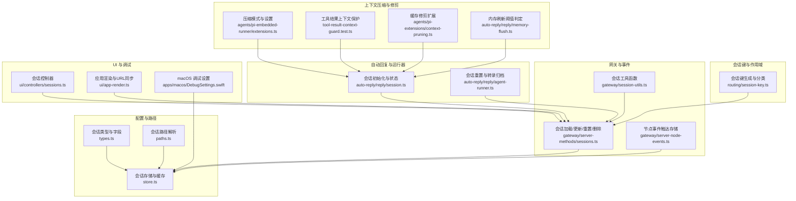
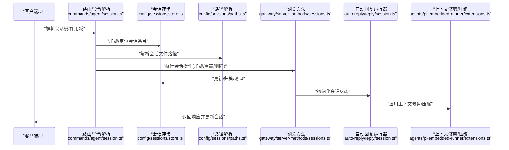
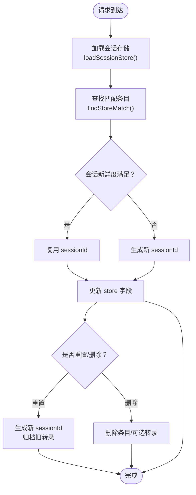
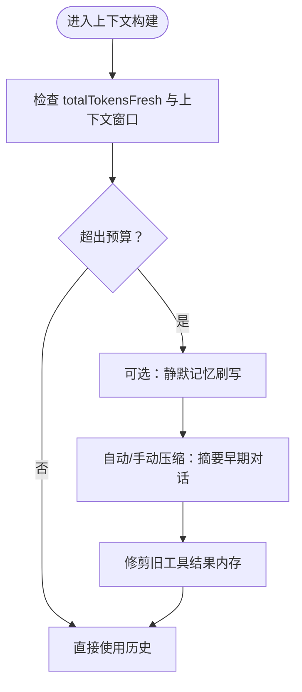
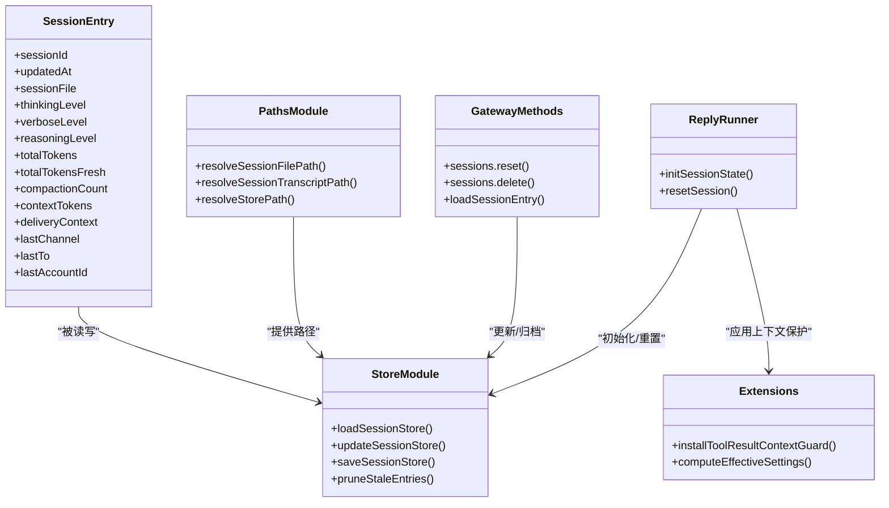

# 上下文与会话

<cite>
**本文引用的文件**
- [src/config/sessions/types.ts](file://src/config/sessions/types.ts)
- [src/config/sessions/paths.ts](file://src/config/sessions/paths.ts)
- [src/config/sessions/store.ts](file://src/config/sessions/store.ts)
- [src/config/sessions/session-file.ts](file://src/config/sessions/session-file.ts)
- [src/commands/agent/session.ts](file://src/commands/agent/session.ts)
- [src/routing/session-key.ts](file://src/routing/session-key.ts)
- [src/gateway/session-utils.ts](file://src/gateway/session-utils.ts)
- [src/gateway/server-methods/sessions.ts](file://src/gateway/server-methods/sessions.ts)
- [src/gateway/server-node-events.ts](file://src/gateway/server-node-events.ts)
- [src/auto-reply/reply/session.ts](file://src/auto-reply/reply/session.ts)
- [src/auto-reply/reply/agent-runner.ts](file://src/auto-reply/reply/agent-runner.ts)
- [src/agents/pi-embedded-runner/extensions.ts](file://src/agents/pi-embedded-runner/extensions.ts)
- [src/agents/pi-extensions/context-pruning.ts](file://src/agents/pi-extensions/context-pruning.ts)
- [src/agents/pi-embedded-runner/tool-result-context-guard.test.ts](file://src/agents/pi-embedded-runner/tool-result-context-guard.test.ts)
- [src/auto-reply/reply/memory-flush.ts](file://src/auto-reply/reply/memory-flush.ts)
- [src/infra/session-maintenance-warning.ts](file://src/infra/session-maintenance-warning.ts)
- [src/cron/isolated-agent/session.ts](file://src/cron/isolated-agent/session.ts)
- [ui/src/ui/controllers/sessions.ts](file://ui/src/ui/controllers/sessions.ts)
- [ui/src/ui/app-render.ts](file://ui/src/ui/app-render.ts)
- [apps/macos/Sources/OpenClaw/DebugSettings.swift](file://apps/macos/Sources/OpenClaw/DebugSettings.swift)
- [docs/concepts/compaction.md](file://docs/concepts/compaction.md)
</cite>

## 目录

1. [引言](#引言)
2. [项目结构](#项目结构)
3. [核心组件](#核心组件)
4. [架构总览](#架构总览)
5. [详细组件分析](#详细组件分析)
6. [依赖关系分析](#依赖关系分析)
7. [性能考量](#性能考量)
8. [故障排查指南](#故障排查指南)
9. [结论](#结论)
10. [附录](#附录)

## 引言

本文件系统性阐述 OpenClaw 的“上下文与会话”体系，覆盖上下文构建机制、会话状态管理、对话历史维护、会话目录结构与标识符生成、数据持久化、上下文窗口限制与压缩策略、关键信息提取、工具结果保护、会话修复与清理策略、配置项与迁移备份、以及多轮对话处理与上下文延续等主题。文档面向不同技术背景读者，既提供高层概览也给出代码级映射与可视化图示。

## 项目结构

OpenClaw 将会话与上下文管理分布在多个子系统：

- 配置与路径解析：会话存储位置、会话文件路径、会话键规范化与分类
- 会话存储与缓存：内存缓存、磁盘 JSON 存储、写入原子性与权限控制
- 会话键与作用域：按发送者/全局/代理维度的会话键生成与解析
- 网关与节点事件：会话加载、更新、重置、删除、生命周期事件
- 自动回复与运行器：会话初始化、状态迁移、会话重置与转录归档
- 上下文压缩与修剪：自动压缩、手动压缩、工具结果保护、缓存修剪
- UI 与调试：会话列表、URL 同步、默认会话创建、macOS 调试设置

图表来源

- [src/config/sessions/types.ts](file://src/config/sessions/types.ts#L68-L174)
- [src/config/sessions/paths.ts](file://src/config/sessions/paths.ts#L250-L265)
- [src/config/sessions/store.ts](file://src/config/sessions/store.ts#L37-L855)
- [src/routing/session-key.ts](file://src/routing/session-key.ts#L46-L80)
- [src/gateway/server-methods/sessions.ts](file://src/gateway/server-methods/sessions.ts#L434-L570)
- [src/gateway/server-node-events.ts](file://src/gateway/server-node-events.ts#L125-L163)
- [src/gateway/session-utils.ts](file://src/gateway/session-utils.ts#L171-L188)
- [src/auto-reply/reply/session.ts](file://src/auto-reply/reply/session.ts#L165-L216)
- [src/auto-reply/reply/agent-runner.ts](file://src/auto-reply/reply/agent-runner.ts#L293-L328)
- [src/agents/pi-embedded-runner/extensions.ts](file://src/agents/pi-embedded-runner/extensions.ts#L30-L62)
- [src/agents/pi-embedded-runner/tool-result-context-guard.test.ts](file://src/agents/pi-embedded-runner/tool-result-context-guard.test.ts#L94-L271)
- [src/agents/pi-extensions/context-pruning.ts](file://src/agents/pi-extensions/context-pruning.ts#L1-L19)
- [src/auto-reply/reply/memory-flush.ts](file://src/auto-reply/reply/memory-flush.ts#L104-L144)
- [ui/src/ui/controllers/sessions.ts](file://ui/src/ui/controllers/sessions.ts#L130-L165)
- [ui/src/ui/app-render.ts](file://ui/src/ui/app-render.ts#L1173-L1233)
- [apps/macos/Sources/OpenClaw/DebugSettings.swift](file://apps/macos/Sources/OpenClaw/DebugSettings.swift#L784-L808)

章节来源

- [src/config/sessions/types.ts](file://src/config/sessions/types.ts#L68-L174)
- [src/config/sessions/paths.ts](file://src/config/sessions/paths.ts#L250-L265)
- [src/config/sessions/store.ts](file://src/config/sessions/store.ts#L37-L855)
- [src/routing/session-key.ts](file://src/routing/session-key.ts#L46-L80)
- [src/gateway/server-methods/sessions.ts](file://src/gateway/server-methods/sessions.ts#L434-L570)
- [src/gateway/server-node-events.ts](file://src/gateway/server-node-events.ts#L125-L163)
- [src/gateway/session-utils.ts](file://src/gateway/session-utils.ts#L171-L188)
- [src/auto-reply/reply/session.ts](file://src/auto-reply/reply/session.ts#L165-L216)
- [src/auto-reply/reply/agent-runner.ts](file://src/auto-reply/reply/agent-runner.ts#L293-L328)
- [src/agents/pi-embedded-runner/extensions.ts](file://src/agents/pi-embedded-runner/extensions.ts#L30-L62)
- [src/agents/pi-embedded-runner/tool-result-context-guard.test.ts](file://src/agents/pi-embedded-runner/tool-result-context-guard.test.ts#L94-L271)
- [src/agents/pi-extensions/context-pruning.ts](file://src/agents/pi-extensions/context-pruning.ts#L1-L19)
- [src/auto-reply/reply/memory-flush.ts](file://src/auto-reply/reply/memory-flush.ts#L104-L144)
- [ui/src/ui/controllers/sessions.ts](file://ui/src/ui/controllers/sessions.ts#L130-L165)
- [ui/src/ui/app-render.ts](file://ui/src/ui/app-render.ts#L1173-L1233)
- [apps/macos/Sources/OpenClaw/DebugSettings.swift](file://apps/macos/Sources/OpenClaw/DebugSettings.swift#L784-L808)

## 核心组件

- 会话条目与字段：定义会话元数据、运行时模型、令牌统计、队列策略、来源与交付上下文等
- 会话存储与缓存：支持跨平台原子写入、缓存 TTL、并发安全、Windows 特殊容错
- 会话路径与文件：会话转录文件命名规则、绝对/相对路径约束、跨根兼容
- 会话键与作用域：按代理、主键、线程、账号/通道等维度生成与规范化
- 会话生命周期：加载、更新、重置、删除、归档、清理与维护
- 上下文压缩与修剪：自动压缩、手动压缩、工具结果保护、缓存修剪
- UI 与调试：会话列表、URL 同步、默认会话创建、macOS 配置保存

章节来源

- [src/config/sessions/types.ts](file://src/config/sessions/types.ts#L68-L174)
- [src/config/sessions/store.ts](file://src/config/sessions/store.ts#L37-L855)
- [src/config/sessions/paths.ts](file://src/config/sessions/paths.ts#L250-L265)
- [src/routing/session-key.ts](file://src/routing/session-key.ts#L46-L80)
- [src/gateway/server-methods/sessions.ts](file://src/gateway/server-methods/sessions.ts#L434-L570)
- [src/agents/pi-embedded-runner/extensions.ts](file://src/agents/pi-embedded-runner/extensions.ts#L30-L62)
- [src/agents/pi-embedded-runner/tool-result-context-guard.test.ts](file://src/agents/pi-embedded-runner/tool-result-context-guard.test.ts#L94-L271)
- [ui/src/ui/controllers/sessions.ts](file://ui/src/ui/controllers/sessions.ts#L130-L165)
- [apps/macos/Sources/OpenClaw/DebugSettings.swift](file://apps/macos/Sources/OpenClaw/DebugSettings.swift#L784-L808)

## 架构总览

OpenClaw 的会话与上下文由“配置层 → 路径层 → 存储层 → 生命周期层 → 运行时上下文层 → UI/调试层”构成，形成闭环：请求到达后解析会话键，定位会话条目与转录文件，按策略决定是否重置/清理，随后进入上下文压缩/修剪流程，最终产出响应并更新会话状态。

图表来源

- [src/commands/agent/session.ts](file://src/commands/agent/session.ts#L42-L108)
- [src/config/sessions/store.ts](file://src/config/sessions/store.ts#L37-L855)
- [src/config/sessions/paths.ts](file://src/config/sessions/paths.ts#L250-L265)
- [src/gateway/server-methods/sessions.ts](file://src/gateway/server-methods/sessions.ts#L434-L570)
- [src/auto-reply/reply/session.ts](file://src/auto-reply/reply/session.ts#L165-L216)
- [src/agents/pi-embedded-runner/extensions.ts](file://src/agents/pi-embedded-runner/extensions.ts#L30-L62)

## 详细组件分析

### 会话条目与字段

- 关键字段包括：sessionId、updatedAt、sessionFile、spawnedBy、forkedFromParent、spawnDepth、systemSent、abortedLastRun、abortCutoffMessageSid、abortCutoffTimestamp、chatType、thinkingLevel、verboseLevel、reasoningLevel、elevatedLevel、ttsAuto、execHost/execSecurity/execAsk/execNode、responseUsage、providerOverride/modelOverride/authProfileOverride、sendPolicy、queueMode/queueDebounceMs/queueCap/queueDrop、input/output/totalTokens、totalTokensFresh、cacheRead/cacheWrite、modelProvider/model/contextTokens、compactionCount/memoryFlushAt/memoryFlushCompactionCount、cliSessionIds/claudeCliSessionId、label/displayName/channel/groupId/subject/groupChannel/space、origin/deliveryContext、lastChannel/lastTo/lastAccountId/lastThreadId、skillsSnapshot/systemPromptReport、activeRunId/activeRunStartedAt、acp 元数据等。
- 字段设计兼顾运行态控制（如队列策略）、成本统计（令牌计数）、来源追踪（origin/deliveryContext）、会话生命周期（abortCutoff、activeRun）与 ACP 集成。

章节来源

- [src/config/sessions/types.ts](file://src/config/sessions/types.ts#L68-L174)

### 会话存储与缓存

- 缓存策略：基于 Map 的内存缓存，支持 TTL 控制，默认约 45 秒；缓存命中与失效判断确保一致性。
- 写入策略：跨平台原子写入，Windows 使用临时文件 + 重命名，失败重试最多 5 次并逐步退避；非 Windows 平台直接 rename 保证原子性。
- 权限与容错：写入后强制 chmod 0600；若目标目录不存在，尝试重建并回退到直接写入；并发读取空文件时通过 Atomics.wait 短暂等待避免竞态。
- 维护策略：支持按时间/数量/大小的清理、轮转与归档；warn-only 模式下不强制清理但发出警告。

章节来源

- [src/config/sessions/store.ts](file://src/config/sessions/store.ts#L37-L855)
- [src/infra/session-maintenance-warning.ts](file://src/infra/session-maintenance-warning.ts#L36-L72)

### 会话路径与文件

- 会话转录文件命名：默认为 sessionId.jsonl；带话题时为 sessionId-topic-<id>.jsonl。
- 路径解析：支持绝对/相对路径、跨代理根目录兼容、结构化路径校验与安全 realpath。
- 会话文件解析：根据 sessionId 与 entry.sessionFile 推导最终路径，必要时回退到默认路径。

章节来源

- [src/config/sessions/paths.ts](file://src/config/sessions/paths.ts#L223-L265)
- [src/config/sessions/session-file.ts](file://src/config/sessions/session-file.ts#L1-L50)

### 会话键与作用域

- 会话键形状分类：缺失、代理键、传统别名、格式错误代理键。
- 代理主键与别名：支持 agent:<id>:<key> 形式，未指定 key 时使用默认主键；对 legacy_or_alias 场景进行规范化。
- 作用域与群组：支持 per-sender/global、DM/群组/频道等多维作用域；线程键支持后缀或前缀两种形式。
- 代理 ID 规范化：路径安全与 shell 友好，非法字符替换并截断长度。

章节来源

- [src/routing/session-key.ts](file://src/routing/session-key.ts#L46-L80)
- [src/routing/session-key.ts](file://src/routing/session-key.ts#L106-L162)
- [src/routing/session-key.ts](file://src/routing/session-key.ts#L222-L242)

### 会话生命周期与状态管理

- 加载：从配置解析 storePath，加载会话存储，查找匹配条目，必要时迁移/修剪键。
- 更新：节点事件触达时更新 store，保留关键字段（如 thinkingLevel/verboseLevel/sendPolicy 等）。
- 重置：生成新 sessionId，清空上次运行标记，重置令牌计数，归档旧转录；支持 ACP 运行时清理。
- 删除：校验不可删除最后一个会话，清理运行时与 ACP，可选删除转录文件。
- 初始化：自动回复入口按作用域与重置策略决定是否复用旧 sessionId；首次使用随机 UUID。

图表来源

- [src/gateway/server-methods/sessions.ts](file://src/gateway/server-methods/sessions.ts#L434-L570)
- [src/gateway/server-node-events.ts](file://src/gateway/server-node-events.ts#L125-L163)
- [src/auto-reply/reply/agent-runner.ts](file://src/auto-reply/reply/agent-runner.ts#L293-L328)

章节来源

- [src/gateway/server-methods/sessions.ts](file://src/gateway/server-methods/sessions.ts#L434-L570)
- [src/gateway/server-node-events.ts](file://src/gateway/server-node-events.ts#L125-L163)
- [src/auto-reply/reply/agent-runner.ts](file://src/auto-reply/reply/agent-runner.ts#L293-L328)

### 对话历史维护与上下文窗口

- 历史维护：会话条目包含 totalTokens、totalTokensFresh、compactionCount、memoryFlushAt 等字段，用于上下文占用评估与压缩触发。
- 上下文窗口来源：依据模型目录中的模型定义解析上下文窗口。
- 自动压缩：接近或超过上下文窗口时触发压缩，将早期对话摘要化并持久化到 JSONL。
- 手动压缩：通过命令强制压缩，可附带聚焦指令。
- 工具结果保护：压缩前优先压缩最早且最冗余的工具结果，避免重复提示“上下文超限”通知，同时丢弃过大的 details 负载以节省空间。
- 缓存修剪：Pi 扩展提供“微压缩”风格的缓存修剪，仅影响当前请求的内存上下文，不重写磁盘历史。

图表来源

- [src/auto-reply/reply/memory-flush.ts](file://src/auto-reply/reply/memory-flush.ts#L104-L144)
- [docs/concepts/compaction.md](file://docs/concepts/compaction.md#L16-L67)
- [src/agents/pi-embedded-runner/tool-result-context-guard.test.ts](file://src/agents/pi-embedded-runner/tool-result-context-guard.test.ts#L94-L271)
- [src/agents/pi-extensions/context-pruning.ts](file://src/agents/pi-extensions/context-pruning.ts#L1-L19)

章节来源

- [src/auto-reply/reply/memory-flush.ts](file://src/auto-reply/reply/memory-flush.ts#L104-L144)
- [docs/concepts/compaction.md](file://docs/concepts/compaction.md#L16-L67)
- [src/agents/pi-embedded-runner/tool-result-context-guard.test.ts](file://src/agents/pi-embedded-runner/tool-result-context-guard.test.ts#L94-L271)
- [src/agents/pi-extensions/context-pruning.ts](file://src/agents/pi-extensions/context-pruning.ts#L1-L19)

### 会话目录结构与标识符生成

- 目录结构：状态根目录下 agents/<agentId>/sessions，转录文件位于该目录，支持跨代理根兼容。
- 会话标识符：validateSessionId 保证合法字符与长度；UI 与网关侧生成唯一 key，格式含 agentId 与时间戳/随机后缀。
- 文件命名：sessionId.jsonl 或 sessionId-topic-<id>.jsonl；路径解析严格限定在 agents/<agentId>/sessions 下。

章节来源

- [src/config/sessions/paths.ts](file://src/config/sessions/paths.ts#L8-L35)
- [src/config/sessions/paths.ts](file://src/config/sessions/paths.ts#L223-L265)
- [src/config/sessions/paths.ts](file://src/config/sessions/paths.ts#L58-L66)
- [ui/src/ui/app-render.ts](file://ui/src/ui/app-render.ts#L1173-L1205)

### 会话数据持久化与迁移备份

- 持久化：会话条目与转录文件分别持久化；条目变更通过 updateSessionStore 原子写入，Windows 使用临时文件 + 重命名。
- 迁移：键迁移与修剪在操作过程中执行，确保 canonicalKey 与 legacyKey 的一致性。
- 备份与轮转：支持按天/大小的轮转与归档，清理旧备份，warn-only 模式下仅告警不清理。

章节来源

- [src/config/sessions/store.ts](file://src/config/sessions/store.ts#L629-L656)
- [src/gateway/server-methods/sessions.ts](file://src/gateway/server-methods/sessions.ts#L468-L508)

### 会话修复与清理策略

- 修复：重置会话生成新 sessionId，清空上次运行标记与令牌计数，归档旧转录；必要时关闭 ACP 运行时。
- 清理：按时间（pruneAfterMs）、数量（maxEntries）、大小（maxDiskBytes/highWaterBytes/rotateBytes）清理；支持 warn-only 模式。
- 维护告警：当活跃会话将被驱逐时，按配置发送维护告警。

章节来源

- [src/gateway/server-methods/sessions.ts](file://src/gateway/server-methods/sessions.ts#L434-L570)
- [src/config/sessions/store.ts](file://src/config/sessions/store.ts#L450-L483)
- [src/infra/session-maintenance-warning.ts](file://src/infra/session-maintenance-warning.ts#L36-L72)

### 会话配置选项与多轮对话

- 配置项：session.scope、session.mainKey、session.resetTriggers、session.maintenance._、agents.defaults.compaction._、agents.defaults.contextPruning.\* 等。
- 多轮对话：通过 sessionKey 与 sessionId 维持连续性；线程键支持 per-thread 会话；群组/频道场景通过 buildGroupHistoryKey 与 resolveThreadSessionKeys 组织。
- 上下文延续：每次请求加载最新条目，保留关键运行态字段（如 thinkingLevel/verboseLevel），并在压缩/修剪后继续延续。

章节来源

- [src/commands/agent/session.ts](file://src/commands/agent/session.ts#L110-L167)
- [src/routing/session-key.ts](file://src/routing/session-key.ts#L210-L242)
- [src/agents/pi-embedded-runner/extensions.ts](file://src/agents/pi-embedded-runner/extensions.ts#L30-L62)

### UI 与调试集成

- 会话列表与 PATCH：UI 支持拉取会话列表与 PATCH 标签/级别；URL 同步与默认会话创建。
- macOS 调试：可配置 session.store 路径，保存到配置 JSON 并确保原子写入。

章节来源

- [ui/src/ui/controllers/sessions.ts](file://ui/src/ui/controllers/sessions.ts#L130-L165)
- [ui/src/ui/app-render.ts](file://ui/src/ui/app-render.ts#L1173-L1233)
- [apps/macos/Sources/OpenClaw/DebugSettings.swift](file://apps/macos/Sources/OpenClaw/DebugSettings.swift#L784-L808)

## 依赖关系分析

- 类型与路径依赖：会话类型定义被存储与路径模块广泛使用；路径模块为存储与文件解析提供基础。
- 生命周期依赖：网关方法依赖存储与路径模块；节点事件负责触达存储更新；自动回复运行器依赖会话初始化与上下文扩展。
- 上下文扩展依赖：压缩/修剪扩展依赖配置与运行时环境；工具结果保护测试覆盖多种溢出场景。

图表来源

- [src/config/sessions/types.ts](file://src/config/sessions/types.ts#L68-L174)
- [src/config/sessions/store.ts](file://src/config/sessions/store.ts#L37-L855)
- [src/config/sessions/paths.ts](file://src/config/sessions/paths.ts#L250-L265)
- [src/gateway/server-methods/sessions.ts](file://src/gateway/server-methods/sessions.ts#L434-L570)
- [src/auto-reply/reply/session.ts](file://src/auto-reply/reply/session.ts#L165-L216)
- [src/agents/pi-embedded-runner/extensions.ts](file://src/agents/pi-embedded-runner/extensions.ts#L30-L62)

章节来源

- [src/config/sessions/types.ts](file://src/config/sessions/types.ts#L68-L174)
- [src/config/sessions/store.ts](file://src/config/sessions/store.ts#L37-L855)
- [src/config/sessions/paths.ts](file://src/config/sessions/paths.ts#L250-L265)
- [src/gateway/server-methods/sessions.ts](file://src/gateway/server-methods/sessions.ts#L434-L570)
- [src/auto-reply/reply/session.ts](file://src/auto-reply/reply/session.ts#L165-L216)
- [src/agents/pi-embedded-runner/extensions.ts](file://src/agents/pi-embedded-runner/extensions.ts#L30-L62)

## 性能考量

- 缓存 TTL：默认约 45 秒，平衡读取性能与一致性；可通过环境变量调整。
- 写入原子性：Windows 使用临时文件 + 重命名并退避重试，避免竞态丢失数据。
- 上下文压缩：在接近上下文窗口时触发，降低传输与推理成本；工具结果保护避免重复截断提示。
- 维护策略：按时间/数量/大小清理，防止磁盘膨胀；warn-only 模式降低破坏性风险。

## 故障排查指南

- 会话重置后转录未更新：确认 sessions.reset 是否归档旧转录并生成新 sessionId；检查 ACP 运行时清理是否成功。
- 会话键冲突或迁移失败：检查 migrateAndPruneSessionStoreKey 的执行与 canonicalKey/legacyKey 匹配。
- Windows 写入失败：关注临时文件 + 重命名的重试逻辑与权限设置；若仍失败，检查父目录是否存在并可写。
- 上下文超限：启用自动压缩或手动 /compact；必要时使用会话修剪减少工具结果堆积。
- 维护告警：根据告警文本调整 session.maintenance.\* 配置，或切换到 enforce 模式。

章节来源

- [src/gateway/server-methods/sessions.ts](file://src/gateway/server-methods/sessions.ts#L434-L570)
- [src/config/sessions/store.ts](file://src/config/sessions/store.ts#L774-L855)
- [src/infra/session-maintenance-warning.ts](file://src/infra/session-maintenance-warning.ts#L36-L72)
- [docs/concepts/compaction.md](file://docs/concepts/compaction.md#L16-L67)

## 结论

OpenClaw 的上下文与会话体系通过严格的类型定义、健壮的存储与路径解析、灵活的会话键与作用域、完善的生命周期管理与上下文压缩/修剪策略，实现了在多渠道、多代理、多轮对话场景下的稳定与高效。配合 UI 与调试能力，用户可在复杂环境中可靠地维护与优化会话状态。

## 附录

- 相关文档：上下文窗口与压缩概念详见 docs/concepts/compaction.md。
- 关键实现参考：
  - 会话条目字段定义：[src/config/sessions/types.ts](file://src/config/sessions/types.ts#L68-L174)
  - 会话存储与缓存：[src/config/sessions/store.ts](file://src/config/sessions/store.ts#L37-L855)
  - 会话路径解析：[src/config/sessions/paths.ts](file://src/config/sessions/paths.ts#L250-L265)
  - 会话键生成与分类：[src/routing/session-key.ts](file://src/routing/session-key.ts#L46-L80)
  - 网关会话操作：[src/gateway/server-methods/sessions.ts](file://src/gateway/server-methods/sessions.ts#L434-L570)
  - 自动回复会话初始化：[src/auto-reply/reply/session.ts](file://src/auto-reply/reply/session.ts#L165-L216)
  - 上下文压缩与保护：[src/agents/pi-embedded-runner/extensions.ts](file://src/agents/pi-embedded-runner/extensions.ts#L30-L62)、[src/agents/pi-embedded-runner/tool-result-context-guard.test.ts](file://src/agents/pi-embedded-runner/tool-result-context-guard.test.ts#L94-L271)
  - UI 与调试：[ui/src/ui/controllers/sessions.ts](file://ui/src/ui/controllers/sessions.ts#L130-L165)、[ui/src/ui/app-render.ts](file://ui/src/ui/app-render.ts#L1173-L1233)、[apps/macos/Sources/OpenClaw/DebugSettings.swift](file://apps/macos/Sources/OpenClaw/DebugSettings.swift#L784-L808)
