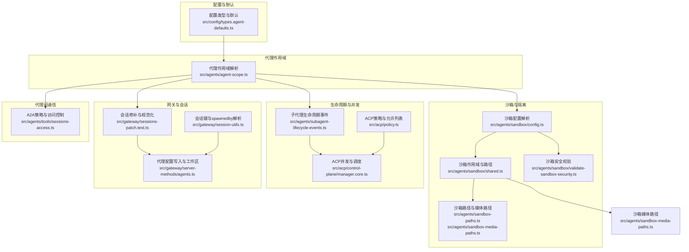
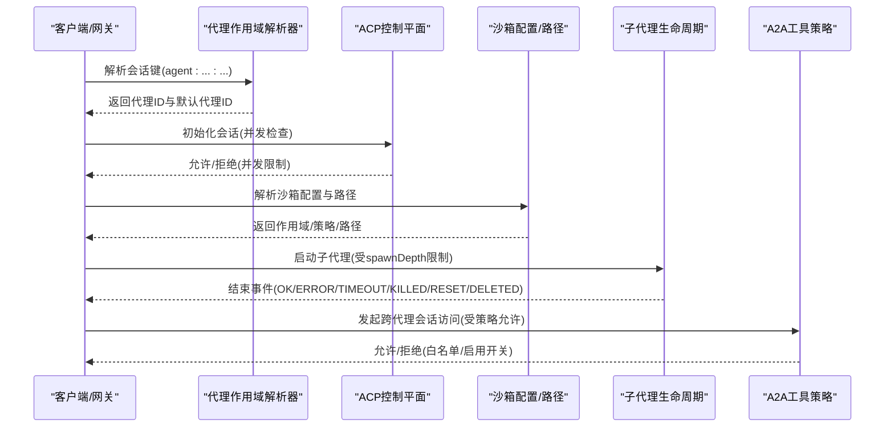
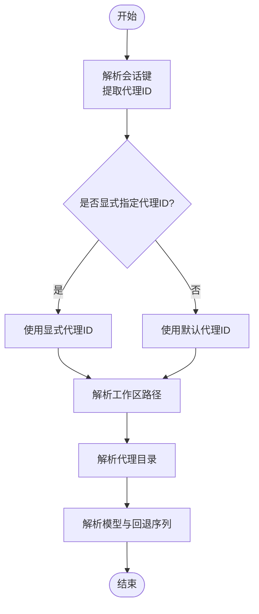
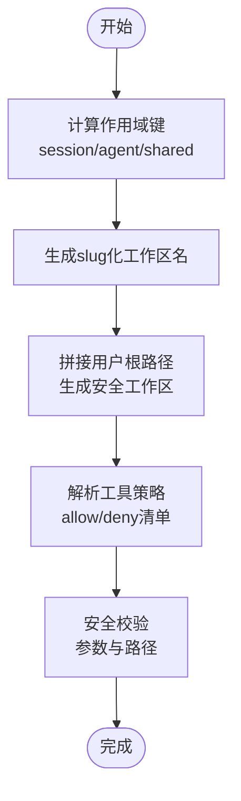
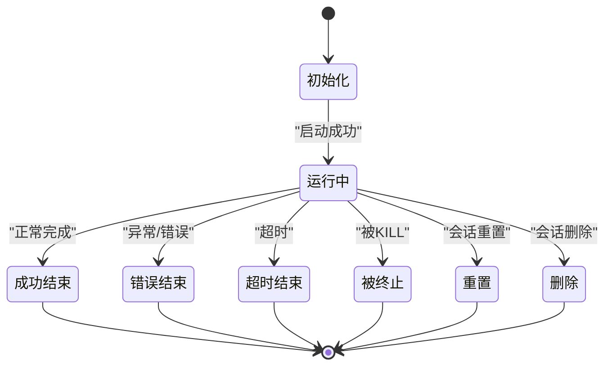
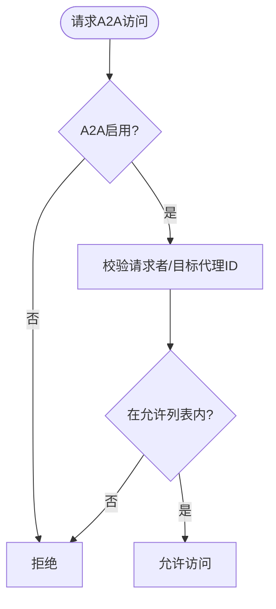
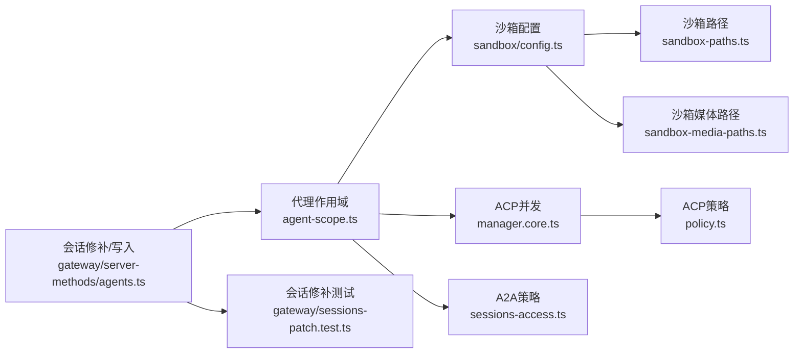

# 代理架构设计

<cite>
**本文引用的文件**
- [README.md](file://README.md)
- [src/agents/agent-scope.ts](file://src/agents/agent-scope.ts)
- [src/config/types.agent-defaults.ts](file://src/config/types.agent-defaults.ts)
- [src/agents/sandbox/config.ts](file://src/agents/sandbox/config.ts)
- [src/agents/sandbox/shared.ts](file://src/agents/sandbox/shared.ts)
- [src/agents/sandbox-agent-config.agent-specific-sandbox-config.test.ts](file://src/agents/sandbox-agent-config.agent-specific-sandbox-config.test.ts)
- [src/gateway/sessions-patch.test.ts](file://src/gateway/sessions-patch.test.ts)
- [src/agents/subagent-lifecycle-events.ts](file://src/agents/subagent-lifecycle-events.ts)
- [apps/macos/Sources/OpenClawProtocol/GatewayModels.swift](file://apps/macos/Sources/OpenClawProtocol/GatewayModels.swift)
- [apps/shared/OpenClawKit/Sources/OpenClawProtocol/GatewayModels.swift](file://apps/shared/OpenClawKit/Sources/OpenClawProtocol/GatewayModels.swift)
- [src/commands/agents.config.ts](file://src/commands/agents.config.ts)
- [src/gateway/server-methods/agents.ts](file://src/gateway/server-methods/agents.ts)
- [src/acp/control-plane/manager.core.ts](file://src/acp/control-plane/manager.core.ts)
- [src/agents/tools/sessions-access.ts](file://src/agents/tools/sessions-access.ts)
- [src/gateway/session-utils.ts](file://src/gateway/session-utils.ts)
- [src/acp/policy.ts](file://src/acp/policy.ts)
- [src/agents/pi-embedded-subscribe.handlers.lifecycle.ts](file://src/agents/pi-embedded-subscribe.handlers.lifecycle.ts)
- [src/agents/pi-embedded-runner/sandbox-info.ts](file://src/agents/pi-embedded-runner/sandbox-info.ts)
- [src/agents/sandbox/validate-sandbox-security.ts](file://src/agents/sandbox/validate-sandbox-security.ts)
- [src/agents/sandbox-paths.ts](file://src/agents/sandbox-paths.ts)
- [src/agents/sandbox-media-paths.ts](file://src/agents/sandbox-media-paths.ts)
- [src/agents/sandbox-create-args.test.ts](file://src/agents/sandbox-create-args.test.ts)
- [src/agents/sandbox-explain.test.ts](file://src/agents/sandbox-explain.test.ts)
- [src/agents/sandbox-merge.test.ts](file://src/agents/sandbox-merge.test.ts)
- [src/agents/sandbox-paths.test.ts](file://src/agents/sandbox-paths.test.ts)
- [src/agents/sandbox-agent-config.agent-specific-sandbox-config.test.ts](file://src/agents/sandbox-agent-config.agent-specific-sandbox-config.test.ts)
- [src/agents/sandbox/config.ts](file://src/agents/sandbox/config.ts)
- [src/agents/sandbox/shared.ts](file://src/agents/sandbox/shared.ts)
- [src/agents/sandbox-agent-config.agent-specific-sandbox-config.test.ts](file://src/agents/sandbox-agent-config.agent-specific-sandbox-config.test.ts)
- [src/gateway/sessions-patch.test.ts](file://src/gateway/sessions-patch.test.ts)
- [src/agents/subagent-lifecycle-events.ts](file://src/agents/subagent-lifecycle-events.ts)
- [apps/macos/Sources/OpenClawProtocol/GatewayModels.swift](file://apps/macos/Sources/OpenClawProtocol/GatewayModels.swift)
- [apps/shared/OpenClawKit/Sources/OpenClawProtocol/GatewayModels.swift](file://apps/shared/OpenClawKit/Sources/OpenClawProtocol/GatewayModels.swift)
- [src/commands/agents.config.ts](file://src/commands/agents.config.ts)
- [src/gateway/server-methods/agents.ts](file://src/gateway/server-methods/agents.ts)
- [src/acp/control-plane/manager.core.ts](file://src/acp/control-plane/manager.core.ts)
- [src/agents/tools/sessions-access.ts](file://src/agents/tools/sessions-access.ts)
- [src/gateway/session-utils.ts](file://src/gateway/session-utils.ts)
- [src/acp/policy.ts](file://src/acp/policy.ts)
- [src/agents/pi-embedded-subscribe.handlers.lifecycle.ts](file://src/agents/pi-embedded-subscribe.handlers.lifecycle.ts)
- [src/agents/pi-embedded-runner/sandbox-info.ts](file://src/agents/pi-embedded-runner/sandbox-info.ts)
- [src/agents/sandbox/validate-sandbox-security.ts](file://src/agents/sandbox/validate-sandbox-security.ts)
- [src/agents/sandbox-paths.ts](file://src/agents/sandbox-paths.ts)
- [src/agents/sandbox-media-paths.ts](file://src/agents/sandbox-media-paths.ts)
- [src/agents/sandbox-create-args.test.ts](file://src/agents/sandbox-create-args.test.ts)
- [src/agents/sandbox-explain.test.ts](file://src/agents/sandbox-explain.test.ts)
- [src/agents/sandbox-merge.test.ts](file://src/agents/sandbox-merge.test.ts)
- [src/agents/sandbox-paths.test.ts](file://src/agents/sandbox-paths.test.ts)
</cite>

## 目录

1. [简介](#简介)
2. [项目结构](#项目结构)
3. [核心组件](#核心组件)
4. [架构总览](#架构总览)
5. [详细组件分析](#详细组件分析)
6. [依赖关系分析](#依赖关系分析)
7. [性能考量](#性能考量)
8. [故障排查指南](#故障排查指南)
9. [结论](#结论)
10. [附录](#附录)

## 简介

本文件面向OpenClaw代理架构设计，系统性阐述AI代理的核心架构模式、代理生命周期管理与代理作用域机制。文档聚焦以下主题：

- 代理生命周期：从初始化、运行到结束的全链路管理，含并发限制与重试策略。
- 代理作用域：会话键解析、代理ID解析、工作区与目录解析、默认与覆盖策略。
- 沙箱隔离：容器化运行、工具策略、路径挂载与安全校验。
- 代理间通信：A2A路由策略、跨会话访问控制与并发约束。
- 配置体系：全局默认、代理级覆盖、会话级修补与持久化。
- 安全边界：ACP策略、执行主机与节点控制、权限与隔离。
- 开发最佳实践：并发控制、资源分配、调试与可观测性。

## 项目结构

OpenClaw采用分层与功能模块结合的组织方式，代理相关逻辑主要集中在src/agents与src/config下，并通过网关服务暴露对外接口。核心目录与职责概览：

- src/agents：代理作用域、沙箱、子代理生命周期、工具与会话访问控制等。
- src/config：类型定义与默认配置，包括代理默认项、模型、上下文修剪、流式块、心跳、并发与沙箱等。
- src/gateway：会话修补、代理配置写入、服务器方法等。
- src/acp：ACP控制平面与策略，含并发限制与调度策略。
- apps/\*：平台侧协议模型（如macOS/Shared Swift）用于客户端交互。

图表来源

- [src/config/types.agent-defaults.ts](file://src/config/types.agent-defaults.ts#L120-L269)
- [src/agents/agent-scope.ts](file://src/agents/agent-scope.ts#L85-L110)
- [src/agents/sandbox/config.ts](file://src/agents/sandbox/config.ts#L170-L188)
- [src/agents/sandbox/shared.ts](file://src/agents/sandbox/shared.ts#L24-L46)
- [src/agents/sandbox/validate-sandbox-security.ts](file://src/agents/sandbox/validate-sandbox-security.ts)
- [src/agents/sandbox-paths.ts](file://src/agents/sandbox-paths.ts)
- [src/agents/sandbox-media-paths.ts](file://src/agents/sandbox-media-paths.ts)
- [src/agents/subagent-lifecycle-events.ts](file://src/agents/subagent-lifecycle-events.ts#L32-L47)
- [src/acp/control-plane/manager.core.ts](file://src/acp/control-plane/manager.core.ts#L1108-L1125)
- [src/acp/policy.ts](file://src/acp/policy.ts#L48-L69)
- [src/gateway/sessions-patch.test.ts](file://src/gateway/sessions-patch.test.ts#L293-L334)
- [src/gateway/server-methods/agents.ts](file://src/gateway/server-methods/agents.ts#L463-L492)
- [src/gateway/session-utils.ts](file://src/gateway/session-utils.ts#L454-L488)
- [src/agents/tools/sessions-access.ts](file://src/agents/tools/sessions-access.ts#L90-L134)

章节来源

- [README.md](file://README.md#L1-L546)

## 核心组件

- 代理作用域解析器：负责解析会话键中的代理ID、默认代理ID、工作区与代理目录，支持覆盖与默认回退。
- 沙箱配置解析器：根据全局与代理级配置，解析沙箱模式、范围、工具策略与清理策略。
- 子代理生命周期事件：定义子代理结束原因与结果映射，支撑会话派生与回收。
- ACP并发与策略：限制并发会话数量、校验代理白名单、拒绝非法调度。
- 会话修补与规范化：对会话字段进行归一化处理，确保执行主机、安全策略、发送策略等一致。
- 代理间通信策略：基于A2A工具的允许列表与启用开关，实现跨代理的安全访问。
- 平台协议模型：Swift侧的网关模型定义，承载会话元数据与控制字段。

章节来源

- [src/agents/agent-scope.ts](file://src/agents/agent-scope.ts#L85-L110)
- [src/agents/sandbox/config.ts](file://src/agents/sandbox/config.ts#L170-L188)
- [src/agents/subagent-lifecycle-events.ts](file://src/agents/subagent-lifecycle-events.ts#L32-L47)
- [src/acp/control-plane/manager.core.ts](file://src/acp/control-plane/manager.core.ts#L1108-L1125)
- [src/gateway/sessions-patch.test.ts](file://src/gateway/sessions-patch.test.ts#L293-L334)
- [src/agents/tools/sessions-access.ts](file://src/agents/tools/sessions-access.ts#L90-L134)
- [apps/macos/Sources/OpenClawProtocol/GatewayModels.swift](file://apps/macos/Sources/OpenClawProtocol/GatewayModels.swift#L1157-L1191)
- [apps/shared/OpenClawKit/Sources/OpenClawProtocol/GatewayModels.swift](file://apps/shared/OpenClawKit/Sources/OpenClawProtocol/GatewayModels.swift#L1157-L1191)

## 架构总览

OpenClaw的代理架构以“会话键”为核心，贯穿代理作用域、沙箱隔离、生命周期管理与跨代理通信。整体流程如下：

- 会话键解析：从输入会话键中提取代理ID，若未显式指定则回退至默认代理。
- 代理配置解析：合并全局默认与代理级覆盖，确定工作区、模型、工具策略与沙箱配置。
- 运行时控制：通过ACP控制并发与调度，确保会话上限与无交叉污染。
- 沙箱隔离：按作用域（会话/代理/共享）生成工作区与挂载路径，应用工具策略与安全校验。
- 生命周期管理：子代理结束事件驱动回收与归档，支持深度限制与并发控制。
- 代理间通信：A2A工具受策略控制，仅允许白名单内的代理互访。

图表来源

- [src/agents/agent-scope.ts](file://src/agents/agent-scope.ts#L85-L110)
- [src/acp/control-plane/manager.core.ts](file://src/acp/control-plane/manager.core.ts#L1108-L1125)
- [src/agents/sandbox/config.ts](file://src/agents/sandbox/config.ts#L170-L188)
- [src/agents/sandbox/shared.ts](file://src/agents/sandbox/shared.ts#L24-L46)
- [src/agents/subagent-lifecycle-events.ts](file://src/agents/subagent-lifecycle-events.ts#L32-L47)
- [src/agents/tools/sessions-access.ts](file://src/agents/tools/sessions-access.ts#L90-L134)

## 详细组件分析

### 代理作用域与配置解析

- 会话键解析：支持从“agent:agentId:...”中提取代理ID，若未显式提供则回退到默认代理ID。
- 默认代理ID：当存在多个默认标记时，记录警告并使用首个条目作为默认。
- 工作区与代理目录：优先使用代理配置，其次回退到全局默认或状态目录下的命名空间。
- 模型主备：支持显式代理模型与全局默认模型，以及模型回退序列的覆盖与继承。

图表来源

- [src/agents/agent-scope.ts](file://src/agents/agent-scope.ts#L85-L110)
- [src/agents/agent-scope.ts](file://src/agents/agent-scope.ts#L255-L282)
- [src/agents/agent-scope.ts](file://src/agents/agent-scope.ts#L169-L190)

章节来源

- [src/agents/agent-scope.ts](file://src/agents/agent-scope.ts#L85-L110)
- [src/agents/agent-scope.ts](file://src/agents/agent-scope.ts#L255-L282)
- [src/agents/agent-scope.ts](file://src/agents/agent-scope.ts#L169-L190)

### 沙箱隔离与容器化部署

- 沙箱模式与范围：支持全局与代理级覆盖，作用域包括会话、代理与共享三种。
- 工具策略：允许/禁止工具清单，结合会话键生成安全的沙箱工作区。
- 路径与媒体：根据作用域生成slug化的安全工作区路径，限定媒体与临时文件生命周期。
- 安全校验：对沙箱参数进行合法性校验，防止越权与路径穿越。

图表来源

- [src/agents/sandbox/shared.ts](file://src/agents/sandbox/shared.ts#L24-L46)
- [src/agents/sandbox-paths.ts](file://src/agents/sandbox-paths.ts)
- [src/agents/sandbox-media-paths.ts](file://src/agents/sandbox-media-paths.ts)
- [src/agents/sandbox/validate-sandbox-security.ts](file://src/agents/sandbox/validate-sandbox-security.ts)

章节来源

- [src/agents/sandbox/config.ts](file://src/agents/sandbox/config.ts#L170-L188)
- [src/agents/sandbox/shared.ts](file://src/agents/sandbox/shared.ts#L24-L46)
- [src/agents/sandbox/validate-sandbox-security.ts](file://src/agents/sandbox/validate-sandbox-security.ts)
- [src/agents/sandbox-paths.ts](file://src/agents/sandbox-paths.ts)
- [src/agents/sandbox-media-paths.ts](file://src/agents/sandbox-media-paths.ts)

### 代理生命周期管理

- 子代理结束结果：根据结束原因映射为OK/ERROR/TIMEOUT/KILLED/RESET/DELETED，便于上层回收与归档。
- 并发限制：ACP控制平面维护运行时缓存，按actorKey去重，超过配置上限抛出错误。
- 会话修补：对execHost/execSecurity/execAsk/execNode/sendPolicy/groupActivation等字段进行规范化，保证一致性。

图表来源

- [src/agents/subagent-lifecycle-events.ts](file://src/agents/subagent-lifecycle-events.ts#L32-L47)
- [src/acp/control-plane/manager.core.ts](file://src/acp/control-plane/manager.core.ts#L1108-L1125)
- [src/gateway/sessions-patch.test.ts](file://src/gateway/sessions-patch.test.ts#L293-L334)

章节来源

- [src/agents/subagent-lifecycle-events.ts](file://src/agents/subagent-lifecycle-events.ts#L32-L47)
- [src/acp/control-plane/manager.core.ts](file://src/acp/control-plane/manager.core.ts#L1108-L1125)
- [src/gateway/sessions-patch.test.ts](file://src/gateway/sessions-patch.test.ts#L293-L334)

### 代理间通信协议与资源共享

- A2A策略：启用开关与允许列表，支持通配符匹配，避免自环与跨域访问。
- 访问控制：对history/send/list三类操作分别前缀化，便于审计与日志追踪。
- 会话派生：canonicalizeSpawnedByForAgent处理“spawnedBy”别名解析，确保主会话别名正确。

图表来源

- [src/agents/tools/sessions-access.ts](file://src/agents/tools/sessions-access.ts#L90-L134)
- [src/gateway/session-utils.ts](file://src/gateway/session-utils.ts#L465-L488)

章节来源

- [src/agents/tools/sessions-access.ts](file://src/agents/tools/sessions-access.ts#L90-L134)
- [src/gateway/session-utils.ts](file://src/gateway/session-utils.ts#L465-L488)

### 配置模板、默认参数与自定义选项

- 全局默认：模型、图像模型、模型目录、工作区、时间格式、打字指示、块流式、人类延迟、心跳、并发、子代理默认、沙箱等。
- 代理级覆盖：通过agents.list中的条目覆盖全局默认，支持name/workspace/agentDir/model/skills等字段。
- 会话修补：通过sessions_patch规范化字段，确保执行主机、安全策略、发送策略等一致。
- ACP策略：允许列表与调度禁用错误消息，保障只允许白名单代理进入ACP路径。

章节来源

- [src/config/types.agent-defaults.ts](file://src/config/types.agent-defaults.ts#L120-L269)
- [src/commands/agents.config.ts](file://src/commands/agents.config.ts#L126-L177)
- [src/gateway/server-methods/agents.ts](file://src/gateway/server-methods/agents.ts#L463-L492)
- [src/gateway/sessions-patch.test.ts](file://src/gateway/sessions-patch.test.ts#L293-L334)
- [src/acp/policy.ts](file://src/acp/policy.ts#L48-L69)

## 依赖关系分析

- 代理作用域依赖会话键解析与默认代理ID解析，向上游提供工作区与模型信息。
- 沙箱配置依赖代理作用域解析结果，结合全局与代理级策略生成最终运行环境。
- ACP并发控制依赖代理作用域与会话键，确保并发上限与无交叉污染。
- A2A工具策略依赖配置与代理ID，实现细粒度的跨代理访问控制。
- 网关侧的会话修补与代理配置写入，确保运行期状态与持久化配置一致。

图表来源

- [src/agents/agent-scope.ts](file://src/agents/agent-scope.ts#L85-L110)
- [src/agents/sandbox/config.ts](file://src/agents/sandbox/config.ts#L170-L188)
- [src/agents/sandbox-paths.ts](file://src/agents/sandbox-paths.ts)
- [src/agents/sandbox-media-paths.ts](file://src/agents/sandbox-media-paths.ts)
- [src/acp/control-plane/manager.core.ts](file://src/acp/control-plane/manager.core.ts#L1108-L1125)
- [src/acp/policy.ts](file://src/acp/policy.ts#L48-L69)
- [src/gateway/server-methods/agents.ts](file://src/gateway/server-methods/agents.ts#L463-L492)
- [src/gateway/sessions-patch.test.ts](file://src/gateway/sessions-patch.test.ts#L293-L334)

章节来源

- [src/agents/agent-scope.ts](file://src/agents/agent-scope.ts#L85-L110)
- [src/agents/sandbox/config.ts](file://src/agents/sandbox/config.ts#L170-L188)
- [src/agents/sandbox-paths.ts](file://src/agents/sandbox-paths.ts)
- [src/agents/sandbox-media-paths.ts](file://src/agents/sandbox-media-paths.ts)
- [src/acp/control-plane/manager.core.ts](file://src/acp/control-plane/manager.core.ts#L1108-L1125)
- [src/acp/policy.ts](file://src/acp/policy.ts#L48-L69)
- [src/gateway/server-methods/agents.ts](file://src/gateway/server-methods/agents.ts#L463-L492)
- [src/gateway/sessions-patch.test.ts](file://src/gateway/sessions-patch.test.ts#L293-L334)

## 性能考量

- 并发控制：通过ACP的maxConcurrentSessions限制同时运行的会话数量，避免资源争用与进程抖动。
- 块流式与人类延迟：合理配置块流式边界与人类延迟，平衡实时性与用户体验。
- 上下文修剪：启用contextPruning减少历史工具调用带来的token占用，降低推理成本。
- 心跳与预压缩：利用heartbeat与compaction预处理，保持上下文窗口健康。
- 沙箱清理：通过idleHours与maxAgeDays清理闲置沙箱，释放磁盘与容器资源。

## 故障排查指南

- 并发超限：当达到ACP并发上限时抛出错误，检查配置与当前活跃会话数。
- 未知代理ID：在请求代理方法时若代理ID不在已知列表中，返回无效请求错误。
- 会话修补失败：对非子代理会话设置spawnDepth会被拒绝，需确认会话类型。
- ACP调度禁用：若ACP被策略禁用，将返回明确的错误消息，检查allowedAgents与调度策略。
- A2A访问被拒：检查tools.agentToAgent.enabled与allow列表，确保请求者与目标均在白名单内。

章节来源

- [src/acp/control-plane/manager.core.ts](file://src/acp/control-plane/manager.core.ts#L1108-L1125)
- [src/gateway/server-methods/agent.ts](file://src/gateway/server-methods/agent.ts#L260-L275)
- [src/gateway/sessions-patch.test.ts](file://src/gateway/sessions-patch.test.ts#L293-L334)
- [src/acp/policy.ts](file://src/acp/policy.ts#L48-L69)
- [src/agents/tools/sessions-access.ts](file://src/agents/tools/sessions-access.ts#L90-L134)

## 结论

OpenClaw的代理架构以“会话键—代理作用域—沙箱隔离—生命周期—并发控制—跨代理通信”为主线，形成高内聚、低耦合且安全可控的运行体系。通过全局默认与代理级覆盖的灵活配置、严格的沙箱安全校验与ACP并发限制，以及A2A工具策略的细粒度访问控制，系统在保证安全性的同时提供了良好的扩展性与可运维性。建议在生产环境中结合上下文修剪、块流式与人类延迟等特性，持续优化性能与用户体验。

## 附录

- 平台协议模型字段：包含key、label、thinkingLevel、verboseLevel、reasoningLevel、responseUsage、elevatedLevel、execHost、execSecurity、execAsk、execNode、model、spawnedBy、spawnDepth、sendPolicy、groupActivation等，用于客户端侧的会话状态展示与控制。

章节来源

- [apps/macos/Sources/OpenClawProtocol/GatewayModels.swift](file://apps/macos/Sources/OpenClawProtocol/GatewayModels.swift#L1157-L1191)
- [apps/shared/OpenClawKit/Sources/OpenClawProtocol/GatewayModels.swift](file://apps/shared/OpenClawKit/Sources/OpenClawProtocol/GatewayModels.swift#L1157-L1191)
