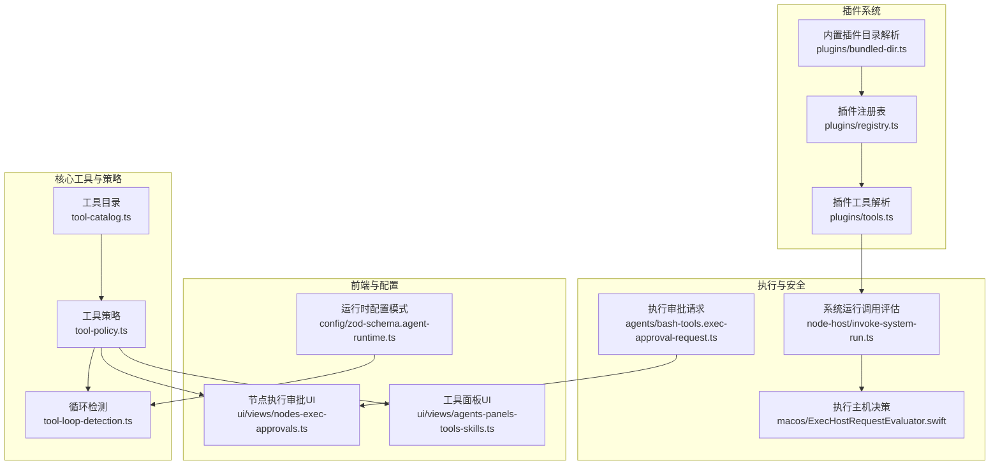
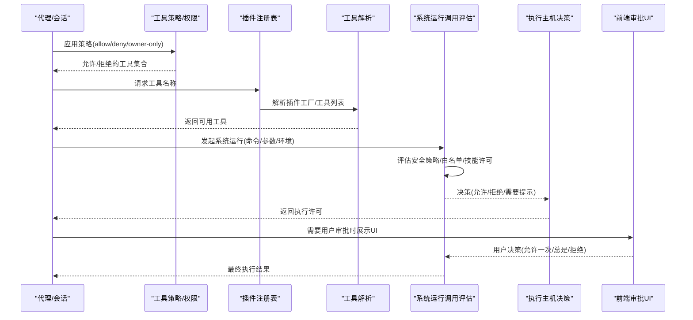
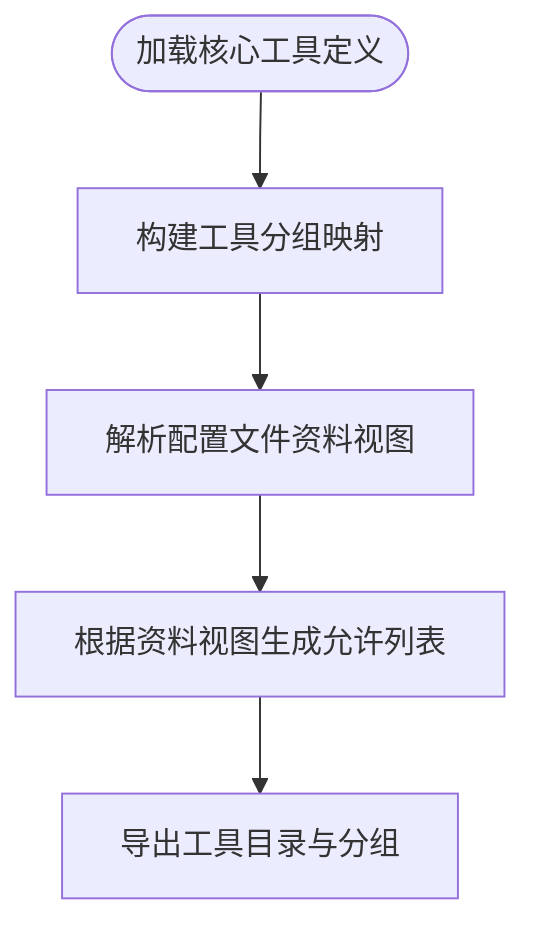
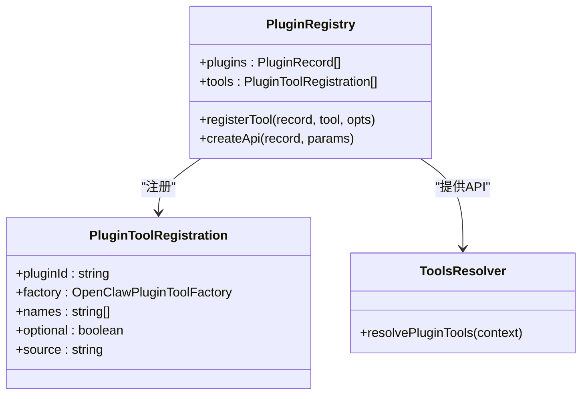
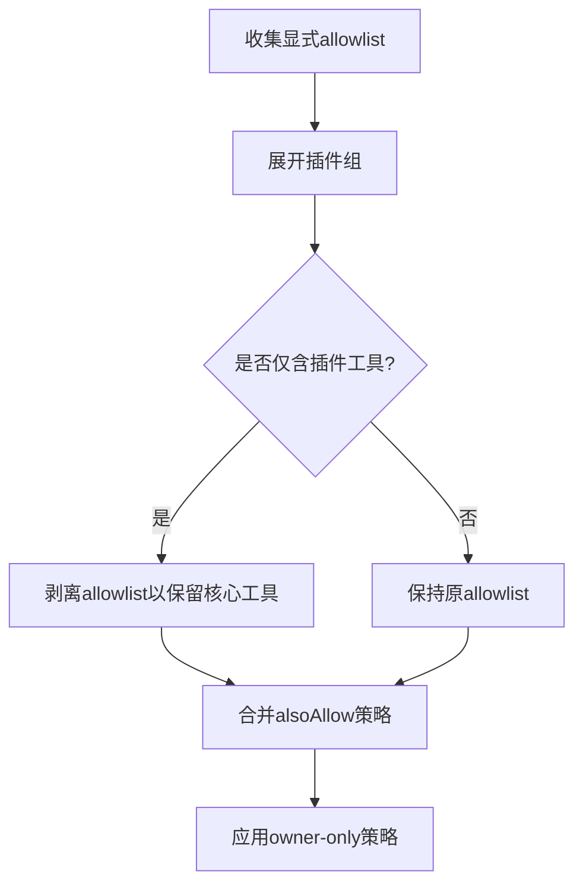
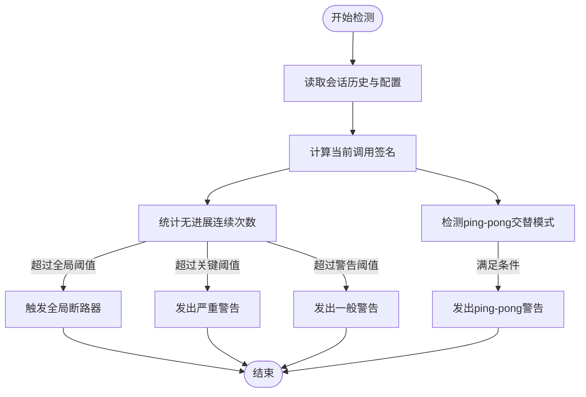
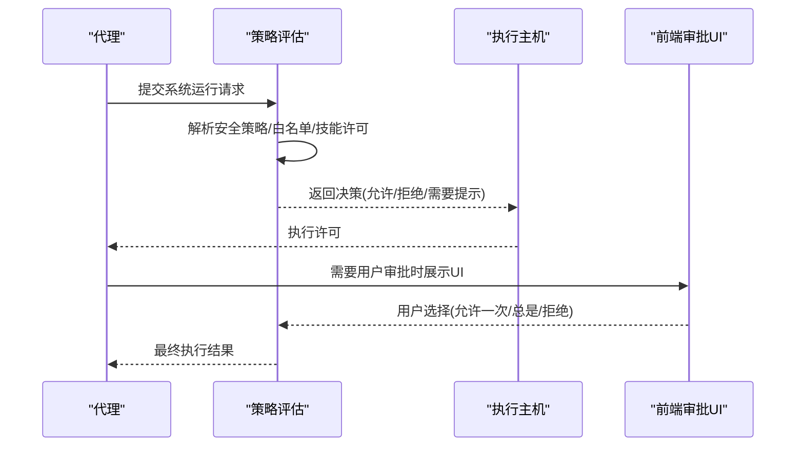
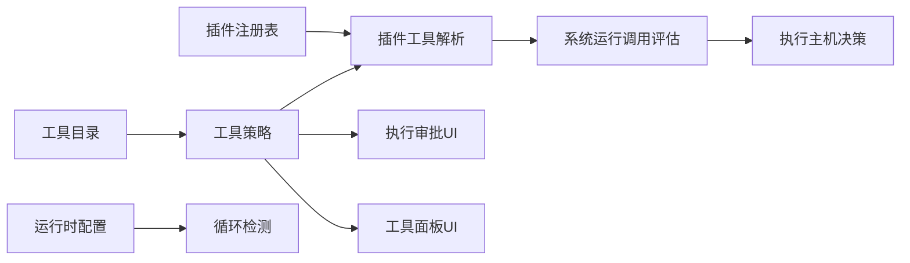

# 工具系统

<cite>
**本文引用的文件**
- [src/agents/tool-catalog.ts](file://src/agents/tool-catalog.ts)
- [src/agents/tool-policy.ts](file://src/agents/tool-policy.ts)
- [src/agents/tool-policy.conformance.ts](file://src/agents/tool-policy.conformance.ts)
- [src/agents/tool-policy-pipeline.test.ts](file://src/agents/tool-policy-pipeline.test.ts)
- [src/agents/tool-loop-detection.ts](file://src/agents/tool-loop-detection.ts)
- [src/agents/tool-loop-detection.test.ts](file://src/agents/tool-loop-detection.test.ts)
- [src/agents/tools/common.ts](file://src/agents/tools/common.ts)
- [src/plugins/registry.ts](file://src/plugins/registry.ts)
- [src/plugins/tools.ts](file://src/plugins/tools.ts)
- [src/plugins/tools.optional.test.ts](file://src/plugins/tools.optional.test.ts)
- [src/plugins/bundled-dir.ts](file://src/plugins/bundled-dir.ts)
- [src/node-host/invoke-system-run.ts](file://src/node-host/invoke-system-run.ts)
- [src/node-host/exec-policy.test.ts](file://src/node-host/exec-policy.test.ts)
- [src/agents/bash-tools.exec-approval-request.ts](file://src/agents/bash-tools.exec-approval-request.ts)
- [apps/macos/Sources/OpenClaw/ExecHostRequestEvaluator.swift](file://apps/macos/Sources/OpenClaw/ExecHostRequestEvaluator.swift)
- [apps/macos/Sources/OpenClawProtocol/GatewayModels.swift](file://apps/macos/Sources/OpenClawProtocol/GatewayModels.swift)
- [apps/shared/OpenClawKit/Sources/OpenClawProtocol/GatewayModels.swift](file://apps/shared/OpenClawKit/Sources/OpenClawProtocol/GatewayModels.swift)
- [ui/src/ui/views/nodes-exec-approvals.ts](file://ui/src/ui/views/nodes-exec-approvals.ts)
- [ui/src/ui/views/agents-panels-tools-skills.ts](file://ui/src/ui/views/agents-panels-tools-skills.ts)
- [src/config/zod-schema.agent-runtime.ts](file://src/config/zod-schema.agent-runtime.ts)
- [extensions/feishu/src/tool-factory-test-harness.ts](file://extensions/feishu/src/tool-factory-test-harness.ts)
- [src/commands/doctor-config-flow.ts](file://src/commands/doctor-config-flow.ts)
- [ui/src/ui/usage-helpers.ts](file://ui/src/ui/usage-helpers.ts)
</cite>

## 目录

1. [简介](#简介)
2. [项目结构](#项目结构)
3. [核心组件](#核心组件)
4. [架构总览](#架构总览)
5. [详细组件分析](#详细组件分析)
6. [依赖关系分析](#依赖关系分析)
7. [性能考量](#性能考量)
8. [故障排查指南](#故障排查指南)
9. [结论](#结论)
10. [附录](#附录)

## 简介

本文件系统性阐述 OpenClaw 工具系统的设计与实现，覆盖工具架构、注册机制、调用策略、分类体系、权限与安全策略、执行环境与结果处理、错误恢复、内置工具集、自定义工具开发与扩展、配置管理、性能监控与调试技巧，以及工具间依赖、工具链组合与结果缓存优化等主题。目标是帮助开发者与运维人员快速理解并高效使用与扩展工具系统。

## 项目结构

OpenClaw 的工具系统由“核心工具目录”“插件工具注册与解析”“工具策略与权限”“循环检测与安全策略”“执行与审批流程”“前端配置与可视化”等模块协同构成。下图给出与工具系统相关的高层结构映射：

图表来源

- [src/agents/tool-catalog.ts](file://src/agents/tool-catalog.ts#L1-L327)
- [src/agents/tool-policy.ts](file://src/agents/tool-policy.ts#L1-L206)
- [src/agents/tool-loop-detection.ts](file://src/agents/tool-loop-detection.ts#L1-L624)
- [src/plugins/registry.ts](file://src/plugins/registry.ts#L1-L520)
- [src/plugins/tools.ts](file://src/plugins/tools.ts#L112-L139)
- [src/plugins/bundled-dir.ts](file://src/plugins/bundled-dir.ts#L1-L41)
- [src/node-host/invoke-system-run.ts](file://src/node-host/invoke-system-run.ts#L228-L266)
- [apps/macos/Sources/OpenClaw/ExecHostRequestEvaluator.swift](file://apps/macos/Sources/OpenClaw/ExecHostRequestEvaluator.swift#L40-L84)
- [src/agents/bash-tools.exec-approval-request.ts](file://src/agents/bash-tools.exec-approval-request.ts#L127-L153)
- [ui/src/ui/views/nodes-exec-approvals.ts](file://ui/src/ui/views/nodes-exec-approvals.ts#L347-L361)
- [ui/src/ui/views/agents-panels-tools-skills.ts](file://ui/src/ui/views/agents-panels-tools-skills.ts#L20-L100)
- [src/config/zod-schema.agent-runtime.ts](file://src/config/zod-schema.agent-runtime.ts#L433-L468)

章节来源

- [src/agents/tool-catalog.ts](file://src/agents/tool-catalog.ts#L1-L327)
- [src/plugins/registry.ts](file://src/plugins/registry.ts#L1-L520)

## 核心组件

- 工具目录与分组：定义核心工具清单、分组与配置文件中的“资料视图”（如“Minimal/Coding/Messaging/Full”）。
- 插件注册与工具解析：统一注册插件工具，去重与冲突处理，支持可选工具按需启用。
- 工具策略与权限：基于 allow/deny 与插件组展开，支持 owner-only 限制与策略管道清理。
- 循环检测：对重复调用、轮询无进展、全局断路器与 ping-pong 模式进行检测与告警/阻断。
- 执行与审批：系统运行策略评估、用户交互审批、跨平台执行主机决策。
- 前端配置与可视化：工具面板、执行审批 UI、工具使用统计与摘要。

章节来源

- [src/agents/tool-catalog.ts](file://src/agents/tool-catalog.ts#L1-L327)
- [src/plugins/registry.ts](file://src/plugins/registry.ts#L172-L197)
- [src/plugins/tools.ts](file://src/plugins/tools.ts#L112-L139)
- [src/agents/tool-policy.ts](file://src/agents/tool-policy.ts#L1-L206)
- [src/agents/tool-loop-detection.ts](file://src/agents/tool-loop-detection.ts#L1-L624)
- [src/node-host/invoke-system-run.ts](file://src/node-host/invoke-system-run.ts#L228-L266)
- [src/agents/bash-tools.exec-approval-request.ts](file://src/agents/bash-tools.exec-approval-request.ts#L127-L153)
- [ui/src/ui/views/agents-panels-tools-skills.ts](file://ui/src/ui/views/agents-panels-tools-skills.ts#L20-L100)
- [ui/src/ui/views/nodes-exec-approvals.ts](file://ui/src/ui/views/nodes-exec-approvals.ts#L347-L361)

## 架构总览

OpenClaw 工具系统采用“策略驱动 + 插件化 + 安全闭环”的架构：

- 策略层：工具策略与权限模型，支持插件组展开、策略管道清理与 owner-only 保护。
- 注册层：插件注册表统一收集工具、钩子、HTTP 路由、CLI 命令等，并进行去重与冲突诊断。
- 执行层：系统运行调用评估结合安全策略、用户审批与可选技能白名单，生成允许/拒绝/需要提示的决策。
- 监控与防护：循环检测在会话状态中记录历史，动态识别无进展与 ping-pong 模式并触发告警或阻断。
- 可视化与配置：前端提供工具面板与执行审批界面，运行时配置支持循环检测阈值与探测器开关。

图表来源

- [src/agents/tool-policy.ts](file://src/agents/tool-policy.ts#L1-L206)
- [src/plugins/registry.ts](file://src/plugins/registry.ts#L172-L197)
- [src/plugins/tools.ts](file://src/plugins/tools.ts#L112-L139)
- [src/node-host/invoke-system-run.ts](file://src/node-host/invoke-system-run.ts#L228-L266)
- [apps/macos/Sources/OpenClaw/ExecHostRequestEvaluator.swift](file://apps/macos/Sources/OpenClaw/ExecHostRequestEvaluator.swift#L40-L84)
- [src/agents/bash-tools.exec-approval-request.ts](file://src/agents/bash-tools.exec-approval-request.ts#L127-L153)
- [ui/src/ui/views/nodes-exec-approvals.ts](file://ui/src/ui/views/nodes-exec-approvals.ts#L347-L361)

## 详细组件分析

### 工具分类与目录

- 核心工具按功能分组（如文件系统、运行时、Web、内存、会话、UI、消息、自动化、节点、代理、媒体），并支持“OpenClaw 组合”聚合。
- 提供“Minimal/Coding/Messaging/Full”配置文件中的资料视图，用于快速切换工具集范围。
- 支持工具 ID 到分组的映射与工具概览查询。

图表来源

- [src/agents/tool-catalog.ts](file://src/agents/tool-catalog.ts#L27-L327)

章节来源

- [src/agents/tool-catalog.ts](file://src/agents/tool-catalog.ts#L1-L327)

### 插件工具注册与解析

- 注册表统一收集工具、钩子、HTTP 路由、CLI 命令等；对工具名进行去重与冲突诊断。
- 工具解析阶段对可选工具进行按需启用，避免默认屏蔽核心工具。
- 支持从内置插件目录解析扩展包路径，便于打包与部署。

图表来源

- [src/plugins/registry.ts](file://src/plugins/registry.ts#L172-L197)
- [src/plugins/tools.ts](file://src/plugins/tools.ts#L112-L139)
- [src/plugins/bundled-dir.ts](file://src/plugins/bundled-dir.ts#L1-L41)

章节来源

- [src/plugins/registry.ts](file://src/plugins/registry.ts#L1-L520)
- [src/plugins/tools.ts](file://src/plugins/tools.ts#L112-L139)
- [src/plugins/tools.optional.test.ts](file://src/plugins/tools.optional.test.ts#L74-L112)
- [src/plugins/bundled-dir.ts](file://src/plugins/bundled-dir.ts#L1-L41)

### 工具策略与权限

- 支持 allow/deny 列表与插件组展开；当仅包含插件工具时自动剥离 allowlist，防止误禁核心工具。
- 提供 owner-only 工具策略，对非所有者发送者进行限制或过滤。
- 提供策略管道测试用例，验证在特定场景下的策略行为。

图表来源

- [src/agents/tool-policy.ts](file://src/agents/tool-policy.ts#L70-L206)
- [src/agents/tool-policy-pipeline.test.ts](file://src/agents/tool-policy-pipeline.test.ts#L1-L25)

章节来源

- [src/agents/tool-policy.ts](file://src/agents/tool-policy.ts#L1-L206)
- [src/agents/tool-policy-pipeline.test.ts](file://src/agents/tool-policy-pipeline.test.ts#L1-L25)
- [src/agents/tool-policy.conformance.ts](file://src/agents/tool-policy.conformance.ts#L1-L17)

### 循环检测与安全策略

- 对相同工具+参数的重复调用、轮询无进展、全局断路器与 ping-pong 模式进行检测。
- 记录工具调用历史与结果哈希，维护滑动窗口，支持统计查询与调试。
- 运行时配置支持开启/关闭与阈值调整，确保在不同场景下平衡安全与可用性。

图表来源

- [src/agents/tool-loop-detection.ts](file://src/agents/tool-loop-detection.ts#L372-L495)
- [src/agents/tool-loop-detection.ts](file://src/agents/tool-loop-detection.ts#L497-L523)
- [src/agents/tool-loop-detection.ts](file://src/agents/tool-loop-detection.ts#L525-L588)
- [src/agents/tool-loop-detection.ts](file://src/agents/tool-loop-detection.ts#L590-L624)
- [src/config/zod-schema.agent-runtime.ts](file://src/config/zod-schema.agent-runtime.ts#L433-L468)

章节来源

- [src/agents/tool-loop-detection.ts](file://src/agents/tool-loop-detection.ts#L1-L624)
- [src/agents/tool-loop-detection.test.ts](file://src/agents/tool-loop-detection.test.ts#L106-L140)
- [src/config/zod-schema.agent-runtime.ts](file://src/config/zod-schema.agent-runtime.ts#L433-L468)

### 执行环境与审批流程

- 系统运行调用评估综合安全策略、用户审批、可选技能白名单与可信二进制策略，决定允许/拒绝/需要提示。
- 执行主机在 macOS 上根据安全级别与审批决策生成最终策略决策。
- 前端提供节点执行审批 UI，支持默认与代理级安全/询问策略配置。

图表来源

- [src/node-host/invoke-system-run.ts](file://src/node-host/invoke-system-run.ts#L228-L266)
- [apps/macos/Sources/OpenClaw/ExecHostRequestEvaluator.swift](file://apps/macos/Sources/OpenClaw/ExecHostRequestEvaluator.swift#L40-L84)
- [src/agents/bash-tools.exec-approval-request.ts](file://src/agents/bash-tools.exec-approval-request.ts#L127-L153)
- [ui/src/ui/views/nodes-exec-approvals.ts](file://ui/src/ui/views/nodes-exec-approvals.ts#L347-L361)

章节来源

- [src/node-host/invoke-system-run.ts](file://src/node-host/invoke-system-run.ts#L228-L266)
- [apps/macos/Sources/OpenClaw/ExecHostRequestEvaluator.swift](file://apps/macos/Sources/OpenClaw/ExecHostRequestEvaluator.swift#L40-L84)
- [src/agents/bash-tools.exec-approval-request.ts](file://src/agents/bash-tools.exec-approval-request.ts#L127-L153)
- [ui/src/ui/views/nodes-exec-approvals.ts](file://ui/src/ui/views/nodes-exec-approvals.ts#L347-L361)

### 工具结果处理与错误恢复

- 工具输入参数读取与校验，提供字符串、数字、数组等通用读取器与错误类型。
- 结果封装与图片结果处理，支持内容与详情分离、图片安全净化。
- 错误恢复：循环检测在严重情况下触发全局断路器阻断，避免资源浪费；审批超时/过期按回退策略处理。

章节来源

- [src/agents/tools/common.ts](file://src/agents/tools/common.ts#L26-L341)
- [src/agents/tool-loop-detection.ts](file://src/agents/tool-loop-detection.ts#L372-L495)
- [src/agents/bash-tools.exec-approval-request.ts](file://src/agents/bash-tools.exec-approval-request.ts#L127-L153)

### 自定义工具开发与扩展机制

- 插件通过 registerTool 注册工具或工具工厂，支持多工具返回与上下文参数。
- 工具工厂测试夹具提供解析工具的能力，便于在测试环境中验证工具解析逻辑。
- 可选工具默认不启用，可通过显式允许列表启用。

章节来源

- [src/plugins/registry.ts](file://src/plugins/registry.ts#L172-L197)
- [extensions/feishu/src/tool-factory-test-harness.ts](file://extensions/feishu/src/tool-factory-test-harness.ts#L37-L76)
- [src/plugins/tools.optional.test.ts](file://src/plugins/tools.optional.test.ts#L74-L112)

### 工具链组合与依赖关系

- 工具目录提供“OpenClaw 组合”与各功能分组，便于按场景组合工具链。
- 策略层支持插件组展开，避免误禁核心工具；同时可对仅插件工具的 allowlist 进行清理。
- 前端工具面板支持基于资料视图与覆盖项（alsoAllow/deny）的组合与可视化。

章节来源

- [src/agents/tool-catalog.ts](file://src/agents/tool-catalog.ts#L261-L278)
- [src/agents/tool-policy.ts](file://src/agents/tool-policy.ts#L110-L149)
- [ui/src/ui/views/agents-panels-tools-skills.ts](file://ui/src/ui/views/agents-panels-tools-skills.ts#L20-L100)

### 工具结果缓存优化

- 循环检测通过固定长度的历史窗口与结果哈希，避免无限增长与大输出带来的开销。
- 对轮询类工具的结果进行稳定哈希，识别无进展模式并提前阻断。

章节来源

- [src/agents/tool-loop-detection.ts](file://src/agents/tool-loop-detection.ts#L501-L523)
- [src/agents/tool-loop-detection.ts](file://src/agents/tool-loop-detection.ts#L525-L588)

## 依赖关系分析

- 工具目录与策略：工具目录为策略提供工具清单与分组；策略为工具解析与执行提供权限边界。
- 插件注册与解析：注册表负责收集与去重；解析器负责按需启用与冲突处理。
- 执行与审批：系统运行调用评估依赖策略与审批；执行主机决策依赖平台实现。
- 前端与配置：工具面板与执行审批 UI 依赖策略与配置模式；运行时配置影响循环检测行为。

图表来源

- [src/agents/tool-catalog.ts](file://src/agents/tool-catalog.ts#L1-L327)
- [src/agents/tool-policy.ts](file://src/agents/tool-policy.ts#L1-L206)
- [src/plugins/registry.ts](file://src/plugins/registry.ts#L1-L520)
- [src/plugins/tools.ts](file://src/plugins/tools.ts#L112-L139)
- [src/node-host/invoke-system-run.ts](file://src/node-host/invoke-system-run.ts#L228-L266)
- [apps/macos/Sources/OpenClaw/ExecHostRequestEvaluator.swift](file://apps/macos/Sources/OpenClaw/ExecHostRequestEvaluator.swift#L40-L84)
- [ui/src/ui/views/nodes-exec-approvals.ts](file://ui/src/ui/views/nodes-exec-approvals.ts#L347-L361)
- [ui/src/ui/views/agents-panels-tools-skills.ts](file://ui/src/ui/views/agents-panels-tools-skills.ts#L20-L100)
- [src/config/zod-schema.agent-runtime.ts](file://src/config/zod-schema.agent-runtime.ts#L433-L468)

章节来源

- [src/agents/tool-catalog.ts](file://src/agents/tool-catalog.ts#L1-L327)
- [src/agents/tool-policy.ts](file://src/agents/tool-policy.ts#L1-L206)
- [src/plugins/registry.ts](file://src/plugins/registry.ts#L1-L520)
- [src/plugins/tools.ts](file://src/plugins/tools.ts#L112-L139)
- [src/node-host/invoke-system-run.ts](file://src/node-host/invoke-system-run.ts#L228-L266)
- [apps/macos/Sources/OpenClaw/ExecHostRequestEvaluator.swift](file://apps/macos/Sources/OpenClaw/ExecHostRequestEvaluator.swift#L40-L84)
- [ui/src/ui/views/nodes-exec-approvals.ts](file://ui/src/ui/views/nodes-exec-approvals.ts#L347-L361)
- [ui/src/ui/views/agents-panels-tools-skills.ts](file://ui/src/ui/views/agents-panels-tools-skills.ts#L20-L100)
- [src/config/zod-schema.agent-runtime.ts](file://src/config/zod-schema.agent-runtime.ts#L433-L468)

## 性能考量

- 循环检测使用固定大小历史窗口与哈希摘要，避免内存膨胀与大结果处理成本。
- 策略管道在仅插件工具的 allowlist 场景下自动剥离，减少不必要的策略扫描。
- 前端工具面板与执行审批 UI 采用轻量渲染与懒加载策略，降低交互延迟。

## 故障排查指南

- 循环检测告警：关注“重复调用/轮询无进展/全局断路器/ ping-pong”等告警信息，检查工具参数稳定性与调用频率。
- 执行被拒：确认安全策略、白名单匹配、用户审批状态与可选技能许可；查看前端审批 UI 的提示与回退策略。
- 工具未注册：检查插件注册表诊断日志与工具名冲突；确认可选工具是否已通过允许列表启用。
- 配置漂移：使用策略一致性快照与配置模式校验，确保策略与实现一致。

章节来源

- [src/agents/tool-loop-detection.ts](file://src/agents/tool-loop-detection.ts#L372-L495)
- [src/node-host/invoke-system-run.ts](file://src/node-host/invoke-system-run.ts#L228-L266)
- [src/plugins/registry.ts](file://src/plugins/registry.ts#L168-L170)
- [src/plugins/tools.optional.test.ts](file://src/plugins/tools.optional.test.ts#L74-L112)
- [src/agents/tool-policy.conformance.ts](file://src/agents/tool-policy.conformance.ts#L1-L17)
- [src/commands/doctor-config-flow.ts](file://src/commands/doctor-config-flow.ts#L1516-L1569)

## 结论

OpenClaw 工具系统通过“策略驱动 + 插件化 + 安全闭环”的设计，在保证安全性的同时提供了高度可扩展的工具生态。其核心能力包括完善的工具分类与目录、灵活的插件注册与解析、严格的工具策略与权限控制、智能的循环检测与安全策略、清晰的执行与审批流程，以及友好的前端配置与可视化。建议在生产环境中结合运行时配置与前端 UI，持续监控工具使用情况与安全事件，确保工具链的稳定与安全。

## 附录

- 工具使用统计与摘要：前端工具摘要解析可用于生成工具使用报告，辅助性能与合规审计。

章节来源

- [ui/src/ui/usage-helpers.ts](file://ui/src/ui/usage-helpers.ts#L292-L321)
