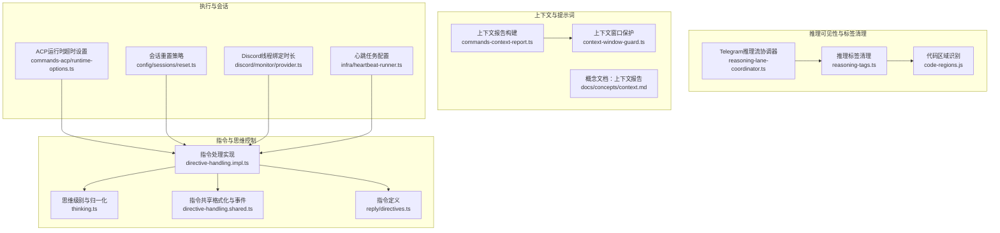
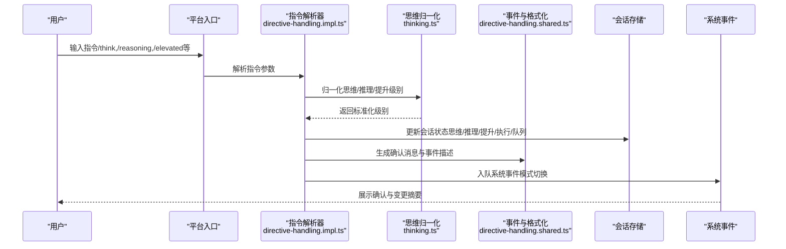
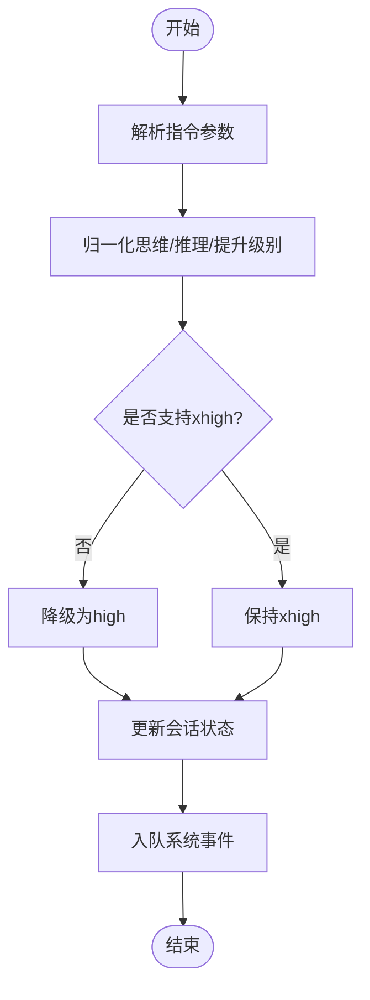
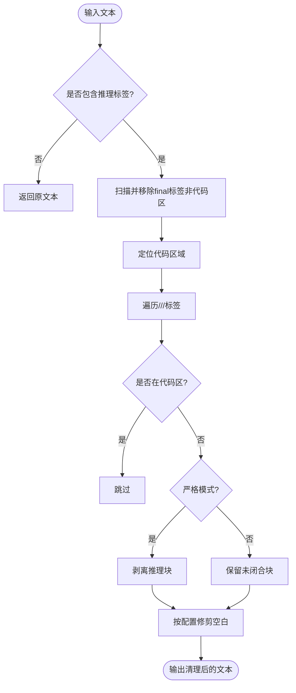
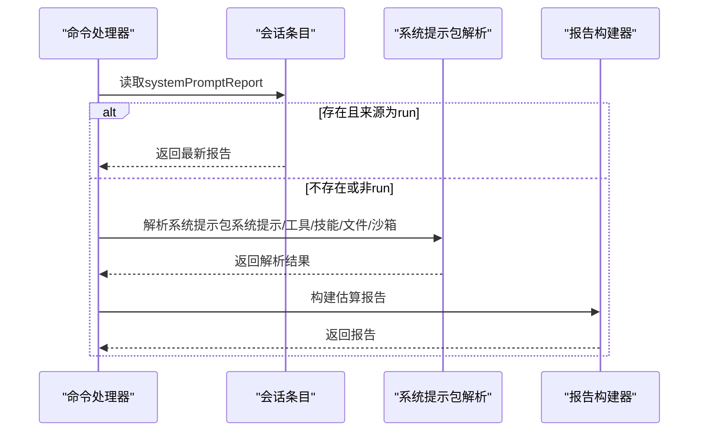
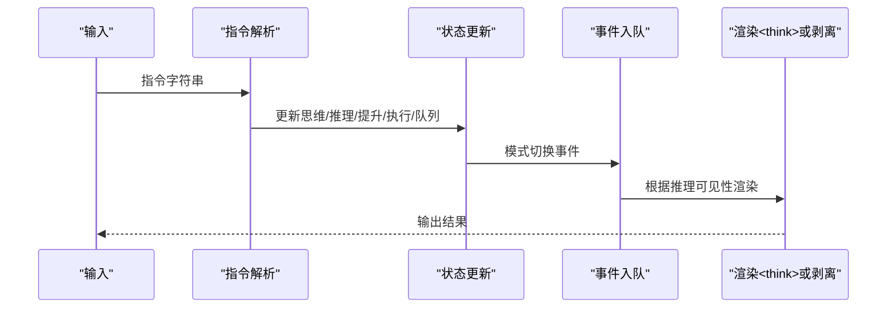
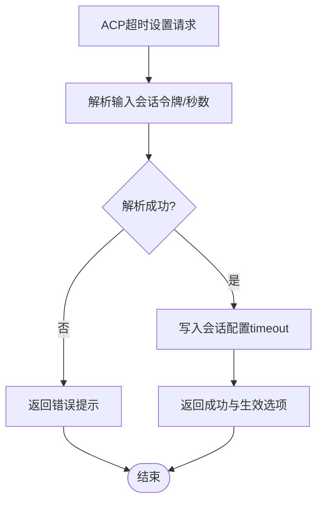
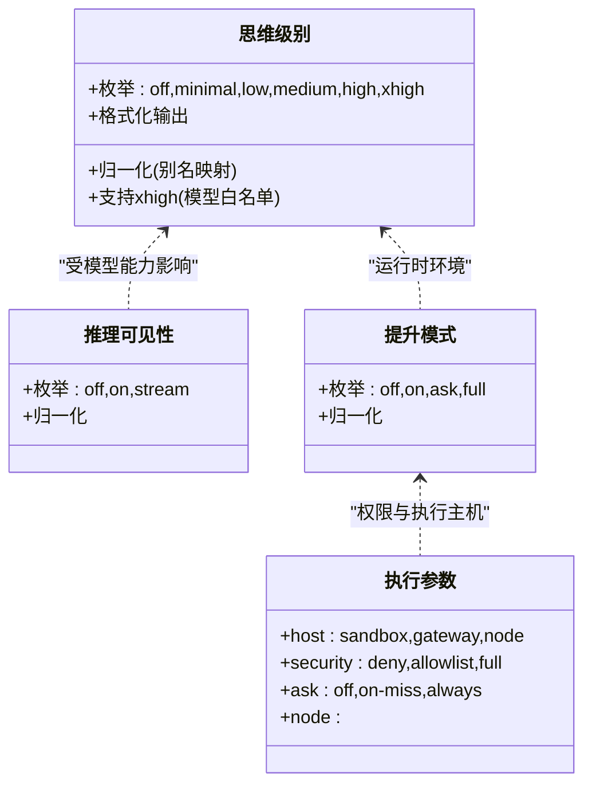
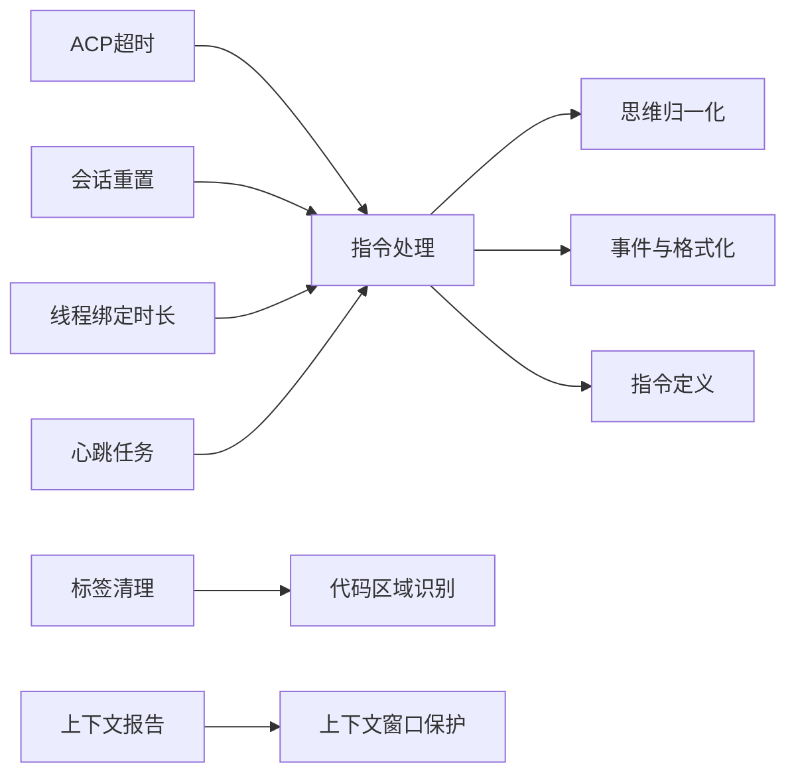

# 思维与推理

<cite>
**本文引用的文件**
- [src/auto-reply/thinking.ts](file://src/auto-reply/thinking.ts)
- [src/auto-reply/reply/directive-handling.impl.ts](file://src/auto-reply/reply/directive-handling.impl.ts)
- [src/auto-reply/reply/directive-handling.shared.ts](file://src/auto-reply/reply/directive-handling.shared.ts)
- [src/shared/text/reasoning-tags.ts](file://src/shared/text/reasoning-tags.ts)
- [src/telegram/reasoning-lane-coordinator.ts](file://src/telegram/reasoning-lane-coordinator.ts)
- [src/agents/pi-embedded-runner/thinking.ts](file://src/agents/pi-embedded-runner/thinking.ts)
- [src/auto-reply/reply/directives.ts](file://src/auto-reply/reply/directives.ts)
- [src/auto-reply/reply/directive-handling.model.ts](file://src/auto-reply/reply/directive-handling.model.ts)
- [src/auto-reply/reply/directive-handling.queue-validation.ts](file://src/auto-reply/reply/directive-handling.queue-validation.ts)
- [src/auto-reply/reply/directive-handling.params.ts](file://src/auto-reply/reply/directive-handling.params.ts)
- [src/auto-reply/reply/commands-session.ts](file://src/auto-reply/reply/commands-session.ts)
- [src/auto-reply/reply/commands-acp/runtime-options.ts](file://src/auto-reply/reply/commands-acp/runtime-options.ts)
- [src/auto-reply/reply/commands-context-report.ts](file://src/auto-reply/reply/commands-context-report.ts)
- [src/agents/context-window-guard.ts](file://src/agents/context-window-guard.ts)
- [src/config/sessions/reset.ts](file://src/config/sessions/reset.ts)
- [src/discord/monitor/provider.ts](file://src/discord/monitor/provider.ts)
- [src/infra/heartbeat-runner.ts](file://src/infra/heartbeat-runner.ts)
- [src/shared/text/code-regions.js](file://src/shared/text/code-regions.js)
- [src/auto-reply/thinking.test.ts](file://src/auto-reply/thinking.test.ts)
- [src/auto-reply/reply.directive.parse.test.ts](file://src/auto-reply/reply.directive.parse.test.ts)
- [src/shared/text/reasoning-tags.test.ts](file://src/shared/text/reasoning-tags.test.ts)
- [apps/shared/OpenClawKit/Sources/OpenClawProtocol/GatewayModels.swift](file://apps/shared/OpenClawKit/Sources/OpenClawProtocol/GatewayModels.swift)
- [apps/macos/Sources/OpenClawProtocol/GatewayModels.swift](file://apps/macos/Sources/OpenClawProtocol/GatewayModels.swift)
- [docs/concepts/context.md](file://docs/concepts/context.md)
</cite>

## 目录

1. [引言](#引言)
2. [项目结构](#项目结构)
3. [核心组件](#核心组件)
4. [架构总览](#架构总览)
5. [详细组件分析](#详细组件分析)
6. [依赖关系分析](#依赖关系分析)
7. [性能考量](#性能考量)
8. [故障排查指南](#故障排查指南)
9. [结论](#结论)
10. [附录](#附录)

## 引言

本文件面向OpenClaw思维与推理系统，聚焦于“系统提示工程、推理链路构建与思维模式控制”。围绕思维指令解析、推理过程跟踪与结果验证机制，系统性阐述思维模式配置、推理超时控制与错误处理策略；并给出提示词优化、上下文增强与推理质量保证的方法论，辅以思维过程可视化、推理步骤记录与思维结果评估的实践建议，最后提供思维模式调试工具、推理性能优化与思维质量改进路径。

## 项目结构

OpenClaw在自动回复与思维控制方面，主要由以下模块协同：

- 指令解析与执行：解析思维/推理/提升等指令，更新会话状态并触发事件
- 推理可见性与标签清理：对<think>等推理标签进行提取、过滤与清理
- 上下文窗口与提示词报告：计算并报告系统提示词大小与贡献项
- 执行与会话生命周期：会话重置、空闲/最大年龄、超时控制
- 平台适配：不同渠道（如Telegram）对推理流的特殊处理

**图表来源**

- [src/auto-reply/reply/directive-handling.impl.ts](file://src/auto-reply/reply/directive-handling.impl.ts#L1-L468)
- [src/auto-reply/thinking.ts](file://src/auto-reply/thinking.ts#L1-L228)
- [src/auto-reply/reply/directive-handling.shared.ts](file://src/auto-reply/reply/directive-handling.shared.ts#L1-L83)
- [src/shared/text/reasoning-tags.ts](file://src/shared/text/reasoning-tags.ts#L1-L93)
- [src/telegram/reasoning-lane-coordinator.ts](file://src/telegram/reasoning-lane-coordinator.ts#L1-L44)
- [src/agents/context-window-guard.ts](file://src/agents/context-window-guard.ts#L21-L55)
- [src/auto-reply/reply/commands-context-report.ts](file://src/auto-reply/reply/commands-context-report.ts#L44-L78)
- [src/auto-reply/reply/commands-acp/runtime-options.ts](file://src/auto-reply/reply/commands-acp/runtime-options.ts#L245-L282)
- [src/config/sessions/reset.ts](file://src/config/sessions/reset.ts#L84-L120)
- [src/discord/monitor/provider.ts](file://src/discord/monitor/provider.ts#L124-L167)
- [src/infra/heartbeat-runner.ts](file://src/infra/heartbeat-runner.ts#L156-L194)

**章节来源**

- [src/auto-reply/reply/directive-handling.impl.ts](file://src/auto-reply/reply/directive-handling.impl.ts#L1-L468)
- [src/auto-reply/thinking.ts](file://src/auto-reply/thinking.ts#L1-L228)
- [src/shared/text/reasoning-tags.ts](file://src/shared/text/reasoning-tags.ts#L1-L93)
- [src/telegram/reasoning-lane-coordinator.ts](file://src/telegram/reasoning-lane-coordinator.ts#L1-L44)
- [src/agents/context-window-guard.ts](file://src/agents/context-window-guard.ts#L21-L55)
- [src/auto-reply/reply/commands-context-report.ts](file://src/auto-reply/reply/commands-context-report.ts#L44-L78)
- [src/auto-reply/reply/commands-acp/runtime-options.ts](file://src/auto-reply/reply/commands-acp/runtime-options.ts#L245-L282)
- [src/config/sessions/reset.ts](file://src/config/sessions/reset.ts#L84-L120)
- [src/discord/monitor/provider.ts](file://src/discord/monitor/provider.ts#L124-L167)
- [src/infra/heartbeat-runner.ts](file://src/infra/heartbeat-runner.ts#L156-L194)

## 核心组件

- 思维级别与归一化：提供思维等级枚举、别名归一化、xhigh支持判定、格式化输出等能力
- 指令处理：解析思维/推理/提升/执行/队列等指令，更新会话状态并生成系统事件
- 推理标签清理：从文本中剥离<think>/<thinking>/<thought>/<antthinking>等标签，支持严格/保留模式与前后空白修剪
- 上下文窗口保护与提示词报告：根据模型与配置推导上下文上限，并生成系统提示词报告
- 会话与执行控制：会话重置策略、线程绑定时长、ACP运行时超时、心跳任务等

**章节来源**

- [src/auto-reply/thinking.ts](file://src/auto-reply/thinking.ts#L1-L228)
- [src/auto-reply/reply/directive-handling.impl.ts](file://src/auto-reply/reply/directive-handling.impl.ts#L1-L468)
- [src/shared/text/reasoning-tags.ts](file://src/shared/text/reasoning-tags.ts#L1-L93)
- [src/agents/context-window-guard.ts](file://src/agents/context-window-guard.ts#L21-L55)
- [src/auto-reply/reply/commands-context-report.ts](file://src/auto-reply/reply/commands-context-report.ts#L44-L78)

## 架构总览

OpenClaw的思维与推理控制遵循“指令驱动—状态更新—事件上报—渲染呈现”的闭环：

- 用户输入指令后，由指令处理器解析并校验合法性
- 更新会话状态（思维/推理/提升/执行/队列等），必要时降级不支持的级别（如xhigh）
- 触发系统事件，用于界面或日志展示
- 渲染阶段按推理可见性策略输出<think>块或剥离标签

**图表来源**

- [src/auto-reply/reply/directive-handling.impl.ts](file://src/auto-reply/reply/directive-handling.impl.ts#L59-L467)
- [src/auto-reply/thinking.ts](file://src/auto-reply/thinking.ts#L42-L227)
- [src/auto-reply/reply/directive-handling.shared.ts](file://src/auto-reply/reply/directive-handling.shared.ts#L36-L57)

## 详细组件分析

### 组件A：思维级别解析与模式控制

- 功能要点
  - 思维等级枚举与别名归一化（支持xhigh、on/off、stream等）
  - xhigh支持判定（基于模型白名单）
  - 列表化可用级别与格式化输出
  - 推理可见性与提升模式的归一化
- 关键流程
  - 指令解析后调用归一化函数，若目标级别不受当前模型支持则降级
  - 更新会话状态并入队系统事件

**图表来源**

- [src/auto-reply/thinking.ts](file://src/auto-reply/thinking.ts#L42-L87)
- [src/auto-reply/reply/directive-handling.impl.ts](file://src/auto-reply/reply/directive-handling.impl.ts#L253-L301)

**章节来源**

- [src/auto-reply/thinking.ts](file://src/auto-reply/thinking.ts#L1-L228)
- [src/auto-reply/reply/directive-handling.impl.ts](file://src/auto-reply/reply/directive-handling.impl.ts#L135-L301)

### 组件B：推理可见性与标签清理

- 功能要点
  - 支持<think>/<thinking>/<thought>/<antthinking>/<final>等标签
  - 严格模式剥离推理块；保留模式保留未闭合块
  - 跳过代码区域内的标签
  - 前后空白修剪选项
- Telegram特殊处理
  - 从带标签的流中提取<think>块，排除代码区域

**图表来源**

- [src/shared/text/reasoning-tags.ts](file://src/shared/text/reasoning-tags.ts#L19-L92)
- [src/telegram/reasoning-lane-coordinator.ts](file://src/telegram/reasoning-lane-coordinator.ts#L19-L44)
- [src/shared/text/code-regions.js](file://src/shared/text/code-regions.js)

**章节来源**

- [src/shared/text/reasoning-tags.ts](file://src/shared/text/reasoning-tags.ts#L1-L93)
- [src/telegram/reasoning-lane-coordinator.ts](file://src/telegram/reasoning-lane-coordinator.ts#L1-L44)

### 组件C：上下文增强与提示词报告

- 功能要点
  - 优先使用最近一次运行生成的系统提示报告；否则现场估算
  - 报告系统提示、工具、技能提示、引导文件、注入文件及沙箱运行态
  - 上下文窗口保护：按模型配置、默认值与全局上限综合决定
- 使用场景
  - /context命令用于查看上下文构成与大小估算

**图表来源**

- [src/auto-reply/reply/commands-context-report.ts](file://src/auto-reply/reply/commands-context-report.ts#L44-L78)
- [src/agents/context-window-guard.ts](file://src/agents/context-window-guard.ts#L21-L55)
- [docs/concepts/context.md](file://docs/concepts/context.md#L154-L162)

**章节来源**

- [src/auto-reply/reply/commands-context-report.ts](file://src/auto-reply/reply/commands-context-report.ts#L44-L78)
- [src/agents/context-window-guard.ts](file://src/agents/context-window-guard.ts#L21-L55)
- [docs/concepts/context.md](file://docs/concepts/context.md#L154-L162)

### 组件D：推理链路构建与结果验证

- 链路构建
  - 指令解析→状态更新→事件入队→渲染（含<think>或剥离）
- 结果验证
  - 通过测试用例验证归一化行为与指令匹配正确性
  - 通过上下文报告与标签清理结果验证输出质量

**图表来源**

- [src/auto-reply/reply/directive-handling.impl.ts](file://src/auto-reply/reply/directive-handling.impl.ts#L367-L373)
- [src/shared/text/reasoning-tags.ts](file://src/shared/text/reasoning-tags.ts#L19-L92)

**章节来源**

- [src/auto-reply/reply/directive-handling.impl.ts](file://src/auto-reply/reply/directive-handling.impl.ts#L367-L373)
- [src/shared/text/reasoning-tags.ts](file://src/shared/text/reasoning-tags.ts#L19-L92)

### 组件E：推理超时控制与错误处理

- 超时控制
  - ACP运行时超时设置：解析输入秒数并写入会话配置
  - 心跳任务：合并默认与覆盖配置，计算间隔与提示词
- 错误处理
  - 指令解析失败、模型选择失败、执行主机/安全/询问参数非法时返回明确错误信息
  - 提供不可用提示与修复指引（含CLI命令）

**图表来源**

- [src/auto-reply/reply/commands-acp/runtime-options.ts](file://src/auto-reply/reply/commands-acp/runtime-options.ts#L245-L282)
- [src/infra/heartbeat-runner.ts](file://src/infra/heartbeat-runner.ts#L156-L194)

**章节来源**

- [src/auto-reply/reply/commands-acp/runtime-options.ts](file://src/auto-reply/reply/commands-acp/runtime-options.ts#L245-L282)
- [src/infra/heartbeat-runner.ts](file://src/infra/heartbeat-runner.ts#L156-L194)

### 组件F：思维模式配置与调试工具

- 配置入口
  - 思维级别：/think:level
  - 推理可见性：/reasoning on/off/stream
  - 提升模式：/elevated on/off/ask/full
  - 执行参数：host/security/ask/node
  - 队列参数：mode/debounce/cap/drop
- 调试与验证
  - 测试用例覆盖别名归一化、指令匹配、标签清理等
  - 提供“当前级别查询”与“有效级别列表”反馈

**图表来源**

- [src/auto-reply/thinking.ts](file://src/auto-reply/thinking.ts#L1-L228)
- [src/auto-reply/reply/directive-handling.impl.ts](file://src/auto-reply/reply/directive-handling.impl.ts#L206-L241)
- [src/auto-reply/reply/directive-handling.shared.ts](file://src/auto-reply/reply/directive-handling.shared.ts#L13-L24)

**章节来源**

- [src/auto-reply/thinking.ts](file://src/auto-reply/thinking.ts#L1-L228)
- [src/auto-reply/reply/directive-handling.impl.ts](file://src/auto-reply/reply/directive-handling.impl.ts#L206-L241)
- [src/auto-reply/reply/directive-handling.shared.ts](file://src/auto-reply/reply/directive-handling.shared.ts#L13-L24)

## 依赖关系分析

- 指令处理依赖思维归一化与共享格式化模块
- 推理标签清理依赖代码区域识别
- 上下文报告依赖上下文窗口保护与系统提示包解析
- 会话与执行控制贯穿多处模块，确保一致性与可观测性

**图表来源**

- [src/auto-reply/reply/directive-handling.impl.ts](file://src/auto-reply/reply/directive-handling.impl.ts#L1-L468)
- [src/auto-reply/thinking.ts](file://src/auto-reply/thinking.ts#L1-L228)
- [src/auto-reply/reply/directive-handling.shared.ts](file://src/auto-reply/reply/directive-handling.shared.ts#L1-L83)
- [src/shared/text/reasoning-tags.ts](file://src/shared/text/reasoning-tags.ts#L1-L93)
- [src/shared/text/code-regions.js](file://src/shared/text/code-regions.js)
- [src/auto-reply/reply/commands-context-report.ts](file://src/auto-reply/reply/commands-context-report.ts#L44-L78)
- [src/agents/context-window-guard.ts](file://src/agents/context-window-guard.ts#L21-L55)
- [src/auto-reply/reply/commands-acp/runtime-options.ts](file://src/auto-reply/reply/commands-acp/runtime-options.ts#L245-L282)
- [src/config/sessions/reset.ts](file://src/config/sessions/reset.ts#L84-L120)
- [src/discord/monitor/provider.ts](file://src/discord/monitor/provider.ts#L124-L167)
- [src/infra/heartbeat-runner.ts](file://src/infra/heartbeat-runner.ts#L156-L194)

**章节来源**

- [src/auto-reply/reply/directive-handling.impl.ts](file://src/auto-reply/reply/directive-handling.impl.ts#L1-L468)
- [src/shared/text/reasoning-tags.ts](file://src/shared/text/reasoning-tags.ts#L1-L93)
- [src/auto-reply/reply/commands-context-report.ts](file://src/auto-reply/reply/commands-context-report.ts#L44-L78)

## 性能考量

- 推理标签清理采用正则遍历与代码区域跳过，避免对大文本进行不必要的处理
- 上下文窗口保护在多源配置间做最小化决策，减少重复计算
- 指令处理在未变更时避免冗余写入与事件入队
- 建议
  - 对高频指令场景，优先使用严格模式与精确匹配，减少回溯
  - 合理设置队列去抖与容量，降低吞吐抖动
  - 在高延迟通道（如Telegram）谨慎开启stream模式，平衡实时性与稳定性

[本节为通用指导，无需特定文件引用]

## 故障排查指南

- 指令无效或级别不受支持
  - 现象：返回“未知级别”或被降级
  - 处理：检查模型能力白名单与别名拼写
- 推理标签未按预期显示或被剥离
  - 现象：<think>块被移除或未显示
  - 处理：确认推理可见性级别与代码区域识别逻辑
- 执行参数非法
  - 现象：返回“主机/安全/询问/节点参数非法”
  - 处理：核对枚举值与必填项
- 上下文报告为空或估算偏差大
  - 现象：/context无有效报告
  - 处理：检查系统提示包解析与沙箱运行态
- 超时设置未生效
  - 现象：ACP超时未更新
  - 处理：确认会话令牌与输入秒数解析

**章节来源**

- [src/auto-reply/reply/directive-handling.impl.ts](file://src/auto-reply/reply/directive-handling.impl.ts#L135-L171)
- [src/auto-reply/reply/directive-handling.impl.ts](file://src/auto-reply/reply/directive-handling.impl.ts#L206-L241)
- [src/auto-reply/reply/commands-acp/runtime-options.ts](file://src/auto-reply/reply/commands-acp/runtime-options.ts#L245-L282)
- [src/auto-reply/reply/commands-context-report.ts](file://src/auto-reply/reply/commands-context-report.ts#L44-L78)

## 结论

OpenClaw通过“指令驱动+状态机+事件上报+渲染控制”的方式，实现了可配置、可观测、可降级的思维与推理体系。结合上下文增强、标签清理与超时控制，系统在保证推理质量的同时兼顾性能与稳定性。建议在实际部署中：

- 明确各渠道的推理可见性策略
- 为高风险模型启用xhigh降级与显式提示
- 使用测试用例持续验证指令解析与标签清理
- 借助上下文报告与事件日志进行质量评估与优化

[本节为总结，无需特定文件引用]

## 附录

- 测试用例参考
  - 思维级别别名归一化与边界测试
  - 指令解析匹配与错误反馈
  - 推理标签清理功能与多标签场景
- 平台协议字段参考
  - GatewayModels中的thinkinglevel、reasoninglevel、elevatedlevel等字段

**章节来源**

- [src/auto-reply/thinking.test.ts](file://src/auto-reply/thinking.test.ts#L1-L85)
- [src/auto-reply/reply.directive.parse.test.ts](file://src/auto-reply/reply.directive.parse.test.ts#L46-L85)
- [src/shared/text/reasoning-tags.test.ts](file://src/shared/text/reasoning-tags.test.ts#L1-L39)
- [apps/shared/OpenClawKit/Sources/OpenClawProtocol/GatewayModels.swift](file://apps/shared/OpenClawKit/Sources/OpenClawProtocol/GatewayModels.swift#L1157-L1191)
- [apps/macos/Sources/OpenClawProtocol/GatewayModels.swift](file://apps/macos/Sources/OpenClawProtocol/GatewayModels.swift#L1157-L1191)
