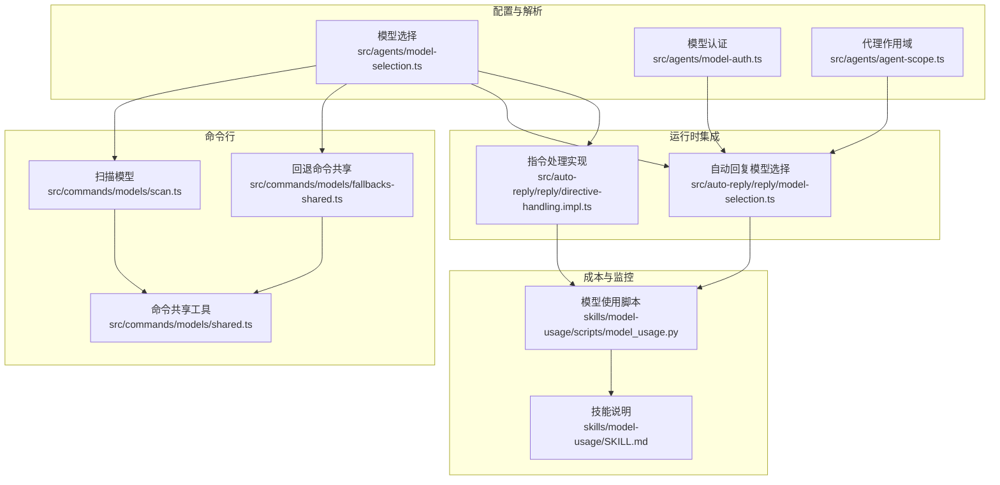
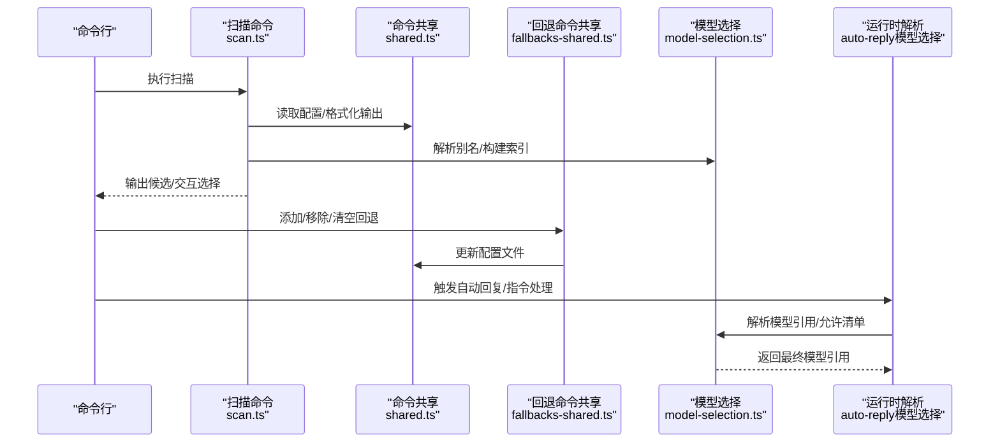
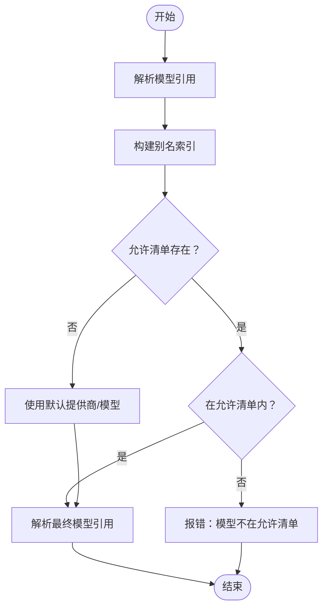
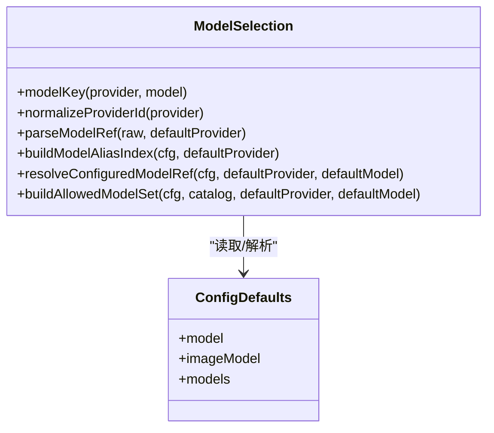
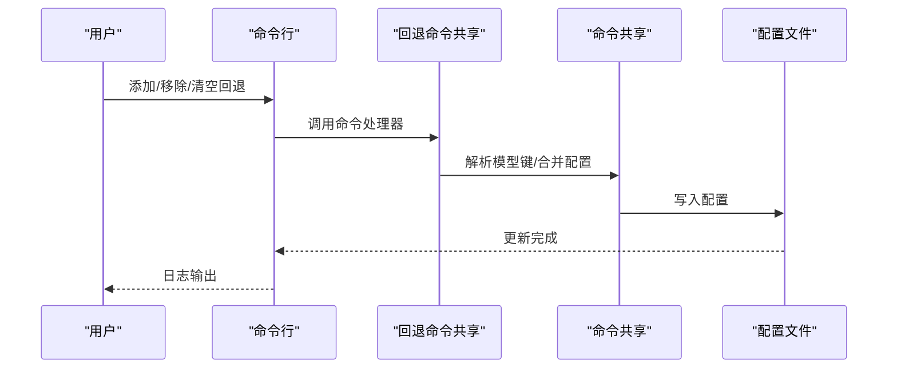
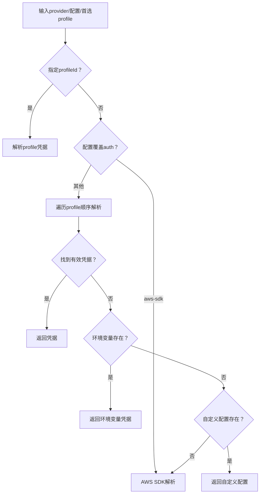
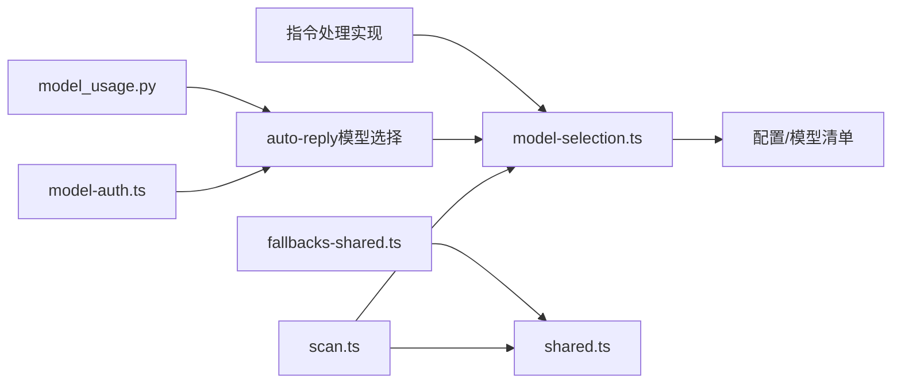

# 模型管理

<cite>
**本文引用的文件**
- [src/agents/model-selection.ts](file://src/agents/model-selection.ts)
- [src/agents/model-auth.ts](file://src/agents/model-auth.ts)
- [src/commands/models/fallbacks-shared.ts](file://src/commands/models/fallbacks-shared.ts)
- [src/commands/models/scan.ts](file://src/commands/models/scan.ts)
- [src/commands/models/shared.ts](file://src/commands/models/shared.ts)
- [src/agents/agent-scope.ts](file://src/agents/agent-scope.ts)
- [src/auto-reply/reply/model-selection.ts](file://src/auto-reply/reply/model-selection.ts)
- [src/auto-reply/reply/directive-handling.impl.ts](file://src/auto-reply/reply/directive-handling.impl.ts)
- [dist/plugin-sdk/agents/model-selection.d.ts](file://dist/plugin-sdk/agents/model-selection.d.ts)
- [dist/plugin-sdk/agents/models-config.d.ts](file://dist/plugin-sdk/agents/models-config.d.ts)
- [skills/model-usage/scripts/model_usage.py](file://skills/model-usage/scripts/model_usage.py)
- [skills/model-usage/SKILL.md](file://skills/model-usage/SKILL.md)
</cite>

## 目录

1. [简介](#简介)
2. [项目结构](#项目结构)
3. [核心组件](#核心组件)
4. [架构总览](#架构总览)
5. [详细组件分析](#详细组件分析)
6. [依赖关系分析](#依赖关系分析)
7. [性能考量](#性能考量)
8. [故障排查指南](#故障排查指南)
9. [结论](#结论)
10. [附录](#附录)

## 简介

本文件面向OpenClaw模型管理系统，系统性阐述以下主题：

- 模型选择算法：从配置、别名索引、指令与会话状态解析最终模型引用。
- 模型配置管理：默认模型、回退序列、图像模型、允许清单与别名索引。
- 模型回退机制：命令行维护回退列表、运行时解析有效回退序列。
- 支持的AI模型类型与参数配置：多提供商兼容、模型规范化、别名映射。
- 模型认证机制与API密钥管理：凭据解析顺序、环境变量注入、AWS SDK模式。
- 成本控制策略：会话级用量与成本聚合脚本。
- 模型切换逻辑、负载均衡与故障转移：基于回退序列与优先级的容错策略。
- 动态配置更新：扫描与交互式选择、写入配置文件。
- 性能监控、使用统计与成本分析：扫描结果排序、JSON输出与成本聚合。

## 项目结构

OpenClaw将“模型管理”能力拆分为多个层次：

- 配置与解析层：负责模型引用解析、别名索引、允许清单构建。
- 命令行层：提供扫描、列出、添加、移除、清空回退等CLI操作。
- 运行时层：在自动回复、指令处理等场景中解析并应用模型选择。
- 认证层：统一解析提供商凭据来源（配置、环境变量、AWS SDK、OAuth/Token）。
- 成本与监控：提供成本聚合脚本与技能文档说明。

**图表来源**

- [src/agents/model-selection.ts](file://src/agents/model-selection.ts#L1-L615)
- [src/agents/model-auth.ts](file://src/agents/model-auth.ts#L1-L415)
- [src/agents/agent-scope.ts](file://src/agents/agent-scope.ts#L232-L253)
- [src/commands/models/scan.ts](file://src/commands/models/scan.ts#L1-L360)
- [src/commands/models/fallbacks-shared.ts](file://src/commands/models/fallbacks-shared.ts#L1-L156)
- [src/commands/models/shared.ts](file://src/commands/models/shared.ts#L1-L223)
- [src/auto-reply/reply/model-selection.ts](file://src/auto-reply/reply/model-selection.ts#L180-L304)
- [src/auto-reply/reply/directive-handling.impl.ts](file://src/auto-reply/reply/directive-handling.impl.ts#L115-L133)
- [skills/model-usage/scripts/model_usage.py](file://skills/model-usage/scripts/model_usage.py#L132-L320)
- [skills/model-usage/SKILL.md](file://skills/model-usage/SKILL.md#L44-L69)

**章节来源**

- [src/agents/model-selection.ts](file://src/agents/model-selection.ts#L1-L615)
- [src/commands/models/scan.ts](file://src/commands/models/scan.ts#L1-L360)
- [src/commands/models/fallbacks-shared.ts](file://src/commands/models/fallbacks-shared.ts#L1-L156)
- [src/commands/models/shared.ts](file://src/commands/models/shared.ts#L1-L223)
- [src/auto-reply/reply/model-selection.ts](file://src/auto-reply/reply/model-selection.ts#L180-L304)
- [src/auto-reply/reply/directive-handling.impl.ts](file://src/auto-reply/reply/directive-handling.impl.ts#L115-L133)
- [src/agents/model-auth.ts](file://src/agents/model-auth.ts#L1-L415)
- [src/agents/agent-scope.ts](file://src/agents/agent-scope.ts#L232-L253)
- [skills/model-usage/scripts/model_usage.py](file://skills/model-usage/scripts/model_usage.py#L132-L320)
- [skills/model-usage/SKILL.md](file://skills/model-usage/SKILL.md#L44-L69)

## 核心组件

- 模型选择与规范化
  - 提供模型引用解析、别名索引、允许清单构建、默认模型解析与推理默认思考层级。
- 回退序列管理
  - 提供回退列表的增删改查命令，支持交互式选择与JSON输出。
- 认证与凭据解析
  - 统一解析提供商凭据来源，支持API Key、OAuth、Token与AWS SDK。
- 运行时模型选择
  - 在自动回复与指令处理中，结合会话状态、允许清单与别名索引解析最终模型。
- 成本与使用统计
  - 提供按日聚合的成本脚本与技能说明，支持当前模型与总览输出。

**章节来源**

- [src/agents/model-selection.ts](file://src/agents/model-selection.ts#L12-L341)
- [src/commands/models/fallbacks-shared.ts](file://src/commands/models/fallbacks-shared.ts#L17-L102)
- [src/commands/models/scan.ts](file://src/commands/models/scan.ts#L132-L359)
- [src/agents/model-auth.ts](file://src/agents/model-auth.ts#L135-L233)
- [src/auto-reply/reply/model-selection.ts](file://src/auto-reply/reply/model-selection.ts#L264-L304)
- [skills/model-usage/scripts/model_usage.py](file://skills/model-usage/scripts/model_usage.py#L132-L320)

## 架构总览

OpenClaw的模型管理采用“配置驱动 + 命令行扫描 + 运行时解析”的架构：

- 配置驱动：通过agents.defaults.model/imageModel与agents.defaults.models建立默认模型、回退序列与允许清单。
- 命令行扫描：扫描可用模型，生成候选集，支持交互式选择并写回配置。
- 运行时解析：在自动回复与指令处理中，综合会话状态、别名索引与允许清单解析最终模型。
- 认证与成本：统一凭据解析，配合成本脚本进行使用统计与成本分析。

**图表来源**

- [src/commands/models/scan.ts](file://src/commands/models/scan.ts#L132-L359)
- [src/commands/models/shared.ts](file://src/commands/models/shared.ts#L73-L80)
- [src/commands/models/fallbacks-shared.ts](file://src/commands/models/fallbacks-shared.ts#L71-L102)
- [src/agents/model-selection.ts](file://src/agents/model-selection.ts#L254-L341)
- [src/auto-reply/reply/model-selection.ts](file://src/auto-reply/reply/model-selection.ts#L264-L304)

## 详细组件分析

### 模型选择算法

模型选择算法围绕“引用解析 → 别名索引 → 允许清单 → 默认值”展开，并在运行时结合会话状态与指令覆盖：

- 引用解析：支持“provider/model”或仅“model”的简写，必要时使用默认提供商。
- 别名索引：将配置中的别名映射到具体模型键，便于模糊匹配与容错。
- 允许清单：根据agents.defaults.models构建允许集合，支持“全部允许”与显式白名单。
- 默认值：当未指定时返回默认提供商/模型；若仅提供模型名且无提供商，给出弃用警告并回退到anthropic。
- 推理默认思考层级：依据目录中是否声明reasoning字段决定默认思考层级。

**图表来源**

- [src/agents/model-selection.ts](file://src/agents/model-selection.ts#L254-L341)
- [src/agents/model-selection.ts](file://src/agents/model-selection.ts#L405-L481)
- [src/agents/model-selection.ts](file://src/agents/model-selection.ts#L305-L341)

**章节来源**

- [src/agents/model-selection.ts](file://src/agents/model-selection.ts#L12-L341)
- [src/agents/model-selection.ts](file://src/agents/model-selection.ts#L405-L481)
- [src/agents/model-selection.ts](file://src/agents/model-selection.ts#L512-L553)

### 模型配置管理

- 默认模型与主模型：resolveDefaultModelForAgent可按代理覆盖主模型，最终由resolveConfiguredModelRef解析。
- 图像模型与回退：支持独立的imageModel配置，与model回退序列并行维护。
- 允许清单与合成目录：当目录数据过期但配置存在时，允许清单可信任显式条目，合成目录条目以保证可用性。
- 别名索引：将别名映射到模型键，支持模糊匹配与变体识别。

**图表来源**

- [src/agents/model-selection.ts](file://src/agents/model-selection.ts#L36-L134)
- [src/agents/model-selection.ts](file://src/agents/model-selection.ts#L254-L280)
- [src/agents/model-selection.ts](file://src/agents/model-selection.ts#L405-L481)

**章节来源**

- [src/agents/model-selection.ts](file://src/agents/model-selection.ts#L305-L341)
- [src/agents/model-selection.ts](file://src/agents/model-selection.ts#L405-L481)
- [src/agents/model-selection.ts](file://src/agents/model-selection.ts#L254-L280)

### 模型回退机制

回退机制通过命令行维护agents.defaults下的model与imageModel的回退序列：

- 列表：打印当前回退序列，支持JSON/plain两种输出。
- 添加：解析目标模型，去重后追加到回退序列，同时确保agents.defaults.models中存在对应条目。
- 移除：按字符串解析目标模型，匹配别名/键后过滤回退序列。
- 清空：将回退序列置空并写回配置。
- 扫描：扫描OpenRouter模型，按工具/图像可用性与上下文长度、参数规模排序，支持交互式选择并写回配置。

**图表来源**

- [src/commands/models/fallbacks-shared.ts](file://src/commands/models/fallbacks-shared.ts#L41-L102)
- [src/commands/models/fallbacks-shared.ts](file://src/commands/models/fallbacks-shared.ts#L104-L143)
- [src/commands/models/fallbacks-shared.ts](file://src/commands/models/fallbacks-shared.ts#L145-L156)
- [src/commands/models/shared.ts](file://src/commands/models/shared.ts#L73-L80)

**章节来源**

- [src/commands/models/fallbacks-shared.ts](file://src/commands/models/fallbacks-shared.ts#L17-L102)
- [src/commands/models/fallbacks-shared.ts](file://src/commands/models/fallbacks-shared.ts#L104-L143)
- [src/commands/models/fallbacks-shared.ts](file://src/commands/models/fallbacks-shared.ts#L145-L156)
- [src/commands/models/scan.ts](file://src/commands/models/scan.ts#L132-L359)

### 支持的AI模型类型与参数配置

- 多提供商兼容：内置对anthropic、google、openai、openrouter、vercel-ai-gateway、amazon-bedrock、qwen-portal、volcengine、minimax-portal、huggingface、mistral、together、ollama、vllm等提供商的规范化与别名处理。
- 参数配置：通过agents.defaults.models定义允许清单；通过agents.defaults.model/imageModel定义主模型与回退序列；通过别名提升易用性。
- 模型规范化：对特定提供商的模型ID进行标准化（如Google、OpenRouter前缀），并处理特殊场景（如OpenAI Codex）。

**章节来源**

- [src/agents/model-selection.ts](file://src/agents/model-selection.ts#L103-L134)
- [src/agents/model-selection.ts](file://src/agents/model-selection.ts#L136-L147)
- [src/agents/model-selection.ts](file://src/agents/model-selection.ts#L175-L209)

### 模型认证机制与API密钥管理

- 凭据解析顺序：按profileId → 配置覆盖（auth模式） → 认证配置文件中的profile顺序 → 环境变量 → 自定义配置 → AWS SDK（针对amazon-bedrock）。
- 模式识别：支持api-key、oauth、token、aws-sdk、mixed、unknown等模式。
- 环境变量注入：按提供商映射到标准环境变量名，支持shell注入标记。
- AWS SDK：自动检测BEARER、AccessKey/SecretKey、Profile三种方式。

**图表来源**

- [src/agents/model-auth.ts](file://src/agents/model-auth.ts#L135-L233)
- [src/agents/model-auth.ts](file://src/agents/model-auth.ts#L334-L388)
- [src/agents/model-auth.ts](file://src/agents/model-auth.ts#L238-L332)

**章节来源**

- [src/agents/model-auth.ts](file://src/agents/model-auth.ts#L128-L233)
- [src/agents/model-auth.ts](file://src/agents/model-auth.ts#L334-L388)
- [src/agents/model-auth.ts](file://src/agents/model-auth.ts#L238-L332)

### 成本控制策略与使用统计

- 成本聚合：按日聚合模型成本，优先取含modelBreakdowns的最新行，否则回退到modelsUsed最后一条。
- 输出格式：支持文本与JSON两种输出，便于自动化集成。
- 使用场景：适用于Codex/Claude等提供商的成本数据，作为当前模型选择与成本分析依据。

**章节来源**

- [skills/model-usage/scripts/model_usage.py](file://skills/model-usage/scripts/model_usage.py#L132-L320)
- [skills/model-usage/SKILL.md](file://skills/model-usage/SKILL.md#L44-L69)

### 模型切换逻辑、负载均衡与故障转移

- 切换逻辑：运行时解析模型选择状态，结合会话存储的覆盖、允许清单与别名索引，确定最终模型。
- 故障转移：通过回退序列实现故障转移；当主模型不可用时，按序尝试回退项。
- 负载均衡：扫描命令支持并发与超时设置，结合工具/图像可用性与上下文长度排序，辅助选择更优模型。

**章节来源**

- [src/auto-reply/reply/model-selection.ts](file://src/auto-reply/reply/model-selection.ts#L264-L304)
- [src/commands/models/scan.ts](file://src/commands/models/scan.ts#L132-L359)

### 动态配置更新与模板

- 动态更新：命令共享模块提供updateConfig，确保配置合法性后写入文件。
- 模板与注入：通过插件SDK导出的类型定义与工具函数，支持在外部扩展中复用模型选择与配置逻辑。
- 环境变量注入：通过shell环境应用标记与标准环境变量名，实现凭据注入。

**章节来源**

- [src/commands/models/shared.ts](file://src/commands/models/shared.ts#L73-L80)
- [src/commands/models/shared.ts](file://src/commands/models/shared.ts#L19-L23)
- [src/agents/model-auth.ts](file://src/agents/model-auth.ts#L238-L332)
- [dist/plugin-sdk/agents/models-config.d.ts](file://dist/plugin-sdk/agents/models-config.d.ts#L1-L6)

## 依赖关系分析

- 组件耦合
  - 模型选择依赖配置与别名索引，耦合度高但职责清晰。
  - 命令行层通过共享模块与配置文件交互，避免直接耦合业务逻辑。
  - 运行时解析依赖模型选择与代理作用域，形成稳定的调用链。
- 外部依赖
  - 认证层依赖提供商SDK与环境变量，需注意凭据安全与注入路径。
  - 成本脚本依赖外部提供商CLI输出，需保持接口稳定性。

**图表来源**

- [src/agents/model-selection.ts](file://src/agents/model-selection.ts#L1-L615)
- [src/commands/models/scan.ts](file://src/commands/models/scan.ts#L1-L360)
- [src/commands/models/shared.ts](file://src/commands/models/shared.ts#L1-L223)
- [src/commands/models/fallbacks-shared.ts](file://src/commands/models/fallbacks-shared.ts#L1-L156)
- [src/auto-reply/reply/model-selection.ts](file://src/auto-reply/reply/model-selection.ts#L1-L304)
- [src/auto-reply/reply/directive-handling.impl.ts](file://src/auto-reply/reply/directive-handling.impl.ts#L115-L133)
- [src/agents/model-auth.ts](file://src/agents/model-auth.ts#L1-L415)
- [skills/model-usage/scripts/model_usage.py](file://skills/model-usage/scripts/model_usage.py#L132-L320)

**章节来源**

- [src/agents/model-selection.ts](file://src/agents/model-selection.ts#L1-L615)
- [src/commands/models/scan.ts](file://src/commands/models/scan.ts#L1-L360)
- [src/commands/models/shared.ts](file://src/commands/models/shared.ts#L1-L223)
- [src/commands/models/fallbacks-shared.ts](file://src/commands/models/fallbacks-shared.ts#L1-L156)
- [src/auto-reply/reply/model-selection.ts](file://src/auto-reply/reply/model-selection.ts#L1-L304)
- [src/auto-reply/reply/directive-handling.impl.ts](file://src/auto-reply/reply/directive-handling.impl.ts#L115-L133)
- [src/agents/model-auth.ts](file://src/agents/model-auth.ts#L1-L415)
- [skills/model-usage/scripts/model_usage.py](file://skills/model-usage/scripts/model_usage.py#L132-L320)

## 性能考量

- 扫描性能：支持并发与超时控制，按工具/图像可用性与上下文长度排序，减少无效请求。
- 解析性能：别名索引与允许清单采用Map/Set结构，查找复杂度低；模糊匹配限制在合理范围内。
- 写入性能：批量更新配置后一次性写入，避免频繁IO。

[本节为通用指导，无需特定文件分析]

## 故障排查指南

- 无效模型引用：检查“provider/model”格式与别名是否正确，确认agents.defaults.models中存在该键。
- 不在允许清单：为模型添加到agents.defaults.models或清空允许清单以启用“全部允许”。
- 缺少API密钥：根据提供商映射检查环境变量或认证配置文件；AWS SDK模式需满足相应条件。
- 回退列表为空：通过命令行添加回退项，确保至少有一个可用模型。
- 成本脚本无输出：确认外部CLI输出格式与字段名称，或使用--input/stdin传入数据。

**章节来源**

- [src/agents/model-selection.ts](file://src/agents/model-selection.ts#L512-L553)
- [src/agents/model-auth.ts](file://src/agents/model-auth.ts#L224-L233)
- [src/commands/models/fallbacks-shared.ts](file://src/commands/models/fallbacks-shared.ts#L134-L136)
- [skills/model-usage/SKILL.md](file://skills/model-usage/SKILL.md#L44-L69)

## 结论

OpenClaw模型管理系统通过“配置驱动 + 命令行扫描 + 运行时解析 + 统一认证 + 成本统计”的完整闭环，实现了灵活、可观测、可扩展的模型管理能力。其核心优势在于：

- 易用的别名与允许清单机制，降低配置复杂度。
- 可交互的扫描与回退序列维护，提升可用性与容错性。
- 统一的认证解析与环境变量注入，保障安全与灵活性。
- 成本脚本与JSON输出，便于自动化与可视化集成。

[本节为总结，无需特定文件分析]

## 附录

- 插件SDK类型定义：提供模型选择、配置导出等类型与函数签名，便于外部扩展复用。
- 模型配置模板：建议在agents.defaults.models中明确列出允许使用的模型，并为常用模型设置别名。
- 环境变量注入：在CI/CD或本地开发环境中，通过shell注入标记与标准环境变量名注入凭据。

**章节来源**

- [dist/plugin-sdk/agents/model-selection.d.ts](file://dist/plugin-sdk/agents/model-selection.d.ts#L1-L117)
- [dist/plugin-sdk/agents/models-config.d.ts](file://dist/plugin-sdk/agents/models-config.d.ts#L1-L6)
