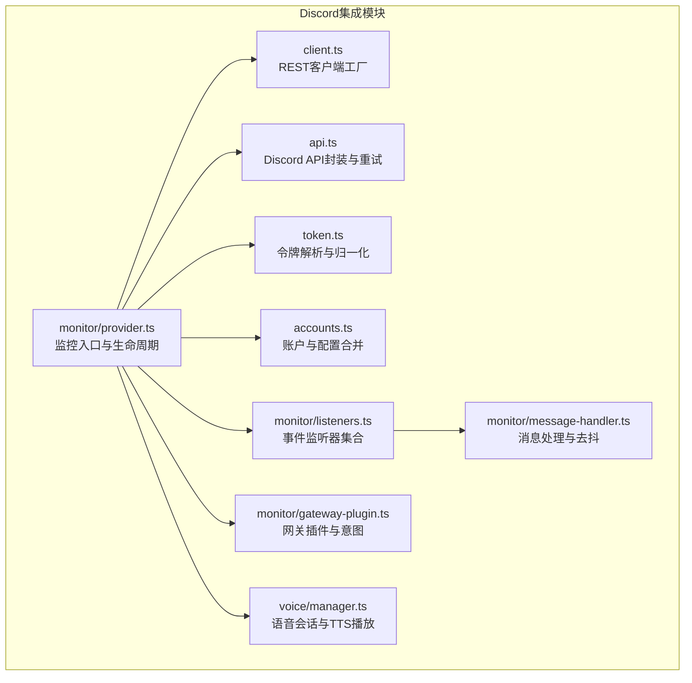
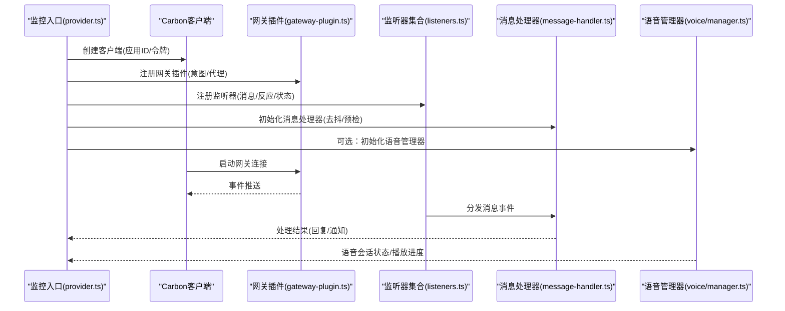
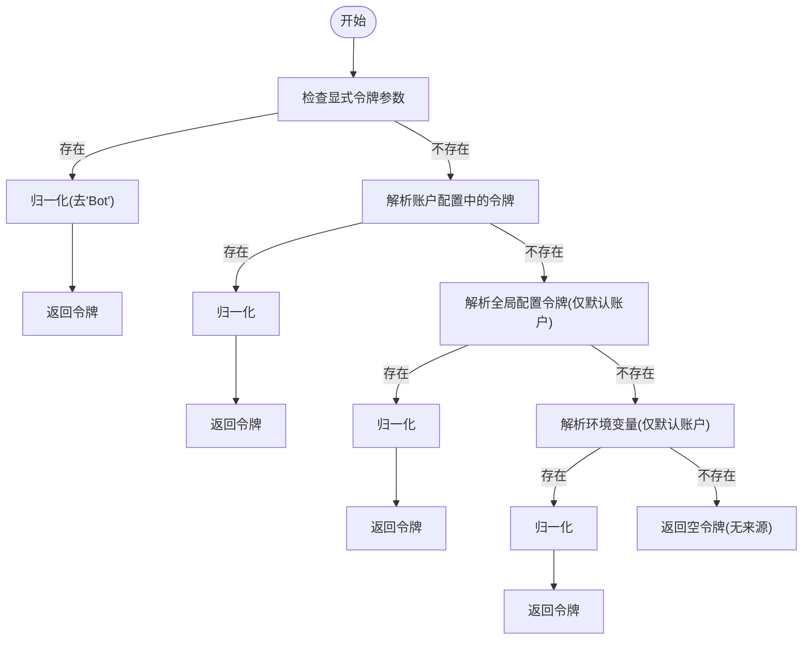
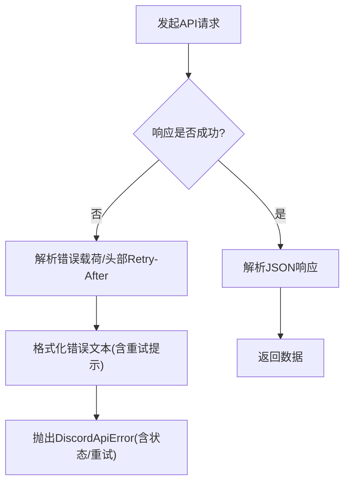
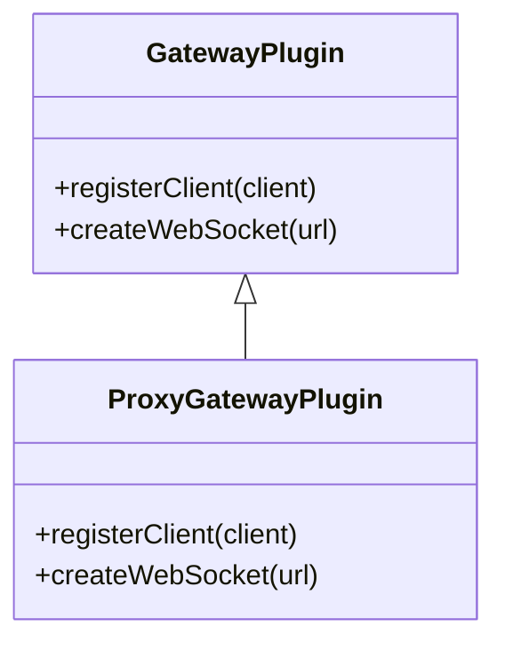
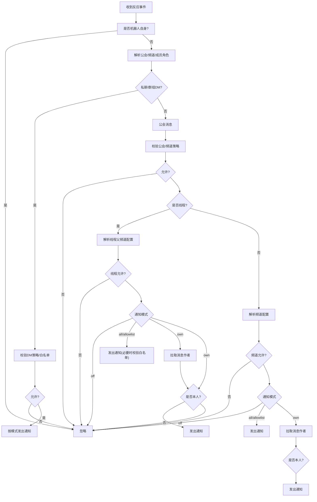
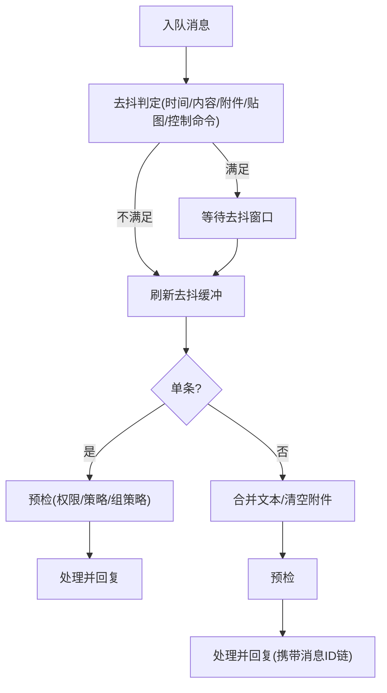
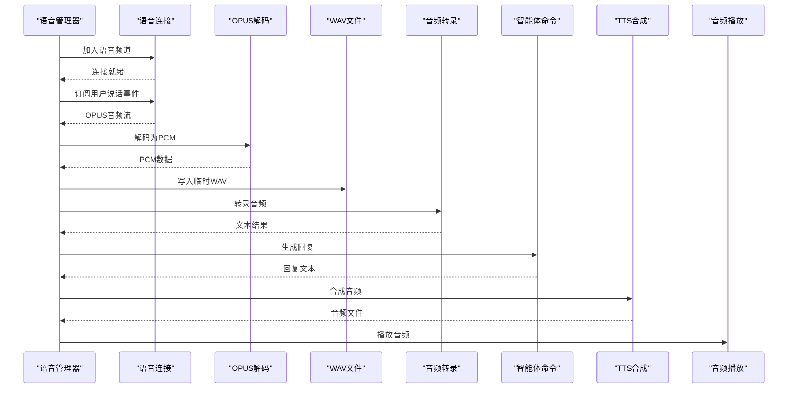
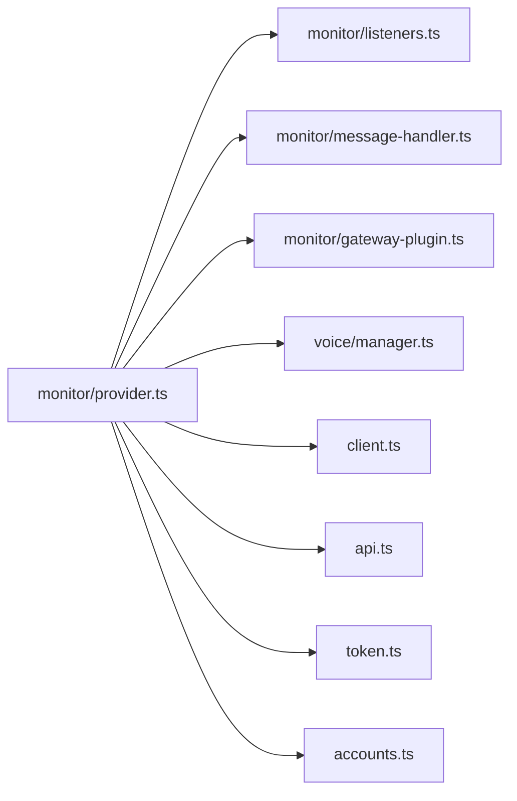

# Discord集成

<cite>
**本文引用的文件**
- [src/discord/client.ts](file://src/discord/client.ts)
- [src/discord/api.ts](file://src/discord/api.ts)
- [src/discord/token.ts](file://src/discord/token.ts)
- [src/discord/accounts.ts](file://src/discord/accounts.ts)
- [src/discord/monitor/provider.ts](file://src/discord/monitor/provider.ts)
- [src/discord/monitor/listeners.ts](file://src/discord/monitor/listeners.ts)
- [src/discord/monitor/message-handler.ts](file://src/discord/monitor/message-handler.ts)
- [src/discord/monitor/gateway-plugin.ts](file://src/discord/monitor/gateway-plugin.ts)
- [src/discord/voice/manager.ts](file://src/discord/voice/manager.ts)
</cite>

## 目录

1. [简介](#简介)
2. [项目结构](#项目结构)
3. [核心组件](#核心组件)
4. [架构总览](#架构总览)
5. [详细组件分析](#详细组件分析)
6. [依赖关系分析](#依赖关系分析)
7. [性能考量](#性能考量)
8. [故障排查指南](#故障排查指南)
9. [结论](#结论)
10. [附录](#附录)

## 简介

本文件面向OpenClaw的Discord集成能力，系统性阐述其Bot API实现与运行机制，覆盖OAuth2认证（令牌解析）、Gateway连接与事件监听、实时消息处理、Discord特有消息格式与交互组件、嵌入内容与媒体上传、角色权限管理、配置与部署、错误处理与限流策略、性能优化与最佳实践等。文档以代码为依据，提供可操作的配置建议、消息模板要点与排障指引。

## 项目结构

OpenClaw在src/discord目录下提供了完整的Discord集成实现，包括REST客户端封装、网关插件、事件监听器、消息处理器、语音管理器等模块；同时在extensions或dist中存在插件SDK类型定义，用于扩展与外部集成。

图表来源

- [src/discord/client.ts](file://src/discord/client.ts#L1-L61)
- [src/discord/api.ts](file://src/discord/api.ts#L1-L137)
- [src/discord/token.ts](file://src/discord/token.ts#L1-L52)
- [src/discord/accounts.ts](file://src/discord/accounts.ts#L1-L73)
- [src/discord/monitor/provider.ts](file://src/discord/monitor/provider.ts#L1-L687)
- [src/discord/monitor/listeners.ts](file://src/discord/monitor/listeners.ts#L1-L666)
- [src/discord/monitor/message-handler.ts](file://src/discord/monitor/message-handler.ts#L1-L144)
- [src/discord/monitor/gateway-plugin.ts](file://src/discord/monitor/gateway-plugin.ts#L1-L88)
- [src/discord/voice/manager.ts](file://src/discord/voice/manager.ts#L1-L788)

章节来源

- [src/discord/client.ts](file://src/discord/client.ts#L1-L61)
- [src/discord/api.ts](file://src/discord/api.ts#L1-L137)
- [src/discord/token.ts](file://src/discord/token.ts#L1-L52)
- [src/discord/accounts.ts](file://src/discord/accounts.ts#L1-L73)
- [src/discord/monitor/provider.ts](file://src/discord/monitor/provider.ts#L1-L687)
- [src/discord/monitor/listeners.ts](file://src/discord/monitor/listeners.ts#L1-L666)
- [src/discord/monitor/message-handler.ts](file://src/discord/monitor/message-handler.ts#L1-L144)
- [src/discord/monitor/gateway-plugin.ts](file://src/discord/monitor/gateway-plugin.ts#L1-L88)
- [src/discord/voice/manager.ts](file://src/discord/voice/manager.ts#L1-L788)

## 核心组件

- 令牌解析与REST客户端
  - 通过令牌归一化与账户配置解析，生成带重试策略的REST客户端，支持按账户维度的令牌来源优先级。
- Discord API封装
  - 统一封装Discord API请求，内置重试策略、429限流解析与错误格式化。
- 网关插件与意图
  - 基于Carbon Gateway插件，动态组合Discord意图（如消息、反应、语音状态等），并支持代理。
- 事件监听器
  - 提供消息创建、反应添加/移除、在线状态更新等监听器，含慢监听检测与访问控制。
- 消息处理器
  - 对消息进行预检、去抖与批量合成，统一进入处理流程。
- 语音管理器
  - 负责语音频道加入、音频接收与解码、转录、TTS合成与播放，具备解密失败恢复机制。

章节来源

- [src/discord/client.ts](file://src/discord/client.ts#L1-L61)
- [src/discord/api.ts](file://src/discord/api.ts#L1-L137)
- [src/discord/monitor/gateway-plugin.ts](file://src/discord/monitor/gateway-plugin.ts#L1-L88)
- [src/discord/monitor/listeners.ts](file://src/discord/monitor/listeners.ts#L1-L666)
- [src/discord/monitor/message-handler.ts](file://src/discord/monitor/message-handler.ts#L1-L144)
- [src/discord/voice/manager.ts](file://src/discord/voice/manager.ts#L1-L788)

## 架构总览

OpenClaw的Discord集成采用“监控入口 + 插件化网关 + 监听器 + 处理器”的分层架构。监控入口负责加载配置、解析令牌、部署原生命令、初始化语音与线程绑定管理器，并启动网关生命周期；监听器捕获事件后交由处理器统一处理；语音管理器独立负责语音通道的收发与TTS播放。

图表来源

- [src/discord/monitor/provider.ts](file://src/discord/monitor/provider.ts#L249-L662)
- [src/discord/monitor/gateway-plugin.ts](file://src/discord/monitor/gateway-plugin.ts#L30-L87)
- [src/discord/monitor/listeners.ts](file://src/discord/monitor/listeners.ts#L120-L140)
- [src/discord/monitor/message-handler.ts](file://src/discord/monitor/message-handler.ts#L24-L144)
- [src/discord/voice/manager.ts](file://src/discord/voice/manager.ts#L273-L508)

## 详细组件分析

### OAuth2与令牌解析

- 令牌来源优先级
  - 显式参数 > 账户配置 > 全局配置 > 环境变量（默认账户允许）。
- 归一化规则
  - 自动去除“Bot ”前缀，剔除空白字符。
- 账户与配置合并
  - 将全局Discord配置与账户级配置合并，形成最终生效配置。

图表来源

- [src/discord/token.ts](file://src/discord/token.ts#L22-L51)
- [src/discord/accounts.ts](file://src/discord/accounts.ts#L48-L66)

章节来源

- [src/discord/token.ts](file://src/discord/token.ts#L1-L52)
- [src/discord/accounts.ts](file://src/discord/accounts.ts#L1-L73)

### Discord API封装与限流

- 基础路径与默认重试
  - 使用v10 API基础路径；默认重试次数、最小/最大延迟与抖动已配置。
- 错误解析与格式化
  - 解析JSON错误载荷与Retry-After头，格式化人类可读错误信息。
- 429限流处理
  - 识别Discord 429响应，提取retry_after并转换为毫秒延迟重试。

图表来源

- [src/discord/api.ts](file://src/discord/api.ts#L96-L136)

章节来源

- [src/discord/api.ts](file://src/discord/api.ts#L1-L137)

### 网关插件与意图

- 意图组合
  - 默认启用Guilds、GuildMessages、MessageContent、DirectMessages、GuildMessageReactions、DirectMessageReactions、GuildVoiceStates；可选开启GuildPresences与GuildMembers。
- 代理支持
  - 支持HTTPS代理与自定义fetch/WS客户端，注册时获取网关信息。
- 生命周期
  - 通过Carbon GatewayPlugin管理连接、重连与自动交互。

图表来源

- [src/discord/monitor/gateway-plugin.ts](file://src/discord/monitor/gateway-plugin.ts#L30-L87)

章节来源

- [src/discord/monitor/gateway-plugin.ts](file://src/discord/monitor/gateway-plugin.ts#L1-L88)

### 事件监听器与权限控制

- 监听器类型
  - 消息创建、反应添加/移除、在线状态更新；对慢监听进行告警。
- 权限与白名单
  - DM/群组DM策略、服务器/频道白名单、用户匹配策略（支持名称模糊匹配）；对非公会消息直接放行。
- 反应通知
  - 支持“关闭/仅自己/所有人/白名单”四种模式；线程场景下区分线程父频道配置。

图表来源

- [src/discord/monitor/listeners.ts](file://src/discord/monitor/listeners.ts#L176-L632)

章节来源

- [src/discord/monitor/listeners.ts](file://src/discord/monitor/listeners.ts#L1-L666)

### 消息处理与去抖

- 预检与去抖
  - 基于作者ID+频道ID+会话键构建去抖键；附件/贴图/控制命令不参与去抖；批量合成时保留首个消息的快照字段。
- 批量处理
  - 合成多条输入文本，注入首尾消息ID链路，便于溯源与审计。

图表来源

- [src/discord/monitor/message-handler.ts](file://src/discord/monitor/message-handler.ts#L24-L144)

章节来源

- [src/discord/monitor/message-handler.ts](file://src/discord/monitor/message-handler.ts#L1-L144)

### 语音管理与TTS播放

- 语音会话
  - 加入/离开语音频道、订阅说话事件、解码OPUS音频、写入临时WAV文件、估算时长。
- 转录与回复
  - 使用媒体理解能力进行音频转录，结合路由生成会话上下文，调用智能体命令生成回复。
- TTS与播放
  - 解析TTS指令，合成音频并播放；具备解密失败检测与自动重连恢复。
- 配置项
  - 支持DAVE加密、解密失败容忍度、自动加入列表、TTS模型覆盖等。

图表来源

- [src/discord/voice/manager.ts](file://src/discord/voice/manager.ts#L273-L700)

章节来源

- [src/discord/voice/manager.ts](file://src/discord/voice/manager.ts#L1-L788)

### 监控入口与生命周期

- 账户解析与配置合并
  - 解析账户ID、启用状态、令牌来源与最终配置。
- 应用ID解析与原生命令部署
  - 获取应用ID，按需部署原生Slash命令；超限时降级为通用技能命令。
- 线程绑定与执行审批
  - 支持线程绑定管理器与执行审批组件注册。
- 网关生命周期
  - 启动网关、处理早期错误、监听断开与重连、语音管理器就绪回调。

章节来源

- [src/discord/monitor/provider.ts](file://src/discord/monitor/provider.ts#L249-L662)

## 依赖关系分析

- 组件耦合
  - 监控入口聚合各子模块；监听器与处理器通过Carbon事件接口解耦；语音管理器作为独立子系统与主流程弱耦合。
- 外部依赖
  - Carbon框架、@discordjs/voice、https-proxy-agent、undici等。
- 循环依赖
  - 未见明显循环依赖；模块职责清晰，通过函数/类边界隔离。

图表来源

- [src/discord/monitor/provider.ts](file://src/discord/monitor/provider.ts#L1-L687)
- [src/discord/monitor/listeners.ts](file://src/discord/monitor/listeners.ts#L1-L666)
- [src/discord/monitor/message-handler.ts](file://src/discord/monitor/message-handler.ts#L1-L144)
- [src/discord/monitor/gateway-plugin.ts](file://src/discord/monitor/gateway-plugin.ts#L1-L88)
- [src/discord/voice/manager.ts](file://src/discord/voice/manager.ts#L1-L788)
- [src/discord/client.ts](file://src/discord/client.ts#L1-L61)
- [src/discord/api.ts](file://src/discord/api.ts#L1-L137)
- [src/discord/token.ts](file://src/discord/token.ts#L1-L52)
- [src/discord/accounts.ts](file://src/discord/accounts.ts#L1-L73)

## 性能考量

- 去抖与批量处理
  - 对连续消息进行去抖与批量合成，减少重复处理与网络请求。
- 并行异步
  - 反应通知在线程场景下并行解析频道信息与访问控制，降低延迟。
- 语音解码与临时文件
  - OPUS解码与WAV写入使用流式处理与临时目录清理，避免内存峰值。
- 限流与重试
  - API层统一429重试策略，避免瞬时高峰导致失败扩大。
- 慢监听检测
  - 对超过阈值的监听器进行告警，便于定位瓶颈。

章节来源

- [src/discord/monitor/message-handler.ts](file://src/discord/monitor/message-handler.ts#L35-L134)
- [src/discord/monitor/listeners.ts](file://src/discord/monitor/listeners.ts#L62-L110)
- [src/discord/voice/manager.ts](file://src/discord/voice/manager.ts#L186-L237)
- [src/discord/api.ts](file://src/discord/api.ts#L108-L136)

## 故障排查指南

- 令牌缺失/无效
  - 检查账户配置、全局配置与环境变量设置；确认“Bot ”前缀已被自动去除。
- 网关意图不足
  - 若出现特定关闭码，检查意图配置（如GuildPresences/GuildMembers）。
- 429限流
  - 查看错误中的retry_after或Retry-After头，适当延长重试间隔。
- 反应通知异常
  - 校验DM策略、公会/频道白名单与通知模式；线程场景核对父频道配置。
- 语音播放问题
  - 关注解密失败日志，必要时启用自动重连；检查DAVE加密与解密容忍度配置。
- 原生命令部署失败
  - 查看部署错误详情（状态码/原始响应），确保命令数量不超过平台限制。

章节来源

- [src/discord/token.ts](file://src/discord/token.ts#L16-L28)
- [src/discord/monitor/gateway-plugin.ts](file://src/discord/monitor/gateway-plugin.ts#L10-L28)
- [src/discord/api.ts](file://src/discord/api.ts#L35-L78)
- [src/discord/monitor/listeners.ts](file://src/discord/monitor/listeners.ts#L229-L302)
- [src/discord/voice/manager.ts](file://src/discord/voice/manager.ts#L702-L758)
- [src/discord/monitor/provider.ts](file://src/discord/monitor/provider.ts#L189-L206)

## 结论

OpenClaw的Discord集成以模块化设计实现了从令牌解析、网关连接到事件处理与语音播放的完整链路。通过严格的权限控制、限流与重试策略、慢监听检测与临时资源清理，系统在保证稳定性的同时兼顾性能。建议在生产环境中合理配置意图、白名单与通知模式，并针对语音场景调整DAVE与解密容忍度，以获得最佳体验。

## 附录

### 配置要点与示例

- 令牌设置
  - 支持账户级配置、全局配置与环境变量（默认账户）。环境变量键名遵循项目约定。
- 网关代理
  - 在网关插件中配置代理URL，将影响获取网关信息与WebSocket连接。
- 意图与权限
  - 根据需要开启GuildPresences/GuildMembers；通过allowFrom/guilds/groupPolicy控制访问范围。
- DM与群组DM
  - 通过dm.enabled/dm.policy/groupEnabled/groupChannels控制私聊与群组DM行为。
- 原生命令
  - 开启后自动部署；若命令数超限，系统将降级为通用技能命令。
- 语音
  - 配置autoJoin、daveEncryption、decryptionFailureTolerance与TTS模型覆盖。

章节来源

- [src/discord/accounts.ts](file://src/discord/accounts.ts#L48-L66)
- [src/discord/monitor/gateway-plugin.ts](file://src/discord/monitor/gateway-plugin.ts#L34-L44)
- [src/discord/monitor/provider.ts](file://src/discord/monitor/provider.ts#L264-L350)
- [src/discord/voice/manager.ts](file://src/discord/voice/manager.ts#L386-L401)

### 消息模板与交互组件

- 模板
  - 反应通知文本包含表情、发送者标签、公会/频道与消息ID等上下文信息；线程场景包含父频道信息。
- 组件
  - 支持按钮、选择菜单、模态框等交互组件，配合会话键与线程绑定管理器使用。

章节来源

- [src/discord/monitor/listeners.ts](file://src/discord/monitor/listeners.ts#L409-L448)
- [src/discord/monitor/provider.ts](file://src/discord/monitor/provider.ts#L442-L494)
