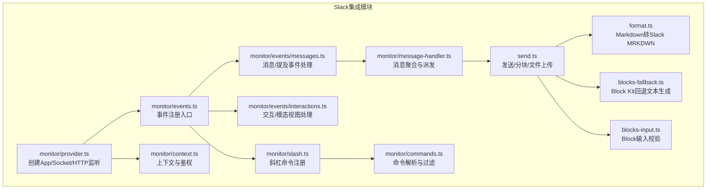
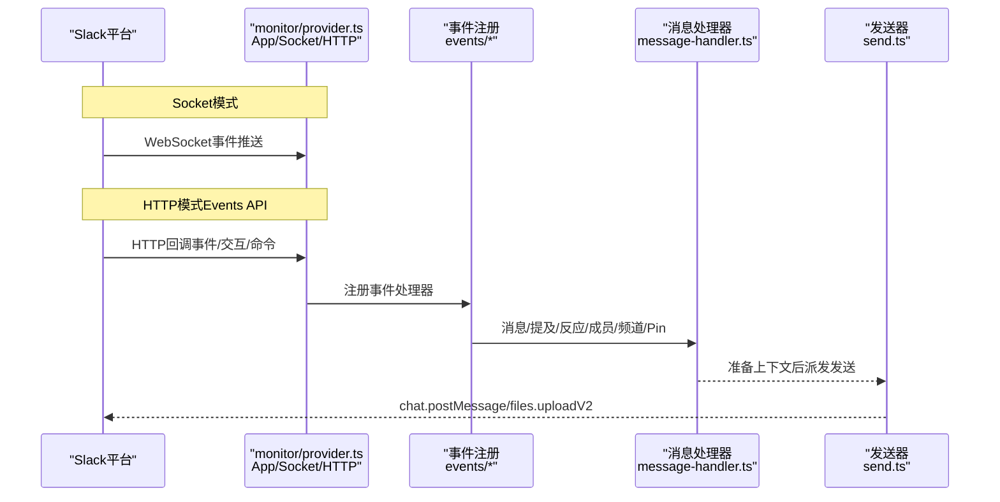
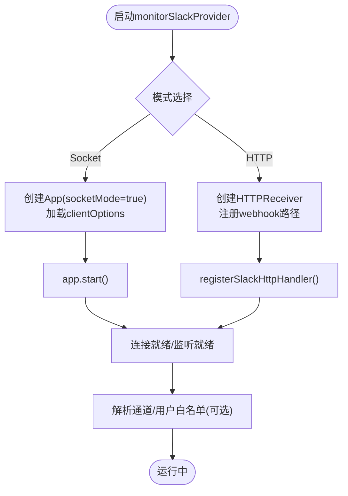
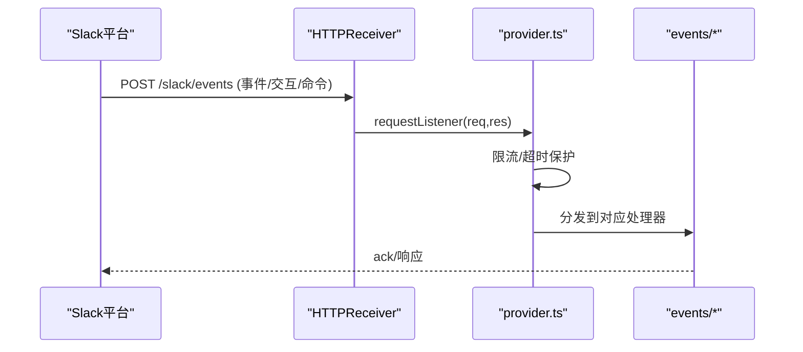
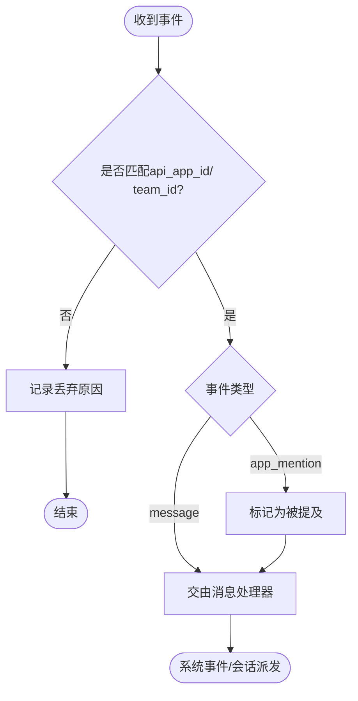
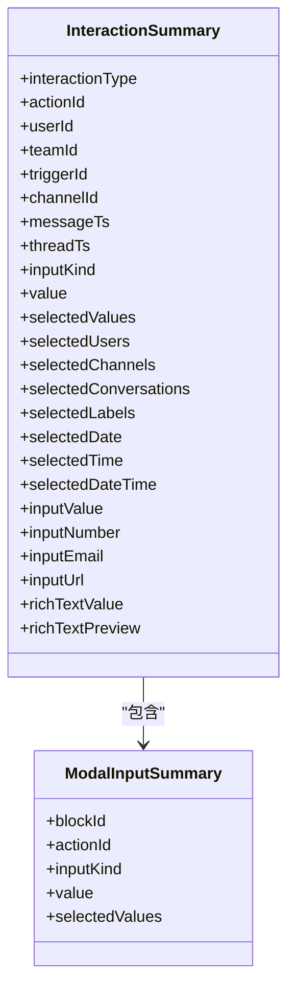
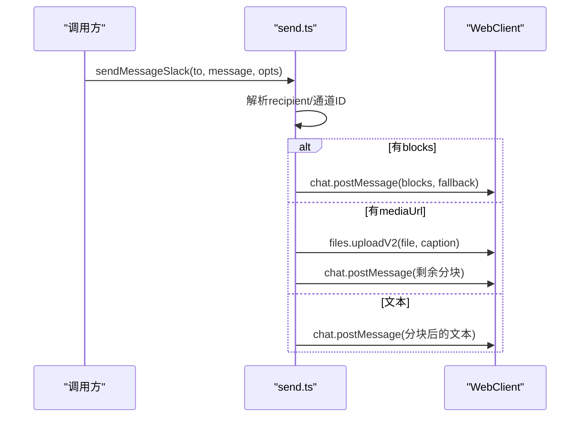
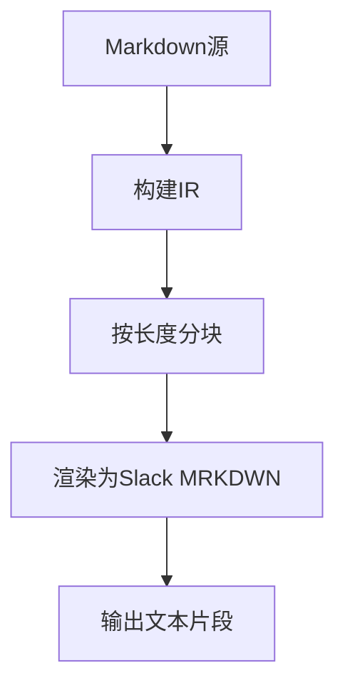
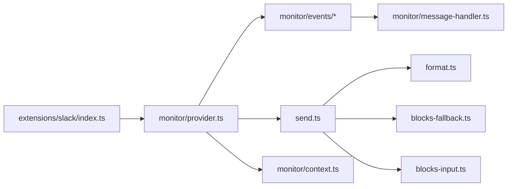

# Slack集成

<cite>
**本文引用的文件**
- [src/slack/index.ts](file://src/slack/index.ts)
- [src/slack/monitor/provider.ts](file://src/slack/monitor/provider.ts)
- [src/slack/monitor/events.ts](file://src/slack/monitor/events.ts)
- [src/slack/monitor/events/messages.ts](file://src/slack/monitor/events/messages.ts)
- [src/slack/monitor/events/interactions.ts](file://src/slack/monitor/events/interactions.ts)
- [src/slack/monitor/message-handler.ts](file://src/slack/monitor/message-handler.ts)
- [src/slack/monitor/context.ts](file://src/slack/monitor/context.ts)
- [src/slack/send.ts](file://src/slack/send.ts)
- [src/slack/format.ts](file://src/slack/format.ts)
- [src/slack/blocks-fallback.ts](file://src/slack/blocks-fallback.ts)
- [src/slack/blocks-input.ts](file://src/slack/blocks-input.ts)
- [src/slack/monitor/slash.ts](file://src/slack/monitor/slash.ts)
- [src/slack/monitor/commands.ts](file://src/slack/monitor/commands.ts)
- [docs/zh-CN/channels/slack.md](file://docs/zh-CN/channels/slack.md)
- [extensions/slack/index.ts](file://extensions/slack/index.ts)
</cite>

## 目录

1. [简介](#简介)
2. [项目结构](#项目结构)
3. [核心组件](#核心组件)
4. [架构总览](#架构总览)
5. [详细组件分析](#详细组件分析)
6. [依赖关系分析](#依赖关系分析)
7. [性能考量](#性能考量)
8. [故障排查指南](#故障排查指南)
9. [结论](#结论)
10. [附录](#附录)

## 简介

本文件面向OpenClaw的Slack集成功能，系统化阐述Socket Mode与HTTP模式（Events API）两种接入方式的实现原理，涵盖WebSocket连接、事件订阅、实时消息处理、Slack特有的消息格式与Block Kit组件、用户交互与文件共享流程、配置示例、Bot令牌与App令牌设置、事件处理与错误恢复策略、API限制与事件过滤以及最佳实践。

## 项目结构

OpenClaw的Slack集成主要位于src/slack目录，围绕“监控器（provider）+事件注册+消息处理器+发送器”的分层设计组织。文档还提供了中文配置说明与示例，便于快速上手。

图表来源

- [src/slack/monitor/provider.ts](file://src/slack/monitor/provider.ts#L59-L371)
- [src/slack/monitor/events.ts](file://src/slack/monitor/events.ts#L11-L25)
- [src/slack/monitor/events/messages.ts](file://src/slack/monitor/events/messages.ts#L14-L115)
- [src/slack/monitor/events/interactions.ts](file://src/slack/monitor/events/interactions.ts#L539-L751)
- [src/slack/monitor/message-handler.ts](file://src/slack/monitor/message-handler.ts#L19-L119)
- [src/slack/send.ts](file://src/slack/send.ts#L229-L337)
- [src/slack/format.ts](file://src/slack/format.ts#L111-L140)
- [src/slack/blocks-fallback.ts](file://src/slack/blocks-fallback.ts#L47-L95)
- [src/slack/blocks-input.ts](file://src/slack/blocks-input.ts#L34-L45)
- [src/slack/monitor/context.ts](file://src/slack/monitor/context.ts#L364-L383)
- [src/slack/monitor/slash.ts](file://src/slack/monitor/slash.ts)
- [src/slack/monitor/commands.ts](file://src/slack/monitor/commands.ts)

章节来源

- [src/slack/index.ts](file://src/slack/index.ts#L1-L26)
- [docs/zh-CN/channels/slack.md](file://docs/zh-CN/channels/slack.md#L1-L532)

## 核心组件

- 监控器与App初始化：根据配置选择Socket Mode或HTTP模式，创建Slack App实例，注册事件与命令，启动监听或注册HTTP路由。
- 事件注册：统一注册消息、提及、反应、成员、频道、Pin、交互等事件处理器。
- 消息处理器：对入站消息进行去重、合并、线程解析与上下文准备，再派发给系统处理。
- 发送器：负责消息分块、Markdown转MRKDWN、Block Kit回退文本生成、文件上传、自定义身份（头像/表情/用户名）发送。
- 交互与模态：处理按钮点击、选择器、日期时间、富文本输入等交互，支持模态视图生命周期事件。
- 配置与上下文：解析令牌、鉴权、通道/用户白名单、线程策略、文本分块与媒体限制等。

章节来源

- [src/slack/monitor/provider.ts](file://src/slack/monitor/provider.ts#L59-L371)
- [src/slack/monitor/events.ts](file://src/slack/monitor/events.ts#L11-L25)
- [src/slack/monitor/message-handler.ts](file://src/slack/monitor/message-handler.ts#L19-L119)
- [src/slack/send.ts](file://src/slack/send.ts#L229-L337)
- [src/slack/monitor/events/interactions.ts](file://src/slack/monitor/events/interactions.ts#L539-L751)

## 架构总览

下图展示Socket Mode与HTTP模式两种接入路径，以及事件流与发送流程的关键节点。

图表来源

- [src/slack/monitor/provider.ts](file://src/slack/monitor/provider.ts#L142-L155)
- [src/slack/monitor/events/messages.ts](file://src/slack/monitor/events/messages.ts#L30-L98)
- [src/slack/monitor/message-handler.ts](file://src/slack/monitor/message-handler.ts#L74-L94)
- [src/slack/send.ts](file://src/slack/send.ts#L102-L126)

## 详细组件分析

### Socket Mode实现原理

- App初始化：在Socket Mode下，使用Bot Token与App Token构造App，启用Socket Mode并传入WebClient选项。
- 连接建立：启动App后等待WebSocket连接；支持Abort信号中断。
- 令牌一致性：启动时执行auth.test获取botUserId/teamId/apiAppId，并校验App Token与Bot Token的api_app_id是否一致。
- 动态解析：在令牌可用时，异步解析通道与用户白名单，输出映射摘要日志。

图表来源

- [src/slack/monitor/provider.ts](file://src/slack/monitor/provider.ts#L142-L155)
- [src/slack/monitor/provider.ts](file://src/slack/monitor/provider.ts#L352-L370)

章节来源

- [src/slack/monitor/provider.ts](file://src/slack/monitor/provider.ts#L59-L371)

### HTTP模式（Events API）实现原理

- HTTPReceiver：在HTTP模式下创建HTTPReceiver，绑定签名密钥与webhook路径。
- 请求限制：对HTTP请求体大小与超时进行保护，避免过大/慢请求影响服务稳定性。
- 事件订阅：通过Events API接收消息、提及、反应、成员变更、频道重命名、Pin等事件。
- 交互与命令：Interactivity与Slash Commands共享同一URL，分别由不同处理器处理。

图表来源

- [src/slack/monitor/provider.ts](file://src/slack/monitor/provider.ts#L134-L177)
- [src/slack/monitor/events/messages.ts](file://src/slack/monitor/events/messages.ts#L30-L98)

章节来源

- [src/slack/monitor/provider.ts](file://src/slack/monitor/provider.ts#L134-L177)
- [docs/zh-CN/channels/slack.md](file://docs/zh-CN/channels/slack.md#L127-L161)

### 事件订阅与实时消息处理

- 消息事件：处理message、message_changed、message_deleted、thread_broadcast等子类型；对app_mention事件标记为被提及。
- 事件过滤：通过shouldDropMismatchedSlackEvent根据api_app_id与team_id进行匹配过滤，避免跨应用/跨团队事件误处理。
- 系统事件：编辑/删除/广播等事件转换为系统事件，携带会话键与上下文键，便于Agent感知。

图表来源

- [src/slack/monitor/events/messages.ts](file://src/slack/monitor/events/messages.ts#L30-L98)
- [src/slack/monitor/context.ts](file://src/slack/monitor/context.ts#L364-L383)

章节来源

- [src/slack/monitor/events/messages.ts](file://src/slack/monitor/events/messages.ts#L14-L115)
- [src/slack/monitor/context.ts](file://src/slack/monitor/context.ts#L364-L383)

### 用户交互与Block Kit组件

- 交互处理：识别OpenClaw生成的action_id前缀，对按钮点击、选择器、日期时间、富文本输入等进行汇总与授权校验。
- 模态视图：支持view_submission与view_closed两类模态生命周期事件，解析private_metadata路由到会话键。
- Block Kit回退：当发送Block Kit消息时，自动生成回退文本（header>section>image>video>file>context>通用默认），保证纯文本客户端可读。
- 输入校验：对blocks数组进行长度、元素对象与type字段校验，限制最多50个Block。

图表来源

- [src/slack/monitor/events/interactions.ts](file://src/slack/monitor/events/interactions.ts#L44-L101)
- [src/slack/blocks-fallback.ts](file://src/slack/blocks-fallback.ts#L47-L95)
- [src/slack/blocks-input.ts](file://src/slack/blocks-input.ts#L34-L45)

章节来源

- [src/slack/monitor/events/interactions.ts](file://src/slack/monitor/events/interactions.ts#L539-L751)
- [src/slack/blocks-fallback.ts](file://src/slack/blocks-fallback.ts#L1-L96)
- [src/slack/blocks-input.ts](file://src/slack/blocks-input.ts#L1-L46)

### 文件共享与媒体上传

- 通道解析：用户ID直接发送时通过conversations.open解析为DM通道ID，避免files.uploadV2校验失败。
- 媒体加载：通过loadWebMedia从URL加载媒体，支持本地根目录白名单与大小限制。
- 上传流程：先上传文件得到fileId，再按需发送后续文本分块；支持thread_ts。
- 令牌回退：若缺少Bot Token，尝试使用用户令牌（受userTokenReadOnly控制）。

图表来源

- [src/slack/send.ts](file://src/slack/send.ts#L166-L186)
- [src/slack/send.ts](file://src/slack/send.ts#L188-L227)
- [src/slack/send.ts](file://src/slack/send.ts#L229-L337)

章节来源

- [src/slack/send.ts](file://src/slack/send.ts#L166-L227)
- [src/slack/send.ts](file://src/slack/send.ts#L229-L337)

### Markdown与Block Kit格式转换

- Markdown转MRKDWN：对特殊字符进行转义，保留Slack允许的angle-bracket令牌（如@用户、#频道、链接等）。
- 表格模式：根据配置选择表格渲染模式，避免超出Slack限制。
- 分块策略：支持按换行分段后再按长度分块，确保Slack文本上限（4000）约束。

图表来源

- [src/slack/format.ts](file://src/slack/format.ts#L111-L140)

章节来源

- [src/slack/format.ts](file://src/slack/format.ts#L1-L141)

### 配置示例与令牌设置

- Socket模式最小配置：启用、设置appToken与botToken。
- HTTP模式最小配置：mode=http、botToken、signingSecret、webhookPath。
- 多账户：通过accounts配置不同账户的令牌与路径。
- 用户令牌：可选，优先用于读取操作；写入默认使用Bot Token，除非userTokenReadOnly=false且无Bot Token。

章节来源

- [docs/zh-CN/channels/slack.md](file://docs/zh-CN/channels/slack.md#L16-L115)
- [docs/zh-CN/channels/slack.md](file://docs/zh-CN/channels/slack.md#L127-L252)

### 事件处理与错误恢复策略

- 令牌不匹配：启动时校验api_app_id，若不一致记录错误。
- 限流与超时：HTTP模式对请求体大小与处理时间进行保护，避免异常请求拖垮服务。
- 自定义身份降级：当缺少chat:write.customize权限时，自动回退为不带自定义身份的发送。
- 事件丢弃：跨应用/跨团队事件会被过滤，避免误处理。
- 交互授权：对非预期用户或会话路由失败的交互进行丢弃与可选反馈。

章节来源

- [src/slack/monitor/provider.ts](file://src/slack/monitor/provider.ts#L193-L197)
- [src/slack/monitor/provider.ts](file://src/slack/monitor/provider.ts#L158-L176)
- [src/slack/send.ts](file://src/slack/send.ts#L119-L126)
- [src/slack/monitor/context.ts](file://src/slack/monitor/context.ts#L364-L383)
- [src/slack/monitor/events/interactions.ts](file://src/slack/monitor/events/interactions.ts#L590-L610)

### Slack API限制与事件过滤

- 文本限制：默认4000字符，支持按换行分段后再分块。
- Block限制：最多50个Block，数组不能为空。
- 媒体限制：默认20MB，可通过配置调整。
- 事件过滤：基于api_app_id与team_id进行匹配，避免跨应用/跨团队事件。
- 令牌作用域：读取优先用户令牌，写入默认Bot令牌，必要时回退至用户令牌（受userTokenReadOnly控制）。

章节来源

- [src/slack/blocks-input.ts](file://src/slack/blocks-input.ts#L3-L22)
- [src/slack/send.ts](file://src/slack/send.ts#L275-L276)
- [docs/zh-CN/channels/slack.md](file://docs/zh-CN/channels/slack.md#L363-L367)
- [src/slack/monitor/context.ts](file://src/slack/monitor/context.ts#L364-L383)

### 最佳实践

- 优先使用Socket Mode以获得更低延迟与更稳定的事件推送。
- 在HTTP模式下确保Request URL正确暴露至公网，并配置正确的Signing Secret。
- 合理设置historyLimit与textChunkLimit，平衡上下文质量与API限制。
- 使用用户令牌时严格控制userTokenReadOnly，避免越权写入。
- 对交互与模态视图使用OpenClaw前缀的action_id/callback_id，避免与其他集成冲突。
- 为斜杠命令与交互配置适当的会话键与路由，确保上下文连贯。

章节来源

- [docs/zh-CN/channels/slack.md](file://docs/zh-CN/channels/slack.md#L16-L115)
- [src/slack/monitor/events/interactions.ts](file://src/slack/monitor/events/interactions.ts#L9-L10)

## 依赖关系分析

- 模块耦合：monitor/provider.ts作为入口，依赖各事件处理器与发送器；事件处理器依赖上下文与消息准备工具；发送器依赖格式化与Block Kit工具。
- 外部依赖：@slack/bolt用于Socket/HTTP事件处理；@slack/web-api用于WebClient调用。
- 插件集成：extensions/slack/index.ts注册Slack插件，注入运行时并注册通道。

图表来源

- [src/slack/monitor/provider.ts](file://src/slack/monitor/provider.ts#L32-L35)
- [src/slack/monitor/events.ts](file://src/slack/monitor/events.ts#L1-L26)
- [src/slack/send.ts](file://src/slack/send.ts#L1-L25)
- [extensions/slack/index.ts](file://extensions/slack/index.ts#L1-L18)

章节来源

- [src/slack/index.ts](file://src/slack/index.ts#L1-L26)
- [extensions/slack/index.ts](file://extensions/slack/index.ts#L1-L18)

## 性能考量

- 消息去重与合并：通过入站防抖减少重复处理，提升吞吐。
- 分块发送：长文本按长度分块，避免单次调用超限。
- 上传优化：媒体上传与文本分块并行顺序发送，减少端到端延迟。
- 事件过滤：早期丢弃不匹配事件，降低无效处理成本。

## 故障排查指南

- 无法连接Socket：检查Bot Token与App Token是否正确，确认Socket Mode已启用。
- HTTP回调失败：核对Signing Secret、Request URL与webhookPath，确保公网可达。
- 交互无响应：确认action_id前缀与授权校验逻辑，检查expectedUserId与会话路由。
- 文件上传失败：检查媒体URL可访问性、大小限制与files:write权限。
- 自定义身份失败：确认chat:write.customize权限，系统会自动降级为无自定义身份发送。

章节来源

- [src/slack/monitor/provider.ts](file://src/slack/monitor/provider.ts#L83-L89)
- [src/slack/monitor/provider.ts](file://src/slack/monitor/provider.ts#L158-L176)
- [src/slack/send.ts](file://src/slack/send.ts#L119-L126)
- [src/slack/monitor/events/interactions.ts](file://src/slack/monitor/events/interactions.ts#L590-L610)

## 结论

OpenClaw的Slack集成以清晰的分层架构实现了Socket Mode与HTTP模式的双栈支持，覆盖事件订阅、实时消息处理、Block Kit与交互、文件上传与媒体分块、权限与令牌管理、错误恢复与性能优化。结合配置文档与最佳实践，可在生产环境中稳定地接入Slack生态。

## 附录

- 插件入口：extensions/slack/index.ts注册Slack通道插件，注入运行时并注册通道。
- 配置参考：详见docs/zh-CN/channels/slack.md中的Socket/HTTP模式配置、权限范围与限制说明。

章节来源

- [extensions/slack/index.ts](file://extensions/slack/index.ts#L1-L18)
- [docs/zh-CN/channels/slack.md](file://docs/zh-CN/channels/slack.md#L1-L532)
