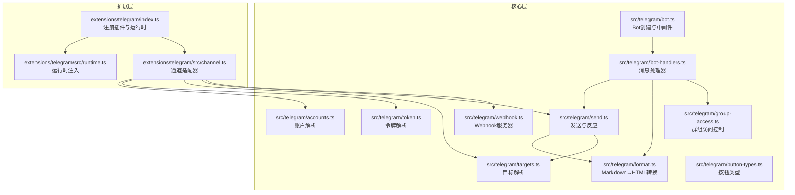
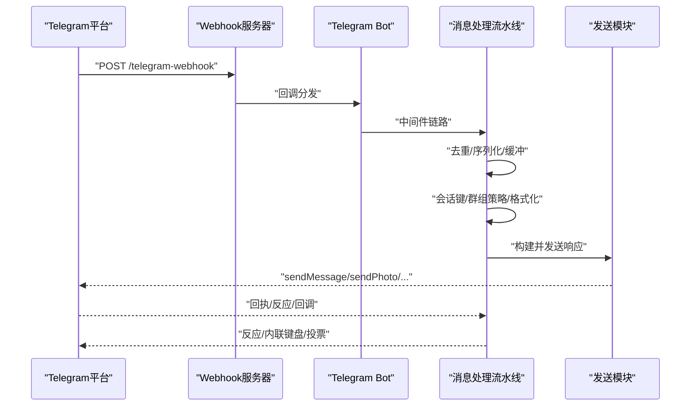
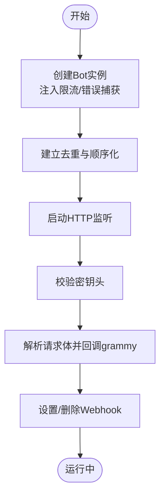
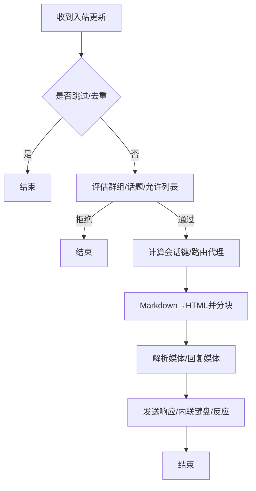
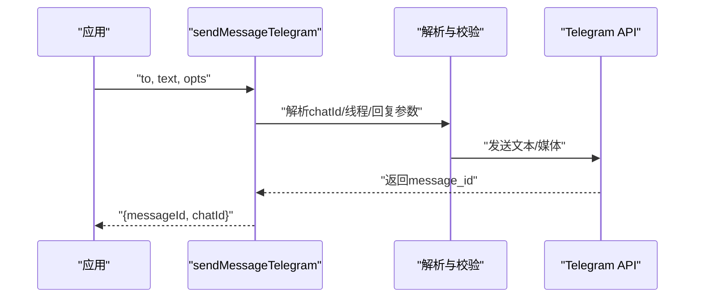
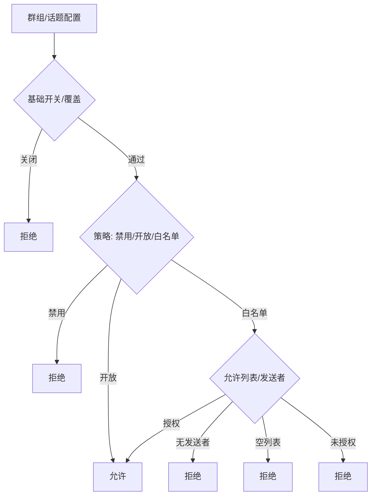
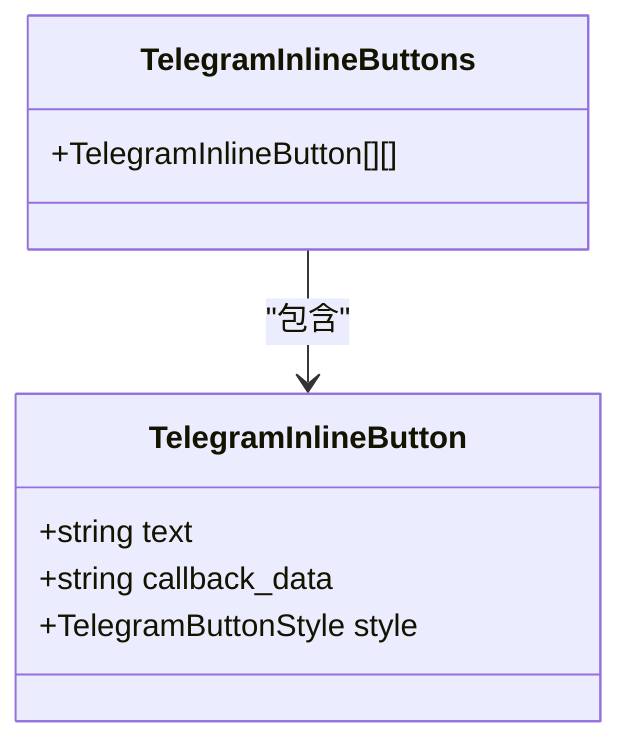
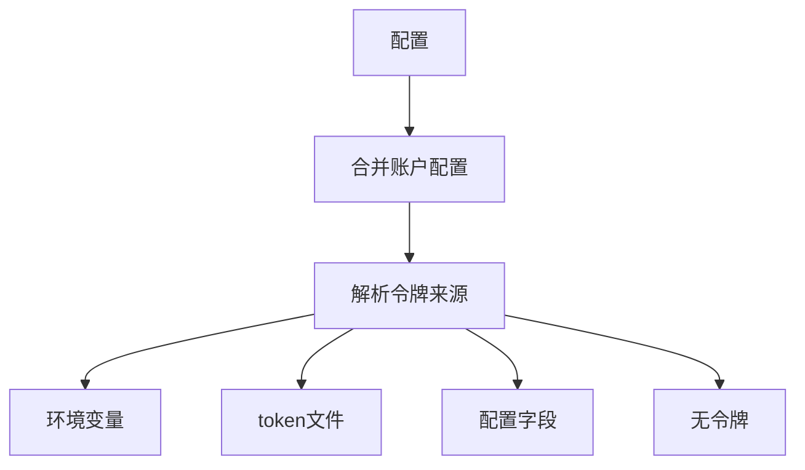
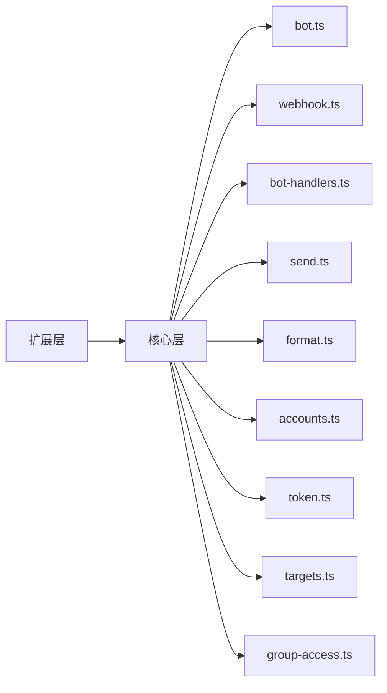

# Telegram集成

<cite>
**本文档引用的文件**
- [extensions/telegram/index.ts](file://extensions/telegram/index.ts)
- [extensions/telegram/src/channel.ts](file://extensions/telegram/src/channel.ts)
- [extensions/telegram/src/runtime.ts](file://extensions/telegram/src/runtime.ts)
- [src/telegram/bot.ts](file://src/telegram/bot.ts)
- [src/telegram/webhook.ts](file://src/telegram/webhook.ts)
- [src/telegram/accounts.ts](file://src/telegram/accounts.ts)
- [src/telegram/bot-handlers.ts](file://src/telegram/bot-handlers.ts)
- [src/telegram/bot-message.ts](file://src/telegram/bot-message.ts)
- [src/telegram/format.ts](file://src/telegram/format.ts)
- [src/telegram/send.ts](file://src/telegram/send.ts)
- [src/telegram/token.ts](file://src/telegram/token.ts)
- [src/telegram/targets.ts](file://src/telegram/targets.ts)
- [src/telegram/group-access.ts](file://src/telegram/group-access.ts)
- [src/telegram/button-types.ts](file://src/telegram/button-types.ts)
</cite>

## 目录

1. [简介](#简介)
2. [项目结构](#项目结构)
3. [核心组件](#核心组件)
4. [架构总览](#架构总览)
5. [详细组件分析](#详细组件分析)
6. [依赖关系分析](#依赖关系分析)
7. [性能考虑](#性能考虑)
8. [故障排除指南](#故障排除指南)
9. [结论](#结论)
10. [附录](#附录)

## 简介

本文件面向OpenClaw的Telegram集成功能，系统性阐述频道适配器的实现原理与使用方法，涵盖Bot API认证机制、消息接收处理、媒体内容支持、群组消息路由、消息格式转换、键盘交互、Inline查询支持、文件上传下载、配置示例、Webhook设置、消息模板、错误处理策略以及API限制与最佳实践。

## 项目结构

OpenClaw将Telegram作为扩展插件提供，核心代码位于`extensions/telegram`与`src/telegram`两个目录：

- 扩展层：负责注册插件、注入运行时、桥接OpenClaw通道接口与Telegram运行时。
- 核心层：实现Bot实例创建、Webhook监听、消息处理流水线、发送与反应、格式化与分块、安全访问控制等。

**图表来源**

- [extensions/telegram/index.ts](file://extensions/telegram/index.ts#L1-L18)
- [extensions/telegram/src/channel.ts](file://extensions/telegram/src/channel.ts#L1-L570)
- [extensions/telegram/src/runtime.ts](file://extensions/telegram/src/runtime.ts#L1-L15)
- [src/telegram/bot.ts](file://src/telegram/bot.ts#L1-L432)
- [src/telegram/webhook.ts](file://src/telegram/webhook.ts#L1-L283)
- [src/telegram/bot-handlers.ts](file://src/telegram/bot-handlers.ts#L1-L800)
- [src/telegram/send.ts](file://src/telegram/send.ts#L1-L800)
- [src/telegram/format.ts](file://src/telegram/format.ts#L1-L266)
- [src/telegram/accounts.ts](file://src/telegram/accounts.ts#L1-L159)
- [src/telegram/token.ts](file://src/telegram/token.ts#L1-L103)
- [src/telegram/targets.ts](file://src/telegram/targets.ts#L1-L121)
- [src/telegram/group-access.ts](file://src/telegram/group-access.ts#L1-L160)
- [src/telegram/button-types.ts](file://src/telegram/button-types.ts#L1-L10)

**章节来源**

- [extensions/telegram/index.ts](file://extensions/telegram/index.ts#L1-L18)
- [extensions/telegram/src/channel.ts](file://extensions/telegram/src/channel.ts#L1-L570)
- [extensions/telegram/src/runtime.ts](file://extensions/telegram/src/runtime.ts#L1-L15)
- [src/telegram/bot.ts](file://src/telegram/bot.ts#L1-L432)
- [src/telegram/webhook.ts](file://src/telegram/webhook.ts#L1-L283)

## 核心组件

- 插件注册与运行时注入：扩展入口负责注册Telegram插件并将运行时注入到通道适配器中，确保后续所有Telegram相关操作可访问OpenClaw运行时能力。
- 通道适配器：实现OpenClaw通道接口，提供账户管理、消息发送、状态检查、网关启动等功能；封装Telegram特有配置（如Webhook、代理、超时、媒体大小限制等）。
- Bot与Webhook：基于grammy创建Bot实例，启用序列化、去重、限流与错误捕获；支持HTTP Webhook回调与本地监听模式。
- 消息处理流水线：解析入站更新、去重与缓冲、会话键计算、群组策略评估、文本分块与格式化、媒体下载与转发、响应生成与发送。
- 发送与反应：统一的发送API，支持文本、媒体（图片/视频/音频/GIF）、投票、内联键盘、静默通知、回复参数、主题线程等；支持消息反应。
- 安全与访问控制：基于允许白名单、群组策略、话题覆盖、DM策略等进行授权判定，支持会话级激活模式与提及要求。
- 配置与令牌：支持环境变量、配置文件与token文件三种令牌来源，按优先级解析并校验账户唯一性。

**章节来源**

- [extensions/telegram/src/channel.ts](file://extensions/telegram/src/channel.ts#L87-L570)
- [src/telegram/bot.ts](file://src/telegram/bot.ts#L116-L427)
- [src/telegram/webhook.ts](file://src/telegram/webhook.ts#L77-L283)
- [src/telegram/bot-handlers.ts](file://src/telegram/bot-handlers.ts#L102-L800)
- [src/telegram/send.ts](file://src/telegram/send.ts#L459-L750)
- [src/telegram/group-access.ts](file://src/telegram/group-access.ts#L21-L160)
- [src/telegram/token.ts](file://src/telegram/token.ts#L19-L103)

## 架构总览

下图展示从Webhook或轮询到消息处理与发送的端到端流程：

**图表来源**

- [src/telegram/webhook.ts](file://src/telegram/webhook.ts#L126-L218)
- [src/telegram/bot.ts](file://src/telegram/bot.ts#L202-L260)
- [src/telegram/bot-handlers.ts](file://src/telegram/bot-handlers.ts#L197-L252)
- [src/telegram/send.ts](file://src/telegram/send.ts#L509-L749)

## 详细组件分析

### Bot与Webhook

- Bot创建：初始化grammy Bot，注入API客户端（可选自定义fetch与超时），启用apiThrottler与全局错误捕获；设置更新去重、顺序化与水位持久化。
- Webhook监听：创建HTTP服务器，校验密钥头，解析请求体，调用grammy webhookCallback；设置/删除Webhook并记录诊断事件；支持健康检查路径。
- 序列化与去重：按聊天/话题键串行处理，避免并发冲突；维护pending update集合与最高完成watermark，保证不丢失也不重复处理。
- 诊断与日志：可选记录原始更新、HTTP错误、Webhook收发统计，便于问题排查。

**图表来源**

- [src/telegram/bot.ts](file://src/telegram/bot.ts#L116-L220)
- [src/telegram/webhook.ts](file://src/telegram/webhook.ts#L126-L253)

**章节来源**

- [src/telegram/bot.ts](file://src/telegram/bot.ts#L116-L220)
- [src/telegram/webhook.ts](file://src/telegram/webhook.ts#L77-L283)

### 消息接收与处理

- 入站更新：中间件记录原始更新，按聊天/话题键序列化执行；对媒体组、文本片段、转发消息进行缓冲与合并。
- 去重与节流：基于update_id与最近处理集合去重；对连续401错误采用电路保护与退避。
- 会话与路由：根据群组/直接消息、论坛话题、线程ID构建会话键，结合绑定与会话存储决定代理与模型选择。
- 授权与策略：先评估群组基础开关/话题开关，再按策略（禁用/开放/白名单）与允许列表判定；支持提及要求与会话激活模式。
- 文本分块与格式化：将Markdown转换为HTML（含Spoiler、代码块、链接等），自动包裹可能被误识别为URL的文件引用；按Telegram限制分块发送。
- 媒体处理：解析媒体组与回复媒体，下载并转换为本地路径，按类型发送（动画/图片/视频/音频/文档），必要时拆分为多段消息。

**图表来源**

- [src/telegram/bot.ts](file://src/telegram/bot.ts#L188-L220)
- [src/telegram/bot-handlers.ts](file://src/telegram/bot-handlers.ts#L476-L571)
- [src/telegram/format.ts](file://src/telegram/format.ts#L110-L127)
- [src/telegram/send.ts](file://src/telegram/send.ts#L509-L749)

**章节来源**

- [src/telegram/bot-handlers.ts](file://src/telegram/bot-handlers.ts#L102-L800)
- [src/telegram/format.ts](file://src/telegram/format.ts#L110-L266)
- [src/telegram/send.ts](file://src/telegram/send.ts#L459-L750)

### 发送与媒体支持

- 统一发送API：支持文本、媒体（含GIF/语音/视频笔记）、投票、内联键盘、静默通知、回复参数、主题线程等；自动处理HTML解析失败回退为纯文本。
- 媒体分发：根据MIME类型选择发送接口；当caption超限时自动拆分为后续文本消息；支持在媒体消息上禁用链接预览。
- 反应与删除：支持setMessageReaction（含移除）；提供消息删除等扩展能力。
- 错误处理：针对“消息未修改”、“线程不存在”、“聊天未找到”等常见错误进行分类与降级处理；对网络错误采用可配置重试策略。

**图表来源**

- [src/telegram/send.ts](file://src/telegram/send.ts#L459-L750)
- [src/telegram/targets.ts](file://src/telegram/targets.ts#L91-L121)

**章节来源**

- [src/telegram/send.ts](file://src/telegram/send.ts#L459-L750)
- [src/telegram/targets.ts](file://src/telegram/targets.ts#L1-L121)

### 群组消息路由与策略

- 群组/话题配置：支持按群组、按话题覆盖策略与允许列表；支持提及要求与会话激活模式。
- 访问控制：先检查群组/话题开关，再按策略与允许列表判定；支持聊天级允许列表与运行时策略回退。
- 会话键：群组使用chatId+topicId组合，DM支持线程；结合代理绑定与会话存储确定最终路由。

**图表来源**

- [src/telegram/group-access.ts](file://src/telegram/group-access.ts#L21-L160)

**章节来源**

- [src/telegram/group-access.ts](file://src/telegram/group-access.ts#L1-L160)

### 键盘交互与Inline查询

- 内联键盘：支持多行按钮，带样式标记；仅保留有效按钮项。
- 事件授权：对反应、回调等事件进行授权判定，区分DM与群组场景；支持基于scope/allowlist的二次授权。
- Inline查询：可扩展至Inline模式（当前实现重点在回调与反应授权）。

**图表来源**

- [src/telegram/button-types.ts](file://src/telegram/button-types.ts#L1-L10)
- [src/telegram/send.ts](file://src/telegram/send.ts#L434-L457)

**章节来源**

- [src/telegram/button-types.ts](file://src/telegram/button-types.ts#L1-L10)
- [src/telegram/send.ts](file://src/telegram/send.ts#L434-L457)

### 配置与令牌解析

- 令牌来源优先级：环境变量（默认账户）、token文件、配置字段；支持账户级与全局级配置。
- 账户解析：合并基础配置与账户级配置，支持动作门控、默认账户解析、允许列表与群组策略。
- 目标解析：支持数字chatId、t.me链接、@用户名、内部前缀；支持`:topic:`显式主题线程语法。

**图表来源**

- [src/telegram/token.ts](file://src/telegram/token.ts#L19-L103)
- [src/telegram/accounts.ts](file://src/telegram/accounts.ts#L86-L129)
- [src/telegram/targets.ts](file://src/telegram/targets.ts#L91-L121)

**章节来源**

- [src/telegram/token.ts](file://src/telegram/token.ts#L1-L103)
- [src/telegram/accounts.ts](file://src/telegram/accounts.ts#L1-L159)
- [src/telegram/targets.ts](file://src/telegram/targets.ts#L1-L121)

## 依赖关系分析

- 扩展层依赖核心层：通道适配器通过运行时注入使用核心模块（发送、格式化、目标解析、令牌解析等）。
- 核心层模块内聚：Bot创建与Webhook监听相互独立但协同；消息处理流水线串联格式化、发送与访问控制。
- 外部依赖：grammy（Bot框架）、@grammyjs/runner（序列化）、@grammyjs/transformer-throttler（限流）、@grammyjs/types（类型）。

**图表来源**

- [extensions/telegram/src/channel.ts](file://extensions/telegram/src/channel.ts#L1-L570)
- [src/telegram/bot.ts](file://src/telegram/bot.ts#L1-L432)
- [src/telegram/webhook.ts](file://src/telegram/webhook.ts#L1-L283)
- [src/telegram/bot-handlers.ts](file://src/telegram/bot-handlers.ts#L1-L800)
- [src/telegram/send.ts](file://src/telegram/send.ts#L1-L800)
- [src/telegram/format.ts](file://src/telegram/format.ts#L1-L266)
- [src/telegram/accounts.ts](file://src/telegram/accounts.ts#L1-L159)
- [src/telegram/token.ts](file://src/telegram/token.ts#L1-L103)
- [src/telegram/targets.ts](file://src/telegram/targets.ts#L1-L121)
- [src/telegram/group-access.ts](file://src/telegram/group-access.ts#L1-L160)

**章节来源**

- [extensions/telegram/src/channel.ts](file://extensions/telegram/src/channel.ts#L1-L570)
- [src/telegram/bot.ts](file://src/telegram/bot.ts#L1-L432)
- [src/telegram/webhook.ts](file://src/telegram/webhook.ts#L1-L283)

## 性能考虑

- 并发控制：通过grammy的sequentialize按聊天/话题键串行处理，避免竞态与重复处理。
- 去重与水位：维护pending update集合与最高完成watermark，确保重启后不跳过更新。
- 限流与退避：grammy throttler与自定义401退避，降低API限速风险。
- 文本分块：按Telegram限制分块渲染，减少单次发送失败概率。
- 媒体下载：对媒体组与回复媒体进行批量下载与缓存，提升吞吐量。
- 诊断与可观测：可选记录原始更新、HTTP错误、Webhook耗时，辅助性能优化。

[本节为通用指导，无需特定文件引用]

## 故障排除指南

- Webhook密钥错误：确认channels.telegram.webhookSecret已正确设置且与平台一致。
- 聊天未找到：检查机器人是否在DM中启动、是否被移出群组/频道、群组迁移后的ID变化、或使用了错误的令牌。
- 线程不存在：当目标为论坛话题时，若话题ID无效，系统会自动去除threadId重试；若仍失败，检查话题ID或改为普通群聊。
- HTML解析失败：当HTML格式化失败时自动回退为纯文本；建议简化复杂HTML或调整Markdown结构。
- 401/429限速：启用内置退避与限流；检查代理/网络配置；适当降低并发或增大重试间隔。
- 消息未修改：避免重复发送相同内容；使用分块或增量更新策略。
- 令牌问题：确认环境变量、token文件与配置字段的优先级与账户绑定；避免多个账户共享同一令牌。

**章节来源**

- [src/telegram/webhook.ts](file://src/telegram/webhook.ts#L96-L101)
- [src/telegram/send.ts](file://src/telegram/send.ts#L380-L432)
- [src/telegram/send.ts](file://src/telegram/send.ts#L223-L229)
- [src/telegram/send.ts](file://src/telegram/send.ts#L292-L313)
- [src/telegram/bot.ts](file://src/telegram/bot.ts#L145-L149)

## 结论

OpenClaw的Telegram集成以grammy为核心，结合OpenClaw的通道抽象与运行时能力，提供了高可用、可扩展的消息处理方案。通过严格的去重、序列化、限流与错误处理，配合灵活的群组策略、会话路由与格式化分块，能够稳定支撑大规模群组与媒体场景。Webhook模式适合生产部署，轮询模式便于开发调试。建议在生产环境中启用Webhook与密钥校验，并合理配置代理、超时与重试策略。

[本节为总结，无需特定文件引用]

## 附录

### 配置示例与最佳实践

- 令牌配置
  - 默认账户：可通过环境变量或token文件设置；支持账户级覆盖。
  - 多账户：每个账户独立配置令牌来源，避免共享同一令牌。
- Webhook设置
  - 必须设置channels.telegram.webhookSecret；平台侧需同步密钥。
  - 健康检查路径默认/healthz，可在配置中调整。
- 群组策略
  - groupPolicy支持disabled/open/allowlist；allowlist需提供允许列表与发送者信息。
  - 支持按群组/话题覆盖策略与提及要求。
- 媒体与发送
  - mediaMaxMb限制媒体大小；asVoice/asVideoNote控制音频/视频笔记发送。
  - replyToMessageId与messageThreadId用于回复与主题线程；silent控制静默通知。
- 诊断与日志
  - 可开启诊断标志与详细日志，定位性能瓶颈与错误根因。

**章节来源**

- [src/telegram/token.ts](file://src/telegram/token.ts#L19-L103)
- [src/telegram/webhook.ts](file://src/telegram/webhook.ts#L77-L101)
- [src/telegram/group-access.ts](file://src/telegram/group-access.ts#L81-L160)
- [src/telegram/send.ts](file://src/telegram/send.ts#L459-L750)
