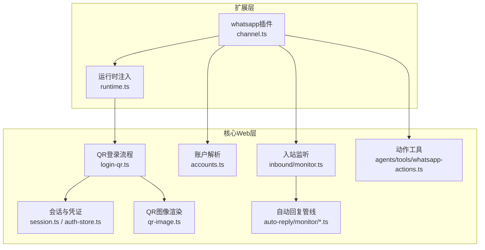
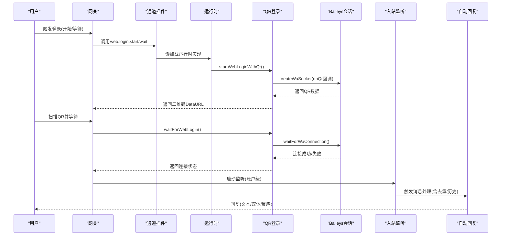
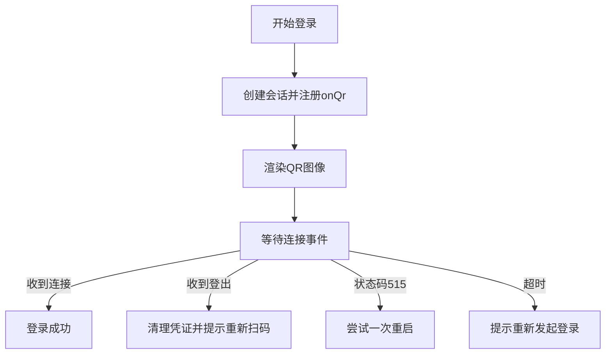
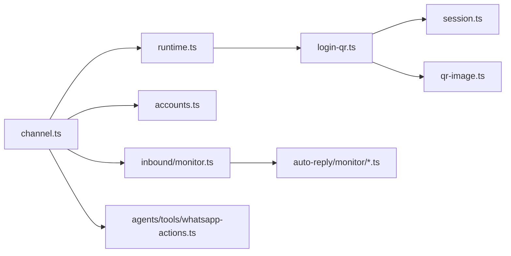

# WhatsApp集成

<cite>
**本文引用的文件**
- [extensions/whatsapp/src/channel.ts](file://extensions/whatsapp/src/channel.ts)
- [extensions/whatsapp/src/runtime.ts](file://extensions/whatsapp/src/runtime.ts)
- [src/web/login-qr.ts](file://src/web/login-qr.ts)
- [src/web/session.ts](file://src/web/session.ts)
- [src/web/auth-store.ts](file://src/web/auth-store.ts)
- [src/web/qr-image.ts](file://src/web/qr-image.ts)
- [src/web/accounts.ts](file://src/web/accounts.ts)
- [src/web/inbound/monitor.ts](file://src/web/inbound/monitor.ts)
- [src/web/auto-reply/monitor/process-message.ts](file://src/web/auto-reply/monitor/process-message.ts)
- [src/web/auto-reply/web-auto-reply-monitor.test.ts](file://src/web/auto-reply/web-auto-reply-monitor.test.ts)
- [src/agents/tools/whatsapp-actions.ts](file://src/agents/tools/whatsapp-actions.ts)
- [src/plugins/runtime/index.ts](file://src/plugins/runtime/index.ts)
- [docs/channels/whatsapp.md](file://docs/channels/whatsapp.md)
- [docs/gateway/configuration-reference.md](file://docs/gateway/configuration-reference.md)
- [docs/zh-CN/gateway/configuration.md](file://docs/zh-CN/gateway/configuration.md)
- [src/config/zod-schema.providers-whatsapp.ts](file://src/config/zod-schema.providers-whatsapp.ts)
- [src/config/types.whatsapp.ts](file://src/config/types.whatsapp.ts)
- [src/web/auto-reply/monitor.ts](file://src/web/auto-reply/monitor.ts)
- [src/web/inbound/access-control.group-policy.test.ts](file://src/web/inbound/access-control.group-policy.test.ts)
</cite>

## 目录

1. [简介](#简介)
2. [项目结构](#项目结构)
3. [核心组件](#核心组件)
4. [架构总览](#架构总览)
5. [详细组件分析](#详细组件分析)
6. [依赖关系分析](#依赖关系分析)
7. [性能考量](#性能考量)
8. [故障排查指南](#故障排查指南)
9. [结论](#结论)
10. [附录](#附录)

## 简介

本文件系统性阐述OpenClaw的WhatsApp集成功能，覆盖以下方面：

- WhatsApp Web客户端实现原理：QR登录流程、设备配对机制、消息同步策略
- WhatsApp Business API使用边界：当前架构基于WhatsApp Web（Baileys），不直接对接Business API
- 消息格式转换、多媒体内容处理、群组管理策略
- 配置示例、登录认证、消息模板与错误处理策略
- API限制、隐私设置与最佳实践

## 项目结构

WhatsApp集成由“扩展插件 + 运行时桥接 + 核心Web通道”三层构成：

- 扩展层：定义通道能力、配置模式、安全策略与网关方法
- 运行时层：通过懒加载动态注入实际实现（登录、监听、动作）
- 核心Web层：QR生成与等待、会话建立与持久化、入站消息处理与去重

图表来源

- [extensions/whatsapp/src/channel.ts](file://extensions/whatsapp/src/channel.ts#L39-L460)
- [extensions/whatsapp/src/runtime.ts](file://extensions/whatsapp/src/runtime.ts#L1-L15)
- [src/web/login-qr.ts](file://src/web/login-qr.ts#L108-L214)
- [src/web/session.ts](file://src/web/session.ts#L90-L161)
- [src/web/auth-store.ts](file://src/web/auth-store.ts#L82-L102)
- [src/web/qr-image.ts](file://src/web/qr-image.ts#L25-L54)
- [src/web/accounts.ts](file://src/web/accounts.ts#L114-L148)
- [src/web/inbound/monitor.ts](file://src/web/inbound/monitor.ts#L154-L189)
- [src/web/auto-reply/monitor/process-message.ts](file://src/web/auto-reply/monitor/process-message.ts#L251-L290)
- [src/agents/tools/whatsapp-actions.ts](file://src/agents/tools/whatsapp-actions.ts#L28-L50)

章节来源

- [extensions/whatsapp/src/channel.ts](file://extensions/whatsapp/src/channel.ts#L39-L460)
- [src/web/login-qr.ts](file://src/web/login-qr.ts#L108-L214)
- [src/web/session.ts](file://src/web/session.ts#L90-L161)
- [src/web/auth-store.ts](file://src/web/auth-store.ts#L82-L102)
- [src/web/qr-image.ts](file://src/web/qr-image.ts#L25-L54)
- [src/web/accounts.ts](file://src/web/accounts.ts#L114-L148)
- [src/web/inbound/monitor.ts](file://src/web/inbound/monitor.ts#L154-L189)
- [src/web/auto-reply/monitor/process-message.ts](file://src/web/auto-reply/monitor/process-message.ts#L251-L290)
- [src/agents/tools/whatsapp-actions.ts](file://src/agents/tools/whatsapp-actions.ts#L28-L50)

## 核心组件

- 通道插件：声明能力、目标解析、目录查询、动作支持、出站发送与心跳检查
- 登录与会话：QR生成、等待连接、错误处理、凭证备份与恢复、自检与日志
- 账户与策略：多账号解析、允许列表、群组策略、去重与历史注入
- 自动回复：文本分片、媒体处理、提及检测、会话隔离与响应前缀
- 动作工具：反应（reaction）等动作执行

章节来源

- [extensions/whatsapp/src/channel.ts](file://extensions/whatsapp/src/channel.ts#L39-L460)
- [src/web/login-qr.ts](file://src/web/login-qr.ts#L108-L296)
- [src/web/session.ts](file://src/web/session.ts#L90-L313)
- [src/web/auth-store.ts](file://src/web/auth-store.ts#L82-L207)
- [src/web/accounts.ts](file://src/web/accounts.ts#L114-L155)
- [src/web/auto-reply/monitor/process-message.ts](file://src/web/auto-reply/monitor/process-message.ts#L251-L290)
- [src/agents/tools/whatsapp-actions.ts](file://src/agents/tools/whatsapp-actions.ts#L28-L50)

## 架构总览

下图展示从用户触发到消息送达的端到端流程，涵盖QR登录、会话持久化、入站处理与自动回复。

图表来源

- [extensions/whatsapp/src/channel.ts](file://extensions/whatsapp/src/channel.ts#L441-L457)
- [src/web/login-qr.ts](file://src/web/login-qr.ts#L108-L296)
- [src/web/session.ts](file://src/web/session.ts#L90-L184)
- [src/web/inbound/monitor.ts](file://src/web/inbound/monitor.ts#L154-L189)
- [src/web/auto-reply/monitor/process-message.ts](file://src/web/auto-reply/monitor/process-message.ts#L251-L290)

## 详细组件分析

### QR登录与设备配对

- 流程要点
  - 生成一次性QR：创建会话、注册onQr回调、渲染PNG Base64
  - 等待扫描：轮询连接事件，超时与错误处理，必要时重启连接
  - 设备配对：首次配对后缓存凭证，后续复用；支持强制重新链接
- 错误与重试
  - 登出：清除凭证并提示重新扫码
  - 重启：针对特定状态码进行一次自动重连
  - 超时：到期后需重新发起登录

图表来源

- [src/web/login-qr.ts](file://src/web/login-qr.ts#L108-L214)
- [src/web/login-qr.ts](file://src/web/login-qr.ts#L216-L296)
- [src/web/session.ts](file://src/web/session.ts#L121-L151)

章节来源

- [src/web/login-qr.ts](file://src/web/login-qr.ts#L108-L296)
- [src/web/session.ts](file://src/web/session.ts#L90-L184)
- [src/web/qr-image.ts](file://src/web/qr-image.ts#L25-L54)

### 会话持久化与凭证管理

- 凭证存储
  - 多文件状态：creds.json、备份creds.json.bak、密钥与会话文件
  - 自动备份：保存前写入备份，严格权限控制
  - 恢复策略：creds损坏时从备份恢复
- 会话生命周期
  - 连接事件：记录连接/断开、打印QR、WebSocket错误兜底
  - 年龄统计：用于心跳与可观测性
  - 自检与日志：读取自身身份、输出人类可读信息

章节来源

- [src/web/auth-store.ts](file://src/web/auth-store.ts#L51-L102)
- [src/web/auth-store.ts](file://src/web/auth-store.ts#L131-L150)
- [src/web/auth-store.ts](file://src/web/auth-store.ts#L152-L192)
- [src/web/session.ts](file://src/web/session.ts#L90-L184)

### 账户与策略解析

- 多账号支持
  - 默认账号与命名账号并存，支持覆盖authDir与策略
  - 兼容旧版凭证目录，自动迁移
- 访问控制
  - DM策略：pairing/allowlist/open/disabled
  - 群组策略：open/allowlist/disabled，支持sender白名单与群组白名单
  - 提及检测：显式@、正则、回复机器人三类
- 会话隔离
  - 群聊会话键：agent:<agentId>:whatsapp:group:<jid>
  - 历史注入：未处理消息缓冲与上下文注入

章节来源

- [src/web/accounts.ts](file://src/web/accounts.ts#L114-L148)
- [src/web/accounts.ts](file://src/web/accounts.ts#L39-L62)
- [src/web/auto-reply/web-auto-reply-monitor.test.ts](file://src/web/auto-reply/web-auto-reply-monitor.test.ts#L38-L84)
- [src/web/auto-reply/monitor/process-message.ts](file://src/web/auto-reply/monitor/process-message.ts#L251-L290)
- [src/web/inbound/access-control.group-policy.test.ts](file://src/web/inbound/access-control.group-policy.test.ts#L1-L29)

### 入站消息处理与去重

- 过滤与去重
  - 忽略@status/@broadcast
  - 基于消息ID与账户维度去重
- 上下文增强
  - 引用回复：追加“回复...”上下文
  - 媒体占位：图片/视频/音频/文档/贴图占位符
  - 地点/联系人：标准化为文本上下文
- 历史注入
  - 群聊未处理消息缓冲，触发时注入上下文标记

章节来源

- [src/web/inbound/monitor.ts](file://src/web/inbound/monitor.ts#L154-L189)
- [docs/channels/whatsapp.md](file://docs/channels/whatsapp.md#L212-L254)

### 出站发送与多媒体

- 文本分片
  - 默认上限4000字符，支持按换行或长度切分
- 媒体发送
  - 支持图片/视频/音频/文档/贴图
  - PTT兼容：音频类型修正为opus编解码
  - 多媒体回复：首项标题作为caption
  - 来源支持HTTP/HTTPS/file本地路径
- 读回执与ACK反应
  - 可配置是否发送读回执
  - 可配置即时ACK反应（直接/提及/从不）

章节来源

- [extensions/whatsapp/src/channel.ts](file://extensions/whatsapp/src/channel.ts#L285-L317)
- [docs/channels/whatsapp.md](file://docs/channels/whatsapp.md#L294-L315)
- [docs/channels/whatsapp.md](file://docs/channels/whatsapp.md#L317-L341)
- [src/config/zod-schema.providers-whatsapp.ts](file://src/config/zod-schema.providers-whatsapp.ts#L51-L59)
- [src/config/types.whatsapp.ts](file://src/config/types.whatsapp.ts#L67-L81)

### 动作工具：反应与投票

- 反应动作
  - 解析授权目标（含账户与allowFrom对齐）
  - 支持添加/移除表情
- 投票动作
  - 通过通道能力开放，受actions门控

章节来源

- [src/agents/tools/whatsapp-actions.ts](file://src/agents/tools/whatsapp-actions.ts#L28-L50)
- [extensions/whatsapp/src/channel.ts](file://extensions/whatsapp/src/channel.ts#L244-L283)

### 运行时桥接与懒加载

- 运行时注入
  - 通过setWhatsAppRuntime注入真实实现
  - 懒加载login-qr、outbound、web-channel与actions模块
- 网关方法
  - 提供web.login.start与web.login.wait网关调用入口

章节来源

- [extensions/whatsapp/src/runtime.ts](file://extensions/whatsapp/src/runtime.ts#L1-L15)
- [src/plugins/runtime/index.ts](file://src/plugins/runtime/index.ts#L194-L233)
- [extensions/whatsapp/src/channel.ts](file://extensions/whatsapp/src/channel.ts#L441-L457)

## 依赖关系分析

- 组件耦合
  - 通道插件依赖运行时注入，避免编译期强耦合
  - 登录流程依赖会话与凭证模块，形成清晰职责边界
- 外部依赖
  - Baileys作为Web客户端核心
  - qrcode-terminal用于终端QR打印（可选）
- 循环依赖
  - 通过懒加载与模块拆分避免循环导入

图表来源

- [extensions/whatsapp/src/channel.ts](file://extensions/whatsapp/src/channel.ts#L39-L460)
- [extensions/whatsapp/src/runtime.ts](file://extensions/whatsapp/src/runtime.ts#L1-L15)
- [src/web/login-qr.ts](file://src/web/login-qr.ts#L108-L214)
- [src/web/session.ts](file://src/web/session.ts#L90-L161)
- [src/web/qr-image.ts](file://src/web/qr-image.ts#L25-L54)
- [src/web/accounts.ts](file://src/web/accounts.ts#L114-L148)
- [src/web/inbound/monitor.ts](file://src/web/inbound/monitor.ts#L154-L189)
- [src/web/auto-reply/monitor/process-message.ts](file://src/web/auto-reply/monitor/process-message.ts#L251-L290)
- [src/agents/tools/whatsapp-actions.ts](file://src/agents/tools/whatsapp-actions.ts#L28-L50)

## 性能考量

- 连接与重连
  - 使用事件驱动与Promise竞态，避免阻塞
  - 对特定错误码进行一次性重试，降低人工干预
- 去重与历史
  - 基于消息ID与账户维度去重，减少重复处理
  - 群聊历史缓冲与注入，平衡延迟与上下文完整性
- 媒体优化
  - 图像自动压缩以满足大小限制
  - 失败时首项回退为文本警告，保证交付

## 故障排查指南

- 未链接（需要QR）
  - 症状：状态显示未链接
  - 处理：执行登录命令并确认网关运行
- 已链接但断连/重连循环
  - 症状：反复断开/重连
  - 处理：运行诊断命令查看日志，必要时重新登录
- 发送时报无活动监听
  - 症状：出站发送失败
  - 处理：确保网关运行且账户已链接
- 群消息被忽略
  - 排查顺序：groupPolicy/groupAllowFrom/groups、提及要求、配置重复键覆盖
- Bun运行时警告
  - WhatsApp网关建议使用Node运行，Bun不兼容

章节来源

- [docs/channels/whatsapp.md](file://docs/channels/whatsapp.md#L373-L423)

## 结论

OpenClaw的WhatsApp集成采用“扩展插件 + 运行时懒加载 + 核心Web通道”的架构，围绕QR登录、凭证持久化、入站去重与自动回复、多媒体处理与动作工具构建完整链路。当前实现基于WhatsApp Web（Baileys），未直接接入Business API；通过严格的访问控制、提及检测与会话隔离保障安全与可用性。建议在生产环境使用独立号码、合理配置策略与监控告警，并遵循本文最佳实践。

## 附录

### 配置参考要点

- 访问控制：dmPolicy、allowFrom、groupPolicy、groupAllowFrom、groups
- 交付行为：textChunkLimit、chunkMode、mediaMaxMb、sendReadReceipts、ackReaction
- 多账号：accounts.<id>.enabled、accounts.<id>.authDir、账户级覆盖
- 运维：configWrites、debounceMs、web.enabled、web.heartbeatSeconds、web.reconnect.\*

章节来源

- [docs/channels/whatsapp.md](file://docs/channels/whatsapp.md#L425-L438)
- [src/config/zod-schema.providers-whatsapp.ts](file://src/config/zod-schema.providers-whatsapp.ts#L34-L59)
- [src/config/types.whatsapp.ts](file://src/config/types.whatsapp.ts#L67-L81)

### 模板变量（媒体模型）

- 变量示例：{{Body}}、{{RawBody}}、{{BodyStripped}}、{{From}}、{{To}}、{{MessageSid}}、{{SessionId}}、{{IsNewSession}}、{{MediaUrl}}、{{MediaPath}}、{{MediaType}}、{{Transcript}}、{{Prompt}}、{{MaxChars}}、{{ChatType}}、{{GroupSubject}}、{{GroupMembers}}、{{SenderName}}、{{SenderE164}}、{{Provider}}

章节来源

- [docs/gateway/configuration-reference.md](file://docs/gateway/configuration-reference.md#L2737-L2765)
- [docs/zh-CN/gateway/configuration.md](file://docs/zh-CN/gateway/configuration.md#L3290-L3315)
