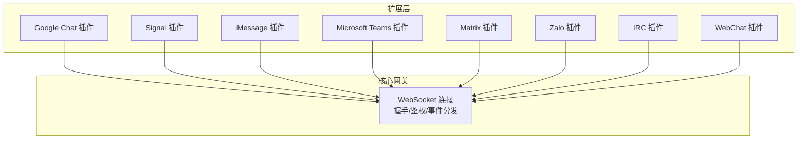
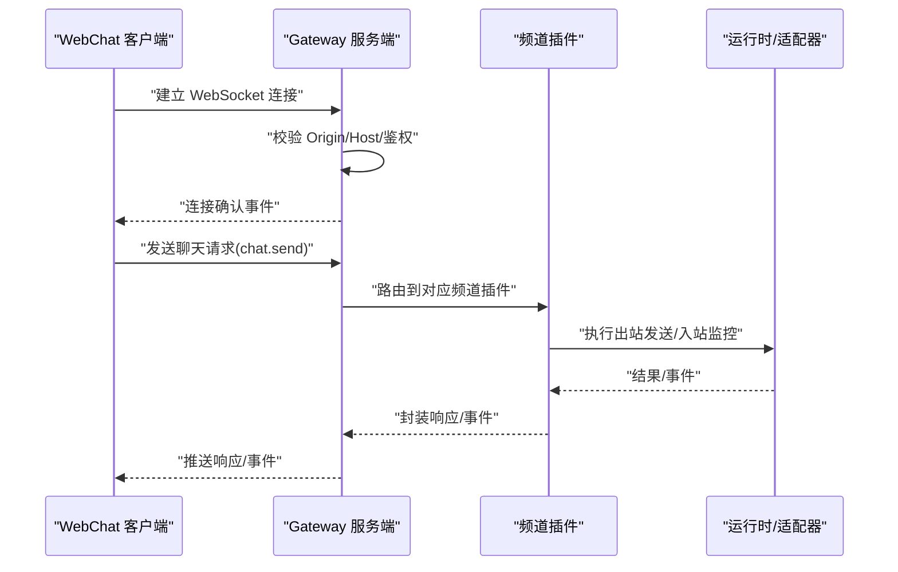
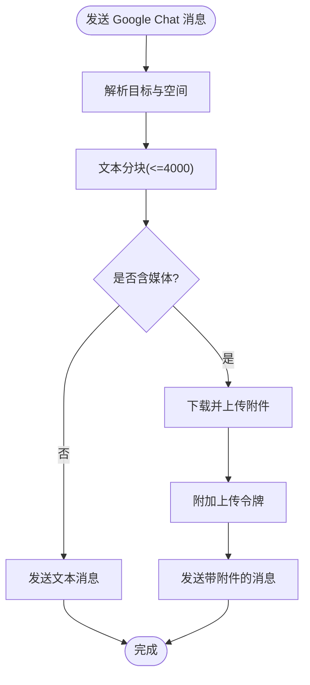
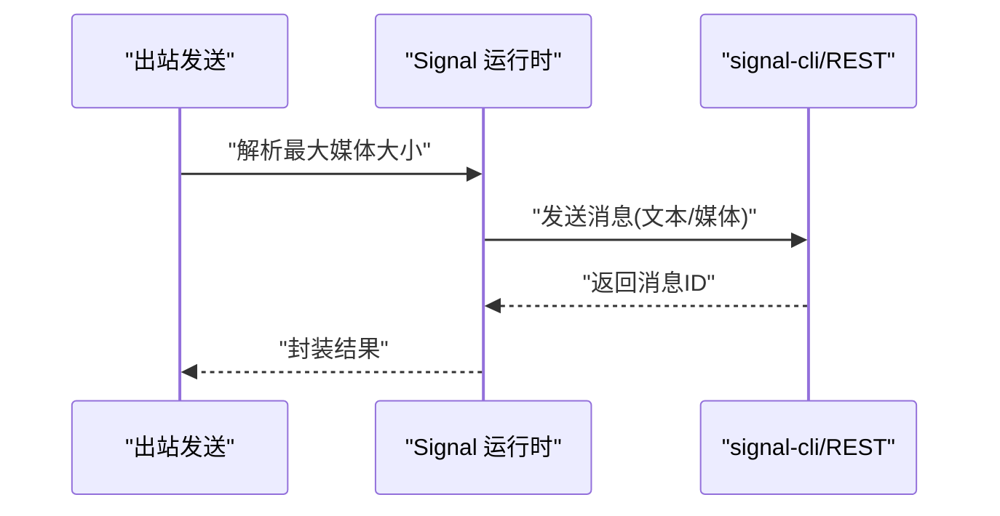
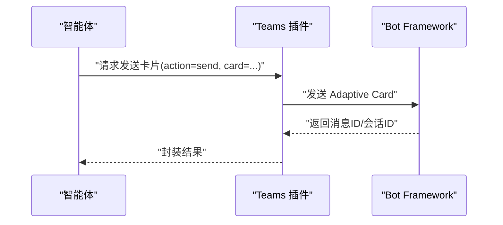
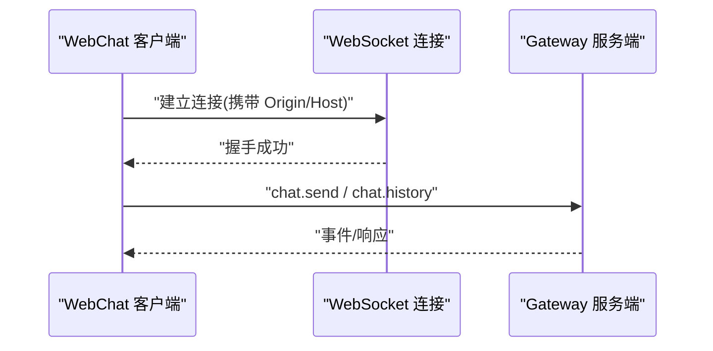
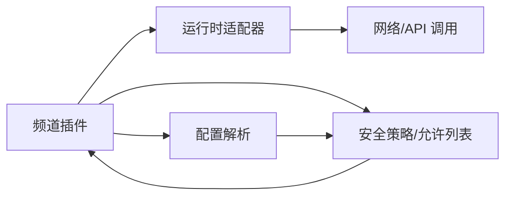

# 其他频道集成

<cite>
**本文引用的文件**
- [extensions/googlechat/src/channel.ts](file://extensions/googlechat/src/channel.ts)
- [extensions/signal/src/channel.ts](file://extensions/signal/src/channel.ts)
- [extensions/imessage/src/channel.ts](file://extensions/imessage/src/channel.ts)
- [extensions/msteams/src/channel.ts](file://extensions/msteams/src/channel.ts)
- [extensions/matrix/src/channel.ts](file://extensions/matrix/src/channel.ts)
- [extensions/zalo/src/channel.ts](file://extensions/zalo/src/channel.ts)
- [extensions/irc/src/channel.ts](file://extensions/irc/src/channel.ts)
- [docs/zh-CN/web/webchat.md](file://docs/zh-CN/web/webchat.md)
- [src/gateway/server/ws-connection.ts](file://src/gateway/server/ws-connection.ts)
- [apps/shared/OpenClawKit/Sources/OpenClawKit/GatewayChannel.swift](file://apps/shared/OpenClawKit/Sources/OpenClawKit/GatewayChannel.swift)
- [src/gateway/test-helpers.server.ts](file://src/gateway/test-helpers.server.ts)
- [src/config/types.channels.ts](file://src/config/types.channels.ts)
- [src/config/group-policy.ts](file://src/config/group-policy.ts)
- [src/security/audit-extra.sync.ts](file://src/security/audit-extra.sync.ts)
- [dist/plugin-sdk/agents/sandbox/constants.d.ts](file://dist/plugin-sdk/agents/sandbox/constants.d.ts)
</cite>

## 目录

1. [简介](#简介)
2. [项目结构](#项目结构)
3. [核心组件](#核心组件)
4. [架构总览](#架构总览)
5. [详细组件分析](#详细组件分析)
6. [依赖关系分析](#依赖关系分析)
7. [性能考量](#性能考量)
8. [故障排除指南](#故障排除指南)
9. [结论](#结论)
10. [附录](#附录)

## 简介

本文件系统化梳理 OpenClaw 的“其他频道”集成能力，覆盖 Google Chat、Signal、iMessage、Microsoft Teams、Matrix、Zalo、IRC 以及 Web（Gateway WebSocket UI）等频道。文档聚焦以下方面：

- 各频道的独特特性与差异
- 认证与配置要点
- 消息格式与发送/接收流程
- 配置示例路径与参数来源
- 错误处理策略与常见问题定位
- 限制条件、最佳实践与排障建议

## 项目结构

OpenClaw 将各频道以插件形式组织在 extensions 目录下，每个频道提供统一的 ChannelPlugin 接口，包括：

- 配置模式与校验
- 目标解析与允许列表
- 出站发送与入站监控
- 状态采集与健康探测
- 分身（账户）管理与配对提示

图表来源

- [extensions/googlechat/src/channel.ts](file://extensions/googlechat/src/channel.ts#L100-L583)
- [extensions/signal/src/channel.ts](file://extensions/signal/src/channel.ts#L48-L300)
- [extensions/imessage/src/channel.ts](file://extensions/imessage/src/channel.ts#L31-L305)
- [extensions/msteams/src/channel.ts](file://extensions/msteams/src/channel.ts#L45-L461)
- [extensions/matrix/src/channel.ts](file://extensions/matrix/src/channel.ts#L96-L487)
- [extensions/zalo/src/channel.ts](file://extensions/zalo/src/channel.ts#L82-L399)
- [extensions/irc/src/channel.ts](file://extensions/irc/src/channel.ts#L46-L365)
- [src/gateway/server/ws-connection.ts](file://src/gateway/server/ws-connection.ts#L106-L130)

章节来源

- [extensions/googlechat/src/channel.ts](file://extensions/googlechat/src/channel.ts#L100-L583)
- [extensions/signal/src/channel.ts](file://extensions/signal/src/channel.ts#L48-L300)
- [extensions/imessage/src/channel.ts](file://extensions/imessage/src/channel.ts#L31-L305)
- [extensions/msteams/src/channel.ts](file://extensions/msteams/src/channel.ts#L45-L461)
- [extensions/matrix/src/channel.ts](file://extensions/matrix/src/channel.ts#L96-L487)
- [extensions/zalo/src/channel.ts](file://extensions/zalo/src/channel.ts#L82-L399)
- [extensions/irc/src/channel.ts](file://extensions/irc/src/channel.ts#L46-L365)
- [src/gateway/server/ws-connection.ts](file://src/gateway/server/ws-connection.ts#L106-L130)

## 核心组件

- 渠道插件接口（ChannelPlugin）：定义配置、安全策略、消息收发、目录解析、动作适配、状态采集与网关启动等能力。
- 允许列表与分身（账户）：支持按账户维度的 allowFrom、组策略与默认目标解析。
- 目标规范化与解析：针对不同协议的 ID 规范化、前缀去除、类型识别与解析。
- 状态与健康检查：统一的状态摘要、探针与错误收集。

章节来源

- [src/config/types.channels.ts](file://src/config/types.channels.ts#L1-L27)
- [src/config/group-policy.ts](file://src/config/group-policy.ts#L282-L323)
- [src/security/audit-extra.sync.ts](file://src/security/audit-extra.sync.ts#L375-L416)

## 架构总览

各频道通过各自的 ChannelPlugin 实现与 Gateway 网关交互。网关负责：

- WebSocket 握手与鉴权
- 事件序列号与乱序检测
- 请求/响应帧编解码
- Canvas 主机 URL 解析与转发

图表来源

- [src/gateway/server/ws-connection.ts](file://src/gateway/server/ws-connection.ts#L106-L130)
- [apps/shared/OpenClawKit/Sources/OpenClawKit/GatewayChannel.swift](file://apps/shared/OpenClawKit/Sources/OpenClawKit/GatewayChannel.swift#L518-L548)
- [src/gateway/test-helpers.server.ts](file://src/gateway/test-helpers.server.ts#L620-L656)

## 详细组件分析

### Google Chat 集成

- 独特特性
  - 支持空间（群组）与用户（私信）两种直接消息类型，具备线程与反应能力。
  - 支持媒体上传与附件发送。
- 认证与配置
  - 服务账号凭据（JSON 或文件），需配置 audienceType 与 audience。
  - 可选 webhook 路径与 URL。
- 消息格式
  - 文本分块基于 Markdown；媒体下载后上传再发送。
- 关键实现要点
  - 目标规范化：支持 spaces/{space} 与 users/{user}。
  - 线程模式：支持 replyToMode 控制。
  - 安全策略：DM 策略默认 pairing，可设为 allowlist；群组策略默认 open 时给出警告。
- 配置示例路径
  - [extensions/googlechat/src/channel.ts](file://extensions/googlechat/src/channel.ts#L316-L379)
- 错误处理
  - 缺少 audience/auidenceType 时收集配置问题；运行时错误通过状态快照记录。

图表来源

- [extensions/googlechat/src/channel.ts](file://extensions/googlechat/src/channel.ts#L405-L471)

章节来源

- [extensions/googlechat/src/channel.ts](file://extensions/googlechat/src/channel.ts#L52-L87)
- [extensions/googlechat/src/channel.ts](file://extensions/googlechat/src/channel.ts#L186-L227)
- [extensions/googlechat/src/channel.ts](file://extensions/googlechat/src/channel.ts#L381-L472)
- [extensions/googlechat/src/channel.ts](file://extensions/googlechat/src/channel.ts#L473-L544)

### Signal 集成

- 独特特性
  - 基于 signal-cli 的 REST/HTTP 接口或 CLI。
  - 支持媒体与反应。
- 认证与配置
  - 支持 --signal-number、--http-url/--http-host/--http-port/--cli-path 组合。
- 消息格式
  - 文本分块基于通用文本分块器；媒体通过 URL 下载后发送。
- 安全策略
  - 默认 DM 策略为 pairing，群组策略为 open 时给出警告。
- 配置示例路径
  - [extensions/signal/src/channel.ts](file://extensions/signal/src/channel.ts#L159-L170)
  - [extensions/signal/src/channel.ts](file://extensions/signal/src/channel.ts#L171-L224)

图表来源

- [extensions/signal/src/channel.ts](file://extensions/signal/src/channel.ts#L226-L262)

章节来源

- [extensions/signal/src/channel.ts](file://extensions/signal/src/channel.ts#L48-L300)

### iMessage 集成

- 独特特性
  - 通过 imsg CLI 与数据库交互，支持 macOS 生态。
- 认证与配置
  - 支持指定 CLI 路径与数据库路径，可选择服务与区域。
- 安全策略
  - 默认 DM 策略为 pairing，群组策略为 open 时给出警告。
- 配置示例路径
  - [extensions/imessage/src/channel.ts](file://extensions/imessage/src/channel.ts#L127-L187)

章节来源

- [extensions/imessage/src/channel.ts](file://extensions/imessage/src/channel.ts#L31-L305)

### Microsoft Teams 集成

- 独特特性
  - 基于 Bot Framework，支持 Adaptive Cards、投票、线程与媒体。
- 认证与配置
  - 通过凭据解析（如应用注册信息）进行鉴权。
- 目标解析
  - 支持 user:ID、conversation:ID 等多种输入形式。
- 安全策略
  - 群组策略为 open 时给出警告。
- 动作支持
  - 支持 poll 动作；支持 card 参数发送自适应卡片。
- 配置示例路径
  - [extensions/msteams/src/channel.ts](file://extensions/msteams/src/channel.ts#L146-L158)
  - [extensions/msteams/src/channel.ts](file://extensions/msteams/src/channel.ts#L240-L366)

图表来源

- [extensions/msteams/src/channel.ts](file://extensions/msteams/src/channel.ts#L384-L423)

章节来源

- [extensions/msteams/src/channel.ts](file://extensions/msteams/src/channel.ts#L45-L461)

### Matrix 集成

- 独特特性
  - 开放协议，支持 homeserver + 访问令牌或密码登录。
  - 支持房间/用户/别名等多种目标形式。
- 认证与配置
  - 支持 --homeserver、--user-id、--access-token、--password、--device-name、--initial-sync-limit。
- 安全策略
  - 群组策略为 open 时给出警告。
- 配置示例路径
  - [extensions/matrix/src/channel.ts](file://extensions/matrix/src/channel.ts#L311-L370)

章节来源

- [extensions/matrix/src/channel.ts](file://extensions/matrix/src/channel.ts#L96-L487)

### Zalo 集成

- 独特特性
  - 越南主流平台，Bot API，支持媒体。
- 认证与配置
  - 支持 botToken 或 tokenFile；支持环境变量注入。
- 安全策略
  - 群组策略为 open 且未配置 allowFrom 时给出警告。
- 配置示例路径
  - [extensions/zalo/src/channel.ts](file://extensions/zalo/src/channel.ts#L214-L287)

章节来源

- [extensions/zalo/src/channel.ts](file://extensions/zalo/src/channel.ts#L82-L399)

### IRC 集成

- 独特特性
  - 经典 IRC 协议，支持通道与用户消息，具备媒体发送能力（作为文本附加）。
- 认证与配置
  - 支持 host/port/tls/nick/用户名/真实姓名/密码/密码文件/初始加入频道等。
- 安全策略
  - 群组策略为 open 时给出警告；未启用 TLS 时给出安全警告；NickServ 注册相关配置给出提示。
- 配置示例路径
  - [extensions/irc/src/channel.ts](file://extensions/irc/src/channel.ts#L70-L100)

章节来源

- [extensions/irc/src/channel.ts](file://extensions/irc/src/channel.ts#L46-L365)

### Web（Gateway WebSocket UI）集成

- 独特特性
  - macOS/iOS 原生聊天 UI 直连 Gateway WebSocket，使用相同会话与路由规则。
  - 确定性路由：回复始终返回到 WebChat。
- 工作原理
  - UI 通过 chat.history、chat.send、chat.inject 与网关交互；历史记录来自网关；网关不可达时 UI 为只读。
- 配置参考
  - 无专用 webchat.\* 块，使用 Gateway 网关端点与认证设置。
- 配置示例路径
  - [docs/zh-CN/web/webchat.md](file://docs/zh-CN/web/webchat.md#L15-L49)

图表来源

- [src/gateway/server/ws-connection.ts](file://src/gateway/server/ws-connection.ts#L106-L130)
- [src/gateway/test-helpers.server.ts](file://src/gateway/test-helpers.server.ts#L620-L656)

章节来源

- [docs/zh-CN/web/webchat.md](file://docs/zh-CN/web/webchat.md#L15-L49)
- [src/gateway/server/ws-connection.ts](file://src/gateway/server/ws-connection.ts#L106-L130)
- [apps/shared/OpenClawKit/Sources/OpenClawKit/GatewayChannel.swift](file://apps/shared/OpenClawKit/Sources/OpenClawKit/GatewayChannel.swift#L518-L548)

## 依赖关系分析

- 插件与运行时
  - 各频道插件通过 getXXXRuntime() 获取运行时能力（如文本分块、媒体下载、发送、监控）。
- 网关与客户端
  - 客户端通过 WebSocket 与网关通信，网关负责鉴权、事件序列号与乱序检测。
- 安全与策略
  - 允许列表与组策略在配置层面生效，并在运行时由插件收集警告与问题。

图表来源

- [extensions/googlechat/src/channel.ts](file://extensions/googlechat/src/channel.ts#L31-L35)
- [extensions/signal/src/channel.ts](file://extensions/signal/src/channel.ts#L31-L31)
- [extensions/msteams/src/channel.ts](file://extensions/msteams/src/channel.ts#L14-L26)
- [extensions/matrix/src/channel.ts](file://extensions/matrix/src/channel.ts#L28-L35)
- [extensions/zalo/src/channel.ts](file://extensions/zalo/src/channel.ts#L34-L35)
- [extensions/irc/src/channel.ts](file://extensions/irc/src/channel.ts#L32-L33)

章节来源

- [extensions/googlechat/src/channel.ts](file://extensions/googlechat/src/channel.ts#L31-L35)
- [extensions/signal/src/channel.ts](file://extensions/signal/src/channel.ts#L31-L31)
- [extensions/msteams/src/channel.ts](file://extensions/msteams/src/channel.ts#L14-L26)
- [extensions/matrix/src/channel.ts](file://extensions/matrix/src/channel.ts#L28-L35)
- [extensions/zalo/src/channel.ts](file://extensions/zalo/src/channel.ts#L34-L35)
- [extensions/irc/src/channel.ts](file://extensions/irc/src/channel.ts#L32-L33)

## 性能考量

- 文本分块与媒体限制
  - 各频道根据自身限制设定 textChunkLimit（如 Google Chat 4000、Zalo 2000、IRC 350），避免单次发送过大。
- 流式输出阻断
  - 多数频道开启 blockStreaming 以避免过长文本导致 UI 卡顿。
- 媒体下载与上传
  - Google Chat 在发送媒体前先下载并受 mediaMaxMb 限制，避免超限。
- 并发与动态导入
  - Matrix 提供启动互斥锁，避免并发动态导入导致的竞态。

章节来源

- [extensions/googlechat/src/channel.ts](file://extensions/googlechat/src/channel.ts#L61-L61)
- [extensions/zalo/src/channel.ts](file://extensions/zalo/src/channel.ts#L65-L65)
- [extensions/irc/src/channel.ts](file://extensions/irc/src/channel.ts#L298-L298)
- [extensions/matrix/src/channel.ts](file://extensions/matrix/src/channel.ts#L450-L484)

## 故障排除指南

- 配置问题
  - Google Chat：缺少 audience 或 audienceType 会被标记为配置问题。
  - Matrix：探针失败会记录错误；Zalo：token 缺失或无效。
  - IRC：TLS 关闭、NickServ 注册开启且未配置密码会给出安全警告。
- 运行时错误
  - iMessage：运行时 lastError 会被收集为状态问题。
  - Signal/Matrix/Zalo：状态快照包含 lastError 字段，便于定位。
- 安全审计
  - 允许列表包含 "\*" 或 DM 策略为 open 时，会生成审计警告，建议改为 allowlist。
- 网关连接
  - WebChat：若网关不可达，UI 为只读；检查 Origin/Host/鉴权头与端口可达性。

章节来源

- [extensions/googlechat/src/channel.ts](file://extensions/googlechat/src/channel.ts#L481-L509)
- [extensions/matrix/src/channel.ts](file://extensions/matrix/src/channel.ts#L381-L395)
- [extensions/zalo/src/channel.ts](file://extensions/zalo/src/channel.ts#L339-L340)
- [extensions/irc/src/channel.ts](file://extensions/irc/src/channel.ts#L139-L167)
- [src/security/audit-extra.sync.ts](file://src/security/audit-extra.sync.ts#L375-L416)
- [src/gateway/server/ws-connection.ts](file://src/gateway/server/ws-connection.ts#L106-L130)

## 结论

OpenClaw 对“其他频道”的集成采用统一的 ChannelPlugin 抽象，既保证了跨频道的一致性体验，又保留了各协议的差异化能力。通过明确的配置模式、目标解析、安全策略与状态监控，用户可以快速完成多频道部署与运维。建议在生产环境中优先使用 allowlist 策略、启用 TLS、合理设置媒体大小与分块阈值，并定期检查网关连接与频道探针状态。

## 附录

- 工具与沙箱限制
  - 某些工具在沙箱中默认被禁止，需显式授权。参见：
    - [dist/plugin-sdk/agents/sandbox/constants.d.ts](file://dist/plugin-sdk/agents/sandbox/constants.d.ts#L7-L7)
