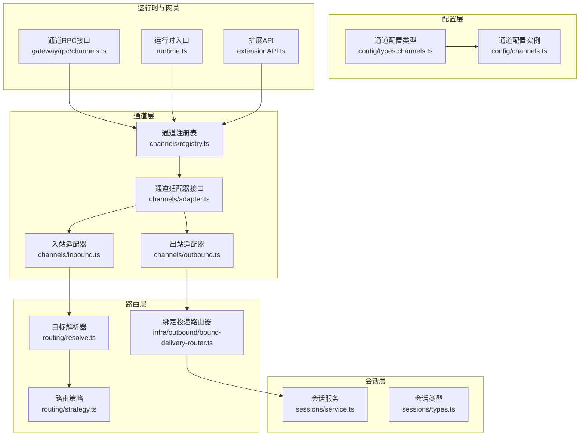
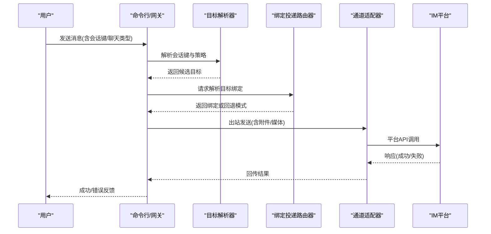
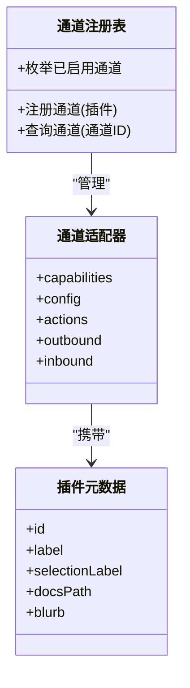
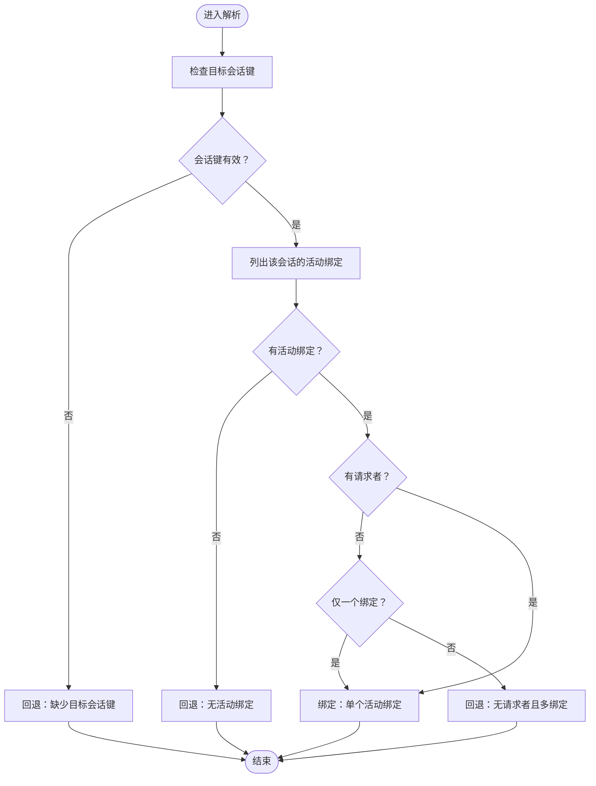
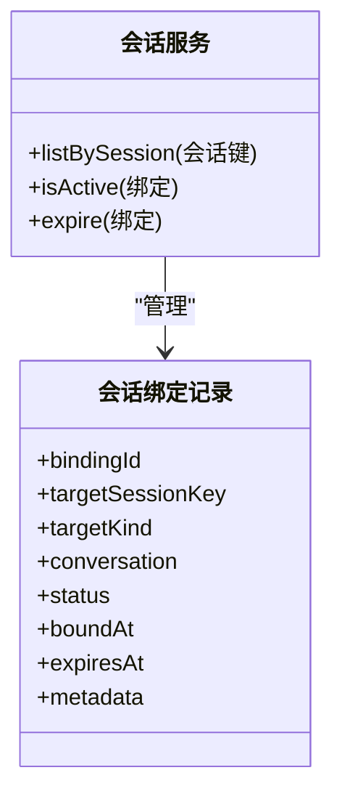
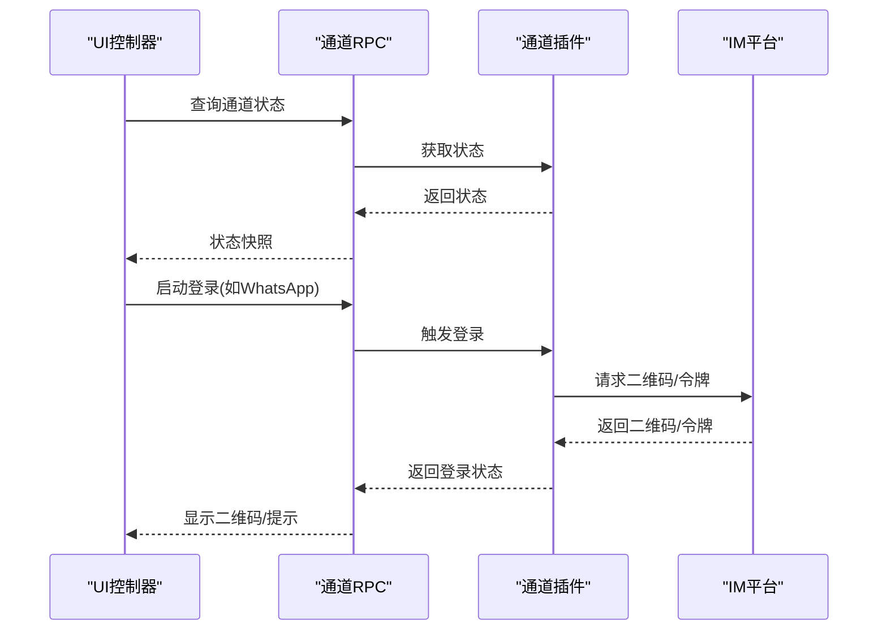
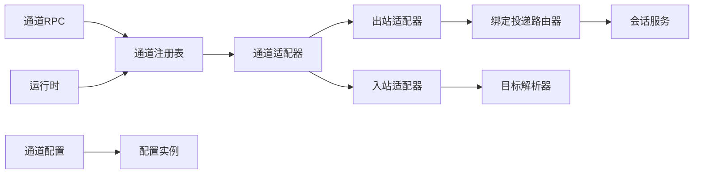

# 多渠道消息集成

<cite>
**本文引用的文件**
- [src/infra/outbound/bound-delivery-router.ts](file://src/infra/outbound/bound-delivery-router.ts)
- [docs/experiments/plans/session-binding-channel-agnostic.md](file://docs/experiments/plans/session-binding-channel-agnostic.md)
- [src/config/types.channels.ts](file://src/config/types.channels.ts)
- [src/commands/message.test.ts](file://src/commands/message.test.ts)
- [extensions/whatsapp/openclaw.plugin.json](file://extensions/whatsapp/openclaw.plugin.json)
- [ui/src/ui/controllers/channels.ts](file://ui/src/ui/controllers/channels.ts)
- [apps/macos/Sources/OpenClaw/ChannelsSettings+ChannelState.swift](file://apps/macos/Sources/OpenClaw/ChannelsSettings+ChannelState.swift)
- [src/gateway/rpc/channels.ts](file://src/gateway/rpc/channels.ts)
- [src/shared/types/channels.ts](file://src/shared/types/channels.ts)
- [src/channels/registry.ts](file://src/channels/registry.ts)
- [src/channels/types.ts](file://src/channels/types.ts)
- [src/channels/adapter.ts](file://src/channels/adapter.ts)
- [src/channels/outbound.ts](file://src/channels/outbound.ts)
- [src/channels/inbound.ts](file://src/channels/inbound.ts)
- [src/sessions/service.ts](file://src/sessions/service.ts)
- [src/sessions/types.ts](file://src/sessions/types.ts)
- [src/security/policies.ts](file://src/security/policies.ts)
- [src/media/types.ts](file://src/media/types.ts)
- [src/media/utils.ts](file://src/media/utils.ts)
- [src/logging.ts](file://src/logging.ts)
- [src/routing/resolve.ts](file://src/routing/resolve.ts)
- [src/routing/strategy.ts](file://src/routing/strategy.ts)
- [src/config/channels.ts](file://src/config/channels.ts)
- [src/config/types.ts](file://src/config/types.ts)
- [src/extensionAPI.ts](file://src/extensionAPI.ts)
- [src/runtime.ts](file://src/runtime.ts)
- [src/globals.ts](file://src/globals.ts)
- [src/index.ts](file://src/index.ts)
- [src/entry.ts](file://src/entry.ts)
- [dist/channel-web.js](file://dist/channel-web.js)
- [dist/message-channel.js](file://dist/message-channel.js)
- [dist/send.js](file://dist/send.js)
- [dist/delivery-queue.js](file://dist/delivery-queue.js)
- [dist/commands.js](file://dist/commands.js)
- [dist/config.js](file://dist/config.js)
- [dist/rpc.js](file://dist/rpc.js)
- [dist/webhooks-cli.js](file://dist/webhooks-cli.js)
- [dist/onboard-channels.js](file://dist/onboard-channels.js)
- [dist/onboard-config.js](file://dist/onboard-config.js)
- [dist/onboarding.finalize.js](file://dist/onboarding.finalize.js)
- [dist/onboarding.gateway-config.js](file://dist/onboarding.gateway-config.js)
- [dist/daemon-runtime.js](file://dist/daemon-runtime.js)
- [dist/daemon-install.js](file://dist/daemon-install.js)
- [dist/daemon-cli.js](file://dist/daemon-cli.js)
- [dist/cli-utils.js](file://dist/cli-utils.js)
- [dist/cli.js](file://dist/cli.js)
- [dist/api.js](file://dist/api.js)
- [dist/web.js](file://dist/web.js)
- [dist/browser-cli.js](file://dist/browser-cli.js)
- [dist/control-ui.js](file://dist/control-ui.js)
- [dist/active-listener.js](file://dist/active-listener.js)
- [dist/auth.js](file://dist/auth.js)
- [dist/auth-token.js](file://dist/auth-token.js)
- [dist/auth-profiles.js](file://dist/auth-profiles.js)
- [dist/auth-choice.js](file://dist/auth-choice.js)
- [dist/channel-activity.js](file://dist/channel-activity.js)
- [dist/channel-options.js](file://dist/channel-options.js)
- [dist/channel-selection.js](file://dist/channel-selection.js)
- [dist/channel-web.js](file://dist/channel-web.js)
- [dist/channels-cli.js](file://dist/channels-cli.js)
- [dist/channels-status-issues.js](file://dist/channels-status-issues.js)
- [dist/chat-envelope.js](file://dist/chat-envelope.js)
- [dist/chat-type.js](file://dist/chat-type.js)
- [dist/client.js](file://dist/client.js)
- [dist/command-format.js](file://dist/command-format.js)
- [dist/command-options.js](file://dist/command-options.js)
- [dist/command-poll-backoff.js](file://dist/command-poll-backoff.js)
- [dist/command-registry.js](file://dist/command-registry.js)
- [dist/commands.js](file://dist/commands.js)
- [dist/credentials.js](file://dist/credentials.js)
- [dist/diagnostics.js](file://dist/diagnostics.js)
- [dist/diagnostic-session-state.js](file://dist/diagnostic-session-state.js)
- [dist/dock.js](file://dist/dock.js)
- [dist/errors.js](file://dist/errors.js)
- [dist/exec-approvals.js](file://dist/exec-approvals.js)
- [dist/fetch-guard.js](file://dist/fetch-guard.js)
- [dist/fetch-timeout.js](file://dist/fetch-timeout.js)
- [dist/format-duration.js](file://dist/format-duration.js)
- [dist/format.js](file://dist/format.js)
- [dist/frontmatter.js](file://dist/frontmatter.js)
- [dist/gateway-cli.js](file://dist/gateway-cli.js)
- [dist/gateway-rpc.js](file://dist/gateway-rpc.js)
- [dist/gemini-auth.js](file://dist/gemini-auth.js)
- [dist/github-copilot-token.js](file://dist/github-copilot-token.js)
- [dist/gmail-setup-utils.js](file://dist/gmail-setup-utils.js)
- [dist/health.js](file://dist/health.js)
- [dist/heartbeat-visibility.js](file://dist/heartbeat-visibility.js)
- [dist/help-format.js](file://dist/help-format.js)
- [dist/helpers.js](file://dist/helpers.js)
- [dist/hooks-cli.js](file://dist/hooks-cli.js)
- [dist/hooks-status.js](file://dist/hooks-status.js)
- [dist/image-ops.js](file://dist/image-ops.js)
- [dist/inbound-context.js](file://dist/inbound-context.js)
- [dist/install-safe-path.js](file://dist/install-safe-path.js)
- [dist/legacy-names.js](file://dist/legacy-names.js)
- [dist/lifecycle-core.js](file://dist/lifecycle-core.js)
- [dist/local-roots.js](file://dist/local-roots.js)
- [dist/logging.js](file://dist/logging.js)
- [dist/manager.js](file://dist/manager.js)
- [dist/manifest-registry.js](file://dist/manifest-registry.js)
- [dist/markdown-tables.js](file://dist/markdown-tables.js)
- [dist/memory-cli.js](file://dist/memory-cli.js)
- [dist/model-catalog.js](file://dist/model-catalog.js)
- [dist/model-picker.js](file://dist/model-picker.js)
- [dist/models-cli.js](file://dist/models-cli.js)
- [dist/models-config.js](file://dist/models-config.js)
- [dist/models.js](file://dist/models.js)
- [dist/mutable-allowlist-detectors.js](file://dist/mutable-allowlist-detectors.js)
- [dist/net.js](file://dist/net.js)
- [dist/node-cli.js](file://dist/node-cli.js)
- [dist/node-commands.js](file://dist/node-commands.js)
- [dist/node-match.js](file://dist/node-match.js)
- [dist/node-service.js](file://dist/node-service.js)
- [dist/nodes-cli.js](file://dist/nodes-cli.js)
- [dist/note.js](file://dist/note.js)
- [dist/npm-registry-spec.js](file://dist/npm-registry-spec.js)
- [dist/npm-resolution.js](file://dist/npm-resolution.js)
- [dist/onboard.js](file://dist/onboard.js)
- [dist/onboarding.js](file://dist/onboarding.js)
- [dist/onboarding.finalize.js](file://dist/onboarding.finalize.js)
- [dist/onboarding.gateway-config.js](file://dist/onboarding.gateway-config.js)
- [dist/openclaw-root.js](file://dist/openclaw-root.js)
- [dist/outbound.js](file://dist/outbound.js)
- [dist/outbound-attachment.js](file://dist/outbound-attachment.js)
- [dist/pairing-cli.js](file://dist/pairing-cli.js)
- [dist/pairing-labels.js](file://dist/pairing-labels.js)
- [dist/pairing-store.js](file://dist/pairing-store.js)
- [dist/pairing-token.js](file://dist/pairing-token.js)
- [dist/parse-port.js](file://dist/parse-port.js)
- [dist/path-alias-guards.js](file://dist/path-alias-guards.js)
- [dist/path-env.js](file://dist/path-env.js)
- [dist/path-safety.js](file://dist/path-safety.js)
- [dist/paths.js](file://dist/paths.js)
- [dist/pi-embedded.js](file://dist/pi-embedded.js)
- [dist/pi-embedded-helpers.js](file://dist/pi-embedded-helpers.js)
- [dist/pi-model-discovery.js](file://dist/pi-model-discovery.js)
- [dist/pi-tools.policy.js](file://dist/pi-tools.policy.js)
- [dist/plugin-auto-enable.js](file://dist/plugin-auto-enable.js)
- [dist/plugin-registry.js](file://dist/plugin-registry.js)
- [dist/plugins.js](file://dist/plugins.js)
- [dist/plugins-cli.js](file://dist/plugins-cli.js)
- [dist/polls.js](file://dist/polls.js)
- [dist/ports.js](file://dist/ports.js)
- [dist/program-context.js](file://dist/program-context.js)
- [dist/progress.js](file://dist/progress.js)
- [dist/prompt-select-styled.js](file://dist/prompt-select-styled.js)
- [dist/prompt-style.js](file://dist/prompt-style.js)
- [dist/prompts.js](file://dist/prompts.js)
- [dist/provider-auth-helpers.js](file://dist/provider-auth-helpers.js)
- [dist/provider-env-vars.js](file://dist/provider-env-vars.js)
- [dist/proxy.js](file://dist/proxy.js)
- [dist/push-apns.js](file://dist/push-apns.js)
- [dist/pw-ai.js](file://dist/pw-ai.js)
- [dist/qmd-manager.js](file://dist/qmd-manager.js)
- [dist/qr-cli.js](file://dist/qr-cli.js)
- [dist/query-expansion.js](file://dist/query-expansion.js)
- [dist/redact.js](file://dist/redact.js)
- [dist/register.agent.js](file://dist/register.agent.js)
- [dist/register.configure.js](file://dist/register.configure.js)
- [dist/register.message.js](file://dist/register.message.js)
- [dist/register.onboard.js](file://dist/register.onboard.js)
- [dist/register.setup.js](file://dist/register.setup.js)
- [dist/register.status-health-sessions.js](file://dist/register.status-health-sessions.js)
- [dist/register.subclis.js](file://dist/register.subclis.js)
- [dist/render.js](file://dist/render.js)
- [dist/replies.js](file://dist/replies.js)
- [dist/reply.js](file://dist/reply.js)
- [dist/reply-prefix.js](file://dist/reply-prefix.js)
- [dist/resolve-route.js](file://dist/resolve-route.js)
- [dist/retry.js](file://dist/retry.js)
- [dist/rolldown-runtime.js](file://dist/rolldown-runtime.js)
- [dist/rpc.js](file://dist/rpc.js)
- [dist/run-with-concurrency.js](file://dist/run-with-concurrency.js)
- [dist/runner.js](file://dist/runner.js)
- [dist/runtime.js](file://dist/runtime.js)
- [dist/sandbox-cli.js](file://dist/sandbox-cli.js)
- [dist/scan-paths.js](file://dist/scan-paths.js)
- [dist/secret-equal.js](file://dist/secret-equal.js)
- [dist/secrets-cli.js](file://dist/secrets-cli.js)
- [dist/secure-random.js](file://dist/secure-random.js)
- [dist/security-cli.js](file://dist/security-cli.js)
- [dist/send.js](file://dist/send.js)
- [dist/server.js](file://dist/server.js)
- [dist/server-context.js](file://dist/server-context.js)
- [dist/server-lifecycle.js](file://dist/server-lifecycle.js)
- [dist/server-middleware.js](file://dist/server-middleware.js)
- [dist/server-node-events.js](file://dist/server-node-events.js)
- [dist/service.js](file://dist/service.js)
- [dist/session.js](file://dist/session.js)
- [dist/session-key.js](file://dist/session-key.js)
- [dist/session-utils.js](file://dist/session-utils.js)
- [dist/sessions.js](file://dist/sessions.js)
- [dist/shared.js](file://dist/shared.js)
- [dist/skill-commands.js](file://dist/skill-commands.js)
- [dist/skills.js](file://dist/skills.js)
- [dist/skills-cli.js](file://dist/skills-cli.js)
- [dist/skills-install.js](file://dist/skills-install.js)
- [dist/skills-status.js](file://dist/skills-status.js)
- [dist/ssrf.js](file://dist/ssrf.js)
- [dist/stagger.js](file://dist/stagger.js)
- [dist/status.js](file://dist/status.js)
- [dist/store.js](file://dist/store.js)
- [dist/subagent-registry.js](file://dist/subagent-registry.js)
- [dist/subsystem.js](file://dist/subsystem.js)
- [dist/system-cli.js](file://dist/system-cli.js)
- [dist/system-run-approval-context.js](file://dist/system-run-approval-context.js)
- [dist/system-run-command.js](file://dist/system-run-command.js)
- [dist/systemd.js](file://dist/systemd.js)
- [dist/table.js](file://dist/table.js)
- [dist/tables.js](file://dist/tables.js)
- [dist/tailnet.js](file://dist/tailnet.js)
- [dist/tailscale.js](file://dist/tailscale.js)
- [dist/target-errors.js](file://dist/target-errors.js)
- [dist/targets.js](file://dist/targets.js)
- [dist/text-format.js](file://dist/text-format.js)
- [dist/thinking.js](file://dist/thinking.js)
- [dist/tokens.js](file://dist/tokens.js)
- [dist/tool-catalog.js](file://dist/tool-catalog.js)
- [dist/tool-display.js](file://dist/tool-display.js)
- [dist/tool-images.js](file://dist/tool-images.js)
- [dist/tool-loop-detection.js](file://dist/tool-loop-detection.js)
- [dist/transcript-events.js](file://dist/transcript-events.js)
- [dist/trash.js](file://dist/trash.js)
- [dist/tui.js](file://dist/tui.js)
- [dist/tui-cli.js](file://dist/tui-cli.js)
- [dist/update.js](file://dist/update.js)
- [dist/update-cli.js](file://dist/update-cli.js)
- [dist/update-runner.js](file://dist/update-runner.js)
- [dist/usage-format.js](file://dist/usage-format.js)
- [dist/utils.js](file://dist/utils.js)
- [dist/webhooks-cli.js](file://dist/webhooks-cli.js)
- [dist/whatsapp-actions.js](file://dist/whatsapp-actions.js)
- [dist/whatsapp-actions.js](file://dist/whatsapp-actions.js)
- [dist/whatsapp-actions.js](file://dist/whatsapp-actions.js)
- [dist/whatsapp-actions.js](file://dist/whatsapp-actions.js)
- [dist/web.js](file://dist/web.js)
- [dist/webhooks-cli.js](file://dist/webhooks-cli.js)
- [dist/webhooks-cli.js](file://dist/webhooks-cli.js)
- [dist/webhooks-cli.js](file://dist/webhooks-cli.js)
- [dist/webhooks-cli.js](file://dist/webhooks-cli.js)
- [dist/webhooks-cli.js](file://dist/webhooks-cli.js)
- [dist/webhooks-cli.js](file://dist/webhooks-cli.js)
- [dist/webhooks-cli.js](file://dist/webhooks-cli.js)
- [dist/webhooks-cli.js](file://dist/webhooks-cli.js)
- [dist/webhooks-cli.js](file://dist/webhooks-cli.js)
- [dist/webhooks-cli.js](file://dist/webhooks-cli.js)
- [dist/webhooks-cli.js](file://dist/webhooks-cli.js)
- [dist/webhooks-cli.js](file://dist/webhooks-cli.js)
- [dist/webhooks-cli.js](file://dist/webhooks-cli.js)
- [dist/webhooks-cli.js](file://dist/webhooks-cli.js)
- [dist/webhooks-cli.js](file://dist/webhooks-cli.js)
- [dist/webhooks-cli.js](file://dist/webhooks-cli.js)
- [dist/webhooks-cli.js](file://dist/webhooks-cli.js)
- [dist/webhooks-cli.js](file://dist/webhooks-cli.js)
- [dist/webhooks-cli.js](file://dist/webhooks-cli.js)
- [dist/webhooks-cli.js](file://dist/webhooks-cli.js)
- [dist/webhooks-cli.js](file://dist/webhooks-cli.js)
- [dist/webhooks-cli.js](file://dist/webhooks-cli.js)
- [dist/webhooks-cli.js](file://dist/webhooks-cli.js)
- [dist/webhooks-cli.js](file://dist/webhooks-cli.js)
- [dist/webhooks-cli.js](file://dist/webhooks-cli.js)
- [dist/webhooks-cli.js](file://dist/webhooks-cli.js)
- [dist/webhooks-cli.js](file://dist/webhooks-cli.js)
- [dist/webhooks-cli.js](file://dist/webhooks-cli.js)
- [dist/webhooks-cli.js](file://dist/webhooks-cli.js)
- [dist/webhooks-cli.js](file://dist/webhooks-cli.js)
- [dist/webhooks-cli.js](file://dist/webhooks-cli.js)
- [dist/webhooks-cli.js](file://dist/webhooks-cli.js)
-......（省略部分文件路径）
</cite>

## 目录

1. [简介](#简介)
2. [项目结构](#项目结构)
3. [核心组件](#核心组件)
4. [架构总览](#架构总览)
5. [详细组件分析](#详细组件分析)
6. [依赖关系分析](#依赖关系分析)
7. [性能考量](#性能考量)
8. [故障排查指南](#故障排查指南)
9. [结论](#结论)
10. [附录](#附录)

## 简介

本文件面向OpenClaw的多渠道消息集成功能，系统化阐述其如何在20+即时通讯平台之上实现统一消息传递与路由。OpenClaw通过“通道适配器”抽象屏蔽各平台差异，结合“会话绑定服务”与“目标解析器”，实现从入站消息到出站消息的全链路一致体验；同时提供跨平台兼容、差异化处理、媒体支持、群组与私聊路由、安全策略与错误处理等能力。本文将给出架构图、数据流图、类图与序列图，并提供配置示例、认证流程、消息格式转换与最佳实践。

## 项目结构

OpenClaw采用分层与模块化组织方式：

- 通道层：定义通道类型、适配器接口与注册表，负责入站/出站消息桥接与平台特定行为封装
- 路由层：解析会话键、账户与目标，决定消息投递路径与回退策略
- 会话层：维护会话状态、绑定记录与会话上下文
- 配置层：集中管理各通道的默认值、模型映射与策略
- 运行时与网关：承载RPC、CLI、Web与桌面端交互
- 打包产物：dist目录下提供浏览器/Node端运行所需的打包脚本

图表来源

- [src/channels/registry.ts](file://src/channels/registry.ts)
- [src/channels/adapter.ts](file://src/channels/adapter.ts)
- [src/channels/outbound.ts](file://src/channels/outbound.ts)
- [src/channels/inbound.ts](file://src/channels/inbound.ts)
- [src/routing/resolve.ts](file://src/routing/resolve.ts)
- [src/routing/strategy.ts](file://src/routing/strategy.ts)
- [src/infra/outbound/bound-delivery-router.ts](file://src/infra/outbound/bound-delivery-router.ts)
- [src/sessions/service.ts](file://src/sessions/service.ts)
- [src/sessions/types.ts](file://src/sessions/types.ts)
- [src/config/types.channels.ts](file://src/config/types.channels.ts)
- [src/config/channels.ts](file://src/config/channels.ts)
- [src/gateway/rpc/channels.ts](file://src/gateway/rpc/channels.ts)
- [src/extensionAPI.ts](file://src/extensionAPI.ts)
- [src/runtime.ts](file://src/runtime.ts)

章节来源

- [src/channels/registry.ts](file://src/channels/registry.ts)
- [src/channels/adapter.ts](file://src/channels/adapter.ts)
- [src/channels/outbound.ts](file://src/channels/outbound.ts)
- [src/channels/inbound.ts](file://src/channels/inbound.ts)
- [src/routing/resolve.ts](file://src/routing/resolve.ts)
- [src/routing/strategy.ts](file://src/routing/strategy.ts)
- [src/infra/outbound/bound-delivery-router.ts](file://src/infra/outbound/bound-delivery-router.ts)
- [src/sessions/service.ts](file://src/sessions/service.ts)
- [src/sessions/types.ts](file://src/sessions/types.ts)
- [src/config/types.channels.ts](file://src/config/types.channels.ts)
- [src/config/channels.ts](file://src/config/channels.ts)
- [src/gateway/rpc/channels.ts](file://src/gateway/rpc/channels.ts)
- [src/extensionAPI.ts](file://src/extensionAPI.ts)
- [src/runtime.ts](file://src/runtime.ts)

## 核心组件

- 通道适配器与注册表：定义通道能力、账户解析、动作与出站/入站适配器，统一接入不同IM平台
- 绑定投递路由器：基于会话键与请求者信息解析目标绑定，支持显式绑定与回退模式
- 会话绑定服务：维护会话与对话的绑定关系，确保完成态路由到正确目标
- 目标解析器与路由策略：将会话键、聊天类型与策略转化为具体通道账户与对话ID
- 配置与策略：集中管理各通道默认行为、模型映射、群组/私聊策略与安全策略
- 安全与媒体：统一媒体类型与处理工具，实施访问控制与传输安全策略
- 运行时与网关：提供RPC、CLI与Web交互，支撑通道状态查询与登录流程

章节来源

- [src/channels/adapter.ts](file://src/channels/adapter.ts)
- [src/channels/registry.ts](file://src/channels/registry.ts)
- [src/infra/outbound/bound-delivery-router.ts](file://src/infra/outbound/bound-delivery-router.ts)
- [src/sessions/service.ts](file://src/sessions/service.ts)
- [src/routing/resolve.ts](file://src/routing/resolve.ts)
- [src/routing/strategy.ts](file://src/routing/strategy.ts)
- [src/config/types.channels.ts](file://src/config/types.channels.ts)
- [src/security/policies.ts](file://src/security/policies.ts)
- [src/media/types.ts](file://src/media/types.ts)
- [src/media/utils.ts](file://src/media/utils.ts)
- [src/gateway/rpc/channels.ts](file://src/gateway/rpc/channels.ts)
- [src/extensionAPI.ts](file://src/extensionAPI.ts)

## 架构总览

OpenClaw的消息集成遵循“通道适配器 + 会话绑定 + 目标解析”的三层架构。通道适配器负责平台差异封装；会话绑定服务确保完成态消息投递到正确的对话；目标解析器根据会话键与策略选择目标；路由策略在多绑定场景下提供明确的回退逻辑；配置层与安全策略保障跨平台一致性与安全性。

图表来源

- [src/routing/resolve.ts](file://src/routing/resolve.ts)
- [src/infra/outbound/bound-delivery-router.ts](file://src/infra/outbound/bound-delivery-router.ts)
- [src/channels/adapter.ts](file://src/channels/adapter.ts)
- [src/gateway/rpc/channels.ts](file://src/gateway/rpc/channels.ts)

## 详细组件分析

### 通道适配器与注册表

- 适配器职责：封装平台特定的入站/出站协议、账户解析、动作处理与消息格式转换
- 注册表：集中注册各通道插件，暴露能力清单与配置入口
- 插件元数据：包含通道ID、标签、文档路径与选择标签，便于UI与CLI展示

图表来源

- [src/channels/registry.ts](file://src/channels/registry.ts)
- [src/channels/adapter.ts](file://src/channels/adapter.ts)
- [src/extensionAPI.ts](file://src/extensionAPI.ts)

章节来源

- [src/channels/registry.ts](file://src/channels/registry.ts)
- [src/channels/adapter.ts](file://src/channels/adapter.ts)
- [src/extensionAPI.ts](file://src/extensionAPI.ts)

### 绑定投递路由器

- 功能：根据目标会话键与请求者信息解析绑定，支持单绑定直投与多绑定回退
- 行为：当无目标会话键时回退；当无活动绑定时回退；当无请求者且存在多个活动绑定时回退
- 结果：返回绑定对象与模式(绑定/回退)及原因，供上层决策

图表来源

- [src/infra/outbound/bound-delivery-router.ts](file://src/infra/outbound/bound-delivery-router.ts)

章节来源

- [src/infra/outbound/bound-delivery-router.ts](file://src/infra/outbound/bound-delivery-router.ts)

### 会话绑定服务与会话状态

- 会话绑定记录：包含绑定ID、目标会话键、目标类型(会话/子代理)、对话引用、状态与过期时间
- 会话服务：提供绑定列表、状态变更与到期管理，确保完成态路由到正确目标
- 不变式：目标选择与内容生成分离；若解析到活动绑定，则必须投递到该绑定；禁止隐藏重定向至主通道；回退必须显式可观察

图表来源

- [docs/experiments/plans/session-binding-channel-agnostic.md](file://docs/experiments/plans/session-binding-channel-agnostic.md)
- [src/sessions/service.ts](file://src/sessions/service.ts)
- [src/sessions/types.ts](file://src/sessions/types.ts)

章节来源

- [docs/experiments/plans/session-binding-channel-agnostic.md](file://docs/experiments/plans/session-binding-channel-agnostic.md)
- [src/sessions/service.ts](file://src/sessions/service.ts)
- [src/sessions/types.ts](file://src/sessions/types.ts)

### 目标解析器与路由策略

- 目标解析器：将会话键、聊天类型与策略转换为具体通道账户与对话ID
- 路由策略：在多绑定或多账户场景下提供明确的优先级与回退策略
- 与绑定路由器协作：在完成态路由中优先使用活动绑定，否则按策略回退

章节来源

- [src/routing/resolve.ts](file://src/routing/resolve.ts)
- [src/routing/strategy.ts](file://src/routing/strategy.ts)

### 配置与策略

- 通道配置类型：集中定义各通道的默认行为、模型映射、群组/私聊策略与账户配置
- 通道配置实例：加载并合并用户配置，提供运行时访问
- 安全策略：统一访问控制、传输安全与内容策略

章节来源

- [src/config/types.channels.ts](file://src/config/types.channels.ts)
- [src/config/channels.ts](file://src/config/channels.ts)
- [src/security/policies.ts](file://src/security/policies.ts)

### 媒体与消息格式

- 媒体类型：统一媒体类型定义与处理工具，支持图片、视频、音频与文件
- 消息格式：在适配器层进行平台特定的消息格式转换，保证跨平台一致性

章节来源

- [src/media/types.ts](file://src/media/types.ts)
- [src/media/utils.ts](file://src/media/utils.ts)

### 认证与登录流程

- 通道状态：UI通过RPC查询通道状态，显示配置、运行与连接状态
- 登录流程：以WhatsApp为例，通过RPC启动登录流程，返回二维码与连接状态
- 平台差异：不同通道的认证方式在适配器中实现，统一对外接口

图表来源

- [ui/src/ui/controllers/channels.ts](file://ui/src/ui/controllers/channels.ts)
- [apps/macos/Sources/OpenClaw/ChannelsSettings+ChannelState.swift](file://apps/macos/Sources/OpenClaw/ChannelsSettings+ChannelState.swift)
- [src/gateway/rpc/channels.ts](file://src/gateway/rpc/channels.ts)

章节来源

- [ui/src/ui/controllers/channels.ts](file://ui/src/ui/controllers/channels.ts)
- [apps/macos/Sources/OpenClaw/ChannelsSettings+ChannelState.swift](file://apps/macos/Sources/OpenClaw/ChannelsSettings+ChannelState.swift)
- [src/gateway/rpc/channels.ts](file://src/gateway/rpc/channels.ts)

### 实际使用案例与最佳实践

- 案例一：在Discord中对同一会话启用线程绑定，完成态消息仅投递到绑定线程，避免主频道隐式重定向
- 案例二：Telegram群组消息路由，依据群组策略与会话绑定，确保消息到达正确对话
- 案例三：WhatsApp私聊安全策略，结合账户权限与媒体限制，保障隐私与合规
- 最佳实践：启用会话绑定后，保持绑定状态更新；在多绑定场景下明确回退策略；统一媒体处理与安全策略

章节来源

- [docs/experiments/plans/session-binding-channel-agnostic.md](file://docs/experiments/plans/session-binding-channel-agnostic.md)
- [src/security/policies.ts](file://src/security/policies.ts)
- [src/media/utils.ts](file://src/media/utils.ts)

## 依赖关系分析

- 组件耦合：通道适配器与注册表低耦合，通过扩展API与配置解耦
- 直接依赖：出站适配器依赖绑定路由器与会话服务；入站适配器依赖目标解析器
- 外部依赖：各通道插件独立维护，通过统一接口接入

图表来源

- [src/channels/registry.ts](file://src/channels/registry.ts)
- [src/channels/adapter.ts](file://src/channels/adapter.ts)
- [src/channels/outbound.ts](file://src/channels/outbound.ts)
- [src/channels/inbound.ts](file://src/channels/inbound.ts)
- [src/infra/outbound/bound-delivery-router.ts](file://src/infra/outbound/bound-delivery-router.ts)
- [src/routing/resolve.ts](file://src/routing/resolve.ts)
- [src/sessions/service.ts](file://src/sessions/service.ts)
- [src/config/types.channels.ts](file://src/config/types.channels.ts)
- [src/config/channels.ts](file://src/config/channels.ts)
- [src/gateway/rpc/channels.ts](file://src/gateway/rpc/channels.ts)
- [src/runtime.ts](file://src/runtime.ts)

章节来源

- [src/channels/registry.ts](file://src/channels/registry.ts)
- [src/channels/adapter.ts](file://src/channels/adapter.ts)
- [src/channels/outbound.ts](file://src/channels/outbound.ts)
- [src/channels/inbound.ts](file://src/channels/inbound.ts)
- [src/infra/outbound/bound-delivery-router.ts](file://src/infra/outbound/bound-delivery-router.ts)
- [src/routing/resolve.ts](file://src/routing/resolve.ts)
- [src/sessions/service.ts](file://src/sessions/service.ts)
- [src/config/types.channels.ts](file://src/config/types.channels.ts)
- [src/config/channels.ts](file://src/config/channels.ts)
- [src/gateway/rpc/channels.ts](file://src/gateway/rpc/channels.ts)
- [src/runtime.ts](file://src/runtime.ts)

## 性能考量

- 绑定缓存：复用活动绑定减少重复解析与API调用
- 路由优化：在多绑定场景下优先单绑定直投，降低回退成本
- 媒体处理：异步处理媒体上传与转换，避免阻塞主线程
- 配置合并：延迟合并与缓存配置，减少运行时开销

## 故障排查指南

- 通道状态：通过RPC查询通道状态，确认配置、运行与连接状态
- 绑定问题：检查会话绑定是否激活，是否存在多个活动绑定导致回退
- 认证问题：重新触发登录流程，检查二维码/令牌有效性
- 错误处理：统一错误日志与回退策略，确保异常可观察与可恢复

章节来源

- [ui/src/ui/controllers/channels.ts](file://ui/src/ui/controllers/channels.ts)
- [apps/macos/Sources/OpenClaw/ChannelsSettings+ChannelState.swift](file://apps/macos/Sources/OpenClaw/ChannelsSettings+ChannelState.swift)
- [src/infra/outbound/bound-delivery-router.ts](file://src/infra/outbound/bound-delivery-router.ts)
- [src/logging.ts](file://src/logging.ts)

## 结论

OpenClaw通过通道适配器、会话绑定与目标解析实现了跨20+平台的一致消息体验。其设计强调“通道无关的会话绑定”、“明确的目标解析与回退”、“统一的安全与媒体策略”。配合完善的配置与诊断能力，OpenClaw能够在复杂多通道环境中稳定、安全地投递消息，并为未来扩展更多平台提供清晰的演进路径。

## 附录

- 配置示例：在通道配置中设置默认投递目标、群组策略与账户参数
- 认证流程：通过RPC启动登录，获取二维码并跟踪连接状态
- 消息格式：在适配器层进行平台特定转换，确保跨平台一致性
- 错误处理：统一错误日志与回退策略，保障可观测性与可恢复性
