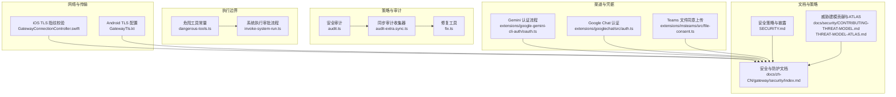
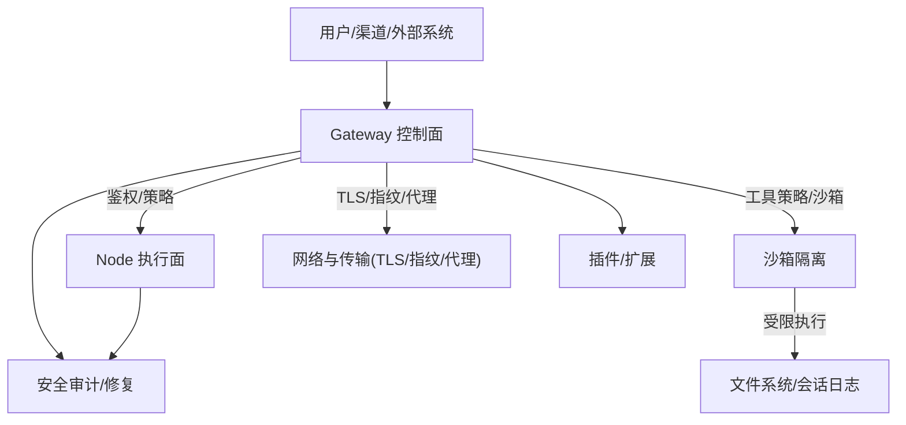
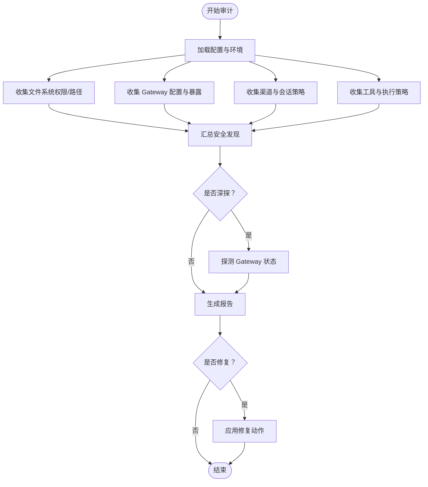
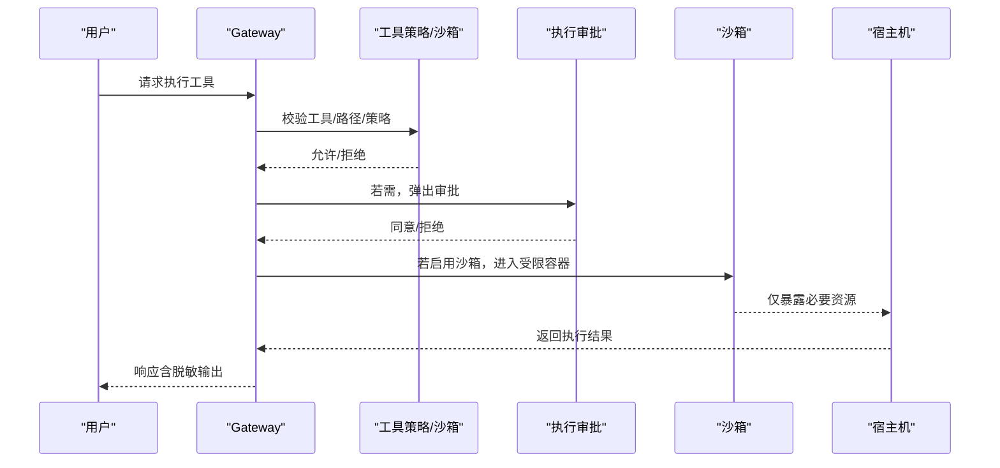
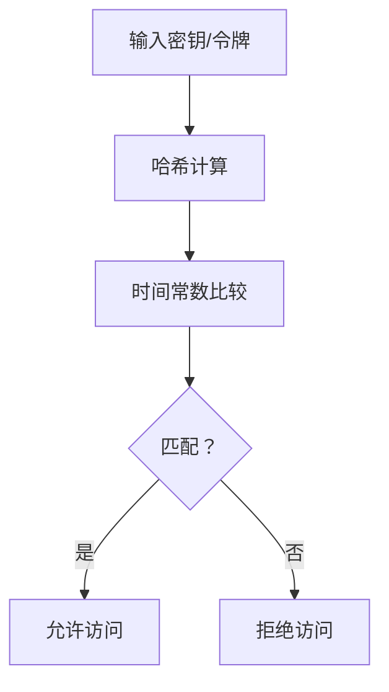
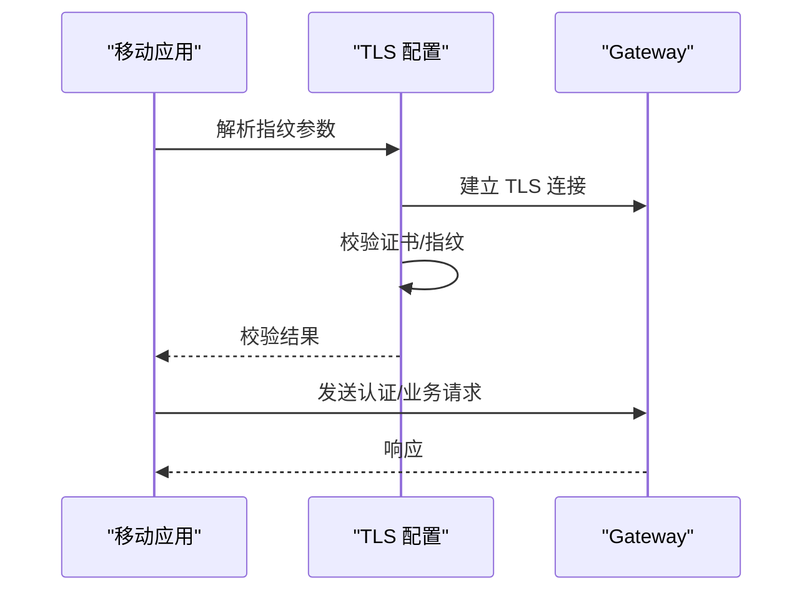
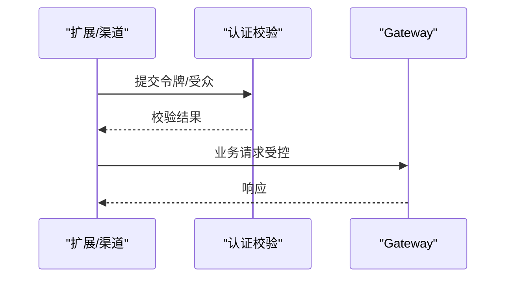
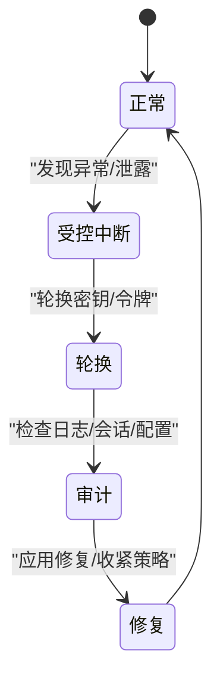
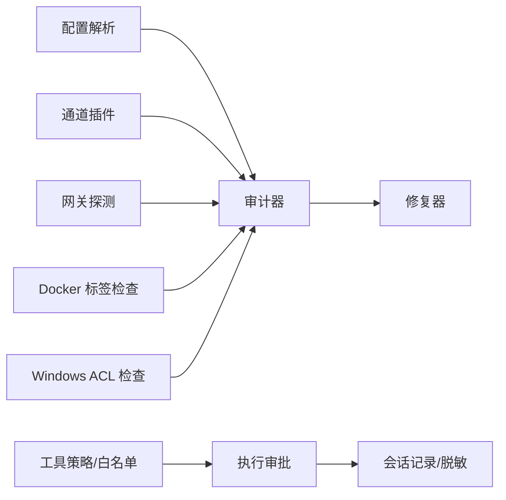

# 安全与防护

<cite>
**本文引用的文件**
- [SECURITY.md](file://SECURITY.md)
- [index.md](file://docs/zh-CN/gateway/security/index.md)
- [audit.ts](file://src/security/audit.ts)
- [audit-extra.sync.ts](file://src/security/audit-extra.sync.ts)
- [dangerous-tools.ts](file://src/security/dangerous-tools.ts)
- [fix.ts](file://src/security/fix.ts)
- [secret-equal.ts](file://src/security/secret-equal.ts)
- [safe-regex.ts](file://src/security/safe-regex.ts)
- [invoke-system-run.ts](file://src/node-host/invoke-system-run.ts)
- [oauth.ts](file://extensions/google-gemini-cli-auth/oauth.ts)
- [auth.ts](file://extensions/googlechat/src/auth.ts)
- [file-consent.ts](file://extensions/msteams/src/file-consent.ts)
- [GatewayConnectionController.swift](file://apps/ios/Sources/Gateway/GatewayConnectionController.swift)
- [GatewayTls.kt](file://apps/android/app/src/main/java/ai/openclaw/android/gateway/GatewayTls.kt)
- [CONTRIBUTING-THREAT-MODEL.md](file://docs/security/CONTRIBUTING-THREAT-MODEL.md)
- [THREAT-MODEL-ATLAS.md](file://docs/security/THREAT-MODEL-ATLAS.md)
</cite>

## 目录

1. [简介](#简介)
2. [项目结构](#项目结构)
3. [核心组件](#核心组件)
4. [架构总览](#架构总览)
5. [详细组件分析](#详细组件分析)
6. [依赖关系分析](#依赖关系分析)
7. [性能考量](#性能考量)
8. [故障排查指南](#故障排查指南)
9. [结论](#结论)
10. [附录](#附录)

## 简介

本文件面向 OpenClaw 的安全与防护能力，系统阐述多层次安全架构、访问控制机制与数据保护策略，覆盖沙箱安全模型、权限管理、加密存储、网络安全防护、威胁建模、安全审计、漏洞防护与应急响应、敏感信息处理与密钥管理、安全配置最佳实践、安全部署指南、风险评估与合规建议，以及用户隐私保护与安全更新机制。

## 项目结构

OpenClaw 的安全体系由“策略编排 + 审计与修复 + 执行边界 + 网络与传输安全 + 渠道与凭据安全 + 威胁建模与响应”构成，贯穿 CLI、Gateway、Node、浏览器与移动端应用。

图表来源

- [audit.ts](file://src/security/audit.ts#L1-L120)
- [audit-extra.sync.ts](file://src/security/audit-extra.sync.ts#L1-L120)
- [fix.ts](file://src/security/fix.ts#L1-L120)
- [dangerous-tools.ts](file://src/security/dangerous-tools.ts#L1-L40)
- [invoke-system-run.ts](file://src/node-host/invoke-system-run.ts#L396-L445)
- [GatewayConnectionController.swift](file://apps/ios/Sources/Gateway/GatewayConnectionController.swift#L495-L522)
- [GatewayTls.kt](file://apps/android/app/src/main/java/ai/openclaw/android/gateway/GatewayTls.kt#L35-L66)
- [oauth.ts](file://extensions/google-gemini-cli-auth/oauth.ts#L536-L602)
- [auth.ts](file://extensions/googlechat/src/auth.ts#L93-L137)
- [file-consent.ts](file://extensions/msteams/src/file-consent.ts#L107-L126)
- [SECURITY.md](file://SECURITY.md#L1-L120)
- [index.md](file://docs/zh-CN/gateway/security/index.md#L1-L120)

章节来源

- [index.md](file://docs/zh-CN/gateway/security/index.md#L1-L120)

## 核心组件

- 安全审计与修复
  - 审计器：集中收集配置、网络暴露、权限、插件、模型、浏览器控制、沙箱等安全问题，支持深探与修复建议。
  - 修复器：对常见问题进行原子化修复（权限收紧、策略收紧、日志脱敏）。
- 执行边界与工具策略
  - 危险工具清单与 ACP 策略，系统执行审批与白名单记录，沙箱隔离与工作区访问控制。
- 网络与传输安全
  - iOS/Android TLS 指纹固定与 TOFU 控制，反向代理与本地客户端判定，mDNS 信息泄露控制。
- 渠道与凭据安全
  - 多渠道认证与令牌校验，敏感上传路径校验与安全策略。
- 威胁建模与披露
  - MITRE ATLAS 威胁建模，漏洞披露流程与信任模型。

章节来源

- [audit.ts](file://src/security/audit.ts#L1-L120)
- [audit-extra.sync.ts](file://src/security/audit-extra.sync.ts#L1-L120)
- [fix.ts](file://src/security/fix.ts#L1-L120)
- [dangerous-tools.ts](file://src/security/dangerous-tools.ts#L1-L40)
- [invoke-system-run.ts](file://src/node-host/invoke-system-run.ts#L396-L445)
- [GatewayConnectionController.swift](file://apps/ios/Sources/Gateway/GatewayConnectionController.swift#L495-L522)
- [GatewayTls.kt](file://apps/android/app/src/main/java/ai/openclaw/android/gateway/GatewayTls.kt#L35-L66)
- [oauth.ts](file://extensions/google-gemini-cli-auth/oauth.ts#L536-L602)
- [auth.ts](file://extensions/googlechat/src/auth.ts#L93-L137)
- [file-consent.ts](file://extensions/msteams/src/file-consent.ts#L107-L126)
- [SECURITY.md](file://SECURITY.md#L1-L120)
- [index.md](file://docs/zh-CN/gateway/security/index.md#L1-L120)

## 架构总览

OpenClaw 的安全架构以“策略优先、边界可控、最小权限、纵深防御”为核心，围绕 Gateway 控制面与 Node 执行面，结合渠道与传输安全，形成闭环。

图表来源

- [audit.ts](file://src/security/audit.ts#L262-L551)
- [audit-extra.sync.ts](file://src/security/audit-extra.sync.ts#L477-L505)
- [index.md](file://docs/zh-CN/gateway/security/index.md#L128-L232)

## 详细组件分析

### 安全审计与修复

- 审计范围
  - 网络暴露与认证：bind、auth、trustedProxies、allowRealIpFallback、mDNS、Tailscale。
  - 渠道与会话：私信/群组策略、白名单、提及门控、会话隔离。
  - 工具与执行：工具策略、exec 主机、沙箱模式、提权工具、浏览器控制。
  - 文件系统与日志：状态/配置/凭证权限、日志脱敏、同步目录风险。
  - 插件与扩展：可信边界、白名单、安装路径与生命周期。
- 修复能力
  - 自动收紧 groupPolicy、redactSensitive、权限（目录/文件）。
  - 修复常见配置陷阱（如 Docker 配置与沙箱模式不一致）。

图表来源

- [audit.ts](file://src/security/audit.ts#L131-L260)
- [audit.ts](file://src/security/audit.ts#L262-L551)
- [audit-extra.sync.ts](file://src/security/audit-extra.sync.ts#L507-L552)
- [fix.ts](file://src/security/fix.ts#L387-L478)

章节来源

- [audit.ts](file://src/security/audit.ts#L1-L260)
- [audit-extra.sync.ts](file://src/security/audit-extra.sync.ts#L507-L552)
- [fix.ts](file://src/security/fix.ts#L387-L478)

### 沙箱安全模型与权限管理

- 模型与信任边界
  - 个人助理模型：单受信任操作者边界，会话标识为路由控制而非授权边界。
  - 多用户/多租户：不推荐共享同一 Gateway 实例；建议按用户/主机/OS 用户隔离。
- 沙箱隔离
  - Gateway 容器边界与工具沙箱（agents.defaults.sandbox）双轨互补。
  - 作用域隔离（agent/session/shared），工作区访问（none/ro/rw）。
  - 提权工具（tools.elevated）为逃逸舱口，需严格白名单与最小化启用。
- 权限与最小权限
  - 工具策略（allow/deny）、exec 审批、浏览器控制、节点执行均在白名单与沙箱内受控。

图表来源

- [index.md](file://docs/zh-CN/gateway/security/index.md#L551-L568)
- [index.md](file://docs/zh-CN/gateway/security/index.md#L585-L680)
- [dangerous-tools.ts](file://src/security/dangerous-tools.ts#L9-L20)
- [invoke-system-run.ts](file://src/node-host/invoke-system-run.ts#L396-L445)

章节来源

- [index.md](file://docs/zh-CN/gateway/security/index.md#L551-L568)
- [index.md](file://docs/zh-CN/gateway/security/index.md#L585-L680)
- [dangerous-tools.ts](file://src/security/dangerous-tools.ts#L1-L40)
- [invoke-system-run.ts](file://src/node-host/invoke-system-run.ts#L396-L445)

### 数据保护与敏感信息处理

- 日志与记录脱敏
  - logging.redactSensitive 默认开启，建议通过 redactPatterns 自定义敏感模式。
  - 会话记录（sessions/\*.jsonl）为敏感数据，需严格权限控制。
- 凭证与密钥
  - 优先使用环境变量存储密钥，避免明文写入配置。
  - detect-secrets 自动扫描，CI 基线维护。
- 时序安全比较
  - secret-equal 使用 timing-safe 比较，降低侧信道风险。

图表来源

- [secret-equal.ts](file://src/security/secret-equal.ts#L1-L13)
- [index.md](file://docs/zh-CN/gateway/security/index.md#L464-L479)

章节来源

- [index.md](file://docs/zh-CN/gateway/security/index.md#L464-L479)
- [secret-equal.ts](file://src/security/secret-equal.ts#L1-L13)

### 网络安全与传输安全

- TLS 与指纹固定
  - iOS：TLS 指纹探测与存储，支持 TOFU 与指纹固定。
  - Android：自定义 TrustManager 校验服务器证书指纹，支持 TOFU 存储。
- 反向代理与本地客户端判定
  - trustedProxies 正确配置可防止代理头伪造导致的本地客户端判定失效。
- mDNS 信息泄露
  - 推荐 minimal 模式，避免广播 cliPath/sshPort 等敏感信息。

图表来源

- [GatewayConnectionController.swift](file://apps/ios/Sources/Gateway/GatewayConnectionController.swift#L495-L522)
- [GatewayTls.kt](file://apps/android/app/src/main/java/ai/openclaw/android/gateway/GatewayTls.kt#L35-L66)
- [index.md](file://docs/zh-CN/gateway/security/index.md#L335-L380)

章节来源

- [GatewayConnectionController.swift](file://apps/ios/Sources/Gateway/GatewayConnectionController.swift#L495-L522)
- [GatewayTls.kt](file://apps/android/app/src/main/java/ai/openclaw/android/gateway/GatewayTls.kt#L35-L66)
- [index.md](file://docs/zh-CN/gateway/security/index.md#L335-L380)

### 渠道与凭据安全

- 多渠道认证与令牌校验
  - Google Chat：基于证书与受众类型校验 JWT。
  - Gemini：项目发现与 VPC-SC 风险识别。
  - Teams：文件同意上传路径校验与 PUT 请求。
- 最小暴露与最小权限
  - 仅在必要时启用浏览器控制与节点代理路由，避免公网暴露。

图表来源

- [auth.ts](file://extensions/googlechat/src/auth.ts#L93-L137)
- [oauth.ts](file://extensions/google-gemini-cli-auth/oauth.ts#L587-L631)
- [file-consent.ts](file://extensions/msteams/src/file-consent.ts#L107-L126)

章节来源

- [auth.ts](file://extensions/googlechat/src/auth.ts#L93-L137)
- [oauth.ts](file://extensions/google-gemini-cli-auth/oauth.ts#L587-L631)
- [file-consent.ts](file://extensions/msteams/src/file-consent.ts#L107-L126)

### 威胁建模与应急响应

- 威胁建模
  - 基于 MITRE ATLAS 的威胁分类与风险等级，持续贡献与完善。
- 应急响应
  - 遏制、轮换、审计、收集证据，配合安全审计与修复工具闭环处置。

图表来源

- [index.md](file://docs/zh-CN/gateway/security/index.md#L273-L289)
- [CONTRIBUTING-THREAT-MODEL.md](file://docs/security/CONTRIBUTING-THREAT-MODEL.md#L1-L91)
- [THREAT-MODEL-ATLAS.md](file://docs/security/THREAT-MODEL-ATLAS.md#L154-L167)

章节来源

- [index.md](file://docs/zh-CN/gateway/security/index.md#L273-L289)
- [CONTRIBUTING-THREAT-MODEL.md](file://docs/security/CONTRIBUTING-THREAT-MODEL.md#L1-L91)
- [THREAT-MODEL-ATLAS.md](file://docs/security/THREAT-MODEL-ATLAS.md#L154-L167)

## 依赖关系分析

- 审计器依赖配置解析、通道插件、网关探测、Docker 标签检查、Windows ACL 检查等。
- 修复器依赖配置 IO、权限变更、ACL 重置、包含文件扫描等。
- 执行审批链路依赖工具策略、白名单匹配、会话记录与屏幕录制检查。

图表来源

- [audit.ts](file://src/security/audit.ts#L1-L106)
- [fix.ts](file://src/security/fix.ts#L1-L41)
- [invoke-system-run.ts](file://src/node-host/invoke-system-run.ts#L396-L445)

章节来源

- [audit.ts](file://src/security/audit.ts#L1-L106)
- [fix.ts](file://src/security/fix.ts#L1-L41)
- [invoke-system-run.ts](file://src/node-host/invoke-system-run.ts#L396-L445)

## 性能考量

- 审计与修复
  - 文件系统权限检查与包含文件扫描为 I/O 密集；建议批量处理与缓存（如正则编译缓存）。
  - Windows ACL 重置与 chmod 为系统调用，注意并发与错误处理。
- 执行审批
  - 白名单匹配与会话记录为高频路径，建议预编译安全正则与去重记录。
- 网络与传输
  - TLS 指纹探测与证书校验为 CPU 密集；建议异步与超时控制。

[本节为通用指导，无需列出具体文件来源]

## 故障排查指南

- 常见问题定位
  - 网络暴露：bind/auth/trustedProxies/mDNS 配置不当导致的远程可达与本地判定失效。
  - 权限问题：状态/配置/凭证权限过大，导致信息泄露或被篡改。
  - 沙箱配置漂移：Docker 设置与沙箱模式不一致，导致策略未生效。
  - 提权工具滥用：allowFrom 宽松或未限制，导致宿主机执行。
- 处理步骤
  - 运行安全审计与深探，确认问题范围。
  - 使用修复工具一键收紧权限与策略。
  - 审核日志与会话记录，定位异常调用。
  - 轮换密钥与令牌，撤销可疑配对与节点。

章节来源

- [audit.ts](file://src/security/audit.ts#L262-L551)
- [audit-extra.sync.ts](file://src/security/audit-extra.sync.ts#L721-L769)
- [fix.ts](file://src/security/fix.ts#L387-L478)
- [index.md](file://docs/zh-CN/gateway/security/index.md#L273-L289)

## 结论

OpenClaw 的安全体系以“策略优先、边界可控、最小权限、纵深防御”为核心，通过安全审计与修复、沙箱隔离、执行审批、网络与传输安全、渠道与凭据安全、威胁建模与应急响应，形成闭环。建议在生产环境中默认启用沙箱、收紧网络暴露、最小化工具与提权、严格权限与日志脱敏，并定期运行安全审计与修复。

[本节为总结性内容，无需列出具体文件来源]

## 附录

### 安全部署指南

- 默认绑定与认证
  - 优先 loopback 绑定，配置强令牌或密码；避免在 0.0.0.0 暴露。
- 网络与代理
  - 正确配置 trustedProxies，避免 X-Real-IP 漏洞；mDNS 使用 minimal 模式。
- 沙箱与工具
  - 启用 agents.defaults.sandbox，合理设置 scope 与 workspaceAccess；严格工具白名单。
- 凭证与日志
  - 使用环境变量存储密钥；收紧状态/配置/凭证权限；开启日志脱敏。

章节来源

- [index.md](file://docs/zh-CN/gateway/security/index.md#L317-L380)
- [index.md](file://docs/zh-CN/gateway/security/index.md#L447-L479)

### 风险评估方法

- 威胁识别：基于 MITRE ATLAS 分类，结合渠道与执行面风险。
- 影响评估：结合模型层级、工具范围、网络暴露与数据敏感度。
- 控制有效性：审计工具策略、沙箱隔离、审批与日志脱敏。

章节来源

- [CONTRIBUTING-THREAT-MODEL.md](file://docs/security/CONTRIBUTING-THREAT-MODEL.md#L34-L91)
- [THREAT-MODEL-ATLAS.md](file://docs/security/THREAT-MODEL-ATLAS.md#L154-L167)

### 合规与披露

- 漏洞披露：遵循安全策略与披露流程，邮件至 security@openclaw.ai。
- 信任模型：明确受信任边界与多用户隔离建议。

章节来源

- [SECURITY.md](file://SECURITY.md#L1-L120)
- [index.md](file://docs/zh-CN/gateway/security/index.md#L84-L98)

### 安全更新机制

- 正则安全：内置安全正则编译与缓存，避免 ReDoS。
- 时序安全：secret-equal 使用 timing-safe 比较。
- CI 扫描：detect-secrets 基线维护与审计。

章节来源

- [safe-regex.ts](file://src/security/safe-regex.ts#L1-L152)
- [secret-equal.ts](file://src/security/secret-equal.ts#L1-L13)
- [SECURITY.md](file://SECURITY.md#L257-L268)
