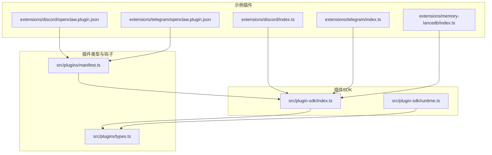
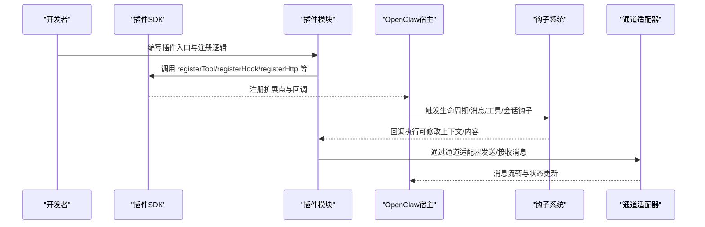
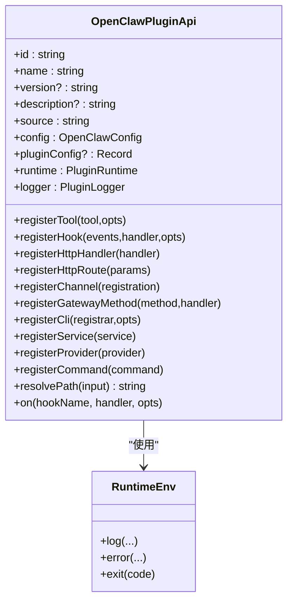
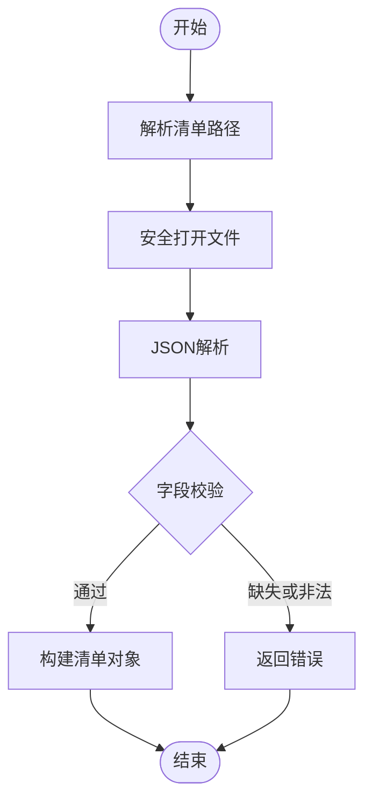
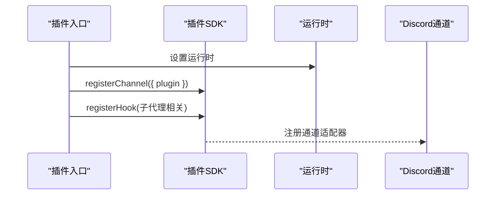
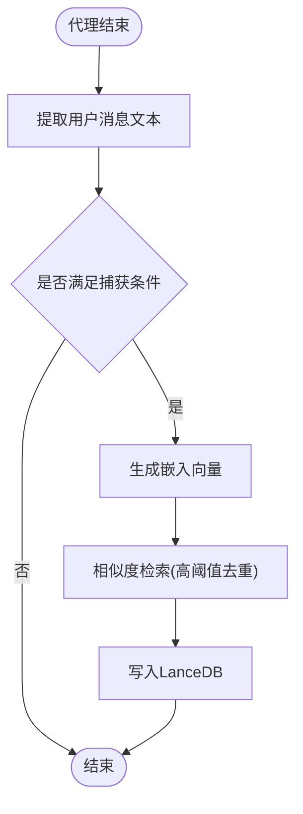
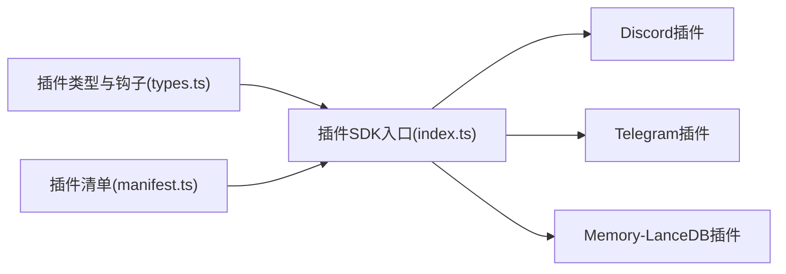

# 插件开发指南

<cite>
**本文引用的文件**
- [src/plugin-sdk/index.ts](file://src/plugin-sdk/index.ts)
- [src/plugin-sdk/runtime.ts](file://src/plugin-sdk/runtime.ts)
- [src/plugins/manifest.ts](file://src/plugins/manifest.ts)
- [src/plugins/types.ts](file://src/plugins/types.ts)
- [extensions/discord/index.ts](file://extensions/discord/index.ts)
- [extensions/discord/openclaw.plugin.json](file://extensions/discord/openclaw.plugin.json)
- [extensions/telegram/index.ts](file://extensions/telegram/index.ts)
- [extensions/telegram/openclaw.plugin.json](file://extensions/telegram/openclaw.plugin.json)
- [extensions/memory-lancedb/index.ts](file://extensions/memory-lancedb/index.ts)
</cite>

## 目录

1. [引言](#引言)
2. [项目结构](#项目结构)
3. [核心组件](#核心组件)
4. [架构总览](#架构总览)
5. [详细组件分析](#详细组件分析)
6. [依赖分析](#依赖分析)
7. [性能考虑](#性能考虑)
8. [故障排查指南](#故障排查指南)
9. [结论](#结论)
10. [附录](#附录)

## 引言

本指南面向希望在 OpenClaw 平台上开发插件的开发者，覆盖从环境准备、项目结构、SDK 使用、API 接口、配置与清单、调试测试到性能优化与最佳实践的完整流程。文档以仓库中的插件 SDK、插件类型定义、实际插件示例（Discord、Telegram、Memory-LanceDB）为依据，帮助你快速上手并构建高质量的插件。

## 项目结构

OpenClaw 的插件体系由“插件 SDK”“插件类型与钩子系统”“插件清单与元数据”“具体插件实现”四部分组成。下图展示了与插件开发直接相关的模块关系：



图表来源

- [src/plugin-sdk/index.ts](file://src/plugin-sdk/index.ts#L1-L597)
- [src/plugin-sdk/runtime.ts](file://src/plugin-sdk/runtime.ts#L1-L25)
- [src/plugins/types.ts](file://src/plugins/types.ts#L1-L764)
- [src/plugins/manifest.ts](file://src/plugins/manifest.ts#L1-L167)
- [extensions/discord/index.ts](file://extensions/discord/index.ts#L1-L20)
- [extensions/discord/openclaw.plugin.json](file://extensions/discord/openclaw.plugin.json#L1-L10)
- [extensions/telegram/index.ts](file://extensions/telegram/index.ts#L1-L18)
- [extensions/telegram/openclaw.plugin.json](file://extensions/telegram/openclaw.plugin.json#L1-L10)
- [extensions/memory-lancedb/index.ts](file://extensions/memory-lancedb/index.ts#L1-L671)

章节来源

- [src/plugin-sdk/index.ts](file://src/plugin-sdk/index.ts#L1-L597)
- [src/plugin-sdk/runtime.ts](file://src/plugin-sdk/runtime.ts#L1-L25)
- [src/plugins/types.ts](file://src/plugins/types.ts#L1-L764)
- [src/plugins/manifest.ts](file://src/plugins/manifest.ts#L1-L167)
- [extensions/discord/index.ts](file://extensions/discord/index.ts#L1-L20)
- [extensions/telegram/index.ts](file://extensions/telegram/index.ts#L1-L18)
- [extensions/memory-lancedb/index.ts](file://extensions/memory-lancedb/index.ts#L1-L671)

## 核心组件

- 插件 SDK 入口导出：统一暴露插件开发所需的类型、适配器、工具函数、HTTP/Webhook 注册、状态辅助、SSRF/鉴权等能力。
- 插件运行时封装：将外部日志器桥接到 SDK 的运行时环境，便于在不同宿主中复用。
- 插件清单与元数据：定义插件清单文件名、字段、加载与校验逻辑；同时支持 package.json 中的扩展元数据。
- 插件类型与钩子：定义插件生命周期钩子、消息/工具/会话/子代理/网关等事件钩子，以及命令、HTTP 路由、CLI、服务、通道注册等扩展点。

章节来源

- [src/plugin-sdk/index.ts](file://src/plugin-sdk/index.ts#L1-L597)
- [src/plugin-sdk/runtime.ts](file://src/plugin-sdk/runtime.ts#L1-L25)
- [src/plugins/manifest.ts](file://src/plugins/manifest.ts#L1-L167)
- [src/plugins/types.ts](file://src/plugins/types.ts#L230-L284)

## 架构总览

下图展示插件在 OpenClaw 中的典型工作流：插件通过 SDK 定义自身能力，注册工具、钩子、HTTP 路由、CLI 命令、服务与通道；运行时根据配置与钩子事件对消息、工具调用、会话状态进行拦截与增强，并通过通道适配器与外部平台交互。



图表来源

- [src/plugins/types.ts](file://src/plugins/types.ts#L245-L284)
- [src/plugin-sdk/index.ts](file://src/plugin-sdk/index.ts#L112-L130)

章节来源

- [src/plugins/types.ts](file://src/plugins/types.ts#L299-L323)
- [src/plugin-sdk/index.ts](file://src/plugin-sdk/index.ts#L112-L130)

## 详细组件分析

### 组件A：插件SDK入口与运行时

- SDK 入口导出大量类型与工具，包括通道适配器类型、钩子事件类型、HTTP/Webhook 工具、SSRF/鉴权工具、媒体与文本处理工具、会话与允许列表解析工具等。
- 运行时封装：将外部日志器桥接为 SDK 的运行时环境，提供日志、错误与退出行为的统一抽象。



图表来源

- [src/plugins/types.ts](file://src/plugins/types.ts#L245-L284)
- [src/plugin-sdk/runtime.ts](file://src/plugin-sdk/runtime.ts#L9-L24)

章节来源

- [src/plugin-sdk/index.ts](file://src/plugin-sdk/index.ts#L1-L597)
- [src/plugin-sdk/runtime.ts](file://src/plugin-sdk/runtime.ts#L1-L25)
- [src/plugins/types.ts](file://src/plugins/types.ts#L245-L284)

### 组件B：插件清单与元数据

- 清单文件名与候选集合固定，支持边界安全读取与 JSON 解析校验。
- 清单字段包括 id、configSchema、kind、channels/providers/skills、name/description/version、uiHints 等。
- 支持从 package.json 中读取扩展元数据（如安装方式、渠道信息），用于上架/引导/安装流程。



图表来源

- [src/plugins/manifest.ts](file://src/plugins/manifest.ts#L35-L115)

章节来源

- [src/plugins/manifest.ts](file://src/plugins/manifest.ts#L1-L167)

### 组件C：插件类型与钩子系统

- 钩子覆盖模型解析、提示构建、代理运行、消息收发、工具调用、会话生命周期、子代理派生与交付、网关启停等阶段。
- 提供事件参数与结果类型，允许插件在钩子中修改上下文、阻断或修改消息、注入/过滤工具参数、持久化工具结果等。

```mermaid
classDiagram
class PluginHookName {
<<enumeration>>
"before_model_resolve"
"before_prompt_build"
"before_agent_start"
"llm_input"
"llm_output"
"agent_end"
"before_compaction"
"after_compaction"
"before_reset"
"message_received"
"message_sending"
"message_sent"
"before_tool_call"
"after_tool_call"
"tool_result_persist"
"before_message_write"
"session_start"
"session_end"
"subagent_spawning"
"subagent_delivery_target"
"subagent_spawned"
"subagent_ended"
"gateway_start"
"gateway_stop"
}
class PluginHookHandlerMap {
+before_model_resolve(event,ctx)
+before_prompt_build(event,ctx)
+before_agent_start(event,ctx)
+llm_input(event,ctx)
+llm_output(event,ctx)
+agent_end(event,ctx)
+before_compaction(event,ctx)
+after_compaction(event,ctx)
+before_reset(event,ctx)
+message_received(event,ctx)
+message_sending(event,ctx)
+message_sent(event,ctx)
+before_tool_call(event,ctx)
+after_tool_call(event,ctx)
+tool_result_persist(event,ctx)
+before_message_write(event,ctx)
+session_start(event,ctx)
+session_end(event,ctx)
+subagent_spawning(event,ctx)
+subagent_delivery_target(event,ctx)
+subagent_spawned(event,ctx)
+subagent_ended(event,ctx)
+gateway_start(event,ctx)
+gateway_stop(event,ctx)
}
```

图表来源

- [src/plugins/types.ts](file://src/plugins/types.ts#L299-L323)
- [src/plugins/types.ts](file://src/plugins/types.ts#L658-L755)

章节来源

- [src/plugins/types.ts](file://src/plugins/types.ts#L299-L323)
- [src/plugins/types.ts](file://src/plugins/types.ts#L334-L425)
- [src/plugins/types.ts](file://src/plugins/types.ts#L479-L498)
- [src/plugins/types.ts](file://src/plugins/types.ts#L536-L553)
- [src/plugins/types.ts](file://src/plugins/types.ts#L564-L640)
- [src/plugins/types.ts](file://src/plugins/types.ts#L642-L655)

### 组件D：实际插件开发案例

#### 案例1：Discord 插件

- 插件入口负责设置运行时、注册通道与子代理钩子。
- 清单声明该插件面向 Discord 渠道，配置模式为空配置。



图表来源

- [extensions/discord/index.ts](file://extensions/discord/index.ts#L7-L16)
- [extensions/discord/openclaw.plugin.json](file://extensions/discord/openclaw.plugin.json#L1-L9)

章节来源

- [extensions/discord/index.ts](file://extensions/discord/index.ts#L1-L20)
- [extensions/discord/openclaw.plugin.json](file://extensions/discord/openclaw.plugin.json#L1-L10)

#### 案例2：Telegram 插件

- 插件入口设置运行时并注册 Telegram 通道。
- 清单声明该插件面向 Telegram 渠道，配置模式为空配置。

章节来源

- [extensions/telegram/index.ts](file://extensions/telegram/index.ts#L1-L18)
- [extensions/telegram/openclaw.plugin.json](file://extensions/telegram/openclaw.plugin.json#L1-L10)

#### 案例3：Memory-LanceDB 插件

- 功能：基于 LanceDB 的长期记忆存储与向量检索，提供自动回忆与自动捕获能力。
- 能力：
  - 工具：记忆检索、记忆存储、记忆删除。
  - CLI：ltm 子命令，支持列出、搜索、统计。
  - 生命周期钩子：在代理开始前注入上下文，在代理结束后自动捕获用户输入。
  - 服务：启动/停止日志输出。
- 关键点：
  - 使用 OpenAI 生成嵌入向量，LanceDB 进行向量检索与相似度计算。
  - 对输入进行 Prompt 注入检测与转义，避免上下文污染。
  - 自动捕获限制每轮最多 3 条，去重阈值高以避免冗余。



图表来源

- [extensions/memory-lancedb/index.ts](file://extensions/memory-lancedb/index.ts#L567-L650)

章节来源

- [extensions/memory-lancedb/index.ts](file://extensions/memory-lancedb/index.ts#L1-L671)

## 依赖分析

- 插件 SDK 与类型系统耦合紧密，SDK 入口导出大量类型与工具，供插件注册与钩子处理使用。
- 实际插件通过 SDK 的注册接口与通道适配器对接外部平台，形成“插件—SDK—通道—平台”的依赖链。
- 清单与元数据为插件的发现、安装与上架提供基础支撑。



图表来源

- [src/plugins/types.ts](file://src/plugins/types.ts#L1-L764)
- [src/plugin-sdk/index.ts](file://src/plugin-sdk/index.ts#L1-L597)
- [src/plugins/manifest.ts](file://src/plugins/manifest.ts#L1-L167)
- [extensions/discord/index.ts](file://extensions/discord/index.ts#L1-L20)
- [extensions/telegram/index.ts](file://extensions/telegram/index.ts#L1-L18)
- [extensions/memory-lancedb/index.ts](file://extensions/memory-lancedb/index.ts#L1-L671)

章节来源

- [src/plugin-sdk/index.ts](file://src/plugin-sdk/index.ts#L1-L597)
- [src/plugins/types.ts](file://src/plugins/types.ts#L1-L764)
- [src/plugins/manifest.ts](file://src/plugins/manifest.ts#L1-L167)
- [extensions/discord/index.ts](file://extensions/discord/index.ts#L1-L20)
- [extensions/telegram/index.ts](file://extensions/telegram/index.ts#L1-L18)
- [extensions/memory-lancedb/index.ts](file://extensions/memory-lancedb/index.ts#L1-L671)

## 性能考虑

- 向量检索与嵌入生成成本较高，建议：
  - 控制检索窗口与结果数量，合理设置相似度阈值。
  - 在代理开始前进行检索，避免在工具调用阶段重复计算。
  - 对大文本分块处理，减少单次嵌入长度。
- 钩子处理应尽量异步化，避免阻塞消息管线。
- 使用持久化缓存与去重策略，降低重复写入与查询开销。

## 故障排查指南

- 清单加载失败：检查清单文件是否存在、路径是否越界、JSON 是否合法、必需字段是否齐全。
- 配置校验失败：确保 configSchema 与实际配置一致，必要时使用 SDK 提供的校验工具。
- 钩子未触发：确认钩子名称正确、优先级设置合理、事件上下文参数完整。
- 通道适配器异常：核对通道 ID、账户绑定、目标规范化与权限列表匹配。
- SSRF/鉴权问题：使用 SDK 提供的 SSRF 策略与鉴权工具，确保仅访问白名单域名或受控范围。

章节来源

- [src/plugins/manifest.ts](file://src/plugins/manifest.ts#L45-L115)
- [src/plugins/types.ts](file://src/plugins/types.ts#L299-L323)
- [src/plugin-sdk/index.ts](file://src/plugin-sdk/index.ts#L279-L301)
- [src/plugin-sdk/index.ts](file://src/plugin-sdk/index.ts#L290-L301)

## 结论

通过插件 SDK 与类型系统，OpenClaw 为插件提供了统一的扩展点与强大的钩子机制。结合清单与元数据，插件可以被安全地发现、安装与管理。实际插件（如 Discord、Telegram、Memory-LanceDB）展示了如何利用 SDK 注册通道、工具、钩子、HTTP 路由、CLI 与服务，并在生命周期中实现业务逻辑。遵循本文的开发流程、最佳实践与故障排查建议，你可以高效构建高质量的 OpenClaw 插件。

## 附录

### A. 插件开发步骤速查

- 准备环境：Node.js、包管理器、编辑器。
- 创建目录与清单：在插件根目录放置清单文件，定义 id、channels、configSchema 等。
- 编写入口：实现插件定义对象，注册运行时、通道、工具、钩子、HTTP 路由、CLI、服务、提供商等。
- 开发与测试：使用钩子验证逻辑，结合日志与错误处理定位问题。
- 打包与发布：遵循清单与元数据规范，准备安装与上架所需信息。

章节来源

- [extensions/discord/openclaw.plugin.json](file://extensions/discord/openclaw.plugin.json#L1-L9)
- [extensions/telegram/openclaw.plugin.json](file://extensions/telegram/openclaw.plugin.json#L1-L9)
- [extensions/discord/index.ts](file://extensions/discord/index.ts#L7-L16)
- [extensions/telegram/index.ts](file://extensions/telegram/index.ts#L6-L14)
- [extensions/memory-lancedb/index.ts](file://extensions/memory-lancedb/index.ts#L286-L301)

### B. 常用API与工具清单

- 清单与元数据：清单加载、字段校验、包元数据读取。
- 钩子系统：生命周期、消息、工具、会话、子代理、网关钩子。
- 通道适配：通道 ID、账户解析、目标规范化、状态问题收集。
- HTTP/Webhook：路由注册、请求体限制、目标解析与校验。
- 安全与鉴权：SSRF 策略、鉴权结果构建、Bearer 认证回退。
- 工具与媒体：回复负载构建、文本分块、临时路径、媒体载荷。

章节来源

- [src/plugin-sdk/index.ts](file://src/plugin-sdk/index.ts#L112-L130)
- [src/plugin-sdk/index.ts](file://src/plugin-sdk/index.ts#L279-L301)
- [src/plugin-sdk/index.ts](file://src/plugin-sdk/index.ts#L290-L301)
- [src/plugin-sdk/index.ts](file://src/plugin-sdk/index.ts#L223-L229)
- [src/plugin-sdk/index.ts](file://src/plugin-sdk/index.ts#L234-L238)
