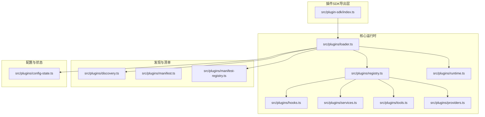
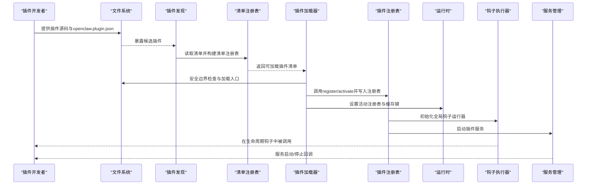
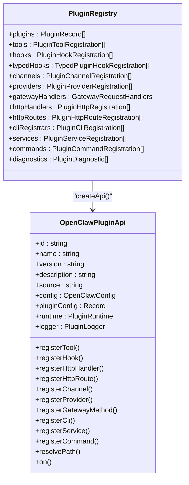
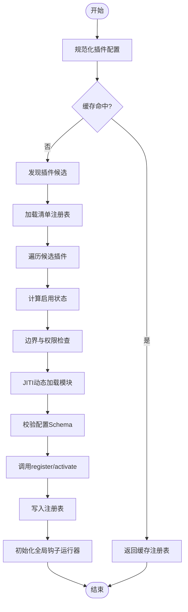
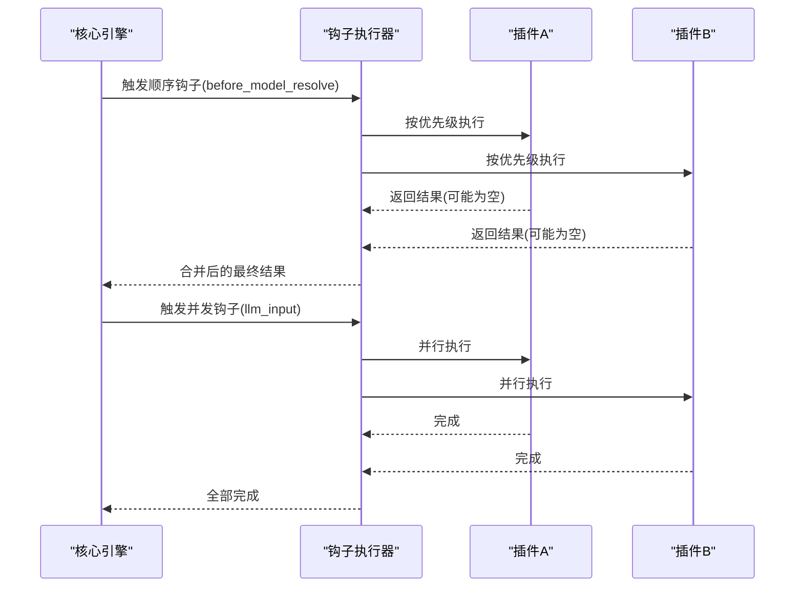
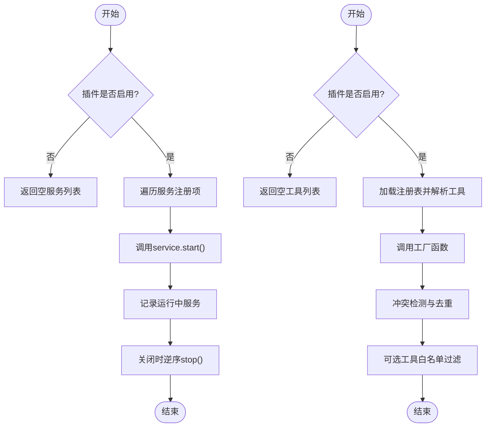
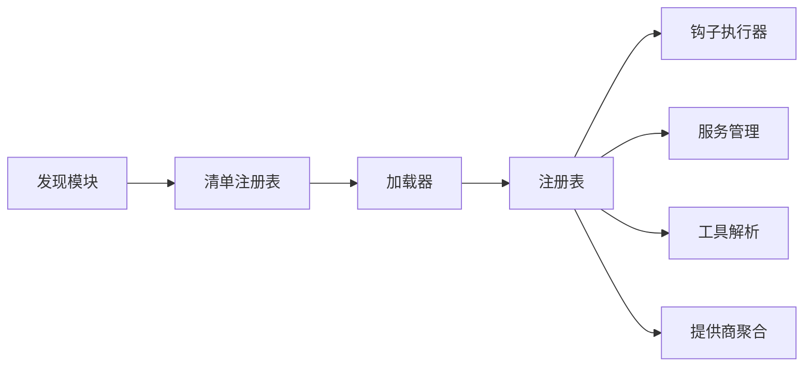

# 插件架构设计

<cite>
**本文档引用的文件**
- [src/plugin-sdk/index.ts](file://src/plugin-sdk/index.ts)
- [src/plugins/registry.ts](file://src/plugins/registry.ts)
- [src/plugins/types.ts](file://src/plugins/types.ts)
- [src/plugins/loader.ts](file://src/plugins/loader.ts)
- [src/plugins/discovery.ts](file://src/plugins/discovery.ts)
- [src/plugins/manifest.ts](file://src/plugins/manifest.ts)
- [src/plugins/manifest-registry.ts](file://src/plugins/manifest-registry.ts)
- [src/plugins/runtime.ts](file://src/plugins/runtime.ts)
- [src/plugins/hooks.ts](file://src/plugins/hooks.ts)
- [src/plugins/config-state.ts](file://src/plugins/config-state.ts)
- [src/plugins/services.ts](file://src/plugins/services.ts)
- [src/plugins/tools.ts](file://src/plugins/tools.ts)
- [src/plugins/providers.ts](file://src/plugins/providers.ts)
</cite>

## 目录

1. [简介](#简介)
2. [项目结构](#项目结构)
3. [核心组件](#核心组件)
4. [架构总览](#架构总览)
5. [详细组件分析](#详细组件分析)
6. [依赖关系分析](#依赖关系分析)
7. [性能考量](#性能考量)
8. [故障排查指南](#故障排查指南)
9. [结论](#结论)

## 简介

本文件系统化阐述 OpenClaw 插件架构的设计与实现，覆盖插件发现、注册、动态加载、生命周期与状态管理、接口定义、依赖注入、事件系统与通信协议、沙箱隔离与权限控制、资源管理等主题。文档以代码为依据，通过架构图与流程图帮助读者理解从“插件源码”到“运行时集成”的完整路径。

## 项目结构

OpenClaw 的插件系统由“SDK 导出层 + 核心运行时 + 发现与清单 + 注册表 + 钩子执行器 + 服务与工具解析 + 提供商聚合”构成，形成清晰的分层与职责边界：

**图表来源**

- [src/plugin-sdk/index.ts](file://src/plugin-sdk/index.ts#L1-L597)
- [src/plugins/loader.ts](file://src/plugins/loader.ts#L368-L717)
- [src/plugins/registry.ts](file://src/plugins/registry.ts#L164-L520)
- [src/plugins/runtime.ts](file://src/plugins/runtime.ts#L23-L42)
- [src/plugins/hooks.ts](file://src/plugins/hooks.ts#L125-L751)
- [src/plugins/services.ts](file://src/plugins/services.ts#L34-L76)
- [src/plugins/tools.ts](file://src/plugins/tools.ts#L45-L140)
- [src/plugins/providers.ts](file://src/plugins/providers.ts#L8-L20)
- [src/plugins/discovery.ts](file://src/plugins/discovery.ts#L567-L636)
- [src/plugins/manifest.ts](file://src/plugins/manifest.ts#L45-L115)
- [src/plugins/manifest-registry.ts](file://src/plugins/manifest-registry.ts#L134-L249)
- [src/plugins/config-state.ts](file://src/plugins/config-state.ts#L66-L263)

**章节来源**

- [src/plugin-sdk/index.ts](file://src/plugin-sdk/index.ts#L1-L597)
- [src/plugins/loader.ts](file://src/plugins/loader.ts#L368-L717)
- [src/plugins/registry.ts](file://src/plugins/registry.ts#L164-L520)
- [src/plugins/runtime.ts](file://src/plugins/runtime.ts#L23-L42)
- [src/plugins/hooks.ts](file://src/plugins/hooks.ts#L125-L751)
- [src/plugins/services.ts](file://src/plugins/services.ts#L34-L76)
- [src/plugins/tools.ts](file://src/plugins/tools.ts#L45-L140)
- [src/plugins/providers.ts](file://src/plugins/providers.ts#L8-L20)
- [src/plugins/discovery.ts](file://src/plugins/discovery.ts#L567-L636)
- [src/plugins/manifest.ts](file://src/plugins/manifest.ts#L45-L115)
- [src/plugins/manifest-registry.ts](file://src/plugins/manifest-registry.ts#L134-L249)
- [src/plugins/config-state.ts](file://src/plugins/config-state.ts#L66-L263)

## 核心组件

- 插件SDK导出层：统一暴露插件开发所需的类型、适配器、工具与常量，便于第三方开发者按约定实现插件。
- 插件注册表：集中记录已加载插件及其注册项（工具、钩子、通道、提供商、HTTP路由、CLI命令、服务等），并提供诊断信息。
- 插件加载器：负责发现候选插件、校验清单、解析配置、安全边界检查、动态加载模块、调用注册函数、建立运行时上下文。
- 发现与清单：扫描插件目录与包元数据，读取 openclaw.plugin.json 清单，构建清单注册表，并处理重复与优先级冲突。
- 生命周期钩子：提供强类型的生命周期钩子集合与执行器，支持顺序合并与并发执行，保证在关键阶段可被插件拦截或增强。
- 服务与工具：对插件服务进行启动/停止管理；对插件工具进行工厂解析与去重、冲突检测与可选工具过滤。
- 提供商聚合：收集所有插件声明的提供商能力，用于认证与模型选择。

**章节来源**

- [src/plugin-sdk/index.ts](file://src/plugin-sdk/index.ts#L1-L597)
- [src/plugins/registry.ts](file://src/plugins/registry.ts#L124-L520)
- [src/plugins/loader.ts](file://src/plugins/loader.ts#L368-L717)
- [src/plugins/discovery.ts](file://src/plugins/discovery.ts#L567-L636)
- [src/plugins/manifest.ts](file://src/plugins/manifest.ts#L45-L115)
- [src/plugins/manifest-registry.ts](file://src/plugins/manifest-registry.ts#L134-L249)
- [src/plugins/hooks.ts](file://src/plugins/hooks.ts#L125-L751)
- [src/plugins/services.ts](file://src/plugins/services.ts#L34-L76)
- [src/plugins/tools.ts](file://src/plugins/tools.ts#L45-L140)
- [src/plugins/providers.ts](file://src/plugins/providers.ts#L8-L20)

## 架构总览

下图展示从“插件源码”到“运行时可用”的端到端流程，包括发现、清单、加载、注册、钩子与服务的协同。

**图表来源**

- [src/plugins/discovery.ts](file://src/plugins/discovery.ts#L567-L636)
- [src/plugins/manifest-registry.ts](file://src/plugins/manifest-registry.ts#L134-L249)
- [src/plugins/loader.ts](file://src/plugins/loader.ts#L368-L717)
- [src/plugins/registry.ts](file://src/plugins/registry.ts#L164-L520)
- [src/plugins/runtime.ts](file://src/plugins/runtime.ts#L23-L42)
- [src/plugins/hooks.ts](file://src/plugins/hooks.ts#L125-L751)
- [src/plugins/services.ts](file://src/plugins/services.ts#L34-L76)

## 详细组件分析

### 组件A：插件注册表与API（PluginRegistry & OpenClawPluginApi）

- 职责：集中存储插件元数据与注册项，提供标准化的注册API给插件调用，包括工具、钩子、HTTP处理器/路由、通道、提供商、网关方法、CLI注册器、服务、命令等。
- 关键点：
  - 注册项类型丰富且解耦：工具、钩子、HTTP、通道、提供商、网关、CLI、服务、命令。
  - API规范化：统一日志、路径解析、运行时访问、配置读取。
  - 诊断收集：对重复、冲突、非法注册进行告警/错误记录。
- 复杂度与性能：注册表为内存结构，查询与排序基于名称/优先级，注册阶段为O(n)遍历。

**图表来源**

- [src/plugins/registry.ts](file://src/plugins/registry.ts#L124-L520)
- [src/plugins/types.ts](file://src/plugins/types.ts#L245-L284)

**章节来源**

- [src/plugins/registry.ts](file://src/plugins/registry.ts#L124-L520)
- [src/plugins/types.ts](file://src/plugins/types.ts#L245-L284)

### 组件B：插件加载器（loadOpenClawPlugins）

- 职责：主控流程，串联发现、清单、配置验证、边界检查、JITI 动态加载、注册调用、缓存与全局状态设置。
- 关键流程：
  - 测试环境默认禁用插件，避免测试耗时与副作用。
  - 构建缓存键，命中则直接返回注册表。
  - 发现候选 → 加载清单 → 权限与边界检查 → 解析配置Schema → 动态加载模块 → 调用 register/activate → 写入注册表 → 初始化钩子运行器。
- 安全与合规：
  - 使用边界文件读取与真实路径解析，防止越界与符号链接逃逸。
  - 对世界可写目录与可疑属主进行阻断。
  - 允许列表/拒绝列表与槽位策略控制启用状态。
- 性能优化：
  - 清单注册表与插件注册表均支持缓存，减少重复扫描与解析。
  - Jiti 延迟初始化，仅在启用状态下创建。

**图表来源**

- [src/plugins/loader.ts](file://src/plugins/loader.ts#L368-L717)
- [src/plugins/discovery.ts](file://src/plugins/discovery.ts#L567-L636)
- [src/plugins/manifest-registry.ts](file://src/plugins/manifest-registry.ts#L134-L249)
- [src/plugins/config-state.ts](file://src/plugins/config-state.ts#L165-L232)

**章节来源**

- [src/plugins/loader.ts](file://src/plugins/loader.ts#L368-L717)
- [src/plugins/discovery.ts](file://src/plugins/discovery.ts#L567-L636)
- [src/plugins/manifest-registry.ts](file://src/plugins/manifest-registry.ts#L134-L249)
- [src/plugins/config-state.ts](file://src/plugins/config-state.ts#L165-L232)

### 组件C：生命周期钩子系统（Hook Runner）

- 职责：提供强类型钩子集合与执行器，支持顺序合并与并发执行，确保在关键阶段（如消息发送、工具调用、会话开始/结束）可被插件拦截或增强。
- 执行策略：
  - 并发型钩子：并行触发，适合观测类事件（如 llm_input/llm_output）。
  - 顺序型钩子：按优先级顺序执行，结果可合并（如 before_model_resolve、before_prompt_build）。
  - 同步钩子：在热路径上同步执行，严格禁止异步返回（如 tool_result_persist、before_message_write）。
- 错误处理：可捕获错误并记录，或抛出异常中断流程，取决于配置。

**图表来源**

- [src/plugins/hooks.ts](file://src/plugins/hooks.ts#L125-L751)
- [src/plugins/types.ts](file://src/plugins/types.ts#L299-L764)

**章节来源**

- [src/plugins/hooks.ts](file://src/plugins/hooks.ts#L125-L751)
- [src/plugins/types.ts](file://src/plugins/types.ts#L299-L764)

### 组件D：插件服务与工具解析

- 插件服务：遍历注册表中的服务条目，按上下文启动服务；在关闭时逆序停止并吞掉异常，保证系统稳定退出。
- 工具解析：在测试或禁用场景下快速短路；否则加载注册表后，按工厂函数解析工具，去重与冲突检测，支持可选工具白名单过滤。

**图表来源**

- [src/plugins/services.ts](file://src/plugins/services.ts#L34-L76)
- [src/plugins/tools.ts](file://src/plugins/tools.ts#L45-L140)

**章节来源**

- [src/plugins/services.ts](file://src/plugins/services.ts#L34-L76)
- [src/plugins/tools.ts](file://src/plugins/tools.ts#L45-L140)

### 组件E：提供商聚合与通道/技能映射

- 提供商聚合：从注册表中提取所有 ProviderPlugin，统一对外暴露认证方式、模型能力与格式化密钥等。
- 通道/技能映射：清单中可声明 channels/providers/skills，配合通道插件与提供商插件实现能力绑定。

**章节来源**

- [src/plugins/providers.ts](file://src/plugins/providers.ts#L8-L20)
- [src/plugins/manifest.ts](file://src/plugins/manifest.ts#L11-L22)

## 依赖关系分析

- 模块内聚与耦合：
  - 发现与清单：低耦合，仅依赖清单文件与包元数据，输出候选与清单记录。
  - 加载器：高内聚，串联发现、清单、配置、边界检查、JITI、注册表写入。
  - 注册表：作为数据中枢，被钩子、服务、工具、提供商模块读取。
  - 钩子执行器：依赖注册表的 typedHooks 列表，按名称与优先级执行。
  - 服务/工具/提供商：均为只读消费注册表，不反向写回。
- 外部依赖：
  - JITI：动态加载插件模块，支持多扩展名与别名映射。
  - 边界文件读取：限制插件根目录与入口文件的安全范围。
  - 缓存：注册表与清单注册表均支持 TTL 缓存，提升性能。

**图表来源**

- [src/plugins/discovery.ts](file://src/plugins/discovery.ts#L567-L636)
- [src/plugins/manifest-registry.ts](file://src/plugins/manifest-registry.ts#L134-L249)
- [src/plugins/loader.ts](file://src/plugins/loader.ts#L368-L717)
- [src/plugins/registry.ts](file://src/plugins/registry.ts#L124-L520)
- [src/plugins/hooks.ts](file://src/plugins/hooks.ts#L125-L751)
- [src/plugins/services.ts](file://src/plugins/services.ts#L34-L76)
- [src/plugins/tools.ts](file://src/plugins/tools.ts#L45-L140)
- [src/plugins/providers.ts](file://src/plugins/providers.ts#L8-L20)

**章节来源**

- [src/plugins/discovery.ts](file://src/plugins/discovery.ts#L567-L636)
- [src/plugins/manifest-registry.ts](file://src/plugins/manifest-registry.ts#L134-L249)
- [src/plugins/loader.ts](file://src/plugins/loader.ts#L368-L717)
- [src/plugins/registry.ts](file://src/plugins/registry.ts#L124-L520)
- [src/plugins/hooks.ts](file://src/plugins/hooks.ts#L125-L751)
- [src/plugins/services.ts](file://src/plugins/services.ts#L34-L76)
- [src/plugins/tools.ts](file://src/plugins/tools.ts#L45-L140)
- [src/plugins/providers.ts](file://src/plugins/providers.ts#L8-L20)

## 性能考量

- 缓存策略：
  - 插件注册表：按工作区与配置键缓存，避免重复扫描与加载。
  - 清单注册表：按加载路径与时间戳缓存，降低频繁读取开销。
- 并发与顺序：
  - 钩子执行器对并发型事件采用并行执行，顺序型事件采用优先级合并，兼顾吞吐与一致性。
  - 工具解析与服务启动采用串行/并行结合，保证稳定性与效率。
- 动态加载：
  - JITI 延迟初始化，仅在启用状态下创建，减少冷启动成本。
- I/O 与边界：
  - 使用边界文件读取与真实路径解析，避免多次 stat 与符号链接绕过带来的性能损耗。

[本节为通用指导，无需特定文件引用]

## 故障排查指南

- 常见问题与定位：
  - 插件未加载：检查插件清单是否存在、id 是否匹配、是否被允许/拒绝、是否在内存槽位中。
  - 路径越界/权限问题：查看发现阶段的阻断原因（路径越界、世界可写、可疑属主）。
  - 配置校验失败：查看配置Schema校验错误列表，修正字段类型与必填项。
  - 注册阶段异常：查看注册表诊断信息，定位具体插件与源文件。
- 日志与诊断：
  - 插件加载器与钩子执行器均提供详细日志与诊断记录，建议开启调试级别以获取更细粒度信息。
  - 服务启动失败会记录错误并继续后续服务，停止阶段也会记录警告，便于排障。

**章节来源**

- [src/plugins/loader.ts](file://src/plugins/loader.ts#L187-L214)
- [src/plugins/discovery.ts](file://src/plugins/discovery.ts#L143-L199)
- [src/plugins/manifest-registry.ts](file://src/plugins/manifest-registry.ts#L169-L178)
- [src/plugins/hooks.ts](file://src/plugins/hooks.ts#L175-L188)

## 结论

OpenClaw 插件架构通过“清单驱动 + 安全边界 + 类型化钩子 + 注册表中枢 + 缓存优化”的组合，实现了高扩展性与强可控性的插件生态。其设计在保证安全性的同时，提供了丰富的扩展点与良好的性能表现，适用于多通道、多提供商、多生命周期阶段的复杂场景。未来可在以下方向持续演进：

- 更细粒度的沙箱隔离与资源配额。
- 插件间依赖声明与自动装载。
- 钩子执行的可观测性与性能剖析工具。
- 插件市场与版本治理的配套能力。

[本节为总结性内容，无需特定文件引用]
