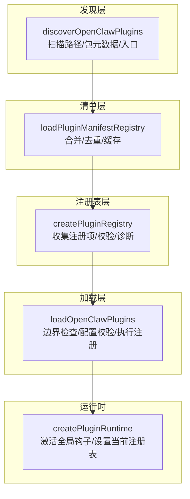
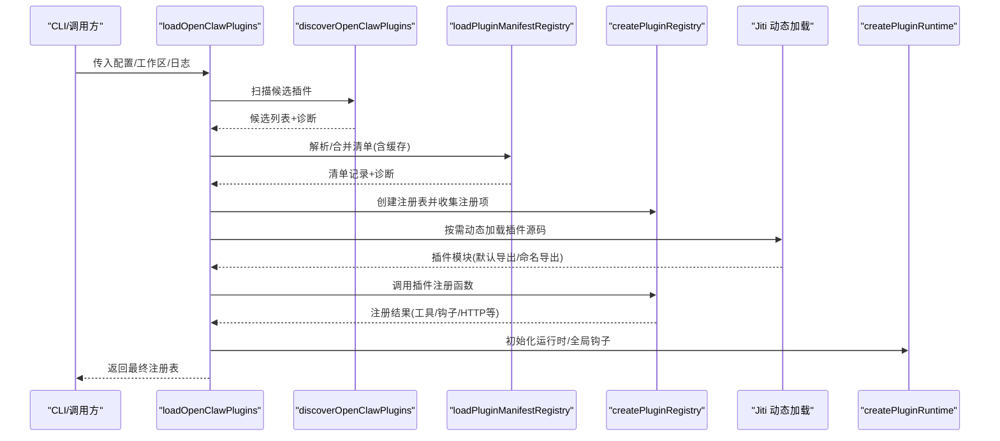
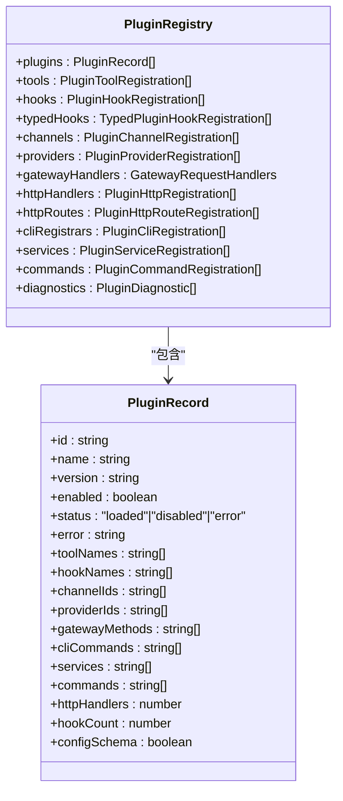
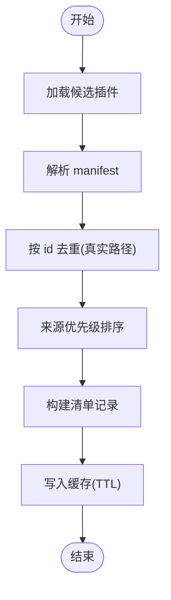
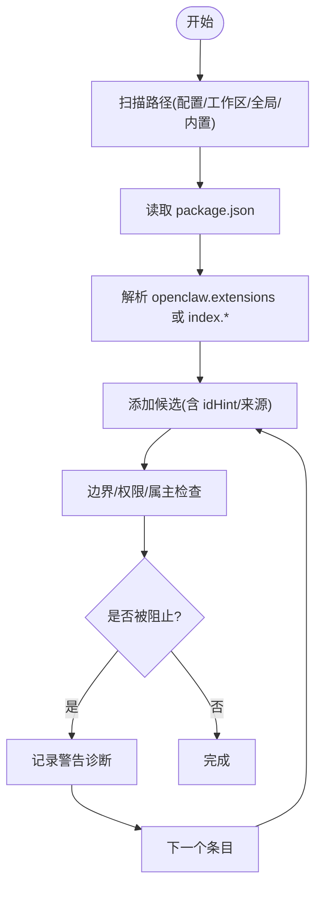
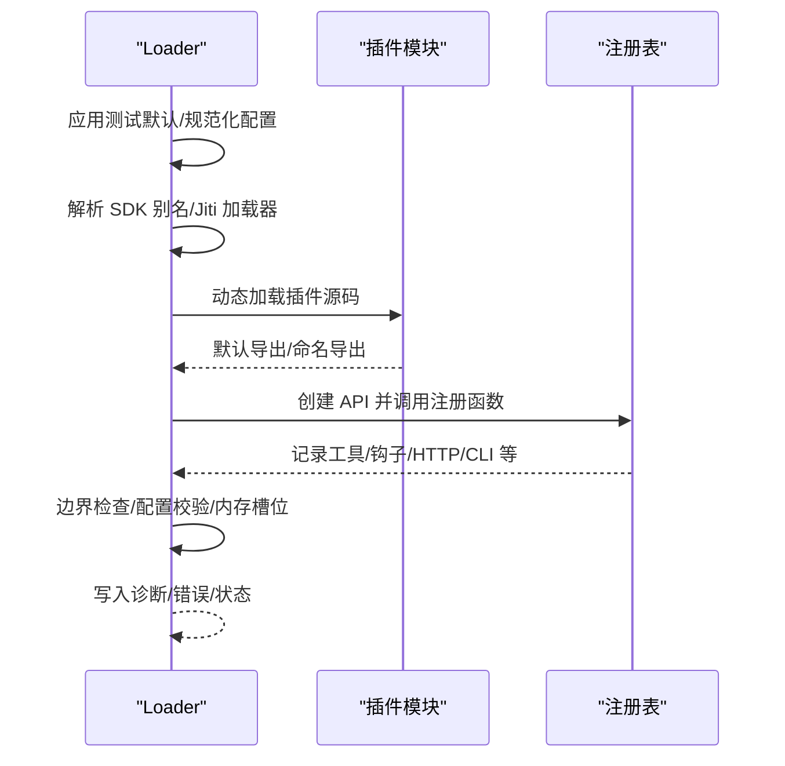
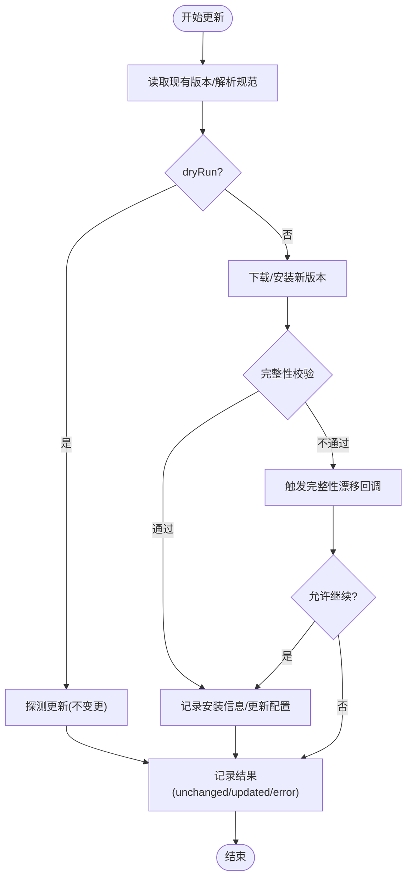
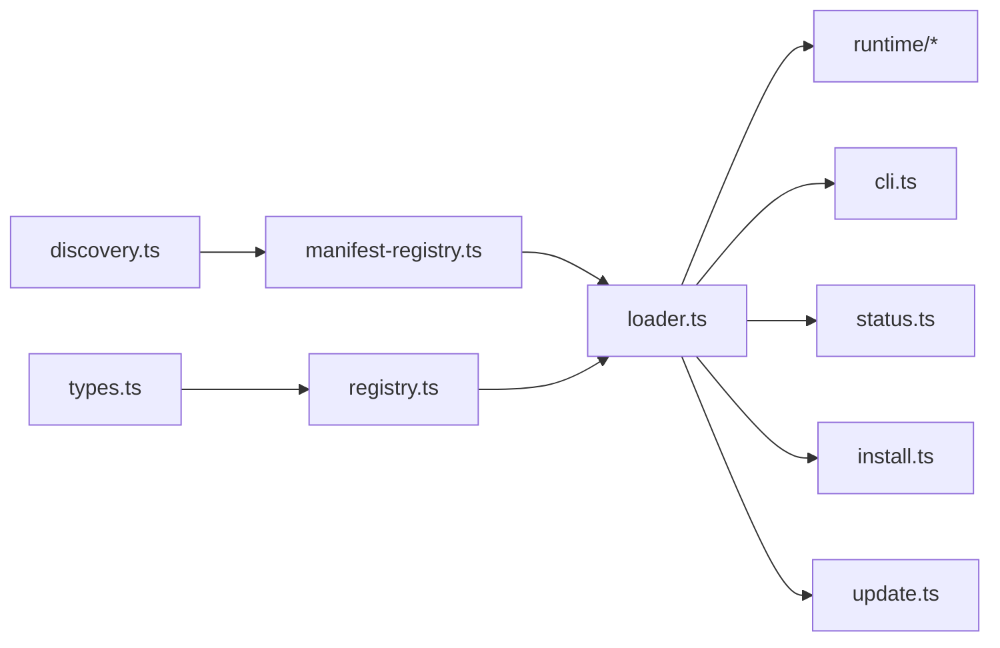

# 插件注册与管理

<cite>
**本文引用的文件**
- [registry.ts](file://src/plugins/registry.ts)
- [loader.ts](file://src/plugins/loader.ts)
- [manifest-registry.ts](file://src/plugins/manifest-registry.ts)
- [discovery.ts](file://src/plugins/discovery.ts)
- [config-state.ts](file://src/plugins/config-state.ts)
- [types.ts](file://src/plugins/types.ts)
- [cli.ts](file://src/plugins/cli.ts)
- [status.ts](file://src/plugins/status.ts)
- [update.ts](file://src/plugins/update.ts)
- [install.ts](file://src/plugins/install.ts)
</cite>

## 目录

1. [简介](#简介)
2. [项目结构](#项目结构)
3. [核心组件](#核心组件)
4. [架构总览](#架构总览)
5. [详细组件分析](#详细组件分析)
6. [依赖关系分析](#依赖关系分析)
7. [性能考量](#性能考量)
8. [故障排查指南](#故障排查指南)
9. [结论](#结论)
10. [附录](#附录)

## 简介

本文件系统化阐述 OpenClaw 插件注册与管理系统的设计与实现，覆盖插件注册表工作机制、插件发现与清单缓存、版本与来源管理、加载流程、依赖解析与冲突处理、配置与自动启用策略、权限与安全检查、状态监控与健康检查、更新与回滚策略以及管理命令与 API 使用方法。目标是帮助开发者与运维人员在理解系统架构的同时，高效地进行插件开发、部署与维护。

## 项目结构

OpenClaw 的插件子系统由“发现—清单—注册表—加载—运行时”五层构成，配合安装、更新与状态报告模块，形成完整的生命周期闭环。

图表来源

- [discovery.ts](file://src/plugins/discovery.ts#L567-L635)
- [manifest-registry.ts](file://src/plugins/manifest-registry.ts#L134-L248)
- [registry.ts](file://src/plugins/registry.ts#L164-L519)
- [loader.ts](file://src/plugins/loader.ts#L368-L717)

章节来源

- [discovery.ts](file://src/plugins/discovery.ts#L1-L636)
- [manifest-registry.ts](file://src/plugins/manifest-registry.ts#L1-L249)
- [registry.ts](file://src/plugins/registry.ts#L1-L520)
- [loader.ts](file://src/plugins/loader.ts#L1-L726)

## 核心组件

- 插件注册表：统一收集与组织插件的工具、钩子、通道、提供者、网关方法、HTTP 路由、CLI 注册器、服务、命令与诊断信息，并记录插件状态与错误。
- 插件清单注册表：从候选插件中提取并标准化 manifest，构建带来源优先级的记录集，支持缓存与重复检测。
- 插件发现器：扫描配置/工作区/全局/内置路径，解析包元数据与扩展入口，过滤不安全路径，生成候选列表。
- 加载器：执行边界检查、配置校验、内存槽位决策、异步注册调用，产出最终注册表并初始化全局钩子。
- 运行时：提供插件运行环境、日志与工具函数，激活全局钩子运行器。
- 安装/更新：支持从 npm、归档、目录或文件安装/更新插件，记录完整性与来源，支持渠道同步。
- 命令与状态：CLI 注册插件命令；状态报告聚合注册表与工作区信息。

章节来源

- [registry.ts](file://src/plugins/registry.ts#L124-L519)
- [manifest-registry.ts](file://src/plugins/manifest-registry.ts#L23-L132)
- [discovery.ts](file://src/plugins/discovery.ts#L16-L32)
- [loader.ts](file://src/plugins/loader.ts#L368-L717)
- [install.ts](file://src/plugins/install.ts#L1-L490)
- [update.ts](file://src/plugins/update.ts#L1-L468)
- [cli.ts](file://src/plugins/cli.ts#L1-L60)
- [status.ts](file://src/plugins/status.ts#L1-L36)

## 架构总览

下图展示从发现到运行时的整体流程与关键交互点。

图表来源

- [loader.ts](file://src/plugins/loader.ts#L368-L717)
- [discovery.ts](file://src/plugins/discovery.ts#L567-L635)
- [manifest-registry.ts](file://src/plugins/manifest-registry.ts#L134-L248)
- [registry.ts](file://src/plugins/registry.ts#L164-L519)

## 详细组件分析

### 组件一：插件注册表（Registry）

- 职责：集中管理插件的工具、钩子、通道、提供者、网关方法、HTTP 处理器/路由、CLI 注册器、服务、命令与诊断信息；记录插件元数据与状态。
- 关键能力：
  - 工具注册：支持工厂模式与直接对象，批量记录名称与可选性。
  - 钩子注册：支持内部钩子与类型化钩子，自动去重与优先级排序。
  - 通道/提供者注册：校验 ID 并避免重复。
  - 网关方法/HTTP 注册：防重与冲突诊断。
  - CLI/服务/命令注册：统一入口与去重。
- 错误与诊断：对缺失字段、重复注册、冲突等情况生成诊断消息并写入注册表。

图表来源

- [registry.ts](file://src/plugins/registry.ts#L97-L138)

章节来源

- [registry.ts](file://src/plugins/registry.ts#L124-L519)

### 组件二：插件清单注册表（Manifest Registry）

- 职责：从候选插件中读取并标准化 manifest，构建带来源优先级的记录集，支持缓存与重复检测。
- 关键能力：
  - 来源优先级：config > workspace > global > bundled，用于覆盖与选择。
  - 重复检测：通过真实路径去重，避免同源不同表示导致的误判。
  - 缓存策略：基于工作区与加载路径构建缓存键，支持 TTL 控制。
  - UI 提示与 JSON Schema：保留配置 UI 提示与 JSON Schema 以供后续校验。

图表来源

- [manifest-registry.ts](file://src/plugins/manifest-registry.ts#L134-L248)

章节来源

- [manifest-registry.ts](file://src/plugins/manifest-registry.ts#L1-L249)

### 组件三：插件发现器（Discovery）

- 职责：扫描配置、工作区、全局与内置路径，解析包元数据与扩展入口，过滤不安全路径，生成候选列表。
- 关键能力：
  - 安全检查：禁止源文件逃逸根目录、禁止世界可写、禁止可疑属主。
  - 包元数据：读取 package.json，解析 openclaw.extensions，推导入口。
  - 入口解析：支持多入口与 index 文件，派生 idHint。
  - 目录扫描：忽略备份/禁用类目录，递归遍历。

图表来源

- [discovery.ts](file://src/plugins/discovery.ts#L347-L451)

章节来源

- [discovery.ts](file://src/plugins/discovery.ts#L1-L636)

### 组件四：插件加载器（Loader）

- 职责：执行边界检查、配置校验、内存槽位决策、异步注册调用，产出最终注册表并初始化全局钩子。
- 关键流程：
  - 测试环境默认禁用策略：测试模式下默认关闭插件，除非显式配置。
  - 插件 SDK 别名解析：支持开发/生产/测试场景下的 SDK 路径别名。
  - 边界文件读取：确保入口文件位于插件根目录内，防止路径逃逸。
  - 配置校验：基于 manifest 中的 JSON Schema 对插件配置进行校验。
  - 内存槽位：根据插件 kind 与用户配置决定是否启用与选择。
  - 注册调用：动态加载插件模块并调用注册函数，记录诊断与错误。
  - 缓存：基于工作区与配置构建缓存键，提升重复加载性能。
  - 全局钩子：初始化全局钩子运行器。

图表来源

- [loader.ts](file://src/plugins/loader.ts#L368-L717)

章节来源

- [loader.ts](file://src/plugins/loader.ts#L1-L726)

### 组件五：配置状态与启用策略（Config-State）

- 职责：规范化插件配置，计算启用状态与内存槽位决策，提供测试环境默认值。
- 关键规则：
  - 全局开关、黑名单、白名单、加载路径、内存槽位、逐插件条目配置。
  - 启用判定：全局禁用 > 黑名单 > 不在白名单 > 显式启用 > 内存槽位命中 > Bundled 默认策略。
  - 内存槽位：支持显式禁用(null)、显式指定、未指定时的默认槽位。
  - 测试默认：测试环境默认禁用插件，除非显式配置或内存插件。

章节来源

- [config-state.ts](file://src/plugins/config-state.ts#L1-L263)

### 组件六：类型与 API（Types）

- 职责：定义插件 API、工具、钩子、通道、提供者、HTTP、CLI、服务、命令、诊断等类型与事件模型。
- 关键点：
  - OpenClawPluginApi：插件注册时的上下文 API，包括注册工具、钩子、HTTP、通道、网关方法、CLI、服务、命令与生命周期钩子。
  - 钩子体系：覆盖模型解析、提示构建、代理启动、消息收发、工具调用、会话生命周期、子代理、网关启停等阶段。
  - 类型化钩子：支持优先级与事件绑定。

章节来源

- [types.ts](file://src/plugins/types.ts#L1-L764)

### 组件七：安装与更新（Install/Update）

- 安装：
  - 支持从 npm 规范、归档、目录、文件安装，自动扫描危险代码模式，记录扩展入口。
  - 安全路径解析与复制，避免路径穿越。
- 更新：
  - 支持 npm 安装插件的更新与完整性漂移处理，支持干跑探测。
  - 支持按更新通道在本地 bundled 与 npm 之间切换，维护加载路径。

图表来源

- [update.ts](file://src/plugins/update.ts#L158-L345)
- [install.ts](file://src/plugins/install.ts#L400-L440)

章节来源

- [install.ts](file://src/plugins/install.ts#L1-L490)
- [update.ts](file://src/plugins/update.ts#L1-L468)

### 组件八：CLI 与状态报告（CLI/Status）

- CLI：加载插件注册表后，遍历注册的 CLI 注册器，避免命令重叠，注册插件命令。
- 状态：构建插件状态报告，包含注册表与工作区信息，便于诊断与审计。

章节来源

- [cli.ts](file://src/plugins/cli.ts#L1-L60)
- [status.ts](file://src/plugins/status.ts#L1-L36)

## 依赖关系分析

- 发现层依赖清单层：发现器输出候选，清单层负责解析与去重。
- 清单层依赖发现层：清单层复用发现器的候选集合。
- 注册表层依赖类型定义：注册表使用 types.ts 中的类型与事件模型。
- 加载器依赖注册表、清单、发现、配置状态与运行时。
- 安装/更新依赖清单与安装流程工具链。
- CLI/状态依赖加载器与日志系统。

图表来源

- [discovery.ts](file://src/plugins/discovery.ts#L567-L635)
- [manifest-registry.ts](file://src/plugins/manifest-registry.ts#L134-L248)
- [loader.ts](file://src/plugins/loader.ts#L368-L717)
- [registry.ts](file://src/plugins/registry.ts#L164-L519)
- [types.ts](file://src/plugins/types.ts#L1-L764)
- [cli.ts](file://src/plugins/cli.ts#L1-L60)
- [status.ts](file://src/plugins/status.ts#L1-L36)
- [install.ts](file://src/plugins/install.ts#L1-L490)
- [update.ts](file://src/plugins/update.ts#L1-L468)

章节来源

- [loader.ts](file://src/plugins/loader.ts#L1-L726)
- [registry.ts](file://src/plugins/registry.ts#L1-L520)
- [types.ts](file://src/plugins/types.ts#L1-L764)

## 性能考量

- 缓存策略：
  - 清单注册表缓存：基于工作区与加载路径构建缓存键，支持 TTL 控制，减少重复解析。
  - 插件加载缓存：基于工作区与规范化配置构建缓存键，避免重复加载。
- 懒加载：
  - Jiti 动态加载器仅在插件启用且需要时创建，减少测试与禁用场景的开销。
- 并发与超时：
  - 安装/更新流程支持超时与干跑探测，避免阻塞。
- I/O 优化：
  - 安全路径解析与边界文件读取，减少无效 I/O 与潜在风险。

## 故障排查指南

- 常见问题与定位：
  - 插件未加载：检查启用状态（全局开关/黑名单/白名单/内存槽位）、清单是否存在配置 Schema、注册函数是否存在。
  - 路径逃逸/权限问题：查看发现器的安全检查诊断，修正路径权限与属主。
  - 重复 ID/冲突：查看清单去重与来源优先级诊断，确认是否被更高优先级来源覆盖。
  - 配置校验失败：核对 manifest 中的 JSON Schema 与实际配置，修正字段类型与必填项。
  - HTTP/网关冲突：查看注册表中的冲突诊断，避免重复注册相同路径或方法。
- 诊断输出：
  - 注册表包含 diagnostics 字段，记录 warn/error 级别诊断，便于快速定位。
  - 加载器在错误时写入插件状态与错误信息，便于状态报告与故障恢复。

章节来源

- [loader.ts](file://src/plugins/loader.ts#L187-L210)
- [discovery.ts](file://src/plugins/discovery.ts#L143-L199)
- [manifest-registry.ts](file://src/plugins/manifest-registry.ts#L196-L238)
- [registry.ts](file://src/plugins/registry.ts#L269-L330)

## 结论

OpenClaw 插件系统通过“发现—清单—注册表—加载—运行时”的分层设计，实现了安全、可控、可观测的插件生命周期管理。其启用策略、内存槽位与来源优先级保障了稳定性，而清单缓存、边界检查与完整性校验则提升了性能与安全性。CLI 与状态报告进一步增强了可运维性。建议在生产环境中严格使用白名单与来源记录，配合定期更新与完整性校验，确保插件生态的长期稳定。

## 附录

### 插件配置管理要点

- 全局开关与黑白名单：通过配置控制插件启用范围。
- 加载路径：支持多路径扫描，结合来源优先级决定最终可用插件。
- 内存槽位：通过插件 kind 与配置决定内存插件的选择。
- 逐插件条目：支持针对特定插件的启用与配置覆盖。

章节来源

- [config-state.ts](file://src/plugins/config-state.ts#L6-L80)

### 自动启用与手动控制

- 自动启用：Bundled 插件在满足条件时可自动启用；测试环境默认禁用。
- 手动控制：通过白名单/黑名单、内存槽位与逐插件条目进行精确控制。

章节来源

- [config-state.ts](file://src/plugins/config-state.ts#L17-L21)
- [config-state.ts](file://src/plugins/config-state.ts#L165-L232)

### 权限系统、安全检查与访问控制

- 路径安全：禁止世界可写与可疑属主，防止恶意路径。
- 边界检查：确保入口文件位于插件根目录内。
- 代码扫描：安装时对插件源码进行危险模式扫描，告警但不阻断安装。
- 来源追踪：安装记录包含来源、规范与完整性，便于审计。

章节来源

- [discovery.ts](file://src/plugins/discovery.ts#L65-L199)
- [install.ts](file://src/plugins/install.ts#L199-L221)
- [update.ts](file://src/plugins/update.ts#L132-L156)

### 插件状态监控、健康检查与故障恢复

- 状态报告：聚合注册表与工作区信息，便于健康检查。
- 诊断输出：注册表与加载器均提供诊断信息，辅助故障定位。
- 故障恢复：通过禁用/移除异常插件、回滚到已知稳定版本、重新安装等方式恢复。

章节来源

- [status.ts](file://src/plugins/status.ts#L15-L35)
- [loader.ts](file://src/plugins/loader.ts#L187-L210)

### 插件更新流程、回滚策略与兼容性保证

- 更新流程：支持 npm 规范安装、干跑探测、完整性校验与漂移处理。
- 回滚策略：通过安装记录与版本号回溯，必要时降级到上一个稳定版本。
- 兼容性保证：清单中的 JSON Schema 与 UI 提示确保配置兼容；来源优先级与白名单降低破坏性更新风险。

章节来源

- [update.ts](file://src/plugins/update.ts#L158-L345)
- [install.ts](file://src/plugins/install.ts#L400-L440)
- [manifest-registry.ts](file://src/plugins/manifest-registry.ts#L190-L195)

### 插件管理命令、API 接口与监控工具

- 管理命令：CLI 注册器在加载后注册插件命令，避免与内置命令冲突。
- API 接口：OpenClawPluginApi 提供注册工具、钩子、HTTP、通道、网关方法、CLI、服务、命令与生命周期钩子。
- 监控工具：状态报告与诊断输出可用于监控插件健康状况。

章节来源

- [cli.ts](file://src/plugins/cli.ts#L11-L59)
- [types.ts](file://src/plugins/types.ts#L245-L284)
- [status.ts](file://src/plugins/status.ts#L15-L35)
