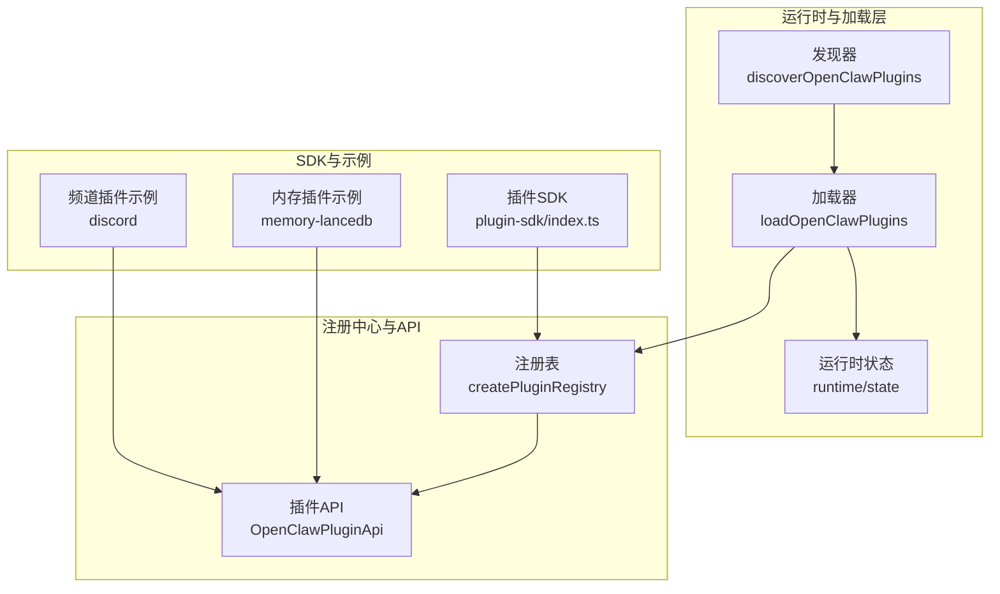
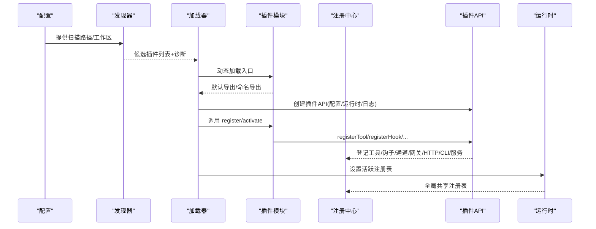
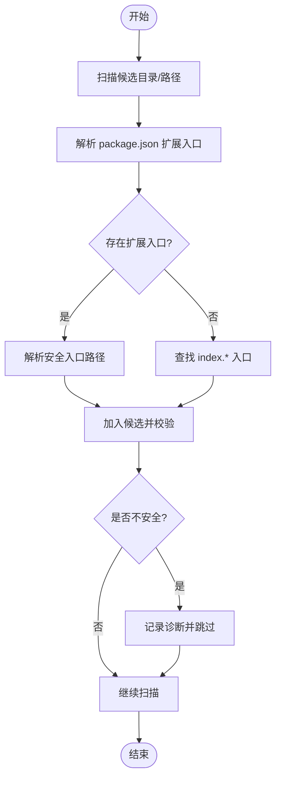
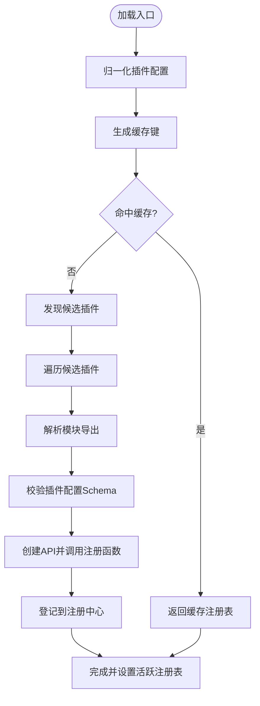
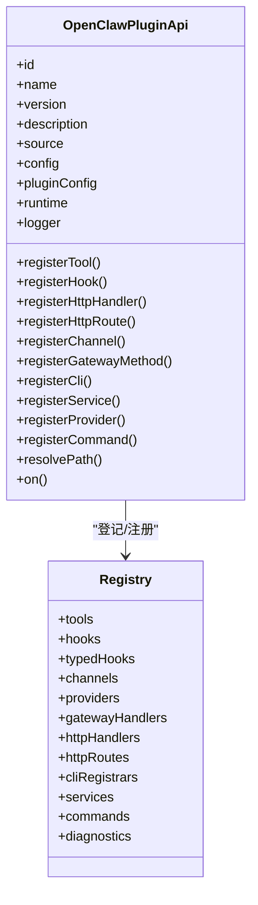
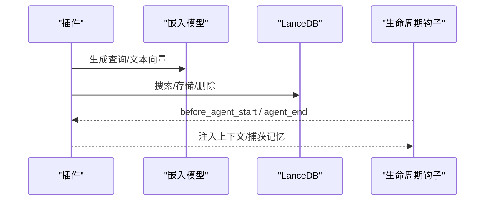
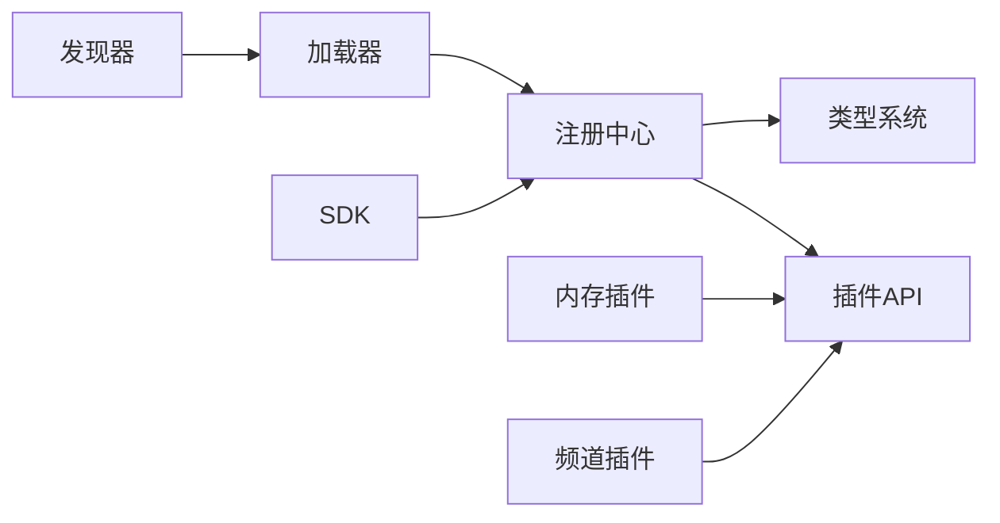

# 插件生态系统

<cite>
**本文引用的文件**
- [loader.ts](file://src/plugins/loader.ts)
- [registry.ts](file://src/plugins/registry.ts)
- [runtime.ts](file://src/plugins/runtime.ts)
- [types.ts](file://src/plugins/types.ts)
- [config-schema.ts](file://src/plugins/config-schema.ts)
- [discovery.ts](file://src/plugins/discovery.ts)
- [index.ts](file://src/plugin-sdk/index.ts)
- [openclaw.plugin.json（LanceDB 内存插件）](file://extensions/memory-lancedb/openclaw.plugin.json)
- [index.ts（LanceDB 内存插件）](file://extensions/memory-lancedb/index.ts)
- [openclaw.plugin.json（Discord 频道插件）](file://extensions/discord/openclaw.plugin.json)
- [index.ts（Discord 频道插件）](file://extensions/discord/index.ts)
</cite>

## 目录

1. [引言](#引言)
2. [项目结构](#项目结构)
3. [核心组件](#核心组件)
4. [架构总览](#架构总览)
5. [组件详解](#组件详解)
6. [依赖关系分析](#依赖关系分析)
7. [性能考量](#性能考量)
8. [故障排查指南](#故障排查指南)
9. [结论](#结论)
10. [附录](#附录)

## 引言

本文件系统化阐述 OpenClaw 的插件生态系统：从架构设计、动态加载机制、注册与生命周期管理，到插件间通信协议、开发与发布流程、安全与性能策略。文档同时覆盖内置插件与社区生态，并给出可操作的最佳实践与排障建议。

## 项目结构

OpenClaw 将插件体系分为三层：

- 运行时与加载器：负责发现候选插件、校验路径与权限、解析导出、执行注册并构建全局注册表。
- 注册中心与 API：统一暴露插件 API，集中登记工具、钩子、通道、网关方法、HTTP 路由、CLI 命令、服务等。
- SDK 与示例插件：提供标准化的开发接口与典型实现（如内存插件、频道插件），便于开发者快速上手。

图表来源

- [discovery.ts](file://src/plugins/discovery.ts#L567-L635)
- [loader.ts](file://src/plugins/loader.ts#L368-L717)
- [registry.ts](file://src/plugins/registry.ts#L164-L519)
- [runtime.ts](file://src/plugins/runtime.ts#L1-L41)
- [index.ts](file://src/plugin-sdk/index.ts#L1-L597)
- [openclaw.plugin.json（LanceDB 内存插件）](file://extensions/memory-lancedb/openclaw.plugin.json#L1-L72)
- [index.ts（LanceDB 内存插件）](file://extensions/memory-lancedb/index.ts#L1-L671)
- [openclaw.plugin.json（Discord 频道插件）](file://extensions/discord/openclaw.plugin.json#L1-L10)
- [index.ts（Discord 频道插件）](file://extensions/discord/index.ts#L1-L20)

章节来源

- [discovery.ts](file://src/plugins/discovery.ts#L1-L636)
- [loader.ts](file://src/plugins/loader.ts#L1-L726)
- [registry.ts](file://src/plugins/registry.ts#L1-L520)
- [runtime.ts](file://src/plugins/runtime.ts#L1-L41)
- [index.ts](file://src/plugin-sdk/index.ts#L1-L597)

## 核心组件

- 发现器（Discovery）：扫描工作区、全局与内置扩展目录，解析 package.json 中的扩展入口，生成候选插件列表并进行路径与权限校验。
- 加载器（Loader）：基于配置与清单，逐个加载插件模块，解析导出定义，校验注册函数与配置模式，创建插件 API 并调用注册回调，最终建立全局注册表。
- 注册中心（Registry）：统一登记插件的工具、钩子、通道、网关方法、HTTP 路由、CLI 命令、服务等；提供插件 API 的工厂方法。
- 运行时状态（Runtime）：维护当前活跃的插件注册表与缓存键，供全局共享。
- SDK：提供常用工具、鉴权、SSRF 策略、Webhook、临时文件、命令运行、日志等能力，以及类型与配置模式。

章节来源

- [discovery.ts](file://src/plugins/discovery.ts#L1-L636)
- [loader.ts](file://src/plugins/loader.ts#L1-L726)
- [registry.ts](file://src/plugins/registry.ts#L1-L520)
- [runtime.ts](file://src/plugins/runtime.ts#L1-L41)
- [index.ts](file://src/plugin-sdk/index.ts#L1-L597)

## 架构总览

下图展示从“发现”到“注册”的端到端流程，以及插件 API 的关键能力边界。

图表来源

- [discovery.ts](file://src/plugins/discovery.ts#L567-L635)
- [loader.ts](file://src/plugins/loader.ts#L368-L717)
- [registry.ts](file://src/plugins/registry.ts#L472-L503)
- [runtime.ts](file://src/plugins/runtime.ts#L23-L41)

## 组件详解

### 插件发现与安全校验

- 扫描范围：支持从配置显式路径、工作区扩展目录、全局扩展目录、内置扩展目录发现插件。
- 包入口解析：优先读取 package.json 中的扩展入口数组，否则回退到 index.\* 文件。
- 安全校验：禁止源文件逃逸根目录、禁止世界可写路径、在类 Unix 系统上检查可疑所有权。
- 诊断输出：对不安全或异常情况记录警告/错误，便于定位问题。

图表来源

- [discovery.ts](file://src/plugins/discovery.ts#L347-L451)
- [discovery.ts](file://src/plugins/discovery.ts#L453-L565)
- [discovery.ts](file://src/plugins/discovery.ts#L143-L199)

章节来源

- [discovery.ts](file://src/plugins/discovery.ts#L1-L636)

### 插件加载与注册

- 配置归一化与缓存键：根据工作区与插件配置生成缓存键，避免重复加载。
- Jiti 动态加载：按需创建 Jiti 实例，支持多扩展名与 SDK 别名解析。
- 导出解析：兼容默认导出与具名导出（register/activate），并校验 id/kind 一致性。
- 配置校验：使用插件声明的 JSON Schema 对配置进行验证。
- 注册执行：创建插件 API 并调用注册函数，登记工具、钩子、通道、网关方法、HTTP 路由、CLI、服务等。
- 记录诊断：对异常与警告进行收集，包括未跟踪加载、内存槽位缺失、异步注册忽略等。

图表来源

- [loader.ts](file://src/plugins/loader.ts#L368-L717)

章节来源

- [loader.ts](file://src/plugins/loader.ts#L1-L726)

### 插件 API 与注册中心

- 插件 API：提供工具、钩子、通道、网关方法、HTTP 处理器/路由、CLI、服务、命令等注册方法；提供运行时、日志、路径解析等能力。
- 注册中心：统一登记各类插件资产，去重与冲突检测（如 HTTP 路由重复、提供者 ID 冲突、网关方法重复等），并维护诊断信息。
- 生命周期钩子：通过 typed hooks 与内部钩子系统，支持 before*model_resolve、before_prompt_build、message*_、tool\__、session*\*、subagent*_、gateway\__ 等阶段。

图表来源

- [registry.ts](file://src/plugins/registry.ts#L164-L519)
- [types.ts](file://src/plugins/types.ts#L245-L284)

章节来源

- [registry.ts](file://src/plugins/registry.ts#L1-L520)
- [types.ts](file://src/plugins/types.ts#L1-L764)

### 插件类型与配置模式

- 插件类型：目前支持 kind 为 memory 的插件。
- 配置模式：每个插件声明 JSON Schema 与 UI 提示，SDK 提供空配置模式工具以简化无配置插件。
- 类型系统：统一的插件 API、钩子事件、工具上下文、命令定义等类型，确保强类型开发体验。

章节来源

- [types.ts](file://src/plugins/types.ts#L38-L56)
- [config-schema.ts](file://src/plugins/config-schema.ts#L1-L34)

### 示例插件：内存（LanceDB）

- 能力概览：向量化长期记忆、自动召回与捕获、CLI 命令、服务生命周期、安全过滤与提示注入防护。
- 关键点：使用 OpenAI Embeddings 生成向量，LanceDB 存储与检索；通过生命周期钩子在合适时机注入上下文或持久化记忆；提供 CLI 命令用于调试与运维。

图表来源

- [index.ts（LanceDB 内存插件）](file://extensions/memory-lancedb/index.ts#L293-L667)
- [openclaw.plugin.json（LanceDB 内存插件）](file://extensions/memory-lancedb/openclaw.plugin.json#L1-L72)

章节来源

- [index.ts（LanceDB 内存插件）](file://extensions/memory-lancedb/index.ts#L1-L671)
- [openclaw.plugin.json（LanceDB 内存插件）](file://extensions/memory-lancedb/openclaw.plugin.json#L1-L72)

### 示例插件：Discord 频道

- 能力概览：注册 Discord 渠道插件、设置运行时、注册子代理钩子。
- 关键点：通过空配置模式简化无配置场景；将渠道插件注册到平台注册表。

章节来源

- [index.ts（Discord 频道插件）](file://extensions/discord/index.ts#L1-L20)
- [openclaw.plugin.json（Discord 频道插件）](file://extensions/discord/openclaw.plugin.json#L1-L10)

## 依赖关系分析

- 发现器依赖：边界读取、用户路径解析、包清单元数据、路径安全工具。
- 加载器依赖：发现器结果、清单注册表、Jiti 动态加载、边界文件读取、路径安全、配置归一化、运行时与钩子初始化。
- 注册中心依赖：插件 API、工具类型、通道/提供者类型、网关请求处理器类型、HTTP 路由规范化。
- SDK 依赖：通道/提供者类型、运行时、安全策略（SSRF）、Webhook、命令运行、日志等基础设施。

图表来源

- [discovery.ts](file://src/plugins/discovery.ts#L1-L636)
- [loader.ts](file://src/plugins/loader.ts#L1-L726)
- [registry.ts](file://src/plugins/registry.ts#L1-L520)
- [types.ts](file://src/plugins/types.ts#L1-L764)
- [index.ts](file://src/plugin-sdk/index.ts#L1-L597)

章节来源

- [discovery.ts](file://src/plugins/discovery.ts#L1-L636)
- [loader.ts](file://src/plugins/loader.ts#L1-L726)
- [registry.ts](file://src/plugins/registry.ts#L1-L520)
- [types.ts](file://src/plugins/types.ts#L1-L764)
- [index.ts](file://src/plugin-sdk/index.ts#L1-L597)

## 性能考量

- 动态加载与缓存：加载器按配置生成缓存键，命中后直接复用注册表，减少重复解析与加载开销。
- 懒加载 Jiti：仅在需要时创建 Jiti 实例，避免在禁用插件场景下的额外成本。
- 路径与权限校验：在加载前完成边界与权限检查，尽早失败，降低后续运行时风险与开销。
- 配置校验：在注册前完成 JSON Schema 校验，避免无效配置带来的运行期错误与回退。
- 钩子与工具：通过 typed hooks 与内部钩子系统，插件可在关键阶段进行轻量处理，避免阻塞主流程。

[本节为通用性能讨论，无需特定文件引用]

## 故障排查指南

- 插件未加载/被禁用
  - 检查插件 id/kind 与清单是否一致，确认配置 entries 是否启用。
  - 查看诊断信息中关于“缺少配置模式”“注册导出缺失”“内存槽位未匹配”等提示。
- 路径与权限问题
  - 若出现“源逃逸根目录/无法 stat/世界可写/可疑所有权”，请修正文件权限与归属，确保插件目录与入口文件受控。
- 未跟踪加载
  - 当插件未通过安装路径或允许列表追踪时，会发出警告，建议通过 plugins.allow 或安装记录明确信任。
- 配置校验失败
  - 根据诊断中的错误列表定位字段，修正 JSON Schema 不符合项。
- 异步注册忽略
  - 注册函数返回 Promise 将被忽略并记录警告，请改为同步注册逻辑或自行处理异步副作用。

章节来源

- [loader.ts](file://src/plugins/loader.ts#L514-L526)
- [loader.ts](file://src/plugins/loader.ts#L651-L664)
- [loader.ts](file://src/plugins/loader.ts#L698-L703)
- [discovery.ts](file://src/plugins/discovery.ts#L164-L175)

## 结论

OpenClaw 的插件体系以“安全、可扩展、可观测”为核心目标：通过严格的发现与安全校验、灵活的动态加载与注册、统一的 API 与注册中心，以及完善的 SDK 与示例，为内置与社区生态提供了清晰的开发与集成路径。配合钩子系统与配置模式，插件可在关键生命周期节点进行可控增强，兼顾安全性与性能。

[本节为总结性内容，无需特定文件引用]

## 附录

### 插件开发指南（基于仓库实现）

- 插件清单与配置
  - 在插件根目录提供 openclaw.plugin.json，声明 id、kind、channels（如适用）、configSchema 与 UI 提示。
  - 使用 SDK 的 emptyPluginConfigSchema 为无配置插件提供空模式。
- 插件入口与导出
  - 导出对象包含 id/name/description/version/kind/configSchema/register/activate 等字段。
  - 支持默认导出或具名导出，register/activate 二选一。
- 注册 API 使用
  - 在注册函数中使用 api.registerTool/registerHook/registerChannel/registerGatewayMethod/registerHttpRoute/registerCli/registerService/registerCommand 等方法登记能力。
  - 使用 api.on 注册生命周期钩子，按需在 before*agent_start/agent_end/message*\* 等阶段处理。
- 配置与校验
  - 在 openclaw.plugin.json 中声明 JSON Schema，确保配置合法；SDK 提供空模式工具简化无配置场景。
- 安全与路径
  - 使用 api.resolvePath 解析用户路径，避免硬编码绝对路径；遵循插件根目录边界约束。
- 示例参考
  - 内存插件展示了工具注册、CLI 命令、服务生命周期、钩子注入与向量检索的完整流程。
  - 频道插件展示了如何注册渠道插件与设置运行时。

章节来源

- [openclaw.plugin.json（LanceDB 内存插件）](file://extensions/memory-lancedb/openclaw.plugin.json#L1-L72)
- [index.ts（LanceDB 内存插件）](file://extensions/memory-lancedb/index.ts#L286-L667)
- [openclaw.plugin.json（Discord 频道插件）](file://extensions/discord/openclaw.plugin.json#L1-L10)
- [index.ts（Discord 频道插件）](file://extensions/discord/index.ts#L7-L19)
- [config-schema.ts](file://src/plugins/config-schema.ts#L13-L33)
- [types.ts](file://src/plugins/types.ts#L230-L239)
- [registry.ts](file://src/plugins/registry.ts#L472-L503)

### 插件注册系统与通信协议

- 注册系统
  - 工具：api.registerTool，支持单名或多名称注册，可标记为可选。
  - 钩子：api.registerHook 与 api.on，分别面向内部钩子与 typed hooks，支持事件列表与优先级。
  - 通道：api.registerChannel，登记渠道插件与停靠点。
  - 网关方法：api.registerGatewayMethod，注册网关请求处理器，避免重复。
  - HTTP：api.registerHttpHandler 与 api.registerHttpRoute，登记处理器与规范化路由。
  - CLI：api.registerCli，登记 CLI 注册器与命令集合。
  - 服务：api.registerService，登记服务生命周期。
  - 命令：api.registerCommand，登记简单命令（绕过 LLM）。
- 通信协议
  - 网关方法：通过 GatewayRequestHandler 与 GatewayRequestHandlers 协议进行 RPC 调用。
  - HTTP 路由：通过 OpenClawPluginHttpRouteHandler 与规范化路径进行 Web 请求处理。
  - 钩子：通过 HookEntry 与内部钩子系统传递事件与上下文，支持结果修改与拦截。

章节来源

- [registry.ts](file://src/plugins/registry.ts#L164-L519)
- [types.ts](file://src/plugins/types.ts#L128-L284)

### 插件配置管理与版本兼容

- 配置模式
  - 每个插件声明 JSON Schema 与 UI 提示，SDK 提供 emptyPluginConfigSchema 适配无配置场景。
  - 加载器在注册前对插件配置进行校验，失败则记录错误并阻止注册。
- 版本兼容
  - 插件清单包含 id、name、version、kind 等元信息；加载器会对比 manifest 与导出的 id/kind，若不一致则记录警告。
  - 通过 slots 与 entries 控制插件启用与优先级，避免同 id 冲突。

章节来源

- [config-schema.ts](file://src/plugins/config-schema.ts#L1-L34)
- [loader.ts](file://src/plugins/loader.ts#L576-L598)
- [loader.ts](file://src/plugins/loader.ts#L484-L512)

### 插件安全模型与资源隔离

- 路径与权限
  - 发现与加载前进行边界检查与权限校验，禁止世界可写与可疑所有权路径。
- SSRF 与网络
  - SDK 提供 SSRF 策略工具与 fetch 守卫，限制私有地址与主机白名单。
- 日志与诊断
  - 统一的 PluginLogger 与诊断收集，便于审计与排错。
- 内存插件安全
  - 向量检索采用相似度阈值过滤，防止过度召回；对提示注入进行检测与转义，避免上下文污染。

章节来源

- [discovery.ts](file://src/plugins/discovery.ts#L65-L199)
- [index.ts](file://src/plugin-sdk/index.ts#L289-L301)

### 插件开发最佳实践

- 明确声明配置模式与 UI 提示，保持字段最小化与可维护性。
- 使用 api.on 与生命周期钩子进行非阻塞增强，必要时返回结果以修改上下文。
- 严格遵守插件根目录边界，避免访问外部路径。
- 对外部依赖进行懒加载与错误兜底，提升鲁棒性。
- 通过 CLI 命令提供运维与调试能力，便于问题定位。

[本节为通用最佳实践，无需特定文件引用]

### 测试与发布

- 测试
  - 可参考插件测试文件（如 voice-call.plugin.test.ts、loader.test.ts、slots.test.ts 等）组织单元测试与集成测试。
- 发布
  - 将插件放入 extensions 目录或工作区扩展目录，确保 openclaw.plugin.json 正确声明；通过 plugins.allow 或安装记录明确信任。

章节来源

- [loader.ts](file://src/plugins/loader.ts#L487-L564)
- [slots.ts](file://src/plugins/slots.ts#L1-L200)
