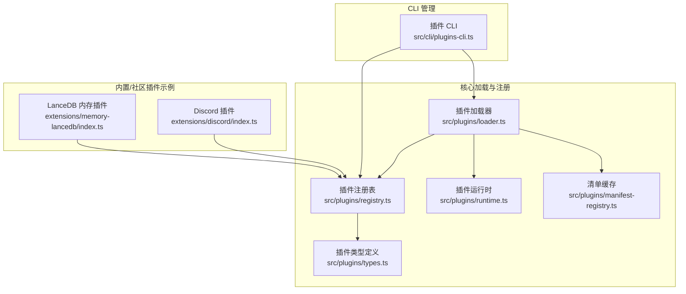
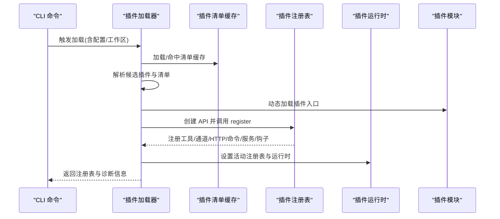
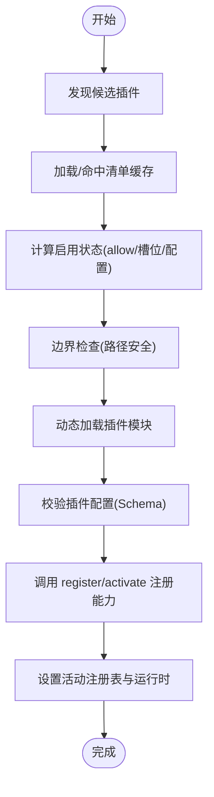
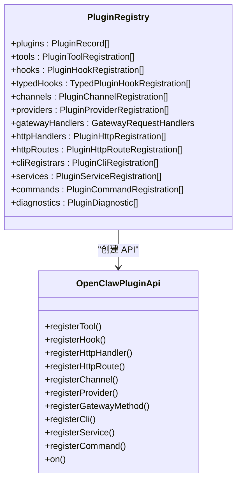
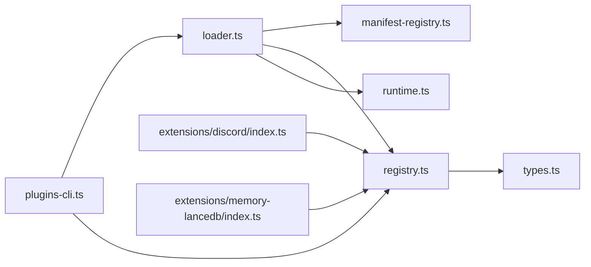

# 社区插件生态

<cite>
**本文引用的文件**
- [src/plugins/loader.ts](file://src/plugins/loader.ts)
- [src/plugins/registry.ts](file://src/plugins/registry.ts)
- [src/plugins/types.ts](file://src/plugins/types.ts)
- [src/plugins/runtime.ts](file://src/plugins/runtime.ts)
- [src/plugins/manifest-registry.ts](file://src/plugins/manifest-registry.ts)
- [src/cli/plugins-cli.ts](file://src/cli/plugins-cli.ts)
- [extensions/discord/index.ts](file://extensions/discord/index.ts)
- [extensions/memory-lancedb/index.ts](file://extensions/memory-lancedb/index.ts)
- [src/channels/plugins/registry-loader.ts](file://src/channels/plugins/registry-loader.ts)
- [docs/plugins/community.md](file://docs/plugins/community.md)
- [CONTRIBUTING.md](file://CONTRIBUTING.md)
</cite>

## 目录

1. [简介](#简介)
2. [项目结构](#项目结构)
3. [核心组件](#核心组件)
4. [架构总览](#架构总览)
5. [组件详解](#组件详解)
6. [依赖关系分析](#依赖关系分析)
7. [性能考量](#性能考量)
8. [故障排查指南](#故障排查指南)
9. [结论](#结论)
10. [附录](#附录)

## 简介

本文件系统性梳理 OpenClaw 社区插件生态，覆盖插件集合、功能分类、内置与社区插件、安装与管理、质量标准与审核流程、版本与更新机制、贡献指南与开源协议等。目标是帮助用户与贡献者快速理解并高效使用与扩展 OpenClaw 的插件体系。

## 项目结构

OpenClaw 插件生态由“核心加载器”“注册表与类型系统”“运行时与生命周期钩子”“CLI 管理工具”“内置与社区插件示例”等模块构成。下图展示关键模块之间的关系：

图表来源

- [src/plugins/loader.ts](file://src/plugins/loader.ts#L368-L717)
- [src/plugins/registry.ts](file://src/plugins/registry.ts#L164-L519)
- [src/plugins/types.ts](file://src/plugins/types.ts#L230-L284)
- [src/plugins/runtime.ts](file://src/plugins/runtime.ts#L1-L41)
- [src/plugins/manifest-registry.ts](file://src/plugins/manifest-registry.ts#L47-L91)
- [src/cli/plugins-cli.ts](file://src/cli/plugins-cli.ts#L161-L200)
- [extensions/discord/index.ts](file://extensions/discord/index.ts#L1-L20)
- [extensions/memory-lancedb/index.ts](file://extensions/memory-lancedb/index.ts#L286-L671)

章节来源

- [src/plugins/loader.ts](file://src/plugins/loader.ts#L368-L717)
- [src/plugins/registry.ts](file://src/plugins/registry.ts#L164-L519)
- [src/plugins/types.ts](file://src/plugins/types.ts#L230-L284)
- [src/plugins/runtime.ts](file://src/plugins/runtime.ts#L1-L41)
- [src/plugins/manifest-registry.ts](file://src/plugins/manifest-registry.ts#L47-L91)
- [src/cli/plugins-cli.ts](file://src/cli/plugins-cli.ts#L161-L200)
- [extensions/discord/index.ts](file://extensions/discord/index.ts#L1-L20)
- [extensions/memory-lancedb/index.ts](file://extensions/memory-lancedb/index.ts#L286-L671)

## 核心组件

- 插件加载器：负责扫描候选插件、解析清单、校验配置、加载模块、注册能力，并建立全局运行时状态。
- 插件注册表：集中存储已加载插件及其工具、通道、HTTP 路由、命令、服务、钩子等元数据。
- 类型系统：定义插件 API、钩子事件、命令、工具、通道与提供方等类型契约。
- 运行时：提供插件可访问的运行环境、日志、路径解析等能力。
- 清单缓存：对插件清单进行缓存，提升加载性能与一致性。
- CLI：提供插件安装、卸载、启用/禁用、状态查看、更新等管理能力。

章节来源

- [src/plugins/loader.ts](file://src/plugins/loader.ts#L368-L717)
- [src/plugins/registry.ts](file://src/plugins/registry.ts#L124-L138)
- [src/plugins/types.ts](file://src/plugins/types.ts#L230-L284)
- [src/plugins/runtime.ts](file://src/plugins/runtime.ts#L23-L41)
- [src/plugins/manifest-registry.ts](file://src/plugins/manifest-registry.ts#L47-L91)
- [src/cli/plugins-cli.ts](file://src/cli/plugins-cli.ts#L161-L200)

## 架构总览

下图展示一次典型插件加载与注册过程的关键步骤与交互：

图表来源

- [src/cli/plugins-cli.ts](file://src/cli/plugins-cli.ts#L161-L200)
- [src/plugins/loader.ts](file://src/plugins/loader.ts#L368-L717)
- [src/plugins/manifest-registry.ts](file://src/plugins/manifest-registry.ts#L47-L91)
- [src/plugins/registry.ts](file://src/plugins/registry.ts#L472-L503)
- [src/plugins/runtime.ts](file://src/plugins/runtime.ts#L23-L41)

## 组件详解

### 插件加载与注册流程

- 发现与清单：扫描工作区与自定义路径，构建候选集；加载/命中清单缓存，生成插件清单记录。
- 启用策略：根据 allowlist、内存槽位、用户配置决定是否启用。
- 安全边界：严格限制插件入口路径在插件根目录内，避免逃逸。
- 配置校验：使用 JSON Schema 对插件配置进行校验，失败则记录错误。
- 注册阶段：调用插件导出的 register/activate，传入标准化 API，注册各类能力。
- 全局状态：设置活动注册表与运行时，初始化全局钩子运行器。

图表来源

- [src/plugins/loader.ts](file://src/plugins/loader.ts#L368-L717)
- [src/plugins/manifest-registry.ts](file://src/plugins/manifest-registry.ts#L47-L91)

章节来源

- [src/plugins/loader.ts](file://src/plugins/loader.ts#L368-L717)
- [src/plugins/manifest-registry.ts](file://src/plugins/manifest-registry.ts#L47-L91)

### 插件注册表与类型系统

- 注册表结构：统一保存插件记录、工具、钩子、通道、提供方、网关方法、HTTP 处理器/路由、CLI 注册器、服务、命令与诊断信息。
- 类型契约：定义插件 API、钩子事件、命令参数、工具工厂、通道与提供方接口等。
- 生命周期钩子：覆盖模型解析、提示构建、消息收发、工具调用、会话生命周期、网关启停等关键节点。

图表来源

- [src/plugins/registry.ts](file://src/plugins/registry.ts#L124-L138)
- [src/plugins/types.ts](file://src/plugins/types.ts#L245-L284)

章节来源

- [src/plugins/registry.ts](file://src/plugins/registry.ts#L124-L138)
- [src/plugins/types.ts](file://src/plugins/types.ts#L245-L284)

### 插件运行时与全局状态

- 全局状态：维护当前活动插件注册表与缓存键，供各子系统共享。
- 运行时能力：提供日志、路径解析、运行环境等能力给插件使用。
- 生命周期：在加载完成后初始化全局钩子运行器，确保钩子按优先级执行。

章节来源

- [src/plugins/runtime.ts](file://src/plugins/runtime.ts#L1-L41)
- [src/plugins/loader.ts](file://src/plugins/loader.ts#L714-L717)

### 插件 CLI 管理

- 列表与状态：支持 JSON 输出、仅显示已启用插件、详细模式等。
- 安装与更新：支持从 npm 或本地路径安装，自动处理插件清单缓存刷新与槽位选择。
- 卸载与配置：支持保留/删除文件与配置、强制卸载、干运行等选项。
- 安装回退：当 npm 包不可用时，可回退到内置插件路径。

章节来源

- [src/cli/plugins-cli.ts](file://src/cli/plugins-cli.ts#L161-L200)
- [src/cli/plugins-cli.ts](file://src/cli/plugins-cli.ts#L542-L676)

### 内置插件示例

#### Discord 插件

- 功能：注册 Discord 通道插件，设置运行时，注册子代理钩子。
- 关键点：通过 API 注册通道与钩子，简化集成。

章节来源

- [extensions/discord/index.ts](file://extensions/discord/index.ts#L1-L20)

#### LanceDB 内存插件

- 功能：基于 LanceDB 的长期记忆存储与向量检索，提供自动回忆与自动捕获。
- 能力：
  - 工具：记忆检索、记忆存储、记忆删除。
  - CLI：列出、搜索、统计内存。
  - 生命周期钩子：在会话前注入上下文，在会话结束后自动捕获重要信息。
  - 服务：启动/停止日志输出。
- 安全与健壮性：向量相似度去重、输入过滤、提示注入检测与转义、UUID 校验防止注入。

章节来源

- [extensions/memory-lancedb/index.ts](file://extensions/memory-lancedb/index.ts#L286-L671)

### 通道插件注册加载器

- 作用：基于活动插件注册表，按通道 ID 解析对应的插件注册项，带缓存与失效逻辑。
- 应用：在通道层按需获取插件能力，避免重复查询。

章节来源

- [src/channels/plugins/registry-loader.ts](file://src/channels/plugins/registry-loader.ts#L1-L35)

## 依赖关系分析

- 插件加载器依赖清单缓存、注册表、运行时与路径安全工具。
- 注册表依赖类型系统与钩子系统。
- CLI 依赖加载器与状态报告工具。
- 插件示例依赖注册表 API 与通道/提供方接口。

图表来源

- [src/plugins/loader.ts](file://src/plugins/loader.ts#L1-L31)
- [src/plugins/registry.ts](file://src/plugins/registry.ts#L1-L35)
- [src/plugins/types.ts](file://src/plugins/types.ts#L1-L17)
- [src/plugins/runtime.ts](file://src/plugins/runtime.ts#L1-L21)
- [src/plugins/manifest-registry.ts](file://src/plugins/manifest-registry.ts#L1-L25)
- [src/cli/plugins-cli.ts](file://src/cli/plugins-cli.ts#L1-L27)
- [extensions/discord/index.ts](file://extensions/discord/index.ts#L1-L3)
- [extensions/memory-lancedb/index.ts](file://extensions/memory-lancedb/index.ts#L1-L21)

章节来源

- [src/plugins/loader.ts](file://src/plugins/loader.ts#L1-L31)
- [src/plugins/registry.ts](file://src/plugins/registry.ts#L1-L35)
- [src/plugins/types.ts](file://src/plugins/types.ts#L1-L17)
- [src/plugins/runtime.ts](file://src/plugins/runtime.ts#L1-L21)
- [src/plugins/manifest-registry.ts](file://src/plugins/manifest-registry.ts#L1-L25)
- [src/cli/plugins-cli.ts](file://src/cli/plugins-cli.ts#L1-L27)
- [extensions/discord/index.ts](file://extensions/discord/index.ts#L1-L3)
- [extensions/memory-lancedb/index.ts](file://extensions/memory-lancedb/index.ts#L1-L21)

## 性能考量

- 清单缓存：通过环境变量控制缓存时间，减少重复扫描与解析开销。
- 注册表缓存：基于配置与工作区构建缓存键，避免重复加载。
- 路径安全：边界文件读取与 realpath 校验，降低逃逸风险与 IO 成本。
- 配置校验：提前校验插件配置，避免无效插件进入运行期。
- 钩子执行：按优先级组织，避免不必要的回调链路。

章节来源

- [src/plugins/manifest-registry.ts](file://src/plugins/manifest-registry.ts#L47-L91)
- [src/plugins/loader.ts](file://src/plugins/loader.ts#L44-L104)
- [src/plugins/loader.ts](file://src/plugins/loader.ts#L528-L552)

## 故障排查指南

- 插件未加载/被禁用：检查启用状态、allowlist、槽位选择与配置校验结果。
- 路径逃逸/边界错误：确认插件入口位于插件根目录内，避免符号链接逃逸。
- 配置 Schema 错误：核对插件配置 Schema 与实际值，修正后重载。
- 未跟踪加载：对未通过安装/加载路径记录的插件发出警告，建议通过 allowlist 或安装记录进行信任锚定。
- CLI 安装失败：若 npm 不可用，尝试回退到内置插件路径；必要时清理清单缓存后重试。

章节来源

- [src/plugins/loader.ts](file://src/plugins/loader.ts#L528-L552)
- [src/plugins/loader.ts](file://src/plugins/loader.ts#L624-L643)
- [src/plugins/loader.ts](file://src/plugins/loader.ts#L338-L366)
- [src/cli/plugins-cli.ts](file://src/cli/plugins-cli.ts#L623-L676)

## 结论

OpenClaw 插件生态以清晰的类型契约、严格的加载与安全边界、完善的注册表与生命周期钩子为核心，辅以 CLI 管理工具与内置/社区插件示例，形成可扩展、可观测、可治理的插件体系。遵循质量标准与审核流程，有助于持续提升生态健康度与用户体验。

## 附录

### 插件质量标准与审核流程

- 必备条件
  - 可通过 npm 安装（支持 openclaw plugins install <npm-spec>）。
  - 源码托管于 GitHub（公开仓库）。
  - 提供安装/使用文档与问题跟踪。
  - 明确的维护信号（活跃维护者、近期更新或响应式问题处理）。
- 提交方式
  - 通过 PR 将插件添加至社区插件页面，包含名称、npm 包名、仓库地址、简要描述与安装命令。
- 审查标准
  - 优先收录实用、文档完善、安全可靠的插件；低质量包装、所有权不明确或无维护的包可能被拒绝。
- 候选格式
  - 使用统一格式在 PR 中提交条目。

章节来源

- [docs/plugins/community.md](file://docs/plugins/community.md#L15-L51)

### 版本管理与更新通知

- 版本控制：遵循语义化版本，提供明确稳定性保证。
- 更新机制：CLI 支持批量更新 npm 安装的插件；安装时可选择本地路径或 npm 规范。
- 缓存刷新：安装/卸载后清理插件清单缓存，确保配置验证看到最新插件。

章节来源

- [docs/zh-CN/refactor/plugin-sdk.md](file://docs/zh-CN/refactor/plugin-sdk.md#L42-L50)
- [src/cli/plugins-cli.ts](file://src/cli/plugins-cli.ts#L19-L26)
- [src/cli/plugins-cli.ts](file://src/cli/plugins-cli.ts#L579-L582)

### 插件市场与推荐

- 社区插件页面收录高质量第三方插件，便于发现与安装。
- 推荐关注：文档完善、维护活跃、用户反馈积极的插件。

章节来源

- [docs/plugins/community.md](file://docs/plugins/community.md#L46-L51)

### 贡献指南与开源协议

- 贡献流程：先讨论/提问，再提交 PR；保持 PR 聚焦、充分测试、描述清楚。
- 维护团队：欢迎有经验的贡献者加入维护团队，共同推动项目发展。
- 协议与合规：请遵守项目 LICENSE 与相关开源协议要求。

章节来源

- [CONTRIBUTING.md](file://CONTRIBUTING.md#L62-L113)
- [CONTRIBUTING.md](file://CONTRIBUTING.md#L115-L133)
