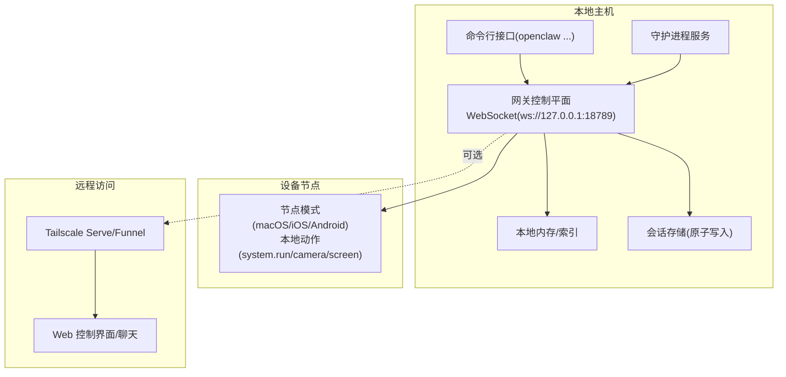
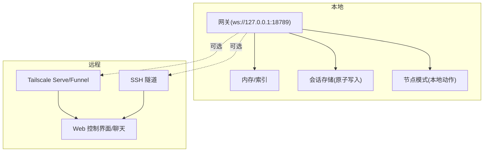
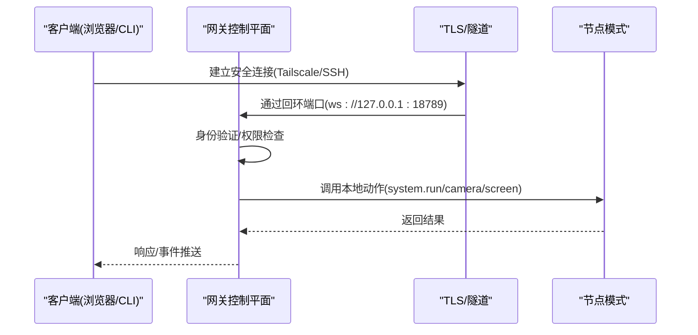
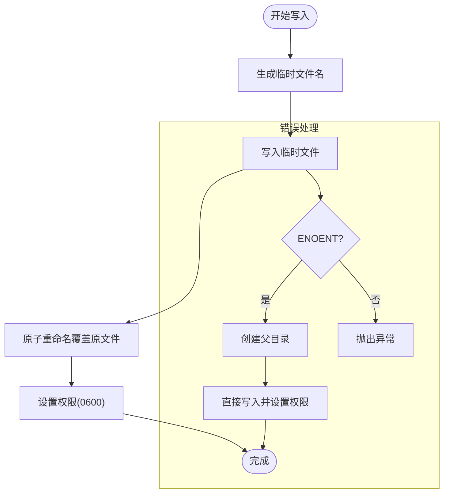
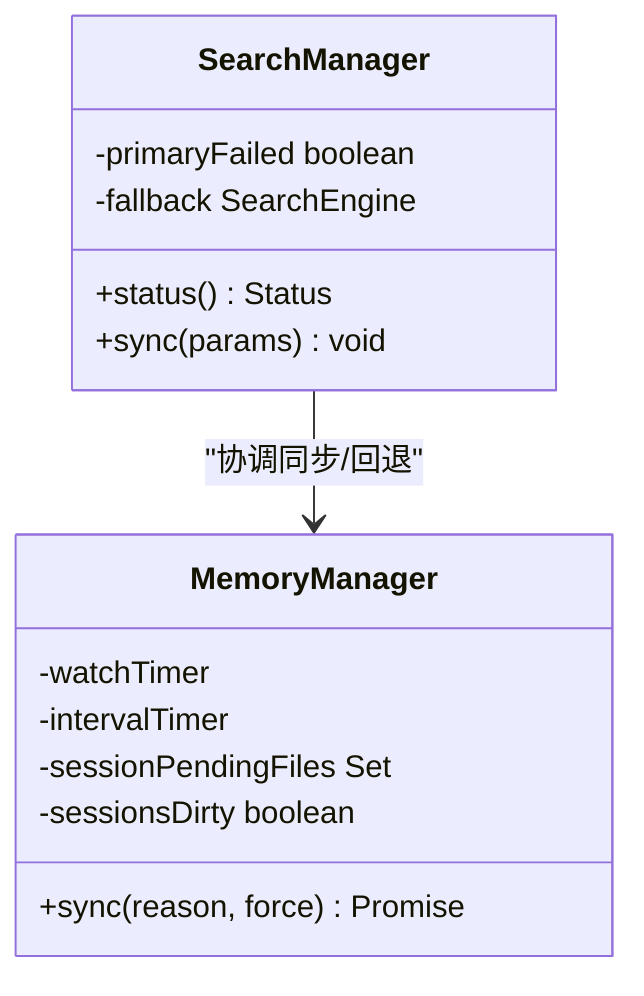
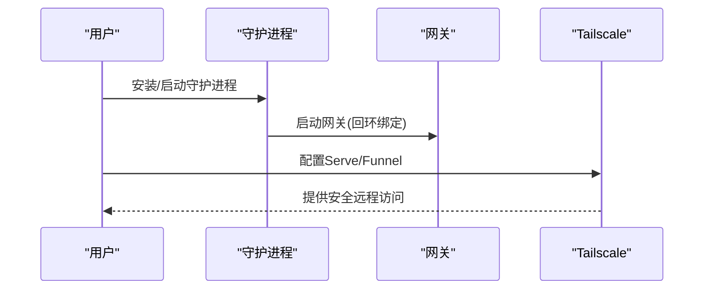
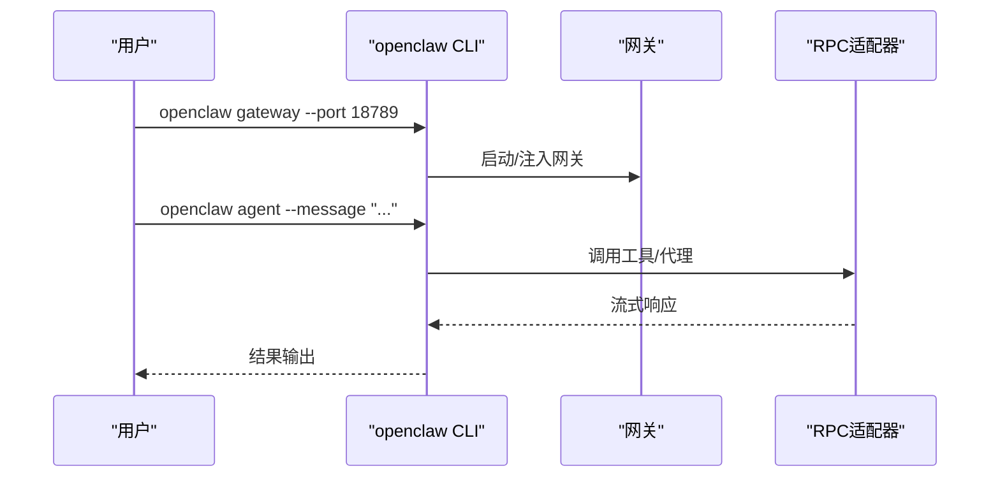
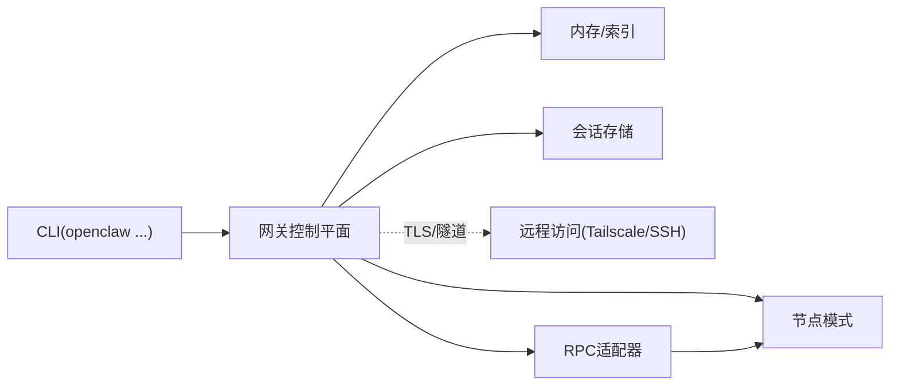

# 本地优先架构

<cite>
**本文档引用的文件**
- [README.md](file://README.md)
- [VISION.md](file://VISION.md)
- [src/config/config.ts](file://src/config/config.ts)
- [src/config/sessions/store.ts](file://src/config/sessions/store.ts)
- [src/memory/manager.ts](file://src/memory/manager.ts)
- [src/memory/manager-sync-ops.ts](file://src/memory/manager-sync-ops.ts)
- [src/memory/search-manager.ts](file://src/memory/search-manager.ts)
- [src/cli/gateway-cli.ts](file://src/cli/gateway-cli.ts)
- [src/cli/gateway-rpc.ts](file://src/cli/gateway-rpc.ts)
- [src/agents/tools/gateway.ts](file://src/agents/tools/gateway.ts)
- [src/infra/tls/gateway.ts](file://src/infra/tls/gateway.ts)
- [src/commands/gateway-presence.ts](file://src/commands/gateway-presence.ts)
- [src/commands/gateway-status.ts](file://src/commands/gateway-status.ts)
- [src/signal/daemon.ts](file://src/signal/daemon.ts)
- [src/commands/daemon-runtime.ts](file://src/commands/daemon-runtime.ts)
- [src/media/local-roots.ts](file://src/media/local-roots.ts)
- [scripts/dev/gateway-smoke.ts](file://scripts/dev/gateway-smoke.ts)
- [scripts/dev/gateway-ws-client.ts](file://scripts/dev/gateway-ws-client.ts)
- [dist/plugin-sdk/shared/gateway-bind-url.d.ts](file://dist/plugin-sdk/shared/gateway-bind-url.d.ts)
- [dist/plugin-sdk/infra/tls/gateway.d.ts](file://dist/plugin-sdk/infra/tls/gateway.d.ts)
- [dist/plugin-sdk/commands/daemon-runtime.d.ts](file://dist/plugin-sdk/commands/daemon-runtime.d.ts)
- [dist/plugin-sdk/media/local-roots.d.ts](file://dist/plugin-sdk/media/local-roots.d.ts)
</cite>

## 目录

1. [引言](#引言)
2. [项目结构](#项目结构)
3. [核心组件](#核心组件)
4. [架构总览](#架构总览)
5. [详细组件分析](#详细组件分析)
6. [依赖关系分析](#依赖关系分析)
7. [性能考量](#性能考量)
8. [故障排除指南](#故障排除指南)
9. [结论](#结论)
10. [附录](#附录)

## 引言

本文件面向OpenClaw的“本地优先”架构，系统性阐述其在本地运行的优势、数据主权与隐私保护机制、网关控制平面设计理念、本地存储策略、离线能力与数据同步机制、安全架构与访问控制、加密存储与网络安全防护、本地资源利用与性能优化、系统集成方案、本地部署指南、配置优化与故障排除，以及数据备份恢复、迁移策略与升级机制。

OpenClaw强调“在你的设备上运行、在你的通道中工作、按你的规则执行”，通过单一网关控制平面（WebSocket）统一管理会话、通道、工具与事件，同时提供远程暴露与本地优先的安全边界，确保用户对数据与计算路径的完全掌控。

## 项目结构

OpenClaw采用模块化与分层架构：核心运行时（Gateway、CLI、Daemon）、配置与会话存储、内存与搜索、通道适配器、UI与插件SDK等。本地优先体现在：

- 网关默认绑定回环地址，仅在明确启用时对外暴露（如Tailscale Serve/Funnel）
- 本地存储与会话持久化，支持增量同步与容错
- 工具与节点能力在本地主机或设备节点上执行，最小化外部传输
- 安全默认与可审计的权限模型

图表来源

- [README.md](file://README.md#L185-L238)
- [src/cli/gateway-cli.ts](file://src/cli/gateway-cli.ts)
- [src/infra/tls/gateway.ts](file://src/infra/tls/gateway.ts)

章节来源

- [README.md](file://README.md#L185-L238)

## 核心组件

- 网关控制平面：统一的WebSocket控制面，承载会话、通道、工具与事件；提供健康检查、存在性与状态查询。
- 配置与会话：集中式配置加载与校验，会话存储采用原子写入与权限保护，避免竞态与数据损坏。
- 内存与搜索：主存储与回退存储的双栈设计，支持增量同步与失败回退。
- 守护进程与远程：用户级守护进程与systemd/launchd集成，远程通过Tailscale或SSH隧道安全访问。
- 插件与SDK：通过插件SDK扩展能力，保持核心轻量与灵活性。

章节来源

- [src/config/config.ts](file://src/config/config.ts#L1-L25)
- [src/config/sessions/store.ts](file://src/config/sessions/store.ts#L774-L855)
- [src/memory/manager.ts](file://src/memory/manager.ts#L606-L640)
- [src/memory/manager-sync-ops.ts](file://src/memory/manager-sync-ops.ts#L429-L465)
- [src/memory/search-manager.ts](file://src/memory/search-manager.ts#L123-L163)
- [src/cli/gateway-cli.ts](file://src/cli/gateway-cli.ts)
- [src/cli/gateway-rpc.ts](file://src/cli/gateway-rpc.ts)
- [src/commands/gateway-status.ts](file://src/commands/gateway-status.ts)
- [src/commands/gateway-presence.ts](file://src/commands/gateway-presence.ts)
- [src/signal/daemon.ts](file://src/signal/daemon.ts)
- [src/commands/daemon-runtime.ts](file://src/commands/daemon-runtime.ts)

## 架构总览

OpenClaw的“本地优先”体现在：

- 默认绑定回环地址，仅在显式配置下对外暴露
- 远程访问通过Tailscale Serve/Funnel或SSH隧道，强制身份验证与密码策略
- 本地存储与会话持久化，支持增量同步与容错
- 工具与节点能力在本地主机或设备节点上执行，最小化外部传输
- 安全默认与可审计的权限模型，支持沙箱与权限提升的受控路径

图表来源

- [README.md](file://README.md#L213-L238)
- [src/infra/tls/gateway.ts](file://src/infra/tls/gateway.ts)
- [src/config/sessions/store.ts](file://src/config/sessions/store.ts#L774-L855)

## 详细组件分析

### 组件A：网关控制平面与远程暴露

- 设计理念：单一WebSocket控制面，承载会话、通道、工具与事件；提供健康检查、存在性与状态查询。
- 远程暴露：支持Tailscale Serve（内网）与Funnel（公网），默认要求回环绑定；可通过密码认证与尾线身份头增强安全。
- 安全边界：远程访问必须通过受控隧道，本地仍保持回环绑定，确保最小暴露面。

图表来源

- [README.md](file://README.md#L213-L238)
- [src/infra/tls/gateway.ts](file://src/infra/tls/gateway.ts)
- [src/agents/tools/gateway.ts](file://src/agents/tools/gateway.ts)

章节来源

- [README.md](file://README.md#L213-L238)
- [src/commands/gateway-status.ts](file://src/commands/gateway-status.ts)
- [src/commands/gateway-presence.ts](file://src/commands/gateway-presence.ts)

### 组件B：本地存储与会话持久化

- 存储策略：会话存储采用临时文件+重命名的原子写入，避免Windows平台的截断竞态；同时设置严格权限（0600）。
- 容错与一致性：保存失败时进行重试与回退，测试场景下自动重建目录并回退到直接写入。
- 数据主权：所有会话数据驻留在本地，不上传至云端，除非显式配置外部同步。

图表来源

- [src/config/sessions/store.ts](file://src/config/sessions/store.ts#L774-L855)

章节来源

- [src/config/sessions/store.ts](file://src/config/sessions/store.ts#L774-L855)

### 组件C：内存与搜索（本地优先的数据索引）

- 双栈设计：主存储与回退存储并存，主存储失败时自动切换回退存储，并记录回退原因。
- 增量同步：基于消息数与字节数阈值触发同步，减少频繁写入；支持进度回调与异步调度。
- 容错与可观测性：状态查询包含回退信息，便于诊断与降级。

图表来源

- [src/memory/search-manager.ts](file://src/memory/search-manager.ts#L123-L163)
- [src/memory/manager-sync-ops.ts](file://src/memory/manager-sync-ops.ts#L429-L465)
- [src/memory/manager.ts](file://src/memory/manager.ts#L606-L640)

章节来源

- [src/memory/search-manager.ts](file://src/memory/search-manager.ts#L123-L163)
- [src/memory/manager-sync-ops.ts](file://src/memory/manager-sync-ops.ts#L429-L465)
- [src/memory/manager.ts](file://src/memory/manager.ts#L606-L640)

### 组件D：守护进程与远程访问

- 守护进程：用户级守护进程与systemd/launchd集成，开机自启与自动重启；支持安装与运行时检测。
- 远程访问：通过Tailscale Serve/Funnel或SSH隧道，强制密码认证与尾线身份头；Funnel需要密码认证开启。
- 安全默认：默认回环绑定，防止意外外网暴露。

图表来源

- [README.md](file://README.md#L213-L238)
- [src/signal/daemon.ts](file://src/signal/daemon.ts)
- [src/commands/daemon-runtime.ts](file://src/commands/daemon-runtime.ts)

章节来源

- [README.md](file://README.md#L213-L238)
- [src/signal/daemon.ts](file://src/signal/daemon.ts)
- [src/commands/daemon-runtime.ts](file://src/commands/daemon-runtime.ts)

### 组件E：CLI与RPC（本地优先的控制面）

- CLI：提供onboard、gateway、agent、message等命令，支持守护进程安装与网关注入。
- RPC：网关RPC适配器，支持远程调用与工具流式传输，保证本地优先的执行路径。

图表来源

- [src/cli/gateway-cli.ts](file://src/cli/gateway-cli.ts)
- [src/cli/gateway-rpc.ts](file://src/cli/gateway-rpc.ts)
- [scripts/dev/gateway-smoke.ts](file://scripts/dev/gateway-smoke.ts)
- [scripts/dev/gateway-ws-client.ts](file://scripts/dev/gateway-ws-client.ts)

章节来源

- [src/cli/gateway-cli.ts](file://src/cli/gateway-cli.ts)
- [src/cli/gateway-rpc.ts](file://src/cli/gateway-rpc.ts)
- [scripts/dev/gateway-smoke.ts](file://scripts/dev/gateway-smoke.ts)
- [scripts/dev/gateway-ws-client.ts](file://scripts/dev/gateway-ws-client.ts)

### 组件F：本地资源利用与系统集成

- 本地动作：节点模式通过node.invoke执行本地动作（如system.run、通知、Canvas、摄像头、屏幕录制、位置获取），遵循macOS TCC权限。
- 本地存储根：媒体与本地根目录由本地根路径管理，确保数据驻留本地。
- 资源利用：本地执行降低网络延迟与带宽占用，适合离线场景与隐私敏感任务。

章节来源

- [README.md](file://README.md#L240-L253)
- [src/media/local-roots.ts](file://src/media/local-roots.ts)
- [dist/plugin-sdk/media/local-roots.d.ts](file://dist/plugin-sdk/media/local-roots.d.ts)

## 依赖关系分析

- 组件耦合：网关控制平面与内存/会话存储强耦合，与守护进程/远程隧道弱耦合；CLI与RPC适配器解耦。
- 外部依赖：Tailscale用于安全远程暴露；systemd/launchd用于守护进程；Node.js运行时与TypeScript生态。
- 接口契约：WebSocket协议、TLS/隧道接口、插件SDK接口。

图表来源

- [src/cli/gateway-cli.ts](file://src/cli/gateway-cli.ts)
- [src/infra/tls/gateway.ts](file://src/infra/tls/gateway.ts)
- [src/memory/manager.ts](file://src/memory/manager.ts#L606-L640)
- [src/config/sessions/store.ts](file://src/config/sessions/store.ts#L774-L855)

章节来源

- [src/cli/gateway-cli.ts](file://src/cli/gateway-cli.ts)
- [src/infra/tls/gateway.ts](file://src/infra/tls/gateway.ts)
- [src/memory/manager.ts](file://src/memory/manager.ts#L606-L640)
- [src/config/sessions/store.ts](file://src/config/sessions/store.ts#L774-L855)

## 性能考量

- 本地执行优先：工具与节点动作在本地主机或设备节点执行，减少网络往返与带宽占用。
- 增量同步：内存与会话同步基于阈值触发，降低频繁写入与I/O开销。
- 原子写入：会话存储采用原子重命名，避免截断竞态与数据损坏，提高可靠性。
- 缓存与监控：内存管理器维护索引缓存与定时器，支持关闭时清理与等待未决同步。

章节来源

- [src/memory/manager-sync-ops.ts](file://src/memory/manager-sync-ops.ts#L429-L465)
- [src/config/sessions/store.ts](file://src/config/sessions/store.ts#L774-L855)
- [src/memory/manager.ts](file://src/memory/manager.ts#L606-L640)

## 故障排除指南

- 远程访问问题：确认Tailscale Serve/Funnel配置与密码认证；确保网关注绑定回环；必要时重置Serve/Funnel。
- 会话存储异常：检查权限与磁盘空间；查看保存失败日志与回退策略；在测试环境允许直接写入回退。
- 内存/搜索异常：查看状态返回中的回退信息；确认主存储可用性；必要时切换到回退存储。
- 守护进程问题：检查systemd/launchd状态；确认安装与运行时检测；重新安装守护进程。

章节来源

- [README.md](file://README.md#L213-L238)
- [src/config/sessions/store.ts](file://src/config/sessions/store.ts#L774-L855)
- [src/memory/search-manager.ts](file://src/memory/search-manager.ts#L123-L163)
- [src/signal/daemon.ts](file://src/signal/daemon.ts)
- [src/commands/daemon-runtime.ts](file://src/commands/daemon-runtime.ts)

## 结论

OpenClaw的“本地优先”架构以网关控制平面为核心，结合回环绑定、远程安全暴露、本地存储与会话持久化、节点本地动作执行与双栈内存/搜索，构建了安全、可控、高性能且可扩展的个人AI助手体系。通过严格的默认安全策略与可审计的权限模型，用户能够在本地设备上获得快速、私密且可靠的服务体验。

## 附录

### 本地部署指南

- 安装与守护进程：使用包管理器安装后，运行向导安装守护进程，确保网关随系统启动。
- 启动网关：通过CLI启动网关并指定端口，建议默认回环绑定。
- 远程访问：根据需要启用Tailscale Serve/Funnel或SSH隧道，设置密码认证与尾线身份头。

章节来源

- [README.md](file://README.md#L50-L111)
- [README.md](file://README.md#L213-L238)

### 配置优化

- 安全默认：启用沙箱与权限提升的受控路径；合理配置通道与群组白名单。
- 存储优化：调整内存同步阈值与会话存储权限；确保磁盘空间充足。
- 远程暴露：仅在必要时启用远程访问，限制暴露范围与认证强度。

章节来源

- [README.md](file://README.md#L332-L338)
- [src/memory/manager-sync-ops.ts](file://src/memory/manager-sync-ops.ts#L429-L465)
- [src/config/sessions/store.ts](file://src/config/sessions/store.ts#L774-L855)

### 数据备份与恢复

- 备份：定期复制会话存储与本地根目录；确保权限与原子写入策略。
- 恢复：在新环境中重建目录结构，恢复会话与媒体文件；验证权限与同步状态。

章节来源

- [src/config/sessions/store.ts](file://src/config/sessions/store.ts#L774-L855)
- [src/media/local-roots.ts](file://src/media/local-roots.ts)

### 升级与迁移

- 升级：通过包管理器更新版本；运行健康检查与诊断工具。
- 迁移：遵循配置迁移流程；在升级前备份会话与配置；验证兼容性。

章节来源

- [README.md](file://README.md#L81-L90)
- [VISION.md](file://VISION.md#L41-L50)
