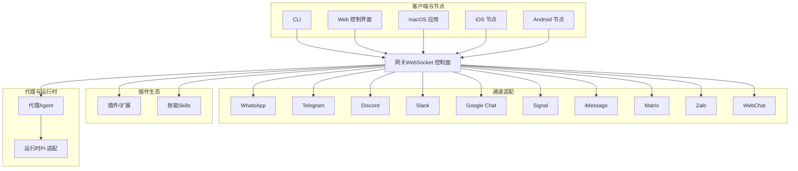
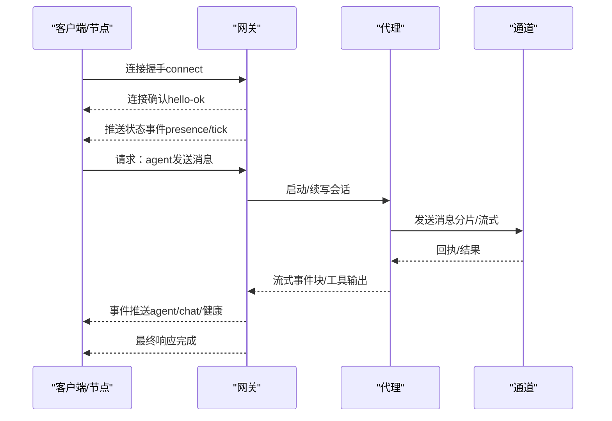
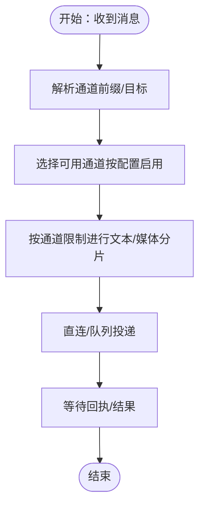
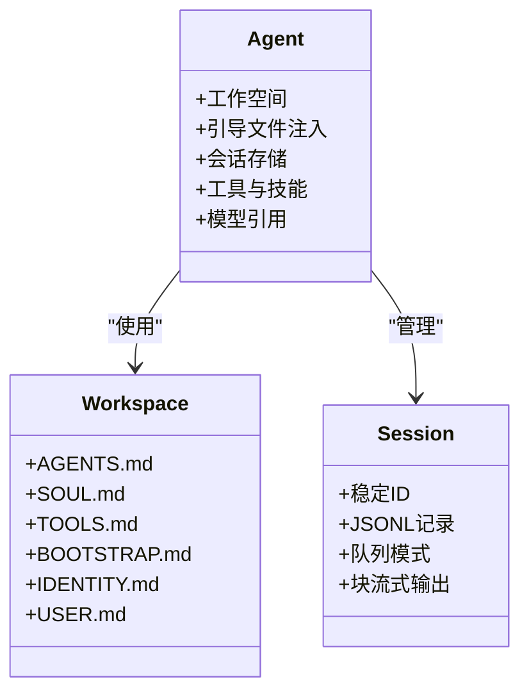
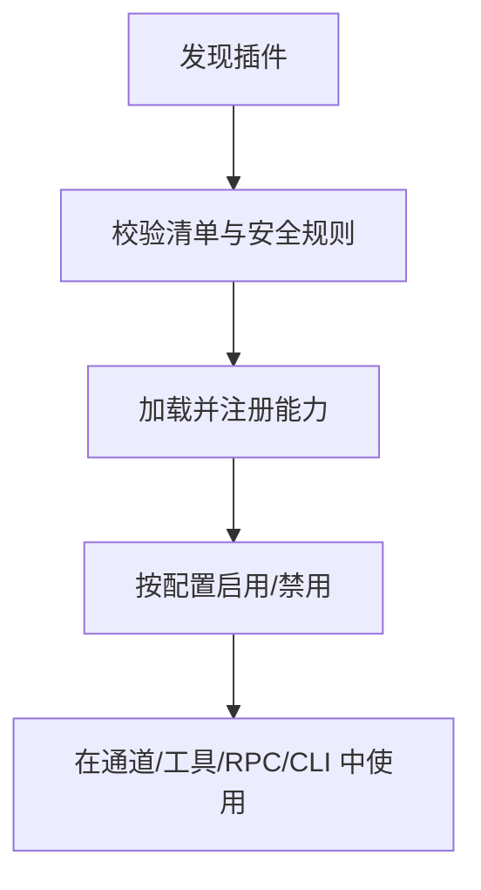
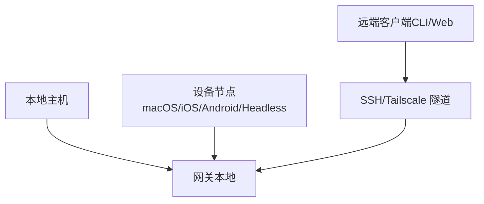
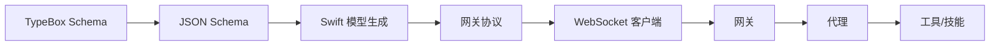
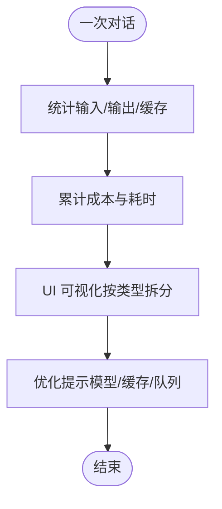

# 核心特性

<cite>
**本文引用的文件**
- [README.md](file://README.md)
- [VISION.md](file://VISION.md)
- [docs/index.md](file://docs/index.md)
- [docs/concepts/architecture.md](file://docs/concepts/architecture.md)
- [docs/concepts/agent.md](file://docs/concepts/agent.md)
- [docs/gateway/configuration.md](file://docs/gateway/configuration.md)
- [docs/tools/plugin.md](file://docs/tools/plugin.md)
- [src/config/types.channels.ts](file://src/config/types.channels.ts)
- [src/infra/outbound/channel-selection.ts](file://src/infra/outbound/channel-selection.ts)
- [src/gateway/protocol/schema/agents-models-skills.ts](file://src/gateway/protocol/schema/agents-models-skills.ts)
- [apps/macos/Sources/OpenClawProtocol/GatewayModels.swift](file://apps/macos/Sources/OpenClawProtocol/GatewayModels.swift)
- [apps/shared/OpenClawKit/Sources/OpenClawProtocol/GatewayModels.swift](file://apps/shared/OpenClawKit/Sources/OpenClawProtocol/GatewayModels.swift)
- [extensions/open-prose/skills/prose/examples/39-architect-by-simulation.prose](file://extensions/open-prose/skills/prose/examples/39-architect-by-simulation.prose)
- [extensions/open-prose/skills/prose/examples/35-feature-factory.prose](file://extensions/open-prose/skills/prose/examples/35-feature-factory.prose)
- [extensions/open-prose/skills/prose/examples/45-run-endpoint-ux-test-with-remediation.prose](file://extensions/open-prose/skills/prose/examples/45-run-endpoint-ux-test-with-remediation.prose)
- [extensions/diagnostics-otel/src/service.ts](file://extensions/diagnostics-otel/src/service.ts)
- [src/auto-reply/status.ts](file://src/auto-reply/status.ts)
- [ui/src/ui/views/usage-render-details.ts](file://ui/src/ui/views/usage-render-details.ts)
- [docs/gateway/security/index.md](file://docs/gateway/security/index.md)
- [docs/zh-CN/gateway/security/index.md](file://docs/zh-CN/gateway/security/index.md)
</cite>

## 目录

1. [引言](#引言)
2. [项目结构](#项目结构)
3. [核心组件](#核心组件)
4. [架构总览](#架构总览)
5. [详细组件分析](#详细组件分析)
6. [依赖关系分析](#依赖关系分析)
7. [性能考量](#性能考量)
8. [故障排查指南](#故障排查指南)
9. [结论](#结论)
10. [附录](#附录)

## 引言

本文件面向希望快速理解并落地使用 OpenClaw 的用户与工程师，系统性阐述其核心特性：多渠道消息传递（支持 20+ 即时通讯平台）、AI 代理能力、插件生态、本地优先架构，并说明这些能力如何协同构成“个人 AI 助手”的完整方案。文档同时强调隐私保护、性能优化与用户体验方面的设计取舍与最佳实践。

## 项目结构

OpenClaw 采用“单网关控制平面 + 多客户端/节点 + 插件扩展”的分层架构。核心由以下部分组成：

- 网关（Gateway）：统一的 WebSocket 控制面，负责会话、路由、通道连接、事件推送与安全策略。
- 客户端与节点：macOS 应用、CLI、Web 控制界面、iOS/Android 节点，均通过 WebSocket 连接网关。
- 通道（Channels）：对 WhatsApp、Telegram、Discord、Slack、Google Chat、Signal、iMessage、Matrix、Zalo、WebChat 等进行适配。
- 插件（Plugins）：扩展通道、工具、RPC 方法、CLI 命令、自动回复命令与技能。
- 代理（Agents）：基于嵌入式运行时的智能体，具备工作空间、会话、工具与技能体系。

图示来源

- [docs/concepts/architecture.md](file://docs/concepts/architecture.md#L12-L26)
- [docs/index.md](file://docs/index.md#L59-L70)

章节来源

- [README.md](file://README.md#L126-L136)
- [docs/index.md](file://docs/index.md#L59-L70)

## 核心组件

- 多通道消息传递：统一接入 WhatsApp、Telegram、Discord、Slack、Google Chat、Signal、iMessage、Matrix、Zalo、WebChat 等，支持群组路由、提及门控、媒体传输与分片投递。
- AI 代理与会话：嵌入式运行时、工作空间、引导文件注入、工具与技能体系、会话持久化与队列模式。
- 插件生态系统：通道插件、模型认证插件、RPC 方法、HTTP 处理器、CLI 命令、后台服务与自动回复命令。
- 本地优先架构：网关在本地运行，通道连接与设备动作在本地执行，远程通过隧道或 Tailnet 安全暴露。

章节来源

- [README.md](file://README.md#L126-L136)
- [docs/concepts/architecture.md](file://docs/concepts/architecture.md#L12-L26)
- [docs/concepts/agent.md](file://docs/concepts/agent.md#L10-L23)
- [docs/tools/plugin.md](file://docs/tools/plugin.md#L9-L74)

## 架构总览

OpenClaw 的核心是“单网关控制平面”，所有消息表面（通道）与客户端/节点均通过 WebSocket 连接网关。网关负责：

- 维护通道连接与消息路由
- 提供类型化的请求/响应与事件推送
- 执行安全策略（配对、鉴权、工具策略）
- 暴露 RPC 方法与 HTTP 接口（如 Canvas 主机）

图示来源

- [docs/concepts/architecture.md](file://docs/concepts/architecture.md#L59-L78)

章节来源

- [docs/concepts/architecture.md](file://docs/concepts/architecture.md#L12-L26)
- [docs/concepts/architecture.md](file://docs/concepts/architecture.md#L80-L92)

## 详细组件分析

### 多渠道消息传递（支持 20+ 即时通讯平台）

- 通道注册与配置：通过扩展通道配置类型，统一在 `channels.<id>` 下管理各通道的凭据、允许列表、默认投递目标与 DM 策略。
- 通道发现与启用：运行时扫描配置路径、工作区扩展、全局扩展与内置扩展，按优先级加载并校验安全性。
- 投递选择与分片：根据通道能力选择直连/队列模式，按文本长度与媒体大小进行分片，保障跨平台兼容性。
- 群组路由与提及门控：支持按通道/账号维度的群组策略、提及模式与自定义文本匹配，避免误触发。

图示来源

- [src/config/types.channels.ts](file://src/config/types.channels.ts#L44-L60)
- [src/infra/outbound/channel-selection.ts](file://src/infra/outbound/channel-selection.ts#L1-L47)

章节来源

- [src/config/types.channels.ts](file://src/config/types.channels.ts#L44-L60)
- [src/infra/outbound/channel-selection.ts](file://src/infra/outbound/channel-selection.ts#L1-L47)
- [docs/gateway/configuration.md](file://docs/gateway/configuration.md#L74-L105)

使用案例

- 在 Telegram 上设置 DM 策略为“配对”，仅允许已批准发件人；在 WhatsApp 上启用群组提及门控，要求消息中包含特定关键词才触发响应。
- 通过通道插件注册新的企业聊天平台，按需提供 onboarding 钩子与安全策略。

实际效果

- 降低多平台维护成本：统一的通道适配层与配置模型，减少重复开发。
- 提升安全性：默认“配对” DM 策略与允许列表，避免未授权访问。

### AI 代理功能（工作空间、会话、工具与技能）

- 工作空间与引导文件：首次会话注入 AGENTS、SOUL、TOOLS、BOOTSTRAP、IDENTITY、USER 等文件内容，帮助代理建立一致的人设与边界。
- 会话管理：会话 ID 稳定，历史记录以 JSONL 存储；支持队列模式（steer/followup/collect）与块流式输出。
- 工具与技能：核心系统工具始终可用，技能来自内置、托管与工作区三处，可按配置门控启用。
- 模型引用与别名：支持 provider/model 格式与别名映射，便于切换与展示。

图示来源

- [docs/concepts/agent.md](file://docs/concepts/agent.md#L12-L42)
- [docs/concepts/agent.md](file://docs/concepts/agent.md#L73-L104)

章节来源

- [docs/concepts/agent.md](file://docs/concepts/agent.md#L10-L23)
- [docs/concepts/agent.md](file://docs/concepts/agent.md#L49-L65)
- [docs/concepts/agent.md](file://docs/concepts/agent.md#L106-L121)

使用案例

- 通过工作区注入“身份”与“边界”，使代理在不同通道中保持一致的语气与行为。
- 使用技能模板（如 Architect By Simulation）进行系统设计与规范生成，提升研发效率。

实际效果

- 会话连续性与隔离：按通道/账号/会话粒度管理上下文，避免信息泄露。
- 输出可控：块流式与队列模式减少长文本噪声，提升阅读体验。

### 插件生态系统（通道、工具、RPC、CLI、自动回复）

- 插件发现与安全：按配置路径、工作区扩展、全局扩展、内置扩展顺序扫描，拒绝可疑路径与非信任来源。
- 插件能力：注册 Gateway RPC 方法、HTTP 处理器、Agent 工具、CLI 命令、后台服务与自动回复命令；可提供技能与通道元数据。
- 通道插件：以“像内置通道一样”的方式注册新聊天表面，支持 onboarding、安全策略与状态检查。
- 分发与命名：推荐独立 npm 包，入口文件通过 openclaw.extensions 指定；命名遵循约定，避免与核心冲突。

图示来源

- [docs/tools/plugin.md](file://docs/tools/plugin.md#L93-L134)
- [docs/tools/plugin.md](file://docs/tools/plugin.md#L411-L454)

章节来源

- [docs/tools/plugin.md](file://docs/tools/plugin.md#L9-L74)
- [docs/tools/plugin.md](file://docs/tools/plugin.md#L204-L248)
- [docs/tools/plugin.md](file://docs/tools/plugin.md#L411-L454)

使用案例

- 安装官方语音通话插件，通过 CLI 与 RPC 启动电话会议；在通道中注册新的企业聊天平台，提供一键 onboarding。
- 开发自动回复命令，处理状态查询与快速开关，无需调用 LLM。

实际效果

- 能力扩展灵活：通过插件而非硬编码，降低核心复杂度。
- 安全可控：严格的发现与安全规则，防止不受信代码进入运行时。

### 本地优先架构（网关、通道、节点）

- 网关在本地运行，通道连接与设备动作在本地执行，远程通过 SSH 隧道或 Tailnet 安全暴露。
- 设备节点通过 WebSocket 连接网关，声明角色与能力，执行本地命令、相机/屏幕录制、通知等。
- 本地信任与配对：设备首次连接需要配对审批，后续使用设备令牌；本地连接可自动批准以改善同主机体验。

图示来源

- [docs/concepts/architecture.md](file://docs/concepts/architecture.md#L17-L26)
- [docs/concepts/architecture.md](file://docs/concepts/architecture.md#L117-L128)

章节来源

- [docs/concepts/architecture.md](file://docs/concepts/architecture.md#L93-L110)
- [docs/concepts/architecture.md](file://docs/concepts/architecture.md#L117-L128)

使用案例

- 在 Linux 服务器上运行网关，通过 Tailscale Serve/Funnel 安全暴露仪表板与 WebSocket；本地 macOS 节点用于执行需要屏幕录制的自动化任务。

实际效果

- 数据与控制权留在本地：通道连接与设备操作在本地执行，降低云端风险。
- 远程访问安全：隧道与令牌鉴权，避免直接暴露到公网。

## 依赖关系分析

- 协议与类型：网关协议通过 TypeBox Schema 定义，Swift 模型由 JSON Schema 生成，确保跨语言一致性。
- 客户端与网关：客户端通过 WebSocket 连接网关，请求方法与事件类型受 Schema 严格约束。
- 代理与工具：代理工具通过运行时 API 注册，工具策略与沙箱配置影响执行范围。

图示来源

- [docs/concepts/architecture.md](file://docs/concepts/architecture.md#L111-L116)
- [src/gateway/protocol/schema/agents-models-skills.ts](file://src/gateway/protocol/schema/agents-models-skills.ts#L1-L45)
- [apps/macos/Sources/OpenClawProtocol/GatewayModels.swift](file://apps/macos/Sources/OpenClawProtocol/GatewayModels.swift#L2121-L2183)
- [apps/shared/OpenClawKit/Sources/OpenClawProtocol/GatewayModels.swift](file://apps/shared/OpenClawKit/Sources/OpenClawProtocol/GatewayModels.swift#L2121-L2183)

章节来源

- [src/gateway/protocol/schema/agents-models-skills.ts](file://src/gateway/protocol/schema/agents-models-skills.ts#L1-L45)
- [apps/macos/Sources/OpenClawProtocol/GatewayModels.swift](file://apps/macos/Sources/OpenClawProtocol/GatewayModels.swift#L2121-L2183)
- [apps/shared/OpenClawKit/Sources/OpenClawProtocol/GatewayModels.swift](file://apps/shared/OpenClawKit/Sources/OpenClawProtocol/GatewayModels.swift#L2121-L2183)

## 性能考量

- 令牌与缓存统计：通过扩展收集输入/输出/缓存命中率与耗时直方图，辅助优化与计费。
- 会话与工具输出可视化：UI 支持按类型拆分柱状图，直观展示 token 使用与缓存命中情况。
- 会话与队列：队列模式（steer/followup/collect）影响并发与响应节奏，合理配置可减少长轮询与重复计算。

图示来源

- [extensions/diagnostics-otel/src/service.ts](file://extensions/diagnostics-otel/src/service.ts#L382-L419)
- [src/auto-reply/status.ts](file://src/auto-reply/status.ts#L306-L343)
- [ui/src/ui/views/usage-render-details.ts](file://ui/src/ui/views/usage-render-details.ts#L431-L579)

章节来源

- [extensions/diagnostics-otel/src/service.ts](file://extensions/diagnostics-otel/src/service.ts#L382-L419)
- [src/auto-reply/status.ts](file://src/auto-reply/status.ts#L306-L343)
- [ui/src/ui/views/usage-render-details.ts](file://ui/src/ui/views/usage-render-details.ts#L431-L579)

## 故障排查指南

- 安全与密钥：配置文件与凭据位于用户状态目录，注意权限与加密；日志与会话记录可能包含敏感信息，建议脱敏与定期清理。
- 配置校验：OpenClaw 严格校验配置，未知键或非法值会导致启动失败；可通过诊断命令定位问题并修复。
- 远程暴露：通过 SSH 隧道或 Tailscale 安全暴露网关；注意鉴权与令牌设置，避免公网直接暴露。

章节来源

- [docs/gateway/security/index.md](file://docs/gateway/security/index.md#L760-L784)
- [docs/zh-CN/gateway/security/index.md](file://docs/zh-CN/gateway/security/index.md#L447-L476)
- [docs/gateway/configuration.md](file://docs/gateway/configuration.md#L61-L73)
- [docs/concepts/architecture.md](file://docs/concepts/architecture.md#L117-L128)

## 结论

OpenClaw 将“本地优先、多通道、可扩展、安全可控”的理念贯穿于架构与实现：以单一网关控制平面统一对接 20+ 即时通讯平台，结合嵌入式代理运行时、可插拔的工具与技能体系，以及严格的本地安全策略，构建出既强大又易用的个人 AI 助手解决方案。通过合理的配置与插件扩展，用户可在隐私与性能之间取得平衡，并获得一致、可靠的跨平台体验。

## 附录

- 使用案例参考
  - 架构模拟与规范生成：通过技能模板（如 Architect By Simulation）进行系统设计与规范产出。
  - 端到端 UX 测试与修复：使用技能模板进行端点 UX 测试与根因分析，持续改进交互体验。
  - 功能工厂与任务分解：将设计转化为可执行的任务清单，指导实现阶段的有序推进。

章节来源

- [extensions/open-prose/skills/prose/examples/39-architect-by-simulation.prose](file://extensions/open-prose/skills/prose/examples/39-architect-by-simulation.prose#L1-L150)
- [extensions/open-prose/skills/prose/examples/35-feature-factory.prose](file://extensions/open-prose/skills/prose/examples/35-feature-factory.prose#L104-L155)
- [extensions/open-prose/skills/prose/examples/45-run-endpoint-ux-test-with-remediation.prose](file://extensions/open-prose/skills/prose/examples/45-run-endpoint-ux-test-with-remediation.prose#L71-L114)
