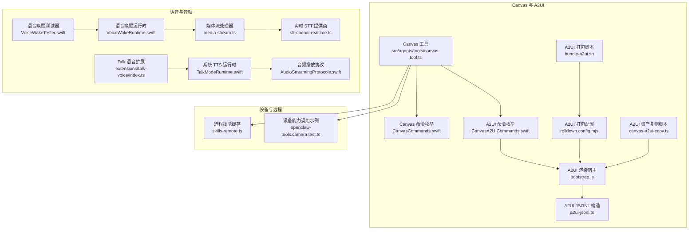
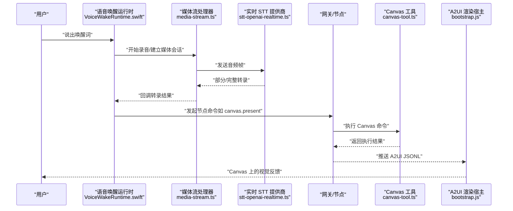
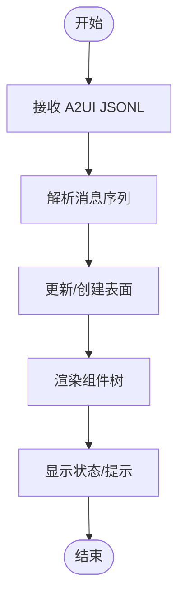
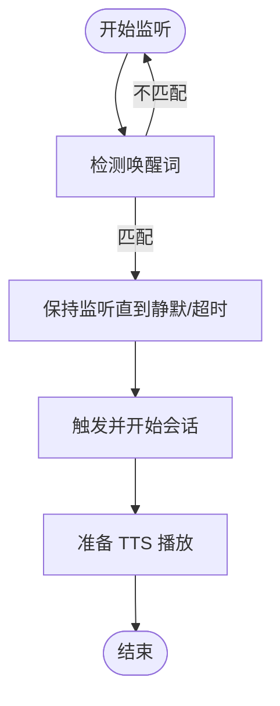
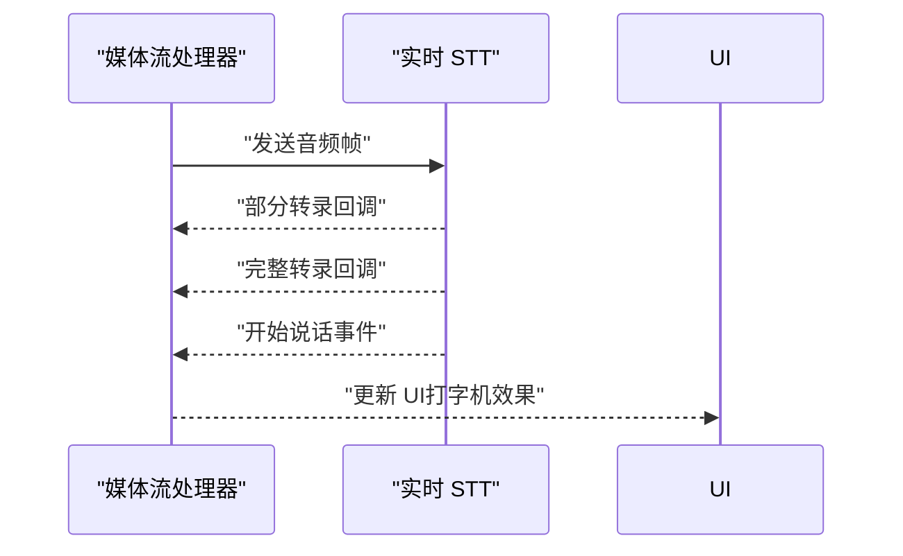
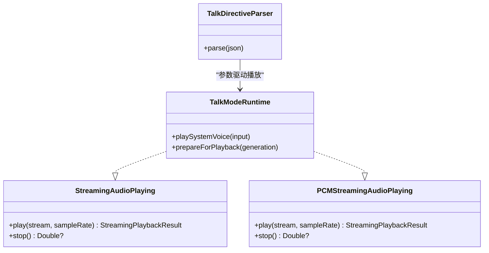
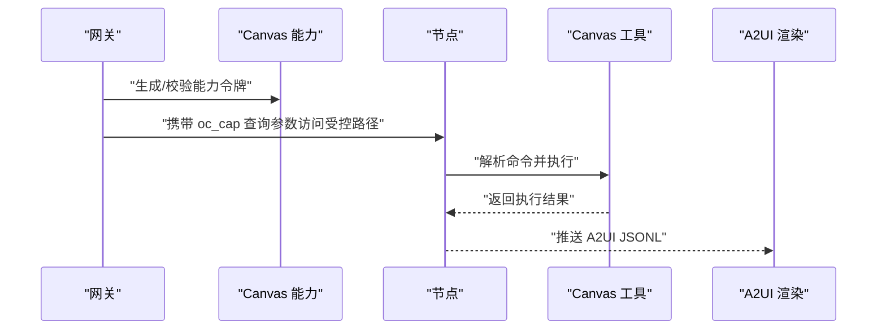
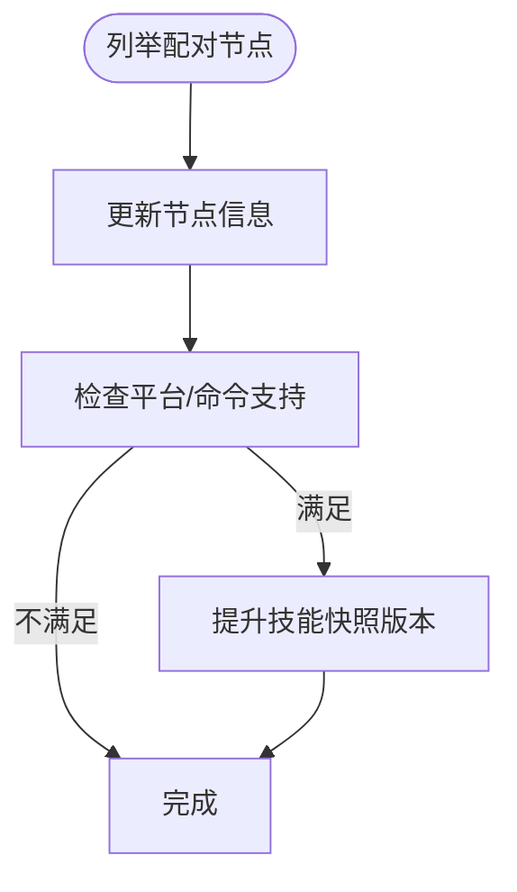
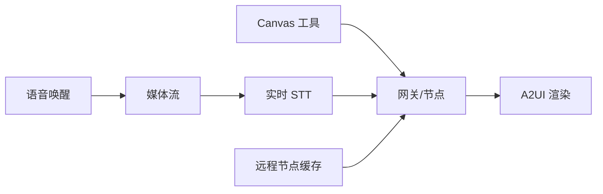

# 语音画布功能

<cite>
**本文引用的文件**
- [src/agents/tools/canvas-tool.ts](file://src/agents/tools/canvas-tool.ts)
- [src/gateway/canvas-capability.ts](file://src/gateway/canvas-capability.ts)
- [apps/shared/OpenClawKit/Sources/OpenClawKit/CanvasCommands.swift](file://apps/shared/OpenClawKit/Sources/OpenClawKit/CanvasCommands.swift)
- [apps/shared/OpenClawKit/Sources/OpenClawKit/CanvasA2UICommands.swift](file://apps/shared/OpenClawKit/Sources/OpenClawKit/CanvasA2UICommands.swift)
- [apps/shared/OpenClawKit/Tools/CanvasA2UI/bootstrap.js](file://apps/shared/OpenClawKit/Tools/CanvasA2UI/bootstrap.js)
- [apps/shared/OpenClawKit/Tools/CanvasA2UI/rolldown.config.mjs](file://apps/shared/OpenClawKit/Tools/CanvasA2UI/rolldown.config.mjs)
- [scripts/canvas-a2ui-copy.ts](file://scripts/canvas-a2ui-copy.ts)
- [scripts/bundle-a2ui.sh](file://scripts/bundle-a2ui.sh)
- [src/cli/nodes-cli/a2ui-jsonl.ts](file://src/cli/nodes-cli/a2ui-jsonl.ts)
- [extensions/voice-call/src/media-stream.ts](file://extensions/voice-call/src/media-stream.ts)
- [extensions/voice-call/src/providers/stt-openai-realtime.ts](file://extensions/voice-call/src/providers/stt-openai-realtime.ts)
- [apps/macos/Sources/OpenClaw/VoiceWakeRuntime.swift](file://apps/macos/Sources/OpenClaw/VoiceWakeRuntime.swift)
- [apps/macos/Sources/OpenClaw/VoiceWakeTester.swift](file://apps/macos/Sources/OpenClaw/VoiceWakeTester.swift)
- [apps/macos/Sources/OpenClaw/TalkModeRuntime.swift](file://apps/macos/Sources/OpenClaw/TalkModeRuntime.swift)
- [apps/android/app/src/main/java/ai/openclaw/android/voice/TalkDirectiveParser.kt](file://apps/android/app/src/main/java/ai/openclaw/android/voice/TalkDirectiveParser.kt)
- [apps/shared/OpenClawKit/Sources/OpenClawKit/AudioStreamingProtocols.swift](file://apps/shared/OpenClawKit/Sources/OpenClawKit/AudioStreamingProtocols.swift)
- [extensions/talk-voice/index.ts](file://extensions/talk-voice/index.ts)
- [src/infra/skills-remote.ts](file://src/infra/skills-remote.ts)
- [src/agents/openclaw-tools.camera.test.ts](file://src/agents/openclaw-tools.camera.test.ts)
</cite>

## 目录

1. [简介](#简介)
2. [项目结构](#项目结构)
3. [核心组件](#核心组件)
4. [架构总览](#架构总览)
5. [组件详解](#组件详解)
6. [依赖关系分析](#依赖关系分析)
7. [性能考量](#性能考量)
8. [故障排查指南](#故障排查指南)
9. [结论](#结论)
10. [附录](#附录)

## 简介

本文件系统化阐述 OpenClaw 的“语音画布”能力：以 Canvas 可视化工作空间为核心，结合 A2UI 渲染引擎、跨平台语音交互（唤醒词检测、实时转写、TTS 播放）、以及设备节点与远程控制能力，构建持续对话与实时交互体验。内容覆盖语音识别处理、音频流管理、视觉反馈机制、多媒体内容理解、设备节点功能、远程控制策略、语音配置指南、Canvas 开发教程与性能优化建议，并讨论多模态交互设计、无障碍支持与用户体验优化。

## 项目结构

围绕“语音画布”的关键目录与文件分布如下：

- Canvas 工具与命令
  - 代理工具：src/agents/tools/canvas-tool.ts
  - 网关能力：src/gateway/canvas-capability.ts
  - 平台命令定义：apps/shared/OpenClawKit/Sources/OpenClawKit/CanvasCommands.swift、CanvasA2UICommands.swift
- A2UI 渲染与打包
  - 渲染宿主：apps/shared/OpenClawKit/Tools/CanvasA2UI/bootstrap.js
  - 打包配置：apps/shared/OpenClawKit/Tools/CanvasA2UI/rolldown.config.mjs
  - 资产复制脚本：scripts/canvas-a2ui-copy.ts、scripts/bundle-a2ui.sh
  - JSONL 构造：src/cli/nodes-cli/a2ui-jsonl.ts
- 语音与音频
  - 媒体流与队列：extensions/voice-call/src/media-stream.ts
  - 实时 STT：extensions/voice-call/src/providers/stt-openai-realtime.ts
  - 语音唤醒（macOS）：apps/macos/Sources/OpenClaw/VoiceWakeRuntime.swift、VoiceWakeTester.swift
  - 系统 TTS（macOS）：apps/macos/Sources/OpenClaw/TalkModeRuntime.swift
  - Android TTS 指令解析：apps/android/app/src/main/java/…/TalkDirectiveParser.kt
  - 音频协议抽象：apps/shared/OpenClawKit/Sources/OpenClawKit/AudioStreamingProtocols.swift
  - Talk 语音扩展：extensions/talk-voice/index.ts
- 设备节点与远程控制
  - 远程节点缓存与注册：src/infra/skills-remote.ts
  - 设备能力调用示例：src/agents/openclaw-tools.camera.test.ts

**图表来源**

- [src/agents/tools/canvas-tool.ts](file://src/agents/tools/canvas-tool.ts#L1-L216)
- [apps/shared/OpenClawKit/Sources/OpenClawKit/CanvasCommands.swift](file://apps/shared/OpenClawKit/Sources/OpenClawKit/CanvasCommands.swift#L1-L10)
- [apps/shared/OpenClawKit/Sources/OpenClawKit/CanvasA2UICommands.swift](file://apps/shared/OpenClawKit/Sources/OpenClawKit/CanvasA2UICommands.swift#L1-L27)
- [apps/shared/OpenClawKit/Tools/CanvasA2UI/bootstrap.js](file://apps/shared/OpenClawKit/Tools/CanvasA2UI/bootstrap.js#L498-L549)
- [apps/shared/OpenClawKit/Tools/CanvasA2UI/rolldown.config.mjs](file://apps/shared/OpenClawKit/Tools/CanvasA2UI/rolldown.config.mjs#L1-L39)
- [scripts/canvas-a2ui-copy.ts](file://scripts/canvas-a2ui-copy.ts#L1-L40)
- [scripts/bundle-a2ui.sh](file://scripts/bundle-a2ui.sh#L1-L42)
- [src/cli/nodes-cli/a2ui-jsonl.ts](file://src/cli/nodes-cli/a2ui-jsonl.ts#L1-L43)
- [extensions/voice-call/src/media-stream.ts](file://extensions/voice-call/src/media-stream.ts#L18-L396)
- [extensions/voice-call/src/providers/stt-openai-realtime.ts](file://extensions/voice-call/src/providers/stt-openai-realtime.ts#L215-L260)
- [apps/macos/Sources/OpenClaw/VoiceWakeRuntime.swift](file://apps/macos/Sources/OpenClaw/VoiceWakeRuntime.swift#L512-L577)
- [apps/macos/Sources/OpenClaw/VoiceWakeTester.swift](file://apps/macos/Sources/OpenClaw/VoiceWakeTester.swift#L217-L402)
- [apps/macos/Sources/OpenClaw/TalkModeRuntime.swift](file://apps/macos/Sources/OpenClaw/TalkModeRuntime.swift#L653-L678)
- [apps/shared/OpenClawKit/Sources/OpenClawKit/AudioStreamingProtocols.swift](file://apps/shared/OpenClawKit/Sources/OpenClawKit/AudioStreamingProtocols.swift#L1-L16)
- [extensions/talk-voice/index.ts](file://extensions/talk-voice/index.ts#L76-L112)
- [src/infra/skills-remote.ts](file://src/infra/skills-remote.ts#L126-L173)
- [src/agents/openclaw-tools.camera.test.ts](file://src/agents/openclaw-tools.camera.test.ts#L280-L350)

**章节来源**

- [src/agents/tools/canvas-tool.ts](file://src/agents/tools/canvas-tool.ts#L1-L216)
- [apps/shared/OpenClawKit/Sources/OpenClawKit/CanvasCommands.swift](file://apps/shared/OpenClawKit/Sources/OpenClawKit/CanvasCommands.swift#L1-L10)
- [apps/shared/OpenClawKit/Sources/OpenClawKit/CanvasA2UICommands.swift](file://apps/shared/OpenClawKit/Sources/OpenClawKit/CanvasA2UICommands.swift#L1-L27)
- [apps/shared/OpenClawKit/Tools/CanvasA2UI/bootstrap.js](file://apps/shared/OpenClawKit/Tools/CanvasA2UI/bootstrap.js#L498-L549)
- [apps/shared/OpenClawKit/Tools/CanvasA2UI/rolldown.config.mjs](file://apps/shared/OpenClawKit/Tools/CanvasA2UI/rolldown.config.mjs#L1-L39)
- [scripts/canvas-a2ui-copy.ts](file://scripts/canvas-a2ui-copy.ts#L1-L40)
- [scripts/bundle-a2ui.sh](file://scripts/bundle-a2ui.sh#L1-L42)
- [src/cli/nodes-cli/a2ui-jsonl.ts](file://src/cli/nodes-cli/a2ui-jsonl.ts#L1-L43)
- [extensions/voice-call/src/media-stream.ts](file://extensions/voice-call/src/media-stream.ts#L18-L396)
- [extensions/voice-call/src/providers/stt-openai-realtime.ts](file://extensions/voice-call/src/providers/stt-openai-realtime.ts#L215-L260)
- [apps/macos/Sources/OpenClaw/VoiceWakeRuntime.swift](file://apps/macos/Sources/OpenClaw/VoiceWakeRuntime.swift#L512-L577)
- [apps/macos/Sources/OpenClaw/VoiceWakeTester.swift](file://apps/macos/Sources/OpenClaw/VoiceWakeTester.swift#L217-L402)
- [apps/macos/Sources/OpenClaw/TalkModeRuntime.swift](file://apps/macos/Sources/OpenClaw/TalkModeRuntime.swift#L653-L678)
- [apps/shared/OpenClawKit/Sources/OpenClawKit/AudioStreamingProtocols.swift](file://apps/shared/OpenClawKit/Sources/OpenClawKit/AudioStreamingProtocols.swift#L1-L16)
- [extensions/talk-voice/index.ts](file://extensions/talk-voice/index.ts#L76-L112)
- [src/infra/skills-remote.ts](file://src/infra/skills-remote.ts#L126-L173)
- [src/agents/openclaw-tools.camera.test.ts](file://src/agents/openclaw-tools.camera.test.ts#L280-L350)

## 核心组件

- Canvas 工具与命令
  - 通过代理工具封装对节点 Canvas 的操作：呈现、隐藏、导航、JavaScript 评估、快照、A2UI 推送与重置。
  - 支持从路径读取 JSONL 内容并推送至 A2UI 渲染。
- A2UI 渲染引擎
  - 以自定义元素承载渲染状态，支持表面（surface）管理、动作队列与状态提示。
  - 通过打包脚本与配置生成可分发的前端资源。
- 语音与音频
  - 实时媒体流处理、STT 事件回调、TTS 播放与中断、语音唤醒检测与触发。
- 设备节点与远程控制
  - 远程节点信息缓存与注册，支持系统级命令与设备能力调用。

**章节来源**

- [src/agents/tools/canvas-tool.ts](file://src/agents/tools/canvas-tool.ts#L18-L216)
- [apps/shared/OpenClawKit/Sources/OpenClawKit/CanvasA2UICommands.swift](file://apps/shared/OpenClawKit/Sources/OpenClawKit/CanvasA2UICommands.swift#L1-L27)
- [apps/shared/OpenClawKit/Tools/CanvasA2UI/bootstrap.js](file://apps/shared/OpenClawKit/Tools/CanvasA2UI/bootstrap.js#L498-L549)
- [extensions/voice-call/src/media-stream.ts](file://extensions/voice-call/src/media-stream.ts#L18-L396)
- [extensions/voice-call/src/providers/stt-openai-realtime.ts](file://extensions/voice-call/src/providers/stt-openai-realtime.ts#L215-L260)
- [apps/macos/Sources/OpenClaw/VoiceWakeRuntime.swift](file://apps/macos/Sources/OpenClaw/VoiceWakeRuntime.swift#L512-L577)
- [apps/macos/Sources/OpenClaw/TalkModeRuntime.swift](file://apps/macos/Sources/OpenClaw/TalkModeRuntime.swift#L653-L678)
- [src/infra/skills-remote.ts](file://src/infra/skills-remote.ts#L126-L173)

## 架构总览

下图展示从“语音输入”到“Canvas 视觉反馈”的端到端流程，包括唤醒词检测、实时转写、TTS 播放与 A2UI 渲染。

**图表来源**

- [apps/macos/Sources/OpenClaw/VoiceWakeRuntime.swift](file://apps/macos/Sources/OpenClaw/VoiceWakeRuntime.swift#L512-L577)
- [extensions/voice-call/src/media-stream.ts](file://extensions/voice-call/src/media-stream.ts#L18-L396)
- [extensions/voice-call/src/providers/stt-openai-realtime.ts](file://extensions/voice-call/src/providers/stt-openai-realtime.ts#L215-L260)
- [src/agents/tools/canvas-tool.ts](file://src/agents/tools/canvas-tool.ts#L80-L216)
- [apps/shared/OpenClawKit/Tools/CanvasA2UI/bootstrap.js](file://apps/shared/OpenClawKit/Tools/CanvasA2UI/bootstrap.js#L498-L549)

## 组件详解

### Canvas 可视化工作空间与 A2UI 渲染

- Canvas 工具
  - 支持 present/hide/navigate/eval/snapshot/a2ui_push/a2ui_reset 等动作。
  - 对 snapshot 输出进行安全限制与 MIME 类型推断，便于后续展示或上传。
- A2UI 渲染宿主
  - 维护 surfaces 列表与 pendingAction 状态，提供空态提示、加载状态与 toast 错误提示。
  - 将 JSONL 消息序列转换为组件树并开始渲染。
- 打包与分发
  - 通过 rolldown.config.mjs 解析依赖并输出 a2ui.bundle.js。
  - 使用 canvas-a2ui-copy.ts 与 bundle-a2ui.sh 在构建阶段复制/生成前端资产。

**图表来源**

- [apps/shared/OpenClawKit/Tools/CanvasA2UI/bootstrap.js](file://apps/shared/OpenClawKit/Tools/CanvasA2UI/bootstrap.js#L498-L549)
- [src/cli/nodes-cli/a2ui-jsonl.ts](file://src/cli/nodes-cli/a2ui-jsonl.ts#L1-L43)

**章节来源**

- [src/agents/tools/canvas-tool.ts](file://src/agents/tools/canvas-tool.ts#L18-L216)
- [apps/shared/OpenClawKit/Tools/CanvasA2UI/bootstrap.js](file://apps/shared/OpenClawKit/Tools/CanvasA2UI/bootstrap.js#L498-L549)
- [apps/shared/OpenClawKit/Tools/CanvasA2UI/rolldown.config.mjs](file://apps/shared/OpenClawKit/Tools/CanvasA2UI/rolldown.config.mjs#L1-L39)
- [scripts/canvas-a2ui-copy.ts](file://scripts/canvas-a2ui-copy.ts#L1-L40)
- [scripts/bundle-a2ui.sh](file://scripts/bundle-a2ui.sh#L1-L42)
- [src/cli/nodes-cli/a2ui-jsonl.ts](file://src/cli/nodes-cli/a2ui-jsonl.ts#L1-L43)

### 语音唤醒技术

- macOS 语音唤醒运行时
  - 文本仅触发逻辑、静默回退检测、冷却时间与触发音效。
  - 与系统 TTS 协作，在播放前准备并中断旧播放。
- 测试器
  - 支持最终化状态、错误处理与静默窗口等待，确保稳定触发。

**图表来源**

- [apps/macos/Sources/OpenClaw/VoiceWakeRuntime.swift](file://apps/macos/Sources/OpenClaw/VoiceWakeRuntime.swift#L512-L577)
- [apps/macos/Sources/OpenClaw/VoiceWakeTester.swift](file://apps/macos/Sources/OpenClaw/VoiceWakeTester.swift#L217-L402)

**章节来源**

- [apps/macos/Sources/OpenClaw/VoiceWakeRuntime.swift](file://apps/macos/Sources/OpenClaw/VoiceWakeRuntime.swift#L512-L577)
- [apps/macos/Sources/OpenClaw/VoiceWakeTester.swift](file://apps/macos/Sources/OpenClaw/VoiceWakeTester.swift#L217-L402)

### 实时语音识别与音频流管理

- 媒体流处理器
  - 支持预连接超时、并发连接上限、IP 限流、连接总数限制。
  - 提供 onTranscript/onPartialTranscript/onSpeechStart 回调，用于 UI 实时反馈。
  - 提供 sendAudio/sendMark/clearAudio 与队列化 TTS 播放，避免音频重叠。
- 实时 STT 提供商
  - 处理会话事件，输出部分/完整转录与“开始说话”事件。

**图表来源**

- [extensions/voice-call/src/media-stream.ts](file://extensions/voice-call/src/media-stream.ts#L18-L396)
- [extensions/voice-call/src/providers/stt-openai-realtime.ts](file://extensions/voice-call/src/providers/stt-openai-realtime.ts#L215-L260)

**章节来源**

- [extensions/voice-call/src/media-stream.ts](file://extensions/voice-call/src/media-stream.ts#L18-L396)
- [extensions/voice-call/src/providers/stt-openai-realtime.ts](file://extensions/voice-call/src/providers/stt-openai-realtime.ts#L215-L260)

### TTS 播放与跨平台适配

- macOS 系统 TTS
  - 在播放前准备、中断旧播放、更新 UI 阶段，支持语言参数与日志记录。
- Android TTS 指令解析
  - 解析 voice/model/speed/rate/stability/similarity/style/speakerBoost 等参数，映射到播放指令。
- 音频协议抽象
  - 定义 StreamingAudioPlaying/PCMStreamingAudioPlaying 协议，统一播放接口。

**图表来源**

- [apps/macos/Sources/OpenClaw/TalkModeRuntime.swift](file://apps/macos/Sources/OpenClaw/TalkModeRuntime.swift#L653-L678)
- [apps/android/app/src/main/java/.../TalkDirectiveParser.kt](file://apps/android/app/src/main/java/ai/openclaw/android/voice/TalkDirectiveParser.kt#L47-L68)
- [apps/shared/OpenClawKit/Sources/OpenClawKit/AudioStreamingProtocols.swift](file://apps/shared/OpenClawKit/Sources/OpenClawKit/AudioStreamingProtocols.swift#L1-L16)

**章节来源**

- [apps/macos/Sources/OpenClaw/TalkModeRuntime.swift](file://apps/macos/Sources/OpenClaw/TalkModeRuntime.swift#L653-L678)
- [apps/android/app/src/main/java/.../TalkDirectiveParser.kt](file://apps/android/app/src/main/java/ai/openclaw/android/voice/TalkDirectiveParser.kt#L47-L68)
- [apps/shared/OpenClawKit/Sources/OpenClawKit/AudioStreamingProtocols.swift](file://apps/shared/OpenClawKit/Sources/OpenClawKit/AudioStreamingProtocols.swift#L1-L16)

### Canvas 命令与能力

- Canvas 命令
  - present/hide/navigate/eval/snapshot：面向节点 Canvas 的基础操作。
- A2UI 命令
  - push/pushJSONL/reset：向 Canvas 推送 JSONL 消息序列并渲染。
- 能力令牌与作用域 URL
  - 生成能力令牌、构建带能力前缀的主机 URL、规范化作用域 URL，保障访问安全。

**图表来源**

- [src/gateway/canvas-capability.ts](file://src/gateway/canvas-capability.ts#L20-L87)
- [src/agents/tools/canvas-tool.ts](file://src/agents/tools/canvas-tool.ts#L80-L216)
- [apps/shared/OpenClawKit/Sources/OpenClawKit/CanvasA2UICommands.swift](file://apps/shared/OpenClawKit/Sources/OpenClawKit/CanvasA2UICommands.swift#L1-L27)

**章节来源**

- [src/gateway/canvas-capability.ts](file://src/gateway/canvas-capability.ts#L1-L88)
- [apps/shared/OpenClawKit/Sources/OpenClawKit/CanvasCommands.swift](file://apps/shared/OpenClawKit/Sources/OpenClawKit/CanvasCommands.swift#L1-L10)
- [apps/shared/OpenClawKit/Sources/OpenClawKit/CanvasA2UICommands.swift](file://apps/shared/OpenClawKit/Sources/OpenClawKit/CanvasA2UICommands.swift#L1-L27)
- [src/agents/tools/canvas-tool.ts](file://src/agents/tools/canvas-tool.ts#L18-L216)

### 设备节点功能与远程控制

- 远程技能缓存
  - 列举已配对节点，更新节点信息与二进制列表，按需提升技能快照版本。
- 设备能力调用
  - 示例：调用 device.permissions/device.health 并返回负载，验证节点命令可用性。

**图表来源**

- [src/infra/skills-remote.ts](file://src/infra/skills-remote.ts#L130-L173)
- [src/agents/openclaw-tools.camera.test.ts](file://src/agents/openclaw-tools.camera.test.ts#L280-L350)

**章节来源**

- [src/infra/skills-remote.ts](file://src/infra/skills-remote.ts#L126-L173)
- [src/agents/openclaw-tools.camera.test.ts](file://src/agents/openclaw-tools.camera.test.ts#L280-L350)

## 依赖关系分析

- Canvas 工具依赖网关命令与节点能力；A2UI 渲染依赖 JSONL 消息序列与打包产物。
- 语音唤醒与媒体流处理解耦于 Canvas，但通过网关命令串联到 Canvas 渲染。
- 远程节点信息为 Canvas 命令提供目标节点选择与能力判断依据。

**图表来源**

- [src/agents/tools/canvas-tool.ts](file://src/agents/tools/canvas-tool.ts#L80-L216)
- [apps/shared/OpenClawKit/Tools/CanvasA2UI/bootstrap.js](file://apps/shared/OpenClawKit/Tools/CanvasA2UI/bootstrap.js#L498-L549)
- [extensions/voice-call/src/media-stream.ts](file://extensions/voice-call/src/media-stream.ts#L18-L396)
- [extensions/voice-call/src/providers/stt-openai-realtime.ts](file://extensions/voice-call/src/providers/stt-openai-realtime.ts#L215-L260)
- [src/infra/skills-remote.ts](file://src/infra/skills-remote.ts#L126-L173)

**章节来源**

- [src/agents/tools/canvas-tool.ts](file://src/agents/tools/canvas-tool.ts#L80-L216)
- [apps/shared/OpenClawKit/Tools/CanvasA2UI/bootstrap.js](file://apps/shared/OpenClawKit/Tools/CanvasA2UI/bootstrap.js#L498-L549)
- [extensions/voice-call/src/media-stream.ts](file://extensions/voice-call/src/media-stream.ts#L18-L396)
- [extensions/voice-call/src/providers/stt-openai-realtime.ts](file://extensions/voice-call/src/providers/stt-openai-realtime.ts#L215-L260)
- [src/infra/skills-remote.ts](file://src/infra/skills-remote.ts#L126-L173)

## 性能考量

- 媒体流与 STT
  - 合理设置预连接超时与并发上限，避免资源耗尽。
  - 使用部分转录回调实现低延迟 UI 更新，减少用户等待感。
- A2UI 渲染
  - 控制 JSONL 消息大小与数量，避免一次性推送过多数据导致卡顿。
  - 使用队列化 TTS 播放，防止音频重叠造成失真。
- 语音唤醒
  - 合理配置静默窗口与冷却时间，降低误触发概率。
- 远程节点
  - 预热远程技能缓存，减少首次调用延迟。

[本节为通用指导，无需列出具体文件来源]

## 故障排查指南

- A2UI 资产缺失
  - 若缺少 a2ui.bundle.js 或 index.html，构建脚本会报错；请先执行打包再复制资产。
- 语音唤醒无响应
  - 检查唤醒词配置、静默回退逻辑与冷却时间设置。
  - 确认系统 TTS 权限与播放中断逻辑正常。
- 媒体流异常
  - 关注 onConnect/onDisconnect/onSpeechStart 回调是否触发，确认 STT 事件类型正确。
- Canvas 命令失败
  - 校验节点可达性与命令权限；检查能力令牌与作用域 URL 是否正确。

**章节来源**

- [scripts/canvas-a2ui-copy.ts](file://scripts/canvas-a2ui-copy.ts#L13-L28)
- [scripts/bundle-a2ui.sh](file://scripts/bundle-a2ui.sh#L16-L25)
- [apps/macos/Sources/OpenClaw/VoiceWakeRuntime.swift](file://apps/macos/Sources/OpenClaw/VoiceWakeRuntime.swift#L512-L577)
- [extensions/voice-call/src/media-stream.ts](file://extensions/voice-call/src/media-stream.ts#L18-L44)
- [extensions/voice-call/src/providers/stt-openai-realtime.ts](file://extensions/voice-call/src/providers/stt-openai-realtime.ts#L215-L260)
- [src/agents/tools/canvas-tool.ts](file://src/agents/tools/canvas-tool.ts#L80-L216)

## 结论

OpenClaw 的“语音画布”通过清晰的模块划分与跨平台实现，将语音唤醒、实时转写、TTS 播放与 Canvas/A2UI 渲染有机整合，形成自然、连续且可视化的交互体验。依托能力令牌与远程节点能力，系统在安全性与可扩展性上具备良好基础。建议在实际部署中关注媒体流与渲染的性能边界，完善语音配置与无障碍支持，持续优化用户体验。

[本节为总结性内容，无需列出具体文件来源]

## 附录

### 语音配置指南

- macOS 系统 TTS
  - 确保系统语音可用并允许应用访问；必要时在系统偏好设置中启用。
- ElevenLabs Talk（iOS）
  - 在网关配置 talk.apiKey 与 talk.voiceId；使用 voice/status/list 命令检查状态与可用声音列表。
- Android TTS
  - 通过 Talk 指令解析器设置 voice/model/speed/rate/stability/similarity/style/speakerBoost 等参数。

**章节来源**

- [extensions/talk-voice/index.ts](file://extensions/talk-voice/index.ts#L76-L112)
- [apps/macos/Sources/OpenClaw/TalkModeRuntime.swift](file://apps/macos/Sources/OpenClaw/TalkModeRuntime.swift#L653-L678)
- [apps/android/app/src/main/java/.../TalkDirectiveParser.kt](file://apps/android/app/src/main/java/ai/openclaw/android/voice/TalkDirectiveParser.kt#L47-L68)

### Canvas 开发教程

- 准备 A2UI 资产
  - 执行打包脚本生成 a2ui.bundle.js，并使用复制脚本将资源复制到分发目录。
- 构建 JSONL
  - 使用 a2ui-jsonl 工具构造包含 surfaceUpdate 与 beginRendering 的消息序列。
- 推送与渲染
  - 通过 Canvas 工具调用 canvas.a2ui.pushJSONL，将 JSONL 推送到设备 Canvas，由 A2UI 渲染宿主负责展示。

**章节来源**

- [scripts/bundle-a2ui.sh](file://scripts/bundle-a2ui.sh#L1-L42)
- [scripts/canvas-a2ui-copy.ts](file://scripts/canvas-a2ui-copy.ts#L1-L40)
- [src/cli/nodes-cli/a2ui-jsonl.ts](file://src/cli/nodes-cli/a2ui-jsonl.ts#L1-L43)
- [src/agents/tools/canvas-tool.ts](file://src/agents/tools/canvas-tool.ts#L194-L209)
- [apps/shared/OpenClawKit/Tools/CanvasA2UI/bootstrap.js](file://apps/shared/OpenClawKit/Tools/CanvasA2UI/bootstrap.js#L498-L549)

### 多模态交互设计与无障碍支持

- 多模态
  - 语音与视觉反馈互补：语音唤醒与转写提供入口，Canvas/A2UI 提供即时可视化确认。
- 无障碍
  - 确保 Canvas 内容具备语义结构与可读性；为 TTS 提供语言与速率选项；在 UI 中提供明确的状态提示与错误反馈。

[本节为通用指导，无需列出具体文件来源]
