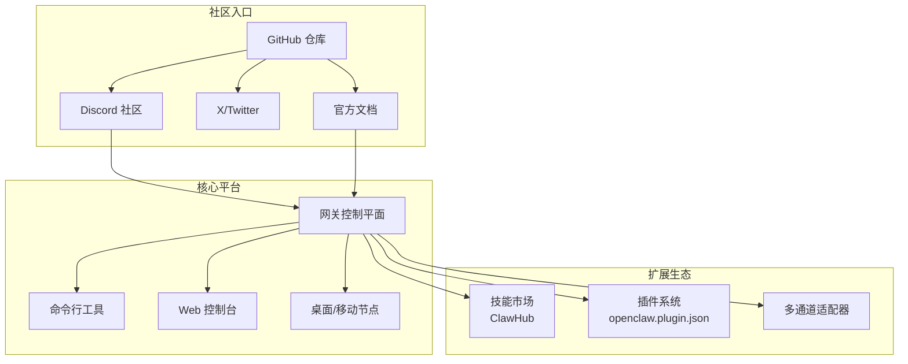
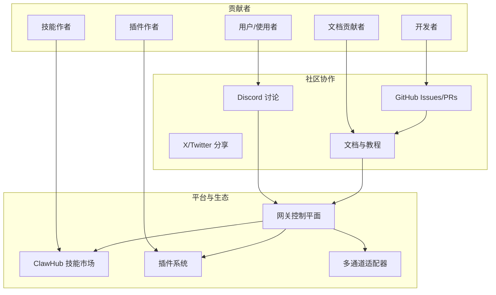
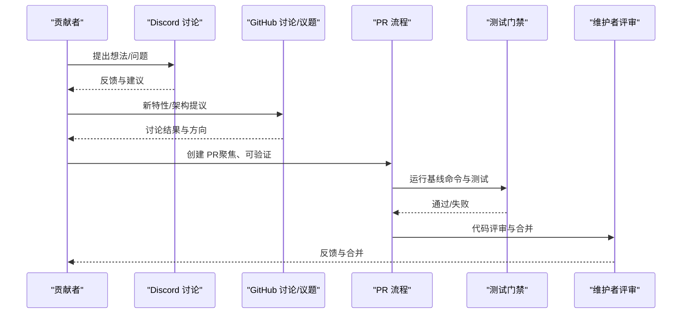
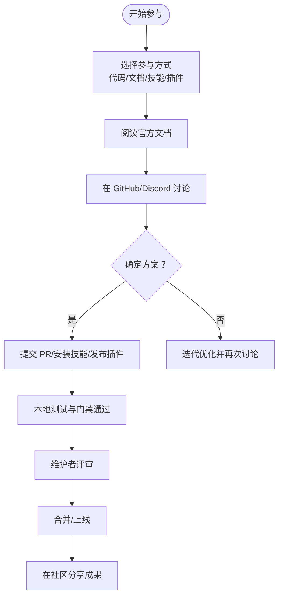
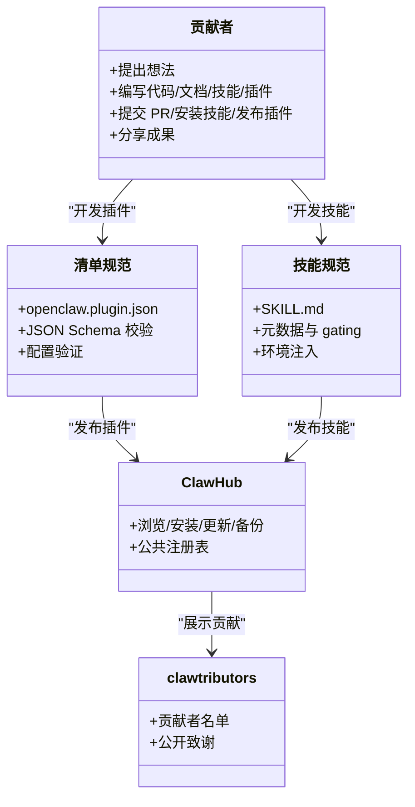
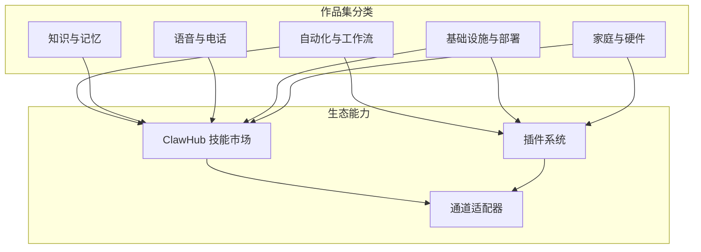
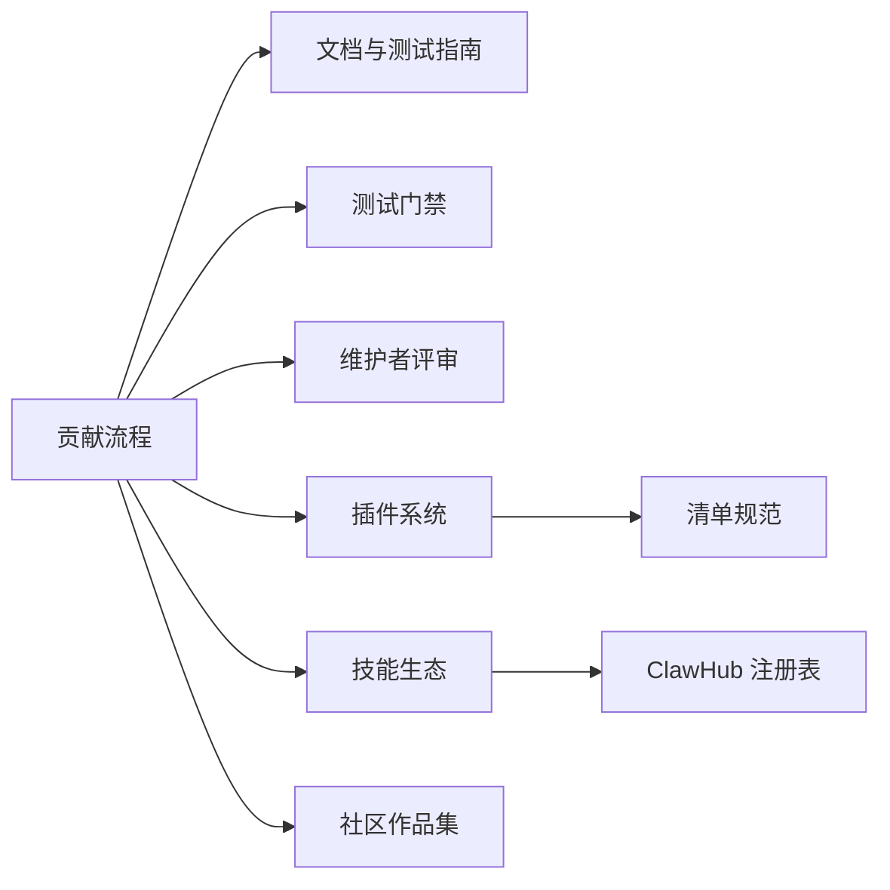
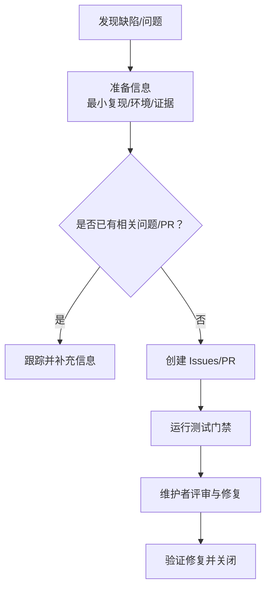

# 社区生态

<cite>
**本文引用的文件**
- [README.md](file://README.md)
- [CONTRIBUTING.md](file://CONTRIBUTING.md)
- [SECURITY.md](file://SECURITY.md)
- [docs/help/submitting-a-pr.md](file://docs/help/submitting-a-pr.md)
- [docs/help/submitting-an-issue.md](file://docs/help/submitting-an-issue.md)
- [docs/help/testing.md](file://docs/help/testing.md)
- [docs/start/showcase.md](file://docs/start/showcase.md)
- [docs/tools/skills.md](file://docs/tools/skills.md)
- [docs/plugins/manifest.md](file://docs/plugins/manifest.md)
- [docs/tools/plugin.md](file://docs/tools/plugin.md)
- [scripts/clawtributors-map.json](file://scripts/clawtributors-map.json)
</cite>

## 目录

1. [引言](#引言)
2. [项目结构](#项目结构)
3. [核心组件](#核心组件)
4. [架构总览](#架构总览)
5. [详细组件分析](#详细组件分析)
6. [依赖关系分析](#依赖关系分析)
7. [性能考量](#性能考量)
8. [故障排查指南](#故障排查指南)
9. [结论](#结论)
10. [附录](#附录)

## 引言

本章节面向希望参与 OpenClaw 社区建设与发展的所有用户，系统性介绍社区生态：包括社区规模与贡献者构成、治理结构与协作流程、资源与沟通渠道、贡献方式与认可机制，以及社区成果（插件生态、技能市场、第三方集成）等。我们鼓励不同背景的用户以代码、文档、技能与插件等形式参与，共同推动项目演进。

## 项目结构

OpenClaw 是一个围绕“个人 AI 助手”的开源项目，采用多语言混合架构（TypeScript/JavaScript、Swift 等），通过统一的网关控制平面连接多通道消息平台与设备节点，并提供 CLI、Web 控制台、桌面应用与移动端节点。社区生态围绕以下方面展开：

- 贡献与协作：GitHub、Discord、X/Twitter、文档与测试指南
- 技能与插件：ClawHub 技能市场、插件注册表与清单规范
- 安全与信任：漏洞报告流程、安全扫描与运行时要求
- 成果与展示：社区作品集、自动化与工作流案例、基础设施与硬件集成

图示来源

- [README.md](file://README.md#L1-L550)
- [docs/tools/skills.md](file://docs/tools/skills.md#L1-L301)
- [docs/tools/plugin.md](file://docs/tools/plugin.md#L1-L665)

章节来源

- [README.md](file://README.md#L1-L550)

## 核心组件

- 治理与维护团队：项目由核心维护者领导，涵盖多个子系统与平台的负责人，负责功能方向、安全与运营。
- 贡献流程：从问题报告到 PR 提交，再到测试与评审，形成闭环；支持 AI 协助生成的 PR 并要求透明标注。
- 安全与漏洞管理：明确漏洞上报渠道、所需信息与处理流程，强调私密披露与可复现性。
- 生态系统：技能与插件双轨扩展，ClawHub 作为公共技能注册表，插件清单规范确保配置验证与安全加载。
- 社区成果：社区作品集展示真实应用案例，涵盖自动化、知识记忆、语音通话、基础设施与硬件集成等。

章节来源

- [CONTRIBUTING.md](file://CONTRIBUTING.md#L1-L112)
- [SECURITY.md](file://SECURITY.md#L1-L100)
- [docs/tools/skills.md](file://docs/tools/skills.md#L1-L301)
- [docs/plugins/manifest.md](file://docs/plugins/manifest.md#L1-L72)
- [docs/start/showcase.md](file://docs/start/showcase.md#L1-L417)

## 架构总览

下图展示了社区生态与核心平台之间的交互关系：贡献者通过 GitHub 与 Discord 参与协作，使用文档进行学习与排障；平台通过网关连接多通道与节点，同时承载技能与插件生态；ClawHub 作为技能分发中心，插件通过清单规范在安装后进行严格配置校验。

图示来源

- [README.md](file://README.md#L1-L550)
- [docs/tools/skills.md](file://docs/tools/skills.md#L1-L301)
- [docs/tools/plugin.md](file://docs/tools/plugin.md#L1-L665)

## 详细组件分析

### 贡献者与治理

- 维护者角色：项目设有“ benevolent dictator ”式领导，同时在各子系统（如 Discord/Slack 子系统、内存与形式化建模、JS 基础设施、多智能体与 CLI、Web UI、DevOps 与 CI 等）有专门负责人，便于跨领域协作与决策。
- 贡献模式：小问题直接开 PR；新特性或架构变更需先发起讨论或在 Discord 中沟通；提问优先在 Discord 的 #setup-help 频道。
- PR 规范：强调聚焦、可验证、证据链（日志/截图/录制）、测试覆盖与基线命令执行；支持 AI 协作 PR，但需透明标注与充分测试。
- 测试门禁：本地构建、类型检查、单元测试与覆盖率、端到端测试与实时测试（按需）是合并前的必要步骤。
- 安全与漏洞：明确漏洞上报路径与所需信息清单，强调可复现性与影响评估；无预算的赏金计划，更鼓励高质量 PR 修复。

图示来源

- [CONTRIBUTING.md](file://CONTRIBUTING.md#L34-L86)
- [docs/help/submitting-a-pr.md](file://docs/help/submitting-a-pr.md#L1-L399)
- [docs/help/testing.md](file://docs/help/testing.md#L1-L369)

章节来源

- [CONTRIBUTING.md](file://CONTRIBUTING.md#L1-L112)
- [docs/help/submitting-a-pr.md](file://docs/help/submitting-a-pr.md#L1-L399)
- [docs/help/testing.md](file://docs/help/testing.md#L1-L369)

### 社区资源与沟通渠道

- 官方文档：提供架构、配置、平台、工具与安全等全面参考，适合深入学习与排障。
- GitHub：Issues/PRs 用于问题与功能请求；讨论区用于新特性与架构探讨。
- Discord：日常交流、帮助与分享；#setup-help 用于新手引导。
- X/Twitter：关注官方账号获取动态与公告。
- ClawHub：公共技能注册表，支持浏览、安装、更新与备份技能。

图示来源

- [README.md](file://README.md#L1-L550)
- [CONTRIBUTING.md](file://CONTRIBUTING.md#L1-L112)

章节来源

- [README.md](file://README.md#L1-L550)
- [CONTRIBUTING.md](file://CONTRIBUTING.md#L1-L112)

### 贡献方式与认可机制

- 代码贡献：遵循 PR 规范与测试门禁；AI 协作 PR 需标注与自证理解。
- 文档改进：格式化、链接审计与文档一致性检查；新增页面后运行文档列表校验。
- 插件开发：编写 openclaw.plugin.json 清单并通过 JSON Schema 校验；插件在安装后进行严格配置验证。
- 技能开发：遵循 AgentSkills 规范，提供 SKILL.md 与元数据；通过 gating 规则与环境注入实现安全可控。
- 技能市场：ClawHub 作为公共注册表，支持安装、同步与备份；社区作品集展示真实应用案例。
- 认可机制：README 展示 clawtributors 名单，体现社区贡献者的公开致谢与认可。

图示来源

- [docs/plugins/manifest.md](file://docs/plugins/manifest.md#L1-L72)
- [docs/tools/plugin.md](file://docs/tools/plugin.md#L1-L665)
- [docs/tools/skills.md](file://docs/tools/skills.md#L1-L301)
- [README.md](file://README.md#L497-L520)
- [scripts/clawtributors-map.json](file://scripts/clawtributors-map.json#L1-L41)

章节来源

- [docs/plugins/manifest.md](file://docs/plugins/manifest.md#L1-L72)
- [docs/tools/plugin.md](file://docs/tools/plugin.md#L1-L665)
- [docs/tools/skills.md](file://docs/tools/skills.md#L1-L301)
- [README.md](file://README.md#L497-L520)
- [scripts/clawtributors-map.json](file://scripts/clawtributors-map.json#L1-L41)

### 社区成果与展示

- 社区作品集：涵盖自动化与工作流、知识与记忆、语音与电话、基础设施与部署、家庭与硬件等多个类别，展示真实世界中的应用案例。
- 技能与插件生态：ClawHub 提供技能安装与同步能力；插件通过清单规范实现安全加载与配置校验。
- 第三方集成：社区贡献的 Home Assistant 插件、Nix 打包、CalDAV 日历技能等，体现生态的多样性与可扩展性。

图示来源

- [docs/start/showcase.md](file://docs/start/showcase.md#L1-L417)
- [docs/tools/skills.md](file://docs/tools/skills.md#L1-L301)
- [docs/tools/plugin.md](file://docs/tools/plugin.md#L1-L665)

章节来源

- [docs/start/showcase.md](file://docs/start/showcase.md#L1-L417)

## 依赖关系分析

- 贡献流程依赖文档与测试指南，确保 PR 质量与可维护性。
- 插件与技能生态依赖清单规范与公共注册表，保障安装与配置的安全性与一致性。
- 社区成果依赖贡献者的持续投入与分享，形成正向循环。

图示来源

- [docs/help/submitting-a-pr.md](file://docs/help/submitting-a-pr.md#L1-L399)
- [docs/help/testing.md](file://docs/help/testing.md#L1-L369)
- [docs/plugins/manifest.md](file://docs/plugins/manifest.md#L1-L72)
- [docs/tools/skills.md](file://docs/tools/skills.md#L1-L301)
- [docs/start/showcase.md](file://docs/start/showcase.md#L1-L417)

章节来源

- [docs/help/submitting-a-pr.md](file://docs/help/submitting-a-pr.md#L1-L399)
- [docs/help/testing.md](file://docs/help/testing.md#L1-L369)
- [docs/plugins/manifest.md](file://docs/plugins/manifest.md#L1-L72)
- [docs/tools/skills.md](file://docs/tools/skills.md#L1-L301)
- [docs/start/showcase.md](file://docs/start/showcase.md#L1-L417)

## 性能考量

- 测试策略：通过单元、端到端与实时测试分层验证，减少回归风险；实时测试按需缩小范围，降低成本与波动性。
- 技能提示词开销：技能列表注入到系统提示词中会产生固定字符开销，应关注技能数量与字段长度对 token 的影响。
- 插件与技能的加载与热更新：技能快照在会话内复用，变更在新会话生效；远程节点场景下的能力探测与热重载需注意网络与权限。

章节来源

- [docs/help/testing.md](file://docs/help/testing.md#L1-L369)
- [docs/tools/skills.md](file://docs/tools/skills.md#L267-L284)
- [docs/tools/plugin.md](file://docs/tools/plugin.md#L252-L266)

## 故障排查指南

- 问题报告：提供最小复现步骤、预期与实际差异、环境信息、证据（日志/截图）与影响评估；搜索现有问题与 PR，确认是否已修复。
- 漏洞报告：按清单提供标题、严重性评估、影响、受影响组件、技术复现、演示影响、环境与修复建议；优先处理可复现与可验证的报告。
- 安全扫描：使用 detect-secrets 进行机密检测，结合 CI/CD 基线与扫描命令。
- 运行时要求：确保 Node.js 版本满足安全补丁要求；容器运行时建议只读文件系统、丢弃多余能力与非 root 用户。

图示来源

- [docs/help/submitting-an-issue.md](file://docs/help/submitting-an-issue.md#L1-L153)
- [SECURITY.md](file://SECURITY.md#L1-L100)
- [docs/help/testing.md](file://docs/help/testing.md#L1-L369)

章节来源

- [docs/help/submitting-an-issue.md](file://docs/help/submitting-an-issue.md#L1-L153)
- [SECURITY.md](file://SECURITY.md#L1-L100)
- [docs/help/testing.md](file://docs/help/testing.md#L1-L369)

## 结论

OpenClaw 社区以开放协作为核心，通过清晰的贡献流程、严格的测试与安全规范、完善的技能与插件生态，持续吸引并激励来自不同背景的贡献者。我们鼓励您从文档学习起步，通过 Discord 与 GitHub 参与讨论，以代码、文档、技能与插件等形式贡献力量，共同打造更丰富的生态与更强大的个人 AI 助手体验。

## 附录

- 社区资源索引
  - 官方文档：https://docs.openclaw.ai
  - GitHub：https://github.com/openclaw/openclaw
  - Discord：https://discord.gg/clawd
  - X/Twitter：@openclaw
  - ClawHub：https://clawhub.com
- 贡献与认可
  - 贡献指南：CONTRIBUTING.md
  - 贡献者名单：README.md 中的 clawtributors 展示
  - 贡献者映射：scripts/clawtributors-map.json

章节来源

- [README.md](file://README.md#L1-L550)
- [CONTRIBUTING.md](file://CONTRIBUTING.md#L1-L112)
- [scripts/clawtributors-map.json](file://scripts/clawtributors-map.json#L1-L41)
