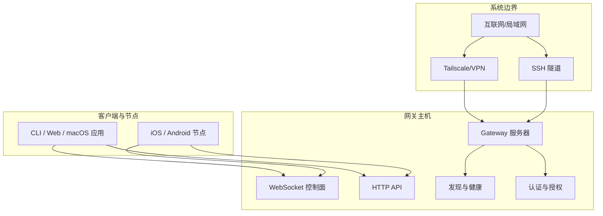
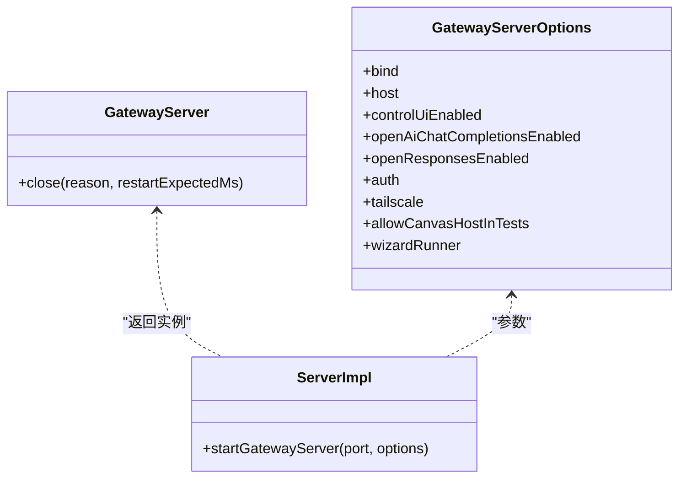
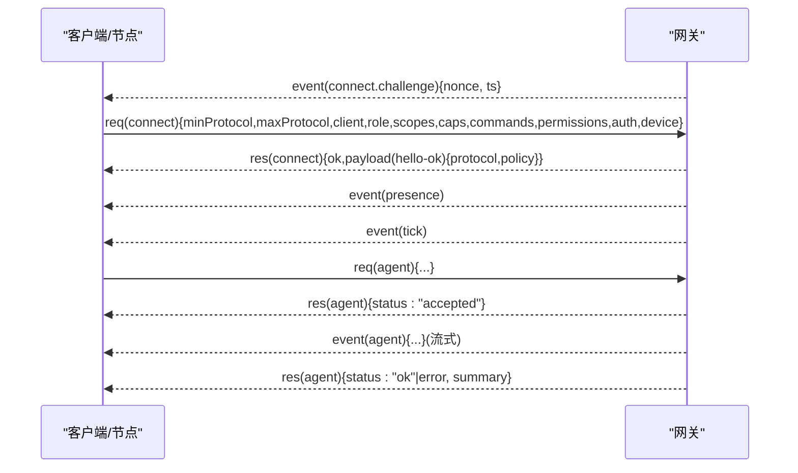
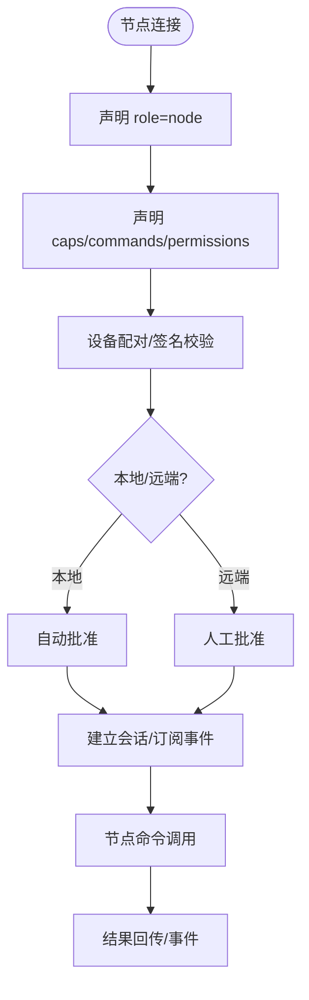
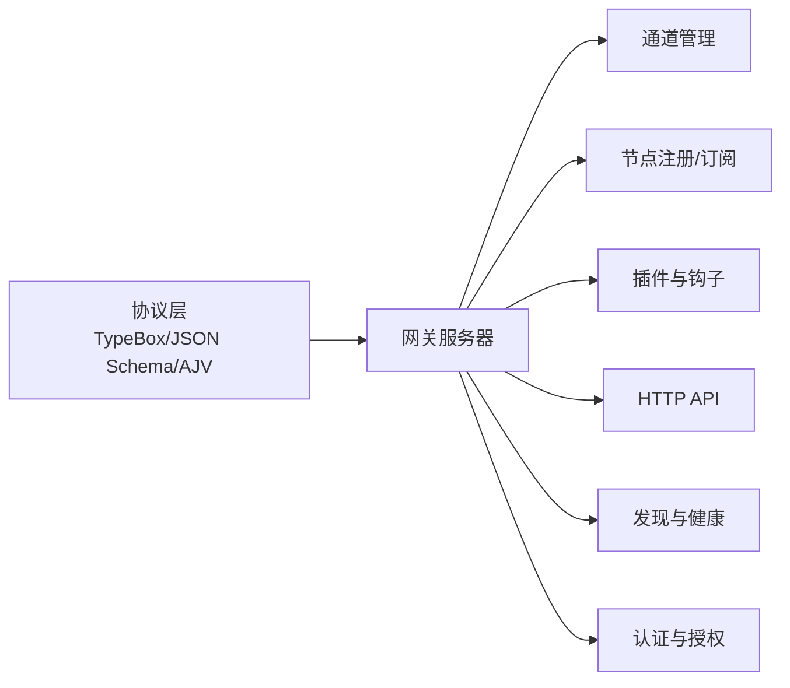

# 系统架构概览

<cite>
**本文引用的文件**
- [README.md](file://README.md)
- [architecture.md](file://docs/concepts/architecture.md)
- [protocol.md](file://docs/gateway/protocol.md)
- [index.md](file://docs/gateway/index.md)
- [security/index.md](file://docs/gateway/security/index.md)
- [server.impl.ts](file://src/gateway/server.impl.ts)
- [protocol/index.ts](file://src/gateway/protocol/index.ts)
</cite>

## 目录

1. [简介](#简介)
2. [项目结构](#项目结构)
3. [核心组件](#核心组件)
4. [架构总览](#架构总览)
5. [详细组件分析](#详细组件分析)
6. [依赖关系分析](#依赖关系分析)
7. [性能考量](#性能考量)
8. [故障排查指南](#故障排查指南)
9. [结论](#结论)
10. [附录](#附录)

## 简介

OpenClaw 是一个在用户自有设备上运行的个人 AI 助手系统。其核心设计理念是“本地优先、模块化、可扩展”，通过一个统一的 WebSocket 网关作为控制平面，连接 AI 代理、消息渠道、设备节点与客户端应用（CLI、Web 控制界面、macOS/移动端节点）。该网关负责会话管理、通道连接、工具执行、事件广播与远程暴露（Tailscale/SSH 隧道），并提供强安全模型与可观测性。

## 项目结构

从整体看，OpenClaw 的代码库围绕“网关服务 + 协议 + 客户端/节点 + 插件/技能”展开。网关位于 src/gateway 下，协议定义在 protocol 子目录中；文档位于 docs 下，覆盖概念、运行手册、协议与安全等主题；客户端与节点分布在 apps、extensions、skills 等目录中。

```mermaid
graph TB
subgraph "网关控制平面"
GW["Gateway 服务器<br/>WebSocket + HTTP 复用端口"]
WS["WebSocket 控制面"]
HTTP["HTTP API<br/>OpenAI 兼容 / OpenResponses / 工具调用"]
CTRLUI["控制界面与钩子"]
end
subgraph "客户端与节点"
CLI["CLI 客户端"]
WEB["Web 控制界面"]
MAC["macOS 应用"]
IOS["iOS 节点"]
ANDROID["Android 节点"]
REMOTE_NODE["远程节点主机"]
end
subgraph "消息渠道"
WHATSAPP["WhatsApp 渠道"]
TELEGRAM["Telegram 渠道"]
SLACK["Slack 渠道"]
DISCORD["Discord 渠道"]
SIGNAL["Signal 渠道"]
IMESSAGE["iMessage 渠道"]
GOOGLECHAT["Google Chat 渠道"]
MATRIX["Matrix 渠道"]
ZALO["Zalo / Zalo Personal 渠道"]
WEBCHAT["WebChat"]
end
subgraph "AI 与工具"
AGENT["AI 代理引擎"]
SKILLS["技能与插件生态"]
TOOLS["工具集<br/>浏览器/画布/节点/定时任务"]
end
GW --- WS
GW --- HTTP
GW --- CTRLUI
CLI --- WS
WEB --- WS
MAC --- WS
IOS --- WS
ANDROID --- WS
REMOTE_NODE --- WS
GW --- WHATSAPP
GW --- TELEGRAM
GW --- SLACK
GW --- DISCORD
GW --- SIGNAL
GW --- IMESSAGE
GW --- GOOGLECHAT
GW --- MATRIX
GW --- ZALO
GW --- WEBCHAT
GW --- AGENT
GW --- SKILLS
GW --- TOOLS
```

图表来源

- [architecture.md](file://docs/concepts/architecture.md#L12-L55)
- [protocol.md](file://docs/gateway/protocol.md#L12-L15)
- [index.md](file://docs/gateway/index.md#L62-L71)

章节来源

- [README.md](file://README.md#L180-L258)
- [architecture.md](file://docs/concepts/architecture.md#L12-L55)
- [protocol.md](file://docs/gateway/protocol.md#L12-L15)
- [index.md](file://docs/gateway/index.md#L62-L71)

## 核心组件

- 网关服务器（Gateway Server）
  - 提供 WebSocket 控制面与 HTTP API（OpenAI 兼容、OpenResponses、工具调用）复用同一端口。
  - 维护通道连接、会话状态、节点能力注册、事件广播与健康状态。
  - 支持热重载、多实例隔离、Tailscale 暴露与 SSH 隧道访问。
- WebSocket 协议（Gateway Protocol）
  - 文本帧 JSON，首帧必须为 connect；后续为请求/响应/事件三类帧。
  - 角色区分（operator/node）、作用域授权、设备身份与配对、鉴权令牌与设备令牌。
- 客户端与节点
  - CLI、Web 控制界面、macOS 应用、iOS/Android 节点均通过 WS 连接网关。
  - 节点声明能力（caps）、命令白名单与权限开关，由网关侧策略校验。
- 消息渠道适配层
  - 基于插件体系接入 WhatsApp、Telegram、Slack、Discord、Signal、iMessage、Google Chat、Matrix、Zalo 等。
- AI 代理与技能
  - 代理引擎与会话管理；技能与插件生态支持动态加载与远程节点能力探测。

章节来源

- [index.md](file://docs/gateway/index.md#L62-L71)
- [protocol.md](file://docs/gateway/protocol.md#L127-L134)
- [protocol.md](file://docs/gateway/protocol.md#L135-L161)
- [protocol.md](file://docs/gateway/protocol.md#L187-L196)
- [server.impl.ts](file://src/gateway/server.impl.ts#L102-L155)

## 架构总览

OpenClaw 的系统边界清晰：网关作为控制平面，承载所有消息表面与工具执行入口；客户端与节点通过 WebSocket 与其交互；HTTP 接口用于兼容第三方工具链与远程调用；安全模型贯穿始终，强调“先身份、后范围、再模型”。

图表来源

- [index.md](file://docs/gateway/index.md#L101-L116)
- [protocol.md](file://docs/gateway/protocol.md#L211-L216)
- [architecture.md](file://docs/concepts/architecture.md#L111-L122)

章节来源

- [architecture.md](file://docs/concepts/architecture.md#L12-L55)
- [index.md](file://docs/gateway/index.md#L101-L116)
- [protocol.md](file://docs/gateway/protocol.md#L211-L216)

## 详细组件分析

### 网关服务器（控制平面）

- 职责
  - 启动与生命周期管理（启动、重启、关闭）、配置热重载、维护健康与存在状态。
  - 管理通道连接、会话路由、节点能力注册与订阅、工具执行审批与转发。
  - 提供 HTTP API（OpenAI 兼容、OpenResponses、工具调用）与控制界面。
- 关键特性
  - 多端口复用：WS 控制面 + HTTP API + 可选 Canvas 主机端口。
  - 绑定模式：loopback、lan、tailnet、auto；默认 loopback 以降低攻击面。
  - 认证：token/password；支持设备令牌与配对；Tailscale 身份头透传。
  - 远程访问：Tailscale Serve/Funnel 或 SSH 隧道；TLS 可选指纹校验。
- 运行时状态
  - 健康快照、存在版本、心跳、诊断事件、插件与钩子运行器、模型目录缓存等。

图表来源

- [server.impl.ts](file://src/gateway/server.impl.ts#L102-L155)

章节来源

- [server.impl.ts](file://src/gateway/server.impl.ts#L102-L155)
- [index.md](file://docs/gateway/index.md#L62-L71)

### WebSocket 协议与握手流程

- 传输与帧格式
  - WebSocket 文本帧 JSON；首帧必须为 connect。
  - 请求/响应/事件三类帧：req/res/event。
- 握手与认证
  - connect.challenge 事件 → 客户端签名挑战 → connect 请求 → hello-ok 响应。
  - 设备身份与配对；可颁发设备令牌；支持 token/password 认证。
- 角色与授权
  - operator：控制面客户端（CLI/UI/自动化）。
  - node：能力宿主（相机/屏幕/画布/系统命令等），声明 caps/commands/permissions。
- 版本与校验
  - PROTOCOL_VERSION；TypeBox 定义 + JSON Schema 校验；AJV 编译验证器。

图表来源

- [protocol.md](file://docs/gateway/protocol.md#L22-L91)
- [protocol.md](file://docs/gateway/protocol.md#L127-L134)
- [protocol.md](file://docs/gateway/protocol.md#L187-L196)

章节来源

- [protocol.md](file://docs/gateway/protocol.md#L17-L21)
- [protocol.md](file://docs/gateway/protocol.md#L22-L91)
- [protocol.md](file://docs/gateway/protocol.md#L127-L134)
- [protocol.md](file://docs/gateway/protocol.md#L187-L196)
- [protocol/index.ts](file://src/gateway/protocol/index.ts#L227-L408)

### 客户端与节点交互

- 客户端
  - CLI、Web 控制界面、macOS 应用通过 WS 发送请求、订阅事件。
- 节点
  - 通过 WS 连接，声明 role=node，提供 caps/commands/permissions。
  - 支持技能二进制探测、节点命令调用与结果回传。
- 事件与状态
  - presence、tick、agent、chat、health、heartbeat、shutdown 等事件驱动 UI 与自动化。

图表来源

- [protocol.md](file://docs/gateway/protocol.md#L135-L161)
- [protocol.md](file://docs/gateway/protocol.md#L197-L210)

章节来源

- [protocol.md](file://docs/gateway/protocol.md#L135-L161)
- [protocol.md](file://docs/gateway/protocol.md#L197-L210)

### 消息渠道与会话路由

- 渠道适配
  - 基于插件体系接入多平台消息渠道，统一由网关维护会话与路由。
- 会话模型
  - 支持主会话、群组隔离、激活模式、队列模式、回复回传等。
- 安全与隔离
  - DM 策略（配对/允许列表/公开/禁用）；群组策略（提及门控、允许列表、提及默认）。
  - 多用户 DM 隔离（按通道+发送者）；工具沙箱与执行审批。

章节来源

- [architecture.md](file://docs/concepts/architecture.md#L14-L22)
- [security/index.md](file://docs/gateway/security/index.md#L180-L233)
- [security/index.md](file://docs/gateway/security/index.md#L591-L628)

### 安全模型与合规

- 身份与授权
  - 设备身份与配对；角色+作用域授权；设备令牌轮换/吊销。
- 网络暴露
  - 默认 loopback 绑定；Tailscale Serve/Funnel；SSH 隧道；TLS 证书指纹校验。
- 工具与执行
  - 执行审批广播与解决；工具白名单/黑名单；沙箱隔离；只读工作区。
- 日志与审计
  - 敏感信息红化；会话转录存储；定期安全审计与修复建议。

章节来源

- [protocol.md](file://docs/gateway/protocol.md#L187-L196)
- [security/index.md](file://docs/gateway/security/index.md#L406-L448)
- [security/index.md](file://docs/gateway/security/index.md#L591-L628)
- [security/index.md](file://docs/gateway/security/index.md#L504-L518)

## 依赖关系分析

- 组件耦合
  - 网关服务器聚合通道管理、会话处理、节点注册、插件钩子、HTTP API、健康与发现。
  - 协议层通过 TypeBox/JSON Schema/ AJV 实现强类型与运行时校验。
- 外部集成
  - Tailscale 用于安全暴露；SSH 隧道用于远程访问；浏览器控制通过节点代理。
- 可能的循环依赖
  - 通过模块导出与运行时初始化避免编译期循环；插件与钩子采用延迟绑定。

图表来源

- [protocol/index.ts](file://src/gateway/protocol/index.ts#L227-L408)
- [server.impl.ts](file://src/gateway/server.impl.ts#L46-L81)

章节来源

- [protocol/index.ts](file://src/gateway/protocol/index.ts#L227-L408)
- [server.impl.ts](file://src/gateway/server.impl.ts#L46-L81)

## 性能考量

- 单一长连接控制面：减少连接数与上下文切换，提升事件吞吐。
- 多路复用端口：WS + HTTP 共用端口，简化网络与防火墙配置。
- 并发与限流：基于通道与会话的并发管线与节流策略（见 lanes 与通道实现）。
- 事件不重放：客户端需自行刷新状态，避免重放带来的额外负载。
- 远程访问：Tailscale Serve/Funnel 与 SSH 隧道减少公网暴露，降低带宽与安全成本。

## 故障排查指南

- 连接失败
  - 非 connect 首帧或协议版本不匹配会导致硬关闭；检查 min/maxProtocol 与 connect 参数。
  - 未配置认证或认证不一致导致拒绝连接；核对 token/password。
- 事件缺失
  - 事件不重放，序列断开需刷新 health/system-presence。
- 远程访问
  - SSH 隧道与 Tailscale Serve/Funnel 需要正确配置认证与证书指纹。
- 安全审计
  - 使用 `openclaw security audit` 与 `openclaw doctor` 快速定位风险点（暴露面、权限、工具策略）。

章节来源

- [protocol.md](file://docs/gateway/protocol.md#L178-L186)
- [index.md](file://docs/gateway/index.md#L224-L227)
- [index.md](file://docs/gateway/index.md#L228-L238)
- [security/index.md](file://docs/gateway/security/index.md#L10-L23)

## 结论

OpenClaw 以 WebSocket 网关为核心控制平面，实现了本地优先、模块化与可扩展的个人 AI 助手系统。通过严格的设备身份与授权模型、强类型协议与运行时校验、以及完善的远程暴露与安全策略，系统在保证易用性的同时兼顾了安全性与可运维性。未来可在多网关隔离、事件重放策略、以及更细粒度的并发与资源配额方面持续演进。

## 附录

- 基础设施要求
  - 运行时：Node ≥22；推荐使用 pnpm/bun/npm。
  - 端口：默认 18789（WS/HTTP 复用），可选 Canvas 主机端口。
  - 绑定模式：默认 loopback；生产环境建议 Tailscale Serve/Funnel 或 SSH 隧道。
- 可扩展性考虑
  - 插件与技能生态；多通道适配；多节点能力注册；会话与代理路由。
- 部署拓扑
  - 单主机：网关 + 浏览器节点（可选）；远程节点通过 Tailscale/SSH 访问。
  - 多实例：严格隔离与唯一端口/配置/状态目录；谨慎启用多实例。

章节来源

- [README.md](file://README.md#L47-L56)
- [index.md](file://docs/gateway/index.md#L164-L183)
- [index.md](file://docs/gateway/index.md#L101-L116)
