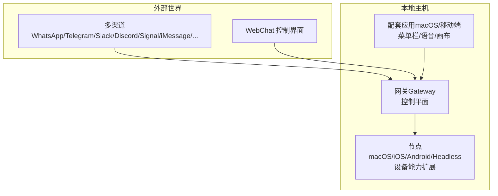
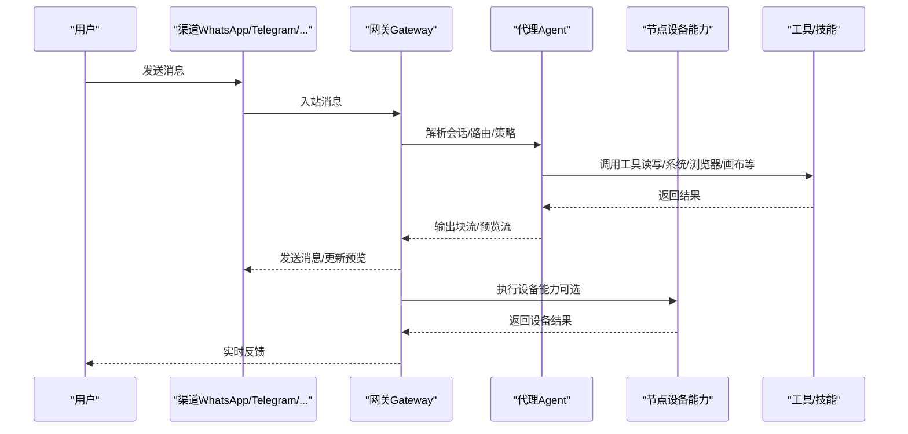
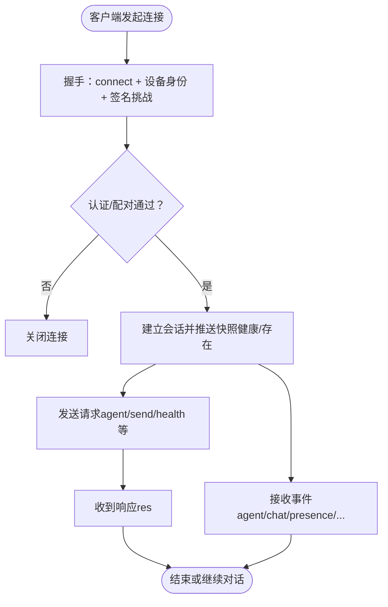
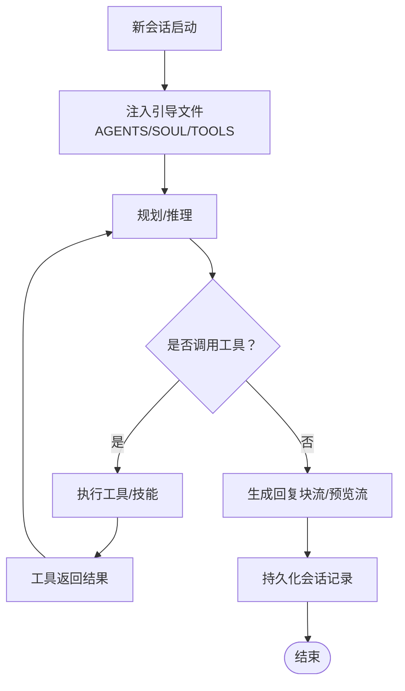
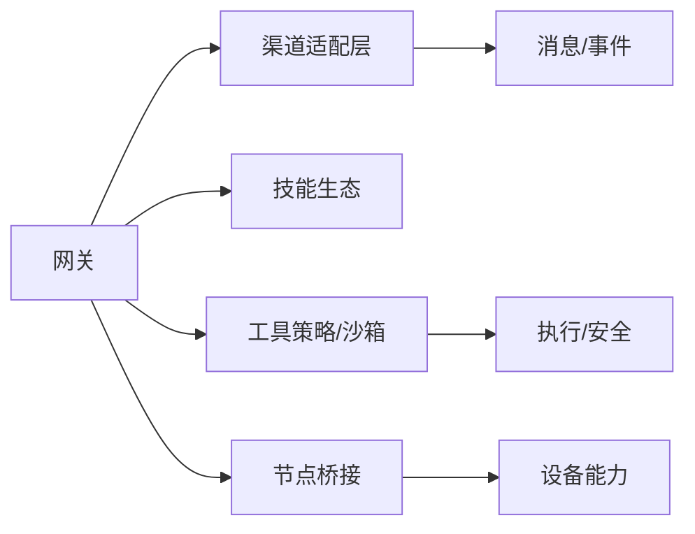

# 项目介绍

<cite>
**本文引用的文件**
- [README.md](file://README.md)
- [VISION.md](file://VISION.md)
- [SECURITY.md](file://SECURITY.md)
- [CONTRIBUTING.md](file://CONTRIBUTING.md)
- [docs/concepts/architecture.md](file://docs/concepts/architecture.md)
- [docs/concepts/agent.md](file://docs/concepts/agent.md)
- [docs/concepts/streaming.md](file://docs/concepts/streaming.md)
- [docs/install/fly.md](file://docs/install/fly.md)
</cite>

## 目录

1. [引言](#引言)
2. [项目结构](#项目结构)
3. [核心组件](#核心组件)
4. [架构总览](#架构总览)
5. [详细组件分析](#详细组件分析)
6. [依赖关系分析](#依赖关系分析)
7. [性能考量](#性能考量)
8. [故障排查指南](#故障排查指南)
9. [结论](#结论)
10. [附录](#附录)

## 引言

OpenClaw 是一个“个人 AI 助手”，它运行在你的设备上、连接到你常用的即时通讯渠道，并以“本地优先”的方式提供强大能力：安全、可控、快速、始终在线。它的产品形态是“助手”，而网关（Gateway）是控制平面；通过本地部署，OpenClaw 在隐私保护、响应速度与可控性方面形成差异化优势，满足个人用户与小团队对“可信任、可掌控”的智能助理需求。

本项目面向两类人群：

- 初学者：希望获得“即开即用”的个人助理，同时理解其“本地运行、隐私优先”的价值定位；
- 进阶用户：需要在安全边界内扩展工具链、插件与多平台节点，追求稳定与性能。

## 项目结构

OpenClaw 的整体结构围绕“网关（控制平面）+ 多通道（聊天渠道）+ 节点（设备/应用）+ 工具与技能（自动化）”展开。下图给出高层视图（概念映射，非代码级）：

- 网关负责会话、路由、事件、工具与模型调用的统一控制；
- 节点提供设备能力（如摄像头、屏幕录制、系统命令等），并以“设备身份”受控接入；
- 多渠道与 WebChat 作为入口，统一通过 WebSocket 与网关交互；
- 安全默认与信任模型贯穿所有组件。

章节来源

- file://README.md#L185-L239
- file://docs/concepts/architecture.md#L12-L26

## 核心组件

- 网关（Gateway）：单实例控制平面，维护各渠道连接、会话状态、工具策略与事件推送；支持 WebSocket 协议与设备配对。
- 多渠道（Channels）：覆盖主流 IM 平台，支持群组路由、提及触发、分片与回复标签等规则。
- 节点（Nodes）：macOS/iOS/Android/Headless 设备节点，提供摄像头、屏幕录制、位置、通知等本地能力。
- 工具与技能（Tools & Skills）：浏览器控制、画布（Canvas）、节点命令、定时任务、钩子与技能生态。
- 安全与信任（Security & Trust）：终端优先、强默认安全、明确的信任边界与风险提示。

章节来源

- file://README.md#L143-L184
- file://docs/concepts/architecture.md#L27-L48
- file://docs/concepts/agent.md#L12-L48

## 架构总览

下图展示 OpenClaw 的端到端工作流：从渠道消息进入网关，经由会话与工具策略，最终通过节点执行本地动作或返回给用户。

图表来源

- [docs/concepts/architecture.md](file://docs/concepts/architecture.md#L59-L78)

章节来源

- file://docs/concepts/architecture.md#L12-L26
- file://docs/concepts/architecture.md#L80-L92

## 详细组件分析

### 网关与协议（控制平面）

- 单一网关实例：每个主机仅运行一个网关，避免多会话冲突（例如 Baileys WhatsApp 会话）。
- WebSocket 协议：首帧必须为 connect，后续请求/响应与事件推送均采用 JSON 文本帧。
- 设备配对与本地信任：首次连接需设备身份与签名挑战；本地回环连接可自动批准；远程连接仍需显式批准。
- 远程访问：推荐 Tailscale/VPN 或 SSH 隧道，保持网关绑定 loopback。

图表来源

- [docs/concepts/architecture.md](file://docs/concepts/architecture.md#L59-L78)

章节来源

- file://docs/concepts/architecture.md#L12-L26
- file://docs/concepts/architecture.md#L80-L109

### 代理与工作区（Agent Runtime）

- 工作区（Workspace）：代理唯一的工作目录，注入 AGENTS.md/SOUL.md/TOOLS.md 等引导文件，作为上下文的一部分。
- 技能与工具：内置工具始终可用，技能来自三处（打包、本地、工作区），工作区优先。
- 会话存储：会话转录以 JSONL 存储于本地，支持检索与复盘。
- 块流与预览流：块流按完成块输出，预览流用于实时预览生成进度；两者互斥或独立启用。

图表来源

- [docs/concepts/agent.md](file://docs/concepts/agent.md#L73-L104)
- [docs/concepts/streaming.md](file://docs/concepts/streaming.md#L19-L48)

章节来源

- file://docs/concepts/agent.md#L12-L48
- file://docs/concepts/streaming.md#L10-L18

### 节点与设备能力（Nodes）

- 角色区分：节点以 role=node 连接，声明能力与权限；配对后授予设备令牌，后续连接自动批准。
- 设备能力：摄像头抓拍/视频、屏幕录制、位置获取、系统通知等；通过 node.invoke 路由至节点执行。
- 本地优先：节点能力在本地设备上执行，减少网络往返与数据外泄。

章节来源

- file://docs/concepts/architecture.md#L42-L48
- file://docs/concepts/architecture.md#L93-L109

### 安全与信任模型（Security & Trust）

- 信任模型：OpenClaw 默认“个人助理”模型（单受信任操作者，可能有多个代理）。不模拟多租户对抗场景。
- 网关与节点：网关是控制面，节点是执行扩展；二者同属同一操作者信任边界。执行审批（允许列表/弹窗）是操作者护栏，非多租户授权边界。
- 本地优先与最小暴露：Web 界面建议仅本地使用；Canvas 主机在网络可见时需谨慎（仅限可信节点场景）。
- 插件与内存：插件为受信代码；工作区内存文件被视为受信本地状态；临时目录与媒体路径有约束。

章节来源

- file://SECURITY.md#L84-L160
- file://SECURITY.md#L195-L225
- file://SECURITY.md#L170-L177

## 依赖关系分析

- 组件耦合
  - 网关与渠道：网关集中管理渠道连接与路由，降低重复连接与状态分散。
  - 网关与节点：通过 WebSocket 与设备配对协议协作，节点仅在受控场景下执行本地动作。
  - 网关与工具/技能：工具策略与沙箱策略在网关侧统一治理，避免工具滥用。
- 外部依赖
  - 模型提供商：支持多家模型供应商；默认推荐具备长上下文与抗提示注入能力的模型组合。
  - 部署与暴露：推荐 Tailscale/SSH 隧道或私有 Fly 部署，避免直接暴露公网。

图表来源

- [README.md](file://README.md#L143-L184)
- [docs/concepts/architecture.md](file://docs/concepts/architecture.md#L12-L26)

章节来源

- file://README.md#L143-L184
- file://docs/install/fly.md#L365-L433

## 性能考量

- 响应速度
  - 本地执行：工具与节点能力在本地执行，减少网络延迟与数据传输。
  - 块流与预览流：块流在完成块时输出，预览流实时更新生成进度，提升感知速度。
  - 人类节奏：可配置块间随机停顿，使多段回复更自然。
- 资源与成本
  - 令牌统计与缓存命中率：支持日志与可视化，便于优化上下文与缓存策略。
  - 模型与会话修剪：提供模型故障转移与会话修剪，降低资源占用。
- 可靠性
  - 重试与幂等键：对副作用方法要求幂等键，保障重试安全。
  - 健康检查与守护：支持 launchd/systemd 自动重启，确保服务持续可用。

章节来源

- file://docs/concepts/streaming.md#L83-L92
- file://docs/concepts/streaming.md#L108-L156
- file://README.md#L171-L177

## 故障排查指南

- 安全审计与加固
  - 使用 `openclaw security audit` 检查配置风险；遵循“仅本地绑定 loopback”的建议。
  - 对于私有部署（如 Fly），可释放公网 IP，使用隧道或 VPN 访问，隐藏部署。
- 远程访问
  - 推荐 Tailscale/SSH 隧道；确保网关仍绑定 loopback，配合强认证。
- 通道与节点
  - 若出现通道连接异常，先检查 onboarding 流程与凭据配置；对节点连接失败，确认配对与角色声明。
- 日志与诊断
  - 使用 `openclaw logs` 与 `openclaw doctor` 快速定位问题；关注健康检查与事件快照。

章节来源

- file://SECURITY.md#L195-L225
- file://docs/install/fly.md#L365-L433
- file://README.md#L442-L450

## 结论

OpenClaw 的核心价值在于“本地优先”的个人助理模式：通过单一网关控制、多渠道接入、节点扩展与严格的安全默认，实现“隐私更强、响应更快、可控性更高”的用户体验。对于初学者而言，OpenClaw 提供了清晰的入门路径与强大的能力边界；对于进阶用户，它提供了可扩展的工具与技能体系、灵活的远程访问与私有部署方案。在当前“云端中心化”的 AI 助手生态中，OpenClaw 以“本地运行、受控执行、透明治理”形成差异化优势，适合对隐私与可控性有高要求的个人与小团队。

## 附录

### 为什么选择本地运行的个人 AI 助手？

- 隐私保护：消息与数据在本地处理，减少外泄风险；Web 界面建议仅本地使用，Canvas 主机在网络可见时需谨慎。
- 更快响应：工具与节点能力在本地执行，减少网络往返；块流与预览流提升感知速度。
- 更强可控：工具策略、沙箱与执行审批均由操作者控制；节点能力仅在受控场景下生效。

章节来源

- file://SECURITY.md#L207-L225
- file://docs/concepts/streaming.md#L19-L48

### 主要目标与差异化优势

- 目标：易用、跨平台、尊重隐私与安全的个人助理。
- 差异化：终端优先的设置流程、强默认安全、明确的信任边界、块流与预览流体验、节点本地执行能力、私有部署与远程隧道方案。

章节来源

- file://VISION.md#L15-L33
- file://README.md#L126-L136

### 发展愿景与设计理念

- 优先级：安全与安全默认、稳定性与首启体验、插件与内存的可扩展性。
- 设计理念：核心保持精简，能力尽量以插件形式提供；首选 TypeScript 以保持可读与可扩展性；终端优先的安装与配置流程。

章节来源

- file://VISION.md#L17-L33
- file://VISION.md#L93-L98
