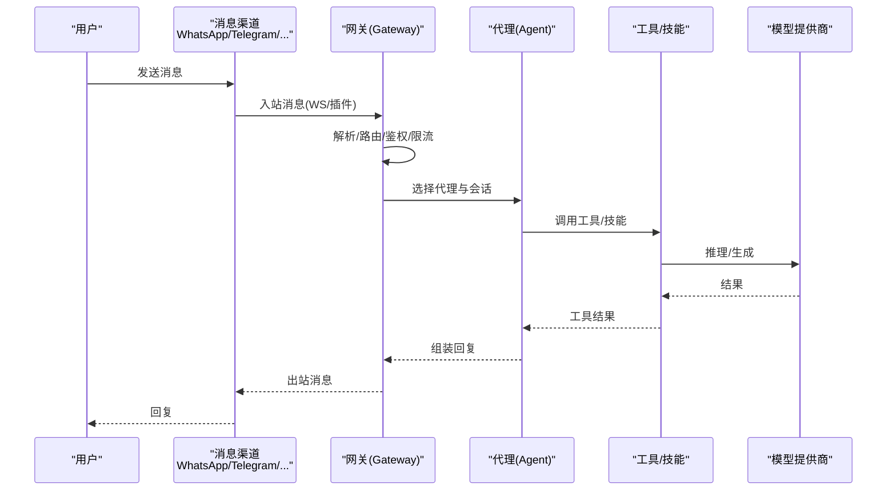
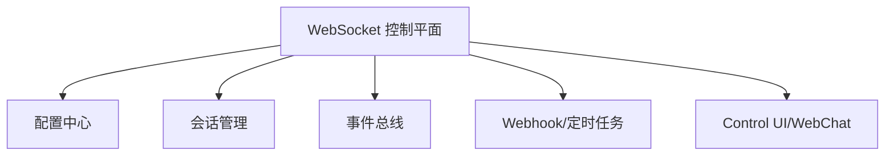
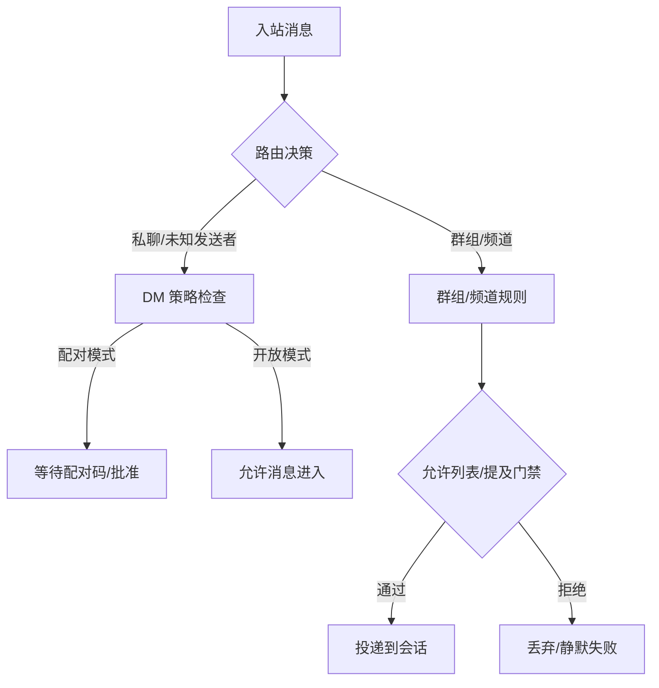
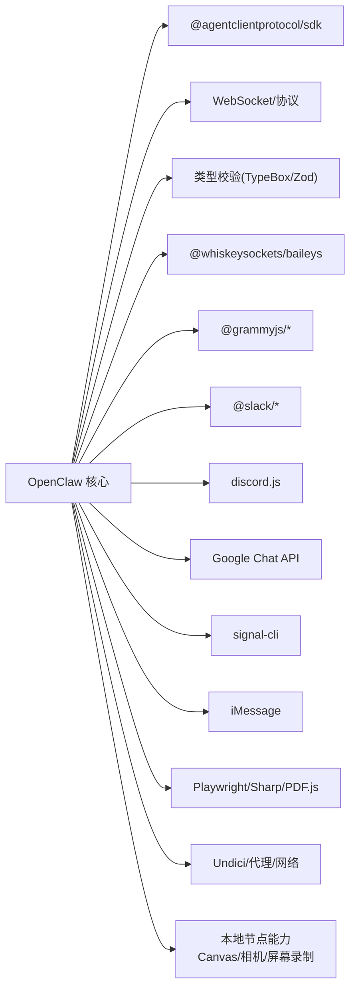

# 项目概述

<cite>
**本文引用的文件**
- [README.md](file://README.md)
- [VISION.md](file://VISION.md)
- [CONTRIBUTING.md](file://CONTRIBUTING.md)
- [CHANGELOG.md](file://CHANGELOG.md)
- [package.json](file://package.json)
</cite>

## 目录

1. [引言](#引言)
2. [项目结构](#项目结构)
3. [核心组件](#核心组件)
4. [架构总览](#架构总览)
5. [详细组件分析](#详细组件分析)
6. [依赖关系分析](#依赖关系分析)
7. [性能考量](#性能考量)
8. [故障排查指南](#故障排查指南)
9. [结论](#结论)
10. [附录](#附录)

## 引言

OpenClaw 是一个可在您自己的设备上运行的“个人 AI 助手”。它通过您已使用的多渠道（如 WhatsApp、Telegram、Slack、Discord、Google Chat、Signal、iMessage、Microsoft Teams、WebChat 等）接收并回复消息，并支持在 macOS/iOS/Android 上进行语音唤醒与对话，以及在 macOS 上提供可交互的实时画布（Canvas）。其核心价值在于：

- 本地优先：所有处理在本地完成，数据不出网或受控出网，满足隐私与安全要求；
- 多通道统一入口：一个网关控制平面，统一管理会话、工具、事件与多平台消息通道；
- 可扩展生态：插件与技能体系，支持第三方能力接入与工作流编排；
- 安全默认：严格的权限与沙箱策略，配合可配置的暴露面与远程访问控制。

与传统云端 AI 助手不同，OpenClaw 的产品形态是“助手”，而网关是其控制平面；用户通过 CLI、Web 控制界面、桌面应用或移动节点与其交互，实现“始终在线”的本地智能助理体验。

## 项目结构

仓库采用多模块组织方式，涵盖：

- 核心运行时与网关（src/gateway、src/cli、src/daemon 等）
- 多平台应用（apps/macos、apps/ios、apps/android）
- 插件与技能（extensions、skills）
- 文档与站点（docs）
- 分发产物与打包脚本（dist、scripts）

```mermaid
graph TB
subgraph "核心运行时"
GW["网关(Gateway)<br/>WebSocket 控制平面"]
CLI["CLI 命令行"]
TUI["TUI 终端界面"]
DAEMON["守护进程/系统服务"]
end
subgraph "多平台应用"
MAC["macOS 应用"]
IOS["iOS 节点"]
ANDROID["Android 节点"]
end
subgraph "消息通道"
WA["WhatsApp"]
TG["Telegram"]
SL["Slack"]
DC["Discord"]
GC["Google Chat"]
SG["Signal"]
IM["iMessage"]
MS["Microsoft Teams"]
WEB["WebChat"]
end
subgraph "工具与能力"
BROWSER["浏览器控制"]
CANVAS["Canvas 画布"]
NODES["节点能力<br/>相机/屏幕录制/通知"]
CRON["定时任务/钩子"]
SKILLS["技能平台"]
end
GW --> CLI
GW --> TUI
GW --> DAEMON
GW --> MAC
GW --> IOS
GW --> ANDROID
GW --> WA
GW --> TG
GW --> SL
GW --> DC
GW --> GC
GW --> SG
GW --> IM
GW --> MS
GW --> WEB
GW --> BROWSER
GW --> CANVAS
GW --> NODES
GW --> CRON
GW --> SKILLS
```

图示来源

- [README.md](file://README.md#L185-L212)
- [package.json](file://package.json#L151-L207)

章节来源

- [README.md](file://README.md#L185-L212)
- [package.json](file://package.json#L151-L207)

## 核心组件

- 网关（Gateway）：单一路由器式的 WebSocket 控制平面，承载会话、通道、工具、事件与远程控制接口；支持远程暴露（Tailscale Serve/Funnel 或 SSH 隧道）、健康检查与诊断。
- CLI：命令行工具，覆盖 onboarding、gateway 启动、消息发送、代理调用、医生诊断、插件与技能管理等。
- 通道适配层：对主流 IM 平台提供原生或桥接插件，统一入站/出站消息路由、媒体处理与权限控制。
- 工具与节点：浏览器自动化、Canvas 画布、节点能力（相机/屏幕录制/通知）、定时任务与 Webhook、Gmail Pub/Sub 触发。
- 技能平台：内置与社区技能注册表（ClawHub），支持安装、启用与 UI 管理。
- 安全与沙箱：默认非主会话在沙箱中执行，允许/拒绝白名单策略，结合 Docker 与路径别名保护，防止越权与逃逸。

章节来源

- [README.md](file://README.md#L126-L177)
- [VISION.md](file://VISION.md#L41-L84)

## 架构总览

OpenClaw 的整体工作流如下：用户通过任意已接入的消息渠道向网关发送消息；网关根据路由规则选择对应代理（Agent）与会话上下文，触发工具链与外部模型推理，再将结果回送到指定渠道。同时，桌面与移动端节点通过网关协议获取本地权限，执行设备级动作（如屏幕录制、通知、Canvas 操作）。

图示来源

- [README.md](file://README.md#L185-L202)

章节来源

- [README.md](file://README.md#L185-L202)

## 详细组件分析

### 网关与控制平面

- 单一 WebSocket 控制平面，承载会话、存在性、配置、定时任务、Webhook、远程控制与调试工具；
- 支持 Tailscale Serve/Funnel 与 SSH 隧道的安全远程访问；
- 提供 Control UI 与 WebChat，便于可视化与调试。

图示来源

- [README.md](file://README.md#L144-L147)
- [README.md](file://README.md#L180-L184)

章节来源

- [README.md](file://README.md#L144-L147)
- [README.md](file://README.md#L180-L184)

### 多渠道消息传递

- 支持 WhatsApp、Telegram、Slack、Discord、Google Chat、Signal、iMessage、Microsoft Teams、Matrix、Zalo、WebChat 等；
- 提供分组路由、提及门禁、回复标签、分片与路由策略；
- 默认 DM 策略支持“配对”与“开放”，并提供医生诊断工具识别风险配置。

图示来源

- [README.md](file://README.md#L118-L125)

章节来源

- [README.md](file://README.md#L118-L125)

### 代理与会话

- 会话模型支持主会话、群组隔离、激活模式、队列模式与回复回传；
- 支持跨会话工具（sessions\_\*），用于在不同会话间协调工作；
- 支持思维级别、冗余度与用量跟踪，便于成本与性能优化。

章节来源

- [README.md](file://README.md#L148-L149)
- [README.md](file://README.md#L255-L262)

### 工具与节点

- 浏览器控制：专用 Chrome/Chromium 实例，支持快照、动作与上传；
- Canvas：A2UI 主机，支持评估、重置、截图；
- 节点能力：相机抓拍/剪辑、屏幕录制、位置查询、通知；
- 定时任务与 Webhook：支持 Gmail Pub/Sub、周期性任务与外部触发。

章节来源

- [README.md](file://README.md#L165-L169)
- [README.md](file://README.md#L208-L212)

### 安全与沙箱

- 默认在主会话中拥有完整工具权限，在非主会话（群组/频道）中默认以沙箱运行；
- 沙箱允许/拒绝清单可精细控制，结合 Docker 与路径边界校验，防止越权与逃逸；
- 对设备节点的权限与命令调用进行严格鉴权与审批。

章节来源

- [README.md](file://README.md#L332-L339)

### 插件与技能生态

- 插件 API 与 MCP 支持通过 mcporter 桥接，保持核心轻量与灵活性；
- 技能发布至 ClawHub，新技能优先在社区注册表中维护；
- 通过 CLI 与 Control UI 进行安装、启用与管理。

章节来源

- [VISION.md](file://VISION.md#L52-L84)
- [README.md](file://README.md#L264-L269)

## 依赖关系分析

OpenClaw 的依赖横跨运行时、SDK、协议与第三方服务，关键点包括：

- 运行时与协议：@agentclientprotocol/sdk、WebSocket、JSON Schema 校验；
- 通道适配：Baileys（WhatsApp）、grammy（Telegram）、bolt（Slack）、discord.js（Discord）、Chat API（Google Chat）、signal-cli（Signal）、imessage（iMessage）等；
- 工具与媒体：Playwright、Sharp、PDF.js、Undici、Opus 编解码；
- 本地能力：@napi-rs/canvas、node-llama-cpp（可选）。

图示来源

- [package.json](file://package.json#L151-L207)

章节来源

- [package.json](file://package.json#L151-L207)

## 性能考量

- 令牌使用与压缩：通过上下文修剪、摘要与缓存保留策略降低 token 使用；
- 传输与并发：WebSocket 优先，SSE 回退；队列与背压控制避免拥塞；
- 本地化与延迟：设备节点就近执行，减少网络往返；Canvas/A2UI 与浏览器控制按需加载；
- 模型与提供商：支持多家模型提供商与失败切换，结合速率限制与冷却窗口优化吞吐。

章节来源

- [CONTRIBUTING.md](file://CONTRIBUTING.md#L104-L112)
- [CHANGELOG.md](file://CHANGELOG.md#L1-L435)

## 故障排查指南

- 医生诊断：使用 doctor 子命令检查配置、通道状态、安全策略与环境问题；
- 日志与健康：查看日志输出与健康检查端点，定位启动、连接与通道异常；
- 远程访问：确认 Tailscale Serve/Funnel 或 SSH 隧道配置正确，绑定地址与认证模式符合预期；
- 渠道问题：核对 allowlist、DM 策略与 webhook 设置，必要时使用 doctor 自动修复；
- 安全与权限：检查沙箱模式、路径别名与执行审批，确保最小权限原则。

章节来源

- [README.md](file://README.md#L442-L449)
- [README.md](file://README.md#L112-L125)

## 结论

OpenClaw 将“个人 AI 助手”的理念落地为一套可扩展、可审计、可远程控制的本地化系统。其以网关为核心控制平面，贯通多渠道消息、工具与节点能力，辅以完善的插件与技能生态、严格的安全默认与远程访问控制，既适合初学者快速上手，也为有经验的开发者提供了深入定制与优化的空间。随着对模型提供商支持、通道覆盖与性能测试基础设施的持续投入，OpenClaw 正朝着更稳定、更易用、更强大的方向演进。

## 附录

- 快速开始与升级：参考 README 中的安装与更新指引；
- 开发与构建：使用 pnpm 管理依赖，构建产物位于 dist/，可通过 CLI 直接运行或打包二进制；
- 社区与贡献：欢迎在 Discord 与 GitHub 讨论，遵循贡献指南与维护者团队职责。

章节来源

- [README.md](file://README.md#L50-L111)
- [CONTRIBUTING.md](file://CONTRIBUTING.md#L62-L101)
- [package.json](file://package.json#L49-L149)
