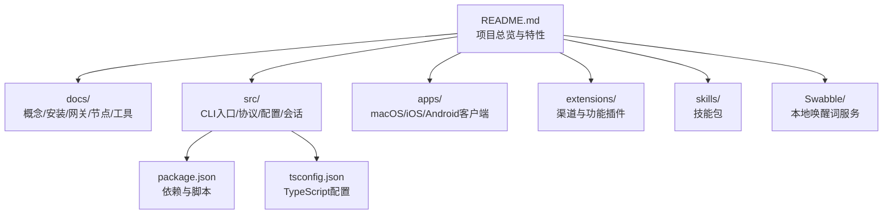
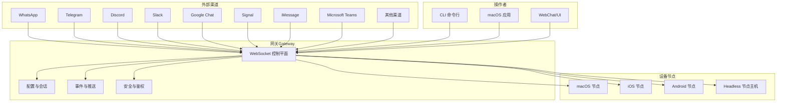
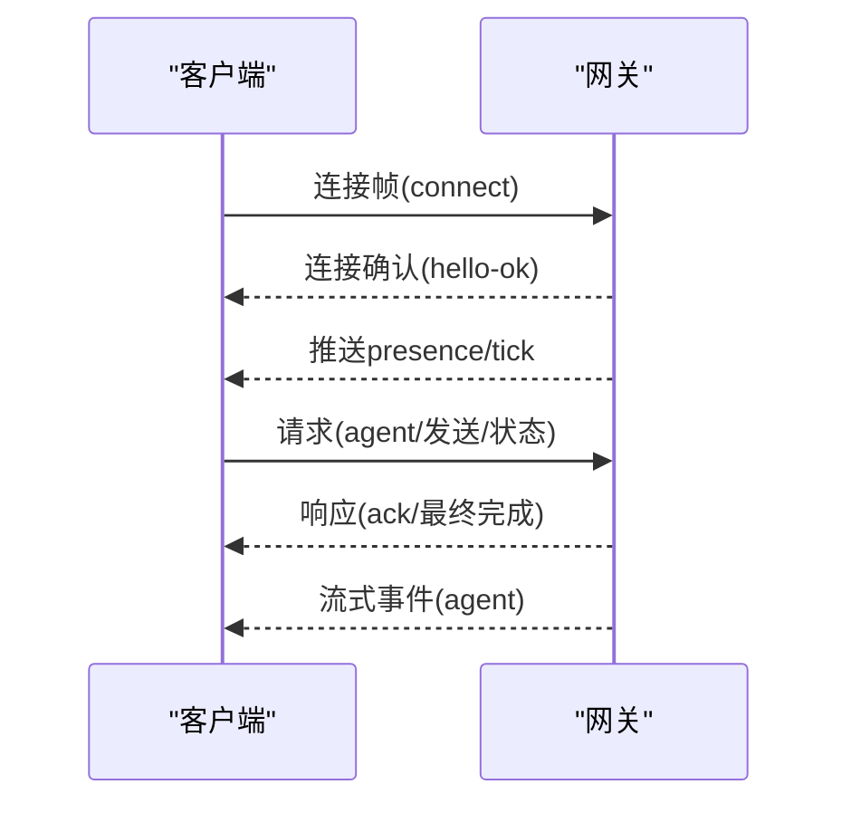
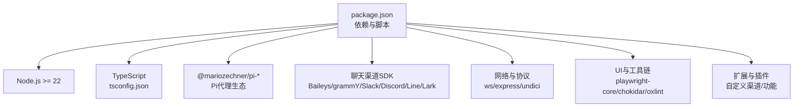

# 项目概述

<cite>
**本文档引用的文件**
- [README.md](file://README.md)
- [Swabble/README.md](file://Swabble/README.md)
- [docs/start/openclaw.md](file://docs/start/openclaw.md)
- [docs/concepts/architecture.md](file://docs/concepts/architecture.md)
- [docs/concepts/features.md](file://docs/concepts/features.md)
- [docs/cli/index.md](file://docs/cli/index.md)
- [docs/gateway/index.md](file://docs/gateway/index.md)
- [docs/nodes/index.md](file://docs/nodes/index.md)
- [docs/tools/index.md](file://docs/tools/index.md)
- [src/index.ts](file://src/index.ts)
- [src/entry.ts](file://src/entry.ts)
- [package.json](file://package.json)
- [tsconfig.json](file://tsconfig.json)
</cite>

## 目录

1. [引言](#引言)
2. [项目结构](#项目结构)
3. [核心组件](#核心组件)
4. [架构总览](#架构总览)
5. [详细组件分析](#详细组件分析)
6. [依赖关系分析](#依赖关系分析)
7. [性能考虑](#性能考虑)
8. [故障排除指南](#故障排除指南)
9. [结论](#结论)
10. [附录](#附录)

## 引言

OpenClaw 是一个在用户自有设备上运行的个人AI助手，强调“本地优先”的网关架构与多通道消息集成。它通过统一的WebSocket网关控制平面，连接多种即时通讯渠道（如WhatsApp、Telegram、Discord、Slack、Google Chat、Signal、iMessage、Microsoft Teams 等），并提供跨平台的设备节点能力（macOS/iOS/Android），支持Canvas可视化工作区、浏览器控制、语音唤醒、语音通话、摄像头/屏幕录制、位置获取等。

OpenClaw 的核心价值主张包括：

- 在本地设备上运行，确保数据隐私与低延迟
- 单一网关控制平面，统一管理会话、工具、事件与多渠道消息
- 多代理路由与分组隔离，保障群组与私聊的安全与独立性
- 跨平台节点能力，结合设备权限与安全策略，实现本地执行与远程协作
- 可扩展的插件系统与技能平台，支持按需扩展功能

## 项目结构

OpenClaw 采用模块化与多语言混合的工程组织方式：

- 核心运行时与CLI入口位于 src/，包含命令行程序构建、环境初始化、端口检查、错误处理等
- 文档目录 docs/ 提供概念、安装、网关、节点、工具等完整参考
- 平台应用 apps/ 包含 macOS、iOS、Android 客户端与共享组件
- 扩展 extensions/ 提供各渠道与功能插件
- 技能 skills/ 提供可安装的技能包
- Swabble/ 提供基于 macOS Speech.framework 的本地唤醒词服务

图表来源

- [README.md](file://README.md#L1-L550)
- [src/index.ts](file://src/index.ts#L1-L94)
- [src/entry.ts](file://src/entry.ts#L1-L172)
- [package.json](file://package.json#L1-L219)
- [tsconfig.json](file://tsconfig.json#L1-L28)

章节来源

- [README.md](file://README.md#L1-L550)
- [package.json](file://package.json#L1-L219)
- [tsconfig.json](file://tsconfig.json#L1-L28)

## 核心组件

- 网关（Gateway）：单一长连接的WebSocket控制平面，负责维护各渠道连接、会话管理、事件推送、工具调用与安全策略
- CLI：命令行工具，提供安装向导、配置、状态查询、健康检查、服务管理、日志查看等能力
- 节点（Node）：设备侧组件（macOS/iOS/Android/headless），通过WebSocket接入网关，暴露Canvas、相机、屏幕录制、位置、系统命令等能力
- 工具（Tools）：浏览器、Canvas、节点、消息、定时任务等原生工具，替代传统技能，具备类型化定义与安全策略
- 插件（Extensions）：扩展渠道与功能，如 Discord、Telegram、Mattermost、语音通话等
- 技能（Skills）：可安装的智能体行为模板，配合工具与工作区使用
- 本地唤醒（Swabble）：基于 macOS Speech.framework 的本地唤醒词服务，零网络使用

章节来源

- [docs/concepts/architecture.md](file://docs/concepts/architecture.md#L1-L134)
- [docs/cli/index.md](file://docs/cli/index.md#L1-L1037)
- [docs/tools/index.md](file://docs/tools/index.md#L1-L513)
- [docs/nodes/index.md](file://docs/nodes/index.md#L1-L343)
- [Swabble/README.md](file://Swabble/README.md#L1-L112)

## 架构总览

OpenClaw 的架构以“本地优先”的网关为核心，所有外部消息渠道与内部工具调用都通过统一的WebSocket控制平面进行编排。Operator（CLI/桌面应用/Web UI）与设备节点（macOS/iOS/Android/headless）均通过同一网关进行连接与授权。

图表来源

- [docs/concepts/architecture.md](file://docs/concepts/architecture.md#L12-L134)
- [docs/gateway/index.md](file://docs/gateway/index.md#L62-L255)

章节来源

- [docs/concepts/architecture.md](file://docs/concepts/architecture.md#L1-L134)
- [docs/gateway/index.md](file://docs/gateway/index.md#L1-L255)

## 详细组件分析

### 网关（Gateway）与协议

- 连接生命周期：客户端首次帧必须为 connect；握手后请求/响应与事件推送遵循统一格式
- 鉴权与配对：支持令牌或密码鉴权；设备连接需要设备身份与配对流程
- 事件模型：支持 agent、chat、presence、tick、health、heartbeat、shutdown 等事件
- 远程访问：支持 Tailscale Serve/Funnel 或 SSH 隧道

图表来源

- [docs/concepts/architecture.md](file://docs/concepts/architecture.md#L56-L75)

章节来源

- [docs/concepts/architecture.md](file://docs/concepts/architecture.md#L1-L134)
- [docs/gateway/index.md](file://docs/gateway/index.md#L195-L255)

### CLI 与向导

- 命令体系：setup、onboard、configure、doctor、gateway、channels、skills、plugins、nodes、devices、browser、cron、models、memory、logs 等
- 安全审计：security audit 支持深浅扫描与自动修复
- 模型管理：models 子命令支持状态、设置、别名、回退与探针
- 日志与诊断：logs 支持跟随输出、限制条数、纯文本/JSON 输出

章节来源

- [docs/cli/index.md](file://docs/cli/index.md#L1-L1037)

### 工具（Tools）

- 工具分类：浏览器、Canvas、节点、消息、定时任务、会话、网关、文件系统、运行时、Web搜索/抓取、图像分析等
- 策略与权限：支持全局/按代理/按提供商的工具允许/拒绝策略，以及执行主机与安全模式
- 安全建议：避免直接 system.run，尊重权限与同意

章节来源

- [docs/tools/index.md](file://docs/tools/index.md#L1-L513)

### 节点（Nodes）

- 设备配对：节点通过设备身份发起配对请求，网关侧批准后方可连接
- 能力暴露：canvas._、camera._、screen.record、location.get、system.run/notify 等
- 远程节点主机：可在不同主机上运行节点主机，转发 system.run 等命令
- 权限映射：节点可声明权限状态（如屏幕录制、辅助功能等）

章节来源

- [docs/nodes/index.md](file://docs/nodes/index.md#L1-L343)

### 本地唤醒（Swabble）

- 本地优先：使用 macOS Speech.framework，离线识别唤醒词
- 配置与钩子：支持命令钩子、冷却时间、最小字符数、超时等参数
- 服务化：支持 launchd 辅助启动/停止

章节来源

- [Swabble/README.md](file://Swabble/README.md#L1-L112)

### 安装与个人助理设置

- 安全优先：默认对未知发件人采用配对策略，建议使用独立号码作为助理
- 两步电话设置：个人手机 ↔ 助理手机（WA）↔ Mac 上的网关
- 心跳与会话：支持周期性主动汇报、会话重置与压缩

章节来源

- [docs/start/openclaw.md](file://docs/start/openclaw.md#L1-L216)

## 依赖关系分析

OpenClaw 的技术栈围绕 Node.js 与 TypeScript 构建，并通过包管理器进行依赖管理与脚本编排：

图表来源

- [package.json](file://package.json#L111-L163)
- [tsconfig.json](file://tsconfig.json#L1-L28)

章节来源

- [package.json](file://package.json#L1-L219)
- [tsconfig.json](file://tsconfig.json#L1-L28)

## 性能考虑

- 本地优先：所有工具调用与模型推理尽量在本地执行，减少网络往返
- 会话与上下文：支持会话压缩与心跳，降低长上下文带来的成本
- 工具路由：根据可用节点与权限自动路由到就近执行主机，避免不必要的远程传输
- 安全沙箱：非主会话可启用容器沙箱，隔离高风险工具调用
- 缓存与批处理：Web 抓取与搜索结果具备缓存机制，减少重复请求

## 故障排除指南

- 网关启动与健康：使用 gateway status、status、logs --follow 进行健康检查与日志追踪
- 渠道健康：channels status --probe 检查各渠道连通性
- 安全审计：openclaw security audit 进行常见安全问题排查与修复
- 端口冲突：确保端口未被占用，必要时使用 --force 强制重启
- 远程访问：通过 Tailscale Serve/Funnel 或 SSH 隧道连接，注意鉴权配置

章节来源

- [docs/gateway/index.md](file://docs/gateway/index.md#L21-L255)
- [docs/cli/index.md](file://docs/cli/index.md#L560-L720)

## 结论

OpenClaw 通过“本地优先”的网关架构，将多渠道消息、多代理路由、设备节点与工具系统整合为统一的个人AI助手平台。其设计兼顾易用性与安全性，既适合个人用户快速上手，也为开发者提供了可扩展的插件与技能生态。随着 Swabble 本地唤醒、Canvas 可视化、浏览器控制与语音通话等能力的完善，OpenClaw 正逐步成为在用户设备上运行的全栈智能体控制中心。

## 附录

- 开发与构建：使用 pnpm 进行依赖管理与脚本编排，支持 TypeScript 编译与插件SDK生成
- 运行时要求：Node.js >= 22，TypeScript 目标 ES2023
- 社区与贡献：欢迎通过 PR 与 Issue 参与贡献，遵循社区贡献指南

章节来源

- [README.md](file://README.md#L87-L106)
- [package.json](file://package.json#L33-L110)
- [tsconfig.json](file://tsconfig.json#L1-L28)
