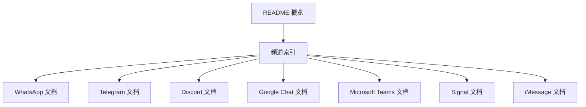
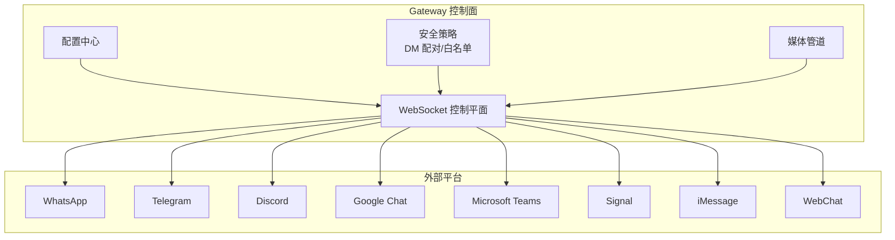
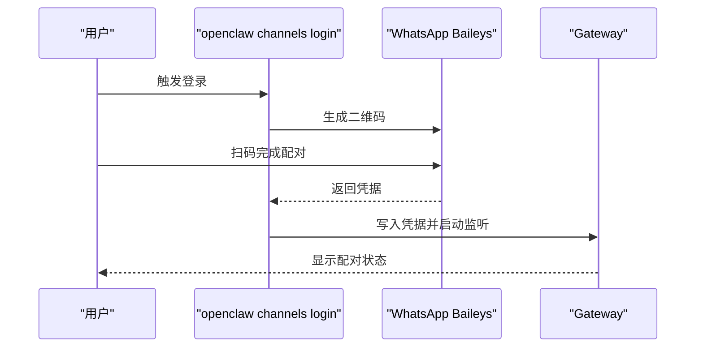
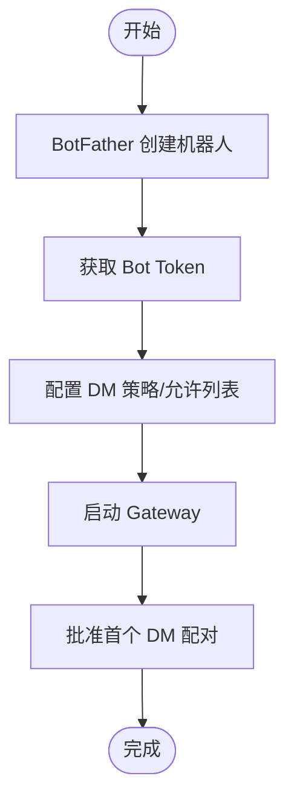
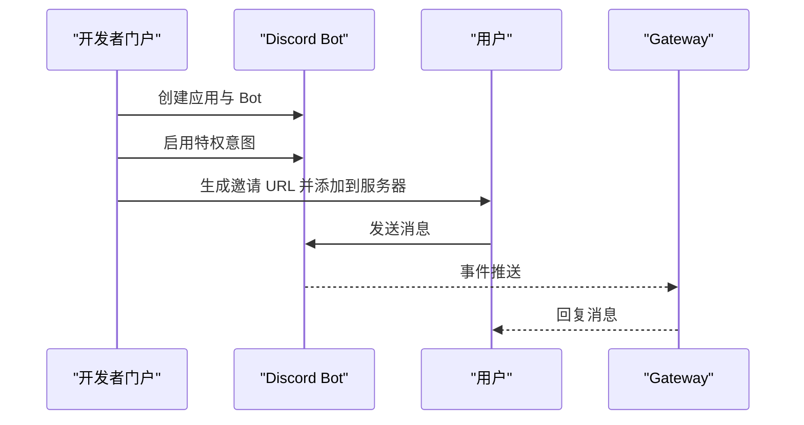
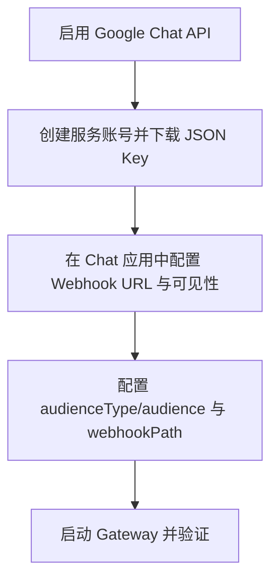
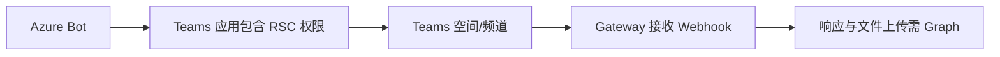
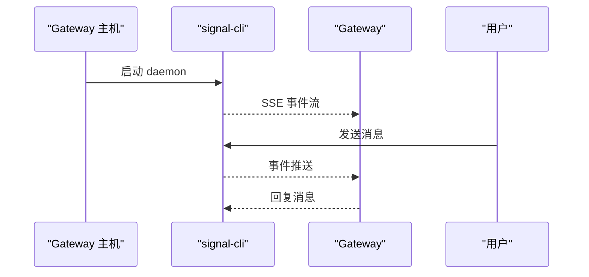
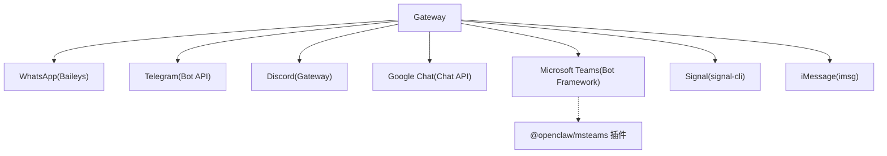

# 支持的频道平台

<cite>
**本文引用的文件**
- [README.md](file://README.md)
- [docs/channels/index.md](file://docs/channels/index.md)
- [docs/channels/whatsapp.md](file://docs/channels/whatsapp.md)
- [docs/channels/telegram.md](file://docs/channels/telegram.md)
- [docs/channels/discord.md](file://docs/channels/discord.md)
- [docs/channels/signal.md](file://docs/channels/signal.md)
- [docs/channels/imessage.md](file://docs/channels/imessage.md)
- [docs/channels/msteams.md](file://docs/channels/msteams.md)
- [docs/channels/googlechat.md](file://docs/channels/googlechat.md)
</cite>

## 目录

1. [简介](#简介)
2. [项目结构](#项目结构)
3. [核心组件](#核心组件)
4. [架构总览](#架构总览)
5. [详细组件分析](#详细组件分析)
6. [依赖关系分析](#依赖关系分析)
7. [性能考量](#性能考量)
8. [故障排查指南](#故障排查指南)
9. [结论](#结论)
10. [附录](#附录)

## 简介

本文件系统性梳理 OpenClaw 支持的即时通讯平台，覆盖 20+ 频道平台：WhatsApp、Telegram、Discord、Slack、Google Chat、Signal、iMessage、BlueBubbles、Microsoft Teams、Feishu、Mattermost、Synology Chat、LINE、Nextcloud Talk、Matrix、Nostr、Tlon、Twitch、Zalo、Zalo Personal，并补充 WebChat。内容包括各平台特性与优势、配置复杂度、功能支持程度（文本、媒体、反应等）、快速设置指南、配置要求、QR 配对流程、API 密钥获取方法，以及性能表现、安全考量与适用场景对比，帮助用户做出最佳选择。

## 项目结构

- 平台概览与入口位于文档索引页，按平台维度拆分到独立文档，便于深入查阅。
- README 提供高层能力与平台清单，作为快速导航入口。
- 各平台文档包含“快速设置”“访问控制”“功能参考”“故障排查”等章节，形成标准化知识结构。

**图表来源**

- [README.md](file://README.md#L21-L27)
- [docs/channels/index.md](file://docs/channels/index.md#L14-L37)

**章节来源**

- [README.md](file://README.md#L21-L27)
- [docs/channels/index.md](file://docs/channels/index.md#L14-L37)

## 核心组件

- 渠道通道（Channel）：统一通过 Gateway 控制面连接各聊天平台，实现会话路由、消息编解码、媒体处理与动作执行。
- 安全模型：默认 DM 配对策略（pairing），允许通过命令行批准未知发件人；支持 allowlist 与 open 策略；可针对群组与 DM 分别配置。
- 多账号与凭据：多数平台支持多账户配置与凭据存储路径；部分平台（如 WhatsApp）使用本地 Baileys 凭据文件。
- 功能矩阵：文本发送/接收、媒体（图片/视频/音频/文件）、反应（ack/reaction）、回复/引用、线程/话题、工具动作（发送、删除、编辑、贴纸、投票等）。

**章节来源**

- [README.md](file://README.md#L118-L124)
- [docs/channels/whatsapp.md](file://docs/channels/whatsapp.md#L134-L200)
- [docs/channels/telegram.md](file://docs/channels/telegram.md#L105-L218)
- [docs/channels/discord.md](file://docs/channels/discord.md#L366-L456)
- [docs/channels/googlechat.md](file://docs/channels/googlechat.md#L139-L151)

## 架构总览

下图展示 Gateway 与各平台的交互关系，强调“统一控制面 + 多通道接入”的设计。

**图表来源**

- [README.md](file://README.md#L187-L202)
- [docs/channels/index.md](file://docs/channels/index.md#L14-L37)

## 详细组件分析

### WhatsApp

- 特点与优势
  - 基于 Baileys 的 WhatsApp Web 通道，生产可用。
  - 支持 DM 与群组，具备自聊天保护、历史上下文注入、媒体占位符与分块发送。
- 配置复杂度：中高（需 QR 登录、凭据管理、多账号配置）
- 功能支持
  - 文本：支持
  - 媒体：图片/视频/音频/文档，带占位符与自动优化
  - 反应：ack 反应（可选）
  - 群组：允许列表/开放/禁用，提及触发
- 快速设置
  - 配置 DM 策略与允许列表
  - 执行登录生成 QR，扫码链接
  - 启动网关，批准首次配对请求
- API/密钥：无 API Key；依赖 Baileys 凭据文件
- 安全与性能
  - 默认 pairing DM 策略；建议专用号码
  - 自动重连与断线恢复；媒体大小限制与回退策略

**图表来源**

- [docs/channels/whatsapp.md](file://docs/channels/whatsapp.md#L24-L76)

**章节来源**

- [docs/channels/whatsapp.md](file://docs/channels/whatsapp.md#L10-L124)
- [docs/channels/whatsapp.md](file://docs/channels/whatsapp.md#L126-L200)
- [docs/channels/whatsapp.md](file://docs/channels/whatsapp.md#L292-L315)
- [docs/channels/whatsapp.md](file://docs/channels/whatsapp.md#L342-L363)
- [docs/channels/whatsapp.md](file://docs/channels/whatsapp.md#L373-L423)

### Telegram

- 特点与优势
  - grammY Bot API，长轮询/Webhook 双模式；支持群组话题、内联按钮、贴纸搜索、流式预览。
- 配置复杂度：中（Bot Token、隐私模式、权限）
- 功能支持
  - 文本：支持；Markdown 转换为 HTML
  - 媒体：图片/视频/音频/文件；贴纸缓存
  - 反应：反应通知级别与 ack 反应
  - 群组：话题隔离、提及触发、自定义命令菜单
- 快速设置
  - BotFather 获取 Token
  - 配置 DM 策略与允许列表
  - 启动网关并批准首个 DM
  - 可选：启用 Webhook 与代理
- API/密钥：Bot Token（可环境变量或配置）
- 安全与性能
  - 隐私模式影响群组可见性；管理员可接收全部消息
  - 网络不稳定时可配置代理与 DNS 选项

**图表来源**

- [docs/channels/telegram.md](file://docs/channels/telegram.md#L24-L69)

**章节来源**

- [docs/channels/telegram.md](file://docs/channels/telegram.md#L8-L103)
- [docs/channels/telegram.md](file://docs/channels/telegram.md#L105-L218)
- [docs/channels/telegram.md](file://docs/channels/telegram.md#L230-L650)
- [docs/channels/telegram.md](file://docs/channels/telegram.md#L652-L717)
- [docs/channels/telegram.md](file://docs/channels/telegram.md#L721-L794)

### Discord

- 特点与优势
  - 官方 Gateway，支持服务器/频道/DM；组件容器、模态表单、论坛/媒体频道线程、PluralKit 解析。
- 配置复杂度：高（开发者门户、权限、意图、邀请链接）
- 功能支持
  - 文本：支持；流式预览
  - 媒体：附件上传；线程绑定会话
  - 反应：反应通知与 ack 反应
  - 群组：角色路由、提及触发、线程绑定子代理
- 快速设置
  - 开发者门户创建应用与 Bot，启用特权意图
  - 生成邀请 URL 并添加到服务器
  - 配置 Token、ID、DM 策略与允许列表
  - 启动网关并批准首个 DM
- API/密钥：Bot Token（可环境变量）
- 安全与性能
  - 需要 Message Content Intent；网络不稳定时注意超时与重试

**图表来源**

- [docs/channels/discord.md](file://docs/channels/discord.md#L24-L165)

**章节来源**

- [docs/channels/discord.md](file://docs/channels/discord.md#L8-L533)
- [docs/channels/discord.md](file://docs/channels/discord.md#L550-L800)

### Google Chat

- 特点与优势
  - Chat API Webhook（HTTP），支持 DM 与空间；服务账号鉴权；仅暴露 /googlechat 路径更安全。
- 配置复杂度：中（Cloud 项目、服务账号、Webhook URL）
- 功能支持
  - 文本：支持
  - 媒体：下载并通过媒体管道处理
  - 反应：工具与动作
  - 群组：@提及触发
- 快速设置
  - 启用 API、创建服务账号、下载 JSON Key
  - 在 Chat 应用中配置 Webhook URL 与可见性
  - 配置 audience 类型与值，启动网关
- API/密钥：服务账号 JSON Key 或 SecretRef
- 安全与性能
  - 仅公开 /googlechat 路径；支持 Tailscale Funnel；可配置 typing indicator

**图表来源**

- [docs/channels/googlechat.md](file://docs/channels/googlechat.md#L12-L51)

**章节来源**

- [docs/channels/googlechat.md](file://docs/channels/googlechat.md#L8-L206)
- [docs/channels/googlechat.md](file://docs/channels/googlechat.md#L207-L260)

### Microsoft Teams

- 特点与优势
  - 插件化（需单独安装）；支持 DM、群聊/频道、文件上传（需 Graph 权限）；投票以 Adaptive Cards 实现。
- 配置复杂度：高（Azure Bot、应用包、RSC/Graph 权限）
- 功能支持
  - 文本：支持
  - 媒体：DM 文件、群组文件需 SharePoint + Graph
  - 反应：受限（基于 Webhook 时限）
  - 群组：@提及触发、回复风格（Threads/Posts）
- 快速设置
  - 安装插件、创建 Azure Bot、生成应用包（含 RSC 权限）
  - 配置 webhook 端口与路径，启动网关
  - 可选：启用 Graph 权限以支持历史与媒体下载
- API/密钥：App ID/Password/Tenant ID（可环境变量）
- 安全与性能
  - webhook 超时风险；Graph 权限需管理员同意；回复风格需按频道配置

**图表来源**

- [docs/channels/msteams.md](file://docs/channels/msteams.md#L16-L39)

**章节来源**

- [docs/channels/msteams.md](file://docs/channels/msteams.md#L8-L777)

### Signal

- 特点与优势
  - 通过 signal-cli JSON-RPC + SSE；隐私优先；DM 与群组隔离。
- 配置复杂度：中（signal-cli 安装、QR/SMS 注册、CLI 路径）
- 功能支持
  - 文本：支持；分块发送
  - 媒体：支持；可忽略下载
  - 反应：工具动作与级别控制
  - 群组：sender allowlist 与提及触发
- 快速设置
  - 安装 signal-cli，选择 QR 链接或短信注册
  - 配置 account/cliPath/dmPolicy/allowFrom
  - 启动网关并批准 DM 配对
- API/密钥：无 API Key；依赖 signal-cli 进程
- 安全与性能
  - 建议专用号码；可配置 read receipts；支持 typing indicator

**图表来源**

- [docs/channels/signal.md](file://docs/channels/signal.md#L165-L181)

**章节来源**

- [docs/channels/signal.md](file://docs/channels/signal.md#L9-L326)

### iMessage（遗留）

- 特点与优势
  - 通过 imsg JSON-RPC over stdio；适合 macOS 本地或远程 SSH 场景。
- 配置复杂度：中（权限、数据库路径、SSH 包装脚本）
- 功能支持
  - 文本：支持
  - 媒体：可选下载；SCP 远端附件
  - 群组：基于正则模式的提及检测
- 快速设置
  - 安装 imsg，配置 cliPath/dbPath
  - 启动网关并批准 DM 配对
- API/密钥：无 API Key；依赖本地/远程进程
- 安全与性能
  - 需 Full Disk Access 与 Automation 权限；建议专用 macOS 用户

**章节来源**

- [docs/channels/imessage.md](file://docs/channels/imessage.md#L9-L368)

## 依赖关系分析

- 平台依赖
  - 外部 CLI：WhatsApp（Baileys）、Signal（signal-cli）、iMessage（imsg）
  - 第三方 API：Telegram（Bot API）、Discord（Gateway）、Google Chat（Chat API）、Microsoft Teams（Bot Framework + Graph）
  - 插件：Microsoft Teams（需单独安装）
- 耦合与内聚
  - Gateway 对各平台采用统一适配器模式，保持通道层内聚、平台间低耦合
  - 安全与媒体处理在 Gateway 内统一实现，减少平台差异带来的复杂度

**图表来源**

- [docs/channels/index.md](file://docs/channels/index.md#L14-L37)
- [docs/channels/msteams.md](file://docs/channels/msteams.md#L16-L39)

**章节来源**

- [docs/channels/index.md](file://docs/channels/index.md#L14-L37)
- [docs/channels/msteams.md](file://docs/channels/msteams.md#L16-L39)

## 性能考量

- 传输与并发
  - Telegram/WhatsApp 使用长轮询或 WebSocket；Discord 使用官方 Gateway；Google Chat/Teams 使用 HTTP Webhook
  - Gateway 通过并发与队列控制下游调用速率，避免平台限流
- 媒体与存储
  - 各平台媒体大小限制与自动优化；下载媒体受 Gateway 媒体管道约束
- 响应时间
  - Teams webhook 存在超时风险，需尽快返回并异步处理
  - Signal/WhatsApp/Telegram 的 ack/reaction 可提升感知延迟

[本节为通用指导，无需特定文件引用]

## 故障排查指南

- 通用步骤
  - 查看状态与日志：`openclaw status`、`openclaw channels status --probe`、`openclaw logs --follow`
  - 运行健康检查：`openclaw doctor`
- 平台特定
  - Telegram：隐私模式、DNS/IPv6、代理与网络配置
  - WhatsApp：QR 登录、断线重连、分组历史注入
  - Discord：意图权限、代理与超时、PluralKit 解析
  - Google Chat：Webhook URL、audience 配置、路径暴露
  - Microsoft Teams：RSC/Graph 权限、文件上传 SharePoint、回复风格
  - Signal：daemon 可达性、配对状态、UUID 允许列表
  - iMessage：权限提示、远程附件 SCP、数据库路径

**章节来源**

- [docs/channels/telegram.md](file://docs/channels/telegram.md#L652-L717)
- [docs/channels/whatsapp.md](file://docs/channels/whatsapp.md#L373-L423)
- [docs/channels/discord.md](file://docs/channels/discord.md#L550-L800)
- [docs/channels/googlechat.md](file://docs/channels/googlechat.md#L207-L260)
- [docs/channels/msteams.md](file://docs/channels/msteams.md#L745-L777)
- [docs/channels/signal.md](file://docs/channels/signal.md#L251-L286)
- [docs/channels/imessage.md](file://docs/channels/imessage.md#L304-L360)

## 结论

- 选择建议
  - 快速上手：Telegram（最简配置）
  - 企业/团队协作：Discord（组件丰富）、Microsoft Teams（插件化）
  - 私密通信：Signal（隐私优先）
  - 跨平台桌面：iMessage（推荐 BlueBubbles）、WhatsApp（专用号码）
  - 云端集成：Google Chat（服务账号 + Webhook）
- 最佳实践
  - 默认 DM pairing 策略，逐步放行 allowlist
  - 针对平台特性启用流式预览、反应与媒体优化
  - 为 Teams/Google Chat 等需要鉴权的平台配置最小权限与安全暴露

[本节为总结性内容，无需特定文件引用]

## 附录

- 其他支持平台（插件/扩展）
  - Slack、Feishu、Mattermost、Synology Chat、LINE、Nextcloud Talk、Matrix、Nostr、Tlon、Twitch、Zalo、Zalo Personal、WebChat
  - 说明：这些平台通常以插件形式提供，安装后即可启用；具体配置遵循各平台文档与插件说明

**章节来源**

- [docs/channels/index.md](file://docs/channels/index.md#L14-L37)
- [README.md](file://README.md#L21-L27)
