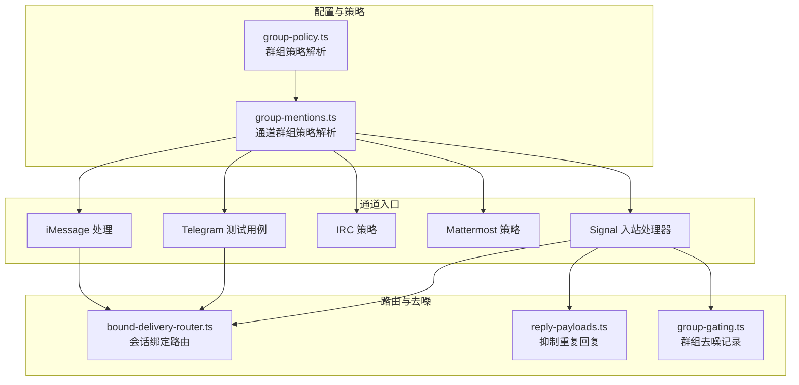
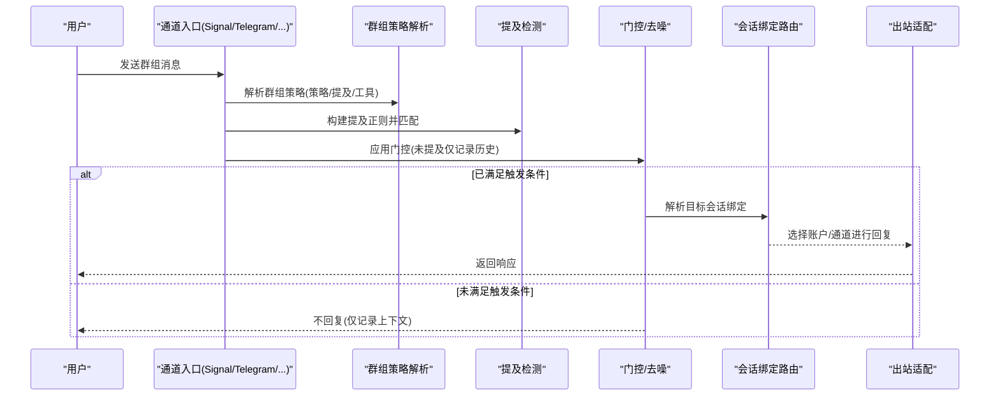
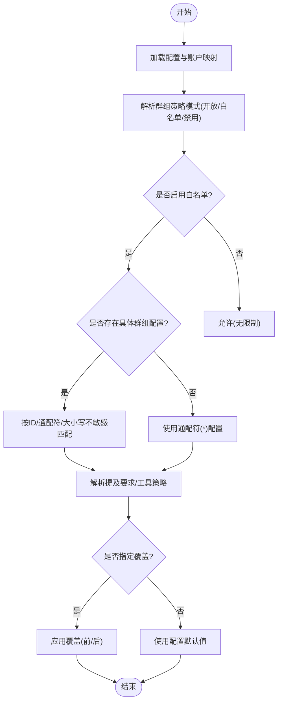
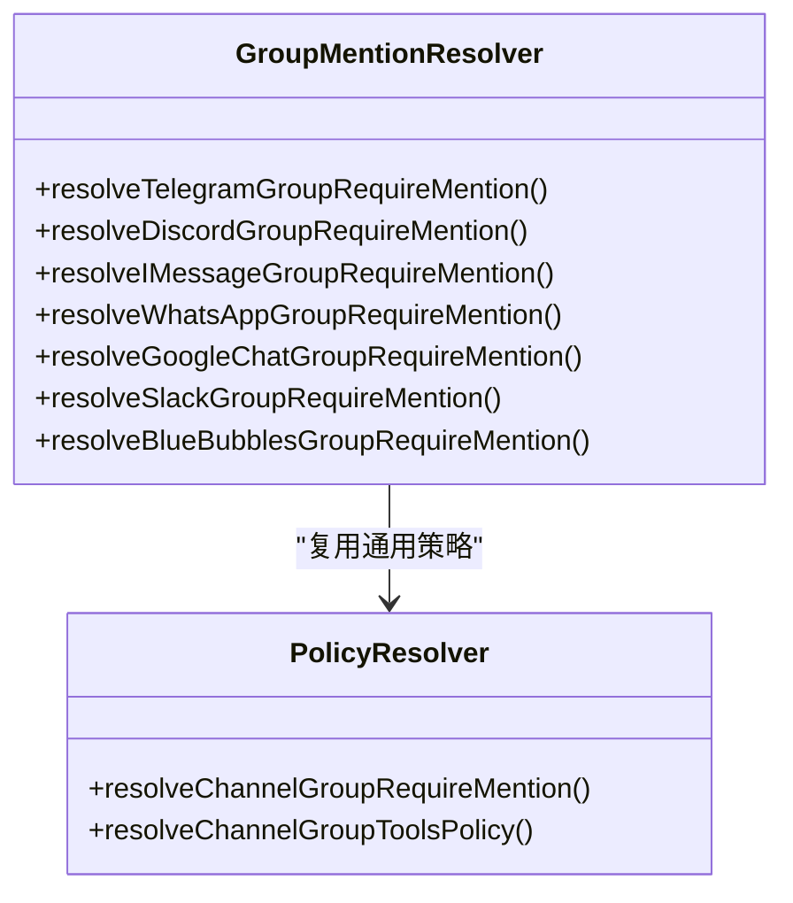
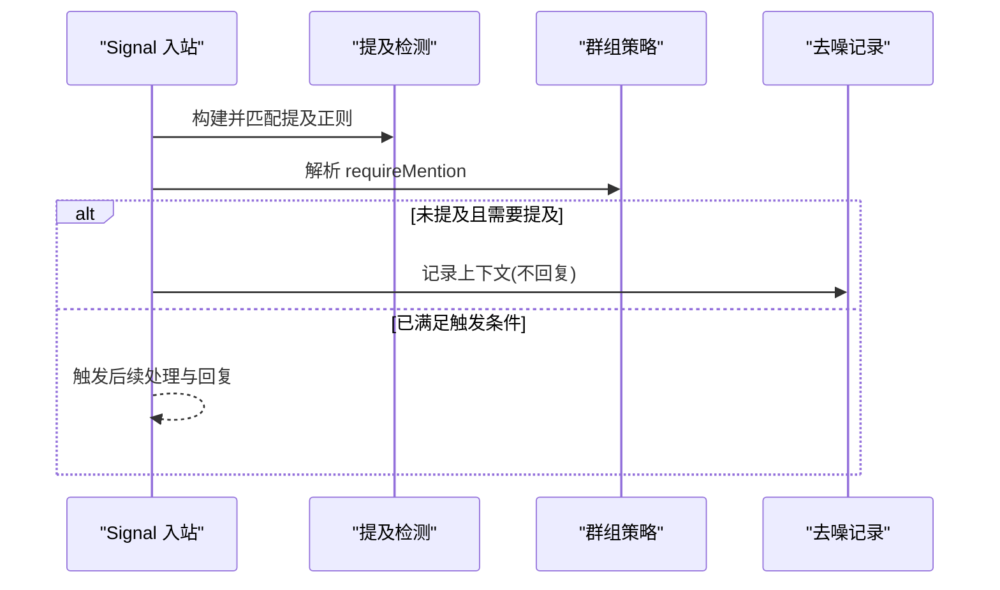
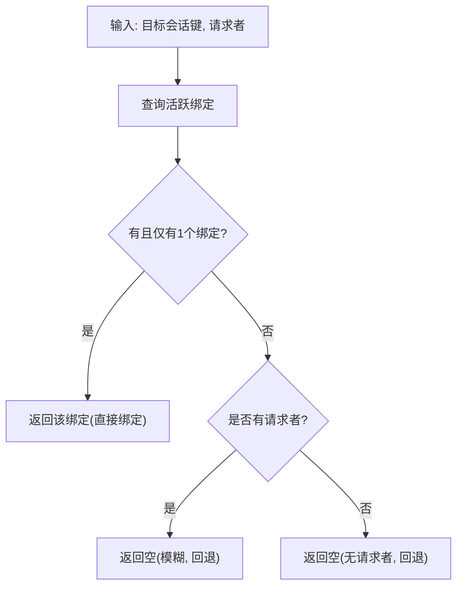
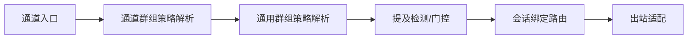

# 群组消息处理

<cite>
**本文引用的文件**
- [group-mentions.ts](file://src/channels/plugins/group-mentions.ts)
- [group-policy.ts](file://src/config/group-policy.ts)
- [types.core.ts](file://src/channels/plugins/types.core.ts)
- [event-handler.ts](file://src/signal/monitor/event-handler.ts)
- [event-handler.mention-gating.test.ts](file://src/signal/monitor/event-handler.mention-gating.test.ts)
- [bot.create-telegram-bot.test.ts](file://src/telegram/bot.create-telegram-bot.test.ts)
- [policy.ts](file://extensions/irc/src/policy.ts)
- [group-mentions.ts（Mattermost）](file://extensions/mattermost/src/group-mentions.ts)
- [groups.md](file://docs/channels/groups.md)
- [bound-delivery-router.ts](file://src/infra/outbound/bound-delivery-router.ts)
- [fix.ts](file://src/security/fix.ts)
- [monitor.inbound-processing.ts](file://src/imessage/monitor/inbound-processing.ts)
- [reply-payloads.ts](file://src/auto-reply/reply/reply-payloads.ts)
- [group-gating.ts](file://src/web/auto-reply/monitor/group-gating.ts)
</cite>

## 目录

1. [简介](#简介)
2. [项目结构](#项目结构)
3. [核心组件](#核心组件)
4. [架构总览](#架构总览)
5. [详细组件分析](#详细组件分析)
6. [依赖关系分析](#依赖关系分析)
7. [性能考量](#性能考量)
8. [故障排查指南](#故障排查指南)
9. [结论](#结论)
10. [附录](#附录)

## 简介

本文件系统化阐述 OpenClaw 对“群组消息”的支持与处理机制，覆盖以下关键能力：

- 群组识别：在多通道（如 Telegram、Signal、Discord、Slack、iMessage、IRC、Mattermost 等）中统一识别群组上下文
- 消息路由：基于群组上下文与会话绑定进行目标解析与路由
- 线程绑定：通过会话键与账户绑定实现稳定的消息回路
- 命令门控：基于“提及”与“工具策略”的触发与访问控制
- 提及过滤：按群组策略与全局/代理级配置决定是否允许回复
- 权限控制：跨通道的群组策略（开放/白名单/禁用）、发送者白名单、工具策略
- 消息去噪：未被提及的群消息可仅记录上下文而不回复，避免噪声
- 配置选项：群组策略、提及要求、工具策略、话题/子频道粒度配置
- 安全与合规：默认白名单策略、自动修复、最小权限原则

## 项目结构

围绕群组消息处理的关键模块分布如下：

- 配置与策略解析：负责从配置中解析群组策略、提及要求、工具策略
- 通道适配层：为各通道提供群组上下文解析与策略应用
- 入站处理管线：在各通道入口处执行门控、提及检测、历史记录等
- 出站路由：根据会话绑定与请求者信息选择合适的账户/通道进行回复
- 文档与测试：提供行为说明与端到端验证

**图表来源**

- [group-policy.ts](file://src/config/group-policy.ts#L325-L389)
- [group-mentions.ts](file://src/channels/plugins/group-mentions.ts#L222-L288)
- [event-handler.ts](file://src/signal/monitor/event-handler.ts#L552-L592)
- [bot.create-telegram-bot.test.ts](file://src/telegram/bot.create-telegram-bot.test.ts#L914-L1009)
- [policy.ts](file://extensions/irc/src/policy.ts#L80-L115)
- [group-mentions.ts（Mattermost）](file://extensions/mattermost/src/group-mentions.ts#L4-L15)
- [bound-delivery-router.ts](file://src/infra/outbound/bound-delivery-router.ts#L55-L91)
- [reply-payloads.ts](file://src/auto-reply/reply/reply-payloads.ts#L147-L183)
- [group-gating.ts](file://src/web/auto-reply/monitor/group-gating.ts#L38-L80)

**章节来源**

- [groups.md](file://docs/channels/groups.md#L1-L39)

## 核心组件

- 群组策略解析器：从配置中解析群组策略（开放/白名单/禁用）、提及要求、工具策略，并支持按发送者细化
- 通道群组策略解析器：针对不同通道（Telegram、Discord、Signal、iMessage、IRC、Mattermost 等）解析群组/话题/子频道粒度的策略
- 入站门控与去噪：在通道入口检测提及、应用群组策略、必要时仅记录上下文而不回复
- 会话绑定路由：根据目标会话键与请求者信息选择绑定的账户/通道进行出站
- 去重与抑制：避免同一来源在同通道同目标重复回复造成噪声

**章节来源**

- [group-policy.ts](file://src/config/group-policy.ts#L325-L429)
- [group-mentions.ts](file://src/channels/plugins/group-mentions.ts#L222-L325)
- [event-handler.ts](file://src/signal/monitor/event-handler.ts#L552-L592)
- [bound-delivery-router.ts](file://src/infra/outbound/bound-delivery-router.ts#L55-L91)
- [reply-payloads.ts](file://src/auto-reply/reply/reply-payloads.ts#L147-L183)

## 架构总览

下图展示从入站到出站的关键流程，以及与群组策略的交互点。

**图表来源**

- [event-handler.ts](file://src/signal/monitor/event-handler.ts#L552-L592)
- [group-policy.ts](file://src/config/group-policy.ts#L361-L389)
- [bound-delivery-router.ts](file://src/infra/outbound/bound-delivery-router.ts#L55-L91)
- [group-gating.ts](file://src/web/auto-reply/monitor/group-gating.ts#L71-L80)

## 详细组件分析

### 组件A：群组策略解析（通用）

- 功能要点
  - 支持按群组 ID、通配符、大小写不敏感匹配
  - 支持账户级覆盖与优先级
  - 支持“提及要求”与“工具策略”，并按发送者细化
  - 默认值与覆盖顺序可配置（先覆盖或后覆盖）
- 关键路径
  - 群组策略解析：[resolveChannelGroupPolicy](file://src/config/group-policy.ts#L325-L359)
  - 提及要求解析：[resolveChannelGroupRequireMention](file://src/config/group-policy.ts#L361-L389)
  - 工具策略解析（含发送者维度）：[resolveChannelGroupToolsPolicy](file://src/config/group-policy.ts#L391-L428)

**图表来源**

- [group-policy.ts](file://src/config/group-policy.ts#L325-L389)

**章节来源**

- [group-policy.ts](file://src/config/group-policy.ts#L282-L429)

### 组件B：通道群组策略解析（多通道）

- 功能要点
  - Telegram：支持按 chatId/topicId 的细粒度配置；支持通配符
  - Discord：支持按服务器/频道 slug 或 ID 匹配；支持通配符
  - Signal/iMessage/WhatsApp/Google Chat/BlueBubbles：统一走通道级 requireMention 解析
  - Mattermost：支持账户级 requireMention 覆盖
  - IRC：支持 allowlist/禁用/开放策略与 per-channel/wildcard 控制
- 关键路径
  - Telegram 解析：[parseTelegramGroupId / resolveTelegramRequireMention](file://src/channels/plugins/group-mentions.ts#L22-L69)
  - Discord 解析：[resolveDiscordGuildEntry / resolveDiscordChannelEntry](file://src/channels/plugins/group-mentions.ts#L71-L110)
  - 通用通道解析：[resolveChannelRequireMention / resolveChannelGroupRequireMention](file://src/channels/plugins/group-mentions.ts#L159-L170)
  - Mattermost 解析：[resolveMattermostGroupRequireMention](file://extensions/mattermost/src/group-mentions.ts#L4-L15)
  - IRC 解析：[resolveIrcRequireMention](file://extensions/irc/src/policy.ts#L104-L115)

**图表来源**

- [group-mentions.ts](file://src/channels/plugins/group-mentions.ts#L222-L325)
- [group-policy.ts](file://src/config/group-policy.ts#L361-L428)

**章节来源**

- [group-mentions.ts](file://src/channels/plugins/group-mentions.ts#L1-L325)
- [group-mentions.ts（Mattermost）](file://extensions/mattermost/src/group-mentions.ts#L1-L15)
- [policy.ts](file://extensions/irc/src/policy.ts#L80-L115)

### 组件C：入站门控与去噪（以 Signal 为例）

- 功能要点
  - 构建提及正则并检测是否被提及
  - 按通道群组策略决定是否需要提及
  - 若未满足触发条件且允许去噪，则仅记录上下文，不回复
- 关键路径
  - Signal 入站门控与去噪：[event-handler.ts](file://src/signal/monitor/event-handler.ts#L552-L592)
  - 去噪记录逻辑：[group-gating.ts](file://src/web/auto-reply/monitor/group-gating.ts#L71-L80)

**图表来源**

- [event-handler.ts](file://src/signal/monitor/event-handler.ts#L552-L592)
- [group-gating.ts](file://src/web/auto-reply/monitor/group-gating.ts#L71-L80)

**章节来源**

- [event-handler.ts](file://src/signal/monitor/event-handler.ts#L552-L592)
- [event-handler.mention-gating.test.ts](file://src/signal/monitor/event-handler.mention-gating.test.ts#L104-L115)

### 组件D：会话绑定路由

- 功能要点
  - 根据目标会话键查找活跃绑定
  - 在存在请求者时进行精确绑定，否则回退
- 关键路径
  - [createBoundDeliveryRouter](file://src/infra/outbound/bound-delivery-router.ts#L55-L91)

**图表来源**

- [bound-delivery-router.ts](file://src/infra/outbound/bound-delivery-router.ts#L55-L91)

**章节来源**

- [bound-delivery-router.ts](file://src/infra/outbound/bound-delivery-router.ts#L55-L91)

### 组件E：消息去重与抑制

- 功能要点
  - 判断是否应抑制来自同一来源、同一目标的重复回复
- 关键路径
  - [shouldSuppressMessagingToolReplies](file://src/auto-reply/reply/reply-payloads.ts#L147-L183)

**章节来源**

- [reply-payloads.ts](file://src/auto-reply/reply/reply-payloads.ts#L147-L183)

## 依赖关系分析

- 低耦合高内聚：通用策略解析独立于通道实现，通道侧仅负责上下文解析与覆盖
- 可扩展性：新增通道只需实现群组上下文解析与策略调用
- 依赖链
  - 通道入口 → 群组策略解析 → 提及检测 → 门控/去噪 → 路由 → 出站
  - 会话绑定服务贯穿路由阶段

**图表来源**

- [group-mentions.ts](file://src/channels/plugins/group-mentions.ts#L222-L325)
- [group-policy.ts](file://src/config/group-policy.ts#L325-L389)
- [bound-delivery-router.ts](file://src/infra/outbound/bound-delivery-router.ts#L55-L91)

**章节来源**

- [group-mentions.ts](file://src/channels/plugins/group-mentions.ts#L1-L325)
- [group-policy.ts](file://src/config/group-policy.ts#L1-L429)
- [bound-delivery-router.ts](file://src/infra/outbound/bound-delivery-router.ts#L55-L91)

## 性能考量

- 提及检测缓存：构建正则与匹配应避免重复计算
- 历史记录上限：合理设置群组历史记录上限，防止内存膨胀
- 并发与批处理：在工具调用与回复生成中采用批处理与异步模式，减少阻塞
- 会话绑定命中率：确保绑定服务正确维护活跃绑定，降低回退概率

## 故障排查指南

- 群组消息未触发
  - 检查群组策略：是否为“禁用”或“白名单但不在 allowlist”
  - 检查提及要求：是否开启 requireMention 且未被提及
  - 检查工具策略：发送者是否被允许执行相关工具
  - 参考：[groups.md](file://docs/channels/groups.md#L30-L39)
- 去噪生效导致无回复
  - 确认未满足触发条件且允许去噪
  - 查看历史记录是否已保存
  - 参考：[event-handler.ts](file://src/signal/monitor/event-handler.ts#L584-L592)、[group-gating.ts](file://src/web/auto-reply/monitor/group-gating.ts#L71-L80)
- 会话绑定失败
  - 检查目标会话键与请求者信息
  - 确认存在且唯一的活跃绑定
  - 参考：[bound-delivery-router.ts](file://src/infra/outbound/bound-delivery-router.ts#L55-L91)
- 安全策略调整
  - 默认策略可能从“开放”切换为“白名单”，可通过安全修复工具调整
  - 参考：[fix.ts](file://src/security/fix.ts#L186-L229)

**章节来源**

- [groups.md](file://docs/channels/groups.md#L30-L39)
- [event-handler.ts](file://src/signal/monitor/event-handler.ts#L584-L592)
- [group-gating.ts](file://src/web/auto-reply/monitor/group-gating.ts#L71-L80)
- [bound-delivery-router.ts](file://src/infra/outbound/bound-delivery-router.ts#L55-L91)
- [fix.ts](file://src/security/fix.ts#L186-L229)

## 结论

OpenClaw 通过“通用策略解析 + 通道上下文适配”的架构，在多通道上实现了统一的群组消息处理能力。其默认白名单策略与可配置的提及要求、工具策略，既保证了安全性，又提供了灵活的扩展空间。结合会话绑定路由与去噪机制，系统在复杂场景下仍能保持稳定的用户体验与较低的噪声。

## 附录

### 群组配置选项与最佳实践

- 群组策略
  - 开放：未配置时默认允许（仍受提及要求与工具策略约束）
  - 白名单：需在 allowlist 中或显式配置群组才允许
  - 禁用：完全阻止群组消息
- 提及要求
  - requireMention：开启后未提及的消息仅记录上下文
  - mentionPatterns：支持全局与代理级自定义
- 工具策略
  - 支持按发送者细化（id/e164/username/name），并支持通配符
- 最佳实践
  - 默认保留白名单策略，逐步添加允许的群组
  - 为敏感群组开启 requireMention，并限制工具策略
  - 合理设置历史记录上限，避免资源占用
  - 使用会话绑定确保回复一致性

**章节来源**

- [group-policy.ts](file://src/config/group-policy.ts#L325-L429)
- [group-mentions.ts](file://src/channels/plugins/group-mentions.ts#L222-L325)
- [groups.md](file://docs/channels/groups.md#L1-L39)
