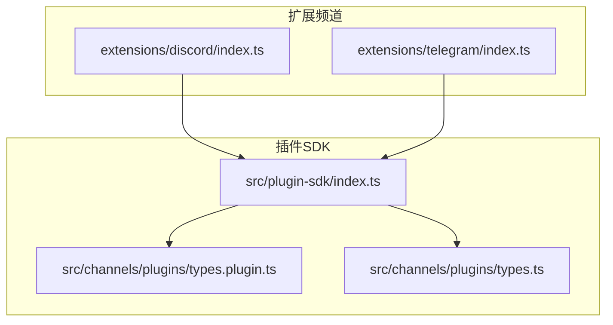
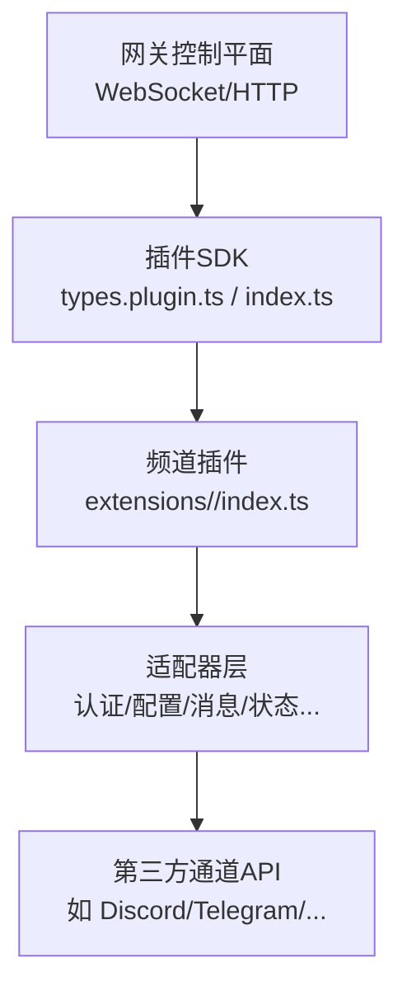
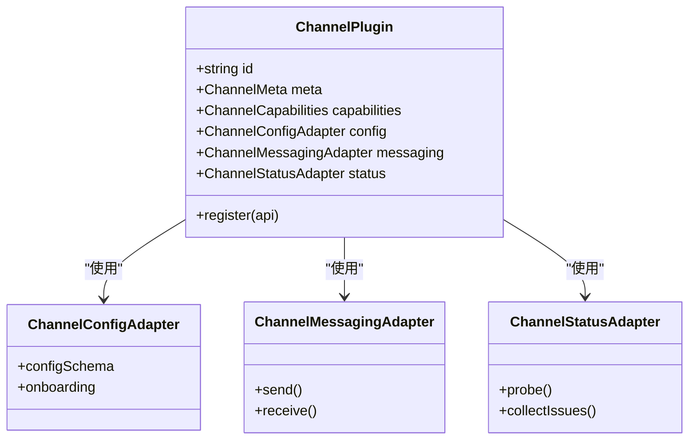
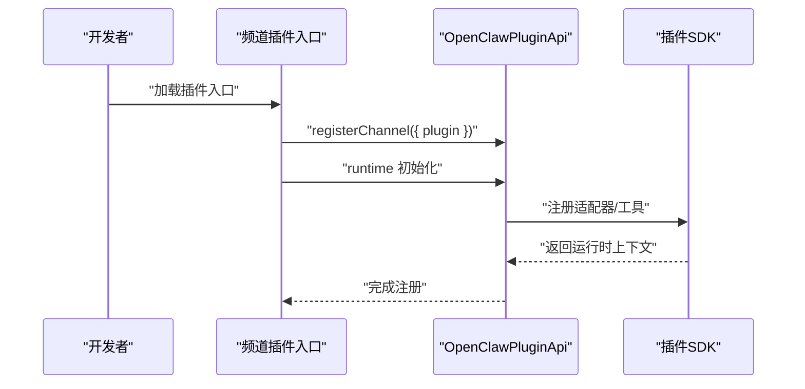
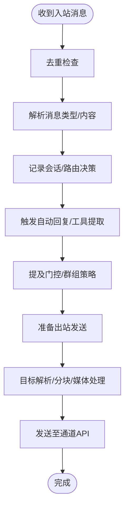
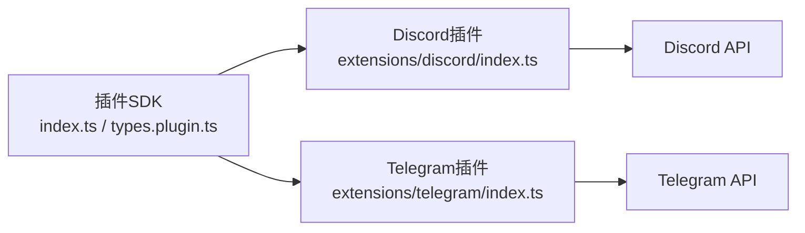

# 自定义频道开发

<cite>
**本文档引用的文件**
- [README.md](file://README.md)
- [index.md](file://docs/channels/index.md)
- [index.ts](file://src/plugin-sdk/index.ts)
- [types.ts](file://src/channels/plugins/types.ts)
- [types.plugin.ts](file://src/channels/plugins/types.plugin.ts)
- [index.ts](file://extensions/discord/index.ts)
- [index.ts](file://extensions/telegram/index.ts)
</cite>

## 目录

1. [简介](#简介)
2. [项目结构](#项目结构)
3. [核心组件](#核心组件)
4. [架构总览](#架构总览)
5. [详细组件分析](#详细组件分析)
6. [依赖关系分析](#依赖关系分析)
7. [性能考量](#性能考量)
8. [故障排查指南](#故障排查指南)
9. [结论](#结论)
10. [附录](#附录)

## 简介

本指南面向希望为 OpenClaw 开发自定义频道适配器（Channel Plugin）的开发者。内容涵盖插件架构、开发环境搭建、接口规范、事件处理机制、消息转换规则、状态同步策略、配置管理、版本兼容性、性能优化与安全考虑，并提供完整的开发示例、代码模板、调试工具与发布流程。

OpenClaw 通过“网关控制平面”统一连接多渠道（如 WhatsApp、Telegram、Discord、Slack、Google Chat、Signal、iMessage、Microsoft Teams、Matrix、Zalo、WebChat 等），频道插件以标准化接口接入，实现认证、消息收发、群组管理、状态检查、心跳、目录解析、动作处理等功能。

## 项目结构

OpenClaw 的频道插件体系由“插件 SDK”和“扩展频道实现”两部分组成：

- 插件 SDK：提供统一的类型定义、工具函数、适配器契约与注册机制，位于 `src/plugin-sdk/`。
- 扩展频道：各平台频道的具体实现，位于 `extensions/<channel>/`，每个频道通过入口文件注册到 OpenClaw。

图表来源

- [index.ts](file://src/plugin-sdk/index.ts#L1-L597)
- [types.plugin.ts](file://src/channels/plugins/types.plugin.ts#L1-L86)
- [types.ts](file://src/channels/plugins/types.ts#L1-L66)
- [index.ts](file://extensions/discord/index.ts#L1-L20)
- [index.ts](file://extensions/telegram/index.ts#L1-L18)

章节来源

- [README.md](file://README.md#L1-L556)
- [index.md](file://docs/channels/index.md#L1-L48)

## 核心组件

- 频道插件契约（ChannelPlugin）
  - 定义了频道插件的最小能力集合：认证、配置、设置、配对、安全、群组、提及、出站消息、状态、网关方法、增强权限、命令、流式传输、线程、消息、代理提示、目录、解析器、动作、心跳、代理工具等。
- 插件注册与运行时
  - 通过 `OpenClawPluginApi.registerChannel()` 注册频道插件；通过 `api.runtime` 获取运行时上下文，用于初始化具体频道的运行时逻辑。
- SDK 导出
  - 统一导出类型、工具函数、状态辅助、配置模式、网络与安全工具、媒体处理、诊断事件等，便于频道实现复用。

章节来源

- [types.plugin.ts](file://src/channels/plugins/types.plugin.ts#L49-L85)
- [index.ts](file://src/plugin-sdk/index.ts#L1-L597)

## 架构总览

下图展示了 OpenClaw 的频道插件在系统中的位置与交互关系：

图表来源

- [types.plugin.ts](file://src/channels/plugins/types.plugin.ts#L49-L85)
- [index.ts](file://src/plugin-sdk/index.ts#L1-L597)
- [index.ts](file://extensions/discord/index.ts#L1-L20)
- [index.ts](file://extensions/telegram/index.ts#L1-L18)

## 详细组件分析

### 频道插件契约与适配器

- 契约要点
  - 必需字段：`id`、`meta`、`capabilities`、`config`、`messaging`、`status` 等。
  - 可选扩展：`setup`、`pairing`、`security`、`groups`、`mentions`、`outbound`、`streaming`、`threading`、`agentPrompt`、`directory`、`resolver`、`actions`、`heartbeat`、`agentTools` 等。
  - 默认行为与热重载：支持配置前缀监听与无操作前缀。
- 适配器职责
  - 认证（OAuth/令牌/二维码登录等）
  - 配置（Schema + UI 提示）
  - 设置（向导式配置）
  - 配对（挑战/批准/撤销）
  - 安全（DM 策略、白名单、访问授权）
  - 群组（成员、权限、工具策略）
  - 提及（@提及门控）
  - 出站消息（目标解析、分块、媒体、回复格式化）
  - 状态（健康检查、问题收集）
  - 网关方法（RPC/HTTP）
  - 增强权限（设备节点能力）
  - 命令（控制命令授权）
  - 流式传输（长轮询/推送）
  - 线程（话题/子线程）
  - 消息（入站解析、去重、类型识别）
  - 代理提示（会话键、转发）
  - 目录（联系人/群组枚举）
  - 解析器（账号/群组/目标解析）
  - 动作（消息级动作，如反应/编辑/删除）
  - 心跳（存活检测）
  - 代理工具（频道专属工具）

图表来源

- [types.plugin.ts](file://src/channels/plugins/types.plugin.ts#L49-L85)
- [types.ts](file://src/channels/plugins/types.ts#L7-L63)

章节来源

- [types.plugin.ts](file://src/channels/plugins/types.plugin.ts#L32-L85)
- [types.ts](file://src/channels/plugins/types.ts#L7-L63)

### 插件注册与运行时

- 典型注册流程
  - 读取空配置 Schema（或自定义 Schema）
  - 初始化频道运行时（如设置运行时上下文）
  - 注册频道插件到 OpenClaw
  - 可选：注册子代理钩子（如 Discord 子代理）
- 运行时上下文
  - 通过 `api.runtime` 访问日志、临时路径、HTTP 路由注册、Webhook 目标解析等能力。

图表来源

- [index.ts](file://extensions/discord/index.ts#L12-L16)
- [index.ts](file://extensions/telegram/index.ts#L11-L14)
- [index.ts](file://src/plugin-sdk/index.ts#L112-L130)

章节来源

- [index.ts](file://extensions/discord/index.ts#L1-L20)
- [index.ts](file://extensions/telegram/index.ts#L1-L18)
- [index.ts](file://src/plugin-sdk/index.ts#L1-L597)

### 事件处理机制

- 入站事件
  - 通过 `ChannelMessagingAdapter.receive()` 接收消息，进行去重、类型识别、会话记录、自动回复触发、工具提取、提及门控、群组策略评估等。
- 出站事件
  - 通过 `ChannelOutboundAdapter.send()` 发送消息，进行目标解析、分块、媒体处理、回复格式化、附件链接、临时下载路径管理等。
- 状态与诊断
  - 通过 `ChannelStatusAdapter.probe()` 和 `collectIssues()` 收集健康状态与问题；通过 SDK 的诊断事件系统上报事件。

图表来源

- [index.ts](file://src/plugin-sdk/index.ts#L224-L229)
- [index.ts](file://src/plugin-sdk/index.ts#L310-L316)
- [index.ts](file://src/plugin-sdk/index.ts#L333-L335)

章节来源

- [index.ts](file://src/plugin-sdk/index.ts#L224-L229)
- [index.ts](file://src/plugin-sdk/index.ts#L310-L316)
- [index.ts](file://src/plugin-sdk/index.ts#L333-L335)

### 消息转换规则

- 文本分块与回复格式化
  - 使用文本分块工具按通道限制拆分；使用回复负载构建器格式化带附件链接的消息。
- 媒体处理
  - 下载/上传媒体、生成临时路径、扩展名与 MIME 类型推断、媒体大小限制。
- 位置信息与命令
  - 位置文本格式化、命令授权与门控、静默回复标记。

章节来源

- [index.ts](file://src/plugin-sdk/index.ts#L235-L238)
- [index.ts](file://src/plugin-sdk/index.ts#L224-L229)
- [index.ts](file://src/plugin-sdk/index.ts#L450-L451)
- [index.ts](file://src/plugin-sdk/index.ts#L338-L339)

### 状态同步策略

- 健康检查与问题收集
  - 各频道实现 `status.probe()` 与 `collectIssues()`，返回探针结果与问题列表。
- 运行时状态摘要
  - 使用 SDK 工具构建基础账户快照与通道状态摘要，汇总令牌与用量信息。
- 状态问题归因
  - 将最后错误映射为状态问题，便于诊断与修复。

章节来源

- [index.ts](file://src/plugin-sdk/index.ts#L134-L139)
- [index.ts](file://src/plugin-sdk/index.ts#L467-L467)

### 配置管理

- 配置 Schema 与 UI 提示
  - 使用 `ChannelConfigSchema` 定义 JSON Schema 与 UI 提示（标签、帮助、高级、敏感、占位符等）。
- 配置变更与热重载
  - 通过 `reload.configPrefixes` 监听配置前缀变化，必要时执行无操作前缀以触发安全刷新。
- 允许列表与门控
  - 允许列表合并与匹配、提及门控、DM 策略评估、命令授权与门控。

章节来源

- [types.plugin.ts](file://src/channels/plugins/types.plugin.ts#L33-L46)
- [types.plugin.ts](file://src/channels/plugins/types.plugin.ts#L58-L58)
- [index.ts](file://src/plugin-sdk/index.ts#L192-L195)
- [index.ts](file://src/plugin-sdk/index.ts#L318-L318)
- [index.ts](file://src/plugin-sdk/index.ts#L320-L322)

### 版本兼容性

- 运行时环境与工具
  - 通过 `RuntimeEnv` 与工具函数（如时间格式化、正则转义、安全解析）保证跨平台一致性。
- 通道特定兼容
  - 不同通道的账号解析、目标规范化、消息动作、线程工具上下文等均有独立实现，确保兼容性。

章节来源

- [index.ts](file://src/plugin-sdk/index.ts#L201-L201)
- [index.ts](file://src/plugin-sdk/index.ts#L274-L277)
- [index.ts](file://src/plugin-sdk/index.ts#L424-L424)

### 性能优化

- 分块与限流
  - 文本分块、队列去抖动（可配置）、媒体大小限制。
- 缓存与去重
  - 入站消息去重缓存、持久化去重存储，避免重复处理。
- 并发与超时
  - 插件命令运行超时控制、HTTP 请求体限制与 SSRF 保护。

章节来源

- [index.ts](file://src/plugin-sdk/index.ts#L235-L235)
- [index.ts](file://src/plugin-sdk/index.ts#L264-L267)
- [index.ts](file://src/plugin-sdk/index.ts#L287-L287)

### 安全考虑

- SSRF 与主机白名单
  - 基于后缀允许列表构建主机白名单策略，阻止私有地址与黑名单域名。
- 请求体限制
  - Webhook 请求体大小限制与错误处理，防止过大请求导致资源耗尽。
- DM 策略与配对
  - DM 策略（开放/配对）、允许列表、配对挑战与批准流程，降低未授权访问风险。

章节来源

- [index.ts](file://src/plugin-sdk/index.ts#L297-L301)
- [index.ts](file://src/plugin-sdk/index.ts#L279-L287)
- [index.ts](file://src/plugin-sdk/index.ts#L414-L421)

## 依赖关系分析

- 插件 SDK 对频道实现的依赖
  - 频道插件通过 SDK 导出的类型与工具函数实现自身功能，遵循统一契约。
- 扩展频道对 SDK 的依赖
  - 各频道入口文件仅负责注册与运行时初始化，具体适配器由频道内部实现。
- 外部依赖
  - 第三方通道 API（如 Discord/Telegram/...），由适配器封装调用。

图表来源

- [index.ts](file://src/plugin-sdk/index.ts#L1-L597)
- [types.plugin.ts](file://src/channels/plugins/types.plugin.ts#L1-L86)
- [index.ts](file://extensions/discord/index.ts#L1-L20)
- [index.ts](file://extensions/telegram/index.ts#L1-L18)

章节来源

- [index.ts](file://src/plugin-sdk/index.ts#L1-L597)
- [types.plugin.ts](file://src/channels/plugins/types.plugin.ts#L1-L86)
- [index.ts](file://extensions/discord/index.ts#L1-L20)
- [index.ts](file://extensions/telegram/index.ts#L1-L18)

## 性能考量

- 合理使用分块与去重
  - 对长文本与高并发场景启用分块与去重，减少重复处理与网络开销。
- 优化媒体处理
  - 控制媒体大小上限、使用临时路径与异步下载，避免阻塞主流程。
- 限制请求体与超时
  - 为 Webhook 与外部 API 调用设置合理超时与请求体上限，提升稳定性。

## 故障排查指南

- 常见问题定位
  - 使用状态适配器收集问题，结合诊断事件系统定位异常。
  - 检查 DM 策略与允许列表配置，确认配对流程是否正确。
- 日志与诊断
  - 使用 SDK 提供的日志传输与诊断事件注册，输出详细上下文。
- 网络与安全
  - 检查 SSRF 策略与请求体限制，确认私有地址与黑名单域名被正确拦截。

章节来源

- [index.ts](file://src/plugin-sdk/index.ts#L427-L449)
- [index.ts](file://src/plugin-sdk/index.ts#L297-L301)
- [index.ts](file://src/plugin-sdk/index.ts#L279-L287)

## 结论

通过标准化的频道插件契约与丰富的 SDK 能力，开发者可以快速、安全地为 OpenClaw 添加新的聊天通道。建议在实现中严格遵循适配器职责、合理使用分块与去重、强化安全策略，并通过状态适配器与诊断事件完善可观测性。

## 附录

### 开发环境搭建

- 运行时要求：Node ≥22
- 推荐包管理器：pnpm（构建源码）、bun（运行 TypeScript 直接执行）
- 建议工作流：安装依赖 → 构建 → 引导向导 → 开发循环（TS 变更自动重载）

章节来源

- [README.md](file://README.md#L52-L111)

### 开发步骤与模板

- 步骤
  - 创建频道入口文件，定义插件 id、名称、描述与空配置 Schema。
  - 实现适配器（至少包含 config、messaging、status）。
  - 在入口中注册频道插件与运行时。
  - 如需 UI 提示，补充 ChannelConfigSchema 与 UI 提示。
- 模板参考
  - Discord 插件入口模板：[extensions/discord/index.ts](file://extensions/discord/index.ts#L1-L20)
  - Telegram 插件入口模板：[extensions/telegram/index.ts](file://extensions/telegram/index.ts#L1-L18)

章节来源

- [index.ts](file://extensions/discord/index.ts#L1-L20)
- [index.ts](file://extensions/telegram/index.ts#L1-L18)

### 接口规范速查

- 必需适配器：config、messaging、status
- 可选适配器：setup、pairing、security、groups、mentions、outbound、streaming、threading、agentPrompt、directory、resolver、actions、heartbeat、agentTools
- 运行时工具：HTTP 路由注册、Webhook 目标解析、状态摘要、SSRF 策略、请求体限制、日志传输、诊断事件

章节来源

- [types.plugin.ts](file://src/channels/plugins/types.plugin.ts#L49-L85)
- [index.ts](file://src/plugin-sdk/index.ts#L112-L130)
- [index.ts](file://src/plugin-sdk/index.ts#L297-L301)
- [index.ts](file://src/plugin-sdk/index.ts#L279-L287)
- [index.ts](file://src/plugin-sdk/index.ts#L427-L449)

### 测试框架与调试工具

- 测试框架：Vitest（单元/集成/端到端）
- 调试工具：日志传输、诊断事件、状态问题收集、请求体限制保护
- 建议实践：为适配器编写单元测试，覆盖消息解析、状态探针、Webhook 处理等关键路径

章节来源

- [README.md](file://README.md#L442-L448)
- [index.ts](file://src/plugin-sdk/index.ts#L427-L449)
- [index.ts](file://src/plugin-sdk/index.ts#L279-L287)

### 发布流程

- 包管理：package.json 中定义插件元数据与入口
- 渠道文档：在 docs/channels 下新增对应平台文档
- 版本与兼容：遵循 OpenClaw 版本通道（stable/beta/dev），确保向后兼容

章节来源

- [index.md](file://docs/channels/index.md#L1-L48)
- [README.md](file://README.md#L83-L90)
