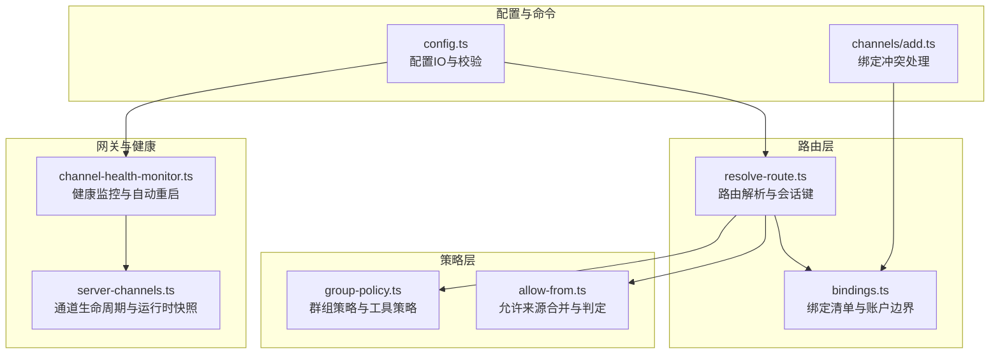
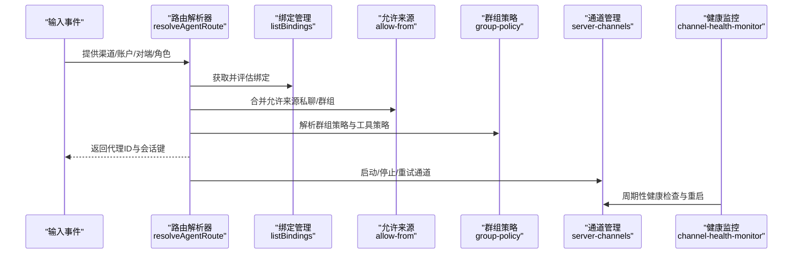
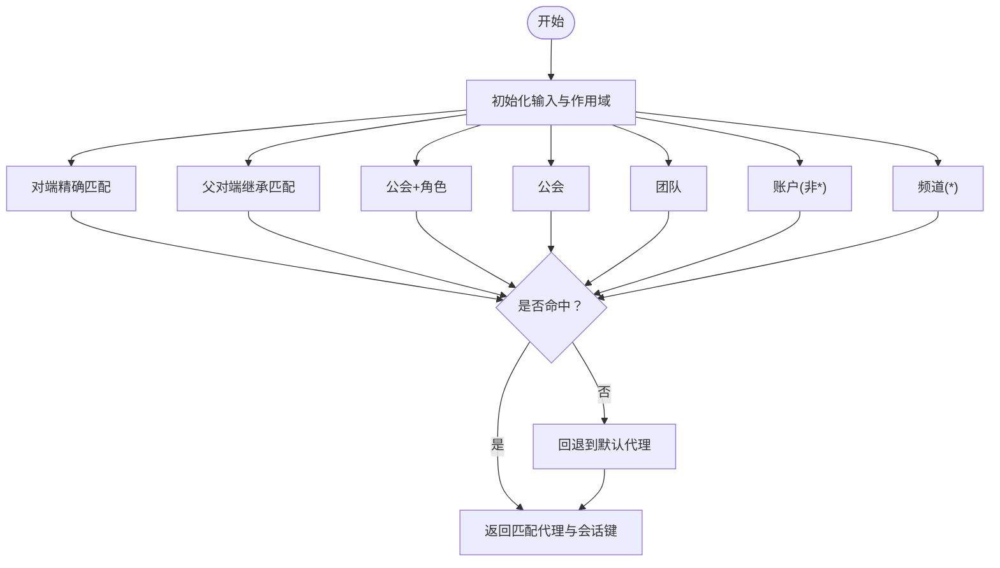
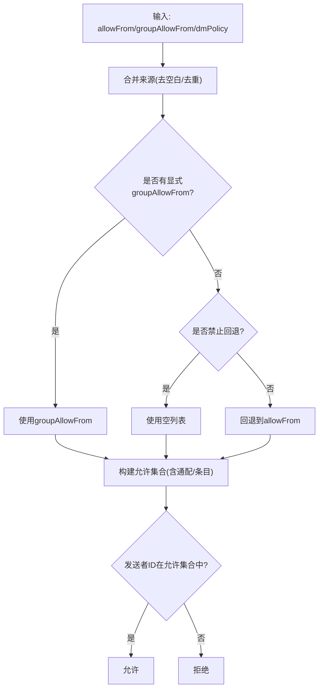
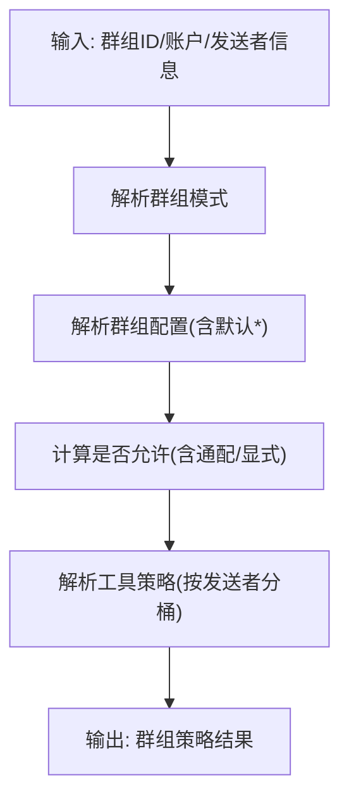
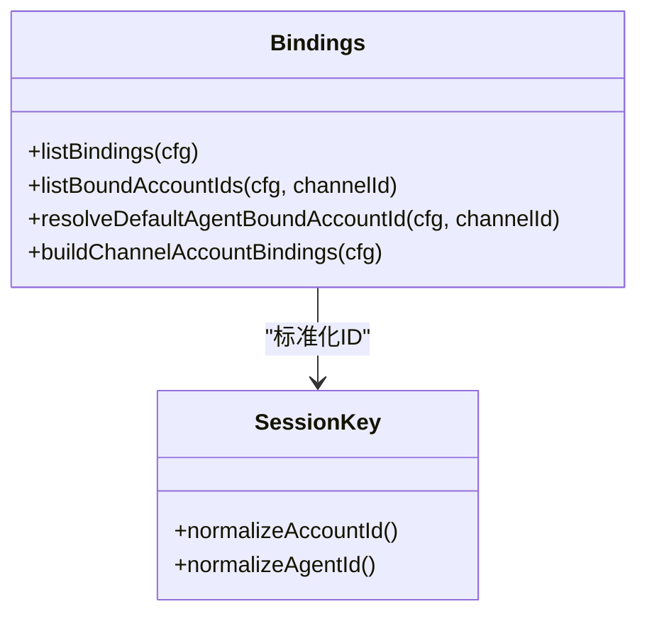
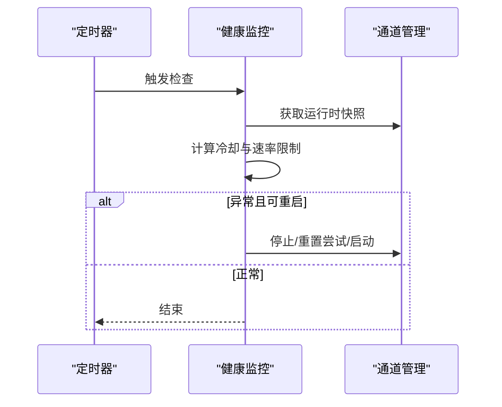
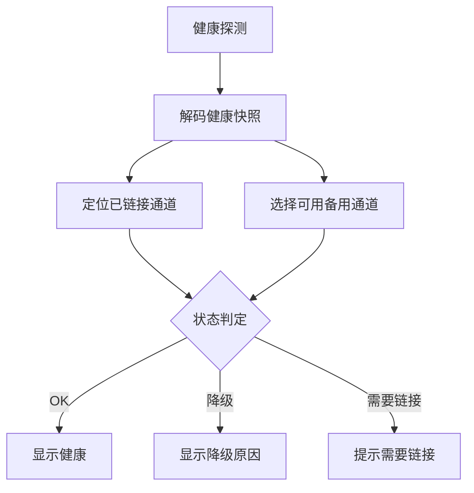
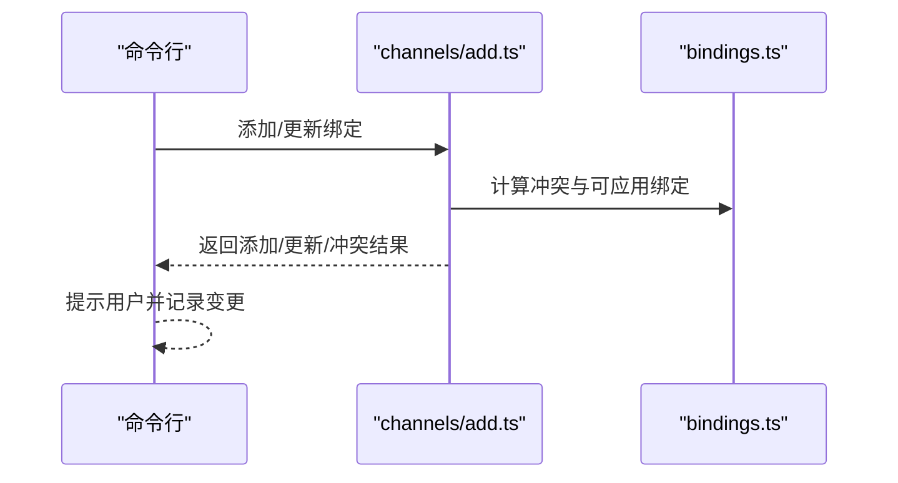
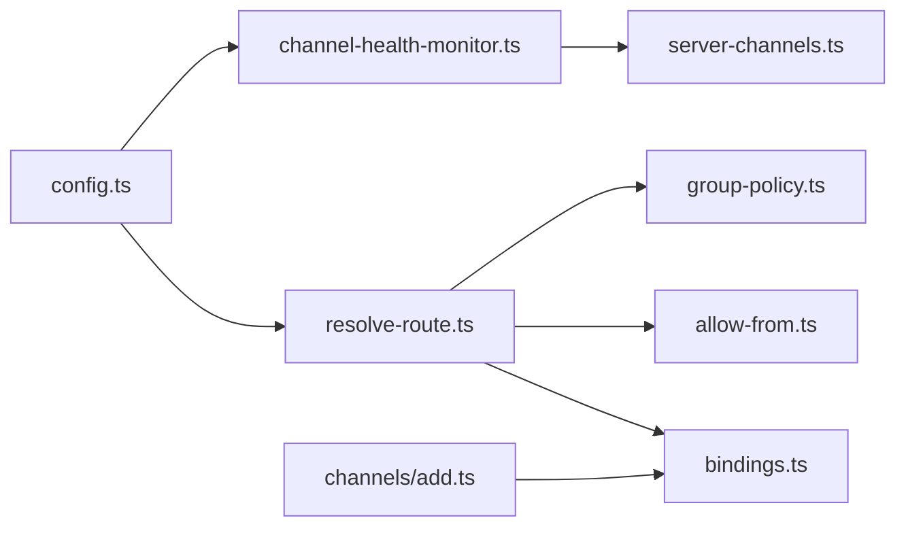

# 频道路由与配置

<cite>
**本文引用的文件**
- [src/routing/resolve-route.ts](file://src/routing/resolve-route.ts)
- [src/routing/bindings.ts](file://src/routing/bindings.ts)
- [src/channels/allow-from.ts](file://src/channels/allow-from.ts)
- [src/config/group-policy.ts](file://src/config/group-policy.ts)
- [src/gateway/channel-health-monitor.ts](file://src/gateway/channel-health-monitor.ts)
- [src/gateway/server-channels.ts](file://src/gateway/server-channels.ts)
- [src/commands/channels/add.ts](file://src/commands/channels/add.ts)
- [src/config/config.ts](file://src/config/config.ts)
- [apps/macos/Sources/OpenClaw/HealthStore.swift](file://apps/macos/Sources/OpenClaw/HealthStore.swift)
- [apps/macos/Sources/OpenClaw/InstancesStore.swift](file://apps/macos/Sources/OpenClaw/InstancesStore.swift)
- [extensions/shared/resolve-target-test-helpers.ts](file://extensions/shared/resolve-target-test-helpers.ts)
</cite>

## 目录

1. [简介](#简介)
2. [项目结构](#项目结构)
3. [核心组件](#核心组件)
4. [架构总览](#架构总览)
5. [详细组件分析](#详细组件分析)
6. [依赖关系分析](#依赖关系分析)
7. [性能考量](#性能考量)
8. [故障排查指南](#故障排查指南)
9. [结论](#结论)
10. [附录](#附录)

## 简介

本文件系统化阐述 OpenClaw 的“频道路由与配置”机制，覆盖以下主题：

- 路由规则与优先级：基于绑定（bindings）的层级匹配、会话键生成与默认路由回退
- 允许来源控制与白名单匹配：私聊与群组场景下的 sender 白名单、工具策略按发送者分桶
- 群组策略：群组模式、默认配置、提及要求、工具策略按发送者覆盖
- 动态路由与故障转移：通道健康监控、自动重启与冷却窗口、运行时快照
- 复杂配置示例与多频道协同：绑定冲突处理、账户边界、默认账户解析
- 性能优化与安全加固：缓存命中、匹配短路、日志与可观测性、配置校验

## 项目结构

围绕“频道路由与配置”的关键模块如下：

- 路由核心：resolve-route.ts 提供路由解析与会话键生成；bindings.ts 提供绑定清单与账户边界
- 允许来源与白名单：allow-from.ts 提供私聊与群组允许来源合并与判定
- 群组策略：group-policy.ts 提供群组模式、默认配置、提及要求、工具策略按发送者
- 健康监控与故障转移：channel-health-monitor.ts 与 server-channels.ts 协作实现自动重启与冷却
- 配置入口与命令行：config.ts 暴露配置 IO 与校验；channels/add.ts 展示绑定冲突处理流程
- 客户端健康展示：macOS 端 HealthStore.swift/InstancesStore.swift 展示健康状态可视化与探测

**图表来源**

- [src/routing/resolve-route.ts](file://src/routing/resolve-route.ts#L291-L443)
- [src/routing/bindings.ts](file://src/routing/bindings.ts#L16-L114)
- [src/channels/allow-from.ts](file://src/channels/allow-from.ts#L1-L54)
- [src/config/group-policy.ts](file://src/config/group-policy.ts#L325-L429)
- [src/gateway/channel-health-monitor.ts](file://src/gateway/channel-health-monitor.ts#L53-L177)
- [src/gateway/server-channels.ts](file://src/gateway/server-channels.ts#L69-L200)
- [src/config/config.ts](file://src/config/config.ts#L1-L25)
- [src/commands/channels/add.ts](file://src/commands/channels/add.ts#L151-L177)

**章节来源**

- [src/routing/resolve-route.ts](file://src/routing/resolve-route.ts#L1-L444)
- [src/routing/bindings.ts](file://src/routing/bindings.ts#L1-L114)
- [src/channels/allow-from.ts](file://src/channels/allow-from.ts#L1-L54)
- [src/config/group-policy.ts](file://src/config/group-policy.ts#L1-L429)
- [src/gateway/channel-health-monitor.ts](file://src/gateway/channel-health-monitor.ts#L1-L178)
- [src/gateway/server-channels.ts](file://src/gateway/server-channels.ts#L1-L200)
- [src/config/config.ts](file://src/config/config.ts#L1-L25)
- [src/commands/channels/add.ts](file://src/commands/channels/add.ts#L151-L177)

## 核心组件

- 路由解析器（resolveAgentRoute）
  - 输入：渠道、账户、对端（含线程父对端）、公会/团队角色
  - 输出：目标代理、会话键、匹配原因
  - 关键点：按层级匹配（对端、父对端、公会+角色、公会、团队、账户、频道），命中即返回；否则回退到默认代理
- 绑定管理（listBindings、listBoundAccountIds、buildChannelAccountBindings）
  - 清洗并标准化绑定匹配项，支持按渠道聚合账户边界
- 允许来源（mergeDmAllowFromSources、resolveGroupAllowFromSources、isSenderIdAllowed）
  - 合并私聊/群组允许来源，支持通配与空策略分支
- 群组策略（resolveChannelGroupPolicy、resolveChannelGroupRequireMention、resolveChannelGroupToolsPolicy）
  - 支持 open/allowlist/disabled 模式，群组默认配置、提及要求、工具策略按发送者（id/e164/username/name）
- 健康监控（startChannelHealthMonitor）
  - 周期性检查通道运行状态，健康异常则冷却窗口内限速重启，限制每小时重启次数

**章节来源**

- [src/routing/resolve-route.ts](file://src/routing/resolve-route.ts#L291-L443)
- [src/routing/bindings.ts](file://src/routing/bindings.ts#L16-L114)
- [src/channels/allow-from.ts](file://src/channels/allow-from.ts#L1-L54)
- [src/config/group-policy.ts](file://src/config/group-policy.ts#L325-L429)
- [src/gateway/channel-health-monitor.ts](file://src/gateway/channel-health-monitor.ts#L53-L177)

## 架构总览

下图展示从输入到路由决策、再到通道生命周期与健康监控的整体流程。

**图表来源**

- [src/routing/resolve-route.ts](file://src/routing/resolve-route.ts#L291-L443)
- [src/routing/bindings.ts](file://src/routing/bindings.ts#L16-L114)
- [src/channels/allow-from.ts](file://src/channels/allow-from.ts#L1-L54)
- [src/config/group-policy.ts](file://src/config/group-policy.ts#L325-L429)
- [src/gateway/server-channels.ts](file://src/gateway/server-channels.ts#L69-L200)
- [src/gateway/channel-health-monitor.ts](file://src/gateway/channel-health-monitor.ts#L53-L177)

## 详细组件分析

### 路由规则与优先级

- 匹配层级（命中即停）：
  - 对端精确匹配
  - 线程父对端继承匹配
  - 公会+角色组合
  - 公会
  - 团队
  - 账户（非通配）
  - 频道（通配）
- 会话键与主会话键：用于并发控制与直接对话折叠
- 默认回退：若无匹配，回退到默认代理

**图表来源**

- [src/routing/resolve-route.ts](file://src/routing/resolve-route.ts#L370-L443)

**章节来源**

- [src/routing/resolve-route.ts](file://src/routing/resolve-route.ts#L291-L443)

### 允许来源控制与白名单匹配

- 私聊允许来源：根据 DM 策略决定是否使用存储来源
- 群组允许来源：优先 groupAllowFrom，可回退到 allowFrom
- 判定逻辑：空策略、通配符、精确匹配三类分支

**图表来源**

- [src/channels/allow-from.ts](file://src/channels/allow-from.ts#L1-L54)

**章节来源**

- [src/channels/allow-from.ts](file://src/channels/allow-from.ts#L1-L54)

### 群组策略与工具策略

- 群组模式：open/allowlist/disabled
- 默认配置：支持“\*”通配键
- 提及要求：可按群组/默认配置或外部覆盖顺序决定
- 工具策略：按发送者类型（id/e164/username/name）分桶匹配，支持通配

**图表来源**

- [src/config/group-policy.ts](file://src/config/group-policy.ts#L325-L429)

**章节来源**

- [src/config/group-policy.ts](file://src/config/group-policy.ts#L208-L280)

### 绑定与账户边界

- 绑定清单清洗：标准化渠道 ID、账户 ID、代理 ID
- 账户边界：列出某渠道已绑定的账户集合并排序
- 默认账户绑定：解析默认代理在某渠道的首选账户

**图表来源**

- [src/routing/bindings.ts](file://src/routing/bindings.ts#L16-L114)

**章节来源**

- [src/routing/bindings.ts](file://src/routing/bindings.ts#L16-L114)

### 健康监控与故障转移

- 周期性检查：运行中且未连接则视为异常
- 冷却窗口：避免频繁重启
- 速率限制：每小时最大重启次数
- 运行时快照：通道/账户维度的状态快照，便于诊断与自动恢复

**图表来源**

- [src/gateway/channel-health-monitor.ts](file://src/gateway/channel-health-monitor.ts#L76-L153)
- [src/gateway/server-channels.ts](file://src/gateway/server-channels.ts#L118-L200)

**章节来源**

- [src/gateway/channel-health-monitor.ts](file://src/gateway/channel-health-monitor.ts#L53-L177)
- [src/gateway/server-channels.ts](file://src/gateway/server-channels.ts#L69-L200)

### 客户端健康可视化与探测

- macOS 端通过健康探测获取快照，识别“已链接”通道与探测失败原因
- 将健康状态映射为 OK/降级/需要链接等状态

**图表来源**

- [apps/macos/Sources/OpenClaw/HealthStore.swift](file://apps/macos/Sources/OpenClaw/HealthStore.swift#L197-L227)
- [apps/macos/Sources/OpenClaw/InstancesStore.swift](file://apps/macos/Sources/OpenClaw/InstancesStore.swift#L197-L227)

**章节来源**

- [apps/macos/Sources/OpenClaw/HealthStore.swift](file://apps/macos/Sources/OpenClaw/HealthStore.swift#L153-L213)
- [apps/macos/Sources/OpenClaw/InstancesStore.swift](file://apps/macos/Sources/OpenClaw/InstancesStore.swift#L197-L227)

### 复杂配置示例与多频道协同

- 绑定冲突处理：当绑定被其他代理占用时，命令行会提示并跳过冲突绑定
- 默认账户解析：若无显式绑定，默认代理在该频道的首选账户将被选中
- 配置校验：通过配置 IO 与校验模块确保字段合法（如心跳 directPolicy）

**图表来源**

- [src/commands/channels/add.ts](file://src/commands/channels/add.ts#L151-L177)
- [src/routing/bindings.ts](file://src/routing/bindings.ts#L63-L84)

**章节来源**

- [src/commands/channels/add.ts](file://src/commands/channels/add.ts#L151-L177)
- [src/routing/bindings.ts](file://src/routing/bindings.ts#L63-L84)
- [src/config/config.ts](file://src/config/config.ts#L1-L25)

## 依赖关系分析

- 路由解析依赖绑定清单与会话键规范
- 允许来源与群组策略共同决定消息进入通道的准入
- 健康监控依赖通道管理的运行时快照与生命周期接口
- 配置 IO 与校验贯穿路由、策略与健康监控的输入数据质量保障

**图表来源**

- [src/routing/resolve-route.ts](file://src/routing/resolve-route.ts#L1-L444)
- [src/routing/bindings.ts](file://src/routing/bindings.ts#L1-L114)
- [src/channels/allow-from.ts](file://src/channels/allow-from.ts#L1-L54)
- [src/config/group-policy.ts](file://src/config/group-policy.ts#L1-L429)
- [src/gateway/channel-health-monitor.ts](file://src/gateway/channel-health-monitor.ts#L1-L178)
- [src/gateway/server-channels.ts](file://src/gateway/server-channels.ts#L1-L200)
- [src/config/config.ts](file://src/config/config.ts#L1-L25)
- [src/commands/channels/add.ts](file://src/commands/channels/add.ts#L151-L177)

**章节来源**

- [src/routing/resolve-route.ts](file://src/routing/resolve-route.ts#L1-L444)
- [src/routing/bindings.ts](file://src/routing/bindings.ts#L1-L114)
- [src/channels/allow-from.ts](file://src/channels/allow-from.ts#L1-L54)
- [src/config/group-policy.ts](file://src/config/group-policy.ts#L1-L429)
- [src/gateway/channel-health-monitor.ts](file://src/gateway/channel-health-monitor.ts#L1-L178)
- [src/gateway/server-channels.ts](file://src/gateway/server-channels.ts#L1-L200)
- [src/config/config.ts](file://src/config/config.ts#L1-L25)
- [src/commands/channels/add.ts](file://src/commands/channels/add.ts#L151-L177)

## 性能考量

- 匹配短路：层级匹配命中即停，减少无效遍历
- 缓存优化：绑定评估结果按配置对象弱引用缓存，避免重复计算
- 会话键复用：主会话键用于直接对话折叠，降低并发冲突
- 健康检查节流：冷却窗口与每小时重启上限，防止雪崩式重启
- 日志与调试：仅在启用详细日志时输出路由调试信息，避免生产环境开销

**章节来源**

- [src/routing/resolve-route.ts](file://src/routing/resolve-route.ts#L172-L216)
- [src/gateway/channel-health-monitor.ts](file://src/gateway/channel-health-monitor.ts#L63-L124)

## 故障排查指南

- 路由不生效
  - 检查绑定是否正确、账户是否在允许来源范围内、群组策略是否允许
  - 查看路由调试日志中的匹配原因
- 通道频繁重启
  - 检查健康监控冷却窗口与每小时重启上限设置
  - 查看通道运行时快照中的连接状态与错误
- 私聊/群组白名单异常
  - 核对 allowFrom 与 groupAllowFrom 的合并逻辑与空策略分支
  - 使用测试辅助函数验证错误路径（如空目标、非法目标）

**章节来源**

- [src/routing/resolve-route.ts](file://src/routing/resolve-route.ts#L347-L356)
- [src/gateway/channel-health-monitor.ts](file://src/gateway/channel-health-monitor.ts#L114-L147)
- [src/channels/allow-from.ts](file://src/channels/allow-from.ts#L1-L54)
- [extensions/shared/resolve-target-test-helpers.ts](file://extensions/shared/resolve-target-test-helpers.ts#L1-L66)

## 结论

OpenClaw 的频道路由以“绑定 + 策略 + 健康监控”为核心，形成高可配置、强可观测、可自愈的通道路由体系。通过层级匹配、白名单与群组策略、工具策略按发送者分桶、以及健康监控与自动重启，系统在复杂多频道场景下仍能保持稳定与高效。

## 附录

- 配置校验与 IO：通过配置模块统一加载、校验与写入，保证输入数据质量
- 客户端健康：macOS 端健康探测与状态展示，辅助运维与用户自助诊断

**章节来源**

- [src/config/config.ts](file://src/config/config.ts#L1-L25)
- [apps/macos/Sources/OpenClaw/HealthStore.swift](file://apps/macos/Sources/OpenClaw/HealthStore.swift#L197-L227)
- [apps/macos/Sources/OpenClaw/InstancesStore.swift](file://apps/macos/Sources/OpenClaw/InstancesStore.swift#L197-L227)
