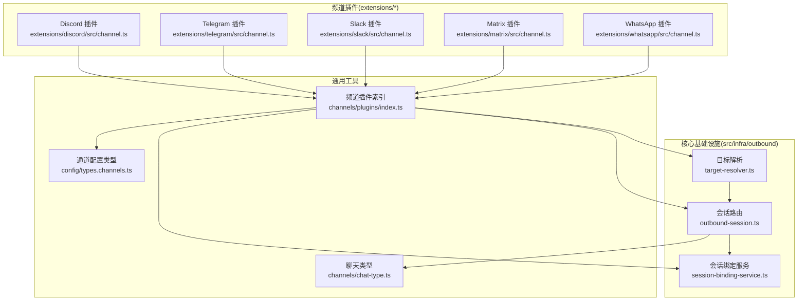
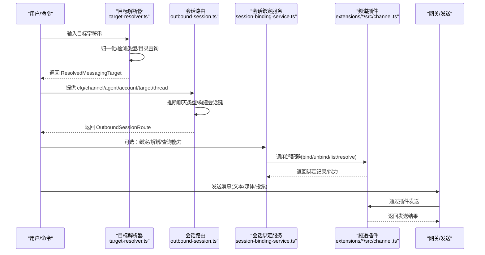
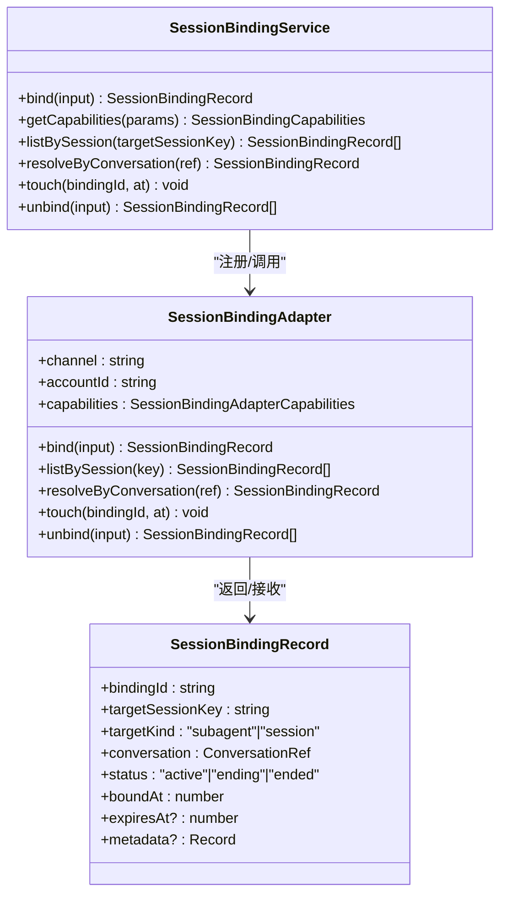
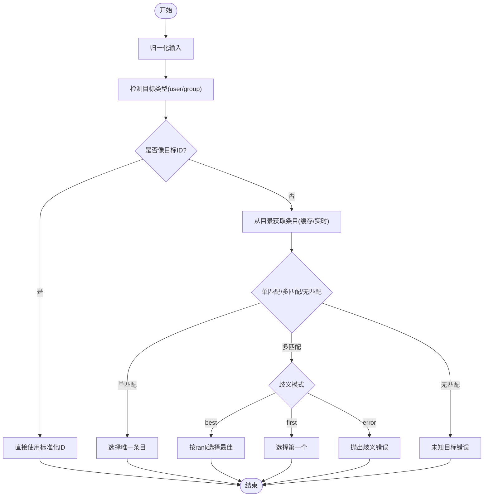
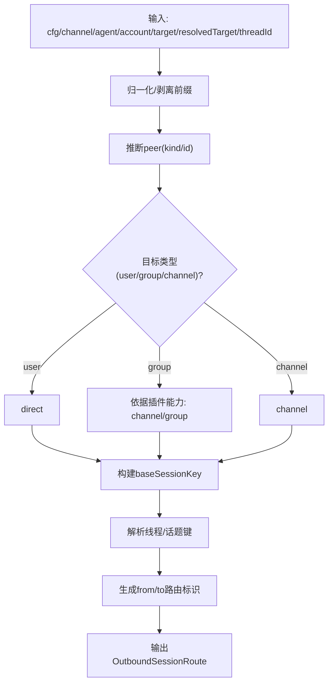
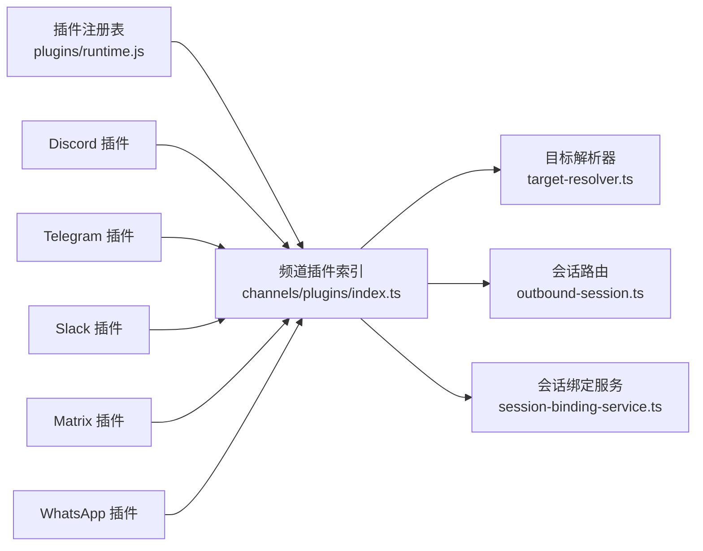

# 频道适配器架构

<cite>
**本文档引用的文件**
- [session-binding-service.ts](file://src/infra/outbound/session-binding-service.ts)
- [outbound-session.ts](file://src/infra/outbound/outbound-session.ts)
- [target-resolver.ts](file://src/infra/outbound/target-resolver.ts)
- [chat-type.ts](file://src/channels/chat-type.ts)
- [plugins/index.ts](file://src/channels/plugins/index.ts)
- [discord/channel.ts](file://extensions/discord/src/channel.ts)
- [telegram/channel.ts](file://extensions/telegram/src/channel.ts)
- [slack/channel.ts](file://extensions/slack/src/channel.ts)
- [types.channels.ts](file://src/config/types.channels.ts)
- [server-node-events.ts](file://src/gateway/server-node-events.ts)
- [channel.ts](file://extensions/matrix/src/channel.ts)
- [channel.ts](file://extensions/whatsapp/src/channel.ts)
- [channel.ts](file://extensions/telegram/src/channel.ts)
- [channel.ts](file://extensions/discord/src/channel.ts)
- [channel.ts](file://extensions/slack/src/channel.ts)
</cite>

## 目录

1. [简介](#简介)
2. [项目结构](#项目结构)
3. [核心组件](#核心组件)
4. [架构总览](#架构总览)
5. [详细组件分析](#详细组件分析)
6. [依赖关系分析](#依赖关系分析)
7. [性能考虑](#性能考虑)
8. [故障排查指南](#故障排查指南)
9. [结论](#结论)
10. [附录](#附录)

## 简介

本文件系统性阐述 OpenClaw 的频道适配器架构与底层实现，重点覆盖以下主题：

- 频道注册机制：插件化注册、能力声明与运行时加载
- 会话管理：会话键生成、线程/话题路由、聊天类型推断
- 目标解析：输入归一化、目录查询、歧义处理与显示格式化
- 聊天类型识别：基于通道能力与上下文的自动判定
- 打字指示器与对话标签：跨通道一致性与扩展点
- 消息路由算法：从目标到会话键的映射与分发
- 状态同步机制：会话绑定服务、适配器生命周期与错误码
- 频道间消息转换与格式标准化：媒体、投票、组件等
- 元数据处理：账户级配置、安全策略与权限审计
- 扩展接口与自定义开发指南：如何为新频道实现适配器
- 性能优化策略、错误处理机制与调试技巧

## 项目结构

OpenClaw 将“频道”抽象为可插拔的插件，每个频道通过统一的 ChannelPlugin 接口暴露能力（如消息发送、目录查询、安全策略、网关监控等）。核心基础设施位于 src/infra/outbound 下，负责目标解析、会话路由与会话绑定；具体频道实现在 extensions/<channel>/src/channel.ts 中。

图表来源

- [target-resolver.ts](file://src/infra/outbound/target-resolver.ts#L325-L453)
- [outbound-session.ts](file://src/infra/outbound/outbound-session.ts#L1-L120)
- [session-binding-service.ts](file://src/infra/outbound/session-binding-service.ts#L198-L310)
- [plugins/index.ts](file://src/channels/plugins/index.ts#L45-L51)
- [chat-type.ts](file://src/channels/chat-type.ts#L1-L19)
- [types.channels.ts](file://src/config/types.channels.ts#L44-L60)

章节来源

- [target-resolver.ts](file://src/infra/outbound/target-resolver.ts#L325-L453)
- [outbound-session.ts](file://src/infra/outbound/outbound-session.ts#L1-L120)
- [session-binding-service.ts](file://src/infra/outbound/session-binding-service.ts#L198-L310)
- [plugins/index.ts](file://src/channels/plugins/index.ts#L45-L51)
- [chat-type.ts](file://src/channels/chat-type.ts#L1-L19)
- [types.channels.ts](file://src/config/types.channels.ts#L44-L60)

## 核心组件

- 会话绑定服务：统一注册、调用与管理各频道适配器，提供绑定/解绑、能力查询、触活等能力。
- 目标解析器：将用户输入的目标字符串归一化为标准化 ID，并在目录中查找匹配项，支持歧义处理与显示格式化。
- 会话路由：根据通道、账户、目标与线程信息构建会话键，推断聊天类型，生成 from/to 路由标识。
- 频道插件：每个频道以 ChannelPlugin 形式提供能力声明、配置、安全策略、消息发送、目录查询、网关监控等。

章节来源

- [session-binding-service.ts](file://src/infra/outbound/session-binding-service.ts#L70-L94)
- [target-resolver.ts](file://src/infra/outbound/target-resolver.ts#L325-L453)
- [outbound-session.ts](file://src/infra/outbound/outbound-session.ts#L27-L46)
- [plugins/index.ts](file://src/channels/plugins/index.ts#L45-L51)

## 架构总览

下图展示从“用户输入目标”到“会话路由与消息发送”的端到端流程，以及会话绑定服务在其中的角色。

图表来源

- [target-resolver.ts](file://src/infra/outbound/target-resolver.ts#L325-L453)
- [outbound-session.ts](file://src/infra/outbound/outbound-session.ts#L103-L118)
- [session-binding-service.ts](file://src/infra/outbound/session-binding-service.ts#L198-L310)
- [discord/channel.ts](file://extensions/discord/src/channel.ts#L299-L341)
- [telegram/channel.ts](file://extensions/telegram/src/channel.ts#L317-L368)
- [slack/channel.ts](file://extensions/slack/src/channel.ts#L324-L357)

## 详细组件分析

### 会话绑定服务（Session Binding Service）

- 角色：集中管理各频道适配器，提供 bind/unbind/list/resolve/capabilities/touch 等操作。
- 关键点：
  - 适配器注册与去重：按 channel:accountId 键存储，自动规范化大小写与账户 ID。
  - 能力解析：根据适配器 capabilities 或是否存在 bind/unbind 方法推断支持能力。
  - 统一错误模型：使用结构化错误码（适配器不可用、能力不支持、创建失败）。
  - 广播操作：touch/unbind 对所有已注册适配器广播执行，确保状态一致性。

图表来源

- [session-binding-service.ts](file://src/infra/outbound/session-binding-service.ts#L70-L94)
- [session-binding-service.ts](file://src/infra/outbound/session-binding-service.ts#L198-L310)

章节来源

- [session-binding-service.ts](file://src/infra/outbound/session-binding-service.ts#L198-L310)

### 目标解析器（Target Resolver）

- 功能：将用户输入的目标字符串归一化为标准化 ID，并在频道目录中查找匹配项；支持歧义处理与显示格式化。
- 关键流程：
  - 归一化：去除前缀、保留大小写（特定平台例外）、标准化大小写。
  - 类型检测：根据前缀或正则判断 user/group。
  - 目录查询：缓存命中优先，否则拉取实时目录条目，支持“缓存优先/实时优先”策略。
  - 歧义处理：支持 error/best/first 三种模式；best 基于条目 rank。
  - 显示格式化：根据插件或默认规则生成人类可读显示名。

图表来源

- [target-resolver.ts](file://src/infra/outbound/target-resolver.ts#L325-L453)

章节来源

- [target-resolver.ts](file://src/infra/outbound/target-resolver.ts#L325-L453)

### 会话路由（Outbound Session）

- 功能：根据通道、账户、目标与线程信息构建会话键，推断聊天类型，生成 from/to 路由标识。
- 关键点：
  - 会话键生成：基于 agentId、channel、accountId、peer（含 kind/id）与会话作用域/身份链接。
  - 聊天类型推断：优先使用解析后的目标类型，其次依据插件能力（支持 channel/group），再回退到 direct。
  - 线程/话题处理：不同通道采用不同策略（如 Discord 使用独立 thread id，Telegram 使用 topic 编码）。
  - 多通道实现：Slack/Discord/Telegram/WhatsApp/Signal/iMessage/Mattermost/Matrix 等均有专门解析逻辑。

图表来源

- [outbound-session.ts](file://src/infra/outbound/outbound-session.ts#L79-L101)
- [outbound-session.ts](file://src/infra/outbound/outbound-session.ts#L103-L118)
- [outbound-session.ts](file://src/infra/outbound/outbound-session.ts#L240-L276)
- [outbound-session.ts](file://src/infra/outbound/outbound-session.ts#L278-L319)
- [outbound-session.ts](file://src/infra/outbound/outbound-session.ts#L321-L348)

章节来源

- [outbound-session.ts](file://src/infra/outbound/outbound-session.ts#L79-L101)
- [outbound-session.ts](file://src/infra/outbound/outbound-session.ts#L103-L118)
- [outbound-session.ts](file://src/infra/outbound/outbound-session.ts#L240-L276)
- [outbound-session.ts](file://src/infra/outbound/outbound-session.ts#L278-L319)
- [outbound-session.ts](file://src/infra/outbound/outbound-session.ts#L321-L348)

### 频道插件（Channel Plugin）

- 角色：每个频道以 ChannelPlugin 形式提供能力声明与实现，包括：
  - 基本信息与能力：meta、capabilities（聊天类型、线程、媒体、投票、原生命令等）
  - 配置与安全：配置模式、默认账户、允许来源、默认 to、安全策略与警告收集
  - 目录与解析：目录查询（静态/动态）、目标解析器提示
  - 出站发送：文本/媒体/投票发送、分块策略、投递模式
  - 网关监控：启动账户、探针、审计、状态摘要
- 示例：Discord/Telegram/Slack 插件均遵循相同结构，差异体现在具体实现细节（如线程模式、回复模式、媒体限制等）。

章节来源

- [discord/channel.ts](file://extensions/discord/src/channel.ts#L51-L452)
- [telegram/channel.ts](file://extensions/telegram/src/channel.ts#L87-L570)
- [slack/channel.ts](file://extensions/slack/src/channel.ts#L54-L422)

### 聊天类型识别

- ChatType 定义：direct/group/channel
- 归一化：支持 "direct"/"dm" -> "direct"，"group" -> "group"，"channel" -> "channel"
- 推断策略：优先使用解析后的目标类型；若未知，则依据插件 capabilities 决定是否优先 channel 或 group

章节来源

- [chat-type.ts](file://src/channels/chat-type.ts#L1-L19)
- [outbound-session.ts](file://src/infra/outbound/outbound-session.ts#L79-L101)

### 打字指示器与对话标签

- 打字指示器：由各频道插件在网关监控中实现，用于提升交互体验与状态同步。
- 对话标签：通过会话键与显示格式化规则生成人类可读名称，便于 UI 展示与用户选择。

章节来源

- [discord/channel.ts](file://extensions/discord/src/channel.ts#L75-L77)
- [telegram/channel.ts](file://extensions/telegram/src/channel.ts#L111-L119)
- [slack/channel.ts](file://extensions/slack/src/channel.ts#L88-L94)

### 消息路由算法

- 目标到会话键：目标解析后，结合通道能力与线程信息生成 baseSessionKey，再扩展为完整 sessionKey
- from/to 路由：依据聊天类型与通道约定生成 from/to 标识，确保下游发送正确
- 投递控制：网关侧根据 deliver 参数与路由完整性决定是否投递与回执

章节来源

- [outbound-session.ts](file://src/infra/outbound/outbound-session.ts#L240-L276)
- [server-node-events.ts](file://src/gateway/server-node-events.ts#L383-L421)

### 状态同步机制

- 会话绑定：通过会话绑定服务集中管理，支持按会话列出、按会话触活、按会话解绑
- 适配器生命周期：注册/注销、能力查询、广播触活
- 错误模型：结构化错误码，携带上下文详情，便于诊断

章节来源

- [session-binding-service.ts](file://src/infra/outbound/session-binding-service.ts#L198-L310)

### 频道间的消息转换与格式标准化

- 文本分块：部分频道（如 Telegram）提供分块器与分块限制，避免超限
- 媒体与投票：各频道插件提供 sendMedia/sendPoll 等方法，统一返回通道标识与消息 ID
- 组件与动作：部分频道支持按钮、选择器、表单等组件，需在发送时附加相应结构

章节来源

- [telegram/channel.ts](file://extensions/telegram/src/channel.ts#L317-L368)
- [discord/channel.ts](file://extensions/discord/src/channel.ts#L299-L341)
- [slack/channel.ts](file://extensions/slack/src/channel.ts#L324-L357)

### 元数据处理

- 账户级配置：各频道提供配置模式、默认账户、启用状态、令牌来源等
- 安全策略：DM 策略、允许来源、分组策略与警告收集
- 权限审计：对频道/群组进行权限探测与审计，汇总问题

章节来源

- [discord/channel.ts](file://extensions/discord/src/channel.ts#L119-L160)
- [telegram/channel.ts](file://extensions/telegram/src/channel.ts#L184-L221)
- [slack/channel.ts](file://extensions/slack/src/channel.ts#L138-L178)

## 依赖关系分析

- 低耦合高内聚：目标解析与会话路由依赖频道插件索引与能力声明，但不直接依赖具体实现
- 运行时加载：频道插件通过插件注册表按需加载，支持热更新与多实例
- 统一接口：所有频道插件实现一致的 ChannelPlugin 接口，便于扩展与维护

图表来源

- [plugins/index.ts](file://src/channels/plugins/index.ts#L45-L51)
- [target-resolver.ts](file://src/infra/outbound/target-resolver.ts#L325-L453)
- [outbound-session.ts](file://src/infra/outbound/outbound-session.ts#L1-L120)
- [session-binding-service.ts](file://src/infra/outbound/session-binding-service.ts#L198-L310)

章节来源

- [plugins/index.ts](file://src/channels/plugins/index.ts#L45-L51)
- [target-resolver.ts](file://src/infra/outbound/target-resolver.ts#L325-L453)
- [outbound-session.ts](file://src/infra/outbound/outbound-session.ts#L1-L120)
- [session-binding-service.ts](file://src/infra/outbound/session-binding-service.ts#L198-L310)

## 性能考虑

- 目录缓存：目标解析器内置 TTL 缓存，减少重复目录查询开销
- 通道类型缓存：Slack 通道类型查询结果缓存，避免频繁 API 调用
- 分块策略：针对长文本进行分块发送，降低单次发送失败风险
- 广播触活：会话绑定服务对多个适配器广播触活，确保状态一致性且避免重复查询

章节来源

- [target-resolver.ts](file://src/infra/outbound/target-resolver.ts#L43-L62)
- [outbound-session.ts](file://src/infra/outbound/outbound-session.ts#L120-L183)
- [telegram/channel.ts](file://extensions/telegram/src/channel.ts#L317-L321)

## 故障排查指南

- 结构化错误：会话绑定服务抛出结构化错误码，包含 channel/account/placement 等上下文
- 目标解析错误：未知目标/歧义目标/目录为空等场景均有明确错误提示与候选列表
- 网关投递失败：检查 deliver 参数与路由完整性，查看回执与日志
- 频道配置问题：核对令牌、账户启用状态、分组策略与允许来源

章节来源

- [session-binding-service.ts](file://src/infra/outbound/session-binding-service.ts#L51-L68)
- [target-resolver.ts](file://src/infra/outbound/target-resolver.ts#L425-L453)
- [server-node-events.ts](file://src/gateway/server-node-events.ts#L383-L421)

## 结论

OpenClaw 的频道适配器架构通过“插件化 + 基础设施 + 统一接口”的设计，实现了跨多通道的一致性体验与可扩展性。会话绑定服务、目标解析器与会话路由共同构成了消息流转的核心路径；而各频道插件则提供了丰富的能力与灵活的配置选项。该架构既保证了易用性，也为二次开发与定制提供了清晰的扩展点。

## 附录

### 扩展接口与自定义开发指南

- 实现步骤
  - 定义 ChannelPlugin：声明 meta、capabilities、config、security、directory、resolver、outbound、status、gateway 等
  - 注册适配器：在插件加载完成后注册会话绑定适配器（如需要）
  - 目标解析：提供 normalizeTarget 与 targetResolver.hint/looksLikeId
  - 出站发送：实现 sendText/sendMedia/sendPoll 等方法
  - 网关监控：实现 startAccount 以启动监听与处理循环
- 最佳实践
  - 明确 chatTypes 与 threading 能力，确保会话路由正确推断
  - 提供目录查询与解析器，改善用户体验
  - 合理设置分块限制与投递模式，平衡性能与可靠性
  - 记录结构化错误与状态摘要，便于诊断与运维

章节来源

- [discord/channel.ts](file://extensions/discord/src/channel.ts#L51-L452)
- [telegram/channel.ts](file://extensions/telegram/src/channel.ts#L87-L570)
- [slack/channel.ts](file://extensions/slack/src/channel.ts#L54-L422)
- [session-binding-service.ts](file://src/infra/outbound/session-binding-service.ts#L150-L167)
