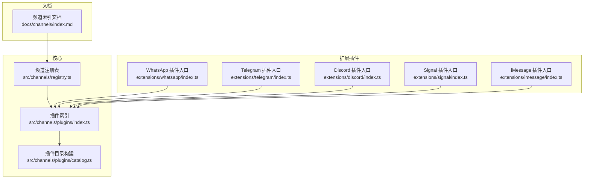
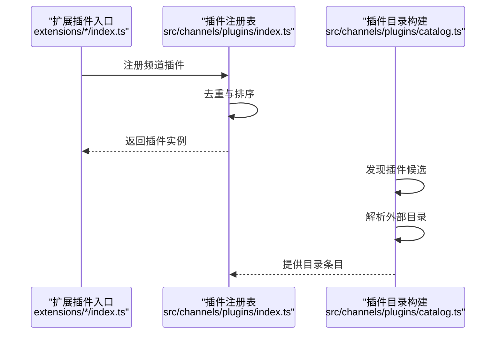
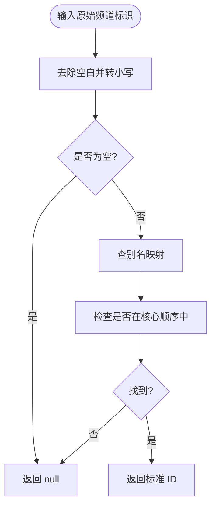
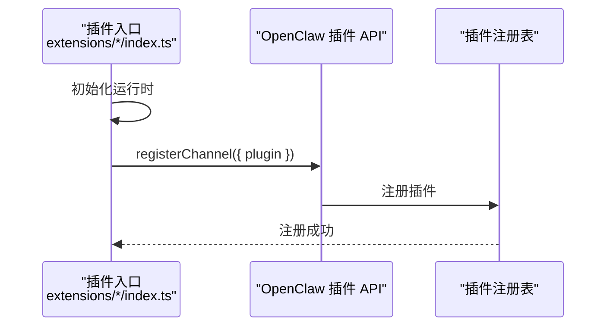
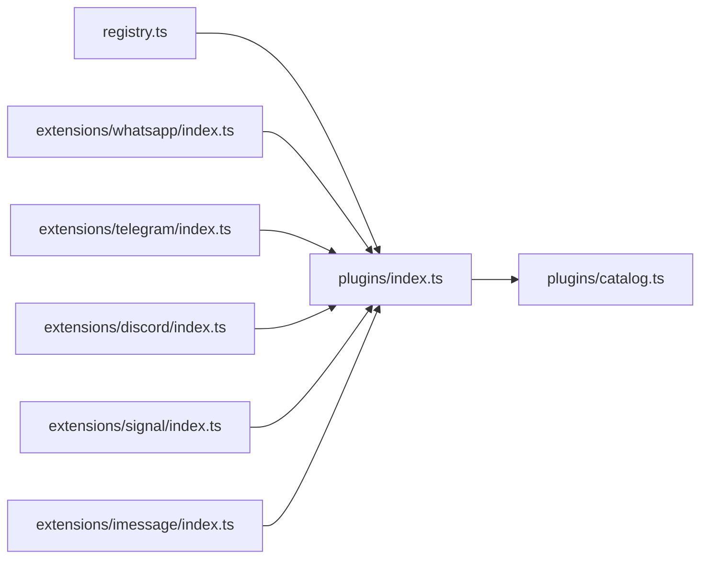

# 频道集成

<cite>
**本文档引用的文件**
- [README.md](file://README.md)
- [channels/registry.ts](file://src/channels/registry.ts)
- [channels/plugins/index.ts](file://src/channels/plugins/index.ts)
- [channels/plugins/catalog.ts](file://src/channels/plugins/catalog.ts)
- [docs/channels/index.md](file://docs/channels/index.md)
- [extensions/whatsapp/index.ts](file://extensions/whatsapp/index.ts)
- [extensions/telegram/index.ts](file://extensions/telegram/index.ts)
- [extensions/discord/index.ts](file://extensions/discord/index.ts)
- [extensions/signal/index.ts](file://extensions/signal/index.ts)
- [extensions/imessage/index.ts](file://extensions/imessage/index.ts)
</cite>

## 目录

1. [简介](#简介)
2. [项目结构](#项目结构)
3. [核心组件](#核心组件)
4. [架构总览](#架构总览)
5. [详细组件分析](#详细组件分析)
6. [依赖关系分析](#依赖关系分析)
7. [性能考量](#性能考量)
8. [故障排除指南](#故障排除指南)
9. [结论](#结论)
10. [附录](#附录)

## 简介

本文件系统性阐述 OpenClaw 的“频道集成”能力与实现方式，覆盖核心即时通讯平台（如 WhatsApp、Telegram、Discord、Slack、Google Chat、Signal、iMessage 等）的接入路径、频道适配器工作原理、配置选项、路由与权限控制、扩展插件开发接口与规范，并提供故障排除、性能优化与安全建议，帮助用户在多通道环境中做出正确的选型与配置决策。

## 项目结构

OpenClaw 将“频道”抽象为可插拔的插件模块，通过统一的注册表与运行时加载机制实现对不同 IM 平台的接入。核心目录与职责如下：

- 核心注册与元数据：src/channels/registry.ts 定义核心频道顺序、别名与元信息；src/channels/plugins/index.ts 提供插件查询与排序；src/channels/plugins/catalog.ts 负责外部插件目录解析与安装信息构建。
- 文档索引：docs/channels/index.md 提供所有受支持频道的概览与链接。
- 扩展插件：extensions/\*/index.ts 是各频道插件的入口，负责注册频道插件与运行时设置。

**图表来源**

- [channels/registry.ts](file://src/channels/registry.ts#L1-L190)
- [channels/plugins/index.ts](file://src/channels/plugins/index.ts#L1-L85)
- [channels/plugins/catalog.ts](file://src/channels/plugins/catalog.ts#L1-L308)
- [docs/channels/index.md](file://docs/channels/index.md#L1-L48)
- [extensions/whatsapp/index.ts](file://extensions/whatsapp/index.ts#L1-L18)
- [extensions/telegram/index.ts](file://extensions/telegram/index.ts#L1-L18)
- [extensions/discord/index.ts](file://extensions/discord/index.ts#L1-L20)
- [extensions/signal/index.ts](file://extensions/signal/index.ts#L1-L18)
- [extensions/imessage/index.ts](file://extensions/imessage/index.ts#L1-L18)

**章节来源**

- [channels/registry.ts](file://src/channels/registry.ts#L1-L190)
- [channels/plugins/index.ts](file://src/channels/plugins/index.ts#L1-L85)
- [channels/plugins/catalog.ts](file://src/channels/plugins/catalog.ts#L1-L308)
- [docs/channels/index.md](file://docs/channels/index.md#L1-L48)

## 核心组件

- 频道注册表与元数据
  - 定义核心频道顺序（如 telegram、whatsapp、discord、irc、googlechat、slack、signal、imessage），并提供标准化的元信息（标签、文档路径、图标、别名等）。
  - 支持别名映射与规范化，便于在共享代码中统一处理。
- 插件索引与排序
  - 基于注册表与插件清单，对已加载的频道插件进行去重、排序与检索，确保 UI 展示与执行边界的一致性。
- 插件目录构建
  - 解析外部插件目录（本地/全局/工作区/配置），合并内置与外部清单，生成可用于安装与展示的频道目录。
- 扩展插件入口
  - 各频道插件通过 index.ts 注册自身插件与运行时，统一接入 Gateway 的插件系统。

**章节来源**

- [channels/registry.ts](file://src/channels/registry.ts#L26-L110)
- [channels/plugins/index.ts](file://src/channels/plugins/index.ts#L12-L51)
- [channels/plugins/catalog.ts](file://src/channels/plugins/catalog.ts#L231-L296)
- [extensions/whatsapp/index.ts](file://extensions/whatsapp/index.ts#L6-L14)
- [extensions/telegram/index.ts](file://extensions/telegram/index.ts#L6-L14)
- [extensions/discord/index.ts](file://extensions/discord/index.ts#L7-L16)
- [extensions/signal/index.ts](file://extensions/signal/index.ts#L6-L14)
- [extensions/imessage/index.ts](file://extensions/imessage/index.ts#L6-L14)

## 架构总览

下图展示了从“频道插件入口”到“插件注册表”的整体流程，以及与“插件目录构建”的协作关系。

**图表来源**

- [extensions/whatsapp/index.ts](file://extensions/whatsapp/index.ts#L11-L14)
- [extensions/telegram/index.ts](file://extensions/telegram/index.ts#L11-L14)
- [extensions/discord/index.ts](file://extensions/discord/index.ts#L12-L15)
- [extensions/signal/index.ts](file://extensions/signal/index.ts#L11-L14)
- [extensions/imessage/index.ts](file://extensions/imessage/index.ts#L11-L14)
- [channels/plugins/index.ts](file://src/channels/plugins/index.ts#L31-L51)
- [channels/plugins/catalog.ts](file://src/channels/plugins/catalog.ts#L259-L296)

## 详细组件分析

### 频道注册表与元数据（registry）

- 功能要点
  - 维护核心频道顺序与别名映射，提供标准化元信息（文档路径、图标、简述等）。
  - 提供规范化函数，将输入的频道标识转换为内部标准 ID，支持别名与大小写归一化。
- 关键接口
  - 列出核心频道元信息、别名列表、按 ID 获取元信息、规范化 ID。
- 复杂度
  - 规范化与查找为 O(n)（n 为已知核心频道数），常数较小且稳定。

**图表来源**

- [channels/registry.ts](file://src/channels/registry.ts#L136-L149)

**章节来源**

- [channels/registry.ts](file://src/channels/registry.ts#L26-L110)
- [channels/registry.ts](file://src/channels/registry.ts#L136-L149)

### 插件索引与排序（plugins/index）

- 功能要点
  - 从活跃插件注册表中提取频道插件，去重后按预设顺序与自定义优先级排序。
  - 提供按 ID 查找插件的能力，作为执行边界调用点。
- 性能
  - 排序复杂度 O(m log m)，m 为已加载频道插件数量；查找为 O(m)。

**章节来源**

- [channels/plugins/index.ts](file://src/channels/plugins/index.ts#L12-L51)

### 插件目录构建（plugins/catalog）

- 功能要点
  - 解析环境变量或默认路径下的外部目录文件，合并内置与外部清单。
  - 将插件清单转换为 UI 元信息与安装信息，支持 npm 与本地路径两种安装方式。
- 复杂度
  - 主要为线性扫描与解析，总体 O(k)，k 为候选插件数量。

**章节来源**

- [channels/plugins/catalog.ts](file://src/channels/plugins/catalog.ts#L90-L119)
- [channels/plugins/catalog.ts](file://src/channels/plugins/catalog.ts#L171-L191)
- [channels/plugins/catalog.ts](file://src/channels/plugins/catalog.ts#L259-L296)

### 扩展插件入口（以 WhatsApp/Telegram/Discord/Signal/iMessage 为例）

- 功能要点
  - 在入口文件中注册频道插件与运行时，统一通过 Gateway 的插件 API 完成注册。
- 开发者关注点
  - 插件 ID 必须与频道注册表一致，避免冲突。
  - 运行时初始化需在注册前完成，确保后续生命周期可用。

**图表来源**

- [extensions/whatsapp/index.ts](file://extensions/whatsapp/index.ts#L11-L14)
- [extensions/telegram/index.ts](file://extensions/telegram/index.ts#L11-L14)
- [extensions/discord/index.ts](file://extensions/discord/index.ts#L12-L15)
- [extensions/signal/index.ts](file://extensions/signal/index.ts#L11-L14)
- [extensions/imessage/index.ts](file://extensions/imessage/index.ts#L11-L14)

**章节来源**

- [extensions/whatsapp/index.ts](file://extensions/whatsapp/index.ts#L1-L18)
- [extensions/telegram/index.ts](file://extensions/telegram/index.ts#L1-L18)
- [extensions/discord/index.ts](file://extensions/discord/index.ts#L1-L20)
- [extensions/signal/index.ts](file://extensions/signal/index.ts#L1-L18)
- [extensions/imessage/index.ts](file://extensions/imessage/index.ts#L1-L18)

### 支持的即时通讯平台与集成要点

- 平台概览
  - WhatsApp、Telegram、Discord、IRC、Google Chat、Slack、Signal、iMessage 等为核心支持平台。
  - 文档索引提供了更广泛的生态（如 Feishu、Mattermost、Microsoft Teams、Matrix、Nostr 等），可通过插件方式扩展。
- 集成方式
  - 通过扩展插件入口注册，结合各自运行时与适配器实现消息收发、会话管理、媒体处理与权限控制。
  - 文档索引页明确列出各平台的特性与注意事项，便于快速选型。

**章节来源**

- [docs/channels/index.md](file://docs/channels/index.md#L14-L37)
- [README.md](file://README.md#L151-L154)

## 依赖关系分析

- 模块耦合
  - 频道注册表与插件索引之间存在直接依赖：索引模块依赖注册表提供的顺序与别名。
  - 插件目录构建独立于具体插件实现，仅依赖清单格式与发现机制。
- 外部依赖
  - 各频道插件通过统一的插件 API 注册，避免了对核心系统的直接耦合。
- 循环依赖
  - 通过“轻量入口 + 重型实现”的分层设计，避免在注册表与索引中引入循环依赖。

**图表来源**

- [channels/registry.ts](file://src/channels/registry.ts#L1-L190)
- [channels/plugins/index.ts](file://src/channels/plugins/index.ts#L1-L85)
- [channels/plugins/catalog.ts](file://src/channels/plugins/catalog.ts#L1-L308)
- [extensions/whatsapp/index.ts](file://extensions/whatsapp/index.ts#L1-L18)
- [extensions/telegram/index.ts](file://extensions/telegram/index.ts#L1-L18)
- [extensions/discord/index.ts](file://extensions/discord/index.ts#L1-L20)
- [extensions/signal/index.ts](file://extensions/signal/index.ts#L1-L18)
- [extensions/imessage/index.ts](file://extensions/imessage/index.ts#L1-L18)

**章节来源**

- [channels/registry.ts](file://src/channels/registry.ts#L1-L190)
- [channels/plugins/index.ts](file://src/channels/plugins/index.ts#L1-L85)
- [channels/plugins/catalog.ts](file://src/channels/plugins/catalog.ts#L1-L308)

## 性能考量

- 插件加载与排序
  - 插件去重与排序在启动阶段完成，运行时查找为 O(m)，通常 m 较小，影响有限。
- 目录解析
  - 外部目录解析为一次性操作，读取后缓存结果，避免重复 IO。
- 路由与并发
  - 多频道并行时，建议合理配置并发策略与队列，避免单个频道阻塞其他频道的消息处理。
- 缓存与状态
  - 对频繁访问的元信息与别名映射进行内存缓存，减少重复计算。

## 故障排除指南

- 常见问题定位
  - 频道未显示：确认插件入口是否正确注册，ID 是否与注册表一致。
  - 权限与配对：若为私聊/群组 DM，需遵循默认的配对与允许列表策略；必要时调整 allowlist 或 dmPolicy。
  - 外部目录不可用：检查外部目录文件路径与格式，确保 JSON 可被正确解析。
- 安全与合规
  - 默认策略要求未知发送方先配对再处理消息；公开 DM 需显式开启并纳入允许列表。
  - 对外暴露网关时，建议使用安全隧道或密码认证，避免明文访问。

**章节来源**

- [README.md](file://README.md#L118-L124)
- [README.md](file://README.md#L442-L448)

## 结论

OpenClaw 通过“轻量注册表 + 插件索引 + 目录构建 + 扩展插件入口”的架构，实现了对多即时通讯平台的统一接入与管理。开发者可基于插件接口快速扩展新频道，同时依托统一的配置与安全模型保障生产可用性。建议在多频道场景下，结合业务需求选择合适的平台组合，并配合严格的权限控制与监控告警体系，确保服务稳定与安全。

## 附录

- 快速参考
  - 核心频道顺序与别名：参见频道注册表。
  - 插件注册与排序：参见插件索引。
  - 外部目录与安装信息：参见插件目录构建。
  - 平台概览与文档索引：参见频道索引文档。
